# 用 Python 预测客户流失

> 原文：<https://towardsdatascience.com/predict-customer-churn-in-python-e8cd6d3aaa7?source=collection_archive---------0----------------------->

## 使用 Python 中的监督机器学习算法预测客户流失的逐步方法


Emile Perron 在 [Unsplash](https://unsplash.com?utm_source=medium&utm_medium=referral) 上的照片

客户流失(*又名客户流失*)是任何组织最大的支出之一。如果我们能够合理准确地找出客户离开的原因和时间，这将极大地帮助组织制定多方面的保留计划。让我们利用来自 [Kaggle](https://github.com/srees1988/predict-churn-py) 的客户交易数据集来理解在 Python 中预测客户流失所涉及的关键步骤。

有监督的机器学习只不过是学习一个基于示例输入-输出对将输入映射到输出的函数。监督机器学习算法分析训练数据并产生推断的函数，该函数可用于映射新的示例。假设我们在电信数据集中有当前和以前客户交易的数据，这是一个标准化的监督分类问题，试图预测二元结果(Y/N)。

在本文结束时，让我们尝试解决一些与客户流失相关的关键业务挑战，比如说，(1)活跃客户离开组织的可能性有多大？(2)客户流失的关键指标是什么？(3)根据调查结果，可以实施哪些保留策略来减少潜在客户流失？

在现实世界中，我们需要经历七个主要阶段来成功预测客户流失:

A 部分:数据预处理

B 部分:数据评估

C 部分:型号选择

D 部分:模型评估

E 部分:模型改进

F 部分:未来预测

G 部分:模型部署

为了了解业务挑战和建议的解决方案，我建议您[下载](https://github.com/srees1988/predict-churn-py)数据集，并与我一起编写代码。如果你在工作中有任何问题，请随时问我。让我们在下面详细研究一下上述每一个步骤

# A 部分:数据预处理

如果你问 20 岁的我，我会直接跳到模型选择，作为机器学习中最酷的事情。但是就像在生活中一样，智慧是在较晚的阶段发挥作用的！在目睹了真实世界的机器学习业务挑战之后，我不能强调数据预处理和数据评估的重要性。

永远记住预测分析中的以下黄金法则:

> “你的模型和你的数据一样好”

理解数据集的端到端结构并重塑变量是定性预测建模计划的起点。

**步骤 0:重启会话:**在我们开始编码之前，重启会话并从交互式开发环境中移除所有临时变量是一个好的做法。因此，让我们重新启动会话，清除缓存并重新开始！

```
try:
    from IPython import get_ipython
    get_ipython().magic('clear')
    get_ipython().magic('reset -f')
except:
    pass
```

**第一步:导入相关库:**导入所有相关的 python 库，用于构建有监督的机器学习算法。

```
#Standard libraries for data analysis:

import numpy as np
import matplotlib.pyplot as plt
import pandas as pd
from scipy.stats import norm, skew
from scipy import stats
import statsmodels.api as sm# sklearn modules for data preprocessing:from sklearn.impute import SimpleImputer
from sklearn.preprocessing import LabelEncoder, OneHotEncoder
from sklearn.compose import ColumnTransformer
from sklearn.preprocessing import OneHotEncoder
from sklearn.model_selection import train_test_split
from sklearn.preprocessing import StandardScaler#sklearn modules for Model Selection:from sklearn import svm, tree, linear_model, neighbors
from sklearn import naive_bayes, ensemble, discriminant_analysis, gaussian_process
from sklearn.neighbors import KNeighborsClassifier
from sklearn.discriminant_analysis import LinearDiscriminantAnalysis
from xgboost import XGBClassifier
from sklearn.linear_model import LogisticRegression
from sklearn.svm import SVC
from sklearn.neighbors import KNeighborsClassifier
from sklearn.naive_bayes import GaussianNB
from sklearn.tree import DecisionTreeClassifier
from sklearn.ensemble import RandomForestClassifier#sklearn modules for Model Evaluation & Improvement:

from sklearn.metrics import confusion_matrix, accuracy_score 
from sklearn.metrics import f1_score, precision_score, recall_score, fbeta_score
from statsmodels.stats.outliers_influence import variance_inflation_factor
from sklearn.model_selection import cross_val_score
from sklearn.model_selection import GridSearchCV
from sklearn.model_selection import ShuffleSplit
from sklearn.model_selection import KFold
from sklearn import feature_selection
from sklearn import model_selection
from sklearn import metrics
from sklearn.metrics import classification_report, precision_recall_curve
from sklearn.metrics import auc, roc_auc_score, roc_curve
from sklearn.metrics import make_scorer, recall_score, log_loss
from sklearn.metrics import average_precision_score#Standard libraries for data visualization:import seaborn as sn
from matplotlib import pyplot
import matplotlib.pyplot as plt
import matplotlib.pylab as pylab
import matplotlib 
%matplotlib inline
color = sn.color_palette()
import matplotlib.ticker as mtick
from IPython.display import display
pd.options.display.max_columns = None
from pandas.plotting import scatter_matrix
from sklearn.metrics import roc_curve#Miscellaneous Utilitiy Libraries:

import random
import os
import re
import sys
import timeit
import string
import time
from datetime import datetime
from time import time
from dateutil.parser import parse
import joblib
```

**第二步:设置当前工作目录:**

```
os.chdir(r”C:/Users/srees/Propensity Scoring Models/Predict Customer Churn/”)
```

**第三步:导入数据集:**让我们将输入数据集加载到当前工作目录下的 python 笔记本中。

```
dataset = pd.read_csv('1.Input/customer_churn_data.csv')
```

**第 4 步:评估数据结构:**在这一部分，我们需要大致了解数据集以及每一列的细节，以便更好地理解输入数据，从而在需要时聚合字段。

从 head & column 方法中，我们了解到这是一个电信客户流失数据集，其中每个记录都包含订阅、任期、付款频率和流失的性质(表示他们的当前状态)。

```
dataset.head()
```

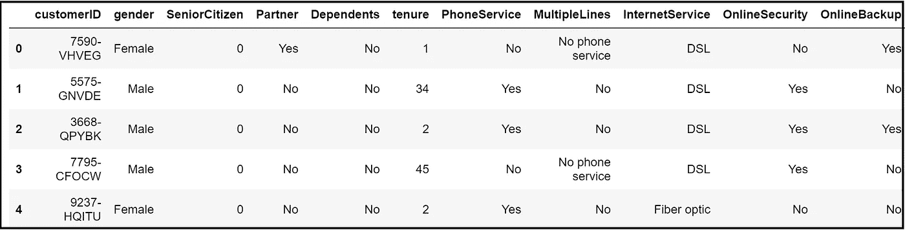

输入数据集的快照(图片由作者提供)

```
dataset.columns
```

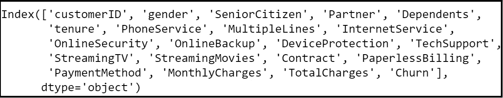

列名列表(作者图片)

快速描述法显示，电信客户平均停留 32 个月，每月支付 64 美元。但是，这可能是因为不同的客户有不同的合同。

```
dataset.describe()
```

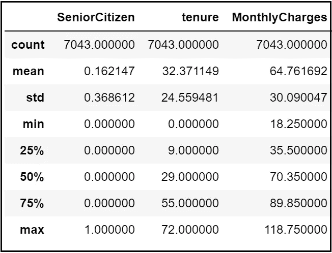

描述方法(图片由作者提供)

从表面上看，我们可以假设数据集包含几个数字和分类列，提供关于客户交易的各种信息。

```
dataset.dtypes
```

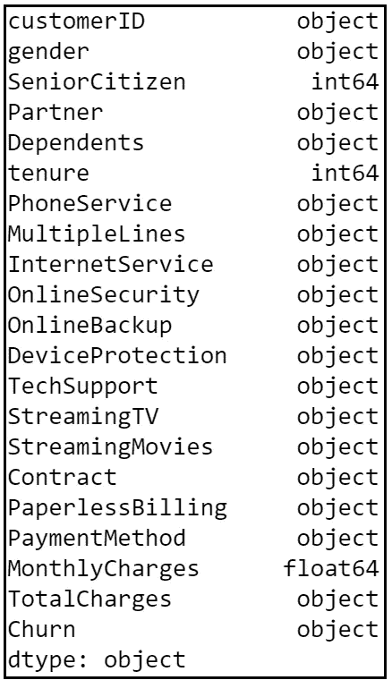

列数据类型(作者图片)

**重新验证列数据类型和缺失值:**始终关注数据集中缺失的值。缺少的值可能会扰乱模型的构建和准确性。因此，在比较和选择模型之前，我们需要考虑缺失值(如果有的话)。

```
dataset.columns.to_series().groupby(dataset.dtypes).groups
```


聚合列数据类型(按作者分类的图片)

数据集包含 7043 行和 21 列，数据集中似乎没有缺失值。

```
dataset.info()
```

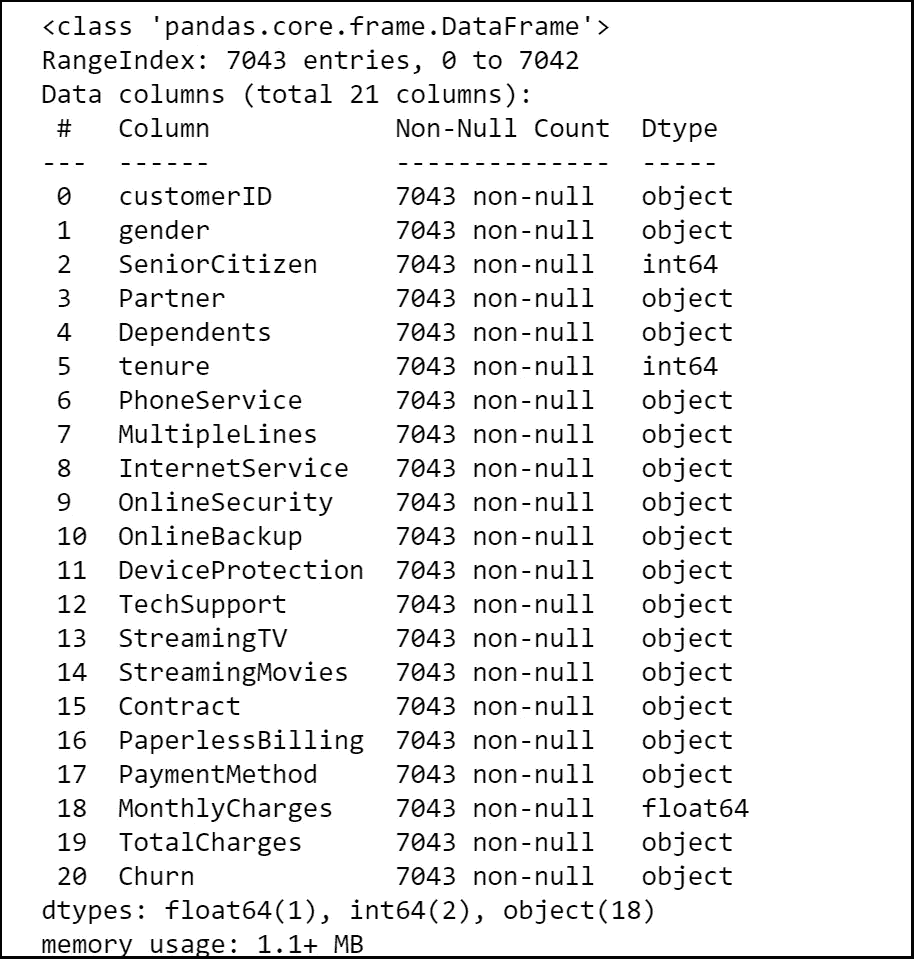

数据结构(图片由作者提供)

```
dataset.isna().any()
```

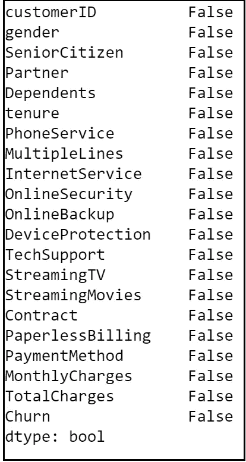

检查 NA(图片由作者提供)

**识别唯一值:**“付款方式”和“合同”是数据集中的两个分类变量。当我们查看每个分类变量中的唯一值时，我们会发现客户要么是按月滚动合同，要么是一年/两年的固定合同。此外，他们通过信用卡、银行转账或电子支票支付账单。

```
#Unique values in each categorical variable:dataset["PaymentMethod"].nunique()dataset["PaymentMethod"].unique()dataset["Contract"].nunique()dataset["Contract"].unique()
```

**第五步:检查目标变量分布:**我们来看看流失值的分布。这是检验数据集是否支持任何类别不平衡问题的一个非常简单而关键的步骤。正如您在下面看到的，数据集是不平衡的，活跃客户的比例比他们的对手高。

```
dataset["Churn"].value_counts()
```

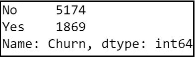

流失值的分布(按作者分类的图片)

**第六步:清理数据集:**

```
dataset['TotalCharges'] = pd.to_numeric(dataset['TotalCharges'],errors='coerce')dataset['TotalCharges'] = dataset['TotalCharges'].astype("float")
```

**第 7 步:处理缺失数据:**正如我们前面看到的，所提供的数据没有缺失值，因此这一步对于所选的数据集是不需要的。我想在这里展示这些步骤，以供将来参考。

```
dataset.info()
```


数据结构(图片由作者提供)

```
dataset.isna().any()
```


检查 NA(图片由作者提供)

**以编程方式查找平均值并填充缺失值:**如果我们在数据集的数字列中有任何缺失值，那么我们应该查找每一列的平均值并填充它们缺失的值。下面是以编程方式执行相同步骤的一段代码。

```
na_cols = dataset.isna().any()na_cols = na_cols[na_cols == True].reset_index()na_cols = na_cols["index"].tolist()for col in dataset.columns[1:]:
     if col in na_cols:
        if dataset[col].dtype != 'object':
             dataset[col] =  dataset[col].fillna(dataset[col].mean()).round(0)
```

**重新验证 NA:**重新验证并确保数据集中不再有空值总是一个好的做法。

```
dataset.isna().any()
```


重新验证 NA(图片由作者提供)

**步骤 8:标签编码二进制数据:**机器学习算法通常只能将数值作为它们的独立变量。因此，标签编码非常关键，因为它们用适当的数值对分类标签进行编码。这里我们对所有只有两个唯一值的分类变量进行标签编码。任何具有两个以上唯一值的分类变量都将在后面的部分中用标签编码和一键编码来处理。

```
#Create a label encoder objectle = LabelEncoder()# Label Encoding will be used for columns with 2 or less unique values
le_count = 0
for col in dataset.columns[1:]:
    if dataset[col].dtype == 'object':
        if len(list(dataset[col].unique())) <= 2:
            le.fit(dataset[col])
            dataset[col] = le.transform(dataset[col])
            le_count += 1
print('{} columns were label encoded.'.format(le_count))
```

# B 部分:数据评估

**第 9 步:探索性数据分析:**让我们尝试通过独立变量的分布来探索和可视化我们的数据集，以更好地理解数据中的模式，并潜在地形成一些假设。

**步骤 9.1。绘制数值列的直方图:**

```
dataset2 = dataset[['gender', 
'SeniorCitizen', 'Partner','Dependents',
'tenure', 'PhoneService', 'PaperlessBilling',
'MonthlyCharges', 'TotalCharges']]#Histogram:

fig = plt.figure(figsize=(15, 12))
plt.suptitle('Histograms of Numerical Columns\n',horizontalalignment="center",fontstyle = "normal", fontsize = 24, fontfamily = "sans-serif")
for i in range(dataset2.shape[1]):
    plt.subplot(6, 3, i + 1)
    f = plt.gca()
    f.set_title(dataset2.columns.values[i])vals = np.size(dataset2.iloc[:, i].unique())
    if vals >= 100:
        vals = 100

plt.hist(dataset2.iloc[:, i], bins=vals, color = '#ec838a')
plt.tight_layout(rect=[0, 0.03, 1, 0.95])
```

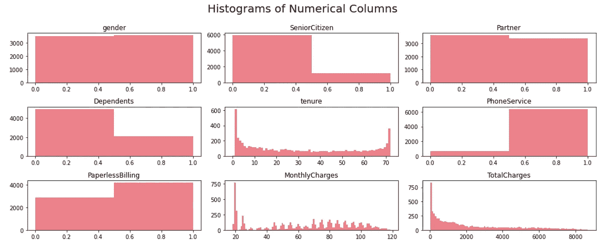

数字柱直方图(图片由作者提供)

可以根据数值变量的直方图进行一些观察:

*   性别分布显示，该数据集的特点是男性和女性客户的比例相对相等。在我们的数据集中，几乎一半的顾客是女性，而另一半是男性。
*   数据集中的大多数客户都是年轻人。
*   似乎没有多少顾客有家属，而几乎一半的顾客有伴侣。
*   组织中有许多新客户(不到 10 个月),然后是平均停留超过 70 个月的忠诚客户群。
*   大多数客户似乎有电话服务，3/4 的客户选择了无纸化计费
*   每个客户的月费在 18 美元到 118 美元之间，其中 20 美元的客户占很大比例。

**第 9.2 步。分析分类变量的分布:**

**9.2.1。合同类型分布:**大多数客户似乎都与电信公司建立了预付费连接。另一方面，1 年期和 2 年期合同的客户比例大致相同。

```
contract_split = dataset[[ "customerID", "Contract"]]
sectors = contract_split .groupby ("Contract")
contract_split = pd.DataFrame(sectors["customerID"].count())
contract_split.rename(columns={'customerID':'No. of customers'}, inplace=True)ax =  contract_split[["No. of customers"]].plot.bar(title = 'Customers by Contract Type',legend =True, table = False, 
grid = False,  subplots = False,figsize =(12, 7), color ='#ec838a', 
fontsize = 15, stacked=False)plt.ylabel('No. of Customers\n',
horizontalalignment="center",fontstyle = "normal", 
fontsize = "large", fontfamily = "sans-serif")plt.xlabel('\n Contract Type',
horizontalalignment="center",fontstyle = "normal", 
fontsize = "large", fontfamily = "sans-serif")plt.title('Customers by Contract Type \n',
horizontalalignment="center",fontstyle = "normal", 
fontsize = "22", fontfamily = "sans-serif")plt.legend(loc='top right', fontsize = "medium")
plt.xticks(rotation=0, horizontalalignment="center")
plt.yticks(rotation=0, horizontalalignment="right")x_labels = np.array(contract_split[["No. of customers"]])def add_value_labels(ax, spacing=5):   
    for rect in ax.patches:      
        y_value = rect.get_height()
        x_value = rect.get_x() + rect.get_width() / 2       
        space = spacing        
        va = 'bottom'      
        if y_value < 0:           
            space *= -1            
            va = 'top'       
        label = "{:.0f}".format(y_value)      

            ax.annotate(
            label,                      
            (x_value, y_value),         
            xytext=(0, space),          
            textcoords="offset points", 
            ha='center',                
            va=va)  

add_value_labels(ax)
```

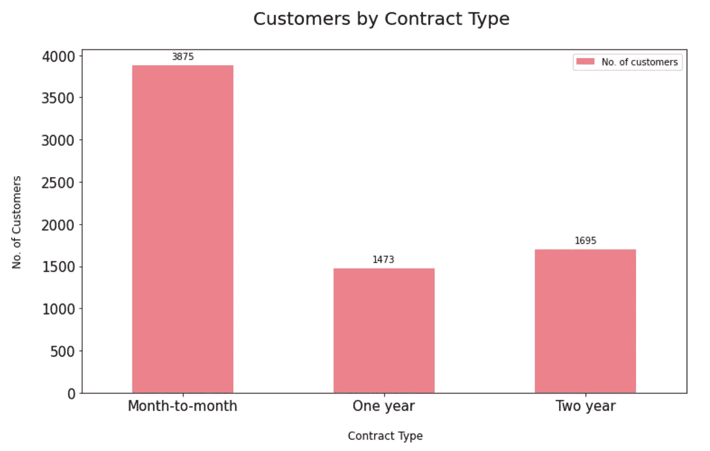

按合同类型划分的客户分布(按作者划分的图片)

**9.2.2 支付方式类型分布:**数据集表明，客户最喜欢以电子方式支付账单，其次是银行转账、信用卡和邮寄支票。

```
payment_method_split = dataset[[ "customerID", "PaymentMethod"]]
sectors = payment_method_split  .groupby ("PaymentMethod")
payment_method_split  = pd.DataFrame(sectors["customerID"].count())
payment_method_split.rename(columns={'customerID':'No. of customers'}, inplace=True)ax =  payment_method_split [["No. of customers"]].plot.bar(title = 'Customers by Payment Method', legend =True, table = False, grid = False, subplots = False,  figsize =(15, 10),color ='#ec838a', fontsize = 15, stacked=False)plt.ylabel('No. of Customers\n',
horizontalalignment="center",fontstyle = "normal", 
fontsize = "large", fontfamily = "sans-serif")plt.xlabel('\n Contract Type',
horizontalalignment="center",fontstyle = "normal", 
fontsize = "large", fontfamily = "sans-serif")plt.title('Customers by Payment Method \n',
horizontalalignment="center", fontstyle = "normal", fontsize = "22", fontfamily = "sans-serif")plt.legend(loc='top right', fontsize = "medium")
plt.xticks(rotation=0, horizontalalignment="center")
plt.yticks(rotation=0, horizontalalignment="right")x_labels = np.array(payment_method_split [["No. of customers"]])def add_value_labels(ax, spacing=5):   
    for rect in ax.patches:      
        y_value = rect.get_height()
        x_value = rect.get_x() + rect.get_width() / 2       
        space = spacing        
        va = 'bottom'      
        if y_value < 0:           
            space *= -1            
            va = 'top'       
        label = "{:.0f}".format(y_value)

           ax.annotate(label,
           (x_value, y_value),         
            xytext=(0, space),textcoords="offset points", 
            ha='center',va=va)add_value_labels(ax)
```

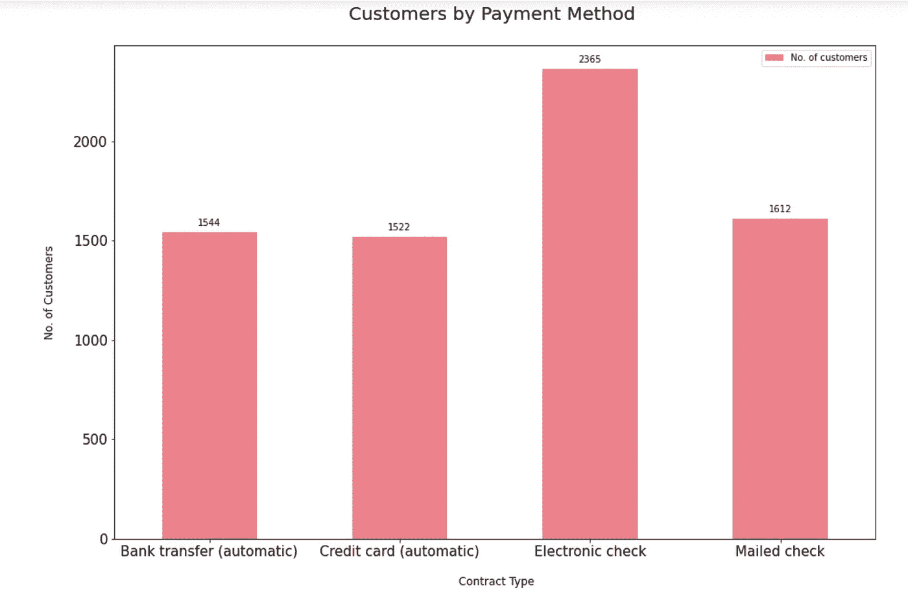

按支付方式划分的客户分布(按作者划分的图片)

9.2.3。标签编码分类变量的分布:

```
services= ['PhoneService','MultipleLines',
'InternetService','OnlineSecurity',  'OnlineBackup','DeviceProtection',
'TechSupport','StreamingTV','StreamingMovies']fig, axes = plt.subplots(nrows = 3,ncols = 3,
figsize = (15,12))
for i, item in enumerate(services): if i < 3:
    ax = dataset[item].value_counts().plot(
    kind = 'bar',ax=axes[i,0],
    rot = 0, color ='#f3babc' )

    elif i >=3 and i < 6:
    ax = dataset[item].value_counts().plot(
    kind = 'bar',ax=axes[i-3,1],
    rot = 0,color ='#9b9c9a')

    elif i < 9:
    ax = dataset[item].value_counts().plot(
    kind = 'bar',ax=axes[i-6,2],rot = 0,
    color = '#ec838a')ax.set_title(item)
```

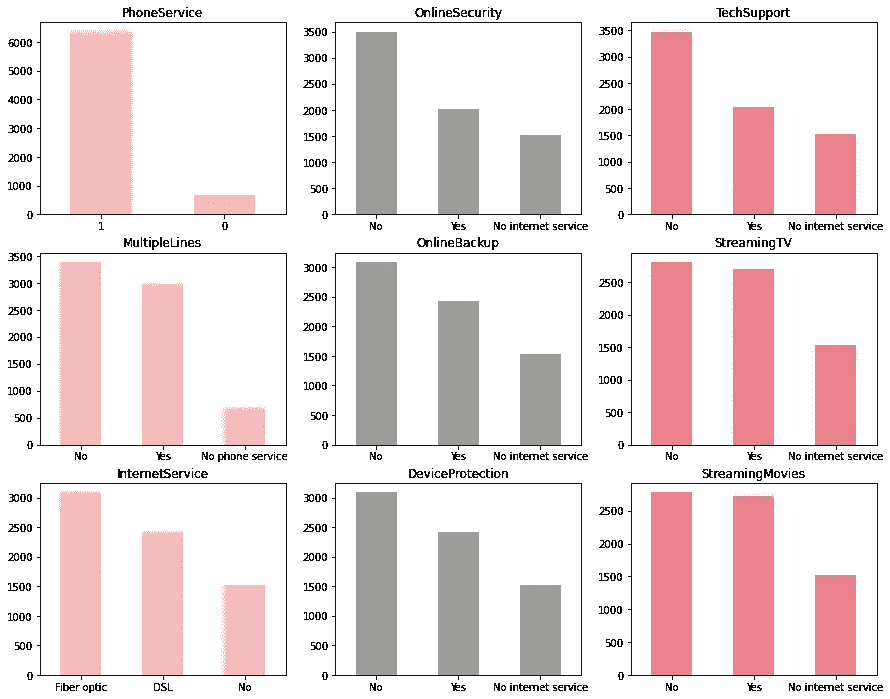

标签编码分类变量的分布(图片由作者提供)

*   大多数客户拥有电话服务，其中几乎一半的客户拥有多条线路。
*   四分之三的客户选择了通过光纤和 DSL 连接的互联网服务，近一半的互联网用户订阅了流媒体电视和电影。
*   利用在线备份、设备保护、技术支持和在线安全功能的客户是少数。

**第 9.3 步:通过分类变量分析流失率:**

**9.3.1。整体流失率:**对整体流失率的初步观察显示，约 74%的客户是活跃的。如下图所示，这是一个不平衡的分类问题。当每个类的实例数量大致相等时，机器学习算法工作得很好。由于数据集是倾斜的，我们在选择模型选择的指标时需要记住这一点。

```
import matplotlib.ticker as mtick
churn_rate = dataset[["Churn", "customerID"]]
churn_rate ["churn_label"] = pd.Series(
np.where((churn_rate["Churn"] == 0), "No", "Yes"))sectors = churn_rate .groupby ("churn_label")
churn_rate = pd.DataFrame(sectors["customerID"].count())churn_rate ["Churn Rate"] = (
churn_rate ["customerID"]/ sum(churn_rate ["customerID"]) )*100ax =  churn_rate[["Churn Rate"]].plot.bar(title = 'Overall Churn Rate',legend =True, table = False,grid = False,  subplots = False, 
figsize =(12, 7), color = '#ec838a', fontsize = 15, stacked=False, 
ylim =(0,100))plt.ylabel('Proportion of Customers',horizontalalignment="center",
fontstyle = "normal", fontsize = "large", fontfamily = "sans-serif")plt.xlabel('Churn',horizontalalignment="center",fontstyle = "normal", fontsize = "large", fontfamily = "sans-serif")plt.title('Overall Churn Rate \n',horizontalalignment="center", 
fontstyle = "normal", fontsize = "22", fontfamily = "sans-serif")plt.legend(loc='top right', fontsize = "medium")
plt.xticks(rotation=0, horizontalalignment="center")
plt.yticks(rotation=0, horizontalalignment="right")
ax.yaxis.set_major_formatter(mtick.PercentFormatter())x_labels = np.array(churn_rate[["customerID"]])def add_value_labels(ax, spacing=5):   
    for rect in ax.patches:     
        y_value = rect.get_height()
        x_value = rect.get_x() + rect.get_width() / 2       
        space = spacing
        va = 'bottom'        
        if y_value < 0:           
            space *= -1          
            va = 'top'
        label = "{:.1f}%".format(y_value)    

     ax.annotate(label,
                (x_value, y_value),         
                 xytext=(0, space),
                 textcoords="offset points", 
                 ha='center',va=va)add_value_labels(ax)
ax.autoscale(enable=False, axis='both', tight=False)
```

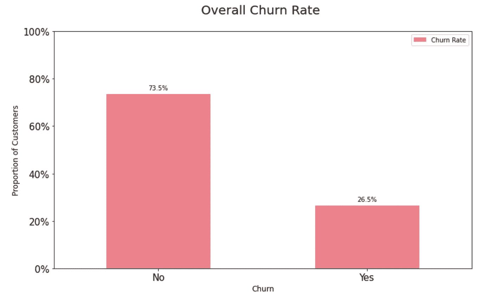

总体流失率(图片由作者提供)

9.3.2。按合同类型划分的客户流失率:与 1 年或 2 年合同的同行相比，预付费或按月连接的客户流失率非常高。

```
import matplotlib.ticker as mtick
contract_churn =
dataset.groupby(
['Contract','Churn']).size().unstack()contract_churn.rename(
columns={0:'No', 1:'Yes'}, inplace=True)colors  = ['#ec838a','#9b9c9a']ax = (contract_churn.T*100.0 / contract_churn.T.sum()).T.plot(kind='bar',width = 0.3,stacked = True,rot = 0,figsize = (12,7),color = colors)plt.ylabel('Proportion of Customers\n',
horizontalalignment="center",fontstyle = "normal", 
fontsize = "large", fontfamily = "sans-serif")plt.xlabel('Contract Type\n',horizontalalignment="center",
fontstyle = "normal", fontsize = "large", 
fontfamily = "sans-serif")plt.title('Churn Rate by Contract type \n',
horizontalalignment="center", fontstyle = "normal", 
fontsize = "22", fontfamily = "sans-serif")plt.legend(loc='top right', fontsize = "medium")
plt.xticks(rotation=0, horizontalalignment="center")
plt.yticks(rotation=0, horizontalalignment="right")
ax.yaxis.set_major_formatter(mtick.PercentFormatter())for p in ax.patches:
    width, height = p.get_width(), p.get_height()
    x, y = p.get_xy() 
    ax.text(x+width/2, 
            y+height/2, 
            '{:.1f}%'.format(height), 
            horizontalalignment='center', 
            verticalalignment='center')ax.autoscale(enable=False, axis='both', tight=False)
```

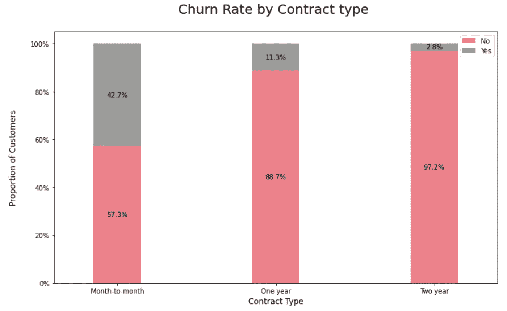

按合同类型分类的流失率(按作者分类的图片)

9.3.3。按付款方式分类的流失率:通过银行转账付款的客户似乎在所有付款方式类别中流失率最低。

```
import matplotlib.ticker as mtick
contract_churn = dataset.groupby(['Contract',
'PaymentMethod']).size().unstack()contract_churn.rename(columns=
{0:'No', 1:'Yes'}, inplace=True)colors  = ['#ec838a','#9b9c9a', '#f3babc' , '#4d4f4c']ax = (contract_churn.T*100.0 / contract_churn.T.sum()).T.plot(
kind='bar',width = 0.3,stacked = True,rot = 0,figsize = (12,7),
color = colors)plt.ylabel('Proportion of Customers\n',
horizontalalignment="center",fontstyle = "normal", 
fontsize = "large", fontfamily = "sans-serif")plt.xlabel('Contract Type\n',horizontalalignment="center",
fontstyle = "normal", fontsize = "large", 
fontfamily = "sans-serif")plt.title('Churn Rate by Payment Method \n',
horizontalalignment="center", fontstyle = "normal", 
fontsize = "22", fontfamily = "sans-serif")plt.legend(loc='top right', fontsize = "medium")
plt.xticks(rotation=0, horizontalalignment="center")
plt.yticks(rotation=0, horizontalalignment="right")
ax.yaxis.set_major_formatter(mtick.PercentFormatter())for p in ax.patches:
    width, height = p.get_width(), p.get_height()
    x, y = p.get_xy() 
    ax.text(x+width/2, 
            y+height/2, 
            '{:.1f}%'.format(height), 
            horizontalalignment='center', 
            verticalalignment='center')ax.autoscale(enable=False, axis='both', tight=False
```

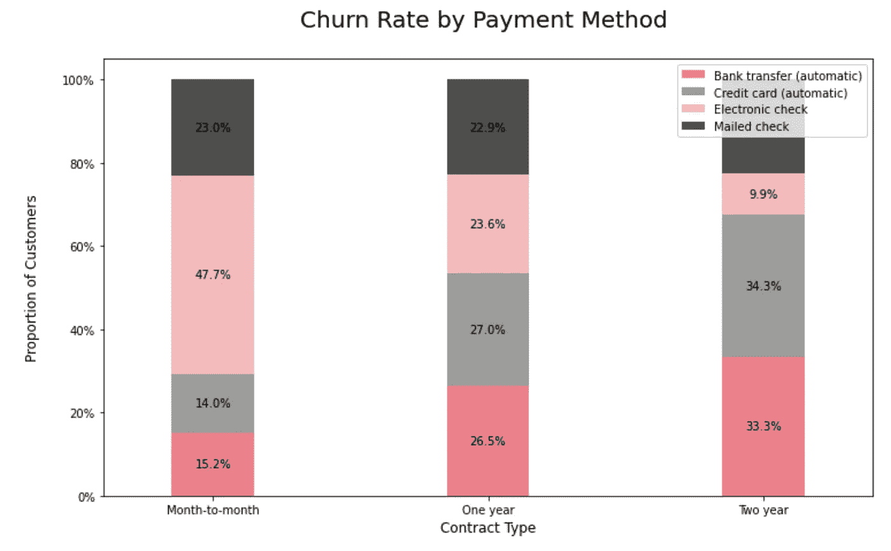

按合同类型分类的流失率(按作者分类的图片)

**步骤 9.4。找到正相关和负相关:**有趣的是，流失率随着月费和年龄的增长而增加。相反，伴侣、受抚养人和任期似乎与流失负相关。让我们在下一步中用图表来看看正相关和负相关。

```
dataset2 = dataset[['SeniorCitizen', 'Partner', 'Dependents',
       'tenure', 'PhoneService', 'PaperlessBilling',
        'MonthlyCharges', 'TotalCharges']]correlations = dataset2.corrwith(dataset.Churn)
correlations = correlations[correlations!=1]
positive_correlations = correlations[
correlations >0].sort_values(ascending = False)
negative_correlations =correlations[
correlations<0].sort_values(ascending = False)print('Most Positive Correlations: \n', positive_correlations)
print('\nMost Negative Correlations: \n', negative_correlations)
```

**第 9.5 步。图正&负相关:**

```
correlations = dataset2.corrwith(dataset.Churn)
correlations = correlations[correlations!=1]correlations.plot.bar(
        figsize = (18, 10), 
        fontsize = 15, 
        color = '#ec838a',
        rot = 45, grid = True)plt.title('Correlation with Churn Rate \n',
horizontalalignment="center", fontstyle = "normal", 
fontsize = "22", fontfamily = "sans-serif")
```

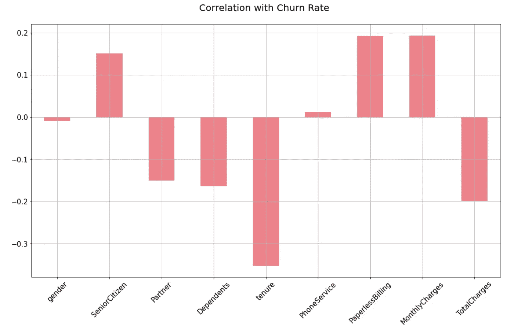

与流失率的相关性(图片由作者提供)

**第 9.6 步。绘制所有自变量的相关矩阵:**相关矩阵有助于我们发现数据集中自变量之间的二元关系。

```
#Set and compute the Correlation Matrix:sn.set(style="white")
corr = dataset2.corr()#Generate a mask for the upper triangle:mask = np.zeros_like(corr, dtype=np.bool)
mask[np.triu_indices_from(mask)] = True#Set up the matplotlib figure and a diverging colormap:f, ax = plt.subplots(figsize=(18, 15))
cmap = sn.diverging_palette(220, 10, as_cmap=True)#Draw the heatmap with the mask and correct aspect ratio:sn.heatmap(corr, mask=mask, cmap=cmap, vmax=.3, center=0,
square=True, linewidths=.5, cbar_kws={"shrink": .5})
```

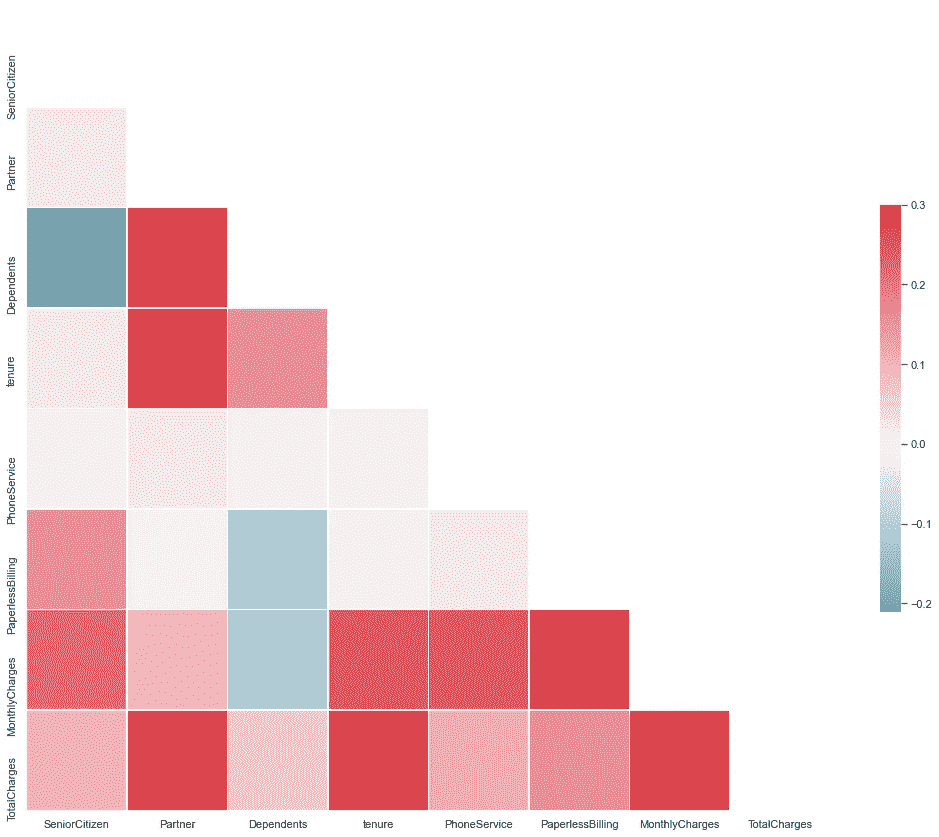

自变量的相关矩阵(图片由作者提供)

**步骤 9.7:使用 VIF 检查多重共线性:**让我们尝试使用可变通货膨胀系数(VIF)来研究多重共线性。与相关矩阵不同，VIF 确定一个变量与数据集中一组其他独立变量的相关性强度。VIF 通常从 1 开始，任何超过 10 的地方都表明自变量之间的高度多重共线性。

```
def calc_vif(X):# Calculating VIF
    vif = pd.DataFrame()
    vif["variables"] = X.columns
    vif["VIF"] = [variance_inflation_factor(X.values, i) 
    for i in range(X.shape[1])]return(vif)dataset2 = dataset[['gender', 
'SeniorCitizen', 'Partner', 'Dependents',
'tenure', 'PhoneService',
'PaperlessBilling','MonthlyCharges',
'TotalCharges']]calc_vif(dataset2)
```

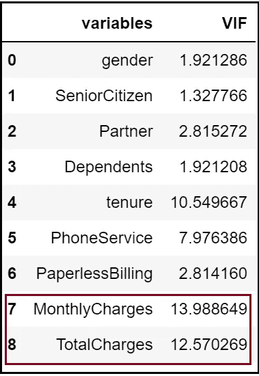

计算 VIF(图片作者)

我们可以看到“每月费用”和“总费用”具有很高的 VIF 值。

```
'Total Charges' seem to be collinear with 'Monthly Charges'.#Check colinearity:

dataset2[['MonthlyCharges', 'TotalCharges']].
plot.scatter(
figsize = (15, 10), 
x ='MonthlyCharges',
y='TotalCharges', 
color =  '#ec838a')plt.title('Collinearity of Monthly Charges and Total Charges \n',
horizontalalignment="center", fontstyle = "normal", fontsize = "22", fontfamily = "sans-serif")
```

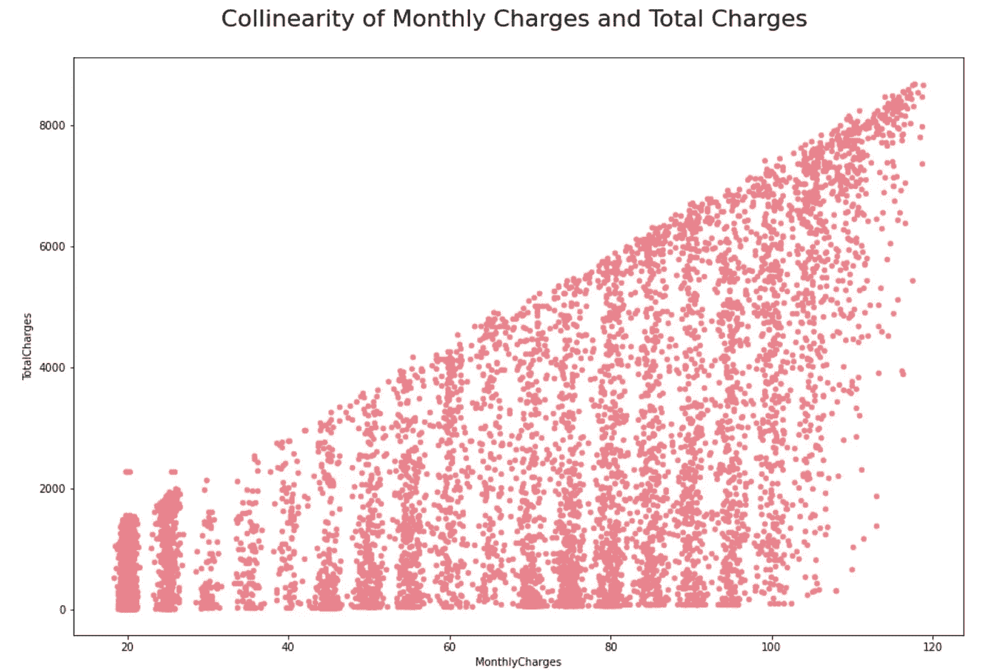

每月费用和总费用的共线性(图片由作者提供)

让我们尝试删除其中一个相关要素，看看它是否有助于降低相关要素之间的多重共线性:

```
#Dropping 'TotalCharges':

dataset2 = dataset2.drop(columns = "TotalCharges")#Revalidate Colinearity:dataset2 = dataset[['gender', 
'SeniorCitizen', 'Partner', 'Dependents',
'tenure', 'PhoneService', 'PaperlessBilling',
'MonthlyCharges']]calc_vif(dataset2)#Applying changes in the main dataset:

dataset = dataset.drop(columns = "TotalCharges")
```


计算 VIF(图片作者)

在我们的例子中，在去掉“总费用”变量后，所有独立变量的 VIF 值都大大降低了。

**探索性数据分析结束语:**

让我们试着总结一下这次 EDA 的一些关键发现:

*   数据集没有任何缺失或错误的数据值。
*   与目标特征最强正相关的是月费和年龄，而与伴侣、家属和任期负相关。
*   数据集不平衡，大多数客户都很活跃。
*   每月费用和总费用之间存在多重共线性。总费用的下降大大降低了 VIF 值。
*   数据集中的大多数客户都是年轻人。
*   组织中有许多新客户(不到 10 个月),随后是 70 个月以上的忠实客户群。
*   大多数客户似乎都有电话服务，每个客户的月费在 18 美元到 118 美元之间。
*   如果订阅了通过电子支票支付的服务，月结用户也很有可能流失。

**步骤 10:对分类数据进行编码:**任何具有两个以上唯一值的分类变量都已经在 pandas 中使用 get_dummies 方法进行了标签编码和一键编码。

```
#Incase if user_id is an object:

identity = dataset["customerID"]dataset = dataset.drop(columns="customerID")#Convert rest of categorical variable into dummy:dataset= pd.get_dummies(dataset)#Rejoin userid to dataset:dataset = pd.concat([dataset, identity], axis = 1)
```

**第 11 步:将数据集分成因变量和自变量:**现在我们需要将数据集分成 X 和 y 值。y 将是“变动”列，而 X 将是数据集中独立变量的剩余列表。

```
#Identify response variable:

response = dataset["Churn"]dataset = dataset.drop(columns="Churn")
```

**第十二步:生成训练和测试数据集:**让我们将主数据集解耦为 80%-20%比例的训练和测试集。

```
X_train, X_test, y_train, y_test = train_test_split(dataset, response,stratify=response, test_size = 0.2, #use 0.9 if data is huge.random_state = 0)#to resolve any class imbalance - use stratify parameter.print("Number transactions X_train dataset: ", X_train.shape)
print("Number transactions y_train dataset: ", y_train.shape)
print("Number transactions X_test dataset: ", X_test.shape)
print("Number transactions y_test dataset: ", y_test.shape)
```

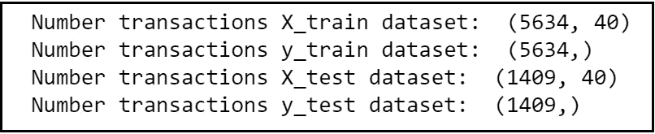

训练和测试数据集(图片由作者提供)

**步骤 13:移除标识符:**将“customerID”从训练和测试数据帧中分离出来。

```
train_identity = X_train['customerID']
X_train = X_train.drop(columns = ['customerID'])test_identity = X_test['customerID']
X_test = X_test.drop(columns = ['customerID'])
```

**步骤 14:进行特征缩放:**在进行任何机器学习(分类)算法之前，标准化变量是非常重要的，以便所有的训练和测试变量都在 0 到 1 的范围内缩放。

```
sc_X = StandardScaler()
X_train2 = pd.DataFrame(sc_X.fit_transform(X_train))
X_train2.columns = X_train.columns.values
X_train2.index = X_train.index.values
X_train = X_train2X_test2 = pd.DataFrame(sc_X.transform(X_test))
X_test2.columns = X_test.columns.values
X_test2.index = X_test.index.values
X_test = X_test2
```

# C 部分:型号选择

**步骤 15.1:比较基线分类算法(第一次迭代):**让我们在训练数据集上对每个分类算法进行建模，并评估它们的准确性和标准偏差分数。

分类准确性是比较基准算法的最常见的分类评估指标之一，因为它是正确预测的数量与总预测的比率。然而，当我们有阶级不平衡的问题时，这不是理想的衡量标准。因此，让我们根据“平均 AUC”值对结果进行排序，该值只不过是模型区分阳性和阴性类别的能力。

```
models = []models.append(('Logistic Regression', LogisticRegression(solver='liblinear', random_state = 0,
                                                         class_weight='balanced')))models.append(('SVC', SVC(kernel = 'linear', random_state = 0)))models.append(('Kernel SVM', SVC(kernel = 'rbf', random_state = 0)))models.append(('KNN', KNeighborsClassifier(n_neighbors = 5, metric = 'minkowski', p = 2)))models.append(('Gaussian NB', GaussianNB()))models.append(('Decision Tree Classifier',
               DecisionTreeClassifier(criterion = 'entropy', random_state = 0)))models.append(('Random Forest', RandomForestClassifier(
    n_estimators=100, criterion = 'entropy', random_state = 0)))#Evaluating Model Results:acc_results = []
auc_results = []
names = []# set table to table to populate with performance results
col = ['Algorithm', 'ROC AUC Mean', 'ROC AUC STD', 
       'Accuracy Mean', 'Accuracy STD']model_results = pd.DataFrame(columns=col)
i = 0# Evaluate each model using k-fold cross-validation:for name, model in models:
    kfold = model_selection.KFold(
        n_splits=10, random_state=0)# accuracy scoring:
cv_acc_results = model_selection.cross_val_score(  
model, X_train, y_train, cv=kfold, scoring='accuracy')# roc_auc scoring:
cv_auc_results = model_selection.cross_val_score(  
model, X_train, y_train, cv=kfold, scoring='roc_auc')acc_results.append(cv_acc_results)
    auc_results.append(cv_auc_results)
    names.append(name)
    model_results.loc[i] = [name,
                         round(cv_auc_results.mean()*100, 2),
                         round(cv_auc_results.std()*100, 2),
                         round(cv_acc_results.mean()*100, 2),
                         round(cv_acc_results.std()*100, 2)
                         ]
    i += 1

model_results.sort_values(by=['ROC AUC Mean'], ascending=False)
```

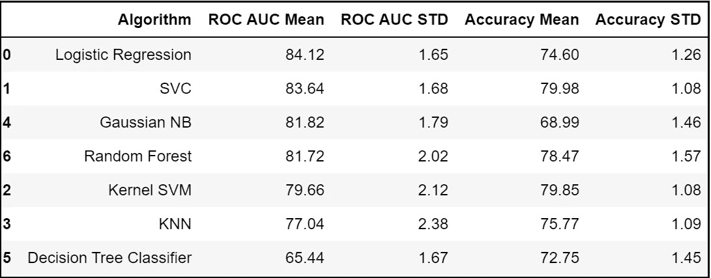

比较基线分类算法第一次迭代(图片由作者提供)

**第 15.2 步。可视化分类算法精度对比:**

**使用精度均值:**

```
fig = plt.figure(figsize=(15, 7))
ax = fig.add_subplot(111)
plt.boxplot(acc_results)
ax.set_xticklabels(names)#plt.ylabel('ROC AUC Score\n',
horizontalalignment="center",fontstyle = "normal", 
fontsize = "large", fontfamily = "sans-serif")#plt.xlabel('\n Baseline Classification Algorithms\n',
horizontalalignment="center",fontstyle = "normal", 
fontsize = "large", fontfamily = "sans-serif")plt.title('Accuracy Score Comparison \n',
horizontalalignment="center", fontstyle = "normal", 
fontsize = "22", fontfamily = "sans-serif")#plt.legend(loc='top right', fontsize = "medium")
plt.xticks(rotation=0, horizontalalignment="center")
plt.yticks(rotation=0, horizontalalignment="right")plt.show()
```

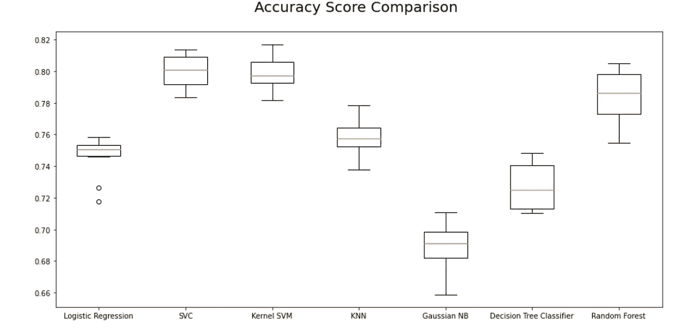

准确度分数比较(图片由作者提供)

**使用 ROC 曲线下面积:**从基线分类算法的第一次迭代中，我们可以看到，对于具有最高平均 AUC 分数的所选数据集，逻辑回归和 SVC 已经优于其他五个模型。让我们在第二次迭代中再次确认我们的结果，如下面的步骤所示。

```
fig = plt.figure(figsize=(15, 7))
ax = fig.add_subplot(111)
plt.boxplot(auc_results)
ax.set_xticklabels(names)#plt.ylabel('ROC AUC Score\n',
horizontalalignment="center",fontstyle = "normal",
fontsize = "large", fontfamily = "sans-serif")#plt.xlabel('\n Baseline Classification Algorithms\n',
horizontalalignment="center",fontstyle = "normal", 
fontsize = "large", fontfamily = "sans-serif")plt.title('ROC AUC Comparison \n',horizontalalignment="center", fontstyle = "normal", fontsize = "22", 
fontfamily = "sans-serif")#plt.legend(loc='top right', fontsize = "medium")
plt.xticks(rotation=0, horizontalalignment="center")
plt.yticks(rotation=0, horizontalalignment="right")plt.show()
```

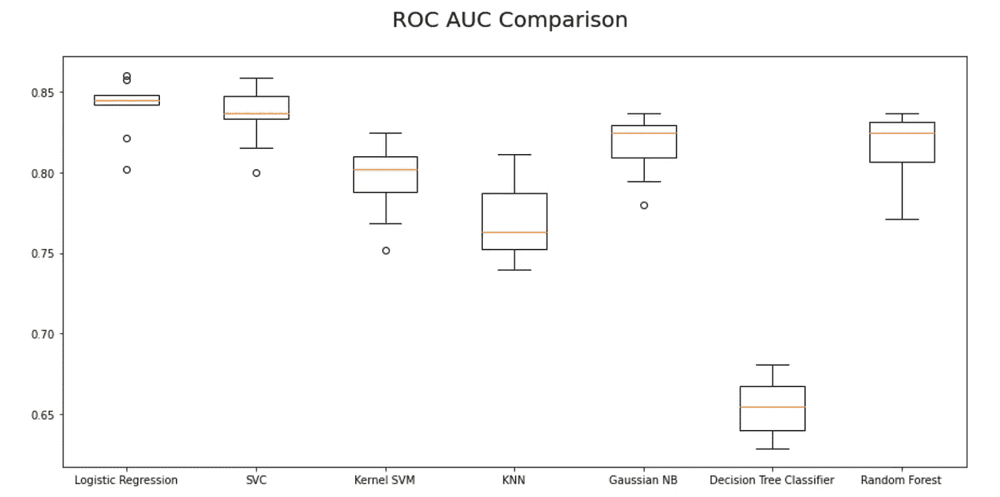

ROC AUC 比较(图片由作者提供)

**步骤 15.3。为基线模型获取正确的参数:**在进行第二次迭代之前，让我们优化参数并最终确定模型选择的评估指标。

**为 KNN 模型确定 K 个邻居的最佳数量:**在第一次迭代中，我们假设 K = 3，但实际上，我们不知道为所选训练数据集提供最大准确度的最佳 K 值是什么。因此，让我们编写一个迭代 20 到 30 次的 for 循环，并给出每次迭代的精度，以便计算出 KNN 模型的 K 个邻居的最佳数量。

```
score_array = []
for each in range(1,25):
    knn_loop = KNeighborsClassifier(n_neighbors = each) #set K neighbor as 3
    knn_loop.fit(X_train,y_train)
    score_array.append(knn_loop.score(X_test,y_test))fig = plt.figure(figsize=(15, 7))
plt.plot(range(1,25),score_array, color = '#ec838a')plt.ylabel('Range\n',horizontalalignment="center",
fontstyle = "normal", fontsize = "large", 
fontfamily = "sans-serif")plt.xlabel('Score\n',horizontalalignment="center",
fontstyle = "normal", fontsize = "large", 
fontfamily = "sans-serif")plt.title('Optimal Number of K Neighbors \n',
horizontalalignment="center", fontstyle = "normal",
 fontsize = "22", fontfamily = "sans-serif")#plt.legend(loc='top right', fontsize = "medium")
plt.xticks(rotation=0, horizontalalignment="center")
plt.yticks(rotation=0, horizontalalignment="right")plt.show()
```

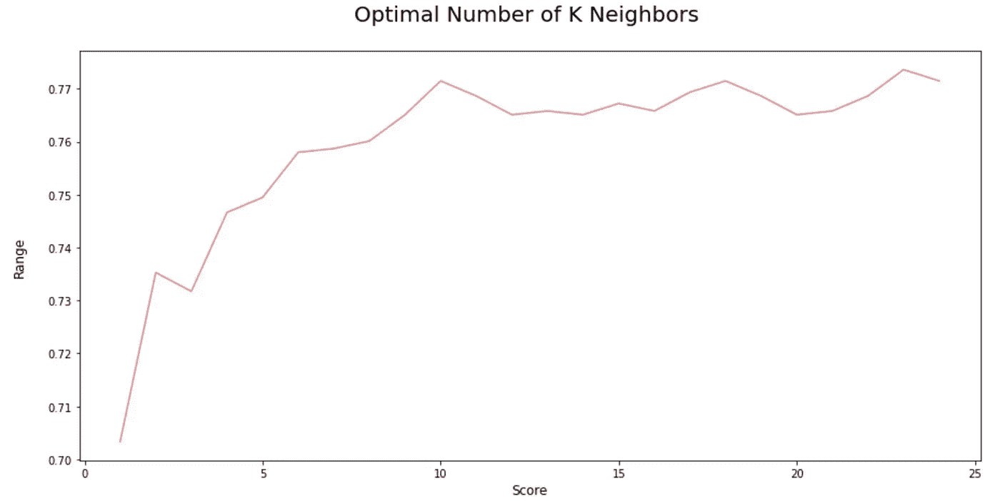

K 近邻的最佳数量(图片由作者提供)

从上面的迭代可以看出，如果我们使用 K = 22，那么我们将得到 78%的最高分。

**确定随机森林模型的最佳树木数量:**与 KNN 模型中的迭代非常相似，这里我们试图找到最佳决策树数量，以组成最佳随机森林。

```
score_array = []
for each in range(1,100):
    rf_loop = RandomForestClassifier(
n_estimators = each, random_state = 1)     rf_loop.fit(X_train,y_train) score_array.append(rf_loop.score(X_test,y_test))

fig = plt.figure(figsize=(15, 7))
plt.plot(range(1,100),score_array, color = '#ec838a')plt.ylabel('Range\n',horizontalalignment="center",
fontstyle = "normal", fontsize = "large", 
fontfamily = "sans-serif")plt.xlabel('Score\n',horizontalalignment="center",
fontstyle = "normal", fontsize = "large", 
fontfamily = "sans-serif")plt.title('Optimal Number of Trees for Random Forest Model \n',horizontalalignment="center", fontstyle = "normal", fontsize = "22", fontfamily = "sans-serif")#plt.legend(loc='top right', fontsize = "medium")
plt.xticks(rotation=0, horizontalalignment="center")
plt.yticks(rotation=0, horizontalalignment="right")plt.show()
```


随机森林模型的最佳树数(图片由作者提供)

从上面的迭代中我们可以看出，当 n_estimators = 72 时，随机森林模型将获得最高的精度分数。

**第 15.4 步。比较基线分类算法(第二次迭代):**

在比较基线分类算法的第二次迭代中，我们将使用 KNN 和随机森林模型的优化参数。此外，我们知道，在流失中，假阴性比假阳性的成本更高，因此让我们使用精确度、召回率和 F2 分数作为模型选择的理想指标。

**步骤 15.4.1。逻辑回归:**

```
# Fitting Logistic Regression to the Training set
classifier = LogisticRegression(random_state = 0)
classifier.fit(X_train, y_train)# Predicting the Test set results
y_pred = classifier.predict(X_test)#Evaluate results
acc = accuracy_score(y_test, y_pred )
prec = precision_score(y_test, y_pred )
rec = recall_score(y_test, y_pred )
f1 = f1_score(y_test, y_pred )
f2 = fbeta_score(y_test, y_pred, beta=2.0)results = pd.DataFrame([['Logistic Regression', 
acc, prec, rec, f1, f2]], columns = ['Model', 
'Accuracy', 'Precision', 'Recall', 'F1 Score', 
'F2 Score'])results = results.sort_values(["Precision", 
"Recall", "F2 Score"], ascending = False)print (results)
```


逻辑回归结果(图片由作者提供)

**步骤 15.4.2。支持向量机(线性分类器):**

```
# Fitting SVM (SVC class) to the Training set
classifier = SVC(kernel = 'linear', random_state = 0)
classifier.fit(X_train, y_train)# Predicting the Test set results y_pred = classifier.predict(X_test)#Evaluate results
acc = accuracy_score(y_test, y_pred )
prec = precision_score(y_test, y_pred )
rec = recall_score(y_test, y_pred)
f1 = f1_score(y_test, y_pred )
f2 = fbeta_score(y_test, y_pred, beta=2.0)model_results = pd.DataFrame(
[['SVM (Linear)', acc, prec, rec, f1, f2]],
columns = ['Model', 'Accuracy', 'Precision', 
'Recall', 'F1 Score', 'F2 Score'])results = results.append(model_results, ignore_index = True)results = results.sort_values(["Precision", 
"Recall", "F2 Score"], ascending = False)print (results)
```

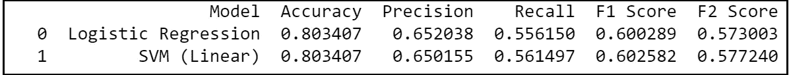

SVM 线性结果(图片由作者提供)

**步骤 15.4.3。k-最近邻:**

```
# Fitting KNN to the Training set:
classifier = KNeighborsClassifier(
n_neighbors = 22, 
metric = 'minkowski', p = 2)
classifier.fit(X_train, y_train)# Predicting the Test set results 
y_pred  = classifier.predict(X_test)#Evaluate results
acc = accuracy_score(y_test, y_pred )
prec = precision_score(y_test, y_pred )
rec = recall_score(y_test, y_pred )
f1 = f1_score(y_test, y_pred )
f2 = fbeta_score(y_test, y_pred, beta=2.0)model_results = pd.DataFrame([['K-Nearest Neighbours', 
acc, prec, rec, f1, f2]], columns = ['Model',
 'Accuracy', 'Precision', 'Recall',
 'F1 Score', 'F2 Score'])results = results.append(model_results, ignore_index = True)results = results.sort_values(["Precision", 
"Recall", "F2 Score"], ascending = False)print (results)
```

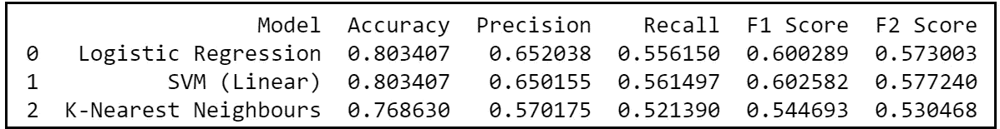

k-最近邻(图片由作者提供)

**步骤 15.4.4。内核 SVM:**

```
# Fitting Kernel SVM to the Training set:
classifier = SVC(kernel = 'rbf', random_state = 0)
classifier.fit(X_train, y_train)# Predicting the Test set results 
y_pred = classifier.predict(X_test)#Evaluate results
acc = accuracy_score(y_test, y_pred )
prec = precision_score(y_test, y_pred )
rec = recall_score(y_test, y_pred )
f1 = f1_score(y_test, y_pred )
f2 = fbeta_score(y_test, y_pred, beta=2.0)model_results = pd.DataFrame([[
'Kernel SVM', acc, prec, rec, f1, f2]],
columns = ['Model', 'Accuracy', 'Precision', 
'Recall', 'F1 Score', 'F2 Score'])results = results.append(model_results, ignore_index = True)results = results.sort_values(["Precision", 
"Recall", "F2 Score"], ascending = False)print (results)
```

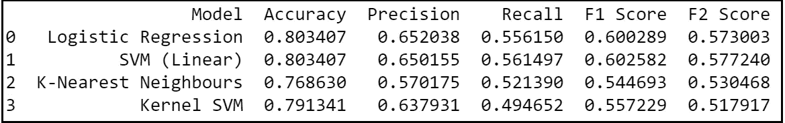

内核 SVM 结果(图片由作者提供)

**步骤 15.4.5。天真的轮空:**

```
# Fitting Naive Byes to the Training set:
classifier = GaussianNB()
classifier.fit(X_train, y_train)# Predicting the Test set results 
y_pred = classifier.predict(X_test)#Evaluate results
acc = accuracy_score(y_test, y_pred )
prec = precision_score(y_test, y_pred )
rec = recall_score(y_test, y_pred )
f1 = f1_score(y_test, y_pred )
f2 = fbeta_score(y_test, y_pred, beta=2.0)model_results = pd.DataFrame([[
'Naive Byes', acc, prec, rec, f1, f2]],
columns = ['Model', 'Accuracy', 'Precision',
'Recall', 'F1 Score', 'F2 Score'])results = results.append(model_results, ignore_index = True)results = results.sort_values(["Precision", 
"Recall", "F2 Score"], ascending = False)print (results)
```

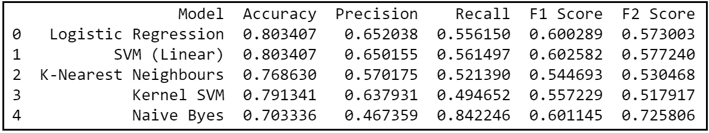

天真的 Byes 结果(作者图片)

**步骤 15.4.6。决策树:**

```
# Fitting Decision Tree to the Training set:classifier = DecisionTreeClassifier(criterion = 'entropy', random_state = 0)
classifier.fit(X_train, y_train)# Predicting the Test set results 
y_pred = classifier.predict(X_test)#Evaluate results
acc = accuracy_score(y_test, y_pred )
prec = precision_score(y_test, y_pred )
rec = recall_score(y_test, y_pred )
f1 = f1_score(y_test, y_pred )
f2 = fbeta_score(y_test, y_pred, beta=2.0)model_results = pd.DataFrame([[
'Decision Tree', acc, prec, rec, f1, f2]],
 columns = ['Model', 'Accuracy', 'Precision', 
'Recall', 'F1 Score', 'F2 Score'])results = results.append(model_results, ignore_index = True)results = results.sort_values(["Precision", 
"Recall", "F2 Score"], ascending = False)print (results)
```

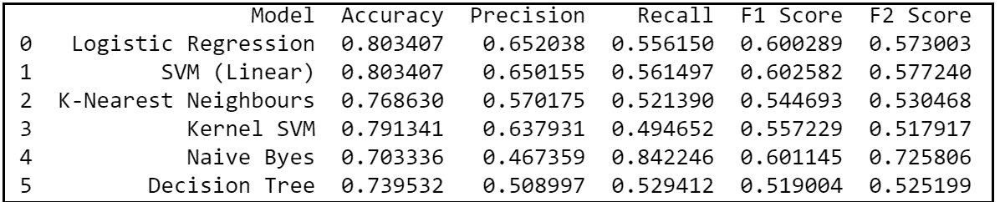

决策树结果(图片由作者提供)

**步骤 15.4.7。随机森林:**

```
# Fitting Random Forest to the Training set:

classifier = RandomForestClassifier(n_estimators = 72, 
criterion = 'entropy', random_state = 0)
classifier.fit(X_train, y_train)# Predicting the Test set results 
y_pred = classifier.predict(X_test)#Evaluate results
from sklearn.metrics import confusion_matrix, 
accuracy_score, f1_score, precision_score, recall_score
acc = accuracy_score(y_test, y_pred )
prec = precision_score(y_test, y_pred )
rec = recall_score(y_test, y_pred )
f1 = f1_score(y_test, y_pred )
f2 = fbeta_score(y_test, y_pred, beta=2.0)model_results = pd.DataFrame([['Random Forest', 
acc, prec, rec, f1, f2]],
columns = ['Model', 'Accuracy', 'Precision', 
'Recall', 'F1 Score', 'F2 Score'])results = results.append(model_results, ignore_index = True)results = results.sort_values(["Precision", 
"Recall", "F2 Score"], ascending = False)print (results)
```

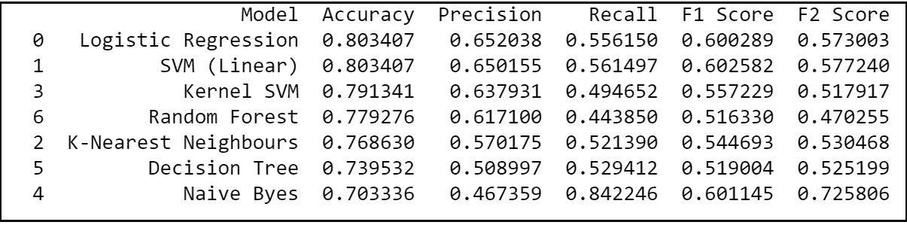

比较基线分类算法第二次迭代(图片由作者提供)

从第二次迭代，我们可以明确地得出结论，逻辑回归是给定数据集的最佳选择模型，因为它具有相对最高的精确度、召回率和 F2 分数的组合；给出最大数量的正确肯定预测，同时最小化假否定。因此，让我们在接下来的章节中尝试使用逻辑回归并评估其性能。

# D 部分:模型评估

**步骤 16:训练&评估选择的模型:**让我们将选择的模型(在这种情况下是逻辑回归)拟合到训练数据集上，并评估结果。

```
classifier = LogisticRegression(random_state = 0,
penalty = 'l2')
classifier.fit(X_train, y_train)# Predict the Test set results
y_pred = classifier.predict(X_test)#Evaluate Model Results on Test Set:
acc = accuracy_score(y_test, y_pred )
prec = precision_score(y_test, y_pred )
rec = recall_score(y_test, y_pred )
f1 = f1_score(y_test, y_pred )
f2 = fbeta_score(y_test, y_pred, beta=2.0)results = pd.DataFrame([['Logistic Regression',
acc, prec, rec, f1, f2]],columns = ['Model', 'Accuracy', 'Precision', 'Recall', 'F1 Score', 'F2 Score'])print (results)
```

**k-Fold 交叉验证:**模型评估通常通过“k-Fold 交叉验证”技术完成，该技术主要帮助我们修正方差。当我们在训练集和测试集上运行模型时获得了良好的准确性，但当模型在另一个测试集上运行时，准确性看起来有所不同，这时就会出现方差问题。

因此，为了解决方差问题，k 折叠交叉验证基本上将训练集分成 10 个折叠，并在测试折叠上测试之前，在 9 个折叠(训练数据集的 9 个子集)上训练模型。这给了我们在所有十种 9 折组合上训练模型的灵活性；为最终确定差异提供了充足的空间。

```
accuracies = cross_val_score(estimator = classifier,
 X = X_train, y = y_train, cv = 10)print("Logistic Regression Classifier Accuracy: 
%0.2f (+/- %0.2f)"  % (accuracies.mean(), 
accuracies.std() * 2))
```


k 倍交叉验证结果(图片由作者提供)

因此，我们的 k-fold 交叉验证结果表明，在任何测试集上运行该模型时，我们的准确率都在 76%到 84%之间。

**在混淆矩阵上可视化结果:**混淆矩阵表明我们有 208+924 个正确预测和 166+111 个错误预测。

准确率=正确预测数/总预测数* 100
错误率=错误预测数/总预测数* 100

我们有 80%的准确率；标志着一个相当好的模型的特征。

```
cm = confusion_matrix(y_test, y_pred) 
df_cm = pd.DataFrame(cm, index = (0, 1), columns = (0, 1))
plt.figure(figsize = (28,20))fig, ax = plt.subplots()
sn.set(font_scale=1.4)
sn.heatmap(df_cm, annot=True, fmt='g'#,cmap="YlGnBu" 
           )
class_names=[0,1]
tick_marks = np.arange(len(class_names))plt.tight_layout()
plt.title('Confusion matrix\n', y=1.1)
plt.xticks(tick_marks, class_names)
plt.yticks(tick_marks, class_names)
ax.xaxis.set_label_position("top")plt.ylabel('Actual label\n')
plt.xlabel('Predicted label\n')
```

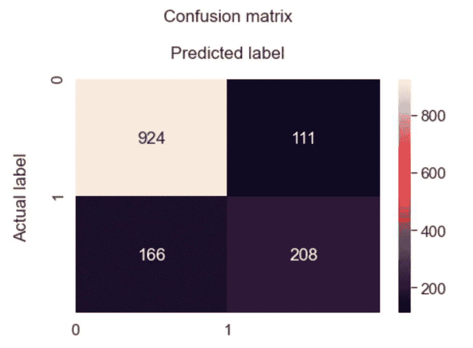

困惑矩阵(图片由作者提供)

**用 ROC 图评估模型:**用 ROC 图重新评估模型很好。ROC 图向我们展示了一个模型基于 AUC 平均分数区分类别的能力。橙色线代表随机分类器的 ROC 曲线，而好的分类器试图尽可能远离该线。如下图所示，微调后的逻辑回归模型显示了更高的 AUC 得分。

```
classifier.fit(X_train, y_train) 
probs = classifier.predict_proba(X_test) 
probs = probs[:, 1] 
classifier_roc_auc = accuracy_score(y_test, y_pred )rf_fpr, rf_tpr, rf_thresholds = roc_curve(y_test, classifier.predict_proba(X_test)[:,1])
plt.figure(figsize=(14, 6))# Plot Logistic Regression ROCplt.plot(rf_fpr, rf_tpr, 
label='Logistic Regression (area = %0.2f)' % classifier_roc_auc)# Plot Base Rate ROC
plt.plot([0,1], [0,1],label='Base Rate' 'k--')plt.xlim([0.0, 1.0])
plt.ylim([0.0, 1.05])plt.ylabel('True Positive Rate \n',horizontalalignment="center",
fontstyle = "normal", fontsize = "medium", 
fontfamily = "sans-serif")plt.xlabel('\nFalse Positive Rate \n',horizontalalignment="center",
fontstyle = "normal", fontsize = "medium", 
fontfamily = "sans-serif")plt.title('ROC Graph \n',horizontalalignment="center", 
fontstyle = "normal", fontsize = "22", 
fontfamily = "sans-serif")plt.legend(loc="lower right", fontsize = "medium")
plt.xticks(rotation=0, horizontalalignment="center")
plt.yticks(rotation=0, horizontalalignment="right")plt.show()
```

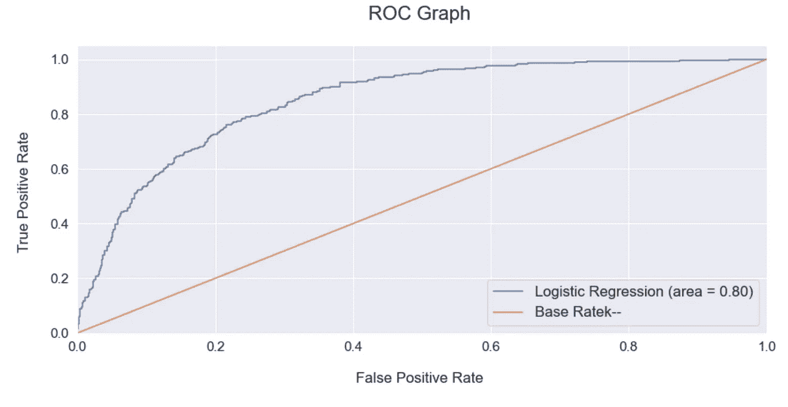

ROC 图(图片由作者提供)

**步骤 17:预测特征重要性:**逻辑回归允许我们确定对预测目标属性有意义的关键特征(在这个项目中为“流失”)。

逻辑回归模型预测，流失率将随着逐月合同、光纤互联网服务、电子支票、支付安全和技术支持的缺失而正增长。

另一方面，如果任何客户订阅了在线证券、一年期合同或选择邮寄支票作为支付媒介，该模型预测与客户流失呈负相关。

```
# Analyzing Coefficientsfeature_importances = pd.concat([
pd.DataFrame(dataset.drop(columns = 'customerID').
columns, columns = ["features"]),
pd.DataFrame(np.transpose(classifier.coef_), 
columns = ["coef"])],axis = 1)
feature_importances.sort_values("coef", ascending = False)
```

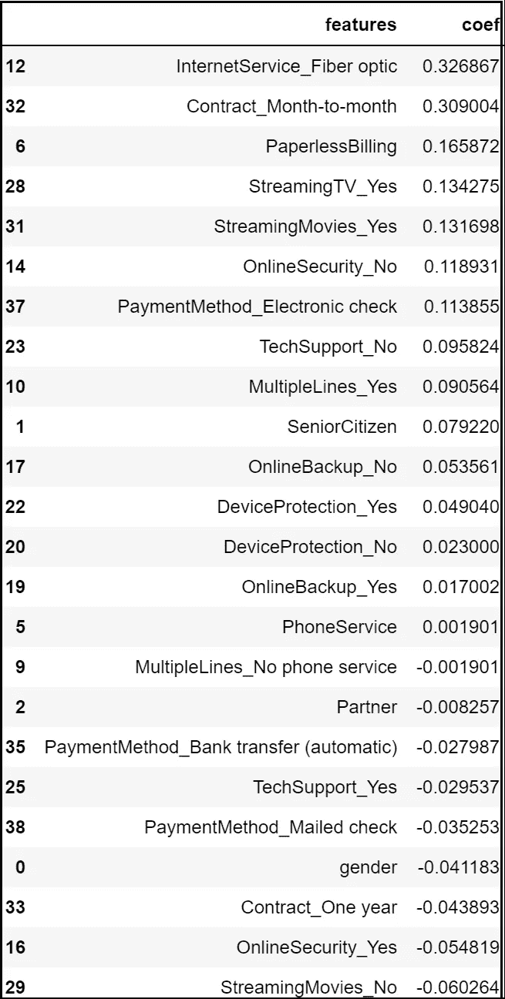

预测功能的重要性(图片由作者提供)

# E 部分:模型改进

模型改进基本上包括为我们提出的机器学习模型选择最佳参数。任何机器学习模型中都有两种类型的参数——第一种类型是模型学习的参数类型；通过运行模型自动找到最佳值。第二类参数是用户在运行模型时可以选择的参数。这样的参数被称为超参数；模型外部的一组可配置值，这些值无法由数据确定，我们正试图通过随机搜索或网格搜索等参数调整技术来优化这些值。

超参数调整可能不会每次都改进模型。例如，当我们试图进一步调优模型时，我们最终得到的准确度分数低于默认分数。我只是在这里演示超参数调整的步骤，以供将来参考。

**步骤 18:通过网格搜索进行超参数调谐:**

```
# Round 1:

# Select Regularization Method   
import time
penalty = ['l1', 'l2']# Create regularization hyperparameter space
C = [0.001, 0.01, 0.1, 1, 10, 100, 1000]# Combine Parameters
parameters = dict(C=C, penalty=penalty)lr_classifier = GridSearchCV(estimator = classifier,
                           param_grid = parameters,
                           scoring = "balanced_accuracy",
                           cv = 10,
                           n_jobs = -1)
t0 = time.time()
lr_classifier  = lr_classifier .fit(X_train, y_train)
t1 = time.time()
print("Took %0.2f seconds" % (t1 - t0))lr_best_accuracy = lr_classifier.best_score_
lr_best_parameters = lr_classifier.best_params_
lr_best_accuracy, lr_best_parameters
```

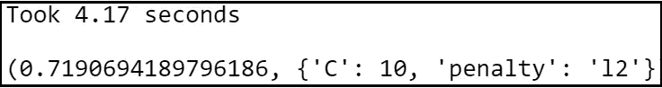

超参数调整-第一轮(图片由作者提供)

```
# Round 2:# Select Regularization Method
import time
penalty = ['l2']# Create regularization hyperparameter space
C = [ 0.0001, 0.001, 0.01, 0.02, 0.05]# Combine Parameters
parameters = dict(C=C, penalty=penalty)lr_classifier = GridSearchCV(estimator = classifier,
                           param_grid = parameters,
                           scoring = "balanced_accuracy",
                           cv = 10,
                           n_jobs = -1)
t0 = time.time()
lr_classifier  = lr_classifier .fit(X_train, y_train)
t1 = time.time()
print("Took %0.2f seconds" % (t1 - t0))lr_best_accuracy = lr_classifier.best_score_
lr_best_parameters = lr_classifier.best_params_
lr_best_accuracy, lr_best_parameters
```

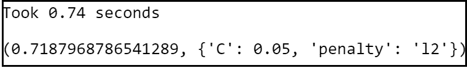

超参数调整-第二轮(图片由作者提供)

**步骤 18.2:最终超参数调整和选择:**

```
lr_classifier = LogisticRegression(random_state = 0, penalty = 'l2')
lr_classifier.fit(X_train, y_train)# Predict the Test set resultsy_pred = lr_classifier.predict(X_test)#probability score
y_pred_probs = lr_classifier.predict_proba(X_test)
y_pred_probs  = y_pred_probs [:, 1]
```

# F 部分:未来预测

**步骤 19:将预测与测试集进行比较:**

```
#Revalidate final results with Confusion Matrix:cm = confusion_matrix(y_test, y_pred) 
print (cm)#Confusion Matrix as a quick Crosstab:

pd.crosstab(y_test,pd.Series(y_pred),
rownames=['ACTUAL'],colnames=['PRED'])#visualize Confusion Matrix:cm = confusion_matrix(y_test, y_pred) 
df_cm = pd.DataFrame(cm, index = (0, 1), columns = (0, 1))
plt.figure(figsize = (28,20))fig, ax = plt.subplots()
sn.set(font_scale=1.4)
sn.heatmap(df_cm, annot=True, fmt='g'#,cmap="YlGnBu" 
           )
class_names=[0,1]
tick_marks = np.arange(len(class_names))
plt.tight_layout()
plt.title('Confusion matrix\n', y=1.1)
plt.xticks(tick_marks, class_names)
plt.yticks(tick_marks, class_names)
ax.xaxis.set_label_position("top")
plt.ylabel('Actual label\n')
plt.xlabel('Predicted label\n')print("Test Data Accuracy: %0.4f" % accuracy_score(y_test, y_pred))
```


困惑矩阵(图片由作者提供)

**步骤 20:格式化最终结果:**不可预测性和风险是任何预测模型的亲密伴侣。因此，在现实世界中，除了绝对的预测结果之外，建立一个倾向评分总是一个好的做法。除了检索二进制估计目标结果(0 或 1)，每个“客户 ID”都可以获得一个额外的倾向得分层，突出显示他们采取目标行动的概率百分比。

```
final_results = pd.concat([test_identity, y_test], axis = 1).dropna()final_results['predictions'] = y_predfinal_results["propensity_to_churn(%)"] = y_pred_probsfinal_results["propensity_to_churn(%)"] = final_results["propensity_to_churn(%)"]*100final_results["propensity_to_churn(%)"]=final_results["propensity_to_churn(%)"].round(2)final_results = final_results[['customerID', 'Churn', 'predictions', 'propensity_to_churn(%)']]final_results ['Ranking'] = pd.qcut(final_results['propensity_to_churn(%)'].rank(method = 'first'),10,labels=range(10,0,-1))print (final_results)
```

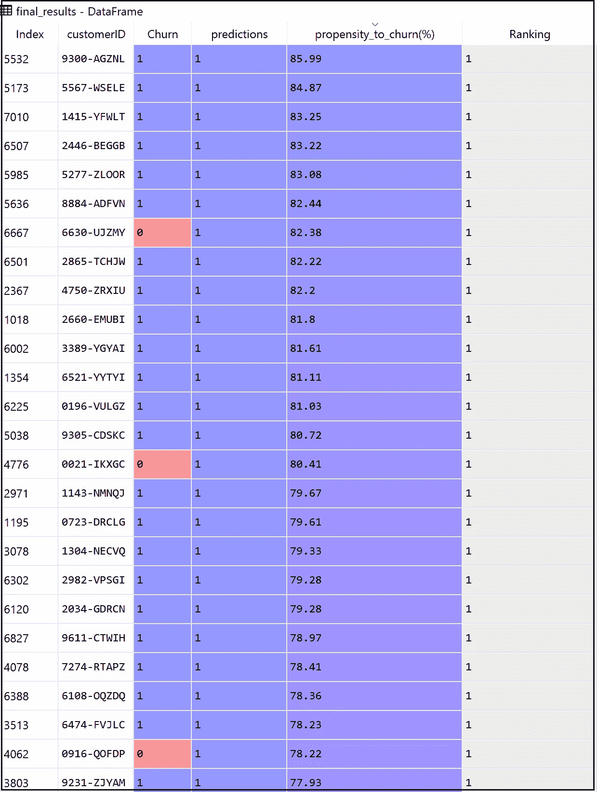

高风险类别(图片由作者提供)

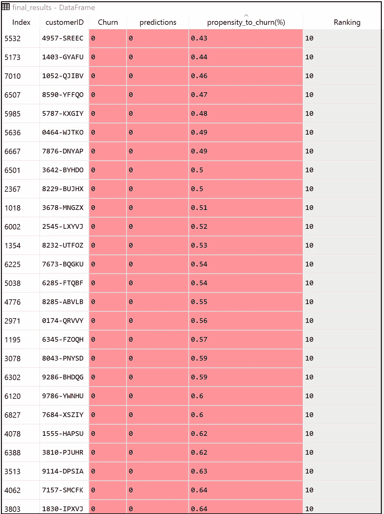

低风险类别(图片由作者提供)

# G 部分:模型部署

最后，使用“joblib”库将模型部署到服务器上，这样我们就可以生产端到端的机器学习框架。稍后，我们可以在任何新的数据集上运行该模型，以预测未来几个月内任何客户流失的概率。

**第 21 步:保存模型:**

```
filename = 'final_model.model'
i = [lr_classifier]
joblib.dump(i,filename)
```

**结论**

因此，简而言之，我们利用 Kaggle 的客户流失数据集来建立一个机器学习分类器，该分类器可以预测任何客户在未来几个月内的流失倾向，准确率达到 76%至 84%。

**接下来是什么？**

*   与组织的销售和营销团队分享您从探索性数据分析部分获得的关于客户人口统计和流失率的关键见解。让销售团队了解与客户流失有积极和消极关系的特征，以便他们能够相应地制定保留计划。
*   此外，根据倾向得分将即将到来的客户分为**高风险**(倾向得分> 80%的客户)、**中风险**(倾向得分在 60-80%之间的客户)和最后**低风险**类别(倾向得分< 60%的客户)。预先关注每个客户群，确保他们的需求得到充分满足。
*   最后，通过计算当前财务季度的流失率来衡量这项任务的投资回报(ROI)。将季度结果与去年或前年的同一季度进行比较，并与贵组织的高级管理层分享结果。

**GitHub 库**

我已经从 Github 的许多人那里学到了(并且还在继续学到)。因此，在一个公共的 [GitHub 库](https://github.com/srees1988/predict-churn-py)中分享我的整个 python 脚本和支持文件，以防它对任何在线搜索者有益。此外，如果您在理解 Python 中有监督的机器学习算法的基础方面需要任何帮助，请随时联系我。乐于分享我所知道的:)希望这有所帮助！

**关于作者**

[](https://srees.org/about) [## Sreejith Sreedharan - Sree

### 数据爱好者。不多不少！你好！我是 Sreejith Sreedharan，又名 Sree 一个永远好奇的数据驱动的…

srees.org](https://srees.org/about)