# 利用 PySpark 和机器学习预测客户流失

> 原文：<https://towardsdatascience.com/predict-customer-churn-with-pyspark-and-machine-learning-981d1eedb00b?source=collection_archive---------45----------------------->

客户流失是指客户终止与公司的关系。它对企业的健康和长期成功有相当大的影响，因为它可能会大大降低收入和利润。根据 Forrester research 的统计，获得新客户的成本是保持现有客户的 5 倍。因此，公司投入时间和资源来识别可能流失的特定客户，并在这些客户决定停止使用公司的服务之前解决他们的问题总是值得的。

在本文中，我们将探索一个名为 Sparkify 的虚构音乐流媒体服务的用户日志数据，并建立有监督的机器学习模型来预测客户是否有可能流失。


# **我们的数据集**

这个项目有两个数据集:大小为 12GB 的完整数据集，以及大小为 128MB 的完整数据集的一个子集。我们将使用 128MB 版本的数据集，它足够小，可以放入本地机器的内存中，就像本文中的例子一样。在其他情况下，为了使用完整的数据集进行模型训练，我们可能需要在像 AWS 这样的云服务上部署一个集群。

让我们快速浏览一下数据集中的所有字段:

```
df.printSchema()root
 |-- artist: string (nullable = true)
 |-- auth: string (nullable = true)
 |-- firstName: string (nullable = true)
 |-- gender: string (nullable = true)
 |-- itemInSession: long (nullable = true)
 |-- lastName: string (nullable = true)
 |-- length: double (nullable = true)
 |-- level: string (nullable = true)
 |-- location: string (nullable = true)
 |-- method: string (nullable = true)
 |-- page: string (nullable = true)
 |-- registration: long (nullable = true)
 |-- sessionId: long (nullable = true)
 |-- song: string (nullable = true)
 |-- status: long (nullable = true)
 |-- ts: long (nullable = true)
 |-- userAgent: string (nullable = true)
 |-- userId: string (nullable = true)
```

页面字段为我们提供了更多关于用户行为的详细信息:

```
df.select('page').dropDuplicates().sort('page').show()+--------------------+
|                page|
+--------------------+
|               About|
|          Add Friend|
|     Add to Playlist|
|              Cancel|
|Cancellation Conf...|
|           Downgrade|
|               Error|
|                Help|
|                Home|
|              Logout|
|            NextSong|
|         Roll Advert|
|       Save Settings|
|            Settings|
|    Submit Downgrade|
|      Submit Upgrade|
|         Thumbs Down|
|           Thumbs Up|
|             Upgrade|
+--------------------+
```

因为 userId 是我们的目标变量，可以帮助我们唯一地识别用户，所以带有空 userId 的日志对于我们预测哪个客户会流失没有帮助。我们将从数据集中删除那些缺少 userId 的记录。

```
df = df.where(col('userId').isNotNull())
df.count()278154
```

# **探索性数据分析**

在我们继续比较频繁用户和不频繁用户之前，我们首先需要考虑一下什么是频繁用户。一个狭义的定义可能只包括那些已经删除了他们的帐户的人，这在我们的数据中被捕获为页面特征取值为“取消确认”的情况。

我们将使用页面的取消确认事件来定义流失。我们将创建一个新的列“churned ”,为我们的模型标记 Churned 用户。

```
Number of users who have churned 52
Number of users who have not churned 173
```

我们可以看到，在这个数据集中，流失类和非流失类的数量不平衡。在这种情况下，我们稍后将使用 F1 分数来评估我们的模型，因为与准确度和精确度相比，它对类别不平衡不太敏感。

**性别影响**

```
there were 19 percent female users churned
there were 26 percent male users churned
```

**影响等级(付费/免费)**

```
there were 23 percent free users churned
there were 21 percent paid users churned
```

**用户听歌时间的影响**

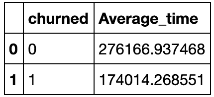

**播放歌曲数量的影响**

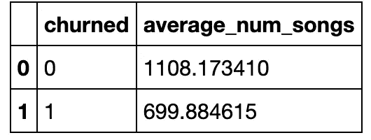

**登记后天数的影响**

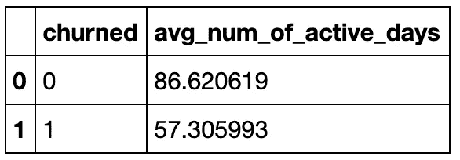

**被浏览页面的影响**

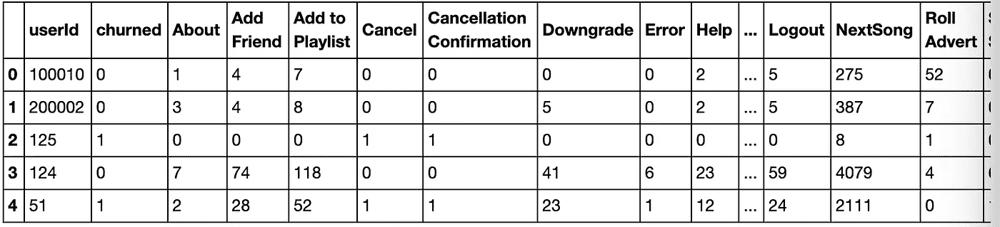

显示每个用户页面事件数量的数据透视表

# **特色工程**

现在我们已经熟悉了数据，我们构建了我们认为有前途的功能，并结合页面事件来训练模型:

```
user_df.printSchema()root
 |-- userId: string (nullable = true)
 |-- churn: long (nullable = true)
 |-- n_act: long (nullable = false)
 |-- n_about: long (nullable = true)
 |-- n_addFriend: long (nullable = true)
 |-- n_addToPlaylist: long (nullable = true)
 |-- n_cancel: long (nullable = true)
 |-- n_downgrade: long (nullable = true)
 |-- n_error: long (nullable = true)
 |-- n_help: long (nullable = true)
 |-- n_home: long (nullable = true)
 |-- n_logout: long (nullable = true)
 |-- n_rollAdvert: long (nullable = true)
 |-- n_saveSettings: long (nullable = true)
 |-- n_settings: long (nullable = true)
 |-- n_submitDowngrade: long (nullable = true)
 |-- n_submitUpgrade: long (nullable = true)
 |-- n_thumbsDown: long (nullable = true)
 |-- n_thumbsUp: long (nullable = true)
 |-- n_upgrade: long (nullable = true)
 |-- playTime: double (nullable = true)
 |-- numSongs: long (nullable = false)
 |-- numArtist: long (nullable = false)
 |-- active_days: double (nullable = true)
 |-- numSession: long (nullable = false)
 |-- encoded_level: double (nullable = true)
 |-- encoded_gender: double (nullable = true)
```

多重共线性增加了系数的标准误差。增加的标准误差，反过来，意味着一些独立变量的系数可能会发现没有明显不同于 0。换句话说，通过过度夸大标准误差，多重共线性使得一些本应显著的变量在统计上变得不显著。如果没有多重共线性(因此标准误差较低)，这些系数可能很重要。

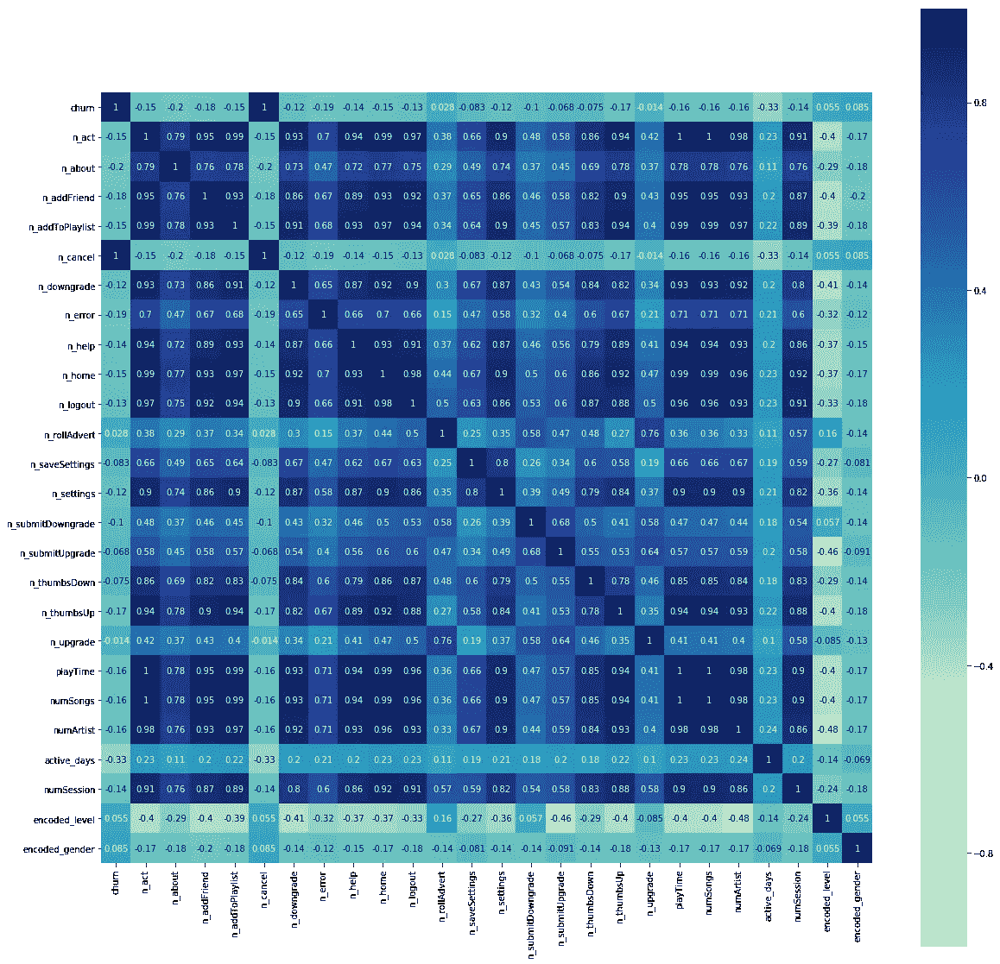

我们可以看到，有一些变量对的相关系数超过 0.8，这意味着那些变量是高度相关的。为了处理多重共线性，我们将尝试两种方法:

*   手动移除相关要素
*   主成分分析

**手动移除相关特征**

我们手动删除上一个热图中相关系数高的变量，并保留其余特征:

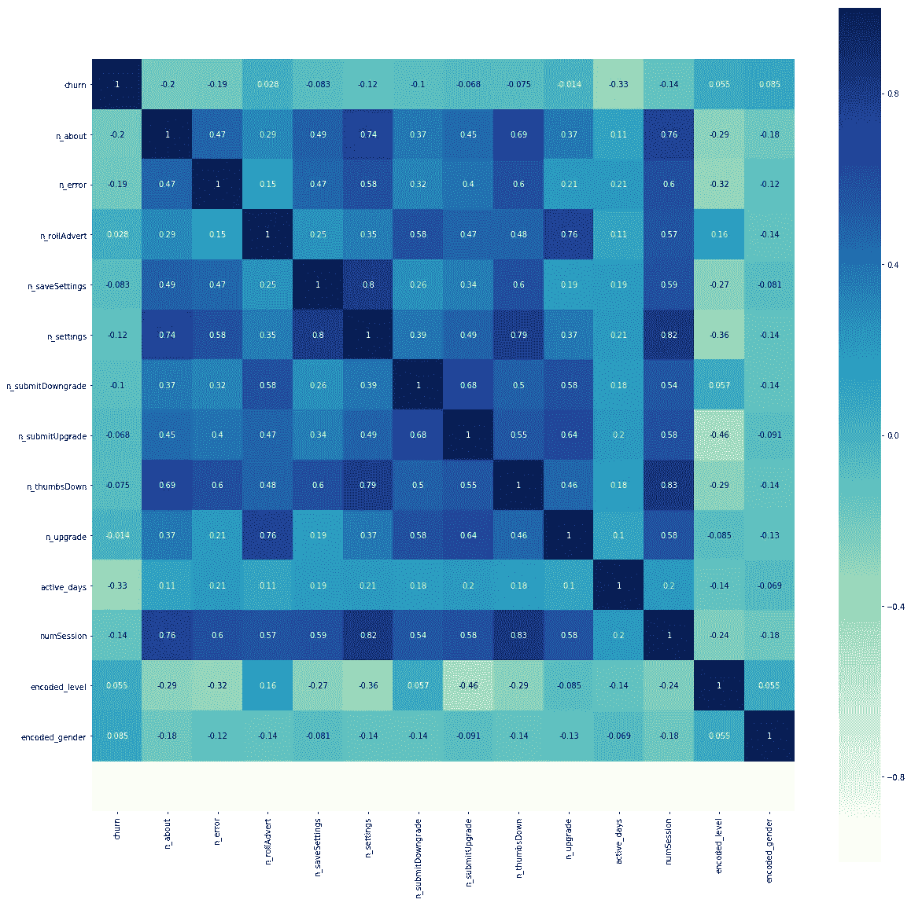

```
 user_df_m.printSchema()root
 |-- userId: string (nullable = true)
 |-- churn: long (nullable = true)
 |-- n_about: long (nullable = true)
 |-- n_error: long (nullable = true)
 |-- n_rollAdvert: long (nullable = true)
 |-- n_saveSettings: long (nullable = true)
 |-- n_settings: long (nullable = true)
 |-- n_submitDowngrade: long (nullable = true)
 |-- n_submitUpgrade: long (nullable = true)
 |-- n_thumbsDown: long (nullable = true)
 |-- n_upgrade: long (nullable = true)
 |-- active_days: double (nullable = true)
 |-- numSession: long (nullable = false)
 |-- encoded_level: double (nullable = true)
 |-- encoded_gender: double (nullable = true)
```

**用 PCA 变换特征**

主成分分析(PCA)是一种统计分析技术，它将可能相关的变量转换为正交线性不相关的值。我们可以将它用于数据压缩等应用，以获得主导的物理过程，并获得机器学习的重要特征。在不丢失太多信息的情况下，它减少了原始数据中的要素数量。

应用 PCA 时，我们需要首先将特征组合成一个向量，并标准化我们的数据:

```
*# Vector Assembler*
user_df_pca = user_df
cols = user_df_pca.drop('userId','churn').columns
assembler = VectorAssembler(inputCols=cols, outputCol='Features')
user_df_pca = assembler.transform(user_df).select('userId', 'churn','Features')

*# Standard Scaler*
scaler= FT.StandardScaler(inputCol='Features', outputCol='scaled_features_1', withStd=**True**)
scalerModel = scaler.fit(user_df_pca)
user_df_pca = scalerModel.transform(user_df_pca)
user_df_pca.select(['userId','churn', 'scaled_features_1']).show(5, truncate = **False**)pca = PCA(k=10, inputCol = scaler.getOutputCol(), outputCol="pcaFeatures")
pca = pca.fit(user_df_pca)

pca_result = pca.transform(user_df_pca).select("userId","churn","pcaFeatures")
```

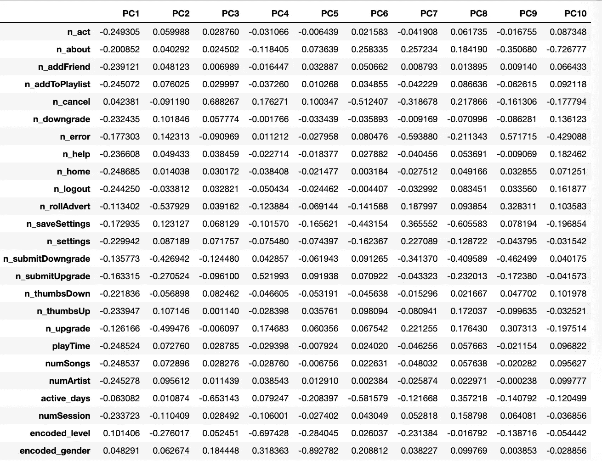

# **型号选择**

为了选择一个好的模型进行最终调优，我们将在 Spark 的 ML 中比较三个不同的分类器模型:

*   逻辑回归
*   决策图表
*   随机森林

**将数据分为训练集和测试集**

从上一节展示的流失分布中，我们知道这是一个不平衡的数据集，只有 1/4 的用户被标记为流失。为了避免随机分裂中的不平衡结果，我们首先使用标签抽样建立一个训练集，然后从整个数据集中减去它们得到测试集。

```
*# prepare training and test data, sample by label*ratio = 0.7train_m = m_features_df.sampleBy('churn', fractions={0:ratio, 1:ratio}, seed=123)
test_m = m_features_df.subtract(train_m)train_pca = pca_features_df.sampleBy('churn', fractions={0:ratio, 1:ratio}, seed=123)
test_pca = pca_features_df.subtract(train_pca)
```

**逻辑回归**

```
*# initialize classifier*
lr = LogisticRegression(maxIter=10)*# evaluator*
evaluator_1 = MulticlassClassificationEvaluator(metricName='f1')*# paramGrid*
paramGrid = ParamGridBuilder() \
    .build()crossval_lr = CrossValidator(estimator=lr,
                          evaluator=evaluator_1, 
                          estimatorParamMaps=paramGrid,
                          numFolds=3)
```

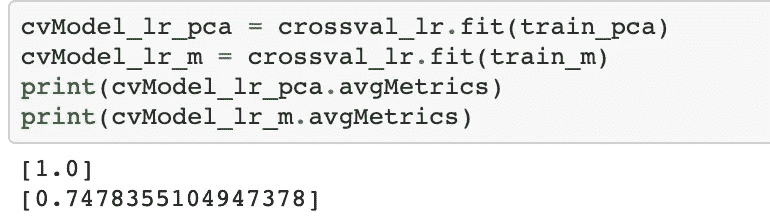

使用测试数据集评估:

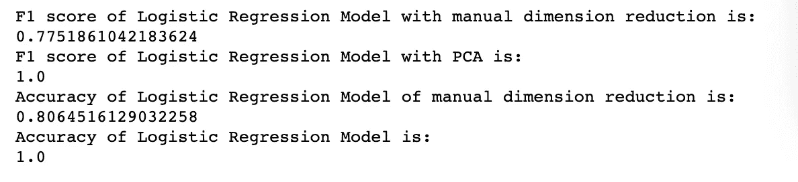

**决策树**

```
*# initialize classifier*
dtc = DecisionTreeClassifier()*# evaluator*
evaluator_2 = MulticlassClassificationEvaluator(metricName='f1')*# paramGrid*
paramGrid = ParamGridBuilder() \
    .build()crossval_dtc = CrossValidator(estimator=dtc,
                          evaluator=evaluator_2, 
                          estimatorParamMaps=paramGrid,
                          numFolds=3)
```

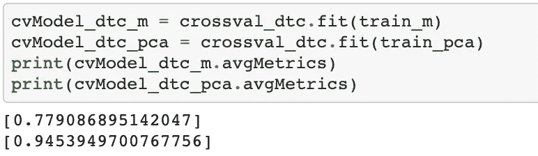

使用测试数据集评估:

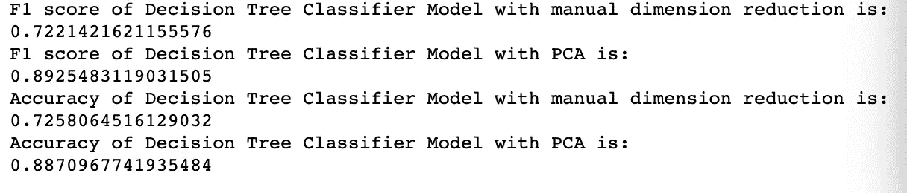

**随机森林**

```
*# initialize classifier*
rfc = RandomForestClassifier()*# evaluator*
evaluator_3 = MulticlassClassificationEvaluator(metricName='f1')*# paramGrid*
paramGrid = ParamGridBuilder() \
    .build()crossval_rfc = CrossValidator(estimator=rfc,
                          evaluator=evaluator_3, 
                          estimatorParamMaps=paramGrid,
                          numFolds=3)
```

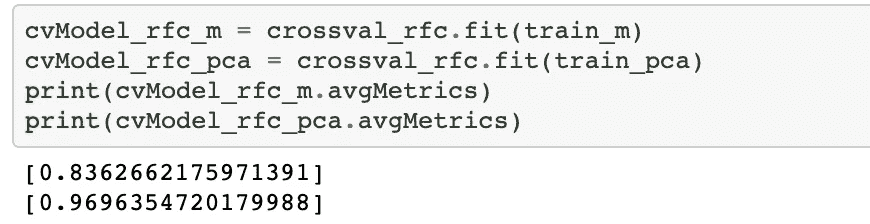

使用测试数据集评估:

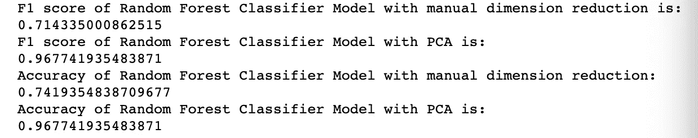

# 结论

在所有三个模型中，主成分分析的结果优于手动降维后的特征。虽然逻辑回归模型为测试数据集提供了完美的 F1 分数和准确性，但它对训练数据集的表现远不如人意。由于逻辑回归模型在完整数据集上的表现也不尽如人意，这一完美的 F1 分数可能是由于模型的偶然性或简单性。因此，我将选择随机森林分类器用于未来的实现，其测试和训练 F1 分数都在 97%左右。

尽管将来我们可以尝试许多其他模型，如朴素贝叶斯和线性 SVM，但随机森林模型在这种情况下表现得相当好(小数据集的 F1 值为 97%，完整数据集的 F1 值为 99.992%)。

还有一些其他的改进，我们可以在未来继续努力:

*   训练和评估模型的更加自动化和健壮的方法
*   考虑那些降低服务等级的用户
*   更注重用户行为特征

感谢阅读！