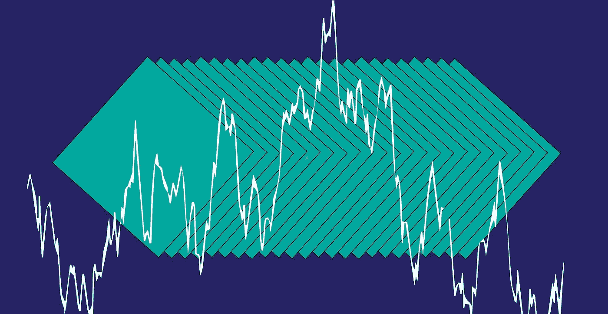
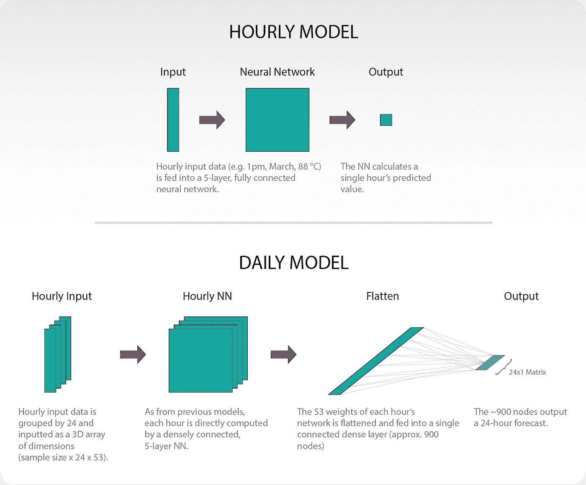
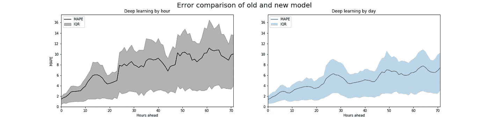

# 用神经网络预测日用电量。

> 原文：<https://towardsdatascience.com/predict-daily-electric-consumption-with-neural-networks-8ba59471c1d?source=collection_archive---------19----------------------->

## 一个简单的三维结构如何减少错误，战胜更复杂的模型，并加倍节省。

2019 年初，我们建立了一个深度学习模型，以每小时为基础预测电力消耗。因为最小的误差都会让电力公司损失数万美元，所以我们研究了许多更复杂的预测工具。最后，我们发现一个简单的全天方法是最有效的，通常可以将错误减半。

# 该结构

在我们之前的模型中，我们输入了所有我们认为与给定小时负载相关的特性:日期、天气数据等。然后，神经网络输出单小时负荷预测。这个过程重复了 72 次，给出了一个 3 天的预报。想要更深入的解释，可以考虑阅读[原文博文](https://www.kmcelwee.com/load-forecasting/simple-load-forecasting)。

新的结构有效地结合了 24 小时模型。但是，我们没有计算一个小时，而是将所有重量合并到一个平坦的、完全连接的密集层中(我们决定大约。900 个节点)。该层然后完全连接到一个 24 小时向量。然后，我们在 3 天内重复这一过程，给出 72 小时的预测。

## 为什么这应该有效？

主要的要点应该是不同的时间互相“通知”。在我们的旧模型中，我们有一个非常直接的方法:给定所有这些因素，这一小时的预测是什么？但是在我们的新模型中，我们可以让所有对 4pm 的负载预测有贡献的因素影响 5pm 的负载预测。如果早上 6 点的温度是 30 华氏度，这难道不会影响到 9 点时加热器是否还在工作吗？神经网络可以识别这些复杂的相关性，并提供更明智的预测。

## 这是怎么建的？

正确准备三维训练数据可能很棘手。下面是一个不太完美的函数，它将数据适当地分组到所需的维度。

然后，它被送入以下网络:

## 为什么不是 RNN？

一个递归神经网络，或 RNN，将类似于上面概述的网络运行。但是我们对 LSTMs 和 GRUs(两个流行的 RNN 模型)的测试并不成功。我们无法制造出超越我们最简单的逐时结构的模型。简而言之，传统的 RNN 结构似乎让事情变得更糟。

## 为什么一天 24 小时？

在我们的短期预测分析中，我们通常关心三天增量的负载(更远的预测很快变得无用)。那么为什么不在 72 小时的向量上训练呢？我们在技术上可以，但成本不会超过收益。在我们的 24 小时预测中，日模型的运行速度比小时模型慢三倍，但是回报(我们将在下面看到)非常高。但是，当我们增加到 48 或 72 小时的预测时，模型会严重变慢，但几乎没有改善。至少就我们的目的而言，分开训练三个 24 小时模型更好。

# 结果呢

我们在德克萨斯州的“中北部”地区测试了新模型。数据可以在这里找到[。虽然实际上模型会每天训练，但在这次测试中，我们严格训练了前 16 年的数据(2002 年至 2017 年)，并在最后一年(2018 年)进行了测试。为了模拟天气预报的不确定性，我们向历史天气数据中添加了噪声，即 24、48 和 72 小时分组的标准偏差分别为 2.5、4 和 6 度的正态分布。](https://github.com/kmcelwee/load-forecasting/tree/main/data)

## 准确(性)

新模型的平均绝对百分比误差(MAPE)为 3，而旧模型的前 24 小时 MAPE 为 4。但是每小时的结果更令人信服。

最重要的问题不仅是 MAPE，而且是误差的传播(下面表示为四分位距，或 IQR)。在开发我们的第一个模型时，我们发现当我们的模型是错误的时候，它通常是非常错误的。新模型中减少的方差可以帮助我们更有信心地向公用事业公司传达我们的不确定性。

这些模型假设用户将在晚上 11 点预测第二天的电力消耗。因此，下图中的“提前 0 小时”意味着“凌晨 12 点”，“提前 30 小时”类似于“两天后的凌晨 5 点”，等等。

## 节省的资金

而且最重要的是，省下来的钱！误差减少 1 个百分点可能看起来微不足道，但在 2018 年，这将使德克萨斯州的调峰储蓄增加一倍。(如果你对调峰不熟悉，可以考虑看看[这位讲解者](https://www.next-kraftwerke.com/knowledge/what-is-peak-shaving))。

假设电池的充电功率为 700 千瓦，额定功率为 500 千瓦，我们可以通过完美的预测计算出可能出现的调峰量。使用我们的每小时神经网络模型，您可以捕获 36%的最佳值。通过替换新模型(不确定性分析下没有任何花哨的[优化)，我们能够捕获 64%的成本，几乎使我们的节约翻倍！](https://www.kmcelwee.com/load-forecasting/calculate-uncertainty)

# 欢迎建议

我们无法开发出比我们的模型更好的 RNN，但这并不意味着它不存在。精度的微小提高可以极大地帮助电力公司，所以如果你认为有我们没有考虑到的结构，请随时联系我们！

*疑问？更正？数据科学笑话？联系我或者在* [*我的网站*](http://www.kmcelwee.com) *上看更多项目。*

*与* [*合作研究开放式建模框架*](http://omf.coop/) *。*

这是关于神经网络调峰的三部分系列的更新。考虑在这里阅读更多:

 [## 基于神经网络的⚡️负荷预测和调峰

### 预测技术给了公用事业单位一个机会来拉平他们的负荷曲线，提出了一个全新的家庭…

www.kmcelwee.com](https://www.kmcelwee.com/load-forecasting/)