# 用 R 预测世界大赛的本垒打

> 原文：<https://towardsdatascience.com/predict-home-runs-in-the-world-series-with-r-d8c0bb2e6f02?source=collection_archive---------38----------------------->

## 使用历史棒球数据和带 R 的逻辑回归来预测世界职业棒球大赛的得分。


蒂姆·高在 [Unsplash](https://unsplash.com?utm_source=medium&utm_medium=referral) 上拍摄的照片

# 介绍

你有没有想过美国棒球、机器学习、统计学有什么共同点？嗯，你今天很幸运！

在这个项目中，我们将使用一些免费的历史棒球数据和 R 中的 *glm()* 函数，来看看哪些变量在预测世界职业棒球大赛中有多少本垒打发生时起作用。

这个项目有几个假设。首先，您有一个 R 环境设置。对于这个项目，我将在 Mac 上的 RStudio 中使用 R Markdown (RMD)文件，但代码在其他操作系统和环境下也能正常工作。第二，你至少对棒球有一个基本的了解。我绝不是棒球专家，但也不需要什么重要的知识。只要你知道什么是本垒打，我们就没事了！

为了您的方便，[RMD 的文件可以在我的 GitHub 这里获得](https://github.com/ARIMA-Consulting/Baseball-Batting)。

现在，让我们进入目标，开始编写代码吧！

# 目标

1.  了解如何在不使用本地文件或手动将数据加载到环境中的情况下导入数据
2.  将数据分成训练集和测试集，用于机器学习
3.  使用非正态数据分布进行机器学习
4.  使用逐步回归方法创建逻辑回归模型
5.  使用模型进行预测，并检查我们的模型的准确性

# 数据

在我们进入代码之前，我们需要谈谈肖恩·拉赫曼的惊人工作。他和他的团队已经创建并免费提供了数量惊人的棒球历史数据。他们还做了大量的工作，用其他几种编程语言制作了一个 R 包和易于使用的实现。我会经常引用他们的话，把数据归功于他们。他们的整个项目只靠他们网站上描述的捐赠来运作。如果你真的想帮助他们，体育分析领域的许多人会用这个数据集来以一种有趣的方式学习机器学习。

这是肖恩的网站:[http://www.seanlahman.com/baseball-archive/statistics/](http://www.seanlahman.com/baseball-archive/statistics/)

现在该编码了！

# 代码

## 加载库

我们将在整个项目中使用 [tidyverse](https://www.tidyverse.org/) 和 [Lahman](http://www.seanlahman.com/baseball-archive/statistics/) 包。

代码如下:

```
# Uncomment the commands below if you have not installed either the tidyverse or Lahman packages
# install.packages("tidyverse")
# install.packages("Lahman")# Load Libraries
require(tidyverse)
require(Lahman)
```

如果您以前使用过 R，请特别注意它明显缺少导入本地数据和命名对象的功能。我们只需要使用 *data()* 函数从拉赫曼的数据集中拉出我们想要的表。默认情况下，对象将以数据框的形式出现，并被称为表的名称，对于我们的目的来说就是 BattingPost。

代码如下:

```
# Imports the BattingPost data set from the Lahman database. Notice how there is not a file to read in. The data is part of the package!
data(BattingPost)# Check the data import
# Notice again that we did not have create and object and assign it data like we normally do with R. It just knows to create a data frame called "BattingPost"
head(BattingPost)
```

以下是输出结果:

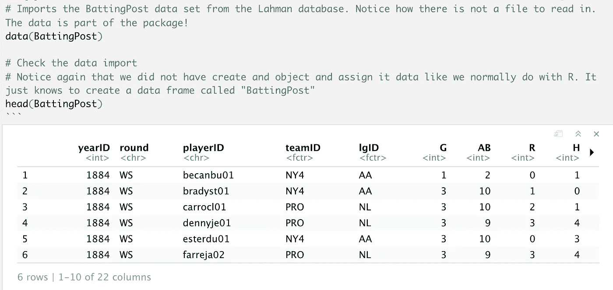

从拉赫曼的数据库[1]导入 BattingPost 表

## 过滤数据

我们现在已经把数据输入 R 了。我们需要稍微清理一下。首先，由于这是一个关于世界职业棒球大赛的项目，我们需要确保我们的 *round* 列中只有“WS”值。其次，我们需要确保 yearID 列大于或等于 1920。我不是棒球历史学家，但那是现代“实况球时代”开始的时候[2]。如果你对那种历史感兴趣，可以看看 Bradford Doolittle 关于 ESPN 的文章。

代码如下:

```
# Filter down the data a bit. We went the year to be 1920 and later because that's when the "Live Ball Era" starts. We also want only WS in the round column because that's for the World Series.SlimBattingPost <- BattingPost %>%
  filter(yearID >= 1920) %>%
  filter(round == "WS")# Check the data
head(SlimBattingPost)
```

以下是输出结果:

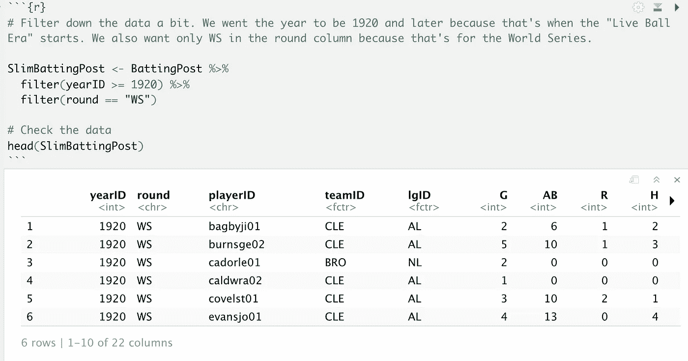

从拉赫曼的数据[1]中筛选出大于或等于 1920 年的数据和仅等于世界系列的舍入数据

让我们为跟随的人澄清一下。你经常看到的“%>%”就是所谓的“管道”字符[3]。当使用 [tidyverse](https://www.tidyverse.org/) 时，特别是其中的 [dplyr](https://dplyr.tidyverse.org/) 部分，处理数据时，我喜欢把它理解为管道字符后面的每个函数或条件都会使假设的数据漏斗变小一点。

我们很少需要一个数据集中的所有数据，因此通过一个周长越来越小的“漏斗”来“倾倒”它是一种可视化这里正在发生什么的好方法。仅仅通过应用这两个过滤器，我们就从原始数据中的 14，750 行增加到了新数据中的 4，280 行。您可以通过查看 RStudio 中的对象或者使用 *nrow()* 函数来获得这些数字。

代码如下:

```
# Print number of rows in each data set
nrow(BattingPost)
nrow(SlimBattingPost)
```

## 机器学习简介

让我们用我们的例子用简单的英语来解释机器学习的含义。我们将要做的事情被称为“监督机器学习”，因为我们作为人类正在“监督”什么数据被输入到机器中[3]。

当像这样使用真实数据时，我们想要做的是将整个数据集的一部分分割成“训练”数据，而将其余部分分割成“测试”数据[3]。这是出于一个非常合理的原因。如果你想让一台机器能够做出预测，你需要对照现实对它进行测试，以确保它实际上工作正常。

传统上，我可以补充一个很好的理由，即 80%的训练数据和 20%的测试数据分开。我见过各种其他组合，如 70/30 和 75/25，但我喜欢 80/20 的分割，因为我通常会得到最好的结果，听起来与帕累托原则相同[4]。拜托，我控制不了自己。我的学士学位是经济学。

因此，在接下来的几段代码中，我们将把数据分成训练集和测试集，使用 *glm()* 函数创建一个广义线性模型，然后随着时间的推移对其进行改进，以获得更好的结果。你会看到，我们可以让机器“学习”什么变量重要，什么不重要，以便随着时间的推移做出越来越好的预测。

## 播种

在我们分割数据之前，我们真的应该设定一个种子[3]。我们将使用随机(嗯，伪随机，如果你想精确)分裂。这意味着代码每次都会将数据分成不同的集合，除非我们使用带有数字的 *set.seed()* 函数，这样我们就能确保可再现性[3]。对于那些跟随的人来说，这意味着只要我们使用相同的数字，你的代码将与我的代码一致。

代码如下:

```
# Set Seed
set.seed(1337)
```

设置种子没有任何输出。它只是确保幕后参数设置正确的东西[3]。

## 培训和测试数据

有很多方法可以做到这一点，但这是我在实践中发现或看到的最简单的方法。这是秘密。我们将创建一个任意 ID 号的列，并将其添加到现有的数据中。这让我们可以轻松地使用 R 中最隐蔽的函数之一 tidyverse 中 dplyr 包中的 [*anti_join()*](https://dplyr.tidyverse.org/reference/filter-joins.html?q=anti%20_%20join) 函数。这样做的目的是从一个表中获取在另一个表中没有匹配项的所有行。太偷偷摸摸了。我喜欢它，你可以[在这里的文档中阅读所有关于它的内容](https://dplyr.tidyverse.org/reference/filter-joins.html?q=anti%20_%20join)。

代码如下:

```
# Creates an ID column so we can more easily sort train from test
SlimBattingPost$id <- 1:nrow(SlimBattingPost)# Creates set of data randomly sampling 80% of total data
train <- SlimBattingPost %>% dplyr::sample_frac(.80)# Creates set of data with other 20%
test <- dplyr::anti_join(SlimBattingPost, train, by = 'id')# Check the data
head(test)
paste("The test data has this many rows:", nrow(test))
head(train)
paste("The train data has this many rows:",nrow(train))
```

以下是输出结果:

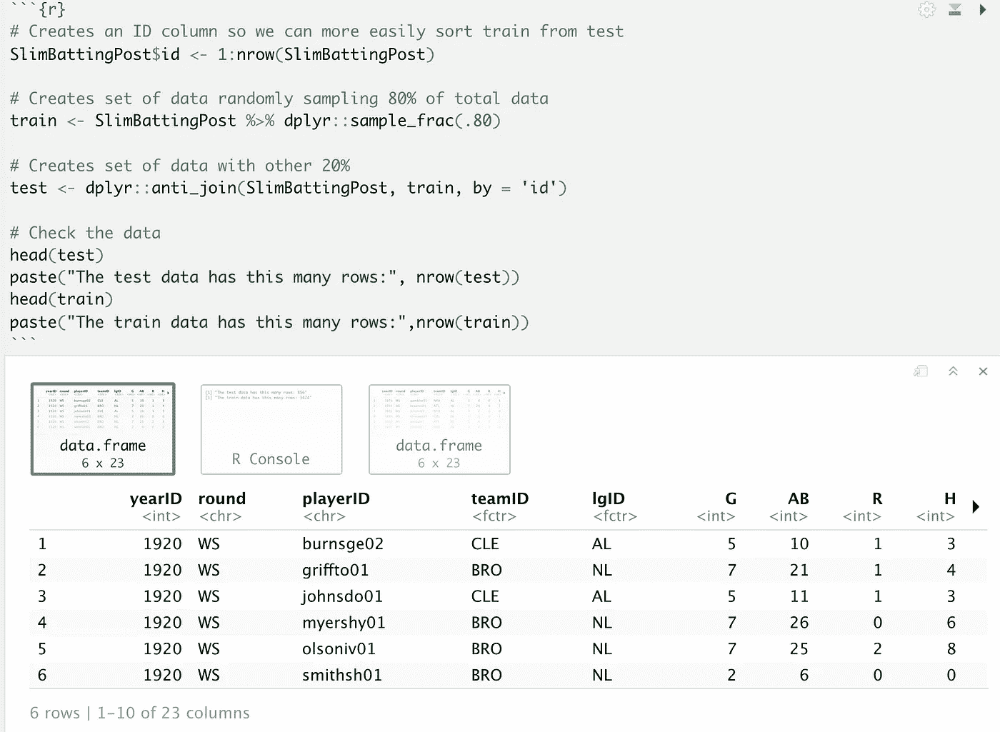

来自拉赫曼数据集[1]的过滤数据的前六行测试数据

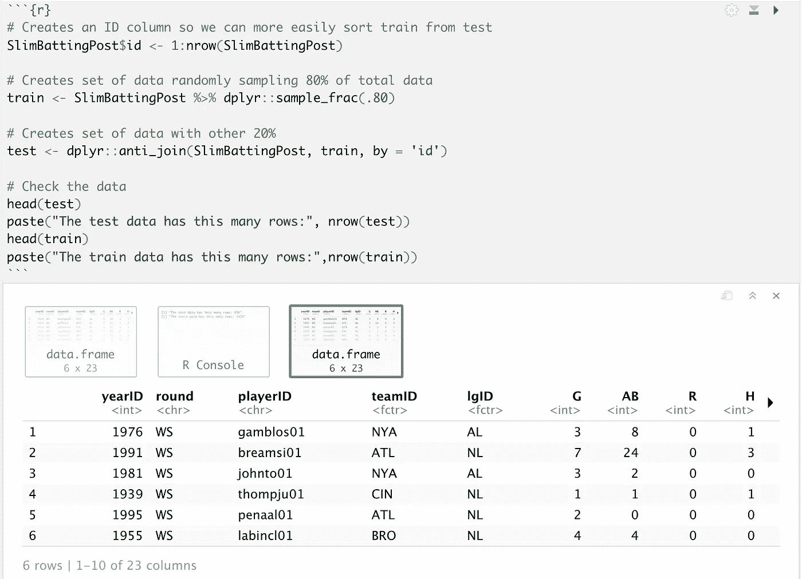

我们从拉赫曼数据集[1]中筛选出的前六行训练数据

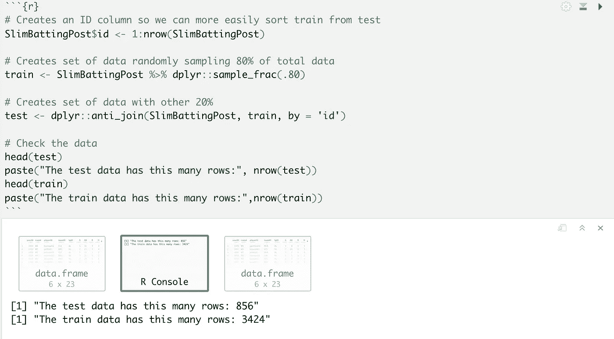

过滤后的拉赫曼数据[1]中每个测试和训练数据集中的行数

## 确定分布

大多数时候，机器学习处理的是正态分布的数据[3]。当你想到一个我们都见过很多次的正态钟形曲线时，它被称为“高斯”分布，因为数学家这么说[3]。看起来是这样的:

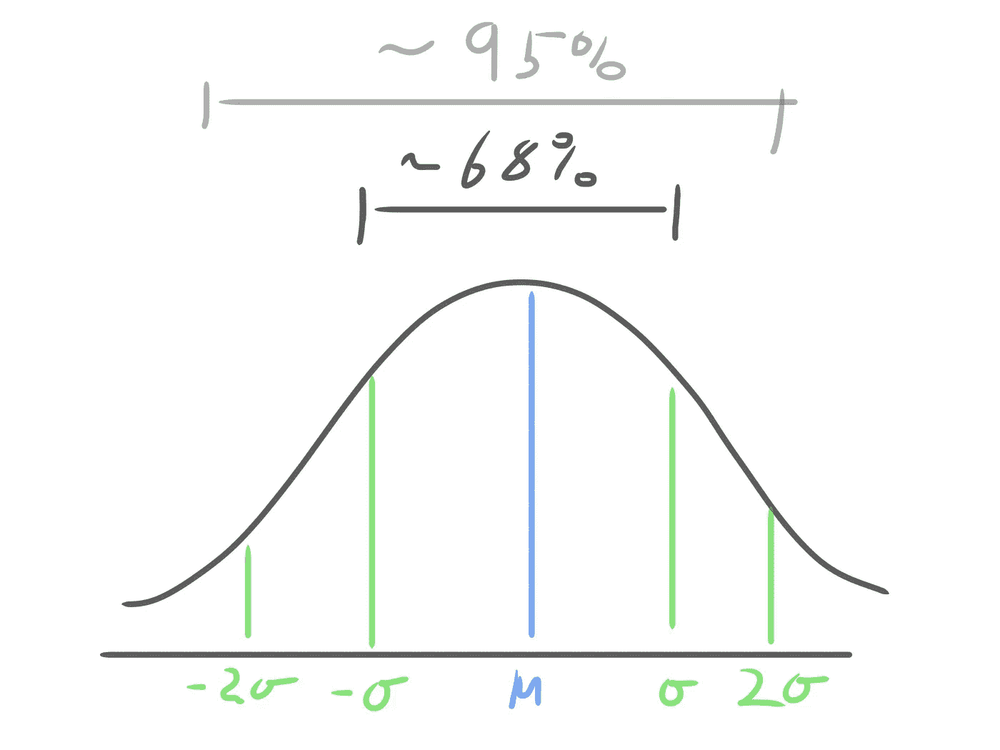

泰勒·哈里斯绘制的正态钟形曲线

在正态分布中，有一个平均值(μ，蓝线)和该平均值的标准偏差(σ，绿线)。进入细节并不是非常重要，但这意味着 95%的数据都在平均值的 2 个标准差(2 sigma)以内[3]。机器学习想要正常数据的原因有很多，但有时我们会得到不正常的数据。

另一种分布被称为“泊松”分布[3]。当然，它是以另一位数学家的名字命名的，但关键是，它是一种标准的分布类型，其中大多数数据都严重倾斜[3]。大多数时候，它看起来像这样:

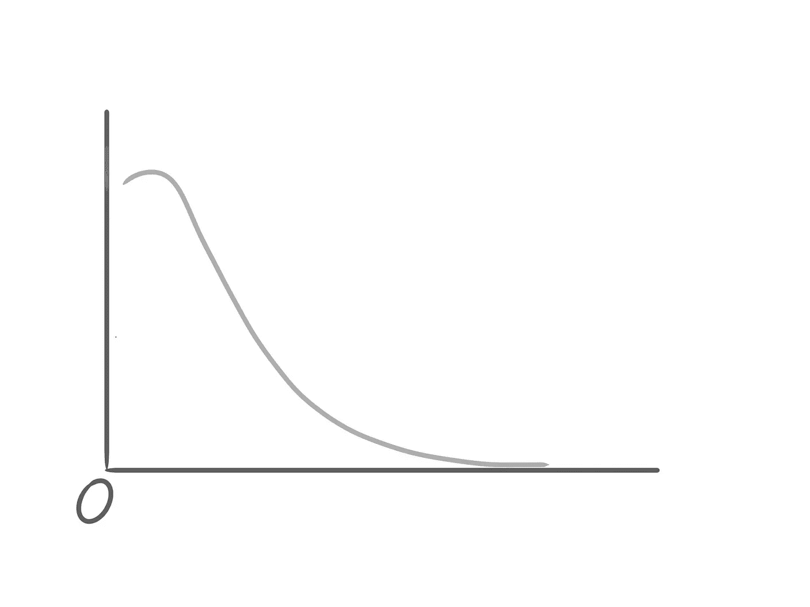

泰勒·哈里斯绘制的基本泊松分布

对于机器学习，我们真正关心的是我们试图预测的变量的分布[3]。在我们的例子中，游程(R)将是因变量。让我们制作一个超级快速的直方图来检查我们是否有正态或泊松分布。

代码如下:

```
# Visually determine type of distribution of Runs (R) in dataset
hist(SlimBattingPost$R)# Classic Poisson distribution. Almost all data is 0 or 1, heavily skewed
```

以下是输出结果:

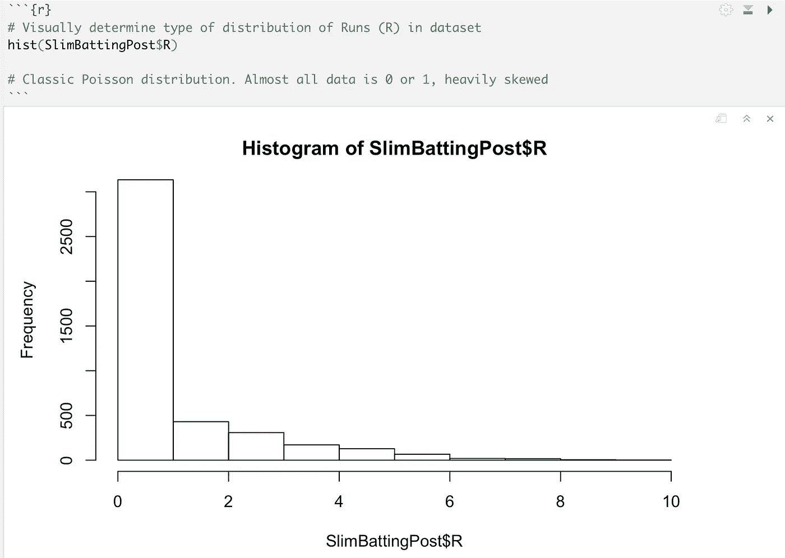

过滤后的拉赫曼数据的基本运行直方图[1]

对我来说，游程(R)变量看起来像一个非常经典的泊松分布！

## 建立模型

有趣的部分来了！我们现在开始建立逻辑回归模型！让我们先看看代码，然后再讨论它。

代码如下:

```
# Start with everything else as independent variables with runs (R) as the dependent variable
# For a data dictionary about what each abbreviation means, go to: [http://www.seanlahman.com/files/database/readme2017.txt](http://www.seanlahman.com/files/database/readme2017.txt)
# Search for "BattingPost" in that document and the third match should be the table where the abbreviations are defined. G = Games, AB = At Bats, etc.# Create the logistic regression with everything in it, make sure to include the Poisson distribution as the family. If we had normal data, we would use Gaussian in its place.fitAll <- glm(R ~ G + AB + H + X2B + X3B + HR + RBI + SB + CS + BB + SO + IBB + HBP + SH + SF + GIDP , data = train, family = "poisson")summary(fitAll)
```

以下是输出结果:

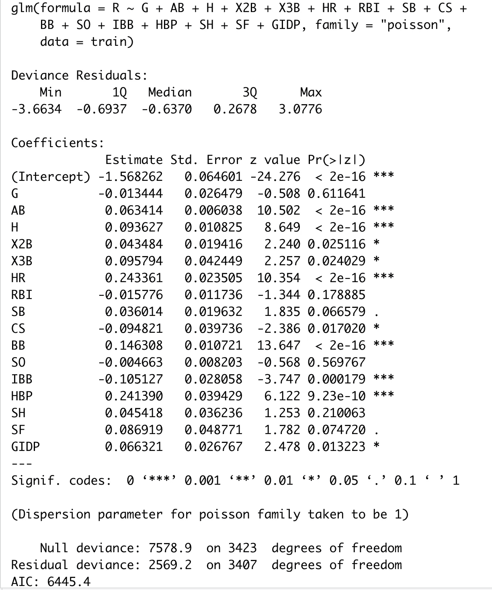

包含所有独立变量的第一个 glm()模型的输出

这里有很多东西需要打开。

首先，我们创建了一个名为“fitAll”的模型对象，该对象使用了 *glm()* 函数，其中 R 作为因变量，用~字符与所有用 a +分隔的自变量分隔开，同时还使用了我们的训练数据(还记得前面的 80%吗？)并使用泊松分布来获得更精确的结果[3]。

一旦我们创建了模型， *summary()* 函数将以简单的形式给出上面的输出。

摘要的第一部分是“Call:”它只是说实际使用了什么模型。这里没什么可说的。

“偏差残差:”试图告诉我们在处理错误时现实和期望之间的差异[3]。实际上，在这一点上，这与学习逻辑回归并不完全相关，所以我们将继续前进。

“系数:”部分是我们需要关注的地方。第一列是所有变量加上截距。还记得代数一课的公式“ *y = mx + b* ”吗？这是截距[3]的 *b* 值的极端版本。

“估计”栏告诉我们每个值对运行次数的影响是积极的还是消极的，以及它的系数有多大[3]。这类似于一堆不同的 *m* 值，其中 *x* 值是实际数据集中的数字。一个等式可能是这样的*y = m*₁*x+m*₂*x+m*₃x… *+ b* 具有所有不同的系数和值【3】。

“性病。“错误”栏是我们错误程度的统计指标[3]。z 值在统计学中用于给出分布曲线上的 z 值[3]。现在对我们来说没那么重要。

与我们最相关的是优雅地标记为“Pr(>|z|)”的列，这是 p 值的一种非常复杂的表达方式[3]。对于 p 值，我们关心的是我们所说的是有意义的一定程度的信心[3]。此外，p 值的范围在 0 和 1 之间，所以如果有负数或大于 1 的数字，数学在某个地方是错误的[3]。

例如，如果我们要至少 95%确定一个自变量是因变量的一个统计上显著的预测因子，p 值将小于 0.05[3]。如果我们希望 90%确定变量是显著的，那么我们需要看到一个小于 0 . 10 的 p 值[3]。要 99%确定，我们需要看到小于. 01 的 p 值[3]。明白我的意思了吗？

r 为我们提供了一个方便的小功能，它标记了每个变量的显著性水平。放一个单曲“.”像 *SB* 和 *SF* 这样的变量意味着我们有 90%到 95%的把握这些变量在统计上是显著的[3]。变量旁边的“*”表示我们有 95%到 99%的把握该变量具有统计显著性，p 值越小，其余变量的预测能力越强[3]。

目标是最终得到一个只有统计上显著的独立变量的模型。那么我们该怎么做呢？我们使用一种叫做“逐步回归”的方法[3]。

## 逐步回归

这是一个听起来很有趣的术语，简单地说就是我们取出一个最不重要的变量，然后重新运行我们的模型，重复这个过程，直到我们只剩下具有统计意义的独立变量[3]。我们来做一个例子。在继续之前，找到具有最大 p 值的变量。

代码如下:

```
# Start step-wise regression.
# Looks like G is the least significant
# Make sure to create a new object name so we do not overwrite our models as we go along!fit1 <- glm(R ~ AB + H + X2B + X3B + HR + RBI + SB + CS + BB + SO + IBB + HBP + SH + SF + GIDP , data = train, family = "poisson")summary(fit1)
```

以下是输出结果:

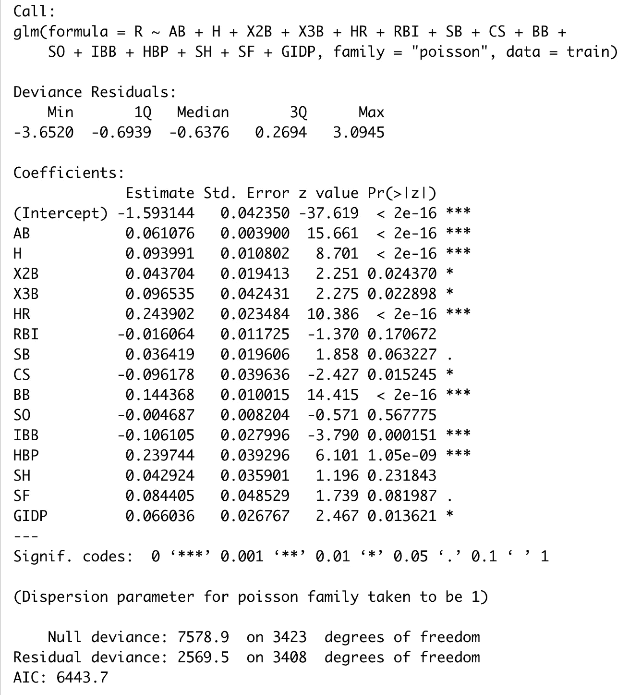

删除最不重要变量后逻辑回归的新结果表

那么，你注意到了什么？在我们去掉了最不重要的变量 *G* 之后，很多 p 值都变了！这很正常。当所有的数字都被处理后，那些被认为是统计上显著变化的变量就被拿走了[3]。这也有道理。当你想到这一点时，不管是第一场还是第三场还是第六场比赛都会影响得分，这是没有意义的。

> 注意:当你删除一个变量时，确保也从公式的自变量侧删除“+”so，以避免不必要的错误！此外，请务必将您的模型重命名为不同的对象名称，以避免在学习时覆盖过去的工作！

然而，看起来我们仍然有不具有统计显著性的独立变量。看起来*是下一个要去的*变量。

代码如下:

```
# Looks like SO is the least significant
# Make sure to create a new object name so we do not overwrite our models as we go along!fit2 <- glm(R ~ AB + H + X2B + X3B + HR + RBI + SB + CS + BB + IBB + HBP + SH + SF + GIDP , data = train, family = "poisson")summary(fit2)
```

以下是输出结果:

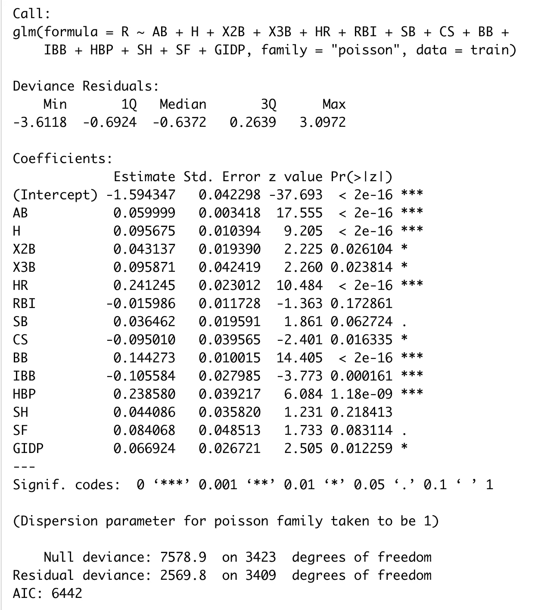

移除 SO 后的第二个逐步回归摘要

希望在这一点上，你得到了模式。直到模型只剩下统计上显著的变量达到 95%的置信阈值(p 值< 0.05), we will look this process.

Rather than take up a ton of space, I am going to skip ahead to the final model after going through the process of removing non-significant independent variables. On your end, do it until you match up with my answer for learning purposes.

Here’s the code:

```
# Final Fit
fitFinal <- glm(R ~ AB + H + X2B + X3B + HR + CS + BB + IBB + HBP + GIDP , data = train, family = "poisson")summary(fitFinal)
```

Here’s the output:

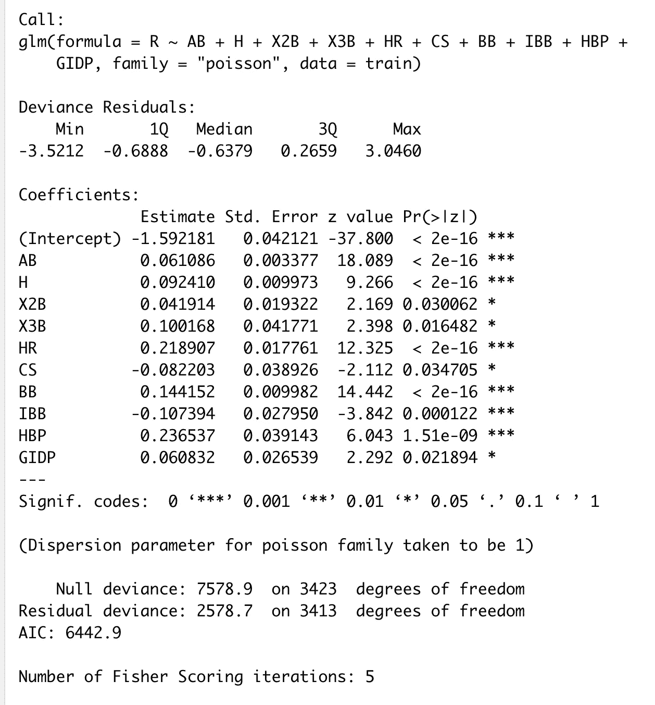

Final logistic regression model after completing the step-wise regression process

## Make Predictions

Now is the time where we see how well we did with our model. Fortunately for us, R has an easy-to-use tool for this — the *预测()*函数。我们现在将使用我们的最终逻辑回归模型，对照我们的测试数据(我们之前保留的 20%)进行测试，然后看看我们有多准确！

代码如下:

```
# Create predictions
predictions <- predict(fitFinal, test, type = 'response')# Check the output
head(predictions)
```

以下是输出结果:

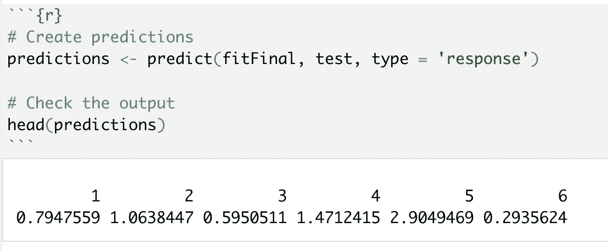

逻辑回归的前 6 个预测

现在，我知道我将要向你们展示的过程并不是做到这一点的捷径。然而，我发现这是最容易一步一步形象化的，这更好地支持了我们学习技术的目标。

我们现在要做的是将我们刚刚做出的预测添加到我们的测试数据中，选择我们实际上想要生成较小数据集的列，在新列中对预测进行舍入，并创建一列真布尔值和假布尔值，以便您可以轻松地看到幕后。

代码如下:

```
# Add predictions to test data and create new data frame
predictDF <- data.frame(test, predictions)# Create new data frame with less columns
SlimPredictDF <- select(predictDF, "yearID", "round", "playerID", "teamID", "R", "predictions")# Add rounded predictions as a column
SlimPredictDF$roundedPredictions <- round(SlimPredictDF$predictions, 0)# Create Boolean Column to see if real and predictions match
SlimPredictDF$TFmatch <- SlimPredictDF$R == SlimPredictDF$roundedPredictions# Check data structure 
head(SlimPredictDF)
```

以下是输出结果:

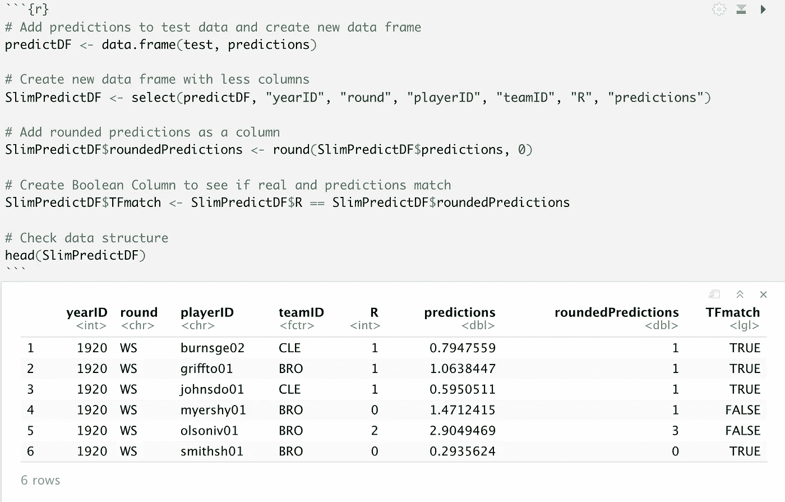

拉赫曼数据测试部分的四舍五入预测表[1]

## 结果

我们可以使用 tidyverse 中的几个函数创建一个简单的表来计算匹配和未匹配的次数。

代码如下:

```
# Get the results!
results_table <- SlimPredictDF %>%
  group_by(TFmatch) %>%
  summarise(count = n())
results_table
```

以下是输出结果:

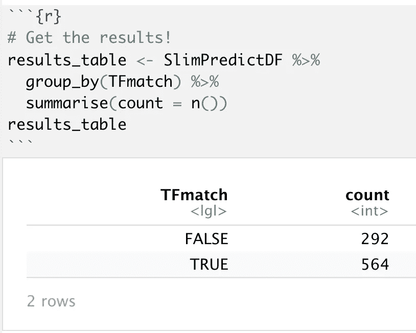

逻辑回归模型预测值的结果表

嗯，66%还不算太糟，对吧？只要将 564 除以 856 就可以得到结果。

## 结果—奖励积分

我们可以检查结果的另一种方法是使用 *lm()* 函数制作一个快速线性模型，并查看我们的 R 平方值。我们会得到 R 平方的两个变量，但它们会很接近。这将告诉我们自变量(roundedPredictions)解释了因变量(R，runs)的多少。

代码如下:

```
# Simple linear model to get p-vale for whether real Runs (R) are significantly prediction by predictionsfitLM <- lm(R ~ roundedPredictions, data = SlimPredictDF)
summary(fitLM)
```

以下是输出结果:

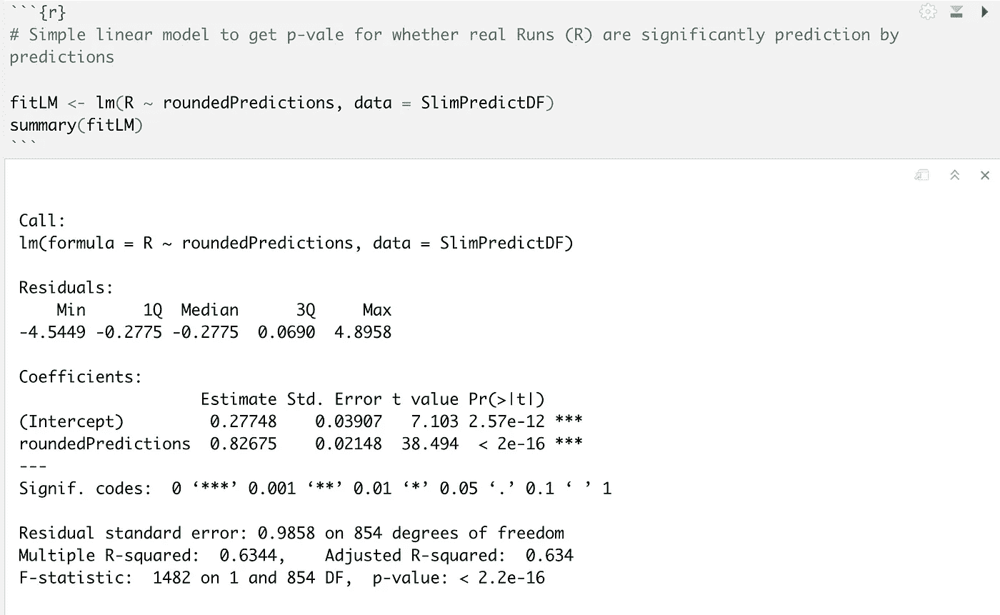

使用线性模型的结果版本

当以这种方式检查时，我们得到了大约 63%正确的类似答案。

# 结论

这个项目旨在教育，有趣，真实。我们可以做很多实验，比如使用不同的分布，包括不仅仅是世界职业棒球大赛的季后赛，改变数据开始的年份等等。

在一天结束的时候，我们使用真实的数据进行真实的预测，并获得了大约 2/3 的正确率。我们还逐步回归，并在此过程中学习了一些非标准的 R 技巧。

如果您有任何问题、意见或对未来探索的想法，请告诉我。享受使用你新发现的逻辑回归技巧来预测其他数据吧！

# 参考

[1] S .拉赫曼，*下载拉赫曼的棒球数据库* (2020)，http://www.seanlahman.com/baseball-archive/statistics/

直播球时代已经过去了一百年，棒球是一项更好的运动吗？ (2019)，[https://www . ESPN . com/MLB/story/_/id/27546614/100 年-直播球时代-棒球-更好-游戏](https://www.espn.com/mlb/story/_/id/27546614/one-hundred-years-live-ball-era-baseball-better-game)

[3] R. Kabacoff， *R 在行动(第二版。)* (2015)，纽约州谢尔特岛:曼宁出版公司

[4].K. Kruse，*80/20 法则及其如何改变你的生活* (2016)，[https://www . Forbes . com/sites/kevinkruse/2016/03/07/80-20-Rule/# 230185973814](https://www.forbes.com/sites/kevinkruse/2016/03/07/80-20-rule/#230185973814)