# 用机器学习预测房价

> 原文：<https://towardsdatascience.com/predict-house-prices-with-machine-learning-5b475db4e1e?source=collection_archive---------4----------------------->

## 对 1，883 个家庭进行回归模型训练


图片来源:[格雷戈·卡特](https://www.gregcarter.com.au/2018/11/07/when-can-real-estate-agent-be-held-liable-for-misleading-and-deceptive-conduct/)大律师&事务律师。

财产估价是一门不精确的科学。个人评估师和估价师把他们自己的经验、标准和技能带到工作中。一致性是很难的，英国和澳大利亚的研究表明，两个专业人士的估值 [**相差高达 40%**](https://core.ac.uk/download/pdf/10879426.pdf) 。哎呀！

也许一台训练有素的机器可以代替人类来完成这项任务，而且一致性和准确性更高。

让我们将这一想法原型化，并使用关于房屋的 ***特征*** 、 ***成本*** 和 ***邻居简介*** 的数据来训练一些 ML 模型，以预测其价值。我们的目标变量**房地产价格**是数字，因此 ML 任务是**回归**。(对于分类目标，任务变为[分类](/will-your-employee-leave-a-machine-learning-model-8484c2a6663e)。)

我们将使用来自 elitedatascience.com 的数据集来模拟属于房地产投资信托基金的 1883 处房产的投资组合。有 26 列。这里有一小段:

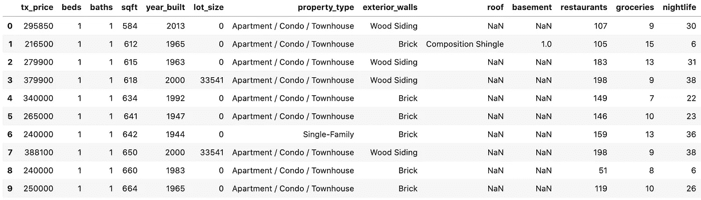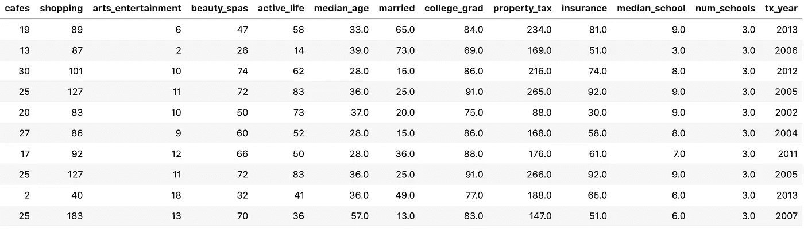

原始数据集的快照。

这些步骤是:

1.  **EDA &数据处理:**探索、可视化和清理数据。
2.  **特性工程:**利用领域专长，创造新特性。
3.  **模型训练:**我们将训练和调优一些屡试不爽的分类算法，比如岭和套索回归。
4.  **性能评估:**我们将看看常见的回归任务指标，如 R 分数和均方平均值。
5.  **部署:**批量运行还是弄几个数据工程师/ ML 工程师来建一个自动化流水线？

加入 Medium [这里](https://col-jung.medium.com/membership)并获得**无限制访问**互联网上最好的数据科学文章。

# 1.数据探索和处理

**探索性数据分析(EDA)** 帮助我们理解数据，为**数据清洗**和**特征工程**提供思路和见解。数据清理为我们的算法准备数据，而特征工程是真正帮助我们的算法从数据集中提取潜在模式的神奇调味汁。请记住:

> 更好的数据总是胜过更好的算法！

我们首先将一些标准数据科学 Python 包加载到 [JupyterLab](https://www.anaconda.com/products/individual) 中。

```
import numpy as np
import pandas as pd
import matplotlib.pyplot as plt
import seaborn as sbfrom sklearn.linear_model import LinearRegression
from sklearn.linear_model import Lasso, Ridge, ElasticNet
from sklearn.ensemble import RandomForestRegressor,
                             GradientBoostingRegressorfrom sklearn.model_selection import train_test_split
from sklearn.pipeline import make_pipeline
from sklearn.preprocessing import StandardScaler
from sklearn.model_selection import GridSearchCVfrom sklearn.metrics import r2_score,
                            mean_absolute_error import pickle
```

导入数据集:

```
df = pd.read_csv('real_estate_data.csv')
```

这是我们数据帧的快照。形状是(1，883，26)。

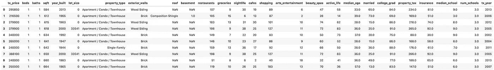

原始数据集的快照。单击以展开。

目标变量是 **tx_price** ，它表示房产最后出售的价格。

共有 25 个栏/特征。

*   房产特征: **tx_year** —最后出售的年份， **property_type** (独栋与公寓/公寓/联排别墅)。
*   物业费:每月**财产税**和**保险**。
*   物业特点:**床、浴池**、 **sqrt** (建筑面积)、 **lot_size** (含套外面积)、**year _ build**&**地下室**(是/否)。
*   邻里生活方式:数量**餐厅**、**杂货**、**夜生活**、**咖啡馆**、**购物**、**艺术 _ 娱乐**、**美容 spa**、&、**活跃 _ 生活**(健身房、瑜伽馆等。)半径 1 英里以内。
*   邻里人口统计:**中位年龄**、**已婚** (%)、**大学毕业生** (%)。
*   邻里学校:**数量 _ 学校**(区内)& **中位数 _ 学校**(区内公立学校 10 分中的中位数)。

## **1.1 数字特征**

我们的数字特征列表可以通过代码获得:

```
df.dtypes[df.dtypes!=’object’]
```

我们将在这里跳过它。相反，让我们直奔所有数字特征的直方图:

```
df.hist(figsize=(20,20), xrot=-45)
```

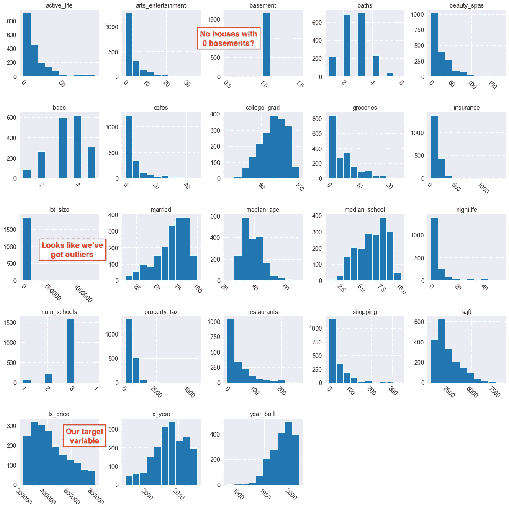

这看起来基本没问题。我用红色留下了一些评论。

**目标变量(tx_price)的分布:**

我们有一个右尾分布，也可以通过看一个**小提琴图**来看。

```
sns.violinplot(data=df, x=’tx_price’)
```

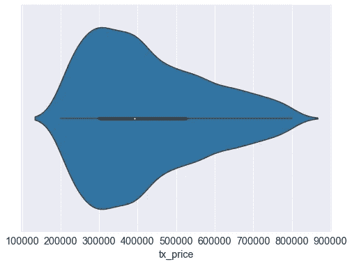

```
df.tx_price.median()**Output: 392000**
```

2020 年 10 月，美国房价中值为 325，000 美元，因此平均而言，房地产投资信托组合中的房屋似乎更靠近住宅区。

**缺失值:**

```
df.select_dtypes(exclude=[‘object’]).isnull().sum()**Output:
tx_price              0
beds                  0
baths                 0
sqft                  0
year_built            0
lot_size              0
basement              223
restaurants           0
groceries             0
nightlife             0
cafes                 0
shopping              0
arts_entertainment    0
beauty_spas           0
active_life           0
median_age            0
married               0
college_grad          0
property_tax          0
insurance             0
median_school         0
num_schools           0
tx_year               0**
```

对**基底**特性的进一步研究表明基底=0 的行是用 NaN 编码的。因此，这实际上是一个**标签不正确**的问题。我们需要把 NaN 转换成 0 来进行运算。

```
df.basement.fillna(0, inplace=True)
```

*注意:如果这些 NaN 是真正缺失的值，我们应该在将* ***基底*** *中的 NaN 转换为 0 之前，创建一个指示变量* ***基底 _ 缺失*** *(当基底=NaN 时值为 1)。*

异常值:lot _ size**lot _ size**的直方图表明我们有一些相当大的豪宅！

```
df.lot_size.sort_values(ascending=False)**Output:
102     1220551
1111     436471
1876     436035
1832     436035
1115     435600
Name: lot_size, dtype: int64**
```

实际上，只有一处房产比其他的大很多。让我们把它看作一个离群值，并为我们的建模过滤掉它。

```
df = df[df.lot_size < 500000]
```

这里有一张**关联热图**来展示我们的数字特征。

```
# mask out upper triangle
mask = np.zeros_like(df.corr(), dtype=np.bool)
mask[np.triu_indices_from(mask)] = True# heatmap
sb.heatmap(df.corr()*100, 
           cmap='RdBu_r', 
           annot = True, 
           mask = mask)
```

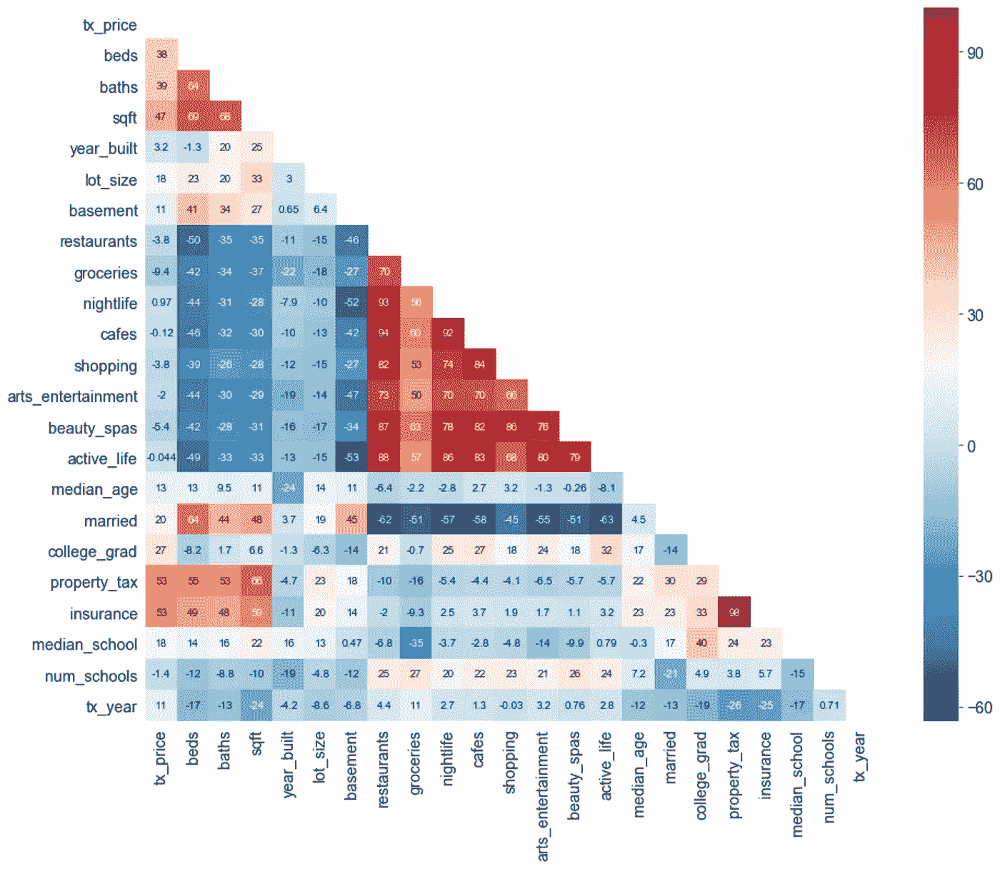

红色的三角形块表明邻近地区的生活方式特征往往相互关联得很好。例如，**活跃生活、美容水疗、咖啡馆、夜生活**和**餐馆**都高度相关。这种多重共线性可能会影响模型性能，因为回归要素应该独立于[和](https://statisticsbyjim.com/regression/multicollinearity-in-regression-analysis/)。

## 1.2 分类特征

我们的分类变量可以用代码列出:

```
df.dtypes[df.dtypes==’object’]
```

这些是:**物业 _ 类型**、**外墙**和**屋顶。**

这些分类特征中的每一个的类都可以用下列方式列出:

```
df.property_type.value_counts()**Output:
Single-Family                    1080
Apartment / Condo / Townhouse     802
Name: property_type, dtype: int64**df.exterior_walls.value_counts()**Output:
Brick                  686
Siding (Alum/Vinyl)    503
Metal                  120
Combination            107
Wood                    72
Wood Siding             49
Brick veneer            48
Stucco                  26
Other                   10
Concrete                 8
Concrete Block           7
Block                    7
Asbestos shingle         6
Rock, Stone              5
Masonry                  3
Wood Shingle             2
Name: exterior_walls, dtype: int64**df.roof.value_counts()**Output:
Composition Shingle      1179
Asphalt                   132
Shake Shingle              55
Other                      49
Wood Shake/ Shingles       30
Gravel/Rock                30
Roll Composition           12
Asbestos                    9
Slate                       9
Composition                 5
asphalt                     5
Metal                       4
composition                 4
shake-shingle               3
Built-up                    2
asphalt,shake-shingle       1
Name: roof, dtype: int64**
```

由此，我们可以稍微清理一下类。我们将

*   将稀疏类合并在一起(那些观察值太少的类)
*   合并具有相似含义的类(例如将*混凝土*和*砌块*归入更一般的*混凝土砌块*类。
*   修正标签错误(例如*混凝土*应为*混凝土*)。

```
df.exterior_walls.replace(['Wood Siding', 'Wood Shingle', 'Wood'],
                           'Wood', inplace=True)df.exterior_walls.replace(‘Rock, Stone’, ’Masonry’, inplace=True)df.exterior_walls.replace([‘Concrete’,’Block’], ’Concrete Block’,
                            inplace=True)df.exterior_walls.replace(['Concrete Block', 'Stucco', 'Concrete',
                           'Block', 'Masonry', 'Other', 
                           'Asbestos shingle', 'Rock, Stone'],
                           'Other', inplace=True)df.roof.replace(['Composition', 'Wood Shake/ Shingles', 
                 'Composition Shingle'], 'Composition Shingle',
                  inplace=True)df.roof.replace(['Other', 'Gravel/Rock', 'Roll Composition',
                 'Slate', 'Built-up', 'Asbestos', 'Metal'], 'Other',
                  inplace=True)df.roof.replace(['asphalt','asphalt,shake-shingle',
                 'shake-shingle'], 'Shake Shingle', inplace=True)df.roof.replace('composition', 'Composition',inplace=True)
```

**缺失值:**

```
df.select_dtypes(include=[‘object’]).isnull().sum()**Output:
property_type       0
exterior_walls    223
roof              353
dtype: int64**
```

我们想告诉我们的算法，这些值是*缺少*。这比简单地删除行更有指导意义。

```
for feat in df.select_dtypes(include=[‘object’]):
    df[feat] = df[feat].fillna(“Missing”)
```

让我们画出三个分类特征的柱状图。

```
for feat in df.dtypes[df.dtypes==’object’].index:
   sb.countplot(y=feat, data=df)
```

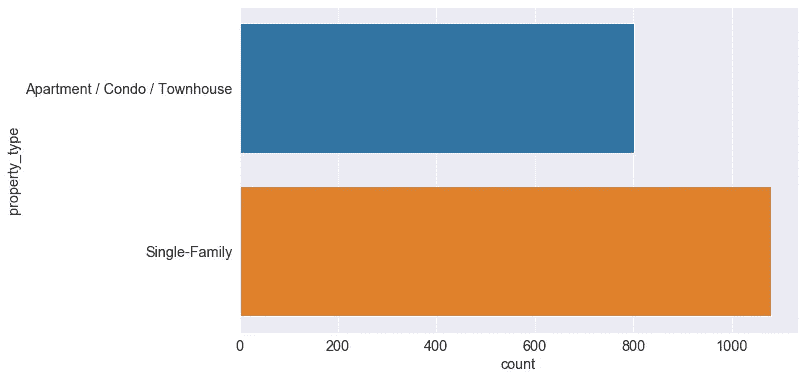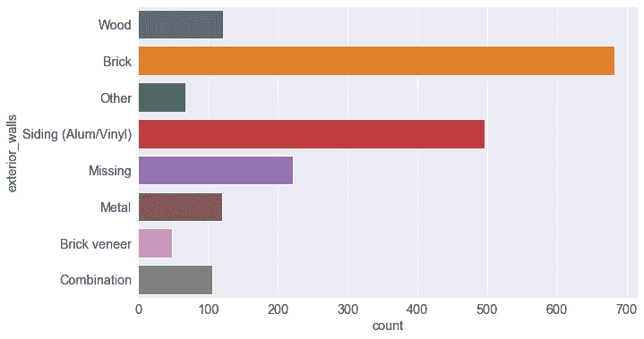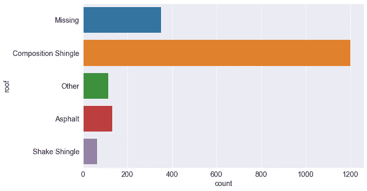

最后，对于我们的算法，分类特征必须是一次性编码的。我们现在就去做。

```
df = pd.get_dummies(df, columns = [‘exterior_walls’, 
                                   ‘roof’, 
                                   ‘property_type’])
```

## 1.3 细分

分割结合了数字和分类特征。

让我们根据我们的目标 **tx_price** 来分割我们所有的分类变量( **property_type** 、**外墙**和**屋顶**)。这将提供一个可能驱动财产价值的细节。

```
for feat in df.dtypes[df.dtypes==’object’].index:
   sb.boxplot(data=df, x = ‘tx_price’, y = ‘{}’.format(feat))
```

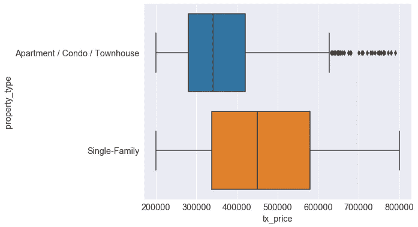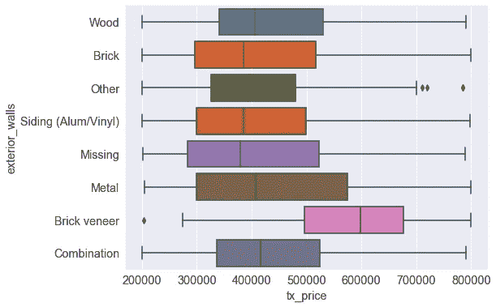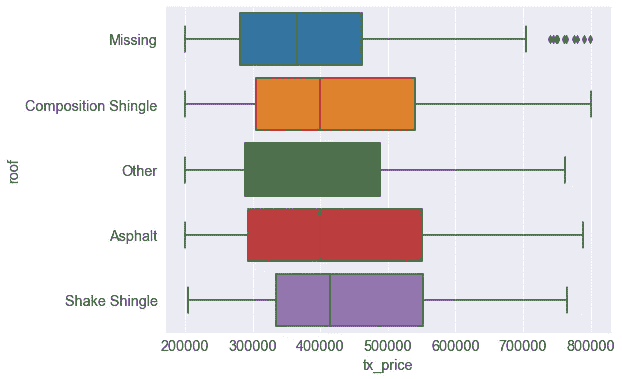

让我们通过使用 **groupby** 来看看单户住宅和公寓/共管公寓/联排别墅之间的房产和街区特征有何不同。

```
df.groupby('property_type').agg(['mean','median'])
```

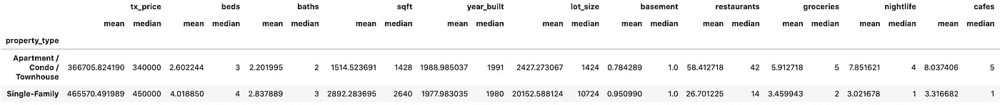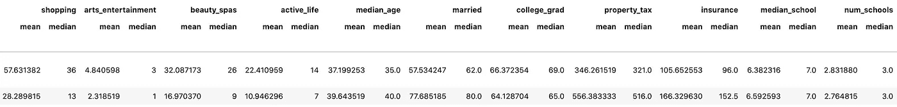

总的来说，独栋房子更贵，面积更大，而公寓/公寓/联排别墅更靠近娱乐场所/商店，吸引更年轻的居民。这并不奇怪。家庭住宅往往位于郊区，而公寓和更高密度的居住往往更靠近市中心。

# 2.特征工程

许多特征工程依赖于领域专业知识。如果你有一个房地产方面的主题专家(SME)来提供指导，你将有更好的机会设计一些令人敬畏的功能，这些功能将真正使你的建模发光。

在这里，我们将设计四个新功能:

*   **两房两卫**:两房两卫房产。为什么？通过领域专业知识，你可能知道这些财产受投资者欢迎。这是一个指示变量。
*   衰退期间:美国房地产市场在 2010 年至 2013 年间陷入衰退。因此，处于这一时期可能会在很大程度上影响定价。
*   **property_age** :这是一种常识。较新的物业应该吸引较高的价格，对不对？(回答:会但不一定。)
*   **school_score** :我们将这个*交互特征*定义为 **num_school** 和 **median_school** 的乘积，它给出了代表该地区学校教育质量的单一分数。

以下代码创建了这些新功能。

```
df[‘two_and_two’] = ((df.beds == 2) & (df.baths == 2)).astype(int)df['during_recession'] = ((df.tx_year >= 2010) & 
                          (df.tx_year <= 2013))
                          .astype(int)df['property_age'] = df.tx_year - df.year_built
df.drop(['tx_year', 'year_built'], axis=1, inplace=True)df['school_score'] = df.num_schools * df.median_school
```

新的 **property_age** 功能可以说取代了原来的 **tx_year** 和**year _ build**，因此我们将删除它们。

此外，出于兴趣，我们可以看到大约 9%的房产有两张床/两个浴室，26%是在 2010 年至 2013 年的房地产衰退期间出售的:

```
df.two_and_two.mean()
df.during_recession.mean()**Outputs:
0.09458023379383634
0.2635494155154091**
```

**分析基表:**应用所有这些数据清洗步骤和特征工程后的数据集就是我们的**分析基表**。这是我们训练模型的数据。

我们的 ABT 有 1863 个属性和 40 列。*回想一下，我们的原始数据集只有 26 列！*通常，abt 比原始数据集有更多的列，因为:

*   one-hot 编码，其中为*每个*分类特征中的每个类创建一个新列；和
*   特征工程。

与此相关，ML 中的一个问题是[维数灾难](https://www.mygreatlearning.com/blog/understanding-curse-of-dimensionality/)，其中你的 ABT 有太多的列/特征。这是深度学习中的一个主要问题，在深度学习中，数据处理可能会产生具有数千个或更多特征的 abt。**主成分分析(PCA)** 是一种降维技术，将高维相关数据转化为一组低维的不相关成分，称为**主成分** (PC)。好消息是，低维的 PCs 捕获了高维数据集中的大部分信息。

我计划写一篇关于无监督学习技术的文章，包括 PCA。睁大你的眼睛！

# 3.系统模型化

我们将训练四个屡试不爽的回归模型:

*   **正则化线性回归**(山脊套索&弹性网)
*   **随机森林**
*   **梯度增强树**

首先，让我们拆分我们的分析基表。

```
y = df.status
X = df.drop('tx_price', axis=1)
```

然后我们将分成训练集和测试集。

```
X_train, X_test, y_train, y_test = train_test_split(X, y, test_size=0.2, random_state=1234)
```

我们将设置一个**管道对象**来训练。这将简化我们的模型训练过程。

```
pipelines = {
    'lasso' : make_pipeline(StandardScaler(),
              Lasso(random_state=123)),
    'ridge' : make_pipeline(StandardScaler(),
              Ridge(random_state=123)),
    'enet' :  make_pipeline(StandardScaler(),
              ElasticNet(random_state=123)),
    'rf' :    make_pipeline(
              RandomForestRegressor(random_state=123)),
    'gb' :    make_pipeline(
              GradientBoostingRegressor(random_state=123))
}
```

我们还想调整每个算法的**超参数**。

对于所有三个正则化回归，我们将调整 **alpha** (L1 & L2 惩罚强度)，以及弹性网的 **l1_ratio** (即 L1 & L2 惩罚之间的权重)。

```
lasso_hyperparameters = {
    ‘lasso__alpha’ : [0.001, 0.005, 0.01, 0.05, 0.1, 0.5, 1, 5, 10]}ridge_hyperparameters = {
    ‘ridge__alpha’ : [0.001, 0.005, 0.01, 0.1, 0.5, 1, 5, 10]}enet_hyperparameters = { 
    ‘elasticnet__alpha’: [0.001, 0.005, 0.01, 0.05, 0.1, 1, 5, 10], 
    ‘elasticnet__l1_ratio’ : [0.1, 0.3, 0.5, 0.7, 0.9]}
```

对于我们的随机森林，我们将调整估计器的数量( **n_estimators** )和分割期间要考虑的最大特征数量( **max_features** )，以及作为一片叶子的最小样本数量( **min_samples_leaf** )。

```
rf_hyperparameters = {
     ‘randomforestregressor__n_estimators’ : [100, 200],
     ‘randomforestregressor__max_features’ : [‘auto’, ‘sqrt’, 0.33],
     'randomforestregressor__min_samples_leaf' : [1, 3, 5, 10]}
```

对于我们的梯度增强树，我们将调整估计器的数量( **n_estimators** )、**学习速率**，以及每棵树的最大深度( **max_depth** )。

```
gb_hyperparameters = {
      ‘gradientboostingregressor__n_estimators’ : [100, 200],
      ‘gradientboostingregressor__learning_rate’ : [0.05, 0.1, 0.2],
      ‘gradientboostingregressor__max_depth’ : [1, 3, 5]}
```

最后，我们将拟合和调整我们的模型。使用 **GridSearchCV** ，我们可以用几行代码在我们声明的所有超参数上对所有这些模型进行交叉验证训练！

```
fitted_models = {}
for name, pipeline in pipelines.items():
    model = GridSearchCV(pipeline, 
                         hyperparameters[name], 
                         cv=10, 
                         n_jobs=-1)
    model.fit(X_train, y_train)
    fitted_models[name] = model
```

# 4.估价

我写了一篇关于流行的机器学习指标的[专门文章](/popular-machine-learning-performance-metrics-a2c33408f29)，包括下面使用的那些。

## 4.1 绩效得分

我们将从打印**交叉验证分数**开始。这是 10 个保留折叠的平均性能，是仅使用您的训练数据获得模型性能**的可靠估计的一种方式。**

```
for name, model in fitted_models.items():
    print( name, model.best_score_ )**Output:
lasso 0.3085486180300333
ridge 0.3165464682513239
enet 0.34280536738492506
rf 0.4944720180590308
gb 0.48797200970900745**
```

移动到**测试数据**，我们将输出[](https://en.wikipedia.org/wiki/Coefficient_of_determination)**和 [**平均绝对误差**](https://en.wikipedia.org/wiki/Mean_absolute_error) **(MAE)** 。**

**R -score 代表模型解释的总方差的[比例，范围从 0 到 100。如果 R -score = 100，则因变量( **tx_price** )与特征完全相关。](https://www.bmc.com/blogs/mean-squared-error-r2-and-variance-in-regression-analysis/)**

**MAE 是预测值和实际值之间的平均误差。**

```
for name, model in fitted_models.items():
   pred = model.predict(X_test)
   print(name)
   print(‘ — — — — ‘)
   print(‘R²:’, r2_score(y_test, pred))
   print(‘MAE:’, mean_absolute_error(y_test, pred))
   print()**Output:
lasso
--------
R^2: 0.4088031693011063
MAE: 85041.97658598644

ridge
--------
R^2: 0.4092637562314514
MAE: 84982.89969349177

enet
--------
R^2: 0.40522476546064634
MAE: 86297.65161608408

rf
--------
R^2: 0.5685576834419455
MAE: 68825.53227240045

gb
--------
R^2: 0.5410951822821564
MAE: 70601.60664940192**
```

**胜出的算法是随机森林，R 分最高 0.57，MAE 最低。我们实际上可以做得更好。**

**还记得之前我们移除了 **tx_year** 和**year _ build**特性后的工程 **property_age** 吗？事实证明这是个错误的选择。如果将它们包括在内，模型的性能将大幅提升，达到 R = 0.81。此外，省略一些高度相关的邻居简档特征(即**活跃 _ 生活、美容 _ 水疗、咖啡馆、夜生活**和**餐馆**)会进一步提高性能。这突出了**特征工程**和**特征选择的重要性。****

**仅供参考，这里是获胜随机森林的超参数，使用 GridSearchCV 进行了调整。**

```
RandomForestRegressor(bootstrap=True, 
                      criterion='mse',
                      max_depth=None,
                      max_features='auto',
                      max_leaf_nodes=None,
                      min_impurity_decrease=0.0,
                      min_impurity_split=None,
                      min_samples_leaf=10, 
                      min_samples_split=2,
                      min_weight_fraction_leaf=0.0,
                      n_estimators=200, 
                      n_jobs=None,
                      oob_score=False, 
                      random_state=123,
                      verbose=0, 
                      warm_start=False))],
```

## **4.2 特性重要性**

**考虑下面的代码。**

```
coef = winning_model.feature_importances_
ind = np.argsort(-coef)for i in range(X_train.shape[1]):
    print("%d. %s (%f)" % (i + 1, X.columns[ind[i]], coef[ind[i]]))x = range(X_train.shape[1])
y = coef[ind][:X_train.shape[1]]plt.title("Feature importances")
ax = plt.subplot()
plt.barh(x, y, color='red')
ax.set_yticks(x)
ax.set_yticklabels(X.columns[ind])
plt.gca().invert_yaxis(
```

**这将打印按重要性排序的特性列表和相应的条形图。**

```
**1\. insurance (0.580027)
2\. property_tax (0.148774)
3\. sqft (0.033958)
4\. property_age (0.031218)
5\. during_recession (0.027909)
6\. college_grad (0.022310)
7\. lot_size (0.020546)
8\. median_age (0.016930)
9\. married (0.015506)
10\. beauty_spas (0.013840)
11\. active_life (0.011257)
12\. shopping (0.010523)
13\. school_score (0.010032)
14\. restaurants (0.009975)
15\. median_school (0.007809)
16\. baths (0.007009)
17\. cafes (0.005914)
18\. groceries (0.005578)
19\. nightlife (0.004049)
20\. arts_entertainment (0.003944)
21\. beds (0.003364)
22\. exterior_walls_Siding (Alum/Vinyl) (0.001808)
23\. exterior_walls_Brick (0.001348)
24\. roof_Composition Shingle (0.001239)
25\. roof_Missing (0.000778)
26\. roof_Shake Shingle (0.000750)
27\. exterior_walls_Missing (0.000632)
28\. num_schools (0.000616)
29\. exterior_walls_Metal (0.000578)
30\. basement (0.000348)**
```

****

**到目前为止，前两个预测值是**

*   **每月房主保险**的费用**和**
*   **每月**财产税**。**

**这并不完全令人惊讶，因为保险费通常是由保险公司根据重置建筑物的成本来计算的。这需要——令人惊讶的是——对建筑物的价值进行良好的估价。同样，财产税的金额通常与房产价值挂钩。**

**接下来的两个最强的预测器是资产的大小( **sqft** )和它有多老( **property_age** )。较大和较新的房产往往在市场上卖得更多，因此这些结果也符合预期。**

# **5.部署**

****

**图片由 [ThisisEngineering RAEng](https://unsplash.com/@thisisengineering) 提供。**

**此模型的可执行版本(。pkl)可以从 Jupyter 笔记本中保存:**

```
with open('final_model.pkl', 'wb') as f:
    pickle.dump(fitted_models['rf'].best_estimator_, f)
```

**房地产投资信托基金可以在将新的住房数据输入训练模型之前对其进行预处理。这称为批量运行。**

**在一个大型组织中，REIT 可能希望通过与**数据工程师**和**机器学习工程师**合作，将模型部署到**生产环境**中。这些专家将围绕我们的模型建立一个自动化的管道，确保新的属性数据可以通过我们的清洗和功能工程逻辑进行预处理，并自动和定期地将预测推送到下游决策者。**

# **最终意见**

**我们从一个**业务问题**开始:一家从事购买、持有和出售大型[投资物业组合](https://www.investopedia.com/terms/r/reit.asp)业务的公司希望为其物业估值带来一致性和更高的表现。**

**我们在包含 1800 多项过去房地产交易的历史数据负载上训练了一个获胜的随机森林模型。**

**人力资源部可以在我们训练有素的员工身上运行新数据。pkl 文件，或者可以由他们的工程部门构建自动管道。**

**我们的模型是一个**回归模型**，其中目标变量是数字。**

**监督学习硬币的另一面是**分类模型**，其目标变量是分类的。在[这里](/will-your-employee-leave-a-machine-learning-model-8484c2a6663e)，我训练了一个二元分类模型，预测员工是否有离开公司的风险。**

**最后，我在这里写了一篇关于机器学习在数学建模领域的位置的文章。**

**在 YouTube 和 Twitter 上关注我。**

# **无限制媒体访问**

**提升你的知识和技能到一个新的水平。**

**[加入 Medium](https://col-jung.medium.com/membership) 享受**无限制访问**互联网上的**最佳分析&数据科学文章**。你可以在这里加入[来支持我和其他顶级作家。](https://col-jung.medium.com/membership)**

# **我的数据科学文章**

*   **微分方程与机器学习——此处[为](https://medium.com/swlh/differential-equations-versus-machine-learning-78c3c0615055)**
*   **新冠肺炎的数学建模与机器学习— [此处](https://medium.com/swlh/math-modelling-and-machine-learning-for-covid-19-646efcbe024e)**
*   **回归预测房价— [此处](/predict-house-prices-with-machine-learning-5b475db4e1e)**
*   **分类预测员工流失— [此处](/will-your-employee-leave-a-machine-learning-model-8484c2a6663ea)**
*   **流行的机器学习性能指标— [此处](/popular-machine-learning-performance-metrics-a2c33408f29)**
*   **Jupyter 笔记本与 Dataiku DSS — [此处](/jupyter-notebooks-versus-dataiku-dss-for-data-science-e02264a753ca)**
*   **Power BI —从数据建模到令人惊叹的报告— [此处](/intro-to-power-bi-from-data-modelling-to-stunning-reports-b34aac43d8a1)**