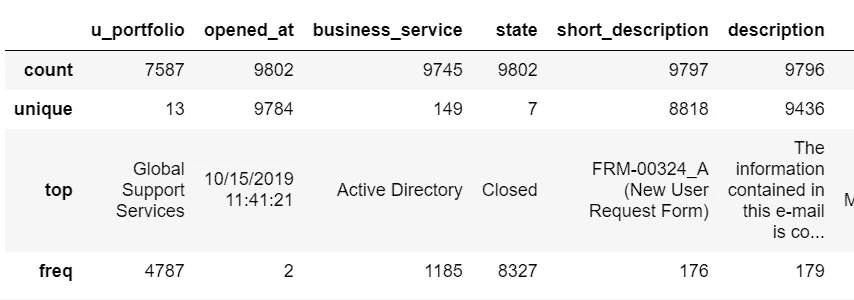
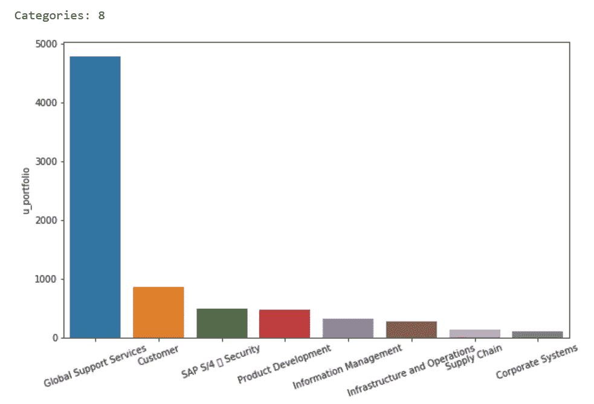
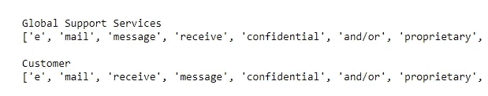

# 使用机器学习和 NLP 预测 IT 支持票

> 原文：<https://towardsdatascience.com/predict-it-support-tickets-with-machine-learning-and-nlp-a87ee1cb66fc?source=collection_archive---------4----------------------->

## 通过 Python 中的监督分类技术。


来源:[alenesetril](https://unsplash.com/@alesnesetril)通过 [unsplash](https://unsplash.com/photos/Im7lZjxeLhg) (CC0)

处理大量 IT 服务请求？对降低运营成本感兴趣？希望提升用户体验？别再看了。

本文可作为数据科学爱好者在 IT 服务管理(ITSM)环境中部署生产级机器学习解决方案的指南。规定的 ML 解决方案将帮助我们深入了解 IT 服务请求的黑匣子，并跨业务管理孤岛整合 ITSM 战略。

我们将使用受监督的分类算法，根据输入文本对新票据进行分类。我采用了 [Python](https://www.python.org/) 、 [RESTful API](https://restfulapi.net/) 框架、 [Scikit-Learn](https://scikit-learn.org/stable/) 和 [SpaCy](https://spacy.io/) 来完成这个任务；但是，有许多解决方案更适合您的组织。我将尽最大努力解决分歧的机会，并为我为什么选择特定的方法提供专门的理由。

Susan Li 提供了关于使用 SpaCy 进行文本分类的[机器学习的出色概述。我的过程、代码和演示(如本文所述)都受到了她的影响。如果你觉得我的任何内容有帮助/有趣，我强烈推荐订阅她的频道。](/machine-learning-for-text-classification-using-spacy-in-python-b276b4051a49)

> **最终模型对流入生产环境的所有票据的预测准确率超过 85%。SLA 响应时间缩短了一半，每年节约成本近 60 万美元。**

# 背景

IT 服务管理(ITSM)是一项重要的企业职能，负责利用创新来增加价值，最大限度地提高用户生产力，提供端到端的技术服务，等等。尽管企业责任如此重大，但前端 IT 交互通常是通过与支持专家进行长时间艰苦的对话(通过网络或电话)来定义的。无论您是在申请新密码、提交应用程序的配置更改，还是只是寻求帮助，您都将经历一段令人沮丧的前路。这种耻辱依然存在，因为 IT 领导很难为服务于整个企业的全面帮助台管理解决方案配备人员和提供支持。

尽管有良好的意图，支持组织经常错过高效 ITSM 的标志。在为我最近的一个全球医疗设备客户做项目时，我的任务是纠正企业事故单分类带来的令人沮丧的结果。领导层决定使用 ServiceNow(一个受欢迎的 ITSM 工作流平台)和外部供应商将资源投入到高成本的传统解决方案中，以缩短传入票证的响应时间，但收效甚微。普遍的使用和严格的 SLA 限制导致了全面的不准确性，其中业务组用落在他们队列中的票据玩跳房子游戏。用户被激怒了，支持专业人员冷酷无情，领导层被难住了。是时候换个新的视角了！

## 在 2019 年，超过 ***60，000 张票被提交*** 到我客户的 ServiceNow 平台，意图到达近 15 个商业团体。每张票花费 IT 组织 13 美元，尽管平均准确率(达到预期目标的机会)只有 40%。在到达正确的地方之前，错误分配的票据在业务组之间平均反复 21 天。C ***ost*** ， ***延迟*** ， ***，*** 准确性受到巨大关注，并导致*用户体验不佳。*

*当用户提交支持票时，它通过电子邮件、电话或嵌入式门户流入平台。每张票据都包含一些关于问题或请求的文本，由支持专业人员快速审阅并发送出去。一旦*正确的*分配组拿起工作单，一些工作就完成了，事故状态恢复为已关闭。*

*通过 **监督机器学习** 进行多项分类，根据固定数量的业务组对支持票进行分类的时机似乎已经成熟。我们可以轻松地从每张票上抓取文本和类别，并训练一个模型将特定的单词和短语与特定的类别关联起来。我的*假设*很简单:机器学习可以提供即时的成本节约，更好的 SLA 结果，以及比人类更准确的预测。我们开始吧！*

# *数据收集和探索*

*在选择和训练机器学习模型之前，我们需要查看数据，以更好地了解事件票证中的趋势。ServiceNow 提供了一个健壮的 [Table API 框架](https://developer.servicenow.com/app.do#!/rest_api_doc?v=madrid&id=c_TableAPI)让我们直接从平台抓取数据。*

```
**# Import Statements* **import** requests
**import** json
**import** pandas **as** pd
 *# Initialize url* **url** = "https://{instance.service-now.com}/api/now/table/incident"*# Set simple authorization* **user** = "{username}"
**pwd** = "{password}"*# Set proper headers* **headers** = {"Content-Type" : "application/json", 
"Accept" : "application/json",
"accept-encoding" : "gzip, deflate, br"}# Initialize GET response
**response** = requests.get(url, auth=(user, pwd), headers=headers)
**data** = json.loads(response.text)**dataframe** = pd.DataFrame(data['result'])*
```

*ServiceNow 为您提供了一个绝佳的机会，让您通过其嵌入式 [API Explorer](https://developer.servicenow.com/app.do#!/training/article/app_store_learnv2_rest_newyork_inbound_rest_integrations/app_store_learnv2_rest_newyork_introduction_to_the_rest_api_explorer?v=newyork) 探索 RESTful API 调优的细微差别。这个工具帮助用户从头开始构建定制的 API 请求，减少查询参数、字段等。变成容易理解的增量。此外，您可以点击流行的表(事件、任务等。)或创建复杂的查询。对于任何数据专业人员来说，这都是一个非常棒的工具！*

*让我们看看我们的数据框架:*

**

*由于我们感兴趣的是将文本与相关的*分类器*关联起来，我们可以使用一个分类变量，比如“u_portfolio ”,来标记数据帧中的每一行。尽管存在非常严重的类别不平衡(“全球支持服务”，几乎占所有记录的 65%)和超过 2，000 个缺失值，我们希望消除那些少于 100 个票证的特定类别，以减少噪音并确保我们只使用相关类别。让我们通过连接“short_description”和“description”来创建一个名为“text”的纯文本列。我们肯定希望可视化更新的数据帧！*

```
***import** matplotlib.pyplot **as** plt
**import** seaborn **as** sns# Eliminate categories with fewer than 100 tickets
classifier = "u_portfolio"
ticket_threshold = 100**df_classifiers** = df[df.groupby(classifier[classifier].transform(len) > ticket_threshold]# Print number of relevant categories & shape
print(**"Categories: " + str(df_classifiers[classifier].nunique())**)# Plot the classifiers
fig = plt.figure(figsize=(10,6))
sns.barplot(df_classifiers[classifier].value_counts().index, df_classifiers[classifier].value_counts())
plt.xticks(rotation=20)
plt.show()*
```

**

*在将阈值设置为 100 张票后，我们似乎删除了 5 个以上的类别，只返回那些具有相关商业价值的类别。在深入研究了数据并询问了一些人之后，我确认这些被删除的类别已经有一年多没有被使用了，可以轻松地被删除。*

**阶级失衡与企业咨询的精彩世界:**

*全球支持服务(GSS)占总支持票证的 60%以上。这意味着我们可以编写一个简单的程序来**将 GSS 分配给****每一个传入的票证，这样我们就有一半的时间是正确的！***

***来源:[戈登·拉姆齐](https://media.giphy.com/media/3o85g2ttYzgw6o661q/giphy.gif)经由[cbs.com/corden](https://www.cbs.com/shows/late-late-show/)***

***在没有做任何深入分析的情况下，我们发现了一个主要问题。第三方供应商对每张票的交互收费 13 美元，平均准确率为 40%,比我的客户不采取任何行动的情况还要糟糕……想象一下向首席信息官透露*这个*消息！***

***剩余的类别将被用作**标签** 来训练/测试模型。让我们将它们保存为一个列表:***

```
*****category_labels = list(df_classifiers[classifier].value_counts().index)*****
```

***现在我们有了 **category_labels** ，我们需要更好地理解每种票据的文本模式。通过窥视 ServiceNow 平台，我可以很快按类别收集到几个主题: **GSS** 处理大量密码重置和硬件问题；**商业智能**涵盖报告功能和数据问题；**客户**处理 SalesForce 和其他客户应用； **SAP S/4 Security** 管理所有与 ERP 相关的访问/配置。如果你以前在这个公司工作过，这些主题听起来很熟悉。通过研究数据，人类很容易识别每个类别的几个关键词——让我们看看计算机是否也能做到这一点！***

***一旦我们运行代码，我们可以检查输出:***

******

***不幸的是，这里没有太多，因为最常见的单词在类别上几乎没有区别。我调查发现，邮件占了 75%以上的门票提交量；所有内部员工的签名下面都有某种版本的保密通知，这扭曲了类别之间的重大差异。我们可以尝试更改 N，看看是否会出现其他模式，或者将电子邮件签名硬编码到非索引字表变量中，以防止它出现，但这不会修复根本原因。*而不是*，我们想要找到**将**与我们类别列表中的每个标签相关联的单词/短语。这被称为[术语选择](https://glowingpython.blogspot.com/2014/02/terms-selection-with-chi-square.html)，可以帮助我们通过标签为数据集识别最相关的术语。***

***让我们探索一些测量和评估相关性的 ML 解决方案！***

# ***构建模型***

***自然语言处理(NLP)位于计算机科学和语言学的结合点，定义了机器和人类语言如何相互交互的解决方案。在功能上，NLP 通过分析和操纵数据(通常以文本形式)来获取意义，从而消耗人类语言。为此，我们需要将人与人之间传递的数据转换成机器可读的数字格式。这种编码文本的过程被称为**矢量化**，并催化计算过程，如应用数学规则和执行矩阵运算，从而产生有价值的见解。***

***尽管有一些超级酷的新兴方法可以为 NLP 矢量化文本数据，如迁移学习和高级神经网络，但我们将使用一种更简单的技术，称为**词频——逆文档频率**。Tf-idf 值与单词/短语(n-gram)在文档中出现的次数成比例增加，偏移量为文档总数。虽然听起来很复杂，但它基本上反映了 n-gram 对文档的重要性，而不偏向出现频率更高的单词。这对于处理像我们这样存在类不平衡的文本文档来说尤其强大！如果你的文本平衡良好，你可以使用[计数矢量器](https://scikit-learn.org/stable/modules/generated/sklearn.feature_extraction.text.CountVectorizer.html)。***

***既然我们已经了解了计算机是如何消耗文本数据的，我们可以使用不同的模型进行实验！下面是一些测试几个选项的起始代码:***

***让我们使用[逻辑回归](/understanding-logistic-regression-9b02c2aec102)作为我们的最佳拟合模型。作为一名数据科学家，您应该能够将多种技术应用于一个项目，并从中选择一种最适合的技术。根据我的经验，人类心理学在用例的成功中起着重要的作用；指导企业接受新兴的、颠覆性的技术需要时间和精力！**推广、品牌化和销售您的解决方案与构建优雅的算法一样重要。让我们建立我们的模型吧！*****

***在这个项目中，我有足够的机会系统地将概念社会化，以实时解决问题。对于这个用例，我的*成功标准的一个主要部分是领导层理解并在上下文中传播这些数据科学概念。因为有许多其他算法/模型可以基于数据优化模型性能，所以我鼓励您进行试验。****

# ***生产部署***

***当用户提交一张票时，很容易获取文本并通过模型进行处理。这样做，我们可以确定…***

***a)如果模型发现文本相关***

***b)哪个类别最适合该文本***

```
***# Save the model to variable 'model'
model = pipe.fit(X_train, y_train)# Save array of predictions for given TEXT
predict_category = model.predict(TEXT) # Save array of prediction probabilities for given TEXT   
predict_probability = model.predict_proba(TEXT)***
```

***我们的两个变量**预测**将返回一个与类别列表长度成比例的数字数组。如果我们打印 predict_category，我们期望一个 8 个数字的数组，对应于我们的 8 个类别，用 0 或 1 来表示相关性。如果文本字符串是“我需要一台新的公司笔记本电脑”，那么除了对应于“全球支持服务”的第 n 个位置的 1 之外，我们应该期待一个 0 的数组。我们可以使用“predict_probability”来查看在上下文中对 GSS 的预测结果有多强；对于这个特定的文本字符串，98%的概率是可信的，可以说我们信任这个模型😃。***

***我们可以使用我们用来抓取数据的同一个表 API，用 PUT 请求替换 GET 响应，来更新 ServiceNow 中的票据。实时地，用户提交一张票，模型在不到一分钟的时间内用预测的类别更新 ServiceNow。让我们为实现了一个有效的机器学习解决方案而沾沾自喜吧！***

***在生产环境中部署模型取决于您的特定企业所订阅的技术堆栈。我的客户是一家 AWS 商店，通过访问全套 AWS 工具管理着良好的关系。***

***我使用了 [Lambda](https://aws.amazon.com/lambda/) 和 [SageMaker](https://aws.amazon.com/sagemaker/) 在一个无服务器的 AWS 环境中自动分配支持票。然而，创建一个 [EC2](https://aws.amazon.com/ec2/instance-types/) 实例来托管模型并与 ServiceNow 直接交互要容易得多。ServiceNow 具有内置的“业务规则”,可以对其进行配置以触发模型上的 API 调用并执行更新。最终的部署稍微便宜一些，而且在 EC2 服务器上更容易更新，并且依赖于 AWS 和 ServiceNow 的有效通信。AWS [文档](https://docs.aws.amazon.com/)以其深度和广度而闻名；我强烈建议在投入之前咨询适当的资源。***

***如果这些术语对你毫无意义，不要烦恼！基本上，机器学习管道需要被托管在与所涉及的人员和技术无关的环境中。如果新的开发人员加入进来，票证数量一夜之间增加了两倍，或者领导层选择使用 R 中的 KNN 而不是 Python 中的 LogReg，环境需要适应可变的规模。整个管道是在我的本地机器上开发的，但是从长远来看，生产部署不能依赖于我的计算资源和/或可用性。将它保存在服务器上(托管在云中)可以确保可持续性和有效性。这是构建阶段和实际部署之间的关键转变。***

# ***评估模型***

***在所有这些工作之后，我们完成了什么？首先，我们有一个很棒的 ML 解决方案，它使用自然语言处理对一家全球公司的所有*事故单进行分类。通过自动化票证分配和规避第三方供应商，我们每年为企业节省近 60 万美元。我们将平均准确率从 40%提高到 85%,并将 SLA 响应时间缩短了一半！有趣的是，用户体验明显更加积极，对 ITSM 环境的信任度也直线上升。****

***出乎意料的是，我对 ServiceNow 中数据和流程改进的高度关注有助于整合部门战略并提供更好的决策。由副总裁、董事和高级经理组成的 IT 领导层对节省资金、缩短响应时间和提升用户体验非常兴奋。尽管最初对支持新技术、在生产中操作模型、向供应商重构平台工作流等感到不安。领导层*最终*接受了改变。部署提供了民主化决策和传播复杂数据主题的机会。我相信，领导层能够更好地制定未来数据科学项目的战略并为其配备人员，将此使用案例展示为传达预测分析和数据科学成功的跳板。***

***如果你对文章中概述的方法有任何问题或意见，请在下面留言或直接给我发消息！我很乐意收到你的来信😄。***