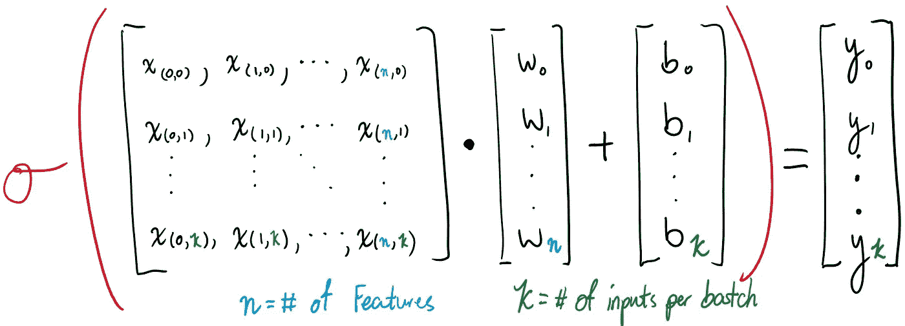
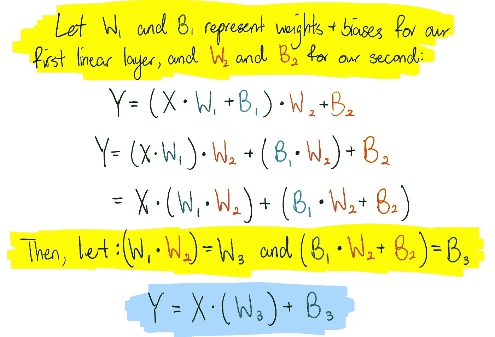
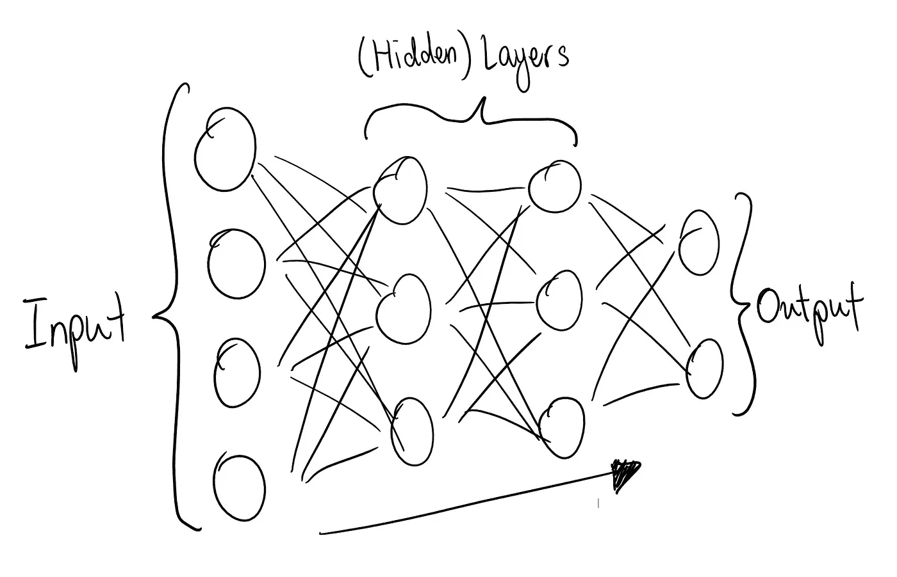

# 学习 PyTorch 的同时预测英雄联盟比赛(第二部分)

> 原文：<https://towardsdatascience.com/predict-league-of-legends-matches-while-learning-pytorch-part-2-38b8e982c7ea?source=collection_archive---------40----------------------->

## 学习在 PyTorch 中实现一个简单的前馈网络，并使用 GPU 为一个合适的用例场景进行训练，同时学习一些理论

这个小系列的第二部分，手绘版！

> 读者朋友，你好！如果你还没有读过这个由 2 部分组成的“系列”的第一部分，我强烈推荐你在阅读之前阅读它。您可以在此处或下方*进行操作👇*

 [## 在学习 PyTorch 基础知识的同时预测英雄联盟中的比赛

### 请跟我来，我将使用 PyTorch 实现一个逻辑回归模型来预测英雄联盟中的比赛

towardsdatascience.com](/predict-matches-in-league-of-legends-while-learning-pytorch-basics-3dd43cf8d16f) 

上一次，我们停止了用 PyTorch 做一个逻辑回归器来达到同样的目的。这一次，我们将事情推进了一步:创建一个前馈神经网络(只有完全连接的层)。如果你想知道更多关于这样做的意图，这个迷你项目将使用的数据集，和/或数据集的数据准备过程，那么你应该看看我的第一篇文章[这里](/predict-matches-in-league-of-legends-while-learning-pytorch-basics-3dd43cf8d16f)或以上。

《英雄联盟》是我一直以来最喜欢的游戏之一，尽管我真的很不擅长。LOL 是一个极具竞争力的 MOBA，两个由 5 人组成的队伍*(蓝队和红队)*相互对抗，以摧毁对方的基地(nexus)。获胜通常需要大量的团队合作、协调，或者对于一个倾斜的玩家来说，“运气”。不管怎样，对于一个联盟玩家(即使他们是相当新的)来说，根据游戏记录的死亡人数和许多其他数据来判断哪个队可能会赢并不太难。神经网络可以预测的东西……

# 等等，什么是神经网络？

> 嘶！如果你不想学习一些理论，可以跳过这一部分。你会错过一些我自己的画:(

上次我们已经看到了逻辑回归模型如何在预测方面做得相当好(它在测试数据集上实现了高达 74%的准确性)。事实上，逻辑回归变量几乎完全是一个线性回归变量，它本身就是一个 T2，一个一批输入之间的矩阵点积，一个权重矩阵，外加一个偏差向量。 *可变的权重和偏差使模型能够训练并更好地做它正在做的事情。*线性回归和逻辑回归之间的唯一区别是，对于涉及简单的是或否问题(就像比赛中的一支球队赢得了比赛)或分类问题的预测，存在一个将输出“挤压”成一系列值(通常从 0 到 1)的函数。逻辑回归变量就是使用这种“挤压”函数的变量，它通常以 *sigmoid* 或 *softmax* 函数的形式出现。

线性回归的基本数学，其中线性回归的矩阵运算用 sigmoid 函数包装。我画的😬 🔥

那么，神经网络如何设置自己以获得进一步的成功呢？**简单地说，一个普通的神经网络是多个线性回归器堆叠在一起。** *理论上，这应该允许神经网络拾取数据之间的更多关系/趋势，以帮助预测。*但不可能这么简单！不做任何额外的事情，链接矩阵乘法和加法只会让我们一无所获。看一看:

这就是当你试图直接链接线性回归操作时会发生的情况。

您可以看到，将两个线性回归链接起来与仅一个线性回归同义，只是权重和偏差不同。那么，我们如何解决这个问题呢？**我们引入一个非线性激活函数**，它将环绕线性回归操作的每个实例。它不仅解决了上面普遍存在的问题，而且还模仿了(在某种意义上)生物神经元的工作方式。例如，神经元确定信号是否超过设定的*阈值*，以将信号向前传递到下一个神经元。类似地，激活函数将决定并调整神经网络层的最终输出。我可以详细说明激活功能，但我们会潜水太深！

*顺便说一下，为了使我们对词汇的用法更趋向于约定俗成，从现在开始让我们把输入和输出之间的线性回归的每一个实例都称为一个* ***神经网络的隐藏层*** *，而每一个个体的权重和偏差都称为一个* ***节点*** *。*考虑到这一点，这就是神经网络的“样子”:

或者，你可以谷歌搜索“神经网络”，你会看到更好的图像！

好了，现在让我们回到编码上来！如果你想要一个更直观的方法来研究神经网络&更多，看看 [3blue1brown 关于深度神经网络的视频系列](https://www.youtube.com/watch?v=aircAruvnKk&list=PLZHQObOWTQDNU6R1_67000Dx_ZCJB-3pi&index=2&t=0s)！

# 制作前馈神经网络

TL；对于我们刚才所说的博士:*一个神经网络基本上是多个线性回归操作(隐藏层)链接在一起，在每一层之后有一个* ***激活函数*** *。*下面是定义模型时的样子:

每个特性的输入大小将是 29(参见第一篇文章)，输出大小将是 2，每一个都是对团队输赢的预测。

当我们初始化模型时，我们现在有多个“nn.Linear”实例，我们将通过每一层和“F.relu()”传递输入(稍后将详细介绍)。

酷，*但是什么是* `*F.relu()*`？整流线性单元(ReLU)是深度学习中使用的许多激活函数之一，与其他替代方法(例如 Sigmoid)相比，它的性能非常好。如果你想知道更多关于 ReLU 和其他激活功能的信息，去看看这篇文章。PyTorch 在`torch.nn.functional`(通常作为`F`导入)中提供了过多的激活函数，所以一定要检查他们的[文档](https://pytorch.org/docs/stable/nn.functional.html)，看看你有哪些选项可以自己使用。

我们将使用 SGD 优化器和交叉熵损失函数来训练模型。我们将训练循环定义如下:

我们在这里定义了很多函数来形成训练循环。这里提供了注释，向您展示大多数代码行的用途。

# 在 GPU 上训练

随着神经网络模型变得越来越复杂，训练这些模型的计算需求也急剧增加。图形处理单元，被称为 GPU 或显卡，是专门设计来进行大规模矩阵运算的。如果你还不知道，除非启用，PyTorch 总是使用你的 CPU 进行计算，这肯定不如 GPU 有效。这一次，我们将发现如何利用 GPU 来为我们的神经网络处理数据。

> 在我们开始之前，只支持 NVIDIA GPUs，对不起 AMD 粉丝*😢。*

PyTorch 提供了一个函数`torch.cuda.is_available()`，它输出一个布尔值，表明安装了 CUDA 的兼容(NVIDIA) GPU 的存在。如果你有一个受支持的 GPU，你可以完成设置过程，或者你可以创建一个 [kaggle](http://kaggle.com) 或 [google colab](http://colab.research.google.com) 帐户，并访问免费的 GPU 以进行深度学习(当然有一些限制)。让我们使用`is_available()`函数来设置 GPU 的使用，但是如果没有 GPU，就退回到 CPU:

Torch.device(…)是指 PyTorch 中可用的硬件。

使用 PyTorch，您可以通过使用任何张量或模型的`.to()`方法将数据移入和移出 GPU 设备。因此，要开始使用 GPU，**您首先必须将您的模型移动到 GPU 上**:

我们初始化模型“LOLModelmk2()”,并通过使用方法“to(device)”将其移动到 GPU，其中 device =“torch . device(“cuda”)”

现在，我们开始训练:

在训练之前用测试数据测试模型。损耗徘徊在 16%左右，准确率 50%。

您可以看到验证损失急剧下降，准确性出现峰值。

这种趋势在很小的范围内继续

下面是一些漂亮的图表😁：

这里是我们从测试数据集得到的结果:

嗯嗯…

嗯… 与线性回归模型(74%)相比，我们的模型看起来表现完全相同。现在，我们对这个结果有一些可能性:

1.  某段代码不正确
2.  神经网络通常比逻辑回归模型差
3.  神经网络*过拟合*
4.  逻辑回归模型在其训练中是幸运的(这是可能的，因为数据集被随机分为回归器和神经网络的训练集、验证集和测试集)
5.  在这种情况下使用神经网络可能没有优势，我们正在经历收益递减。

## 好吧，我们用排除法，好吗？

经过长时间的调试，我在代码*中没有发现任何错误(如果你发现了什么，请告诉我！！！)*，所以#1 出局了。#2 可能不是这种情况:我们之前建立了神经网络如何基于线性回归模型，线性回归模型基本上是没有 *sigmoid/softmax* 函数的逻辑回归。他们应该能够从数据中得出更多的关系，这需要更好的准确性，而不是相反。

#3 比其他两个更有可能，因为神经网络比逻辑回归更复杂，因此更容易接受这类问题。通常，过度拟合可以通过使用**丢弃**来解决，这仅仅意味着在训练时禁用随机选取的模型节点的一部分。对于 PyTorch 来说，这意味着在`__init__()`中初始化一个`nn.Dropout()`层，并用 ReLU 把它放在层之间。下面是实现过程:

我们只需初始化“nn.Dropout”的一个实例，因为它可以在模型类的 forward 函数中多次使用。

尽管如此，该模型在测试数据集上的准确率仍保持在 70%左右。

令人惊讶的是，即使这样也不起作用，这意味着模型没有过度拟合训练数据。最后，为了测试我们的假设#4，我在逻辑回归器上重新查看了我的旧笔记本，并用这个模型进行了几次试验。**事实证明，逻辑回归器上次 74%的准确率是相当幸运的。**事实上，让我们再来看看#个时期的精度图:

准确性在很大程度上是相当不稳定的，但总体来说，它徘徊在 70%左右，这更类似于我后来在逻辑回归和本文中的神经网络上运行的试验。

# 结论

通过这个例子，深度学习学科可以学到很多东西。主要是，深度学习不是巫毒魔法；它不能神奇地解决你给它的每一个分类问题。它不能预测每一场英雄联盟的比赛；在许多情况下，比赛的前 10 分钟不足以决定哪支球队会赢(我可以通过我的经验证明)。尽管如此，从这种经历中还是有很多收获的，比如学习神经网络的概念并在 PyTorch 中实现它，利用 GPU，以及在模型过拟合的情况下退出。在这一点上，我希望你喜欢和我一起为这个英雄联盟数据集构建 PyTorch 模型的旅程。编码快乐(还有继续打联赛)！

> 如果你想知道这个迷你项目使用的 jupyter 笔记本的来源，请看这里:[https://jovian.ml/richardso21/lol-nn](https://jovian.ml/richardso21/lol-nn)。