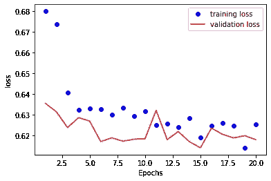

# 预测勒布朗詹姆斯与 RNN 的比赛结果

> 原文：<https://towardsdatascience.com/predict-lebron-jamess-game-results-with-rnn-1709f364d4d4?source=collection_archive---------43----------------------->

## 机器学习

## 众所周知，RNN 擅长分析序列数据。但是我们能应用它根据游戏历史预测游戏结果吗？


埃德加·恰帕罗在 [Unsplash](https://unsplash.com?utm_source=medium&utm_medium=referral) 上拍摄的照片

A 递归神经网络(RNN)是序列处理中最常用的深度学习算法之一。RNN 和前馈神经网络之间的区别在于，前者可以“记忆”序列中的时序信息，而后者可以一次性处理整个序列。

因此，当数据的时间顺序对问题很重要时，我们最好使用 RNN，例如时间序列数据分析或自然语言处理(NLP)。

然而，一个球员之前的比赛是否能够影响即将到来的比赛的结果仍在争论之中。所以，我想探究一下 RNN 是否适合篮球场上的比赛预测问题。

在这篇短文中，我试图使用一个深度学习模型，根据之前的比赛统计数据和结果来预测勒布朗·詹姆斯未来的比赛结果。

## 数据集

我用 Python 刮了勒布朗从 ***赛季 2003–04***到 ***赛季 2019–20***的**场 1258 场**的比赛统计。对刮痧程序感兴趣的可以参考[我之前的一篇帖子](/scrape-tabular-data-with-python-b1dd1aeadfad)。

这是数据的样子。


数据头

在[我的另一个帖子](/present-the-feature-importance-of-the-random-forest-classifier-99bb042be4cc)中，我已经说明了“GmSc”(玩家的游戏分数)、“+/-”(加减分)和“Minutes”(上场时间)是解释相应游戏结果的三个最重要的特征。因此，为了减少输入数据的维度，我只在我们的模型中保留这些游戏统计数据和游戏结果(“赢”)。对于每个数据点，我提取过去 10 场比赛的统计数据(t-9，t-8，…，t-1，t)，目的是预测下一场比赛(t + 1)的比赛结果。

我用前 800 场作为我们的训练数据，后 300 场作为验证数据，后 158 场作为测试数据。

数据的整个预处理如下所示。

```
data_u = df[["GmSc","+/-","Minutes","Win"]].to_numpy()
mean = data_u[:800].mean(axis=0)
data_u -= mean
std = data_u[:800].std(axis=0)
data_u /= std
```

标准化参数(平均值和标准偏差)仅从训练数据(前 800 场比赛)中生成，然后将这些参数应用于整个数据集。

加载整个数据集非常消耗内存，有时甚至是不可能的。所以使用**数据生成器**(在 **Keras** 中实现)向模型提供数据是处理这个问题的一个好选择。即使这里我有一个非常小的(1，258 个数据点)数据集，我仍然希望在我的管道中使用一个数据生成器，这将有利于将来的扩展。

```
def generator(data, lookback, delay, start, end, batch_size = 64):
    if end is None:
        end = len(data) - delay - 1
    i = start + lookback
    while True:
        if i + batch_size >= end:
            i = start + lookback
        rows = np.arange(i, min(i + batch_size, end))
        i += len(rows)
        samples = np.zeros((len(rows),
                           lookback,
                           data.shape[-1]))
        res_s = np.zeros((len(rows),))

        for j, row in enumerate(rows):
            indices = range(rows[j] - lookback, rows[j])
            samples[j] = data[indices]
            tar_v = data[rows[j] + delay][3]
            if tar_v > 0:
                res_s[j] = 1
            else:
                res_s[j] = 0
        yield samples, res_s
```

我将*回看*设置为 10，这意味着使用之前的 10 场比赛作为输入。我把*延迟*设为 1，表示预测下一场比赛结果。

```
lookback = 10
delay = 1
batch_size = 128
steps_per_epc = int(800/batch_size)
```

为了定义训练、验证和测试数据生成器，我只需要将开始和结束值提供给生成器函数。

```
train_generator = generator(data_u,
                           lookback = lookback,
                           delay = delay,
                           start = 0,
                           end = 800,
                           batch_size = batch_size)val_generator = generator(data_u,
                           lookback = lookback,
                           delay = delay,
                           start = 801,
                           end = 1100,
                           batch_size = batch_size)test_generator = generator(data_u,
                           lookback = lookback,
                           delay = delay,
                           start = 1101,
                           end = None,
                           batch_size = batch_size)
```

相应地，我需要指定检查验证和测试数据集所需的步骤数量。

```
val_steps = (1100 - 801 - lookback)
test_steps = (len(data_u) - 1101 - lookback)
```

接下来，我将构建模型结构。

## 建模结果

首先，我构建了一个具有密集连接层的人工神经网络作为我的基线模型，以便与我的其他模型进行比较。

```
from keras.models import Sequential
from keras import layers
from keras.optimizers import RMSpropmodel_ann = Sequential()
model_ann.add(layers.Flatten(input_shape = (lookback, data_u.shape[-1])))
model_ann.add(layers.Dense(32,activation = 'relu'))
model_ann.add(layers.Dropout(0.3))
model_ann.add(layers.Dense(1,activation = 'sigmoid'))
model_ann.summary()
```


人工神经网络模型结构

然后，我编译模型，记录拟合过程。

```
model_ann.compile(optimizer = RMSprop(lr = 1e-2),
                 loss = 'binary_crossentropy',
                 metrics = ['acc'])
history = model_ann.fit_generator(train_generator,
                                  steps_per_epoch=steps_per_epc,
                              epochs = 20, 
                              validation_data = val_generator,
                              validation_steps = val_steps)
```

为了检查验证数据集的性能，我绘制了损失曲线。

```
acc_ = history_dic['loss']
val_acc_ = history_dic['val_loss']
epochs = range(1,21)
#plt.clf()
plt.plot(epochs,acc_, 'bo', label = "training loss")
plt.plot(epochs, val_acc_, 'r', label = "validation loss")
plt.xlabel('Epochs')
plt.ylabel('loss')
plt.legend()
plt.show()
```


训练和验证人工神经网络损失

正如所料，模型在几个时期后变得过度拟合。为了客观地评价该模型，我将其应用于测试集，得到的准确率为 60%。

```
scores = model_ann.evaluate_generator(test_generator,test_steps) 
print("Accuracy = ", scores[1]," Loss = ", scores[0])
```


人工神经网络测试集性能

接下来，我通过使用一个 [LSTM 层](https://en.wikipedia.org/wiki/Long_short-term_memory)后跟两个紧密连接的层来实现 RNN。

```
model_rnn = Sequential()
model_rnn.add(layers.LSTM(32,
                        dropout=0.2,
                        recurrent_dropout=0.2,
                        input_shape=(None,data_u.shape[-1])))model_rnn.add(layers.Dense(32,activation = 'relu'))
model_rnn.add(layers.Dropout(0.3))
model_rnn.add(layers.Dense(1,activation='sigmoid'))
model_rnn.summary()
```


一层 LSTM 结构

模型训练类似于上面的 ANN。

```
model_rnn.compile(optimizer = RMSprop(lr = 1e-2),
                 loss = 'binary_crossentropy',
                 metrics = ['acc'])
history = model_rnn.fit_generator(train_generator, 
                                  steps_per_epoch=steps_per_epc,
                              epochs = 20, 
                              validation_data = val_generator,
                              validation_steps = val_steps)
```

训练集和验证集的性能如下。


1 层 LSTM 损耗

过拟合不像人工神经网络那样严重。我还在测试数据上评估了该模型，其准确率为 62.5%。尽管在测试集上的性能优于具有密集连接层的人工神经网络，但是改进是微小的。

为了获得更好的性能，我试图通过增加一个递归层来增加模型的复杂性。然而，为了减少计算成本，我用门控递归单元(GRU)代替了 LSTM 层。模型如下所示。

```
model_rnn = Sequential()
model_rnn.add(layers.GRU(32,
                        dropout=0.2,
                        recurrent_dropout=0.2,
                         return_sequences = True,
                        input_shape=(None,data_u.shape[-1])))
model_rnn.add(layers.GRU(64, activation = 'relu',dropout=0.2,recurrent_dropout=0.2))
model_rnn.add(layers.Dense(32,activation = 'relu'))
model_rnn.add(layers.Dropout(0.3))model_rnn.add(layers.Dense(1,activation = 'sigmoid'))
model_rnn.summary()
```


2 层 GRU 结构

训练集和验证集的性能如下。



第二层 GRU 损失

在图上没有检测到严重的过度拟合。即使测试数据的准确性已经提高到 64%,改进仍然很小。我开始怀疑 RNN 能否胜任这项工作。

然而，我通过进一步增加模型的复杂性来做最后的尝试。具体来说，我使递归层成为双向的。

```
model_rnn = Sequential()
model_rnn.add(layers.Bidirectional(layers.GRU(32,
                        dropout=0.2,
                        recurrent_dropout=0.2,
                         return_sequences = True),
                        input_shape=(None,data_u.shape[-1])))
model_rnn.add(layers.Bidirectional(layers.GRU(64, activation = 'relu',dropout=0.2,recurrent_dropout=0.2)))model_rnn.add(layers.Dense(32,activation = 'relu'))
model_rnn.add(layers.Dropout(0.3))
model_rnn.add(layers.Dense(1,activation='sigmoid'))
model_rnn.summary()
```


双向 RNN 结构

这一次，训练集和验证集的性能如下。


双向损失

实际上，在模型开始过拟合之前，这个模型和上一个模型在验证损失上没有太大区别。测试集的准确率也达到了 64%。

通过探索上面的所有模型，我有点意识到 RNN 可能不太适合 NBA 比赛结果预测问题。确实有几十个超参数可以调整，但是人工神经网络和 RNN 之间的差异太小。

## 数据诊断

我不想被测试集准确性的值所迷惑，所以我进一步诊断数据集，以检查模型是否真的有效。

我在训练、验证和测试数据集中检查勒布朗的詹姆斯胜率。


胜率的数据诊断

哎呀！测试数据集中的胜率是 62.7%，这意味着如果我猜测勒布朗会赢得所有比赛，我仍然得到 62.7%的准确率。

这些结果表明，我的模型并不比随机猜测好多少。伤心…

可能是我没有全面探索超参数空间，也可能是勒布朗的比赛不可预测。但有一点是肯定的，大约 1000 个数据点远远不够。

## 讨论

在本文中，我展示了一个为游戏结果预测问题开发失败模型的例子。如果你认为你没有从中学到什么，我想强迫自己列出一些要点。至少你可能会在建模中遇到这些细节。

1.  首先将模型推向过度拟合是很重要的，因为一个具有弱表示能力的模型永远不会解决问题。
2.  如果你的模型在大量的时期后仍然不合适，比如说 40 个，你可能需要增加学习率。
3.  如果你只接触到有限的数据，没有什么是新奇的。你的复杂模型可能比随机猜测更糟糕。

## 参考资料:

1.  弗朗索瓦·乔莱。[用 Python 进行深度学习。](https://www.manning.com/books/deep-learning-with-python)
2.  [篮球参考。](https://www.basketball-reference.com/)

谢谢你的时间。如果你喜欢读这篇文章，请[关注我的媒体](https://medium.com/@jianan.jay.lin)。以下是我之前的一些文章。

[](/one-potential-cause-of-overfitting-that-i-never-noticed-before-a57904c8c89d) [## 我以前从未注意到的过度拟合的一个潜在原因

### 当训练数据中的性能比测试数据中的性能好得多时，就会发生过度拟合。默认…

towardsdatascience.com](/one-potential-cause-of-overfitting-that-i-never-noticed-before-a57904c8c89d) [](/whos-the-mvp-of-nba-this-season-3e347c66a40a) [## 谁是本赛季 NBA 的最有价值球员？

### 一个案例研究，展示一个机器学习项目从开始到结束的样子。

towardsdatascience.com](/whos-the-mvp-of-nba-this-season-3e347c66a40a) [](/consider-multicollinearity-in-my-model-or-not-7aca16e74773) [## 是否在我的模型中考虑多重共线性？

### 简要讨论是否有必要修复特征空间中的多重共线性。我希望它会…

towardsdatascience.com](/consider-multicollinearity-in-my-model-or-not-7aca16e74773) 

皮特拉·施瓦兹勒在 [Unsplash](https://unsplash.com?utm_source=medium&utm_medium=referral) 上的照片