# 如何使用机器学习模型预测贷款资格

> 原文：<https://towardsdatascience.com/predict-loan-eligibility-using-machine-learning-models-7a14ef904057?source=collection_archive---------0----------------------->

## 构建预测模型，以自动确定合适的申请人。


纽约公共图书馆拍摄于 [Unsplash](https://unsplash.com?utm_source=medium&utm_medium=referral)

# 介绍

贷款是银行的核心业务。主要利润直接来自贷款利息。贷款公司在经过严格的验证和确认后发放贷款。然而，他们仍然没有保证，如果申请人能够毫无困难地偿还贷款。

在本教程中，我们将建立一个预测模型来预测申请人是否有能力偿还贷款公司。我们将使用 Jupyter Notebook 准备数据，并使用各种模型来预测目标变量。

[](https://github.com/mridulrb/Predict-loan-eligibility-using-IBM-Watson-Studio) [## mridulrb/Predict-loan-eligibility-using-IBM-Watson-Studio

### 贷款是贷款公司的核心业务。主要利润直接来自贷款利息。贷款…

github.com](https://github.com/mridulrb/Predict-loan-eligibility-using-IBM-Watson-Studio) 

注册一个 [**IBM Cloud**](https://cloud.ibm.com?cm_mmc=Inpersondirected-_-Audience+Developer_Developer+Conversation-_-WW_WW-_-Sep2020-mridul_bhandari_predict_loan_eligibility_using_machine_learning_models&cm_mmca1=000039JL&cm_mmca2=10010797) 账号来试试这个教程——

 [## IBM 云

### 使用 190 多种独特的服务立即开始建设。

ibm.biz](https://ibm.biz/BdqQBT) 

# 目录

1.  准备好系统并加载数据
2.  理解数据
3.  探索性数据分析(EDA)
    一、单变量分析
    二。双变量分析
4.  缺失值和异常值处理
5.  分类问题的评估标准
6.  模型构建:第 1 部分
7.  使用分层 k 倍交叉验证的逻辑回归
8.  特征工程
9.  建模:第二部分
    一、逻辑回归
    二。决策树
    三。随机森林
    四。XGBoost

# 准备好系统并加载数据

我们将在本课程中使用 Python 和下面列出的库。

**规格**

*   计算机编程语言
*   熊猫
*   海生的
*   sklearn

```
import pandas as pd
import numpy as np
import seaborn as sns
import matplotlib.pyplot as plt
%matplotlib inline
import warnings
warnings.filterwarnings(“ignore”)
```

# 数据

对于这个问题，我们有三个 CSV 文件:训练、测试和样本提交。

*   [训练文件](https://github.com/mridulrb/Predict-loan-eligibility-using-IBM-Watson-Studio/blob/master/Dataset/train_ctrUa4K.csv)将用于训练模型，即我们的模型将从该文件中学习。它包含所有的自变量和目标变量。
*   [测试文件](https://github.com/mridulrb/Predict-loan-eligibility-using-IBM-Watson-Studio/blob/master/Dataset/test_lAUu6dG.csv)包含所有自变量，但不包含目标变量。我们将应用该模型来预测测试数据的目标变量。
*   [样本提交文件](https://github.com/mridulrb/Predict-loan-eligibility-using-IBM-Watson-Studio/blob/master/Dataset/sample_submission_49d68Cx.csv)包含了我们提交预测的格式

# 读取数据

```
train = pd.read_csv(‘Dataset/train.csv’)
train.head()
```

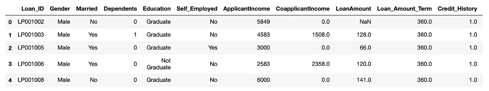

```
test = pd.read_csv(‘Dataset/test.csv’)
test.head()
```

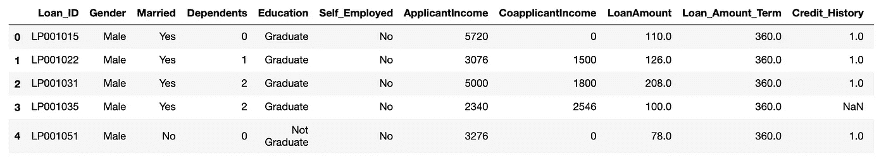

让我们制作一份训练和测试数据的副本，这样即使我们必须在这些数据集中进行任何更改，我们也不会丢失原始数据集。

```
train_original=train.copy()
test_original=test.copy()
```

# 理解数据

```
train.columnsIndex(['Loan_ID', 'Gender', 'Married', 'Dependents', 'Education',
       'Self_Employed', 'ApplicantIncome', 'CoapplicantIncome', 'LoanAmount',
       'Loan_Amount_Term', 'Credit_History', 'Property_Area', 'Loan_Status'],
      dtype='object')
```

我们有 12 个自变量和 1 个目标变量，即训练数据集中的 Loan_Status。

```
test.columnsIndex(['Loan_ID', 'Gender', 'Married', 'Dependents', 'Education',
       'Self_Employed', 'ApplicantIncome', 'CoapplicantIncome', 'LoanAmount',
       'Loan_Amount_Term', 'Credit_History', 'Property_Area'],
      dtype='object')
```

除了 Loan_Status 之外，测试数据集中的特性与训练数据集中的特性相似。我们将使用利用训练数据构建的模型来预测 Loan_Status。

```
train.dtypesLoan_ID               object
Gender                object
Married               object
Dependents            object
Education             object
Self_Employed         object
ApplicantIncome        int64
CoapplicantIncome    float64
LoanAmount           float64
Loan_Amount_Term     float64
Credit_History       float64
Property_Area         object
Loan_Status           object
dtype: object
```

我们可以看到有三种格式的数据类型:

*   对象:对象格式意味着变量是分类的。我们数据集中的分类变量是 Loan_ID、性别、已婚、受抚养人、教育、自雇、财产面积、贷款状态。
*   int64:代表整数变量。ApplicantIncome 是这种格式。
*   float64:它表示包含一些小数值的变量。它们也是数字的

```
train.shape(614, 13)
```

我们在训练数据集中有 614 行和 13 列。

```
test.shape(367, 12)
```

我们在测试数据集中有 367 行和 12 列。

```
train[‘Loan_Status’].value_counts()Y    422
N    192
Name: Loan_Status, dtype: int64
```

Normalize 可以设置为 True 来打印比例而不是数字

```
train[‘Loan_Status’].value_counts(normalize=True) Y    0.687296
N    0.312704
Name: Loan_Status, dtype: float64train[‘Loan_Status’].value_counts().plot.bar()
```

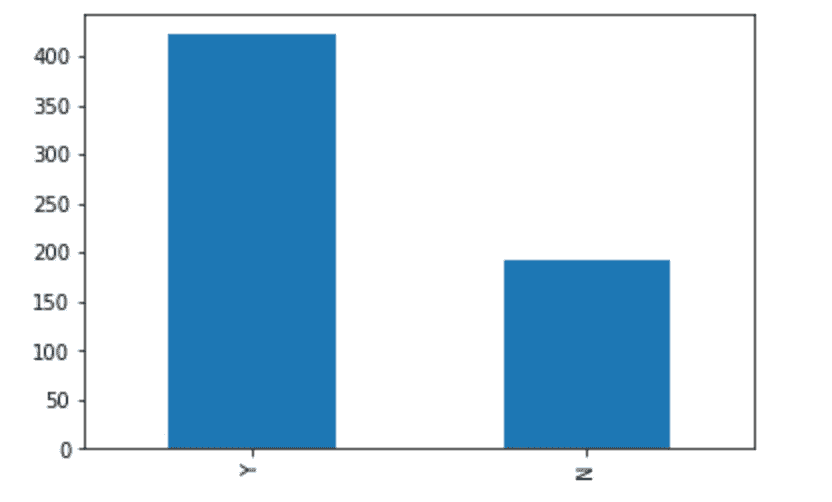

614 人中有 422 人(约 69%)的贷款获得批准。

现在，让我们分别把每个变量形象化。不同类型的变量有分类变量、顺序变量和数值变量。

*   **分类特征**:这些特征有类别(性别、已婚、自雇、信用记录、贷款状态)
*   **顺序特征**:分类特征中的变量，具有某种相关的顺序(家属、教育、财产面积)
*   **数字特征**:这些特征有数值(申请收入、共同申请收入、贷款金额、贷款金额期限)

# 独立变量(分类)

```
train[‘Gender’].value_counts(normalize=True).plot.bar(figsize=(20,10), title=’Gender’)
plt.show()
train[‘Married’].value_counts(normalize=True).plot.bar(title=’Married’)
plt.show()
train[‘Self_Employed’].value_counts(normalize=True).plot.bar(title=’Self_Employed’)
plt.show()
train[‘Credit_History’].value_counts(normalize=True).plot.bar(title=’Credit_History’)
plt.show()
```

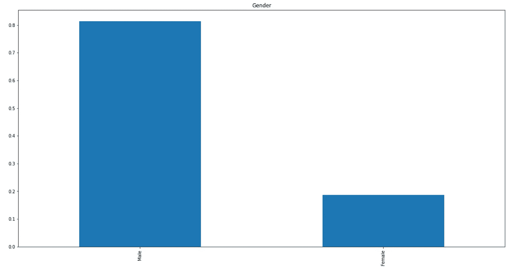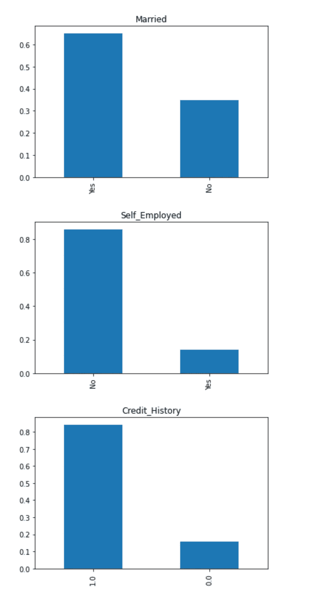

从上面的柱状图可以推断出:

*   数据集中 80%的申请者是男性。
*   数据集中大约 65%的申请者已婚。
*   数据集中大约 15%的申请者是个体经营者。
*   大约 85%的申请者打消了他们的疑虑。

# 独立变量(序数)

```
train[‘Dependents’].value_counts(normalize=True).plot.bar(figsize=(24,6), title=’Dependents’)
plt.show()
train[‘Education’].value_counts(normalize=True).plot.bar(title=’Education’)
plt.show()
train[‘Property_Area’].value_counts(normalize=True).plot.bar(title=’Property_Area’)
plt.show()
```

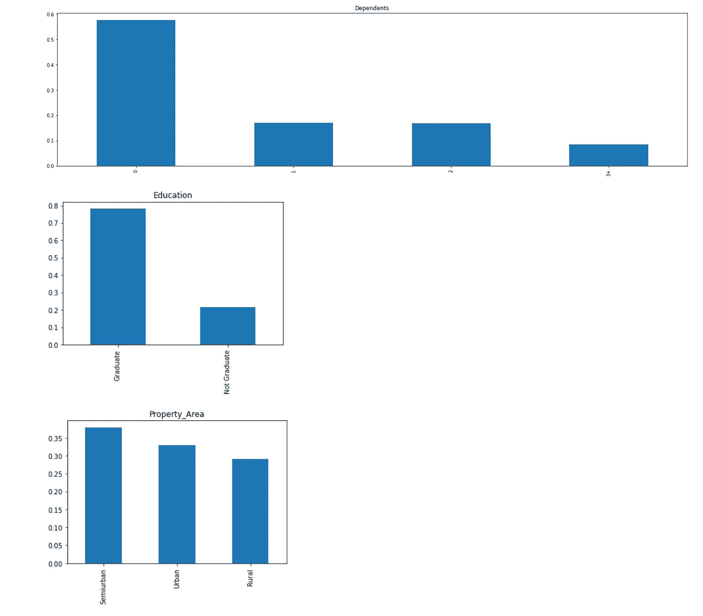

从上面的柱状图可以得出以下推论:

*   大多数申请人没有任何家属。
*   大约 80%的申请者是毕业生。
*   大多数申请者来自半城市地区。

# 独立变量(数字)

到目前为止，我们已经看到了分类变量和顺序变量，现在让我们来看看数字变量。我们先来看一下申请人收入的分布。

```
sns.distplot(train[‘ApplicantIncome’])
plt.show()
train[‘ApplicantIncome’].plot.box(figsize=(16,5))
plt.show()
```

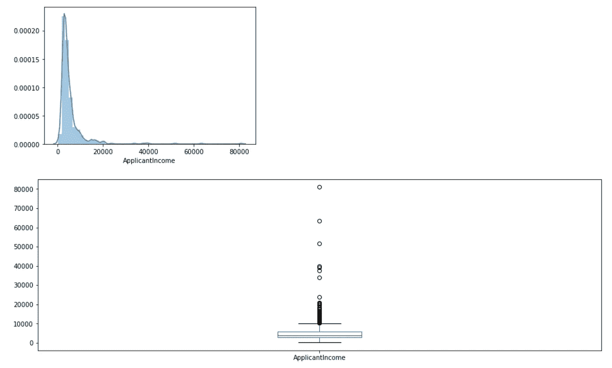

可以推断，申请人收入分布中的大部分数据是向左的，这意味着它不是正态分布的。我们将在后面的章节中尝试使其正常化，因为如果数据呈正态分布，算法会工作得更好。

箱线图证实了大量异常值/极值的存在。这可以归因于社会的收入差距。部分原因可能是因为我们关注的是不同教育水平的人。让我们通过教育把他们分开。

```
train.boxplot(column=’ApplicantIncome’, by = ‘Education’) 
plt.suptitle(“”)
```

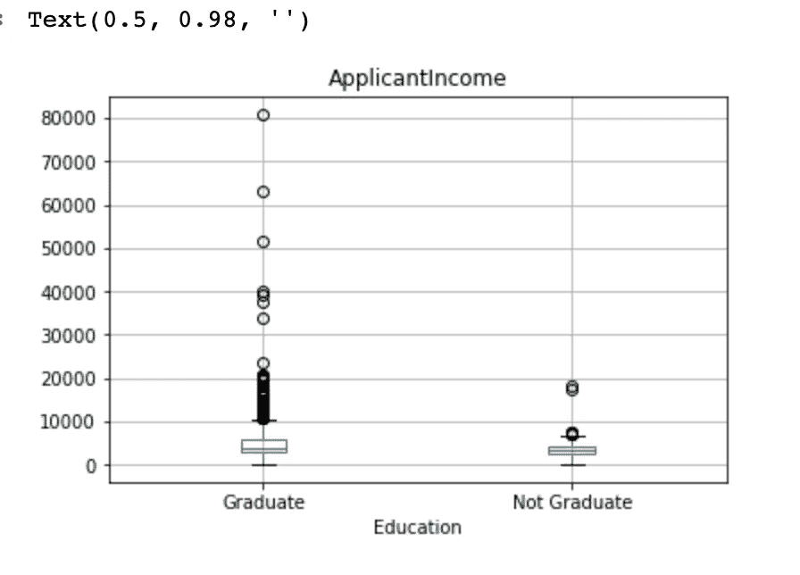

我们可以看到，有更多的高收入毕业生，他们似乎是局外人。

让我们看看共同申请人的收入分布。

```
sns.distplot(train[‘CoapplicantIncome’])
plt.show()
train[‘CoapplicantIncome’].plot.box(figsize=(16,5))
plt.show()
```

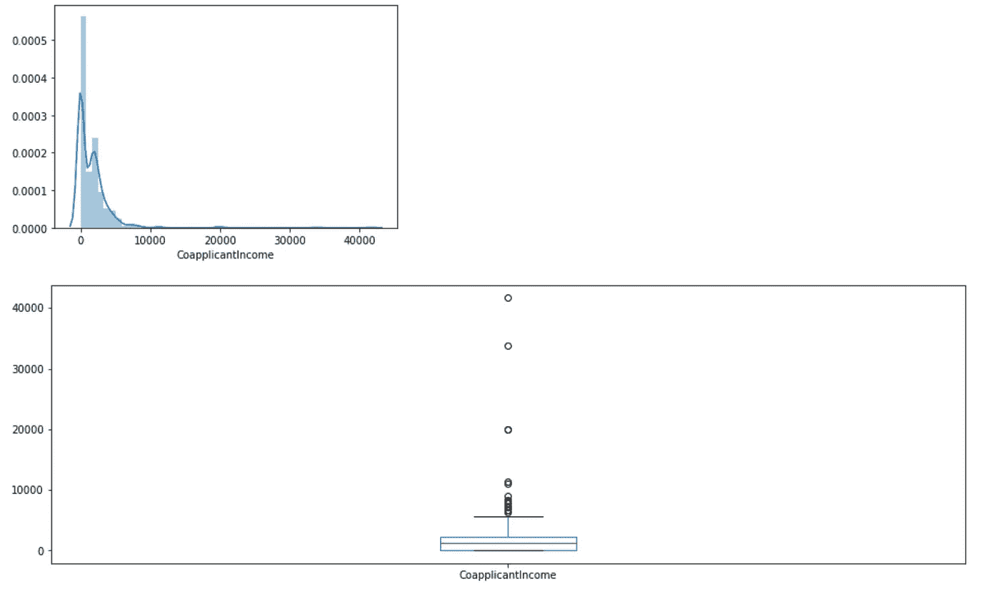

我们看到与申请人的收入分布相似的分布。大多数共同申请人的收入范围从 0 到 5000 英镑。我们也看到申请人的收入中有很多异常值，而且不是正态分布的。

```
train.notna()
sns.distplot(train[‘LoanAmount’])
plt.show()
train[‘LoanAmount’].plot.box(figsize=(16,5))
plt.show()
```

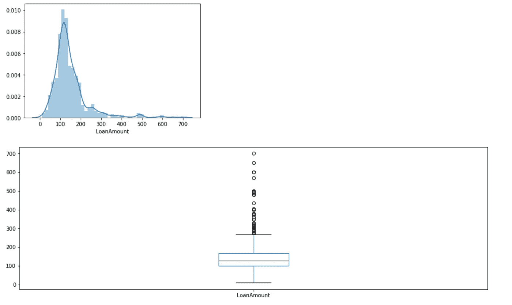

我们在这个变量中看到许多异常值，并且分布相当正常。我们将在后面的章节中处理异常值。

# 双变量分析

让我们回忆一下我们之前提出的一些假设:

*   高收入的申请者应该有更多的贷款批准机会。
*   偿还了以前债务的申请人应该有更高的贷款批准机会。
*   贷款审批也应取决于贷款金额。贷款金额少的话，贷款获批的几率应该高。
*   每月偿还贷款的金额越少，贷款获得批准的机会就越大。

让我们尝试使用双变量分析来检验上述假设。

在单变量分析中单独研究了每个变量后，我们现在将再次研究它们与目标变量的关系。

# 分类自变量与目标变量

首先，我们将找到目标变量和分类自变量之间的关系。现在让我们看看堆积条形图，它将给出已批准和未批准贷款的比例。

```
Gender=pd.crosstab(train[‘Gender’],train[‘Loan_Status’])
Gender.div(Gender.sum(1).astype(float), axis=0).plot(kind=”bar”,stacked=True,figsize=(4,4))
plt.show()
```

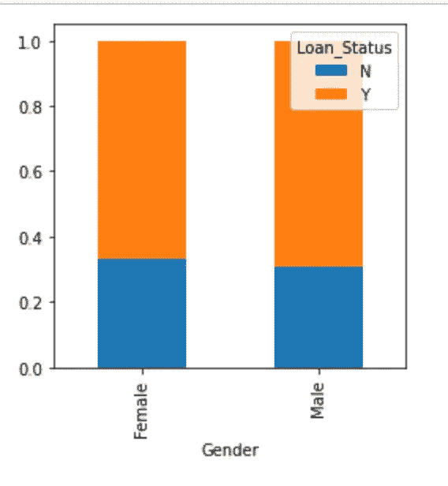

可以推断，无论是批准的贷款还是未批准的贷款，男女申请人的比例大致相同。

现在让我们把剩下的分类变量和目标变量形象化。

```
Married=pd.crosstab(train[‘Married’],train[‘Loan_Status’])
Dependents=pd.crosstab(train[‘Dependents’],train[‘Loan_Status’])
Education=pd.crosstab(train[‘Education’],train[‘Loan_Status’])
Self_Employed=pd.crosstab(train[‘Self_Employed’],train[‘Loan_Status’])
Married.div(Married.sum(1).astype(float), axis=0).plot(kind=”bar”,stacked=True,figsize=(4,4))
plt.show()
Dependents.div(Dependents.sum(1).astype(float), axis=0).plot(kind=”bar”,stacked=True,figsize=(4,4))
plt.show()
Education.div(Education.sum(1).astype(float), axis=0).plot(kind=”bar”,stacked=True,figsize=(4,4))
plt.show()
Self_Employed.div(Self_Employed.sum(1).astype(float), axis=0).plot(kind=”bar”,stacked=True,figsize=(4,4))
plt.show()
```

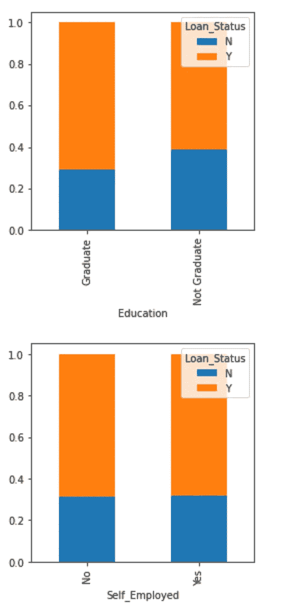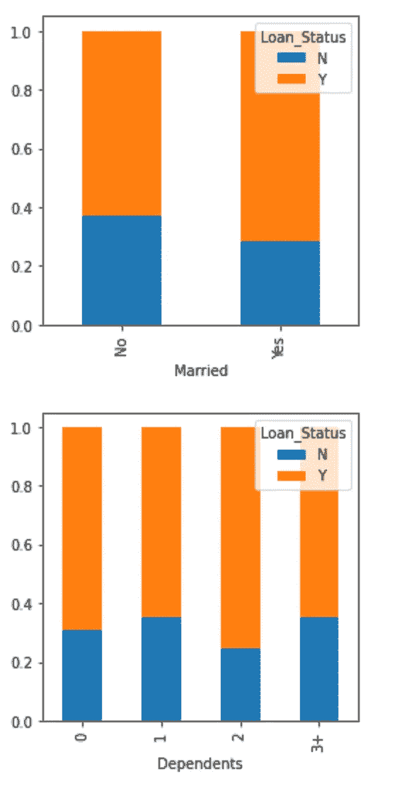

*   对于已批准的贷款，已婚申请人的比例更高。
*   有 1 个或 3 个以上受抚养人的申请人在两种贷款状态类别中的分布相似。
*   从自营职业者与贷款者的对比图中，我们无法推断出任何有意义的东西。

现在我们来看看剩余的分类自变量和 Loan_Status 之间的关系。

```
Credit_History=pd.crosstab(train[‘Credit_History’],train[‘Loan_Status’])
Property_Area=pd.crosstab(train[‘Property_Area’],train[‘Loan_Status’])
Credit_History.div(Credit_History.sum(1).astype(float), axis=0).plot(kind=”bar”,stacked=True,figsize=(4,4))
plt.show()
Property_Area.div(Property_Area.sum(1).astype(float), axis=0).plot(kind=”bar”,stacked=True)
plt.show()
```

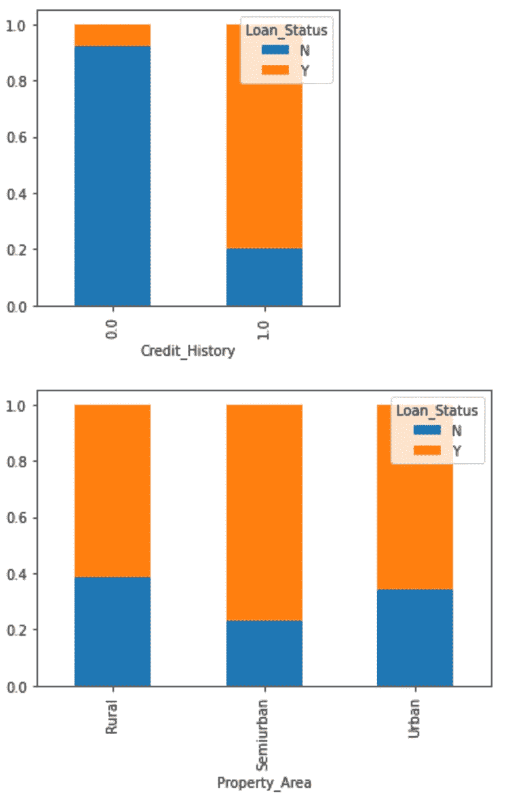

*   看起来信用记录为 1 的人更有可能获得贷款批准。
*   与农村或城市地区相比，半城市地区获得批准的贷款比例更高。

现在，让我们想象一下相对于目标变量的独立变量的数值。

# 数字自变量与目标变量

我们将尝试找出贷款已被批准的人的平均收入与贷款未被批准的人的平均收入。

```
train.groupby(‘Loan_Status’)[‘ApplicantIncome’].mean().plot.bar()
```

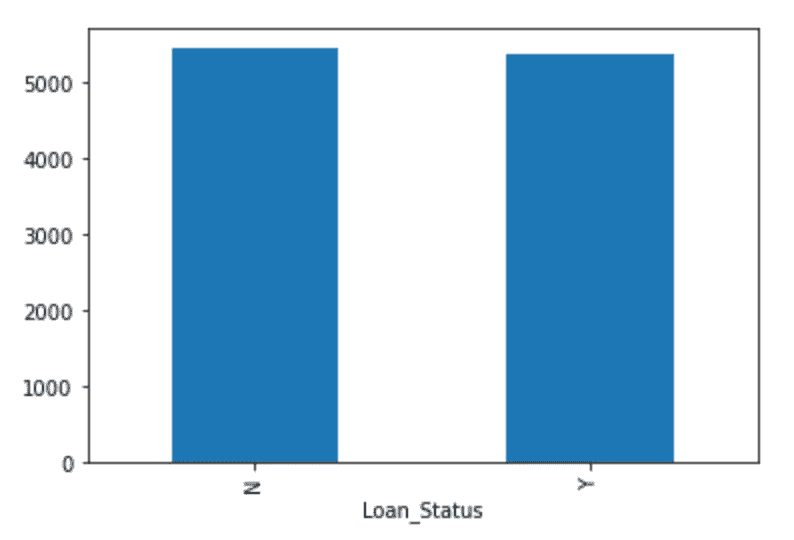

这里的 y 轴代表申请人的平均收入。我们看不到平均收入有任何变化。因此，让我们根据申请人收入变量中的值为其创建箱，并分析每个箱对应的贷款状态。

```
bins=[0,2500,4000,6000,81000]
group=[‘Low’,’Average’,’High’,’Very high’]
train[‘Income_bin’]=pd.cut(train[‘ApplicantIncome’],bins,labels=group)
Income_bin=pd.crosstab(train[‘Income_bin’],train[‘Loan_Status’])
Income_bin.div(Income_bin.sum(1).astype(float), axis=0).plot(kind=”bar”,stacked=True)
plt.xlabel(‘ApplicantIncome’)
P=plt.ylabel(‘Percentage’)
```

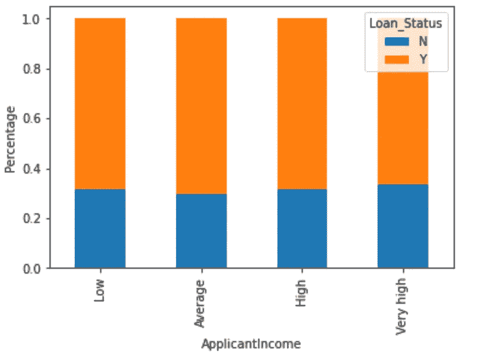

可以推断，申请人的收入不影响贷款批准的机会，这与我们的假设相矛盾，我们假设如果申请人的收入高，贷款批准的机会也高。

我们将以类似的方式分析共同申请人的收入和贷款额变量。

```
bins=[0,1000,3000,42000]
group=[‘Low’,’Average’,’High’]
train[‘Coapplicant_Income_bin’]=pd.cut(train[‘CoapplicantIncome’],bins,labels=group)
Coapplicant_Income_bin=pd.crosstab(train[‘Coapplicant_Income_bin’],train[‘Loan_Status’])
Coapplicant_Income_bin.div(Coapplicant_Income_bin.sum(1).astype(float), axis=0).plot(kind=”bar”,stacked=True)
plt.xlabel(‘CoapplicantIncome’)
P=plt.ylabel(‘Percentage’)
```

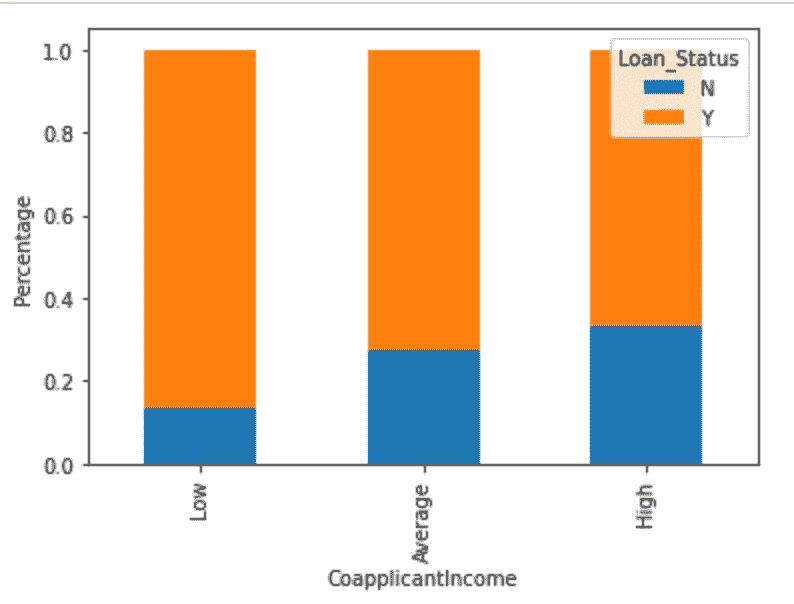

它表明，如果共同申请人的收入较低，贷款批准的机会很高。但这看起来不对。这背后可能的原因是，大多数申请人没有任何共同申请人，因此这些申请人的共同申请人收入为 0，因此贷款审批不依赖于此。因此，我们可以创建一个新的变量，将申请人和共同申请人的收入结合起来，以可视化收入对贷款审批的综合影响。

让我们结合申请人收入和共同申请人收入，看看总收入对贷款状态的综合影响。

```
train[‘Total_Income’]=train[‘ApplicantIncome’]+train[‘CoapplicantIncome’]
bins=[0,2500,4000,6000,81000]
group=[‘Low’,’Average’,’High’,’Very high’]
train[‘Total_Income_bin’]=pd.cut(train[‘Total_Income’],bins,labels=group)
Total_Income_bin=pd.crosstab(train[‘Total_Income_bin’],train[‘Loan_Status’])
Total_Income_bin.div(Total_Income_bin.sum(1).astype(float), axis=0).plot(kind=”bar”,stacked=True)
plt.xlabel(‘Total_Income’)
P=plt.ylabel(‘Percentage’)
```

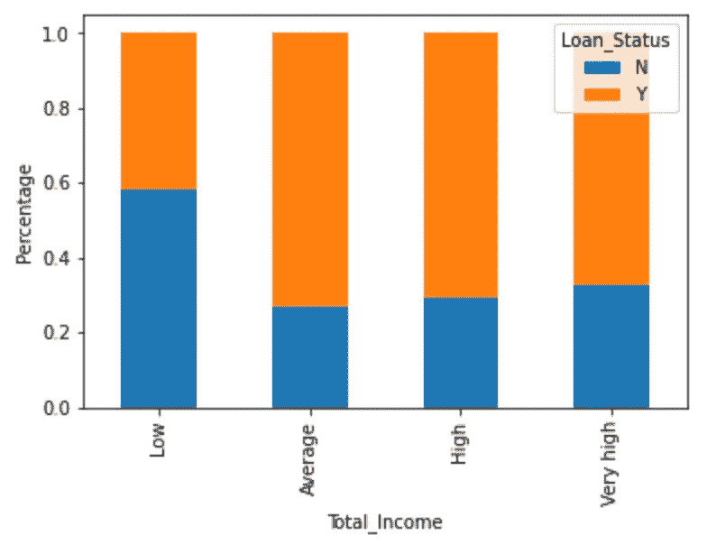

我们可以看到，与平均收入、高收入和非常高收入的申请人相比，低总收入的申请人获得贷款批准的比例非常低。

让我们想象一下贷款金额变量。

```
bins=[0,100,200,700]
group=[‘Low’,’Average’,’High’]
train[‘LoanAmount_bin’]=pd.cut(train[‘LoanAmount’],bins,labels=group)
LoanAmount_bin=pd.crosstab(train[‘LoanAmount_bin’],train[‘Loan_Status’])
LoanAmount_bin.div(LoanAmount_bin.sum(1).astype(float), axis=0).plot(kind=”bar”,stacked=True)
plt.xlabel(‘LoanAmount’)
P=plt.ylabel(‘Percentage’)
```

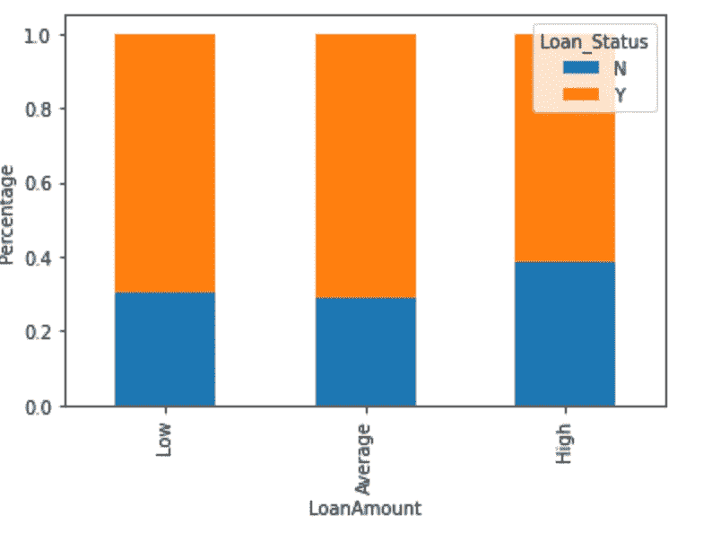

可以看出，与高贷款额相比，低贷款额和平均贷款额的批准贷款比例更高，这支持了我们的假设，即我们认为当贷款额较低时，贷款批准的机会将会较高。

让我们删除为探索部分创建的垃圾箱。我们将把从属变量中的 3+改为 3，使它成为一个数字变量。我们还会将目标变量的类别转换为 0 和 1，以便我们可以找到它与数值变量的相关性。这样做的另一个原因是像逻辑回归这样的模型很少只接受数值作为输入。我们将用 0 代替 N，用 1 代替 Y。

```
train=train.drop([‘Income_bin’, ‘Coapplicant_Income_bin’, ‘LoanAmount_bin’, ‘Total_Income_bin’, ‘Total_Income’], axis=1)
train[‘Dependents’].replace(‘3+’, 3,inplace=True)
test[‘Dependents’].replace(‘3+’, 3,inplace=True)
train[‘Loan_Status’].replace(’N’, 0,inplace=True)
train[‘Loan_Status’].replace(‘Y’, 1,inplace=True)
```

现在让我们看看所有数值变量之间的相关性。我们将使用热图来可视化这种关联。热图通过不同的颜色将数据可视化。颜色越深的变量表示相关性越大。

```
matrix = train.corr()
f, ax = plt.subplots(figsize=(9,6))
sns.heatmap(matrix,vmax=.8,square=True,cmap=”BuPu”, annot = True)
```

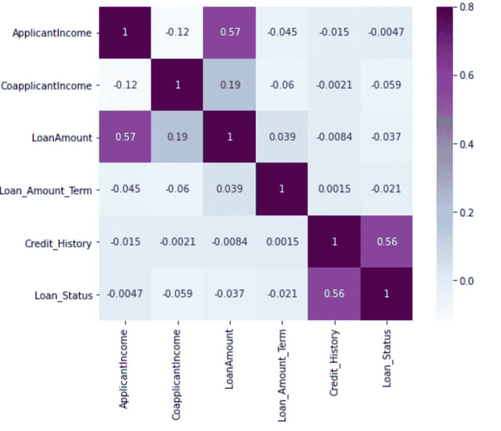

我们看到最相关的变量是(申请收入—贷款金额)和(信用记录—贷款状态)。贷款金额也与共同申请人收入相关。

# 缺失值插补

让我们列出缺失值的特性计数。

```
train.isnull().sum()
Loan_ID               0
Gender               13
Married               3
Dependents           15
Education             0
Self_Employed        32
ApplicantIncome       0
CoapplicantIncome     0
LoanAmount           22
Loan_Amount_Term     14
Credit_History       50
Property_Area         0
Loan_Status           0
dtype: int64
```

性别、已婚、受抚养人、自营职业、贷款金额、贷款金额期限和信用历史记录要素中缺少值。

我们将逐一处理所有特性中缺失的值。

我们可以考虑用这些方法来填补缺失值:

*   对于数值变量:使用平均数或中位数进行插补
*   对于分类变量:使用模式插补

性别、已婚、受抚养人、信用记录和自营职业要素中很少有缺失值，因此我们可以使用要素的模式来填充它们。

```
train[‘Gender’].fillna(train[‘Gender’].mode()[0], inplace=True)
train[‘Married’].fillna(train[‘Married’].mode()[0], inplace=True)
train[‘Dependents’].fillna(train[‘Dependents’].mode()[0], inplace=True)
train[‘Self_Employed’].fillna(train[‘Self_Employed’].mode()[0], inplace=True)
train[‘Credit_History’].fillna(train[‘Credit_History’].mode()[0], inplace=True)
```

现在让我们尝试找到一种方法来填充 Loan_Amount_Term 中缺少的值。我们将查看贷款金额期限变量的值计数。

```
train[‘Loan_Amount_Term’].value_counts()
360.0    512
180.0     44
480.0     15
300.0     13
84.0       4
240.0      4
120.0      3
36.0       2
60.0       2
12.0       1
Name: Loan_Amount_Term, dtype: int64
```

可以看出，在贷款金额期限变量中，360 的值是重复最多的。所以我们会用这个变量的模式来替换这个变量中缺失的值。

```
train[‘Loan_Amount_Term’].fillna(train[‘Loan_Amount_Term’].mode()[0], inplace=True)
```

现在我们将看到 LoanAmount 变量。由于它是一个数值变量，我们可以使用均值或中值来估算缺失值。我们将使用中值来填充空值，因为之前我们看到贷款金额有异常值，所以平均值不是正确的方法，因为它受异常值的影响很大。

```
train[‘LoanAmount’].fillna(train[‘LoanAmount’].median(), inplace=True)
```

现在，让我们检查数据集中是否填充了所有缺失的值。

```
train.isnull().sum()
Loan_ID              0
Gender               0
Married              0
Dependents           0
Education            0
Self_Employed        0
ApplicantIncome      0
CoapplicantIncome    0
LoanAmount           0
Loan_Amount_Term     0
Credit_History       0
Property_Area        0
Loan_Status          0
dtype: int64
```

正如我们所看到的，所有缺失的值都已经被填充到测试数据集中。让我们用同样的方法填充测试数据集中所有缺失的值。

```
test[‘Gender’].fillna(train[‘Gender’].mode()[0], inplace=True)
test[‘Married’].fillna(train[‘Married’].mode()[0], inplace=True)
test[‘Dependents’].fillna(train[‘Dependents’].mode()[0], inplace=True)
test[‘Self_Employed’].fillna(train[‘Self_Employed’].mode()[0], inplace=True)
test[‘Credit_History’].fillna(train[‘Credit_History’].mode()[0], inplace=True)
test[‘Loan_Amount_Term’].fillna(train[‘Loan_Amount_Term’].mode()[0], inplace=True)
test[‘LoanAmount’].fillna(train[‘LoanAmount’].median(), inplace=True)
```

# 异常值处理

正如我们在前面的单变量分析中看到的，LoanAmount 包含异常值，因此我们必须将它们视为异常值的存在会影响数据的分布。让我们来看看有离群值的数据集会发生什么。对于样本数据集:
1，1，2，2，2，2，3，3，3，4，4
我们发现如下:均值、中值、众数和标准差
均值= 2.58
中值= 2.5
众数=2
标准差= 1.08
如果我们向数据集添加一个异常值:
1，1，2，2，2，2，2，2，3，3，4，4400
我们必须采取措施消除数据集中的异常值。
由于这些异常值，贷款金额中的大部分数据位于左侧，右尾较长。这叫做右偏度。消除偏斜的一种方法是进行对数变换。当我们进行对数变换时，它不会对较小的值产生太大的影响，但会减少较大的值。所以，我们得到一个类似于正态分布的分布。
我们来可视化一下 log 变换的效果。我们将同时对测试文件进行类似的修改。

```
train[‘LoanAmount_log’]=np.log(train[‘LoanAmount’])
train[‘LoanAmount_log’].hist(bins=20)
test[‘LoanAmount_log’]=np.log(test[‘LoanAmount’])
```

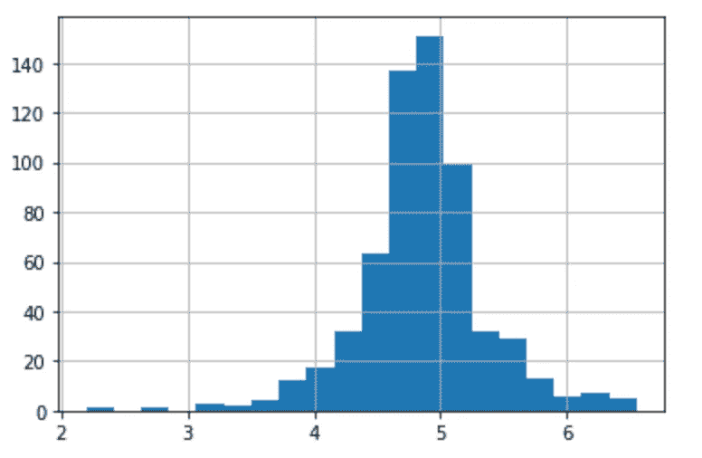

现在，分布看起来更接近正常，极端值的影响已经大大减弱。让我们建立一个逻辑回归模型，并对测试数据集进行预测。

# 模型构建:第一部分

让我们用第一个模型来预测目标变量。我们将从用于预测二元结果的逻辑回归开始。

*   逻辑回归是一种分类算法。它用于预测给定一组独立变量的二元结果(1 / 0，是/否，真/假)。
*   逻辑回归是对 Logit 函数的估计。logit 函数仅仅是对事件有利的概率的记录。
*   该函数使用概率估计值创建一条 S 形曲线，这与所需的逐步函数非常相似

要进一步了解逻辑回归，请参考本文:[https://www . analyticsvidhya . com/blog/2015/10/basics-logistic-regression/](https://www.analyticsvidhya.com/blog/2015/10/basics-logistic-regression/)
让我们删除 Loan_ID 变量，因为它对贷款状态没有任何影响。我们将对测试数据集进行与训练数据集相同的更改。

```
train=train.drop(‘Loan_ID’,axis=1)
test=test.drop(‘Loan_ID’,axis=1)
```

我们将使用 scikit-learn (sklearn)来制作不同的模型，这是 Python 的一个开源库。它是最有效的工具之一，包含许多内置函数，可用于 Python 建模。

想进一步了解 sklearn，参考这里:[http://scikit-learn.org/stable/tutorial/index.html](http://scikit-learn.org/stable/tutorial/index.html)

Sklearn 需要单独数据集中的目标变量。因此，我们将从训练数据集中删除目标变量，并将其保存在另一个数据集中。

```
X = train.drop(‘Loan_Status’,1)
y = train.Loan_Status
```

现在我们将为分类变量制造虚拟变量。虚拟变量将分类变量转化为一系列 0 和 1，使它们更容易量化和比较。让我们先了解一下假人的流程:

*   考虑“性别”变量。它有两个阶层，男性和女性。
*   由于逻辑回归只将数值作为输入，我们必须将男性和女性转换为数值。
*   一旦我们对这个变量应用了虚拟变量，它就会将“性别”变量转换为两个变量(性别 _ 男性和性别 _ 女性)，每个类一个，即男性和女性。
*   如果性别为女性，则性别 _ 男性的值为 0，如果性别为男性，则值为 1。

```
X = pd.get_dummies(X)
train=pd.get_dummies(train)
test=pd.get_dummies(test)
```

现在，我们将在训练数据集上训练模型，并对测试数据集进行预测。但是我们能证实这些预测吗？一种方法是，我们可以将训练数据集分为两部分:训练和验证。我们可以在这个训练部分训练模型，并使用它对验证部分进行预测。这样，我们可以验证我们的预测，因为我们有验证部分的真实预测(我们没有测试数据集的真实预测)。

我们将使用 sklearn 的 train_test_split 函数来划分我们的训练数据集。所以，首先让我们导入 train_test_split。

```
from sklearn.model_selection import train_test_split
x_train, x_cv, y_train, y_cv = train_test_split(X,y, test_size=0.3)
```

数据集分为训练和验证两部分。让我们从 sklearn 导入 LogisticRegression 和 accuracy_score 并拟合逻辑回归模型。

```
from sklearn.linear_model import LogisticRegression
from sklearn.metrics import accuracy_score
model = LogisticRegression()
model.fit(x_train, y_train)LogisticRegression()
```

这里，C 参数表示正则化强度的倒数。正则化是应用惩罚来增加参数值的幅度，以便减少过度拟合。C 值越小，正则化越强。要了解其他参数，请参考这里:[http://sci kit-](http://scikit-/)learn.org/stable/modules/generated/sklearn.linear_model.LogisticRegression.html

让我们预测验证集的 Loan_Status 并计算其准确性。

```
pred_cv = model.predict(x_cv)
accuracy_score(y_cv,pred_cv)0.7891891891891892
```

因此，我们的预测几乎 80%准确，也就是说，我们已经正确识别了 80%的贷款状态。

让我们对测试数据集进行预测。

```
pred_test = model.predict(test)
```

让我们导入我们必须在解决方案检查器上提交的提交文件。

```
submission = pd.read_csv(‘Dataset/sample_submission.csv’)
submission.head()
```

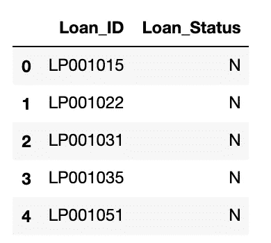

我们只需要最终提交的 Loan_ID 和相应的 Loan_Status。我们将用测试数据集的 Loan_ID 和我们做出的预测(即 pred_test)分别填充这些列。

```
submission[‘Loan_Status’]=pred_test
submission[‘Loan_ID’]=test_original[‘Loan_ID’]
```

记住我们需要 Y 和 n 的预测，所以让我们把 1 和 0 转换成 Y 和 n。

```
submission[‘Loan_Status’].replace(0, ’N’, inplace=True)
submission[‘Loan_Status’].replace(1, ‘Y’, inplace=True)
```

最后，我们将把提交转换成。csv 格式。

```
pd.DataFrame(submission, columns=[‘Loan_ID’,’Loan_Status’]).to_csv(‘Output/logistic.csv’)
```

# 使用分层 k 倍交叉验证的逻辑回归

为了检查我们的模型对看不见的数据有多稳健，我们可以使用验证。这是一种涉及保留数据集的特定样本的技术，您不需要在该样本上训练模型。稍后，在最终确定之前，您将在这个样本上测试您的模型。下面列出了一些常用的验证方法:

*   验证集方法
*   k 倍交叉验证
*   遗漏一项交叉验证(LOOCV)
*   分层 k 倍交叉验证

如果你希望了解更多的验证技术，那么请参考这篇文章:[https://www . analyticsvidhya . com/blog/2018/05/improve-model-performance-cross-validation-in-python-r/](https://www.analyticsvidhya.com/blog/2018/05/improve-model-performance-cross-validation-in-python-r/)

在本节中，我们将了解分层 k-fold 交叉验证。让我们了解它是如何工作的:

*   分层是重新排列数据的过程，以确保每个折叠都是整体的良好代表。
*   例如，在二进制分类问题中，每个类包含 50%的数据，最好安排数据，使得在每个文件夹中，每个类包含大约一半的实例。
*   在处理偏差和方差时，这通常是一种更好的方法。
*   随机选择的倍数可能不足以代表小类，特别是在存在巨大的类不平衡的情况下。

我们从 sklearn 导入 StratifiedKFold，拟合模型。

```
from sklearn.model_selection import StratifiedKFold
```

现在，让我们制作一个具有分层 5 层的交叉验证逻辑模型，并对测试数据集进行预测。

```
i=1
mean = 0
kf = StratifiedKFold(n_splits=5,random_state=1)
for train_index,test_index in kf.split(X,y):
 print (‘\n{} of kfold {} ‘.format(i,kf.n_splits))
 xtr,xvl = X.loc[train_index],X.loc[test_index]
 ytr,yvl = y[train_index],y[test_index]
 model = LogisticRegression(random_state=1)
 model.fit(xtr,ytr)
 pred_test=model.predict(xvl)
 score=accuracy_score(yvl,pred_test)
 mean += score
 print (‘accuracy_score’,score)
 i+=1
 pred_test = model.predict(test)
 pred = model.predict_proba(xvl)[:,1]
print (‘\n Mean Validation Accuracy’,mean/(i-1))1 of kfold 5 
accuracy_score 0.8048780487804879

2 of kfold 5 
accuracy_score 0.7642276422764228

3 of kfold 5 
accuracy_score 0.7804878048780488

4 of kfold 5 
accuracy_score 0.8455284552845529

5 of kfold 5 
accuracy_score 0.8032786885245902

Mean Validation Accuracy 0.7996801279488205
```

该模型的平均验证精度为 0.80。让我们想象一下 roc 曲线。

```
from sklearn import metrics
fpr, tpr, _ = metrics.roc_curve(yvl, pred)
auc = metrics.roc_auc_score(yvl, pred)
plt.figure(figsize=(12,8))
plt.plot(fpr, tpr, label=”validation, auc=”+str(auc))
plt.xlabel(‘False Positive Rate’)
plt.ylabel(‘True Positive Rate’)
plt.legend(loc=4)
plt.show()
```

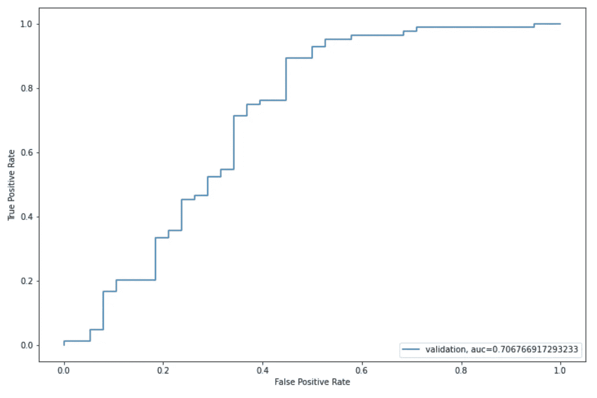

我们得到的 auc 值为 0.70

```
submission[‘Loan_Status’]=pred_test
submission[‘Loan_ID’]=test_original[‘Loan_ID’]
```

记住我们需要 Y 和 n 的预测，所以让我们把 1 和 0 转换成 Y 和 n。

```
submission[‘Loan_Status’].replace(0, ’N’, inplace=True)
submission[‘Loan_Status’].replace(1, ‘Y’, inplace=True)pd.DataFrame(submission, columns=[‘Loan_ID’,’Loan_Status’]).to_csv(‘Output/Log1.csv’)
```

# 特征工程

基于领域知识，我们可以提出可能影响目标变量的新特性。我们将创建以下三个新功能:

*   **总收入** —正如在双变量分析中所讨论的，我们将合并申请人收入和共同申请人收入。如果总收入很高，贷款批准的机会也可能很高。
*   **EMI** — EMI 是申请人每月偿还贷款的金额。这个变量背后的想法是，高 EMI 的人可能会发现很难偿还贷款。我们可以通过贷款金额与贷款金额期限的比率来计算 EMI。
*   **余额收入** —这是支付 EMI 后剩下的收入。创建这个变量的想法是，如果这个值高，一个人偿还贷款的机会就高，因此增加了贷款批准的机会。

```
train[‘Total_Income’]=train[‘ApplicantIncome’]+train[‘CoapplicantIncome’]
test[‘Total_Income’]=test[‘ApplicantIncome’]+test[‘CoapplicantIncome’]
```

让我们检查总收入的分布。

```
sns.distplot(train[‘Total_Income’])
```

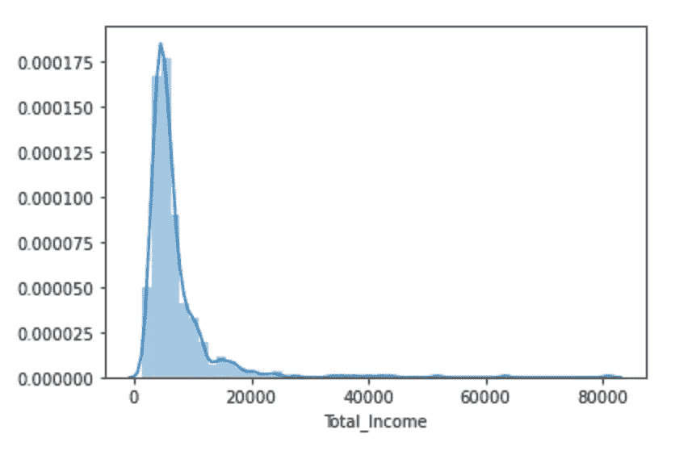

我们可以看到它向左移动，也就是说，分布是右偏的。所以，我们来取对数变换，使分布呈正态分布。

```
train[‘Total_Income_log’] = np.log(train[‘Total_Income’])
sns.distplot(train[‘Total_Income_log’])
test[‘Total_Income_log’] = np.log(test[‘Total_Income’])
```

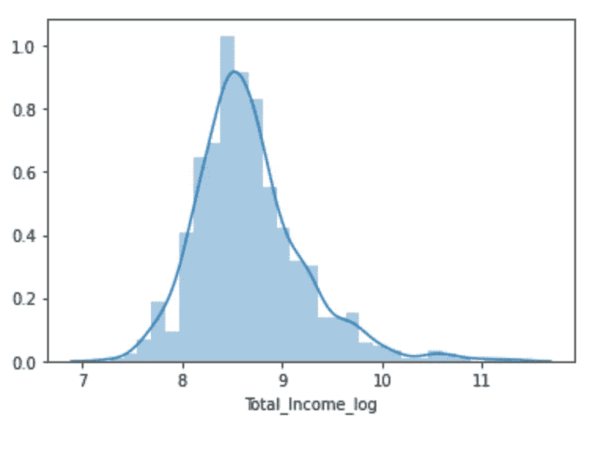

现在，分布看起来更接近正常，极端值的影响已经大大减弱。现在让我们创建 EMI 特征。

```
train[‘EMI’]=train[‘LoanAmount’]/train[‘Loan_Amount_Term’]
test[‘EMI’]=test[‘LoanAmount’]/test[‘Loan_Amount_Term’]
```

让我们检查一下 EMI 变量的分布。

```
sns.distplot(train[‘EMI’])
```

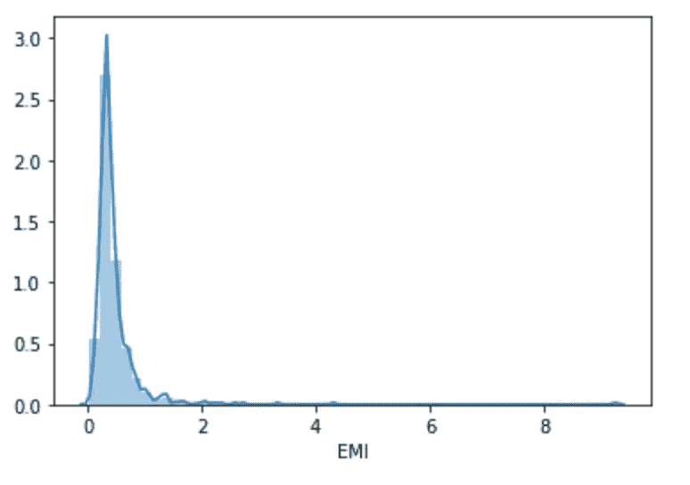

```
train[‘Balance Income’] = train[‘Total_Income’]-(train[‘EMI’]*1000)
test[‘Balance Income’] = test[‘Total_Income’]-(test[‘EMI’]*1000)
sns.distplot(train[‘Balance Income’])
```

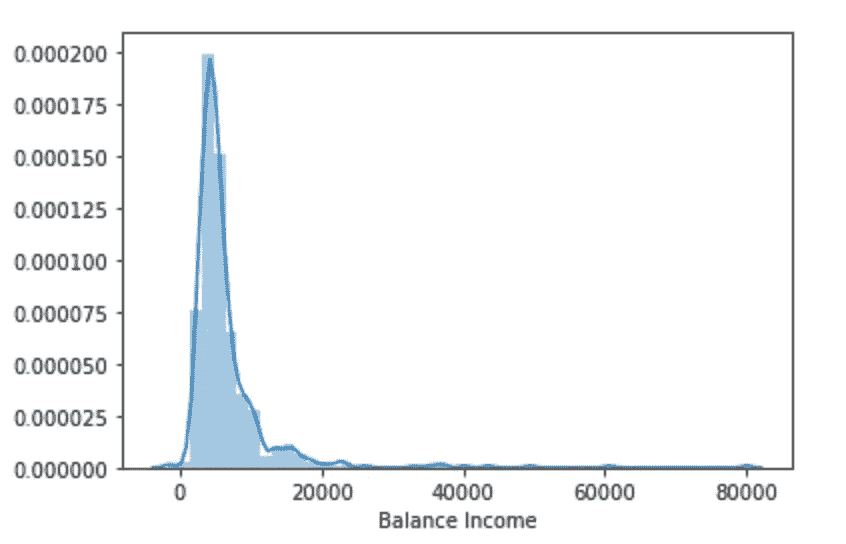

现在，让我们放弃用来创建这些新功能的变量。这样做的原因是，那些旧特征和这些新特征之间的相关性会非常高，而逻辑回归假设变量之间的相关性并不高。我们还希望从数据集中移除噪声，因此移除相关要素也有助于减少噪声。

```
train=train.drop([‘ApplicantIncome’, ‘CoapplicantIncome’, ‘LoanAmount’, ‘Loan_Amount_Term’], axis=1)
test=test.drop([‘ApplicantIncome’, ‘CoapplicantIncome’, ‘LoanAmount’, ‘Loan_Amount_Term’], axis=1)
```

# 模型构建:第二部分

创建新特征后，我们可以继续模型构建过程。因此，我们将从逻辑回归模型开始，然后转向更复杂的模型，如 RandomForest 和 XGBoost。在本节中，我们将构建以下模型。

*   逻辑回归
*   决策图表
*   随机森林
*   XGBoost

让我们准备输入模型的数据。

```
X = train.drop(‘Loan_Status’,1)
y = train.Loan_Status
```

# 逻辑回归

```
i=1
mean = 0
kf = StratifiedKFold(n_splits=5,random_state=1,shuffle=True)
for train_index,test_index in kf.split(X,y):
 print (‘\n{} of kfold {} ‘.format(i,kf.n_splits))
 xtr,xvl = X.loc[train_index],X.loc[test_index]
 ytr,yvl = y[train_index],y[test_index]
 model = LogisticRegression(random_state=1)
 model.fit(xtr,ytr)
 pred_test=model.predict(xvl)
 score=accuracy_score(yvl,pred_test)
 mean += score
 print (‘accuracy_score’,score)
 i+=1
 pred_test = model.predict(test)
 pred = model.predict_proba(xvl)[:,1]
print (‘\n Mean Validation Accuracy’,mean/(i-1))1 of kfold 5 
accuracy_score 0.7967479674796748

2 of kfold 5 
accuracy_score 0.6910569105691057

3 of kfold 5 
accuracy_score 0.6666666666666666

4 of kfold 5 
accuracy_score 0.7804878048780488

5 of kfold 5 
accuracy_score 0.680327868852459

 Mean Validation Accuracy 0.7230574436891909submission['Loan_Status']=pred_test
submission['Loan_ID']=test_original['Loan_ID']submission['Loan_Status'].replace(0, 'N', inplace=True)
submission['Loan_Status'].replace(1, 'Y', inplace=True)pd.DataFrame(submission, columns=['Loan_ID','Loan_Status']).to_csv('Output/Log2.csv')
```

# 决策图表

决策树是一种监督学习算法(具有预定义的目标变量)，主要用于分类问题。在这种技术中，我们根据输入变量中最重要的分割器/区分器将总体或样本分成两个或多个同类集合(或子总体)。

决策树使用多种算法来决定将一个节点拆分成两个或多个子节点。子节点的创建增加了结果子节点的同质性。换句话说，我们可以说节点的纯度随着目标变量的增加而增加。

详细解释请访问[https://www . analyticsvidhya . com/blog/2016/04/complete-tutorial-tree-based-modeling-scratch-in-python/# six](https://www.analyticsvidhya.com/blog/2016/04/complete-tutorial-tree-based-modeling-scratch-in-python/#six)

让我们用 5 重交叉验证来拟合决策树模型。

```
from sklearn import tree
i=1
mean = 0
kf = StratifiedKFold(n_splits=5,random_state=1,shuffle=True)
for train_index,test_index in kf.split(X,y):
    print ('\n{} of kfold {} '.format(i,kf.n_splits))
    xtr,xvl = X.loc[train_index],X.loc[test_index]
    ytr,yvl = y[train_index],y[test_index]
    model = tree.DecisionTreeClassifier(random_state=1)
    model.fit(xtr,ytr)
    pred_test=model.predict(xvl)
    score=accuracy_score(yvl,pred_test)
    mean += score
    print ('accuracy_score',score)
    i+=1
    pred_test = model.predict(test)
    pred = model.predict_proba(xvl)[:,1]
print ('\n Mean Validation Accuracy',mean/(i-1))1 of kfold 5 
accuracy_score 0.7398373983739838

2 of kfold 5 
accuracy_score 0.6991869918699187

3 of kfold 5 
accuracy_score 0.7560975609756098

4 of kfold 5 
accuracy_score 0.7073170731707317

5 of kfold 5 
accuracy_score 0.6721311475409836

 Mean Validation Accuracy 0.7149140343862455submission['Loan_Status']=pred_test
submission['Loan_ID']=test_original['Loan_ID']submission['Loan_Status'].replace(0, 'N', inplace=True)
submission['Loan_Status'].replace(1, 'Y', inplace=True)pd.DataFrame(submission, columns=['Loan_ID','Loan_Status']).to_csv('Output/DecisionTree.csv')
```

# 随机森林

*   RandomForest 是一种基于树的自举算法，其中一定数量的弱学习器(决策树)被组合以形成强大的预测模型。
*   对于每个单独的学习者，随机的行样本和一些随机选择的变量被用来建立决策树模型。
*   最终预测可以是由单个学习者做出的所有预测的函数。
*   在回归问题的情况下，最终预测可以是所有预测的平均值。

详细解释请访问本文[https://www . analyticsvidhya . com/blog/2016/04/complete-tutorial-tree-based-modeling-scratch-in-python/](https://www.analyticsvidhya.com/blog/2016/04/complete-tutorial-tree-based-modeling-scratch-in-python/)

```
from sklearn.ensemble import RandomForestClassifier
i=1
mean = 0
kf = StratifiedKFold(n_splits=5,random_state=1,shuffle=True)
for train_index,test_index in kf.split(X,y):
 print (‘\n{} of kfold {} ‘.format(i,kf.n_splits))
 xtr,xvl = X.loc[train_index],X.loc[test_index]
 ytr,yvl = y[train_index],y[test_index]
 model = RandomForestClassifier(random_state=1, max_depth=10)
 model.fit(xtr,ytr)
 pred_test=model.predict(xvl)
 score=accuracy_score(yvl,pred_test)
 mean += score
 print (‘accuracy_score’,score)
 i+=1
 pred_test = model.predict(test)
 pred = model.predict_proba(xvl)[:,1]
print (‘\n Mean Validation Accuracy’,mean/(i-1))1 of kfold 5 
accuracy_score 0.8292682926829268

2 of kfold 5 
accuracy_score 0.8130081300813008

3 of kfold 5 
accuracy_score 0.7723577235772358

4 of kfold 5 
accuracy_score 0.8048780487804879

5 of kfold 5 
accuracy_score 0.7540983606557377

 Mean Validation Accuracy 0.7947221111555378
```

我们将通过调整该模型的超参数来提高精确度。我们将使用网格搜索来获得超参数的优化值。网格搜索是一种从一系列超参数中选择最佳参数的方法，这些参数由参数网格来确定。

我们将调整 max_depth 和 n _ estimators 参数。max_depth 决定树的最大深度，n_estimators 决定将在随机森林模型中使用的树的数量。

# 网格搜索

```
from sklearn.model_selection import GridSearchCV
paramgrid = {‘max_depth’: list(range(1,20,2)), ‘n_estimators’: list(range(1,200,20))}
grid_search=GridSearchCV(RandomForestClassifier(random_state=1),paramgrid)from sklearn.model_selection import train_test_split
x_train, x_cv, y_train, y_cv = train_test_split(X,y, test_size=0.3, random_state=1)
grid_search.fit(x_train,y_train)GridSearchCV(estimator=RandomForestClassifier(random_state=1),
             param_grid={'max_depth': [1, 3, 5, 7, 9, 11, 13, 15, 17, 19],
                         'n_estimators': [1, 21, 41, 61, 81, 101, 121, 141, 161,
                                          181]})grid_search.best_estimator_RandomForestClassifier(max_depth=5, n_estimators=41, random_state=1)i=1
mean = 0
kf = StratifiedKFold(n_splits=5,random_state=1,shuffle=True)
for train_index,test_index in kf.split(X,y):
    print ('\n{} of kfold {} '.format(i,kf.n_splits))
    xtr,xvl = X.loc[train_index],X.loc[test_index]
    ytr,yvl = y[train_index],y[test_index]
    model = RandomForestClassifier(random_state=1, max_depth=3, n_estimators=41)
    model.fit(xtr,ytr)
    pred_test = model.predict(xvl)
    score = accuracy_score(yvl,pred_test)
    mean += score
    print ('accuracy_score',score)
    i+=1
    pred_test = model.predict(test)
    pred = model.predict_proba(xvl)[:,1]
print ('\n Mean Validation Accuracy',mean/(i-1))1 of kfold 5 
accuracy_score 0.8130081300813008

2 of kfold 5 
accuracy_score 0.8455284552845529

3 of kfold 5 
accuracy_score 0.8048780487804879

4 of kfold 5 
accuracy_score 0.7967479674796748

5 of kfold 5 
accuracy_score 0.7786885245901639

 Mean Validation Accuracy 0.8077702252432362submission['Loan_Status']=pred_test
submission['Loan_ID']=test_original['Loan_ID']submission['Loan_Status'].replace(0, 'N', inplace=True)
submission['Loan_Status'].replace(1, 'Y', inplace=True)pd.DataFrame(submission, columns=['Loan_ID','Loan_Status']).to_csv('Output/RandomForest.csv')
```

现在让我们找出特征的重要性，即对于这个问题哪些特征是最重要的。我们将使用 sklearn 的 feature_importances_ attribute 来这样做。

```
importances=pd.Series(model.feature_importances_, index=X.columns)
importances.plot(kind=’barh’, figsize=(12,8))
```

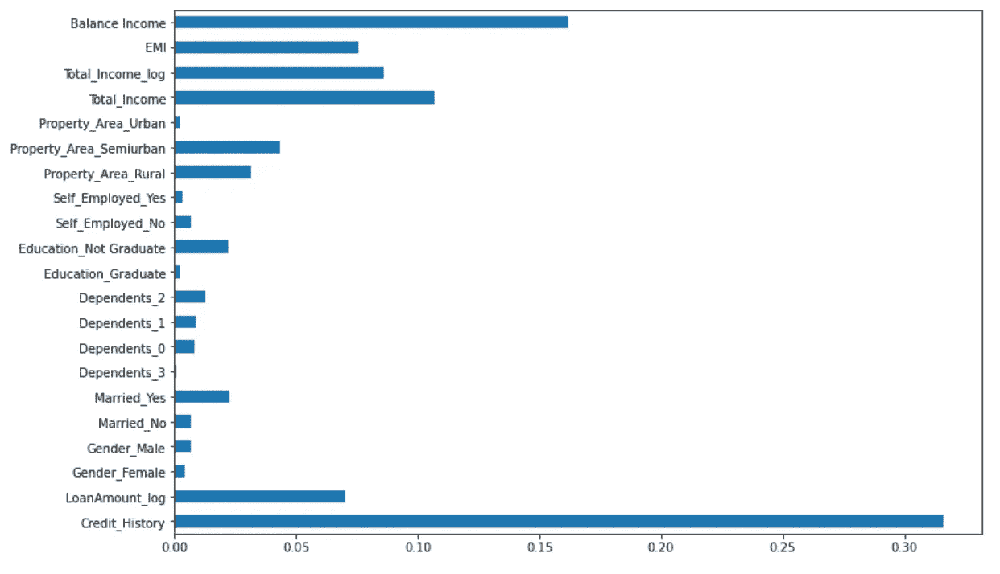

我们可以看到，信用历史是最重要的特征，其次是余额收入、总收入、EMI。因此，特征工程帮助我们预测我们的目标变量。

# XGBOOST

XGBoost 是一种快速高效的算法，已经被许多数据科学竞赛的获胜者使用。这是一个 boosting 算法，你可以参考下面的文章来了解更多关于 boosting 的信息:[https://www . analyticsvidhya . com/blog/2015/11/quick-introduction-boosting-algorithms-machine-learning/](https://www.analyticsvidhya.com/blog/2015/11/quick-introduction-boosting-algorithms-machine-learning/)

XGBoost 只适用于数字变量，我们已经用数字变量替换了分类变量。让我们看看我们将在模型中使用的参数。

*   n_estimator:这指定了模型的树的数量。
*   max_depth:我们可以使用这个参数指定一棵树的最大深度。

GBoostError:无法加载 XGBoost 库(libxgboost.dylib)。如果你在 macOS 中遇到这个错误，运行`Terminal`中的`brew install libomp`

```
from xgboost import XGBClassifier
i=1 
mean = 0
kf = StratifiedKFold(n_splits=5,random_state=1,shuffle=True) 
for train_index,test_index in kf.split(X,y): 
 print(‘\n{} of kfold {}’.format(i,kf.n_splits)) 
 xtr,xvl = X.loc[train_index],X.loc[test_index] 
 ytr,yvl = y[train_index],y[test_index] 
 model = XGBClassifier(n_estimators=50, max_depth=4) 
 model.fit(xtr, ytr) 
 pred_test = model.predict(xvl) 
 score = accuracy_score(yvl,pred_test) 
 mean += score
 print (‘accuracy_score’,score)
 i+=1
 pred_test = model.predict(test)
 pred = model.predict_proba(xvl)[:,1]
print (‘\n Mean Validation Accuracy’,mean/(i-1))1 of kfold 5
accuracy_score 0.7804878048780488

2 of kfold 5
accuracy_score 0.7886178861788617

3 of kfold 5
accuracy_score 0.7642276422764228

4 of kfold 5
accuracy_score 0.7804878048780488

5 of kfold 5
accuracy_score 0.7622950819672131

 Mean Validation Accuracy 0.7752232440357191submission['Loan_Status']=pred_test
submission['Loan_ID']=test_original['Loan_ID']submission['Loan_Status'].replace(0, 'N', inplace=True)
submission['Loan_Status'].replace(1, 'Y', inplace=True)pd.DataFrame(submission, columns=['Loan_ID','Loan_Status']).to_csv('Output/XGBoost.csv')
```

# SPSS 建模器

要创建 SPSS Modeler 流程并使用它构建机器学习模型，请遵循以下说明:

[](https://developer.ibm.com/tutorials/predict-loan-eligibility-using-jupyter-notebook-ibm-spss-modeler/) [## 使用 IBM Watson Studio 预测贷款资格

### 本教程向您展示了如何创建一个完整的预测模型，从导入数据，准备数据，到…

developer.ibm.com](https://developer.ibm.com/tutorials/predict-loan-eligibility-using-jupyter-notebook-ibm-spss-modeler/) 

注册一个 **IBM Cloud** 账户来试试这个教程

 [## IBM 云

### 使用 190 多种独特的服务立即开始建设。

ibm.biz](https://ibm.biz/BdqQBT) 

# 结论

在本教程中，我们学习了如何创建模型来预测目标变量，即申请人是否能够偿还贷款。