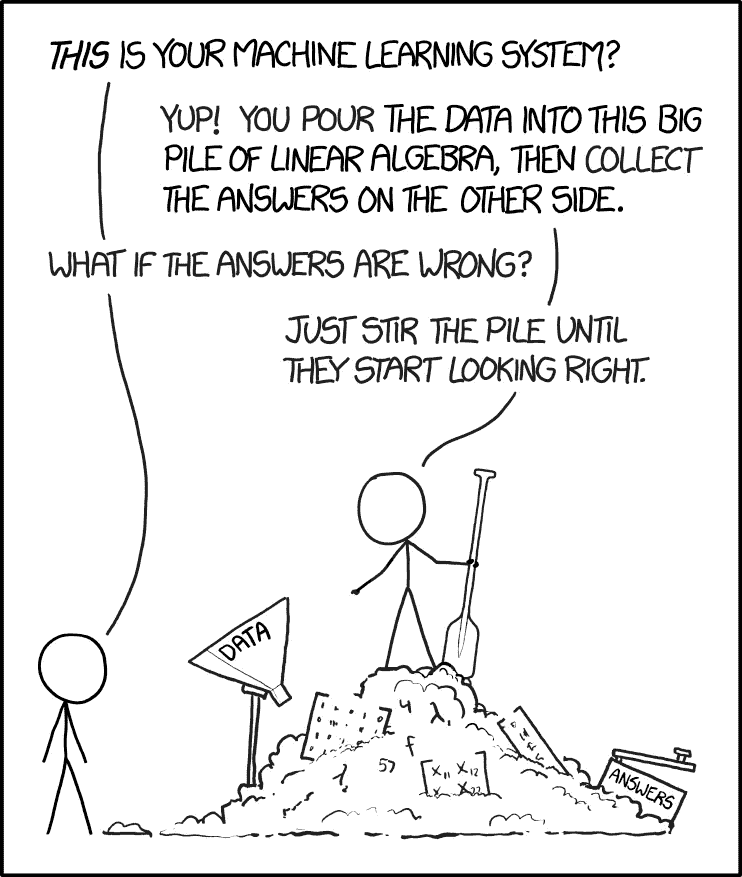

# 在学习 PyTorch 基础知识的同时预测英雄联盟中的比赛

> 原文：<https://towardsdatascience.com/predict-matches-in-league-of-legends-while-learning-pytorch-basics-3dd43cf8d16f?source=collection_archive---------48----------------------->

## 在 PyTorch 中为一个很酷的独特用例场景构建一个简单的逻辑回归模型的演练


作者理查德·索

《英雄联盟》是我一直以来最喜欢的游戏之一，尽管我真的很不擅长。LOL 是一个极具竞争力的 MOBA，两个 5 人的队伍*(蓝队和红队)*相互对抗，以摧毁对方的基地(nexus)。获胜通常需要大量的团队合作、协调，或者对于一个倾斜的玩家来说需要“运气”。不管怎样，对于一个联盟玩家(即使他们是相当新的)来说，根据游戏记录的死亡人数和许多其他数据来判断哪个队可能会赢并不太难。机器学习模型可以预测的东西…… *(这应该是这篇文章执行得不好的铺垫)*

我也开始用 PyTorch 学一点机器/深度学习(通过这个[*py torch Zero to GANs*](http://zerotogans.com)课程)。其中一个课程作业是用 PyTorch 为一些用例场景建立一个回归模型，因此，我们现在就在这里！*当然，我们可以使用* `*scikit-learn*` *并称之为完成，但是对我(和你)来说，重点是学习构建 PyTorch 模型的基本原理。* **这将是我通过构建一个简单的英雄联盟比赛预测器**来学习 PyTorch 的过程中的一次演练，该预测器将合理准确地确定任何一队获胜的机会。



[xkcd](https://xkcd.com/1838/)

# 数据集

首先，我使用了大约 1 万场英雄联盟排名赛的 [Kaggle 数据集](https://www.kaggle.com/bobbyscience/league-of-legends-diamond-ranked-games-10-min)。每场比赛的数据都是在开始的 10 分钟内收集的。所有的比赛都是由高钻石到低大师级别的玩家参加的。幸运的是，我没有需要填充的缺失值，也没有需要一次性编码的非数字数据。总而言之，不需要太多的数据操作。

首先，我们将导入所有必需的库:

我们会看到数据是什么样的:

```
df.read_csv('high_diamond_ranked_10min.csv')
```

这个数据集有 40 列，但其中一些实际上是多余的。例如，如果你知道蓝队(`blueKills`)的杀戮，这几乎直接转化为红队(`redDeaths`)的死亡。基于这个推论，我们只需要这两个中的一个。

```
df.drop(['gameId','redFirstBlood','blueTotalGold','redTotalGold','blueTotalExperience','redTotalExperience','redGoldDiff','redExperienceDiff','redKills','redDeaths'], axis=1, inplace=True)
```

这使得我们只剩下 30 列，包括标签列。这个数据集的标签*(我们想要预测的)*是列`blueWins`，0 或 1 表示蓝方是否在游戏的剩余时间内获胜。最后，我们将标签与功能分开…

```
targets = df[['blueWins']].values #only the `blueWins` column
features = df.drop('blueWins', axis=1).values #all the other columns
```

…拆分数据(80/10/10 拆分用于培训、验证和测试),并将它们转化为 PyTorch 张量…

```
test_size = int(.10 * 9879) *# 10% of the total size of the dataset*
val_size = test_size
train_size = 9879 - test_size*2
train_size , val_size, test_sizedataset = TensorDataset(torch.tensor(features).float(), torch.from_numpy(targets).float()) # turning arrays into tensorstrain_ds, val_ds, test_ds = random_split(dataset, [train_size, val_size, test_size]) # doing an 80/10/10 split on the data
```

…并用批处理大小`128`从它们中生成 DataLoader 对象。

```
batch_size = 128#making data loader objects out of the splits
train_loader = DataLoader(train_ds, batch_size, shuffle=True)
val_loader = DataLoader(val_ds, batch_size)
test_loader = DataLoader(test_ds, batch_size)
```

# 模型

好吧，这就是“有趣”的开始！是时候用 PyTorch 做 logistic 回归模型了。以下是我在构建这个过程中的思路:

*   一个逻辑回归模型在我们的 PyTorch 模型中只需要一个`nn.Linear`层，接受 29 个输入，输出 1: `nn.Linear(29, 1)`。
*   因为我们预测的值是从 0 到 1，使用`nn.Sigmoid()`会将模型的输出缩小到这个范围。
*   除了一个可能不可微的精度指标*(这将意味着梯度无法确定，而这是模型在训练期间改进所必需的)*，我们将如何计算模型的“错误”程度？快速浏览一下 [PyTorch 文档](https://pytorch.org/docs/stable/nn.functional.html#torch.nn.functional.binary_cross_entropy)可以得到成本函数:`binary_cross_entropy`。
*   因为准确性度量不能用于模型训练，并不意味着它不应该被实现！在这种情况下，准确性将通过阈值来衡量，如果模型预测和实际标签之间的差异低于该阈值，则进行计数。
*   我们希望跟踪每个历元后的验证损失/精度，每次这样做时，我们必须确保梯度没有被跟踪。
*   我们希望打印出每隔几个时期的平均验证损失和精确度。

综上所述，实现如下:

定义一些变量供以后使用。

我们的模型“LOLModel”的 python 类。

精度函数。

然后，我们需要做一个训练循环，并决定使用哪个优化器。对于优化器，在首先尝试 SGD 之后，我选择了 Adam:

定义训练循环，由“fit()”函数定义。

我们定义了一个`evaluate()`和`fit()`函数，后者是主训练循环，它:

1.  将一批数据输入模型
2.  以设定的学习率应用渐变
3.  根据验证数据测试模型，得出验证损失/准确性
4.  将数据追加到数组`history`中进行绘图

# 训练&最后的揭示

总之，对于**超参数**，我训练了`750`个时期，学习率为`0.0001`:

```
model = LOLModel() #initiate the model
```

让我们首先确保数据正确地通过模型。

最终验证损失和精度分别为`0.5494`和`0.7209`*(该模型中精度从 0 到 1 测量)*。

在这里，我们可以看到模型在每个时期迭代时验证准确性的变化。大约在公元 150 年有一个急剧的增长，并且在`.8 accuracy since.`附近徘徊

现在，在过去的 10%分割中测试模型(请击鼓！):

忽略' val_loss '和' val_acc '！

使用`evaluate()`，我们发现该模型在预测 LOL 比赛结果时的准确率约为 74.5%，不算太差！

# 结论

总而言之，我认为这是我的一次成功。我学到了很多关于在 PyTorch 中制作模型的基础知识，即使模型很简单。更酷的是:我很开心地看到我做的一些事情最终得到了很好的解决！希望你能像我做模型一样喜欢阅读这个过程。无论如何，快乐编码(或继续玩联赛)！

> 如果你想知道这个迷你项目使用的 jupyter 笔记本的来源，请看这里:[https://jovian.ml/richardso21/lol-logistic](https://jovian.ml/richardso21/lol-logistic)。