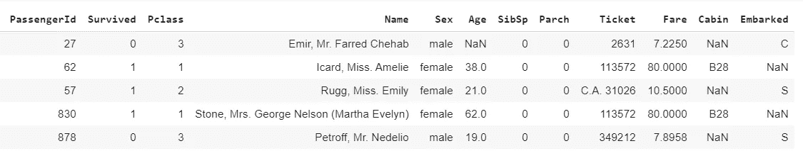
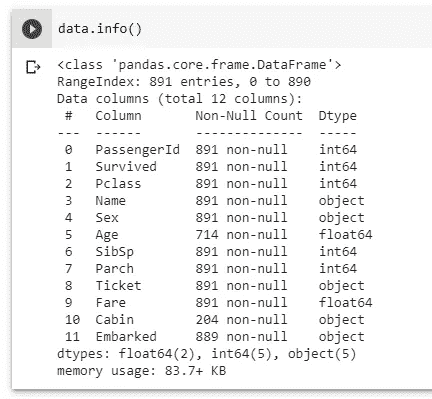
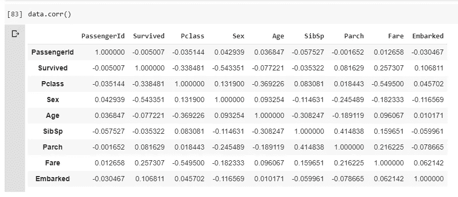
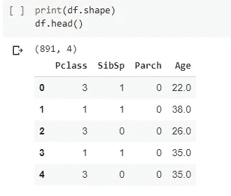
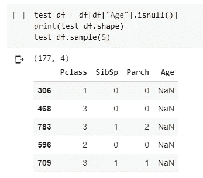
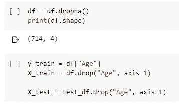
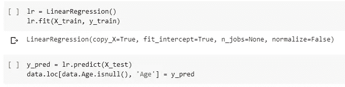

# 预测数据集中缺失的值

> 原文：<https://towardsdatascience.com/predict-missing-values-in-the-dataset-897912a54b7b?source=collection_archive---------10----------------------->


弗兰基·查马基在 [Unsplash](https://unsplash.com?utm_source=medium&utm_medium=referral) 上拍摄的照片

## 了解如何使用机器学习模型及其实现来预测数据集中的缺失值

真实世界的数据通常有很多缺失值。丢失值的原因可能是数据损坏或未能记录数据。在数据集的预处理过程中，缺失数据的处理非常重要，因为许多机器学习算法不支持缺失值。

有多种策略可以处理数据集中的缺失值，包括缺失值的预测。本文将介绍如何理解和实现通过使用机器学习算法预测缺失值来处理缺失值。

缺少值的列的类别:

1.  分类(数字，对象)
2.  连续变量(数值)

**分类变量:**

分类变量是一个变量，它可以取有限的、通常是固定的可能值。分类变量可以是字符串或数字类型。分类变量的一些可能的例子是:

*   产品评级:1、2、3、4、5
*   分类评级:差、满意、好、优秀
*   性别:男，女

**连续变量:**

连续变量是可以取不可数的一组值的变量。例如，在实数的非空范围内的变量是连续的，如果它可以取该范围内的任何值。

> 为了预测分类变量，需要分类机器学习算法，如**逻辑回归、SVM、朴素贝叶斯**等。
> 
> 要预测连续变量，需要回归机器学习算法，如**线性回归、SVR** 等。

[](/7-ways-to-handle-missing-values-in-machine-learning-1a6326adf79e) [## 机器学习中处理缺失值的 7 种方法

### 处理数据集中缺失值的常用策略

towardsdatascience.com](/7-ways-to-handle-missing-values-in-machine-learning-1a6326adf79e) 

**准备数据集以预测缺失值:**

> *使用的数据是来自 Kaggle* 的 [*泰坦尼克号数据集*](https://www.kaggle.com/c/titanic)

*若要预测数据集中缺失的值，请创建一个新的数据集，以便:*

```
***new_data**: columns except the column with missing values
**target_class**: column with missing value*
```

**

*(图片由作者提供)，泰坦尼克号数据集样本*

**

*(图片由作者提供)，泰坦尼克号数据集的信息*

*在上面的样本数据集图像中，列 **Age，Cabin，Embarked** 包含空值或缺失值。*

*如果我们首先要估算列 **Age 的缺失值，**用于训练模型以预测缺失值的新数据集将为:*

```
***new_data**: columns except the column "Age"
**target_class**: column "Age"*
```

*现在我们需要将数据分为训练数据和预测数据，在列**年龄**中没有缺失值的行将被声明为训练数据。从以上形成的数据集训练的模型可用于预测**年龄列中的缺失值。***

```
***training_data**: rows from new_data where column "Age" does not have missing values
**predict_data**: rows from new_data where column "Age" have missing values
**target_class_traing**: non-missing values in column "Age"*
```

***栏目关联:***

*我们是否需要在具有所有剩余列的数据集上训练模型？有时，使用所有剩余列的训练模型比某些列更好地预测缺失值，但有时某些高度相关的列，由选择性高度相关列训练的模型往往会给出更好的结果。*

***如何找到列之间的关联？***

*[Pandas 库](https://pandas.pydata.org/pandas-docs/stable/reference/api/pandas.DataFrame.corr.html)有一个简单的单行实现来查找数据帧中所有列的相关性。*

**

*(图片由作者提供)，Titanic 数据集中列之间的皮尔逊相关结果*

```
*data.corr()*
```

> *上图显示了每列之间的[皮尔逊相关](https://en.wikipedia.org/wiki/Pearson_correlation_coefficient)系数值。PCC 测量两个变量 *X* 和 *Y* 之间的线性[相关性](https://en.wikipedia.org/wiki/Correlation)。它的值介于+1 和-1 之间。值+1 表示完全正线性相关，0 表示没有线性相关，1 表示完全负线性相关。*

*计算列**年龄**和其他列之间的相关性，以找到与列**年龄相关的列。**从上表中可以看出，有 3 列与**列年龄相关。***

> *这些列是**Pclass**(PCC:-0.369226)**SibSp**(PCC:-0.308247)**Parch**(PCC:-0.189119)。*

***将数据集拆分成训练和预测数据:***

*选择与列年龄相似的 3 列，形成总共 891 行的数据集。*

**

*分隔具有空值或缺失值的行以进行预测。*

****

*通过对 X_train 数据集进行定型并预测 column Age 中缺少的值来准备机器学习模型。*

**

***实施:***

*(作者代码)*

***结论:***

*每个数据集都有需要智能处理的缺失值，以创建稳健的模型。在本文中，我讨论了预测缺失值的实现。没有以特定方式或使用特定模型来处理缺失值的经验法则，这种方法可以获得具有最佳性能的健壮模型。可以使用整个数据集来预测丢失的值或一些删除的列。了解数据集的领域知识非常重要，这有助于了解如何预处理数据和处理缺失值。*

> *感谢您的阅读*