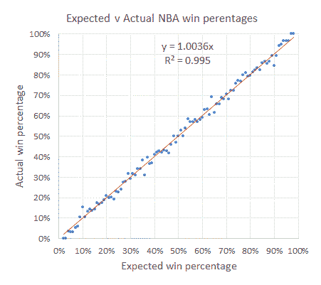
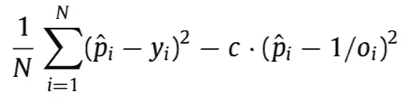
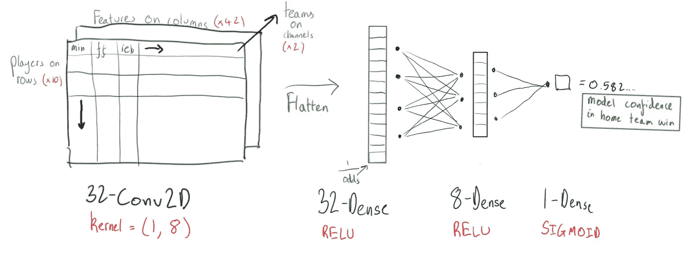
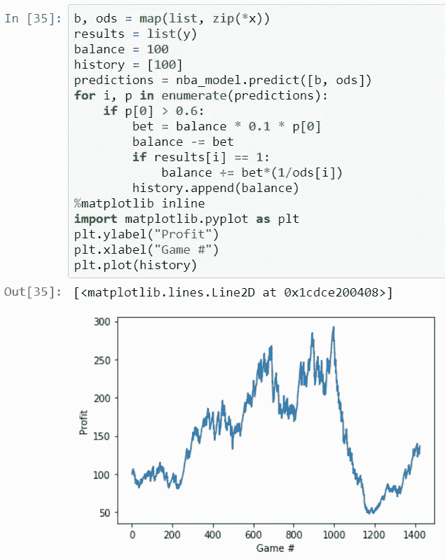

# 预测 NBA 比赛，赚钱——机器学习项目

> 原文：<https://towardsdatascience.com/predict-nba-games-make-money-machine-learning-project-b222b33f70a3?source=collection_archive---------22----------------------->

## 过去的表现并不能说明未来的表现…除非…我们能获得 136%的回报…？😉

mfw 我的深度学习模型编译//photomosh.com 制造

下注者和庄家没有太多的共同之处——人们可以把他们的关系描述为竞争。但在睡梦中，他们对同一个幻想垂涎三尺:一个历史表现如此完美的模型，它以精确的*预测未来游戏的结果。有了深度学习，这可能成为可能——或者至少比以前的数据科学技术更容易。*

*我阅读了许多**好的和坏的期刊文章，看看这是否可能，下面是一些好的文章:
[*利用机器学习开发体育博彩市场*](https://www.sciencedirect.com/science/article/abs/pii/S016920701930007X?via%3Dihub)*(2018)* [*情绪偏差和资产价格:来自体育博彩市场的证据*](https://onlinelibrary.wiley.com/doi/abs/10.1111/ecin.12404)*(2016)* [*美国国家篮球协会博彩中的情绪偏差*](https://journals.sagepub.com/doi/abs/10.1177/1527002516656726)***

*潜在的假设是，NBA 市场是无效率的(价格或投注线并不反映游戏的所有可用信息)——并且可能比大多数市场更无效率，因为铁杆球迷的偏见只是押注于他们最喜欢的球队。如果你能赌赢市场的无效率，你就能赚钱。我们可以识别低效率的方法之一是分析硬数据。*

*尽管尝试这一挑战的许多模型都是*精确的，但是*大多数都**离盈利还差得很远。原因很简单:博彩公司也非常准确。即使你匹配了庄家准确率，你也会因为 5%的投注费/房子边缘而输。***

**

*[https://www . football-data . co . uk/blog/NBA _ pinnacle _ efficiency . PHP](https://www.football-data.co.uk/blog/nba_pinnacle_efficiency.php)*

*左边的图表是 bet365 资金线与实际获胜百分比。一个成功的模型必须从完美回归中预测庄家的微小波动。*

*我的模型是用 Python 和 Tensorflow 构建的，分析了过去的 11 个 NBA 赛季，在许多方面，它与其他试图解决这个问题的深度学习模型相似，但有一个关键的不同——它使用一个定制的损失函数来**与博彩公司去相关。**我们正在挑选博彩公司虚报了实际百分比的游戏。*

**

*去相关损失公式——这非常重要！！！！！！！*

# *Da 代码*

**

*模型架构*

*我使用 nba_api Python 库抓取了盒子得分历史[。数据存储在 MongoDB 集合中。在过去的 11 个赛季中，每个球员的每场比赛总共有 42 个数据被存储，从罚球命中率到防守等级到抢断次数。投注数据是从](https://github.com/swar/nba_api)[的 betexplorer](https://www.betexplorer.com) 上刮下来的。找到高质量的投注线比训练模型要难得多。向斯洛文尼亚卢布尔雅那大学的 trumbelj 教授寻求一些建议。*

*对于每场比赛，样本是用每个球员从赛季开始的最后 8 场比赛的平均值计算的。根据平均游戏时间选择前 8 名玩家。*

## *型号:*

*该模型是 Conv2D 和密集层的组合，有很多漏失。该模型的独特之处在于去相关损失，我提到的第一篇论文对此进行了概述。尽管 Keras 本身不支持带有神经元值的损失函数，但是将函数包装在函数中是一种有用的解决方法。我在 GTX 1660Ti 上训练网络 20 个纪元，直到网络收敛。*

## *结果:*

**

*使用 10%的余额*模型置信度的非常原始的下注策略，并且仅在模型置信度> 0.6 的游戏上赌博，我们生成一个向上的余额趋势。有趣的是，该模型只对全部游戏的大约 10%下注。除了整个 2017-18 赛季的灾难性连败之外，我们的模型表现非常好，初始投资为 100 美元，最高为 292 美元。*

## *学习与未来:*

*这只是这种模式的开始。随着令人鼓舞的结果，我想制定一个更有活力的投注策略。如果你想嘲笑/怜悯我写的 Jupyter 笔记本的 1k 行，完整的未删节未编辑的笔记本可以在这里找到:[https://github . com/calebcheng 00/NBA _ predictions/blob/master/NBA . ipynb](https://github.com/calebcheng00/nba_predictions/blob/master/nba.ipynb)
唯一有用的东西大概就是投注刮码和模型了。*

*使用 NoSQL 是一个错误，我应该坚持使用 SQLite，但学习一项新技术是很好的。编写自定义损失函数是一次非常有价值的经历，在未来的深度学习项目中会派上用场。*