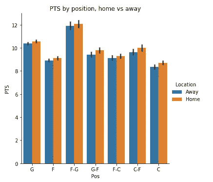
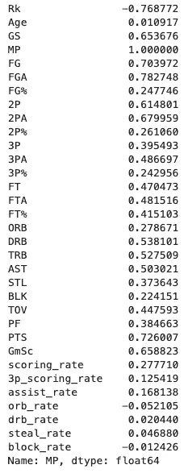
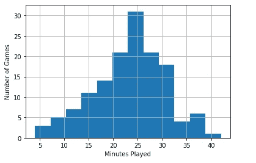
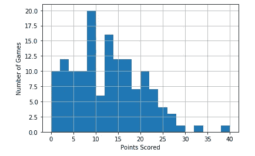
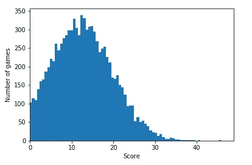
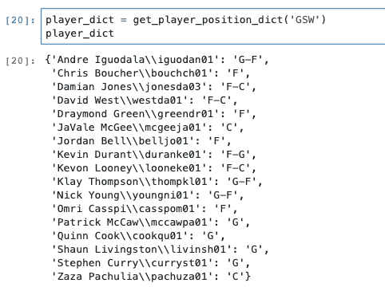
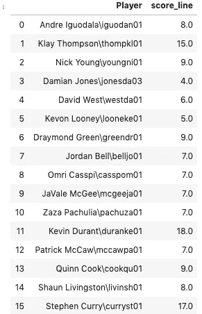
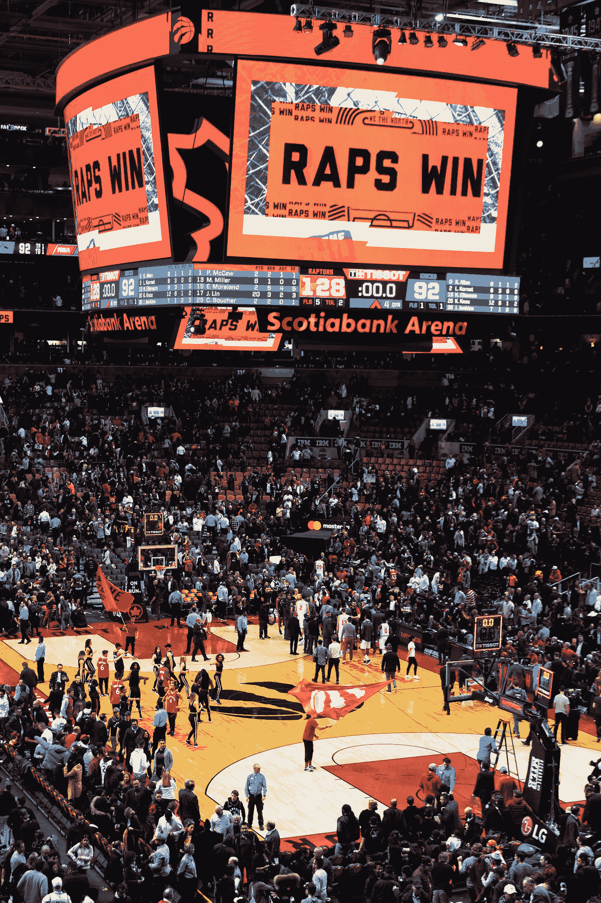

# 用蒙特卡罗模拟预测 NBA 球员阵容

> 原文：<https://towardsdatascience.com/predict-nba-player-lines-with-monte-carlo-simulation-58a1c006a6e2?source=collection_archive---------24----------------------->

## 我们能利用数据科学在体育博彩市场中发现价值吗？


TJ·德拉戈塔在 [Unsplash](https://unsplash.com/s/photos/basketball?utm_source=unsplash&utm_medium=referral&utm_content=creditCopyText) 上的照片

*我绝不鼓励赌博。我不鼓励使用我的模型，事实上，我积极劝阻它。这是纯粹的教育用途，不应该使用或依赖任何真正的钱。说真的。*

我以前作为职业体育赌客的经验非常依赖有效市场假说。这表明资产价格反映了所有可获得的信息。在体育博彩术语中，在自由市场(如 Betfair exchange 这样的交易所)中，任何事件的价格都准确地反映了该事件发生的几率。

这个理论起源于 20 世纪初(直到几十年后才流行起来)，有一个故事很好地解释了这个理论。1906 年，伟大的统计学家弗朗西斯·高尔顿在一个乡村集市上观察了一场猜公牛体重的比赛。八百人参加了。高尔顿就是这样的人，他对这些数字进行了统计测试。虽然有些人的猜测过高，有些人的猜测过低，但他发现平均猜测值(1197 磅)与公牛的实际体重(1198 磅)非常接近。这个故事是詹姆斯·苏洛维耶茨基在他有趣的书《群体的智慧》中讲述的。我强烈推荐。

但是使用这些假设来发现价值和下注存在几个困难:

*   这一假设只有在市场流动性充足的情况下才有效。许多市场都缺乏流动性。这意味着我们不能确信价格是正确的(我们只有很少的人群)。因此，像玩家线这样不太受欢迎的市场不能使用这种技术。即使是现在，当我写这篇文章时，一场德国德甲比赛有 150，000 场胜利/平局/客场比赛，只有 2500 场超过/低于 3.5 个进球。这一行缺乏流动性意味着我们不能假定它的价格是正确的。
*   我以前使用的技术完全依赖于击败市场价格，这意味着人们不能在这些交易所交易。大多数庄家限制使用这种技术的人，因此为了持续的利润，必须开发不同的技术。除此之外，最有用的技术是可以在交易所获利的技术。
*   有专业的体育博彩者和交易者，他们只通过交易所就能持续盈利。虽然他们可能是少数，但这意味着至少有可能比大众更明智。

这些限制促使我探索开发不依赖大众智慧的预测体育赛事结果的技术。

蒙特卡罗模拟是一种广泛的工具，它依靠重复采样来获得数值结果。当很难使用其他方法时，它们经常在物理或数学中使用。在预测随机性起重要作用的事件(如体育事件)时，它们尤其有用。

这是因为蒙特卡罗模拟不是像大多数典型的机器学习算法那样给出具有一定程度不确定性的确定性结果，而是反转这一点。它只使用一系列概率来解决确定性问题。它不是简单的给我们结果，而是会输出所有潜在结果的概率分布。这对体育博彩来说太棒了。如果我们设法精确地模拟一场游戏，就有可能创造一套赔率，或建立公平的线。然后可以将这个结果与市场和各种博彩公司进行比较，我们可以决定我们是否有价值。

体育包含了大量的随机性和变化，除此之外，可处理的数据量也是有限的。阵容经常变化，上赛季表现好的球队下赛季可能表现不佳。由于这个原因，历史数据在很大程度上是不相关的。

游戏中有如此多的随机性，以至于看一个游戏结果的预测并没有特别大的帮助。就像看轮盘赌的一次旋转没有太大帮助一样——赌场不关心一次旋转会发生什么。他们甚至不关心 100 次或 1000 次旋转后会发生什么。他们只关心理解他们的游戏如何在赌场一生中发生的数百万次旋转中产生优势。这限制了我们训练传统机器学习模型的能力。

赌场通过理解他们的优势是长期实现的来赚钱，所以敏锐的体育赌徒也应该这样做。然而，NBA 每个赛季每支球队只有 82 场比赛，由于冠状病毒，本赛季甚至更少，我们只有有限的数据来进行预测。因此，我们希望能够大量模拟游戏，即使不是数百万次，也是数千次，以建立一个准确的结果和概率范围。

当应用于体育时，我们基本上可以做的是从几个已知分布(以前的比赛结果)中取样，并产生一个新的未知分布(新的比赛结果和概率分布)。

我用的数据是从[https://www.basketball-reference.com](https://www.basketball-reference.com/)刮来的。它提供了 NBA 每名球员的每场比赛统计数据，我使用的是 2013 年以来的数据。

在探索数据的早期，我发现了一些见解，这些见解将影响我设计模型的方式。首先，不同位置的球员平均得分不同。其次，每个位置的得分都有主场优势。



图表显示每场比赛的平均分数，带有置信区间

这一点都不奇怪，因为这是一个即使是最基本的体育迷都会做出的假设。然而，在考虑如何构建游戏模拟时，检查它们是很重要的。假设存在主场优势，并且会出现位置差异，我们需要在任何模拟中包含这些信息。

我检查的另一个相对简单的假设是上场时间对得分的影响。这是有道理的，球员在场上的时间越长，他们得分的时间就越多。下面的回归图显示了这种关系的本质，因为很难看到分散点的密度。这种相关性延续到其他指标，这是有意义的——更多的时间，更多的助攻，抢断，盖帽，得分，等等。


PTS 对 MP 的回归图



球员表现指标和上场时间的相关性

# **所以总结一下:**

*   有主场优势
*   得分与上场时间有关
*   得分上存在着位置上的差异，这种差异通过主场优势得以延续。

这是我用来构建我将从中取样的分布的信息。我对这些指标做了一个很大的假设，那就是它们通常是正态分布的。

下面是尼克·杨的上场时间分布，虽然不完全是正态分布，但对我来说已经足够接近了。

得分当然更多的是一种延伸，这当然应该被认为是一种限制，以后再考虑调整。



尼克·杨主场上场时间直方图



在家得分的尼克·杨积分直方图

**潜在的方法**

我考虑了几种方法来构建可重复采样的发行版:

**Bootstrapping** :从这些已知分布中重复采样，进行替换。如果我们从上面的得分分布中反复取样，就不会有一个模拟显示尼克·杨得了 35 分。在过去，他得了大约 29 分和 38 分，所以这种情况显然是可能的，我们想反映这一点。

**建立泊松分布:**我考虑的另一个选择是建立泊松分布。它强制所有数字都是大于零的整数，这对我们的目的很有帮助。然而，在泊松分布中，均值和标准差是相同的数。然后我可以从这个人工构建的分布中取样

**构建一个调整后的正态分布:**我的选择是使用球员统计数据的均值和标准差生成一个正态分布，并从中重复采样。然后我强制数字为整数，负数为零。这有助于克服上述方法的局限性。

我用一个玩家的历史数据生成了他游戏结果的分布。这允许我建立一个数以千计的游戏的分布，而不仅仅是现有的有限的历史数据。

新的分布如下所示。虽然与原来的不同，但它有效地解决了上述问题，并且形状大致相似。



尼克·杨在家模拟得分直方图

# **模拟**

现在终于到了有趣的部分。

我构建了几个函数来执行模拟。

第一个函数只是找到最近一个赛季的球队阵容(因为我们不关心不在球队中的球员)，并返回一个字典，其中包含他们的位置，以便以后参考。

```
def get_player_position_dict(team):

    # This function collects all the players names of the team, and       inputs it into
    # A dictionary, along with each player prospective position.home_team_lineup = df.loc[(df['Tm'] == team) & (df['Date'] >= '2017-10-17 00:00:00')][['Player','Pos']]
    home_team_lineup = home_team_lineup.drop_duplicates().sort_values(by = 'Player')
    home_team_lineup_list = list(home_team_lineup['Player'])
    home_team_position_list = list(home_team_lineup['Pos'])
    team_player_position_dict = dict(zip(home_team_lineup_list, home_team_position_list ))

    return team_player_position_dict
```



下一个函数包含了很多代码，所以我会用文字解释，可以随意跳过。它也在我的 [Github](https://github.com/Carterbouley/nba_simulation/blob/master/Version_3.ipynb) 上。

对于所要求的模拟次数，以及对于单个玩家，该函数从我为他们构建的分布中随机抽取样本。它需要一个他们玩了多长时间的样本，乘以一个他们每分钟得分多少的样本，再加上一个对方球队在那个位置上让出的分数的样本。这整个过程是一个游戏的模拟

这个数被 2 除，所以进攻和防守统计都考虑进去了，那个分数被输入一个列表。

```
def score_sim(mp_mean, scoring_rate_mean, mp_std, scoring_rate_std, away_PTS_conceded_mean, away_PTS_conceded_std, ns): 

    score_list = []

    for i in range(ns):
        # How long an individual home team player plays at home
        home_minutes_played = np.random.normal(mp_mean,
                                          mp_std)# How effective they are at scoring points at home
        home_player_scoring_effectiveness =  np.random.normal(scoring_rate_mean, scoring_rate_std)# How often does the team that is away concede when they are away, broken down by location
    # Note here location is also technically 'home' because we are looking at them as an Oppaway_positional_conceding = np.random.normal(away_PTS_conceded_mean, away_PTS_conceded_std)# Force negatives to be 0
        parameters = [home_minutes_played, home_player_scoring_effectiveness, away_positional_conceding]
        parameters = [0 if x<= 0 else x for x in parameters]# Convert to integer as we cannot score 0.5 points
        try:
            home_player_score = int((((parameters[0] * parameters[1]) + parameters[2])/2))
        except:
            home_player_score = 'NA'

        score_list.append(home_player_score)return score_list
```

在一个特定的球员(斯蒂芬·库里)对猛龙队的比赛中运行这个结果，给出了下面的结果(为了更容易查看，我已经将列表转换成了直方图。这显示了他在 10，000 场比赛中的预期分数分布。


斯蒂芬·库里对托尔

所以从本质上来说，我建立的是斯蒂芬·库里得分能力的新分布，但根据对方球队的防守能力进行了一些调整，即他们防守斯蒂芬·库里位置上球员的能力。

为简单起见，模型模拟的第一次迭代是为偶数钱寻找公平线。如果我们可以(准确地)找到公平线，那么我们可以搜索比我们预期的概率更好的价格，并思考它们是否提供价值。以下函数对模拟分数进行排序，并求出中值。

```
def convert_to_line(score):

    score.sort()
    freq = {x:score.count(x) for x in score}
    values_list = list()
    for val, count in freq.items():
        for count in range(count):
            values_list.append(val)median_computed = statistics.median(values_list)
    return median_computed
```

对于这组结果，它的输出是 17。这意味着，我们的模拟显示，在对阵猛龙的比赛中，斯蒂芬·库里一半时间得分在 17 分以上，另一半时间得分在 17 分以下。

对于体育博彩来说，这意味着如果我们能找到比这条线更好的地方(SC 得分超过或低于 17 分)，纯粹基于这个模型，我们可能认为这是一个价值赌注。然而，警告一句——这是高度假设的。在投入任何资金之前，可能有更多的粒度来定义这个过程，这只是一个简单的宠物项目。我强烈建议你不要用这个来真钱下注，我也不鼓励任何形式的赌博。这只是开始构建您自己的模型的一个起点。

完整的模拟模型在我的 [GitHub](https://github.com/Carterbouley/nba_simulation/blob/master/Version_3.ipynb) 上，所以请随意查看，但最终结果会为两队的每个球员生成球员线。然而，这是太多的代码张贴在媒体上，但这是金州勇士队对多伦多猛龙队的 10，000 次模拟(耗时不到 40 秒)的输出。



全点线仿真模型的输出

这个模型没有在之前的任何游戏上测试过，我目前正在寻找不同的方法来测试它的准确性。

**一些未来的改进:**

*   对旧数据进行加权，使其在模型中变得不那么相关。2013 年发生的事情应该没有 2017 年发生的事情影响大
*   包括关于每个玩家统计的更进一步的、更精细的统计。这个模型没有考虑到，例如，斯蒂芬·库里主要是三分球，也没有考虑到托尔斯对罚球的防守能力。
*   因为游戏模拟仅限于得分，所以没有考虑盖帽、助攻、篮板及其对得分的贡献的输入。包括这一点将产生一个更加现实和适用的模型。
*   它不考虑诸如受伤或比赛类型等信息。鉴于模拟比赛是一场 NBA 决赛，我们可能应该加入一些额外的假设，如与以前的比赛相比，与顶级球员比赛的时间更长，进攻和防守的强度更大。

如果任何人有任何意见，请联系，这是我的一个活跃的宠物项目，所以我将非常感谢听到来自更有经验的数据科学家或对篮球感兴趣的人的任何评论！

这篇文章写得很有启发性，我正在积极地考虑将类似的模型应用到封锁期间正在进行的其他运动中。我目前正在寻找所有运动的数据。我也在寻找立即开始的工作，所以如果你出于这样或那样的原因想要联系，请通过评论、我的 [Linkedin](https://www.linkedin.com/in/carterbouley/) 或我在 carterbouley@gmail.com 的电子邮件联系。



克里斯蒂安·门多萨在 [Unsplash](https://unsplash.com/s/photos/basketball?utm_source=unsplash&utm_medium=referral&utm_content=creditCopyText) 上拍摄的照片