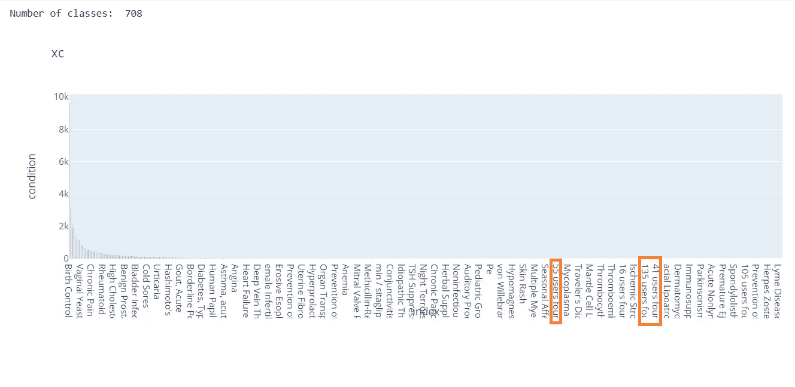

# 根据医学综述预测患者的医疗状况—第 1 部分

> 原文：<https://towardsdatascience.com/predict-patients-medical-condition-based-on-medicine-review-part-1-c22ea39d9976?source=collection_archive---------26----------------------->

## 分析不同患者在不同药物评论网站上对特定药物所做的评论，以预测该药物的使用状况。

詹姆斯·亚雷马在 [Unsplash](https://unsplash.com/s/photos/medicine?utm_source=unsplash&utm_medium=referral&utm_content=creditCopyText) 上的照片

互联网曾经是一个张贴漂亮网站以推广业务的地方，现在已经发展成为一个论坛，消费者可以根据印象和其他志同道合的消费者的反馈来评估不同的产品和服务。最近，在线评论在营销和交流中创造了一个新的领域，弥合了传统口碑和可以影响消费者意见的病毒式反馈之间的差距。然而，在医学领域，对特定药物的审查发挥着更重要的作用，因为它们可以帮助监测药物的不良反应，并确定使用者对药物的总体印象。

由于许多药物治疗多种疾病，当在大多数患者论坛上审查一种药物时，必须提供该药物用于的医学疾病。

> **医学状况**是一个宽泛的术语，包括所有通常接受医学治疗的疾病、病变、失调或非病理状况，如怀孕或分娩。

在这一系列文章中，我们将分析不同患者在不同药物评论网站上对特定药物的评论，并预测**医疗状况，**药物正在用于治疗。

# 挑战

从评论中预测医疗状况是一项非常具有挑战性的任务。例如，考虑下面的评论:

> 这药对我有奇效。我肯定会推荐它

这种药物曾被用于治疗*痤疮。*但是，仅根据审查，很难确定患者是在谈论治疗*痤疮*，因为帖子中没有提及。由于大多数患者论坛要求在审查表中的单独字段中提供医疗条件的名称，因此患者通常不会在他们的审查中提到它。

# 方法

为了解决这个问题，**在本部分**中，我们将分析评论，并使用统计机器学习分类器进行预测。我们将使用来自 Kaggle 的 [UCI ML 药物评论](https://www.kaggle.com/jessicali9530/kuc-hackathon-winter-2018)数据集。该数据集提供了患者对特定药物以及相关条件的评论，以及反映患者总体满意度的 10 星患者评级系统。这些数据是通过抓取在线药物评论网站获得的。该数据集由针对 700 多种不同医疗状况的 20 多万篇医学综述组成，数据分为训练(75%)和测试(25%)两部分。

# 分析数据集

首先，我们将首先导入分析和预测所需的所有模块。

然后，我们将下载数据，从中删除空值，然后查看训练和测试数据帧。我已经从前面提到的链接下载了数据集，并将其加载到 pandas dataframes 中。

我们看到数据集中有 7 列:

1.  `uniqueID`:每个帖子的标识符。
2.  `drugName`:被审评药品的名称。
3.  `condition`:使用该药物的医学病症的名称。
4.  `review`:患者对某一种药物的评价。
5.  `rating`:患者对每种药物的评分，10 分代表最大疗效。
6.  `date`:审核录入日期。
7.  `usefulCount`:认为评论有用的用户数量。

由于我们对预测医疗状况感兴趣，`condition`将是我们的目标变量。让我们首先分析`condition`变量的类分布。

我们将定义以下函数:

`plot_bar_chart`首先从`condition`列中提取每个类的评论数量，并使用**提供的函数绘制它们。* `number_of_classes`仅打印数据帧的`condition` 列中唯一类的数量。*

**

*数据集中有 708 个类(见上面的快照)，评论高度偏向于**节育**的类，这表明数据集高度不平衡。经过仔细观察，还发现有些类别(以红色突出显示)并不完全是**医疗状况**，而是在创建数据集期间添加的一些噪声。所有这些噪音都必须消除。*

# *标签(类)预处理*

*标签的预处理包括三个步骤。我们将在训练数据帧上执行所有的预处理，然后在测试数据帧上应用它。*

## *步骤 1:移除低频类别*

*我们已经观察到数据集是高度不平衡的。我们将开始预处理，首先删除样本少于 20 个的类，然后再次检查训练集中的类的数量。*

**

*我们观察到数量从 708 个显著减少到 214 个(上面的快照)。*

## *步骤 2:对超过 200 个样本的类进行欠采样*

*为了解决类别不平衡问题，我们将对超过 200 个样本的类别进行欠采样。我们通过遍历每个类，从训练数据帧中提取所有样本，对其进行洗牌，然后将数组分割为 200 个元素来实现这一点。*

## *步骤 3:从数据集中移除噪声类*

*正如我们在上一节中看到的，数据集由仅仅是噪声的类组成。这些类的典型格式是数字后跟一些文本，例如，数据集中的一个有噪声的类是“ **41 个用户找到了**”。我们知道医疗条件不涉及数字，因此我们可以轻松地在数据集中查找字母数字类，并可以直接删除它们以消除噪声。*

*我们通过编写一个名为`filter_labels`的方法来实现这一点，该方法遍历所有标签，检查标签是否是字母数字的，并基于检查返回一个真值。然后，我们将它应用于训练数据帧，并检查类的数量。*

**

*我们现在在训练集中只剩下 210 个类(上面的快照),我们需要在这些类上训练我们的分类器。现在让我们来看看班级的分布情况:*

**

*分配看起来比以前好得多。仍然有很高的类别不平衡，但是超过这个范围的欠采样将导致信息的丢失。*

## *对测试数据集标签应用预处理*

**

*正如我们所看到的，测试集中有 664 个类。测试数据集需要与训练数据中的类完全相同。由于我们的测试数据已经被标记，我们只保留那些出现在预处理过的训练集中的类，而丢弃其余的。*

**

*测试数据现在也包含 210 个类，与训练集完全相同。*

# *预处理评论*

*到目前为止，我们只通过平衡数据集和移除低频类来处理标签。为了使评论准备好输入任何机器学习模型，我们必须对它们进行预处理，以便删除不必要的信息。我们将移除**停用词**，然后对语料库中的单词执行**词干化**。*

## *删除停用词和词干*

*我们定义了一个名为`filter_data`的函数，它接受小写评论，遍历句子中的每个单词，然后首先删除标点符号和停用词，然后对单词进行词干提取。*

## *小写目标类*

*我们将目标类别标签小写，以便它们可以直接用于训练我们的机器学习分类器。*

# *创建机器学习模型*

*为了获得最佳的机器学习模型，我们将对训练数据集执行 4 重交叉验证，然后使用最佳执行模型对测试数据集进行预测。我们将使用以下机器学习分类器，然后根据其性能选择最佳模型:*

1.  *多项式朴素贝叶斯*
2.  *随机梯度下降分类器*
3.  *随机森林分类器*
4.  *k 近邻分类器*

*我们混洗训练数据集，并将数据集的相关列保存在变量 **X** 和 **Y** 中。*

*在将文本数据输入任何机器学习分类器之前，需要进行特殊的准备。必须对文本进行解析以删除单词，这称为标记化。然后，需要将单词编码为整数或浮点值，以用作机器学习算法的输入，称为特征提取(或矢量化)。*

*我们将使用 sklearn 的 [CountVectorizer](http://scikit-learn.org/stable/modules/generated/sklearn.feature_extraction.text.CountVectorizer.html) 包将我们的评论转换成向量。 [CountVectorizer](http://scikit-learn.org/stable/modules/generated/sklearn.feature_extraction.text.CountVectorizer.html) 提供了一种简单的方法，既可以标记一组文本文档，构建已知单词的词汇表，也可以使用该词汇表对新文档进行编码。*

*接下来，我们定义一个方法`cross_val_multiple_classifiers`,该方法接收数据和标签，对上述所有分类器执行 4 重交叉验证，并显示每个分类器所有重的精确度和标准偏差的平均值，并对矢量化的训练数据调用该方法。*

**

*我们看到**随机森林分类器**工作得最好，平均准确度分数大约为 **54%** 。让我们使用这个模型在完整的训练数据集上训练它，并在测试集上获得预测。*

**

*尽管该分类器的交叉验证分数仅为 54%，但该分类器在测试数据集上的总体准确度为 70%，F1 分数良好。这可能是因为测试集中的偏差。然而，由于交叉验证的准确度分数很低，我们仍然需要找到一个更好的策略来训练分类器，以提高整体性能。*

# *结论*

*在系列的这一部分中，我们试图解决一个具有挑战性的问题，即使用消费者对药物的评论来预测医疗状况，这些评论使用统计机器学习分类器，并使用计数矢量器将文本转换为输入特征。尽管我们解决了数据集中的高级别不平衡，但结果仍然不够令人印象深刻，表现最好的分类器仅提供了 **54%** 交叉验证的准确度分数。*

*在下一部分中，我们将尝试通过采用不同的方法来解决问题，从而提高模型的性能。*

*笔记本的完整代码可以从这里获得——[https://github . com/hamiz-Ahmed/Machine-Learning-Notebooks/blob/master/classified _ Medical _ Condition _ using _ Statistical _ Models _ Part _ 1 . ipynb](https://github.com/hamiz-ahmed/Machine-Learning-Notebooks/blob/master/Classifying_Medical_Condition_using_Statistical_Models_Part_1.ipynb)*

# *参考*

*UCI ML 评论数据集—[https://www . ka ggle . com/Jessica Li 9530/kuc-hackathon-winter-2018](https://www.kaggle.com/jessicali9530/kuc-hackathon-winter-2018)*

*sci kit-learn—[https://scikit-learn.org/stable/](https://scikit-learn.org/stable/)*

*如何用 scikit-learn 对机器学习的文本数据进行编码—[https://machinelementmastery . com/prepare-Text-Data-Machine-Learning-scikit-learn/](https://machinelearningmastery.com/prepare-text-data-machine-learning-scikit-learn/)*