# 用 Python 预测带时间戳的销售额

> 原文：<https://towardsdatascience.com/predict-time-stamped-sales-in-python-1914292461ad?source=collection_archive---------26----------------------->

## [实践教程](https://towardsdatascience.com/tagged/hands-on-tutorials)


由[马库斯·斯皮斯克](https://unsplash.com/@markusspiske?utm_source=medium&utm_medium=referral)在 [Unsplash](https://unsplash.com?utm_source=medium&utm_medium=referral) 上拍摄的照片

**目标:**使用 Python 中的自回归模型(ARIMA)预测即将到来的月销售额。

**详情:**各行各业的大多数业务部门都非常依赖时间序列数据来分析和预测，比如线索/销售/股票/网络流量/收入等。不时地产生一些战略性的商业影响。有趣的是，当我们有连续相关的数据点时，时间序列模型是洞察力的金矿。让我们来看看来自 [Kaggle](https://www.kaggle.com/datasets) 的这样一个带时间戳的销售数据集，以理解在 Python 中使用自回归(ARIMA)模型进行时间序列预测所涉及的关键步骤。

在这里，我们将 ARIMA 模型应用于一个交易销售数据集，以预测一个具有入站和出站差异的组织的月销售额。在现实世界中，我们需要一个时间戳预测建模的五阶段计划，即数据预处理、数据评估、模型选择、模型评估，以及最后但并非最不重要的对未来的预测。让我们在下面详细了解这些步骤中的每一步:

**第一阶段:数据预处理**

**第一步。导入库:**导入时间序列预测的所有相关库:

```
#Data Preprocessing:import pandas as pd
import numpy as np
import os as os
import matplotlib.pyplot as plt
%matplotlib inline    
from matplotlib import dates
import warnings
warnings.simplefilter("ignore")
import easygui as es#Data Evaluation:from statsmodels.tsa.filters.hp_filter import hpfilter
from statsmodels.tsa.seasonal import seasonal_decompose
import statsmodels.api as sm
from statsmodels.tsa.stattools import acovf,acf,pacf,pacf_yw,pacf_ols
from pandas.plotting import lag_plot
from statsmodels.graphics.tsaplots import plot_acf,plot_pacf
from statsmodels.tsa.statespace.tools import diff
from statsmodels.tsa.stattools import ccovf,ccf,periodogram
from statsmodels.tsa.stattools import adfuller,kpss,coint,bds,q_stat,grangercausalitytests,levinson_durbin
from statsmodels.graphics.tsaplots import month_plot,quarter_plot
import matplotlib.ticker as ticker#Model Selection:

from statsmodels.tsa.holtwinters import SimpleExpSmoothing
from statsmodels.tsa.holtwinters import ExponentialSmoothing
from statsmodels.tsa.ar_model import AR,ARResults
from pmdarima import auto_arima
from statsmodels.tsa.stattools import arma_order_select_ic
from statsmodels.tsa.arima_model import ARMA,ARMAResults,ARIMA,ARIMAResults
from statsmodels.tsa.statespace.sarimax import SARIMAX
from statsmodels.tsa.api import VAR
from statsmodels.tsa.statespace.varmax import VARMAX, VARMAXResults#Model Evaluation & Forecasting:from statsmodels.tools.eval_measures import mse, rmse, meanabs
from sklearn.metrics import mean_squared_error
```

**第二步。加载输入数据集:**

这是相对较短的一步。因为我们在这里所做的只是使用 pandas 加载数据集。因为它是平面文件，所以我们使用 read_excel 方法加载数据集。

```
#Configure the current working directory:os.chdir(r"C:\Users\srees\Desktop\Blog Projects\1\. Timeseries Forecasting\2\. ARIMA\Input")input_dataframe = pd.read_excel("online_retail.xlsx",parse_dates = True)
```

**第三步。检查输入数据集:**

让我们使用 info、description 和 head 方法对数据集的结构进行一些初步评估。

```
input_dataframe.info()
```

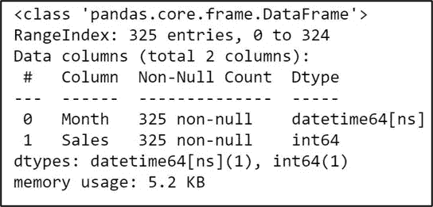

数据集 1 的结构(图片由作者提供)

```
input_dataframe.describe()
```

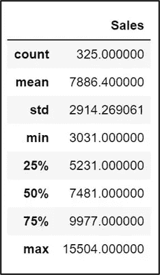

数据集 2 的结构(图片由作者提供)

```
input_dataframe.head(10)
```

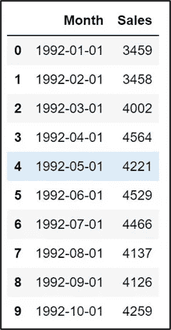

数据集的前 10 条记录(图片由作者提供)

**步骤四。数据角力:**

在 pandas 中使用 dropna()方法，确保数据集中没有任何带有空白或空值的记录中断。此外，将 date 对象(本例中的“月”字段)转换为 datetime。

```
#Converting date object to datetime :

input_dataframe["Month"]  =  pd.to_datetime(input_dataframe["Month"], format='%Y-%m-%d')#Dropping NA's:input_dataframe = input_dataframe.dropna()
```

将日期时间字段设置为索引字段:

```
input_dataframe = input_dataframe.set_index("Month")
```

**第五步。重采样:**

重采样基本上涉及修改时间序列数据点的频率。我们将根据数据集的性质对时间序列观测值进行上采样或下采样。我们不必对这个时间序列数据集进行重新采样，因为它已经汇总到月初。请查看 Pandas 以了解有关偏移别名和重采样的更多信息:[https://Pandas . pydata . org/Pandas-docs/stable/user _ guide/time series . html # offset-aliases](https://pandas.pydata.org/pandas-docs/stable/user_guide/timeseries.html#offset-aliases)

```
#Set the datetime index frequency:

input_dataframe.index.freq = 'MS'
```

**第六步。绘制源数据:**

```
#Plot the Graph:ax =  input_dataframe['Sales'].plot.line(
title = 'Monthly Sales Timeseries Analysis'
, legend =True, table = False, grid = False
, subplots = False,  figsize =(15,8), colormap = 'Accent'
, fontsize = 15,linestyle='-', stacked=False)#Configure x and y labels:plt.ylabel('Volume of sales',horizontalalignment="center",fontstyle = "normal", fontsize = "large", fontfamily = "sans-serif")plt.xlabel('Year & Quarter',horizontalalignment="center",fontstyle = "normal", fontsize = "large", fontfamily = "sans-serif")#Set up title, legends and theme:plt.title('Monthly Sales Timeseries Analysis \n',horizontalalignment="center", 
fontstyle = "normal", fontsize = "22"
, fontfamily = "sans-serif")plt.legend(loc='upper left', fontsize = "medium")
plt.xticks(rotation=0, horizontalalignment="center")
plt.yticks(rotation=0, horizontalalignment="right")plt.style.use(['classic'])
ax.autoscale(enable=True, axis='x', tight=False)
```

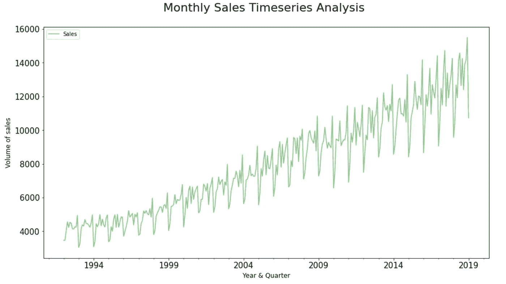

月度销售时间序列分析(图片由作者提供)

**第 7 步:滚动和扩展时间序列数据集:**

滚动均线帮助我们识别支撑和阻力区域；数据集中历史时间序列观测值的“高于平均倾斜度”和“低于平均倾斜度”的区域。

计算移动平均线的主要优点是，它可以过滤掉随机销售活动中的噪音，消除波动，以查看一段时间内的平均趋势。

**第 7.1 步。简单移动平均线趋势分析:**

简单移动平均是对时间序列数据集进行趋势分析的最基本模型之一。滚动移动平均趋势分析背后的整个思想是将数据分成时间的“窗口”，然后为每个窗口计算一个聚合函数。

```
input_dataframe["3-Months-Moving-Avg"] = input_dataframe ["Sales"].rolling(window=3).mean()#Plot the Graph:ax =  input_dataframe[['Sales', '3-Months-Moving-Avg']].plot.line(
title = '3 Months Moving Average Trend Analysis'
, legend =True, table = False, grid = False,  
subplots = False,  figsize =(15,8), colormap = 'Accent', 
fontsize = 15,linestyle='-', stacked=False)#Configure x and y labels:plt.ylabel('Volume of sales',horizontalalignment="center",fontstyle = "normal", fontsize = "large", fontfamily = "sans-serif")plt.xlabel('Year & Quarter',horizontalalignment="center",fontstyle = "normal", fontsize = "large", fontfamily = "sans-serif")#Set up title, legends and theme:plt.title('Monthly Sales: 3 Months Moving Average Trend Analysis \n',horizontalalignment="center", fontstyle = "normal", fontsize = "22", fontfamily = "sans-serif")plt.legend(loc='upper left', fontsize = "medium")
plt.xticks(rotation=0, horizontalalignment="center")
plt.yticks(rotation=0, horizontalalignment="right")plt.style.use(['classic'])
ax.autoscale(enable=True, axis='x', tight=False)
```

从滚动的 3 个月移动平均趋势线中，我们可以清楚地看到，零售商店的销售额在每个季度的中期都呈上升趋势，而在同一季度的末期则出现了一系列阻力。因此，我们可以清楚地推断，零售商店的波段支持发生在日历年的每个季度的阻力波之前。

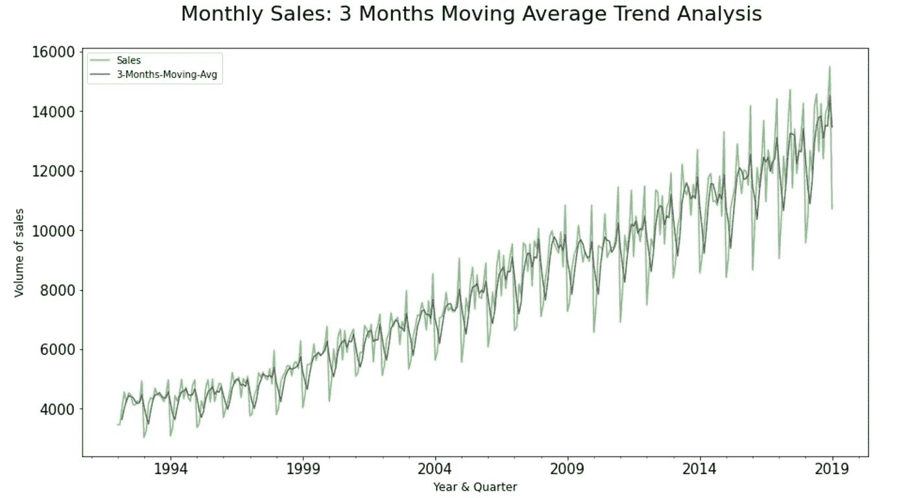

月销售额:3 个月移动平均趋势分析(图片由作者提供)

**步骤 7.2。时间序列分析的标准差:**

标准差图本质上帮助我们了解销售活动在一段时间内是增加还是减少；给出时间序列数据集中平稳性的早期指示。

```
input_dataframe ['3-Months-Moving-Avg'] = input_dataframe['Sales'].rolling(window=3).mean()
input_dataframe['3-Months-Standard-Deviation'] = input_dataframe['Sales'].rolling(window=3).std()#Plot the Graph:ax =  input_dataframe [['Sales', '3-Months-Moving-Avg', '3-Months-Standard-Deviation']].plot.line(title = 'Standard Deviation of Timeseries Datapoints', legend =True, table = False, grid = False,  subplots = False,  figsize =(15,8), colormap = 'Accent', fontsize = 15,linestyle='-', stacked=False)#Configure x and y labels:plt.ylabel('Volume of sales',horizontalalignment="center",fontstyle = "normal", fontsize = "large", fontfamily = "sans-serif")plt.xlabel('Year & Quarter',horizontalalignment="center",fontstyle = "normal", fontsize = "large", fontfamily = "sans-serif")#Set up title, legends and theme:plt.title('Monthly Sales: Standard Deviation of Timeseries Datapoints \n',horizontalalignment="center", fontstyle = "normal", fontsize = "22", fontfamily = "sans-serif")plt.legend(loc='upper left', fontsize = "medium")
plt.xticks(rotation=0, horizontalalignment="center")
plt.yticks(rotation=0, horizontalalignment="right")plt.style.use(['classic'])
ax.autoscale(enable=True, axis='x', tight=False)
```

所选时间序列数据集的标准偏差似乎随着时间的推移略有增加；暗示非平稳性。我们将在随后的步骤中达到平稳性。

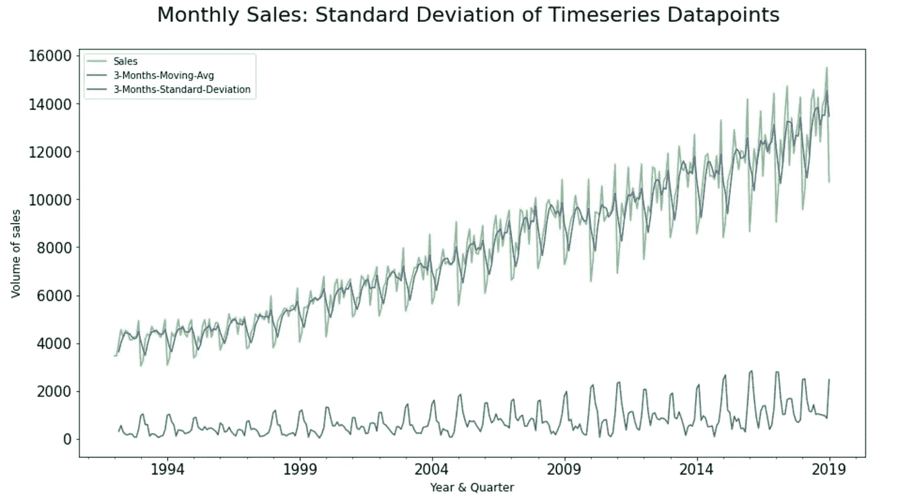

月销售额:时间序列数据点的标准偏差(图片由作者提供)

**步骤 7.3。扩展时间序列数据集:**

时间序列分析中的扩展过程有助于我们识别销售活动的“稳定性”或“波动性”。因此，当我们在时间序列数据集上应用扩展技术时，我们将能够基本上看到数据集中每个历史时间序列观察值的累积平均值。

```
#Plot the Graph:ax =  input_dataframe['Sales'].expanding().mean().plot.line(
title = 'Expandind Timeseries Datapoints', legend =True, 
table = False, grid = False,  subplots = False,  figsize =(15,8), colormap = 'Accent', fontsize = 15,linestyle='-', stacked=False)#Configure x and y labels:plt.ylabel('Cumulative Volume of sales',horizontalalignment="center",fontstyle = "normal", fontsize = "large", fontfamily = "sans-serif")plt.xlabel('Year & Quarter',horizontalalignment="center",fontstyle = "normal", fontsize = "large", fontfamily = "sans-serif")#Set up title, legends and theme:plt.title('Monthly Sales: Expanded Timeseries Datapoints \n',horizontalalignment="center", fontstyle = "normal", fontsize = "22", fontfamily = "sans-serif")plt.legend(loc='upper left', fontsize = "medium")
plt.xticks(rotation=0, horizontalalignment="center")
plt.yticks(rotation=0, horizontalalignment="right")plt.style.use(['classic'])
ax.autoscale(enable=True, axis='x', tight=False)
```

知道历史时间戳上平均值的位置是非常好的；尤其是在时序建模的后续模型评估阶段。因为扩展技术最终有助于我们将均方根误差与销售额的累积平均值进行比较，以了解差异的大小。

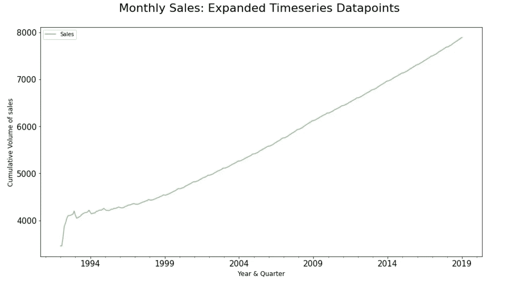

月销售额:扩展的时间序列数据点(图片由作者提供)

**第二阶段:数据评估**

**第八步。评估误差、趋势和季节性:**

选择预测模型的一个有用的抽象是将时间序列分解成系统的和非系统的部分。系统的:时间序列的组成部分，具有一致性或重现性，可以描述和建模。非系统性:时间序列中无法直接建模的部分。

**第 8.1 步。霍德里克-普雷斯科特滤波器:**

Hodrick-Prescott 滤波器将时间序列数据集分解为趋势和周期分量。

```
#cyclicity:sales_cycle, sales_trend = hpfilter(
input_dataframe["Sales"], lamb = 1600)input_dataframe["cycle"] = sales_cycle#Plot the Graph:ax =  input_dataframe[["cycle", "Sales"]].plot.line(
title = 'Hodrick-Prescott Filter - Cyclicity'
, legend =True, table = False, grid = False
,  subplots = False,  figsize =(15,8), colormap = 'Accent'
, fontsize = 15,linestyle='-', stacked=False)#Configure x and y labels:plt.ylabel('Volume of sales',horizontalalignment="center",fontstyle = "normal", fontsize = "large", fontfamily = "sans-serif")plt.xlabel('Year & Quarter',horizontalalignment="center",fontstyle = "normal", fontsize = "large", fontfamily = "sans-serif")#Set up title, legends and theme:plt.title(' Monthly Sales: Hodrick-Prescott Filter - Cyclicity Analysis \n',horizontalalignment="center", fontstyle = "normal", fontsize = "22", fontfamily = "sans-serif")plt.legend(loc='upper left', fontsize = "medium")
plt.xticks(rotation=0, horizontalalignment="center")
plt.yticks(rotation=0, horizontalalignment="right")plt.style.use(['classic'])
ax.autoscale(enable=True, axis='x', tight=False)
```

当数据表现出非固定周期的上升和下降时，存在循环模式。此外，如果循环性值接近零，则表明数据是“随机的”。结果与零相差越多，就越有可能存在某种周期性。正如我们在这里看到的，在选择的数据集中存在循环性。

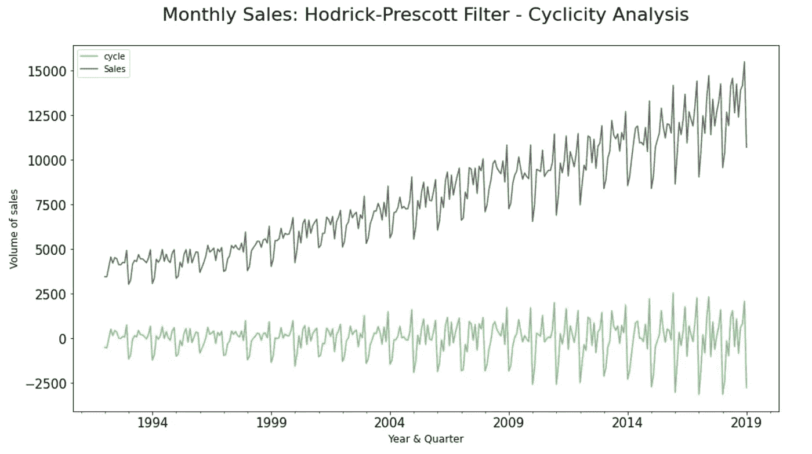

月销售额:Hodrick Prescott 过滤器——周期性分析(图片由作者提供)

```
#Trendlineinput_dataframe ["trend"] = sales_trend#Plot the Graph:ax =  input_dataframe[["trend", "Sales"]].plot.line(
title = 'Hodrick-Prescott Filter - Trendline', 
legend =True, table = False, grid = False,  subplots = False,  figsize =(15,8), colormap = 'Accent', fontsize = 15,
linestyle='-', stacked=False)#Configure x and y labels:plt.ylabel('Volume of sales',horizontalalignment="center",fontstyle = "normal", fontsize = "large", fontfamily = "sans-serif")plt.xlabel('Year & Quarter',horizontalalignment="center",fontstyle = "normal", fontsize = "large", fontfamily = "sans-serif")#Set up title, legends and theme:plt.title('Monthly Sales: Hodrick-Prescott Filter - Trendline Analysis \n',horizontalalignment="center", fontstyle = "normal", fontsize = "22", fontfamily = "sans-serif")plt.legend(loc='upper left', fontsize = "medium")
plt.xticks(rotation=0, horizontalalignment="center")
plt.yticks(rotation=0, horizontalalignment="right")plt.style.use(['classic'])
ax.autoscale(enable=True, axis='x', tight=False)
```

数据点的观察值的趋势线显示了在一段时间内以非线性速率的总体增长模式。

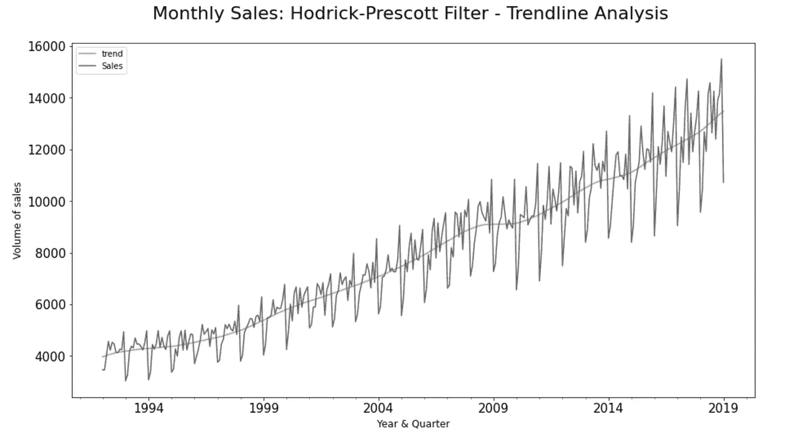

月销售额:霍德里克-普雷斯科特过滤器-趋势线分析(图片由作者提供)

**第 8.2 步。误差、趋势和季节性(ETS)分解:**

一个给定的时间序列由三个系统成分组成，包括水平、趋势、季节性和一个称为噪声/误差/残差的非系统成分。本节对时间序列的分解试图分离出时间序列中的这些单独的系统和非系统组成部分；抛出一个包含四个前述情节的图表。

乘法模型在这里更为合适，因为销售额似乎正以非线性的速度增长。另一方面，当季节性和趋势成分在一段时间内保持不变时，我们对时间序列应用“加法”模型。

```
result = seasonal_decompose(input_dataframe["Sales"]
, model = "multiplicative")fig, axes = plt.subplots(4, 1, sharex=True)result.observed.plot(ax=axes[0], legend=False, colormap = 'Accent')
axes[0].set_ylabel('Observed')result.trend.plot(ax=axes[1], legend=False, colormap = 'Accent')
axes[1].set_ylabel('Trend')result.seasonal.plot(ax=axes[2], legend=False, colormap = 'Accent')
axes[2].set_ylabel('Seasonal')result.resid.plot(ax=axes[3], legend=False, colormap = 'Accent')
axes[3].set_ylabel('Residual')plt.title(""" Monthly Sales: ETS Decomposition Plots \n""",horizontalalignment="center", fontstyle = "normal", fontsize = "15", fontfamily = "sans-serif")plt.style.use(['classic'])
ax.autoscale(enable=True, axis='x', tight=False)
```

此处观察值的趋势线表明，随着时间的推移，总体增长模式呈非线性(类似于我们在 Hodrick-Prescott 过滤过程中注意到的情况)。此外，在固定的时间间隔内，数据集的时间戳似乎存在显著的季节性变化(范围远远超过零)；暗示季节性。

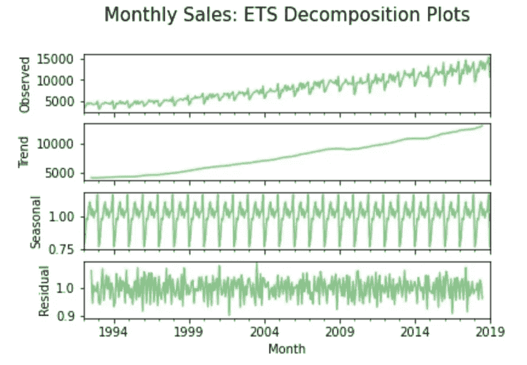

月销售额:ETS 分解图(图片由作者提供)

**步骤 8.3。用于季节性检查的自相关(ACF)图:**

自相关是一种序列相关性，其中时间序列与其自身的滞后版本线性相关。滞后意味着“倒退”，就这么简单。因此,“自身的滞后版本”基本上意味着数据点被后移一定数量的周期/滞后。

因此，如果我们在时间序列数据集上运行自相关函数，我们基本上是在将其后移至一定数量的周期/滞后后绘制同一组数据点。

平均来说，在最初的几个(20-40)滞后期内绘制自相关的大小可以说明一个时间序列的很多情况。通过这样做，我们将能够很容易地发现和验证时间序列数据中的季节性成分。

```
fig = plt.figure(figsize=(15,8))
ax = fig.add_subplot(111)acf(input_dataframe["Sales"])
lags = 40plot_acf(input_dataframe["Sales"], 
lags = lags, color = 'g', ax = ax);
plt.figure(figsize=(15,8)) 
plt.title(' Monthly Sales: Autocorrelation Plots \n',horizontalalignment="center", fontstyle = "normal", fontsize = "22", fontfamily = "sans-serif")plt.ylabel('y(t+1)',horizontalalignment="center",fontstyle = "normal", fontsize = "large", fontfamily = "sans-serif")plt.xlabel('y(t)',horizontalalignment="center",fontstyle = "normal", fontsize = "large", fontfamily = "sans-serif")plt.style.use(['classic'])
ax.autoscale(enable=True, axis='x', tight=False)
```

通过绘制滞后 ACF，我们首先可以确认季节性确实存在于这个时间序列数据集中。因为滞后 ACF 图展示了数据中可预测的季节性模式。我们能够清楚地看到，在第二大正峰值爆发之前，由固定数量的时间戳组成的季节性起伏模式。每个数据点似乎都与未来的另一个数据点密切相关；表明数据集中有很强的季节性。

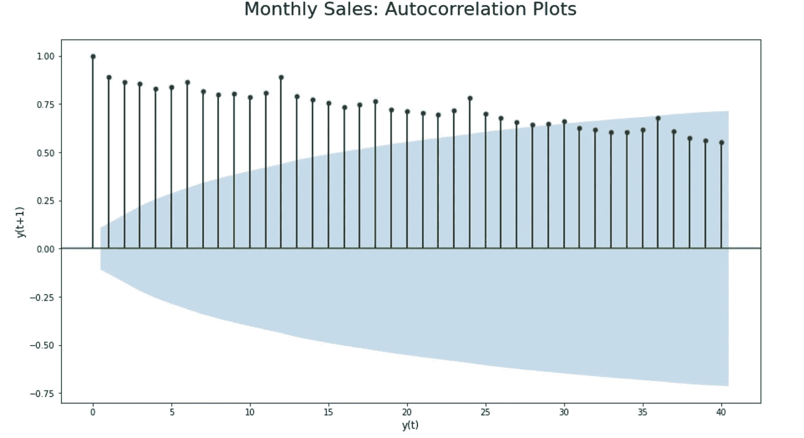

月销售额:自相关图(图片由作者提供)

**第九步。平稳性检查**

如果时间序列数据不显示趋势或季节性，则称其为平稳的。也就是；它的均值、方差和协方差在序列的任何部分都保持不变，并且不是时间的函数。

显示季节性的时间序列肯定不是平稳的。因此，所选择的时间序列数据集是非平稳的。让我们使用自动迪基-富勒& KPSS 测试，并进一步通过绘制数据集的滞后自相关和偏相关函数，再次确认时间序列数据集的非平稳性，如下所示:

**步骤 9.1。平稳性的增强 Dickey-Fuller 检验:**

平稳性的增强 Dickey-Fuller 检验通常涉及单位根假设检验，其中零假设 H0 表明序列是非平稳的。替代假设 H1 支持具有小 p 值(p <0.05 ) indicating strong evidence against the null hypothesis.

```
print('Augmented Dickey-Fuller Test on Sales Data')input_dataframe_test = adfuller(input_dataframe["Sales"], autolag = 'AIC')input_dataframe_test
```

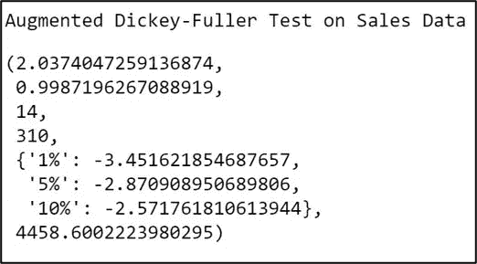

Augmented Dickey-Fuller Test for Stationarity 1 (Image by Author)

```
#For loop to assign dimensions to the metrices:

print('Augmented Dickey-Fuller Test on Sales Data')input_dataframe_out = pd.Series(input_dataframe_test[0:4], 
                                index = ['ADF test statistic', 'p-value', '#lags used', '#observations'])for key, val in input_dataframe_test[4].items():input_dataframe_out[f'critical value ({key})'] = val

print(input_dataframe_out)
```

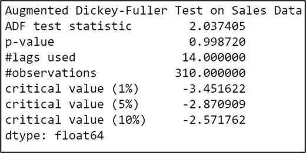

Augmented Dickey-Fuller Test for Stationarity 2 (Image by Author)

Here we have a very high p-value at 0.99 ( p> 0.05)的平稳性，这提供了反对零假设的弱证据，因此我们无法拒绝零假设。因此，我们决定我们的数据集是非平稳的。

以下是使用 ADF 测试自动检查平稳性的自定义函数:

```
#Custom function to check stationarity using ADF test:

def adf_test(series,title=''):print(f'Augmented Dickey-Fuller Test: {title}')
    result = adfuller(series.dropna(),autolag='AIC') # .dropna() handles differenced data

    labels = ['ADF test statistic','p-value','# lags used','# observations'] out = pd.Series(result[0:4],index=labels)for key,val in result[4].items():
        out[f'critical value ({key})']=val
         print(out.to_string())          
    # .to_string() removes the line "dtype: float64"

    if result[1] <= 0.05:
        print("Strong evidence against the null hypothesis")
        print("Reject the null hypothesis")
        print("Data has no unit root and is stationary")
    else:
        print("Weak evidence against the null hypothesis")
        print("Fail to reject the null hypothesis")
        print("Data has a unit root and is non-stationary")
```

调用定制的增强 Dickey-Fuller 函数来检查平稳性:

```
adf_test(input_dataframe["Sales"], title = "Automated ADF Test for Stationarity")
```

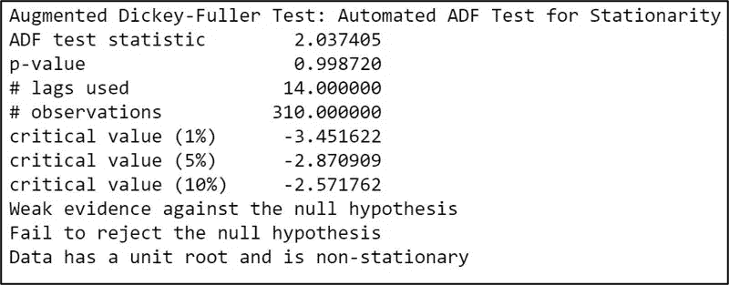

平稳性 3 的增强 Dickey-Fuller 测试(图片由作者提供)

**第 9.2 步。平稳性的 KPSS(科维亚特科夫斯基-菲利普斯-施密特-申)检验:**

在解释零假设和交替假设时，KPSS(科维亚特科夫斯基-菲利普斯-施密特-申)检验结果与 ADF 检验结果正好相反。也就是；平稳性的 KPSS 检验通常涉及单位根假设检验，其中零假设 H0 表示序列是平稳的，具有较大的 p 值(p>0.05)，而替代假设 H1 支持非平稳性，表明零假设的证据较弱。

```
def kpss_test(timeseries):

    print ('Results of KPSS Test:')
    kpsstest = kpss(timeseries, regression='c')
    kpss_output = pd.Series(kpsstest[0:3], index=
    ['Test Statistic','p-value','Lags Used']) for key,value in kpsstest[3].items():
        kpss_output['Critical Value (%s)'%key] = value
        print (kpss_output)
```

调用自定义 KPSS 函数来检查平稳性:

```
kpss_test(input_dataframe["Sales"])
```

这里我们有一个非常低的 p 值，为 0.01 ( p <0.05 ), which provides weak evidence against the null hypothesis, indicating that our time-series is non-stationary.

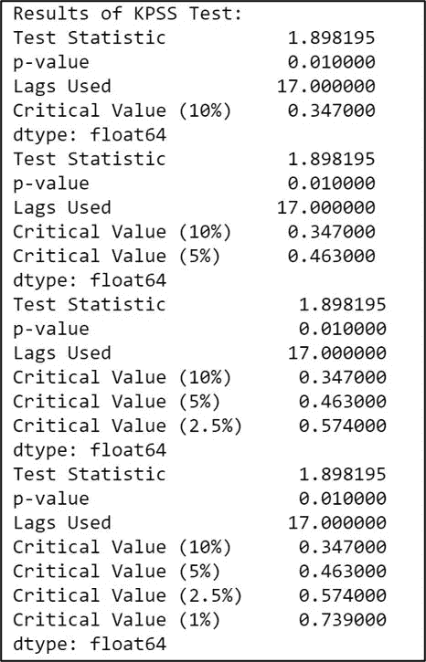

KPSS Test for Stationarity (Image by Author)

**Step 9.3)。使用滞后&自相关图重新验证非平稳性:**

**步骤 9.3.1。滞后图:**

当我们在非平稳数据集上绘制 y(t)对 y(t+1)时，我们将能够发现强自相关；也就是说，随着 y(t)值的增加，附近的滞后值也会增加。

```
fig = plt.figure(figsize=(15,8))
ax = fig.add_subplot(111)lag_plot(input_dataframe["Sales"], c= 'g', ax = ax);plt.title('Monthly Sales: Lag Plots \n',horizontalalignment="center", fontstyle = "normal", fontsize = "22", fontfamily = "sans-serif")plt.style.use(['classic'])
ax.autoscale(enable=True, axis='x', tight=False)
```

我们可以在这里的滞后图中找到 y(t)和 y(t+1)之间的强自相关，重申时间序列数据集的非平稳性。

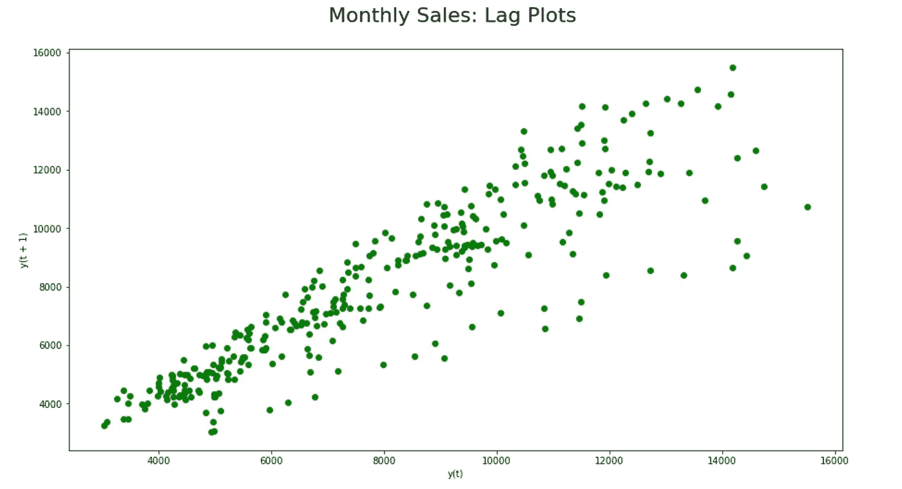

月销售额:滞后图(作者图片)

**步骤 9.3.2。自相关(ACF)图:**

如前所述，我们可以清楚地看到一个没有明显截止或指数衰减迹象的季节性因素。

```
fig = plt.figure(figsize=(15,8))
ax = fig.add_subplot(111)acf(input_dataframe["Sales"])
lags = 40
plot_acf(input_dataframe["Sales"], lags = lags, c = 'g', ax = ax);plt.title('Monthly Sales: Autocorrelation Plots \n',horizontalalignment="center", fontstyle = "normal", fontsize = "22", fontfamily = "sans-serif")plt.ylabel('y(t+1)',horizontalalignment="center",fontstyle = "normal", fontsize = "large", fontfamily = "sans-serif")plt.xlabel('y(t)',horizontalalignment="center",fontstyle = "normal", fontsize = "large", fontfamily = "sans-serif")plt.style.use(['classic'])
ax.autoscale(enable=True, axis='x', tight=False)
```

在第二大正峰值爆发之前，时间序列数据集显然具有由固定数量的时间戳组成的起伏的季节性模式。此外，ACF 图不会很快衰减，仍然远远超出显著性范围；证实时间序列数据集的非平稳性。

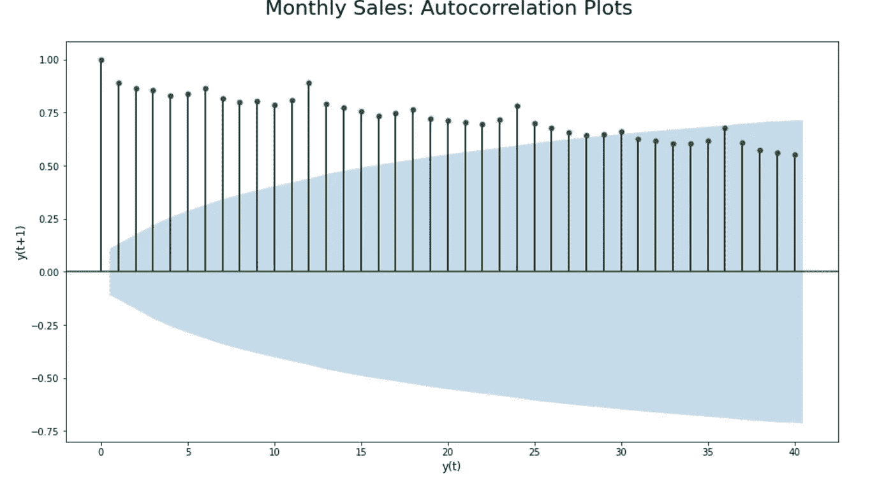

月销售额:自相关图(图片由作者提供)

**步骤 9.3.3。部分自相关(PACF)图:**

部分自相关(PACF)图只能在静态数据集上生成。由于所选的时间序列数据集显示非平稳性，我们在生成部分自相关(PACF)图之前应用了一阶差分。

```
input_dataframe["first_order_differentiation"] = diff(input_dataframe["Sales"], k_diff = 1)#Plot the Graph:ax =  input_dataframe["first_order_differentiation"].plot.line(title = 'Monthly Sales Timeseries Data : 1st order Differentiation'
, legend =True, table = False, grid = False , subplots = False,  figsize =(15,8), colormap = 'Accent', fontsize = 15,linestyle='-', stacked=False)#Configure x and y labels:plt.ylabel('Volume of sales',horizontalalignment="center",fontstyle = "normal", fontsize = "large", fontfamily = "sans-serif")plt.xlabel('Year & Quarter',horizontalalignment="center",fontstyle = "normal", fontsize = "large", fontfamily = "sans-serif")#Set up title, legends and theme:plt.title(' Monthly Sales: 1st order Differentiation Analysis \n',horizontalalignment="center", fontstyle = "normal", fontsize = "22", fontfamily = "sans-serif")plt.legend(loc='upper left', fontsize = "medium")
plt.xticks(rotation=0, horizontalalignment="center")
plt.yticks(rotation=0, horizontalalignment="right")plt.style.use(['classic'])
ax.autoscale(enable=True, axis='x', tight=False)
```

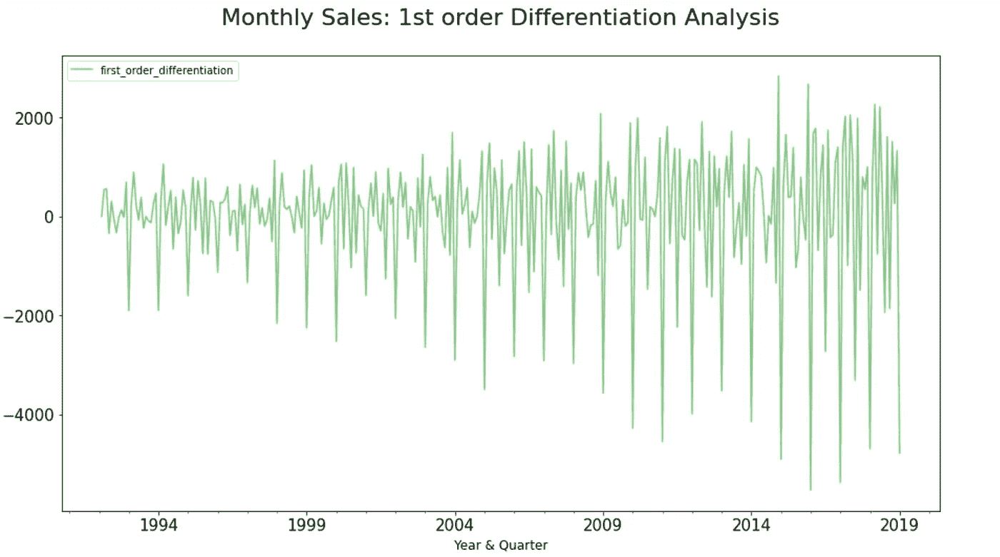

月销售额:一阶差异分析(图片由作者提供)

```
input_dataframe["first_order_differentiation"] = diff(input_dataframe["Sales"], k_diff = 1)fig = plt.figure(figsize=(15,8))
ax = fig.add_subplot(111)
lags = 40
plot_pacf(input_dataframe["first_order_differentiation"].dropna(), lags = np.arange(lags), c='g', ax = ax);plt.title('Monthly Sales: Partial Autocorrelation Plots \n',horizontalalignment="center", fontstyle = "normal", fontsize = "22", fontfamily = "sans-serif")plt.ylabel('y(t+1)',horizontalalignment="center",fontstyle = "normal", fontsize = "large", fontfamily = "sans-serif")plt.xlabel('y(t)',horizontalalignment="center",fontstyle = "normal", fontsize = "large", fontfamily = "sans-serif")plt.style.use(['classic'])
ax.autoscale(enable=True, axis='x', tight=False)
```

具有一阶差分的数据点的 PACF 图显示了锐截止点或指数衰减，表明一阶积分的稳定性。此外，PACF 图衰减相当快，并基本保持在显著性范围内(蓝色阴影区域)，加强了所选时间序列数据集默认为非平稳的假设。

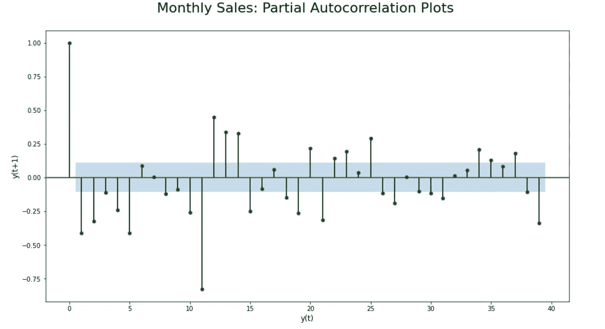

月销售额:部分自相关图

**第三阶段:型号选择**

**第十步。将数据集分为训练集和测试集**

```
len(input_dataframe)training_dataframe = input_dataframe.iloc[:len(input_dataframe)-23, :1]testing_dataframe = input_dataframe.iloc[len(input_dataframe)-23:, :1]
```

**步骤 11.1。确定 ARIMA 订单:**

由于数据集是季节性的和不稳定的，我们需要拟合一个 SARIMA 模型。SARIMA 是首字母缩略词，代表季节性自回归综合移动平均线；一类统计模型，用于分析和预测具有季节性和非平稳性的时间序列数据。它只不过是对 ARIMA 的扩展，支持对该系列的季节性成分进行直接建模。

ARIMA 的标准符号是(p，d，q ),其中参数用整数值代替，以快速指示所使用的特定 ARIMA 模型。ARIMA 模型的参数是:

p:模型中包含的滞后观测值的数量，也称为滞后阶数。d:原始观测值的差异次数，也称为差异程度。
问:移动平均线窗口的大小，也叫移动平均线的顺序。

这些组件中的每一个都在模型中被明确指定为参数。在 SARIMA 中，它进一步添加了三个新的超参数，以指定序列的季节性成分的自回归(AR)、差分(I)和移动平均(MA)，以及季节性周期的附加参数。

因此在这一节中，我们本质上是试图确定 P、D、Q 和 P、D、Q 和 m 的顺序(即；自动回归、积分和移动平均分量以及季节回归、差分和移动平均系数的顺序)应用于时间序列数据集以拟合 SARIMA 模型。

**步骤 11.1.1。使用 pmdarima.auto_arima 的 ARIMA 订单:**

```
auto_arima(input_dataframe["Sales"], seasonal = True, m=12, error_action = "ignore").summary()
```

auto_arima 建议我们应该拟合以下 SARIMA 模型(3，1，5)(2，1，1，12)，以最佳预测所选时间序列数据集的未来值。让我们在下一步尝试通过逐步 AIC 准则法重新验证订单。

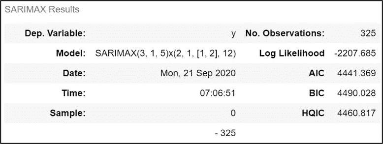

**ARIMA 订单使用 pmdarima.auto_arima(图片由作者提供)**

**逐步 11.1.2。使用逐步 auto_arima 重新验证 ARIMA 订单:**

```
stepwise_fit = auto_arima(input_dataframe["Sales"], start_p = 0
                          , start_q = 0,max_p =3, max_q = 5
                          , m=12, seasonal = True, d=None, 
                          trace = True, 
                          error_action ='ignore'
                          , suppress_warnings = True,
                          stepwise = True)
```

逐步 auto_arima 为我们提供了列表中所有可能的“Akaike 信息标准”或 AIC 分数的细分。逐步拟合得到了相同的结果；突出显示在所选时间序列数据集上拟合 SARIMA 模型时要使用的自回归、积分和移动平均系数的正确顺序。

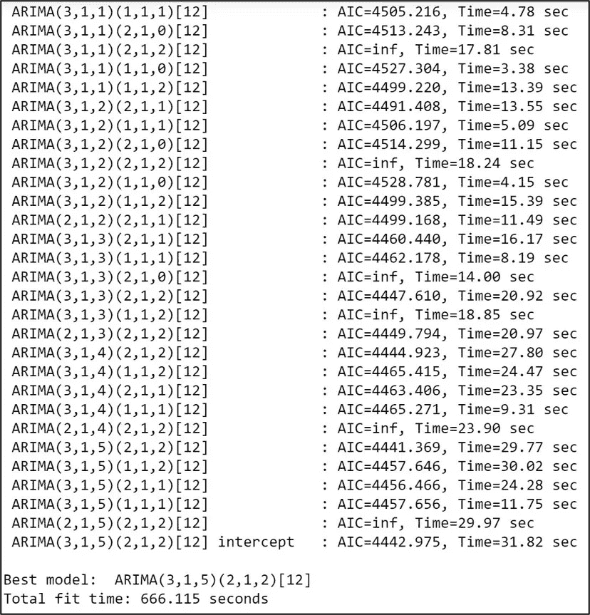

**使用逐步 auto_arima 重新验证 ARIMA 订单(图片由作者提供)**

**步骤 11.2。拟合萨里玛模型:**

在训练数据集上拟合 SARIMA 模型，如下所示:

```
fitted_SARIMA_model = SARIMAX(training_dataframe["Sales"], order =(3,1,5), seasonal_order = (2,1,1,12))results = fitted_SARIMA_model.fit()results.summary()
```

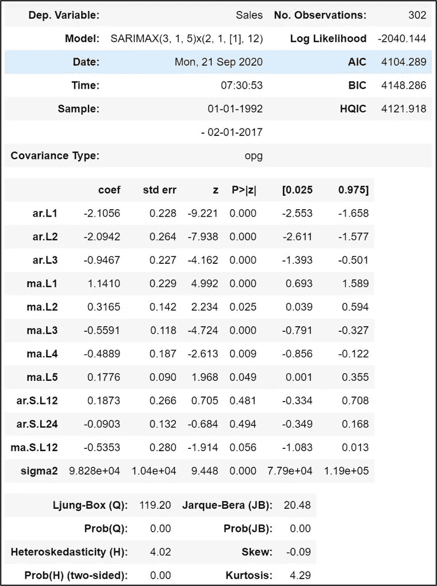

拟合萨里玛模型(图片由作者提供)

**第四阶段:模型评估**

**步骤 12.1。评估萨里玛模型:**

```
start = len(training_dataframe)end = len(training_dataframe) + len(testing_dataframe) -1
test_SARIMA_predictions = results.predict(start = start, end = end).rename('SARIMA Predictions')#Root Mean Squared Errornp.sqrt(mean_squared_error(testing_dataframe, test_SARIMA_predictions))
```

**步骤 12.2。构建差异—预测的入站和出站值:**

```
test_SARIMA_predictions = pd.DataFrame(test_SARIMA_predictions)test_SARIMA_predictions["inbound_variance"] = (test_SARIMA_predictions["SARIMA Predictions"]-562.176565188264).round(decimals =0)test_SARIMA_predictions["outbound_variance"]= (test_SARIMA_predictions["SARIMA Predictions"]+562.176565188264).round(decimals = 0)test_SARIMA_predictions = test_SARIMA_predictions.join(testing_dataframe)test_SARIMA_predictions
```

**步骤 12.3。将预测值与测试集的预期值进行比较:**

```
test_SARIMA_predictions = test_SARIMA_predictions.reset_index()print(test_SARIMA_predictions.columns)type(test_SARIMA_predictions["index"])test_SARIMA_predictions["Month"] = test_SARIMA_predictions["index"].rename("Month")test_SARIMA_predictions["Month"] = test_SARIMA_predictions["Month"] .dt.strftime('%Y-%m-%d')test_SARIMA_predictions.set_index("Month", inplace=True)test_SARIMA_predictions[["Sales", "SARIMA-Predicted Sales",'Predicted Inbound Variance',
       'Predicted Outbound Variance']] = test_SARIMA_predictions[["Sales", "SARIMA-Predicted Sales",'Predicted Inbound Variance',
       'Predicted Outbound Variance']] .astype(int)#Plot the Graph:ax = test_SARIMA_predictions[["Sales", "SARIMA-Predicted Sales","Predicted Inbound Variance","Predicted Outbound Variance"]].plot.line(
                             title = 'Monthly Sales: Evaluating SARIMA Model', legend =True, table = False, grid = False
                            ,  subplots = False,  figsize =(15,8)
                            , colormap = 'Accent', fontsize = 15
                            ,linestyle='-', stacked=False)x=  pd.Series (range (0, len(test_SARIMA_predictions)  , 1))for i in x:
  ax.annotate(test_SARIMA_predictions["SARIMA-Predicted Sales"][i],
      xy=(i,test_SARIMA_predictions["SARIMA-Predicted Sales"][i]), 
      xycoords='data',
      xytext=(i,test_SARIMA_predictions["SARIMA-Predicted Sales"][i]+5 ), textcoords='data',arrowprops=dict(arrowstyle="->", connectionstyle="angle3",facecolor='black'),horizontalalignment='left',verticalalignment='top')#Configure x and y labels:plt.ylabel('Volume of sales',horizontalalignment="center",fontstyle = "normal", fontsize = "large", fontfamily = "sans-serif")plt.xlabel('Year & Month',horizontalalignment="center",fontstyle = "normal", fontsize = "large", fontfamily = "sans-serif")#Set up title, legends and theme:plt.title('Monthly Sales: Evaluating SARIMA Model \n',horizontalalignment="center", fontstyle = "normal", fontsize = "22", fontfamily = "sans-serif")plt.legend(loc='upper left', fontsize = "medium")
plt.xticks(rotation=0, horizontalalignment="center")
plt.yticks(rotation=0, horizontalalignment="right")plt.style.use(['classic'])
ax.autoscale(enable=True, axis='x', tight=False)
```

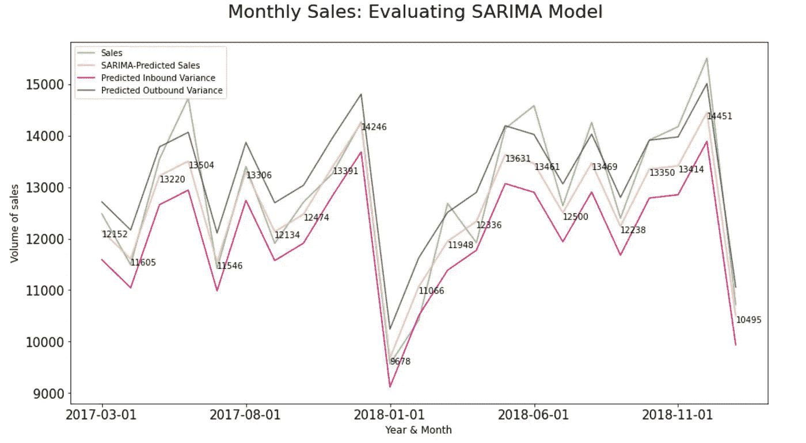

月销售额:评估 SARIMA 模型(图片由作者提供)

**第五阶段:对未来的预测**

**步骤 13.1。在完整数据集上拟合所选预测模型:**

```
final_model = SARIMAX(input_dataframe["Sales"], order = (3,1,5), seasonal_order = (2,1,1,12))SARIMAfit = final_model.fit()
```

**步骤 13.2。获取整个数据集的预测值:**

```
forecast_SARIMA_predictions = SARIMAfit.predict(start = len(input_dataframe), end = len(input_dataframe)+23, dynamic = False, typ = 'levels').rename ('Forecast')
```

**第 13.3 步。构建差异:入站和出站差异:**

```
forecast_SARIMA_predictions = pd.DataFrame(forecast_SARIMA_predictions)forecast_SARIMA_predictions = forecast_SARIMA_predictions.rename(columns = {'Forecast': "SARIMA Forecast"})forecast_SARIMA_predictions["minimum_sales"] = (forecast_SARIMA_predictions ["SARIMA Forecast"] -546.9704996461452).round(decimals = 0)forecast_SARIMA_predictions["maximum_sales"] = (forecast_SARIMA_predictions ["SARIMA Forecast"] +546.9704996461452).round(decimals = 0)forecast_SARIMA_predictions["SARIMA Forecast"] = forecast_SARIMA_predictions["SARIMA Forecast"].round(decimals = 0)forecast_SARIMA_predictions.to_csv('output.csv')forecast_SARIMA_predictions
```

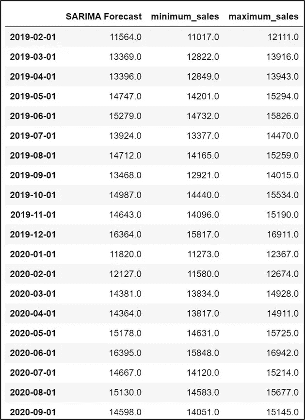

预测的 SARIMA 数据集(图片由作者提供)

**步骤 13.4。根据已知值绘制预测值:**

```
forecast_SARIMA_predictions1 = forecast_SARIMA_predictionsforecast_SARIMA_predictions1 = forecast_SARIMA_predictions1.reset_index()print(forecast_SARIMA_predictions1.columns)type(forecast_SARIMA_predictions1["index"])forecast_SARIMA_predictions1["Month"] = forecast_SARIMA_predictions1["index"].rename("Month")forecast_SARIMA_predictions1["Month"] = forecast_SARIMA_predictions1["Month"] .dt.strftime('%Y-%m-%d')forecast_SARIMA_predictions1 = forecast_SARIMA_predictions1.drop(['index'], axis=1)forecast_SARIMA_predictions1.set_index("Month", inplace=True)forecast_SARIMA_predictions1[["SARIMA - Forecasted Sales"
,'Minimum Sales','Maximum Sales']] = forecast_SARIMA_predictions[["SARIMA - Forecasted Sales"
,'Minimum Sales','Maximum Sales']] .astype(int)#Plot the Graph:ax = forecast_SARIMA_predictions1[["SARIMA - Forecasted Sales",'Minimum Sales','Maximum Sales']].plot.line(
title = 'Predicting Monthly Sales: SARIMA Model', legend =True, table = False, grid = False,  subplots = False,  figsize =(15,8)
 , colormap = 'Accent', fontsize = 15,linestyle='-', stacked=False)x=  pd.Series (range (0, len(forecast_SARIMA_predictions1)  , 1))for i in x:
              ax.annotate(forecast_SARIMA_predictions1["SARIMA - Forecasted Sales"][i],xy=(i,forecast_SARIMA_predictions1["SARIMA - Forecasted Sales"][i]), xycoords='data',
xytext=(i,forecast_SARIMA_predictions1["SARIMA - Forecasted Sales"][i]+5 ), textcoords='data',#arrowprops=dict(arrowstyle="-",
#facecolor='black'),#horizontalalignment='left',
verticalalignment='top')#Configure x and y labels:plt.ylabel('Volume of sales',horizontalalignment="center",fontstyle = "normal", fontsize = "large", fontfamily = "sans-serif")plt.xlabel('Year & Month',horizontalalignment="center",fontstyle = "normal", fontsize = "large", fontfamily = "sans-serif")#Set up title, legends and theme:plt.title('Predicting Monthly Sales: SARIMA Model \n',horizontalalignment="center", fontstyle = "normal", fontsize = "22", fontfamily = "sans-serif")plt.legend(loc='upper left', fontsize = "medium")
plt.xticks(rotation=0, horizontalalignment="center")
plt.yticks(rotation=0, horizontalalignment="right")plt.style.use(['classic'])
ax.autoscale(enable=True, axis='x', tight=False)
```

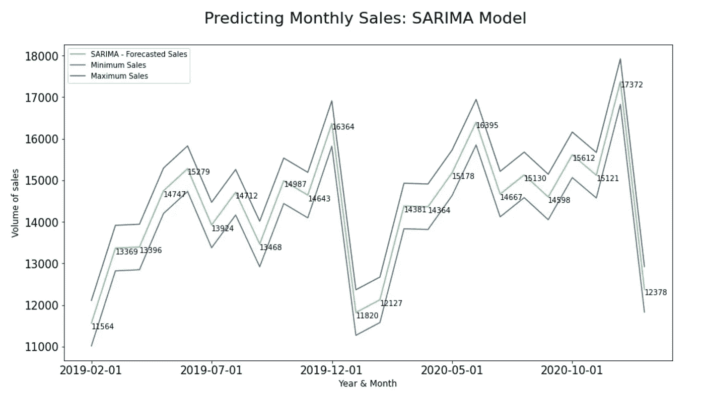

预测月销售额:萨里玛模型

不可预测性和风险是任何预测模型的亲密伴侣。在现实世界中，我们可能无法始终将实际销售额精确到绝对预测值。

事实上，不仅仅是一个绝对值，根据预测的不可预测性程度来获得洞察力在业内被普遍认为是一种良好的做法。因此，让我们结合输入数据集中过去和现在的数据以及预测的入站/出站差异来预测未来几个月的销售情况。

```
input_dataframe["Sales"].plot.line(title = 'Monthly Sales: Evaluating SARIMA Model', legend =True, table = False, grid = False
,  subplots = False,  figsize =(15,8), colormap = 'Accent', fontsize = 15,linestyle='-', stacked=False)#forecast_SARIMA_predictions["SARIMA Forecast"].plot(legend = True, label = "SARIMA Forecast")forecast_SARIMA_predictions["Minimum Sales"].plot(legend = True, label = "Minimum Predicted Sales")forecast_SARIMA_predictions["Maximum Sales"].plot(legend = True, label = "Maximum Predicted Sales")#Configure x and y labels:plt.ylabel('Volume of sales',horizontalalignment="center",fontstyle = "normal", fontsize = "large", fontfamily = "sans-serif")plt.xlabel('Year & Month',horizontalalignment="center",fontstyle = "normal", fontsize = "large", fontfamily = "sans-serif")#Set up title, legends and theme:plt.title('Monthly Sales: Evaluating SARIMA Model \n',horizontalalignment="center", fontstyle = "normal", fontsize = "22", fontfamily = "sans-serif")plt.legend(loc='upper left', fontsize = "medium")
plt.xticks(rotation=0, horizontalalignment="center")
plt.yticks(rotation=0, horizontalalignment="right")plt.style.use(['classic'])
ax.autoscale(enable=True, axis='x', tight=False)
```

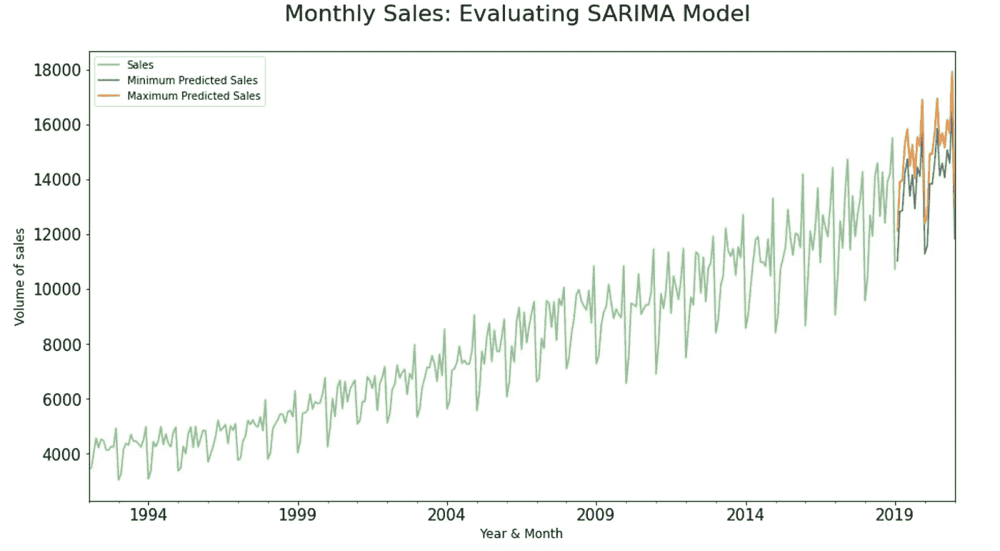

月销售额:评估 SARIMA 模型(图片由作者提供)

**结论**

因此，简而言之，我们利用来自 Kaggle 的带时间戳的销售数据集，并使用 Python 中的 Statsmodels 库预测其未来数据点的实际进出差异。此外，在每一个接合点，我们使用 pandas.plot()和 Matplotlib 可视化输出，以获得洞察力。

**接下来是什么？**

预测未来的数据点只是故事的一半。在现实世界中，当洞察以可理解的方式与内部/外部的利益相关者共享时，项目就展开了，这样他们就能够不时地做出战略性的商业决策。

1)因此，让我们确保将最终输出数据集插入组织的 BI 平台(如 Tableau/ Power BI/ Qlik 等)。)并构建一个数据故事，突出项目的关键发现。在构建数据故事的同时，翻译调查结果的整个过程很大程度上取决于我们对行业和相关业务部门的了解。

2)与组织的内部/外部利益相关者以及仪表板分享见解，以便他们能够相应地制定营销/销售/财务计划。

3)在 python 中应用完全相同的 Statsmodels 库来预测带时间戳的未来线索/价格/网络流量/收入等。

**GitHub 库**

我已经从 Github 的许多人那里学到了(并且还在继续学到)。因此，在一个公共的 [GitHub 库](https://github.com/srees1988/sarima-in-py)中分享我的整个 python 脚本和支持文件，以防它对任何在线搜索者有益。此外，如果您在理解使用 Python 中的 ARIMA 模型预测带时间戳的数据点的基础知识方面需要任何帮助，请随时联系我。乐于分享我所知道的:)希望这有所帮助！

**关于作者**

[](https://srees.org/about) [## Sreejith Sreedharan - Sree

### 数据爱好者。不多不少！你好！我是 Sreejith Sreedharan，又名 Sree 一个永远好奇的数据驱动的…

srees.org](https://srees.org/about)