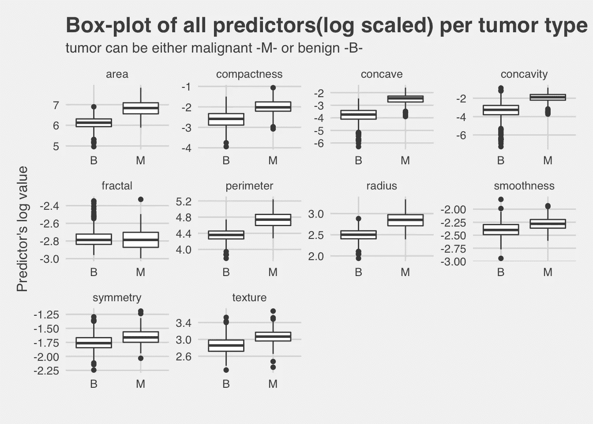
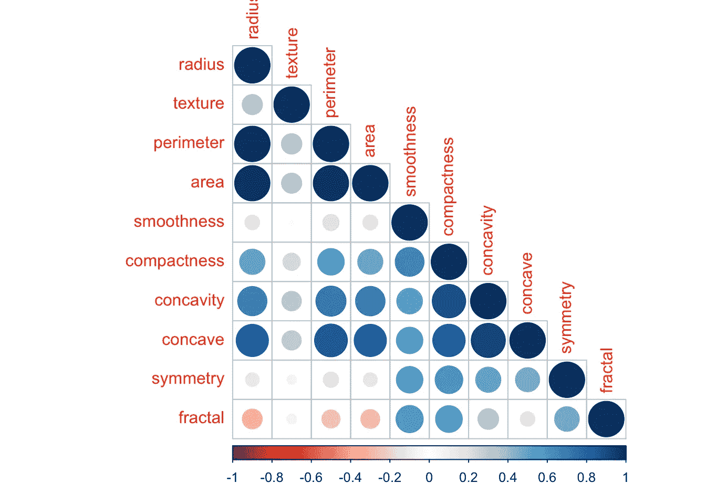
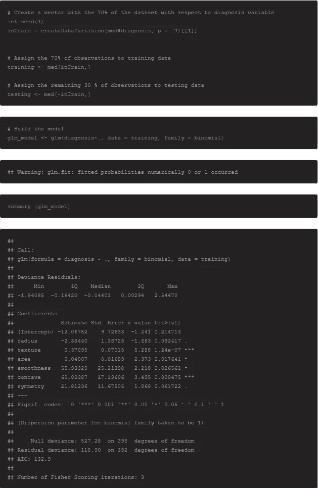
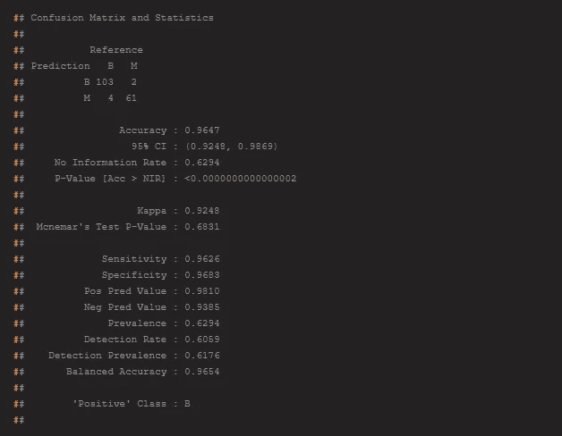
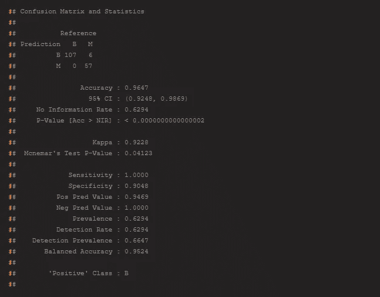
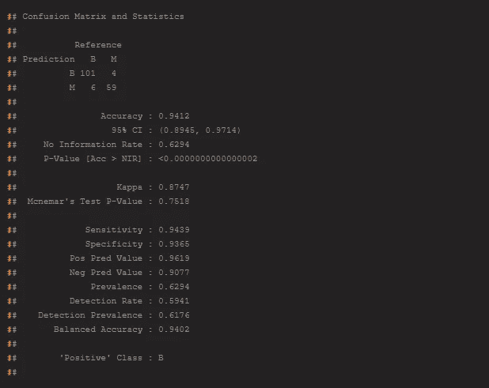
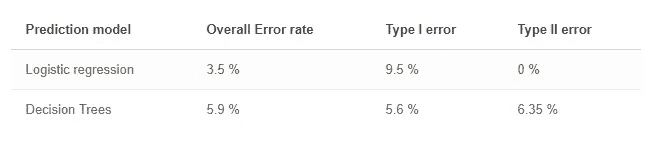

# 使用 R 中的分类方法进行预测

> 原文：<https://towardsdatascience.com/predict-using-classification-methods-in-r-173477062576?source=collection_archive---------30----------------------->

## 使用乳腺癌威斯康星(诊断)数据集构建机器学习模型

图片由来自 [Pixabay](https://pixabay.com/?utm_source=link-attribution&utm_medium=referral&utm_campaign=image&utm_content=2133976) 的 [Javier Rodriguez](https://pixabay.com/users/Javier-Rodriguez-15911/?utm_source=link-attribution&utm_medium=referral&utm_campaign=image&utm_content=2133976) 拍摄

在这个分析中，我将建立一个模型，根据乳腺癌研究的数据预测肿瘤是恶性还是良性。建模过程中将使用分类算法。

*数据集*

这项分析的数据涉及一项乳腺癌研究中的 569 名患者。实际数据可以在 UCI(机器学习知识库)找到:[https://archive . ics . UCI . edu/ml/datasets/Breast+Cancer+Wisconsin+(Diagnostic)](https://archive.ics.uci.edu/ml/datasets/Breast+Cancer+Wisconsin+(Diagnostic))。这些变量是从乳房肿块的数字化图像中计算出来的，并描述了图像中出现的细胞核的特征。具体而言，变量如下:

1.  **半径**(中心到圆周上各点的平均距离)
2.  **纹理**(灰度值的标准偏差)
3.  **周长**
4.  **区域**
5.  **平滑度**(半径长度的局部变化)
6.  **密实度** (perimeter^ /面积— 1.0)
7.  **凹度**(轮廓凹陷部分的严重程度)
8.  **凹点**(轮廓的凹部数量)
9.  **对称性**
10.  **分维**(“海岸线近似”——1)
11.  **型**(肿瘤可以是恶性-M-或良性-B-型)

# 探索性分析

对数据集有一个总体的了解是很重要的。下面是每个预测值对目标变量(肿瘤)的箱线图。使用预测值的对数值代替实际值，以便更好地查看图形。

作者图片

似乎对于大多数预测者来说，肿瘤类型的恶性水平比良性水平具有更高的值。

现在让我们看看预测因素是否相关。下面是所有预测值的散点图矩阵。

作者图片

我们可以看到，正如所料，有一些预测因子是密切相关的，如半径、周长和面积。

相关图将为我们提供更好的服务，并量化所有的相关性。

作者图片

我们可以发现一些不太重要的相关性，例如凹性&连接性&紧密性。也凹对半径，周长和面积。

# 使用分类方法进行预测

在该分析的第一部分中，目标是基于使用分类方法由数字化图像产生的变量来预测肿瘤是恶性还是良性。分类是根据包含已知类别成员的观察值(或实例)的训练数据集，识别新观察值属于哪一组类别(子群体)的问题。

因此，我们必须开发一个模型，将每个肿瘤(病例)分为恶性或良性。

用两种不同的方法进行分类，*和 ***决策树*** 。*

# *特征选择*

*在构建预测模型时，仅使用重要的预测值是很重要的。你不需要使用所有的特性来创建一个算法。你可以通过只输入那些真正重要的特征来帮助算法。以下是一些原因:*

*   *它使机器学习算法能够更快地训练。*
*   *它降低了模型的复杂性，使其更容易解释。*
*   *如果选择了正确的子集，就可以提高模型的准确性。*
*   *它减少了过度拟合。*

*特别是，我对数据使用了逐步(向前和向后)逻辑回归，因为数据集很小。这种方法的计算量非常大，因此不推荐用于非常大的数据集。*

*审查逐步选择后，决定将以下预测值用于所有模型构建:*

1.  *半径(从中心到周边各点的平均距离)*
2.  *纹理(灰度值的标准偏差)*
3.  *区域*
4.  *平滑度(半径长度的局部变化)*
5.  *凹点(轮廓凹陷部分的数量)*
6.  *对称*

# *逻辑回归*

*逻辑回归是一种参数统计学习方法，用于分类，尤其是当结果为二进制时。逻辑回归模型的概率，一个新的观察属于一个特定的类别。为了拟合模型，使用了一种称为最大似然法的方法。下面是逻辑回归的一个实现。*

**

*作者图片*

*通过查看逻辑回归模型的汇总输出，我们可以看到几乎所有的系数都是正的，表明更高的测量值意味着恶性肿瘤的更高概率。*

*这里重要的一步是评估模型的预测能力。因为模型的预测是概率，我们必须决定分割两种可能结果的阈值。首先，我将尝试默认阈值 0.5。下面是使用此阈值的预测的混淆矩阵。*

**

*作者图片*

*模型的整体准确率为 96.47 % (3.53 %的错误率)。但是在这种特殊情况下，我们必须区分不同类型的错误。换句话说，有两种错误率，第一类和第二类错误。在我们的例子中，这些是相似的(第二类误差= 3.74% &第一类误差= 3.17%)。第一类错误是指良性肿瘤被预测为恶性；第二类错误是指恶性肿瘤被预测为良性。第二类误差更昂贵，我们必须找到消除它的方法(即使它增加了第一类误差)。*

*下面我把阈值提高到 0.8，改变了预测模型。*

**

*作者图片*

*虽然模型的总体精度保持不变，但现在第二类误差消除了，但第一类误差增加了。换句话说，我们现在有了一个模型，可以完美地预测恶性肿瘤，但也错误地将一些良性肿瘤预测为恶性(9.5%)。*

# *决策树*

*决策树由一系列分割点组成，通常称为节点。为了使用决策树进行预测，我们从树的顶部的一个称为根节点的节点开始。根节点是一个决策点或分割点，因为它根据一个输入要素的值设置了一个条件，并且基于这个决策，我们知道是继续树的左侧部分还是树的右侧部分。我们在遇到的每个内部节点重复选择向左或向右的过程，直到到达一个叶节点。这些是树底部的节点，它们为我们提供了输出的特定值，用作我们的预测。*

**

*作者图片*

*当执行决策树时，从输出可以看出，整体预测率为 94.1% (5.9%的错误率)，这对于特定领域来说是相对较低的。特别地，第二类误差为 5.61% &第一类误差= 6.35%。该模型的预测性能比前一个模型(逻辑回归)差。*

*现在让我们创建一个模型的分类树图。*

**

*作者图片*

*从上面的图中，我们可以假设凹面和纹理是肿瘤类型最重要的预测因子(分类树上的分裂)。*

# *结果*

*最后，在使用不同的算法构建各种模型之后，基于其性能选择逻辑回归模型(详情见下表)。*

**

*作者图片*

*特别是，尤其是调整阈值后，消除了 II 型错误(将恶性肿瘤错误预测为良性)。这在这个具体问题上真的很重要。*

*正如预期的参数方法，如逻辑回归，在这种情况下表现更好，我们有一个小数据集(569 个观察值)。*

*虽然我们的分析是一个有趣的步骤，但它是基于有限的案例样本。更大样本的案例，可能会引导我们找到一个更好的分类模型。*

*完整代码[点击这里](https://www.manosantoniou.com/post/predict-using-classification-methods/)*

**最初发表于*[T5【https://www.manosantoniou.com】](https://www.manosantoniou.com/post/predict-using-classification-methods/)*。**