# 使用多任务深度学习框架预测 ICU 患者 30 天再入院风险

> 原文：<https://towardsdatascience.com/predicting-30-readmission-risk-for-icu-patients-be3eec7e6681?source=collection_archive---------33----------------------->

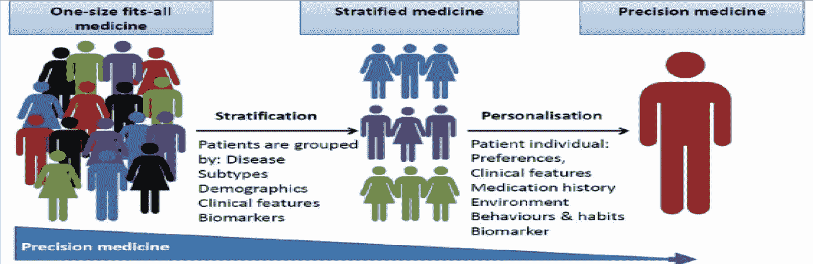

[图像来源](https://audiotech.com/trends-magazine/building-the-foundation-for-personalized-medicine/)

## 使用电子健康记录的用于多任务学习的患者亚群体的无监督聚类

# 问题

无论是有计划的还是无计划的再入院，美国医疗保健系统每年都要花费数十亿美元。这对于医疗保健系统非常重要，因为大约三分之一的再入院是可以预防的，这为医院系统提供了改善护理质量的巨大机会(1)。此外，作为奥巴马政府通过的 2012 年平价医疗法案(affordable care act)的一部分，医疗保险和医疗补助服务中心(CMS)还会对医院进行处罚，将再入院率降低高达 3%,这为使用数据构建算法创造了巨大的机会，该算法能够预测哪些患者可能会在提前出院的情况下再次入院。

近年来，许多使用电子健康记录(EHR)数据和机器学习技术的研究被执行，以帮助确定大数据是否可以检测到 30 天内再次入院的高风险患者。这些研究利用了大量的统计和机器学习技术，从基本的流行病学模型到深度学习 LSTM 和具有专业制作功能的 CNN 架构(3–12)。尽管取得了进展，但许多研究的一个缺点是用于预测患者再入院风险的通用一刀切方法主要针对特定的表型。随着我们朝着开发考虑到每个患者个体风险因素的个性化药物迈进，我们也应该应用同样的思维模式来创建针对复杂 EHR 数据中存在的大量亚人群的算法。因此，在这项研究中，我探索了使用无监督方法进行队列选择的可行性，以在预测每组在 30 天内再次入院的风险之前，首先识别数据集中的亚群。

# 拟议的研究

在这项研究中，我将使用单任务和多任务模型来预测使用 MIMIC III 数据集的 30 天再入院风险。这将通过首先使用数据驱动的无监督方法对患者进行聚类，以使用在患者住院的最后 48 小时内捕获的社会人口统计学、操作和临床因素对患者进行聚类来完成。这将用于使用多任务框架预测患者从 ICU 出院后 30 天内再次入院的风险。Suresh 等人(2018) (13)首先介绍了这种方法，用于预测 ICU 的住院死亡率。据我所知，这是第一个使用这种两步法来预测 ICU 异基因患者 30 天再入院风险的研究。此外，值得注意的是，这项研究的重点是实现和测试这种建模方法的可行性，如果成功的话，将在后续的文章中对这项研究进行跟进和改进。

## 数据源

该项目利用了 [MIMIC III](https://mimic.physionet.org/) 电子健康记录(EHR)数据集，该数据集由 38，645 名成人和 7，875 名新生儿的 58，000 多个住院记录组成。该数据集是从 2001 年 6 月至 2012 年 10 月在贝斯以色列女执事医疗中心的去识别重症监护病房住院病人的集合。

## 数据预处理

社会人口统计学、手术和临床因素已被证明与再入院相关。为评估 30 天再入院风险而建立的绝大多数模型主要依赖于社会人口统计学、操作和专业制作的疾病特异性临床变量(共病)(14-16)，一小部分包括时变测量，如实验室和生命体征，以全面捕捉患者住院期间的进展。因此，为了全面评估这种方法，除了管理和共病特征外，还使用了以下静态和时变变量。时变特征被窗口化以捕捉患者停留的最后 48 小时。为了解决数据缺失的问题，从最后一个测量数据点回填数据。

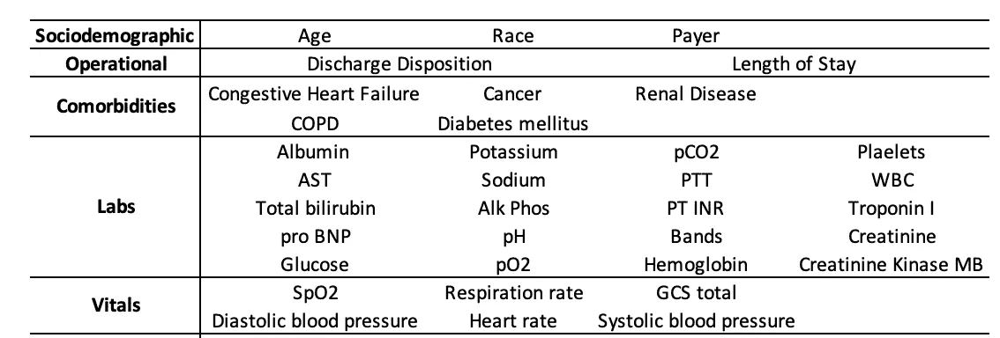

**表 1。**用于根据患者住院最后 48 小时内测量的生理和生命体征预测再入院风险的特征。

**纳入标准:**

1.  18 岁以上的患者
2.  患者首次入住 ICU 作为指标(对于多次住院的患者)

**排除标准:**

1.  死在医院的病人
2.  单位之间的转移

然后在以下步骤中使用上述纳入和排除标准创建队列:

**步骤 1:计算年龄，删除 18 岁以下的患者并创建再入院标志**

下面的 SQL 脚本从 ICU 中提取患者的首次出院日期，并使用该出院日期来估计首次出院日期和再次入住 ICU 之间的时间。每位患者的年龄计算为入住 ICU 的日期与出生年份之间的差值。当数据集中显示年龄为 300 时，请不要惊讶，这是由于在 MIMIC III 数据集中用 300 替换了所有大于 89 岁的年龄。

**步骤 2:使用四种最常见的共病风险因素，从上述 SQL 视图**中的每个患者中提取这些信息。

**第三步:提取表 1 中列出的所有时变实验室和生命体征。对于群组中的每个患者**

**第 4 步:实验室和患者在同一时间测量的平均实验室数**

# 方法

在预处理数据后，使用自动编码器首先创建特征的密集表示，给出它们的初始稀疏度。然后，自动编码器的输出用于拟合高斯混合模型(GMM ),这是一种概率模型，通过包括关于数据的协方差结构以及潜在高斯中心的信息，可以将其视为 k 均值的一般化版本。

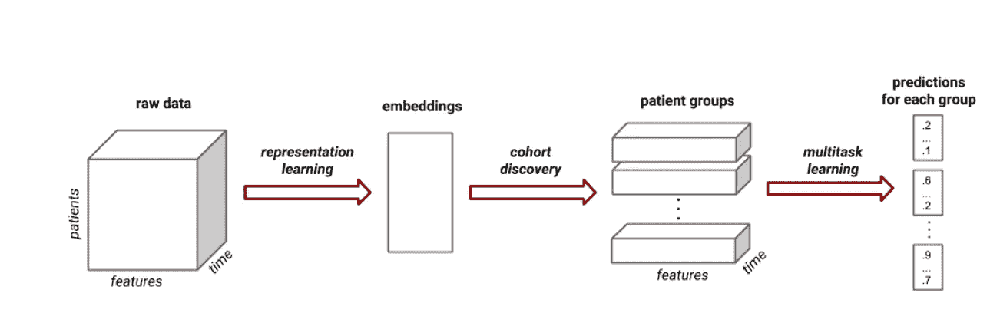

**图 1:** 展示如何在学习之前发现群组聚类的建模方法(13)

## 全球模型架构:

为了帮助利用随时间变化的变量来预测 30 天的再入院风险，在每个架构中都使用了 LSTM。在全局模型中(图 2。)，使用单个 LSTM 层对所有数据进行训练，创建一个全球基线，旨在展示“一刀切”模型的性能，而不是针对每个患者组使用单独的密集层。

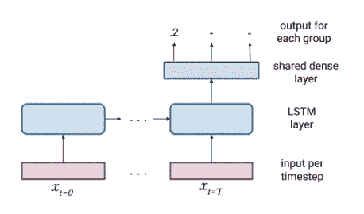

**图 2:** 全局多任务模型配置，在最后一个输出层(13)具有每个群组的单独参数

## 多任务模型架构:

与全局方法类似，该模型使用单一 LSTM 层，但是最终的密集层是特定于每个群组的。与使用不考虑差异的共享密集层相比，这为模型提供了学习仅存在于特定患者队列中的显著模式的机会。这个模型的架构可以在下面的图 3 中看到:

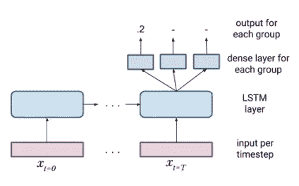

**图 3:** 单独的密集层多任务模型配置，在最后输出层(13)具有用于每个群组的单独参数

# 结果

## 有多少个集群(组件)？

使用由自动编码器创建的嵌入，创建了**赤池信息标准****【AIC】**或**贝叶斯信息标准****【BIC】**图，以确定最小化 AIC 和 BIC 的最佳分量(集群)数量。这些图的结果表明，5 个集群将是最好的。然而，集群规模越大，队列越小，我的实验使用 4 或 5 个具有高度不平衡数据集的集群，得到了只有阴性病例的同质集群。因此，为了建立一个具有一致流行率的有意义的队列，选择 3 个样本作为折衷。还需要注意的是，虽然 AIC 和 BIC 确实会产生负值，但决定所选模型是否最佳的不是 AIC 或 BIC 值的绝对大小，而是所考虑的一组模型的相对值(18)。​

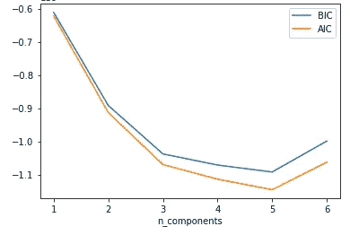

**图 4:** AIC 和 BIC 绘制了所选组件数量对 GMM 密度估计器性能的影响

## 可视化无人监管的患者集群:

**2D 聚类的 t 分布随机邻域嵌入表示**

下图(图。5)是由 GMM 模型预测的输出聚类的 t-SNE 表示。在这里，你可以看到集群重叠安静一点，这使得它很难得到一个更好的二维集群图片。因此，在图 6 中创建了 3D t-SNE 表示。

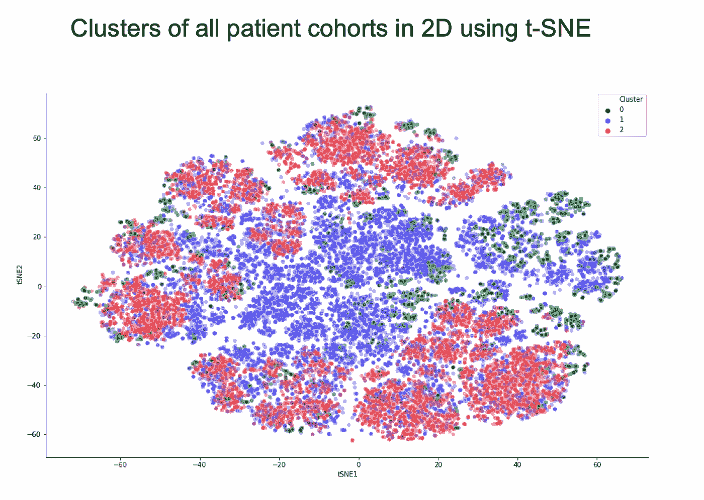

**图 5:**GMM 创建的患者队列的 2D t-SNE 图

## 三维团簇的 t-SNE 表示

为了有助于改善所创建的 4 个聚类的可视化，创建了嵌入的 t-SNE 表示。下图显示了 GMM 模型生成的聚类的散点图和聚类图。这里我们可以看到，绝大多数患者属于第 1 组，即包含大多数再入院的组，其次是第 2 组。我们可以看到，集群 1 和集群 2 似乎比集群 0 更密集地分布，而集群 0 似乎更分散([交互图](https://sparalic.github.io/readmission/index.html)，点击右上角的集群编号查看各个集群)。

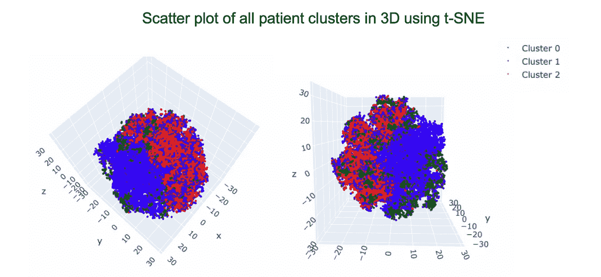

**图 6:** 使用 t-SNE 3D 表示的所有患者聚类的散点图。[互动剧情](https://sparalic.github.io/readmission/index.html)

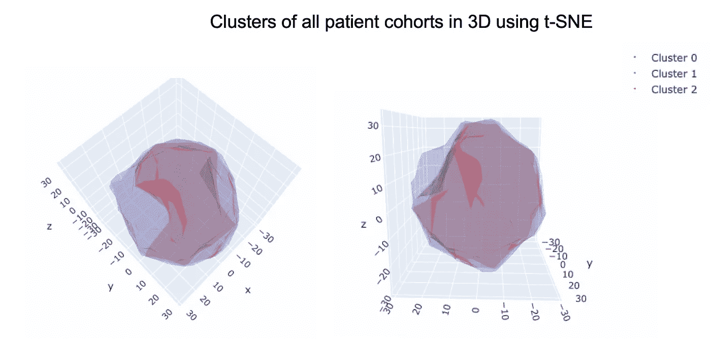

**图 7:** 患者群组聚类的 3D 表示

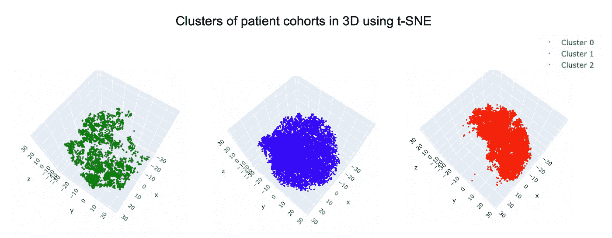

**图 8:** 每个患者群组的单个 3D 散点图，显示了每个组中患者的分布

## 按组群分列的再入院率

每个群组的患病率差异显著，从群组 0 的 5.6%、群组 1 的 13.04%到群组 2 的 10.27%不等。全局多任务模型在整个患者群组上进行训练，最终密集层共享每个患者群组的预测。

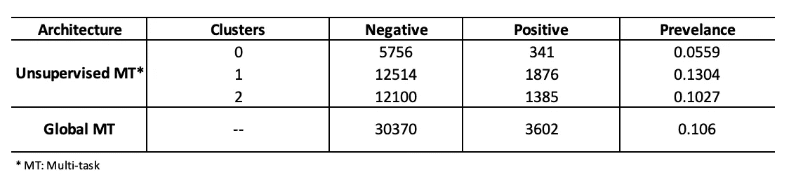

**表 2:** 过去 48 小时住院期间所有患者队列的患病率

## 按集群和再入院状态划分的患者特征

使用 GMM 模型生成的聚类，表 3 显示了每个患者队列分层的基线特征以及 33，972 例出院和 3602 例(10.6%)再入院的再入院状态。总体而言，30 天内再次入院的绝大多数患者属于第 1 组，59%的患者为男性，67.7%为白人，平均住院时间为 2.70 天，48.7%由医疗保险覆盖。由于年龄是离散的，所有组群中的大部分再入院发生在 51-70 岁年龄组，最初出院到专业护理机构(SNF)。患有充血性心力衰竭等疾病的患者也比数据集中的其他四种共病患者有更高的再入院率。

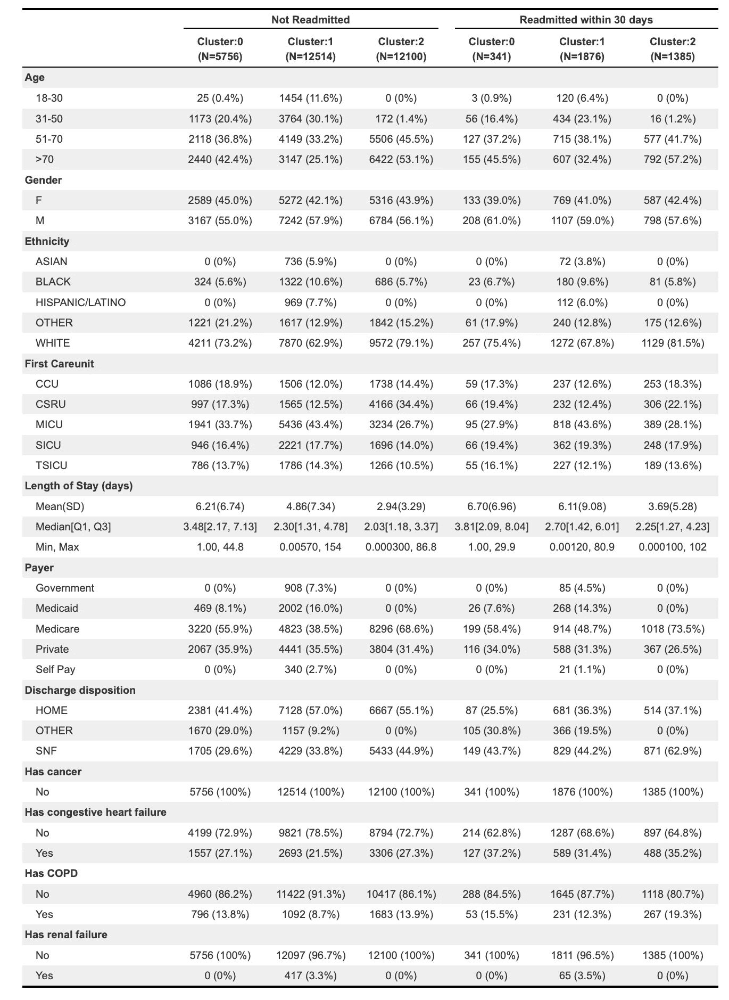

**表 3:** 按集群和 30 天再入院状态划分的患者队列的基线特征

## 无监督聚类的时变特征

## 重要器官

下面的热图显示了在患者住院的最后 48 小时内，实验室和生命体征特征的 z 分值的变化。生命体征的正值、负值或零值分别表示每种特征随时间的升高水平、降低水平或平均水平。在组 0 的情况下，其显示在过去 48 小时内血压和呼吸频率持续增加，而组 1 显示在出院前一天的早些时候 Glascow 昏迷评分增加。有趣的是，聚类 2 显示了相当多的缺失测量值，这是意料之中的，因为这些实验室中的许多在患者住院期间不会被捕获。

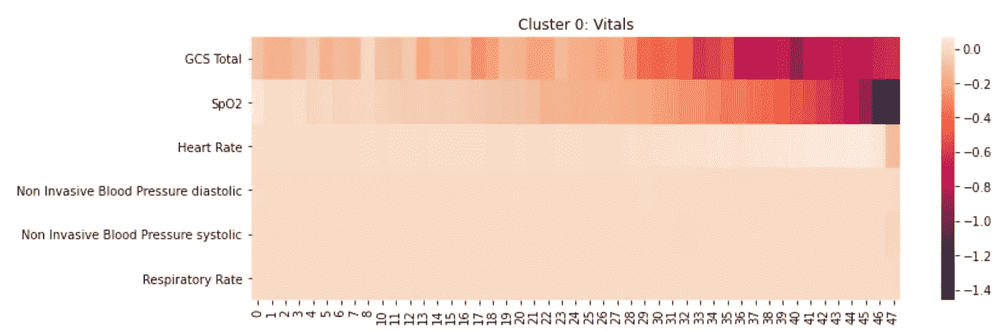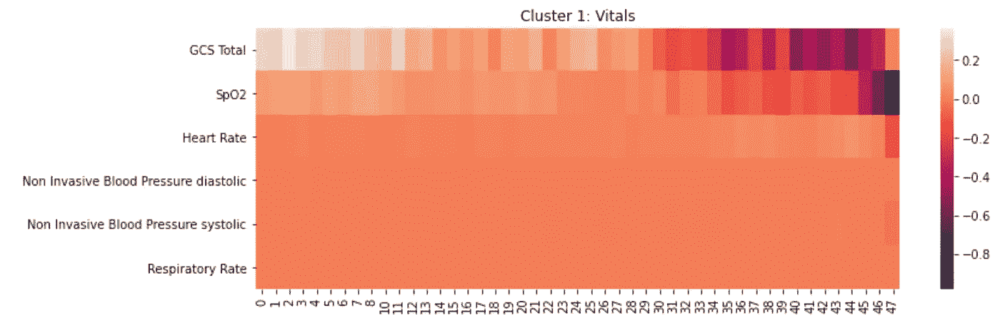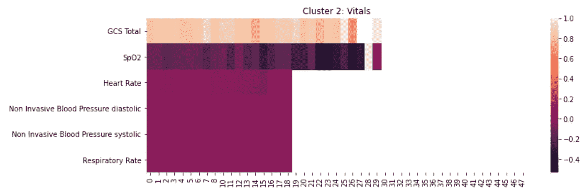

**图 9:** 出院前 48 小时的生命体征变化趋势

## 实验室

对于出院前 48 小时内的实验室测量；在大多数患者再次入院的第 1 组中，我们看到许多实验室在住院的最后 48 小时内仍大幅升高，除了白蛋白、血液 pH 和 pO2 仍相对低于平均水平。与实验室的生命体征热图一样，显示了在过去 48 小时内丢失实验室值的相同趋势，随着这些实验室的测量频率在入住 ICU 后降低，丢失的实验室值增加。

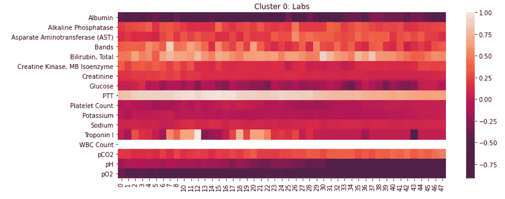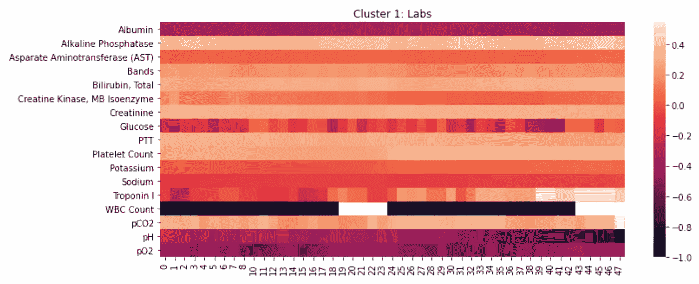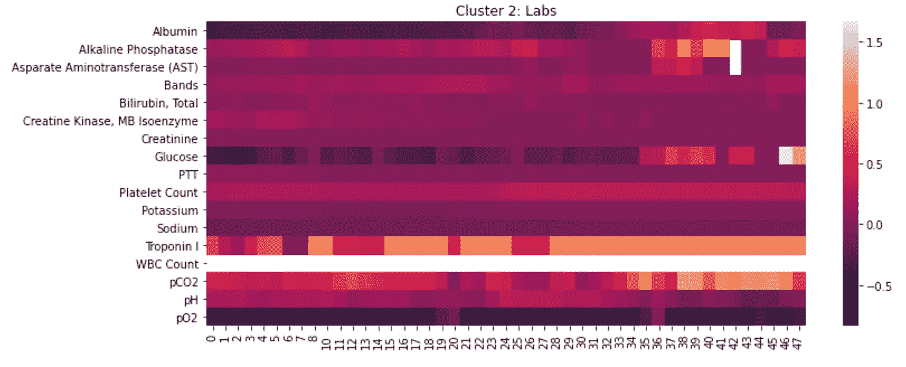

**图 10:** 出院前 48 小时的常规实验室变量趋势

## 模型结果

为了评估聚类是否在更好地预测患者风险方面发挥作用，向患者队列呈现了用于预测患者 30 天再入院风险的全局多任务模型和个体致密层多任务模型。结果如表 3 所示。虽然承诺要付出巨大的代价。虽然这些算法在预测负面案例方面表现出色，但在预测正面案例方面表现不佳。因此，下面的结果可能会产生误导，因为它们在很大程度上基于多数阶级。这可归因于几个因素。有了几个优化器、网络规模和学习率，而 PPV 没有改善，我认为这种情况的一个可能原因很可能是稀疏性和频率降低，其中许多常规生理数据是在接近出院时收集的，如图 9-10 所示。这导致了受缺失值严重影响的特性集的开发。然而，这种方法可以使用不同的特征工程方法。请注意，论文中提出的单一任务模式的表现也明显比作者在研究中经历的其他模式差，因此也没有包括在内。

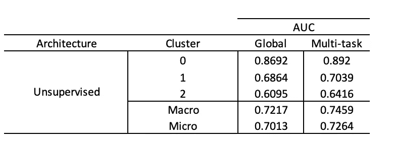

**表 4:** 使用全局和多任务模型的 30 天再入院任务的无监督建模方法结果。

# 结论/局限性

这个项目展示了如何在现实世界中实现个性化的想法。然而，需要对该方法进行调整，以确保所选择的特征为预测即将到来的结果提供有意义的结果。如果要在其他研究项目中使用这种方法，在重新审视本文中介绍的工作时，应该注意的一些发现包括:

1.  在将数据分成训练/测试/val 集之后执行 z 分数归一化，以避免信息从训练集泄漏到测试集中。
2.  使用这些实验室的正常值填充缺失的数据集，并为算法提供一个掩膜来识别缺失与伪化要素并创建更大的稀疏要素集。

# 未来方向

该出版物朝着个性化医疗保健的正确方向迈出了一步，通过一些改变，这种建模方法可以为特定亚人群提供一些有趣的见解，这些亚人群在构建健康相关模型时经常被忽略，因为在应用纳入和排除标准后可用的队列规模有限。然而，虽然这仅仅是探索建模方法的初步研究。随着进一步的研究，通过精心制作的特性和可能使用的更健壮的特性工程策略，可以进一步推动和发展这种方法。如果我们:

1.  试着进行平衡训练
2.  使用住院第一天和最后 24 小时内的异常值精心制作实验室特征
3.  用更简单的模型建立基线方法
4.  然后，尝试使用 Harutyunyan 等人在 2017 年提出的通道式 LSTM 方法，通过明确显示哪些变量缺失，以及允许模型在与每个聚类中的其他变量混合之前学习和存储与该特定变量相关的相关信息，来更好地解决缺失问题。
5.  尝试在提交给 LSTM 层之前嵌入患者数据，以帮助减少实验室的稀疏性。
6.  添加从临床记录中提取的特征，以提取以前的药物使用情况，并添加高风险药物，如:类固醇、麻醉药、抗胆碱能药(7)

[我的博客](https://sparalic.github.io/post/readmission-risk-final/)

[代码可在 GitHub 上获得](https://github.com/sparalic/30-day-Readmission)

## 致谢:

特别感谢 Eraldi Skendaj 的批判性阅读和提供反馈。

# 参考

1.  Bates，D. W .，Saria，s .，Ohno-Machado，l .，Shah，A. & Escobar，g,《医疗保健中的大数据:使用分析识别和管理高风险和高费用患者》。治愈。Aff。33, 1123–1131 (2014).
2.  [https://www . CMS . gov/Medicare/Medicare-Fee-for-Service-Payment/acuteinpatientps/read emissions-Reduction-Program](https://www.cms.gov/Medicare/Medicare-Fee-for-Service-Payment/AcuteInpatientPPS/Readmissions-Reduction-Program)
3.  Y.P. Tabak、X. Sun、C. M .、V. Gupta 和 R. S. Johannes，“使用电子临床数据预测早期住院再入院:早期再入院风险评分”，*医学关心*，2017 年第 55 卷第 3 期。
4.  H.Wang，Z. Cui，Y. Chen，M. Avidan，A. B. Abdallah 和 A. Kronzer，“通过成本敏感的深度学习预测医院再入院”，载于 *IEEE/ACM 计算生物学和生物信息学汇刊*，第 15 卷，第 6 期，第 1968–1978 页，2018 年 11 月 1 日至 12 月，doi:10.1109/tcbb . 2018 . 2018 . 28282897
5.  马克·d·银色啤酒杯乐队，秦焕英，s .奎·默瑟，方&齐亚德·海达尔(2008)年龄≥65 岁的患者 30 天再次住院的风险因素，贝勒大学医学中心论文集，21:4，363–372，DOI:10.1080/08999885896
6.  韦利博尔·米希奇、埃隆·加贝尔、伊拉·霍费尔、库马尔·拉贾拉姆、阿曼·马哈詹；术后急诊医院再入院的机器学习预测。*麻醉学*2020；132(5):968–980.https://doi.org/10.1097/ALN.0000000000003140。
7.  武尼基里、拉姆亚&格利克斯伯格、本杰明&约翰逊、基普&达德利、乔尔&苏布拉曼尼安、拉克什米纳拉亚南&卡德尔、沙梅尔。(2018).阿片类患者物质滥用易感性、死亡率和药物相互作用的预测模型。
8.  麦金太尔路，阿巴比 S，罗宾逊 EF，迈尔 RV。普通外科出院 30 天后患者再次入院的危险因素分析。JAMA Surg. 2016151(9):855‐861.doi:10.1001/jamasurg.2016.1258
9.  按 VG。是时候从确定 30 天慢性阻塞性肺疾病再住院的风险因素上继续前进了吗？呼唤风险预测工具。*安胸足球*。2018;15(7):801‐803.doi:10.1513/annalsats . 201804–246 ed
10.  M.J. Rothman 等人/生物医学信息学杂志 46(2013)837–848
11.  Ohnuma，d . Shinjo，a .*Brookhart 等人*与出院后 30 天内内科和外科重症监护病房幸存者非计划性再入院相关的预测因素。 *j 重症监护* **6、** 14 (2018)。[https://doi.org/10.1186/s40560-018-0284-x](https://doi.org/10.1186/s40560-018-0284-x)
12.  Hrayr Harutyunyan，Hrant Khachatrian，David C Kale 和 Aram Galstyan。2017.临床时间序列数据的多任务学习和基准测试。arXiv 预印本 arXiv:1703.07771 (2017)。
13.  Harini Suresh、Jen J Gong 和 John Guttag。多任务学习的学习任务:重症监护室中的异质性患者群体。arXiv 预印本 arXiv:1806.02878，2018
14.  Keenan PS，Normand SL，Lin Z，等:一种基于心力衰竭患者 30 天全因再入院率的适用于描述医院绩效的行政索赔指标。 *Circ 心血管质量结果*。2008;1:29–37
15.  Krumholz HM，Lin Z，Drye EE 等:一种基于急性心肌梗死患者 30 天全因再入院率的适用于描述医院绩效的行政索赔指标。 *Circ 心血管质量结果*。2011;4:243–252.
16.  Lindenauer PK，Normand SL，Drye EE，等。肺炎住院后 30 天再入院测量的发展、验证和结果。 *J 医院医疗*。2011;6:142–150.
17.  托马斯·巴古利。行为科学高级统计指南。帕尔格雷夫·麦克米伦出版社，2012 年。(第 402 页)
18.  [模型选择和多模型推理:一种实用的信息论方法](https://books.google.ca/books?id=fT1Iu-h6E-oC&printsec=frontcover#v=onepage&q&f=false) (Burnham 和 Anderson，2004)