# 预测酒店预订需求

> 原文：<https://towardsdatascience.com/predicting-a-hotel-booking-demand-7608a7dbf5a4?source=collection_archive---------20----------------------->

## 构建机器学习模型预测酒店预订需求。

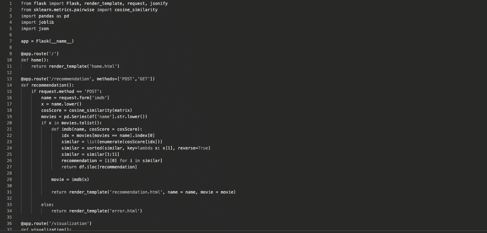

在本文中，我想写的是如何使用 Python 和 Jupyter Notebook 构建预测模型。我在这个实验中使用的数据是来自 [Kaggle](https://www.kaggle.com/jessemostipak/hotel-booking-demand) 的酒店预订需求数据集。

在本文中，我将只向您展示建模阶段，只有逻辑回归模型，但是您可以在我的 [Github](https://github.com/dimadnan/ujian_modul_3) 上访问完整的文档，包括数据清理、预处理和探索性数据分析。

事不宜迟，我们开始吧。

**导入库**

导入库

**加载数据集**

加载数据集

这是数据集的样子。

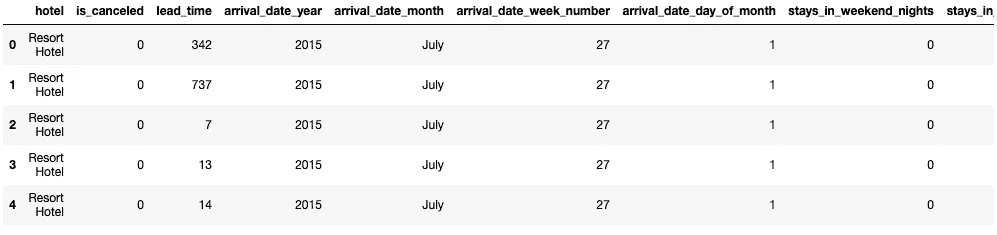

资料组

它有 32 栏，完整版是:

```
['hotel', 'is_canceled', 'lead_time', 'arrival_date_year',
       'arrival_date_month', 'arrival_date_week_number',
       'arrival_date_day_of_month', 'stays_in_weekend_nights',
       'stays_in_week_nights', 'adults', 'children', 'babies', 'meal',
       'country', 'market_segment', 'distribution_channel',
       'is_repeated_guest', 'previous_cancellations',
       'previous_bookings_not_canceled', 'reserved_room_type',
       'assigned_room_type', 'booking_changes', 'deposit_type', 'agent',
       'company', 'days_in_waiting_list', 'customer_type', 'adr',
       'required_car_parking_spaces', 'total_of_special_requests',
       'reservation_status', 'reservation_status_date']
```

根据我在笔记本上运行的信息，可以在三列中找到数据集中的 NaN 值，这三列是“**国家**”、“**代理商”、“T11”和“**公司”****

基于' **lead_time'** 列的' **lead_time'** 特性，我将' **country** 中的 NaN 值替换为 PRT(葡萄牙)，其中 PRT 是最常见的国家，lead_time = 118。

我试图替换基于**提前期**、**到达日期月**和**到达日期周数**的“**代理人**”特性上的 NaN 值，但是他们中的大多数都将“240”作为最常见的代理人。在我阅读了可以在互联网上找到的数据集的描述和解释后，作者将' **agent** '特性描述为“进行预订的旅行社的 ID”所以，那些在数据集中有“代理人”的人是唯一通过旅行社制作图书的人，而那些没有“代理人”或值为 Nan 的人是那些没有通过旅行社制作图书的人。因此，基于此，我认为最好用 0 填充 NaN 值，而不是用代理填充它们，这会使数据集不同于原始数据集。

最后但同样重要的是，我选择放弃整个“公司”特性，因为该特性中的 NaN 约占数据的 96%。如果我决定修改数据，可能会对数据产生巨大的影响，并且可能会改变整个数据，尤其是在公司特性中。

**分割数据集**

分割数据集

设置 x 和 y(目标)

我试图根据与目标最相关的前 5 个( **is_canceled** )来拆分数据集，它们是**required _ car _ parking _ spaces**'、 **lead_time** '、 **booking_changes** '、 **adr、**和 **is_canceled。**

训练和测试各占 80%和 20%。

**拟合模型**

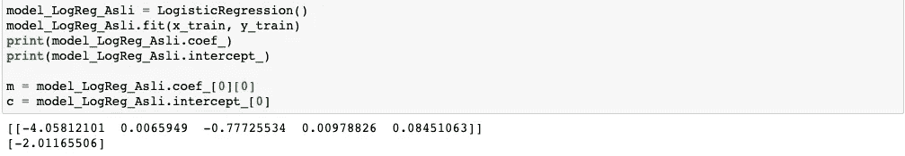

model_LogReg_Asli 是在使用超参数调优之前使用逻辑回归的原始模型，这里是模型预测。

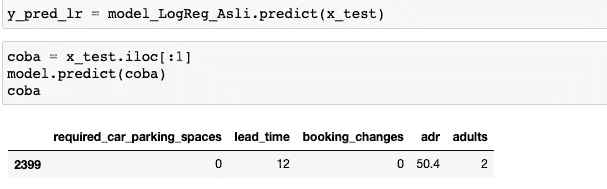

**车型性能**

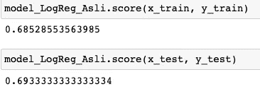

正如你在上面看到的，逻辑回归模型有大约 69.3%的准确率。

**模型参数**

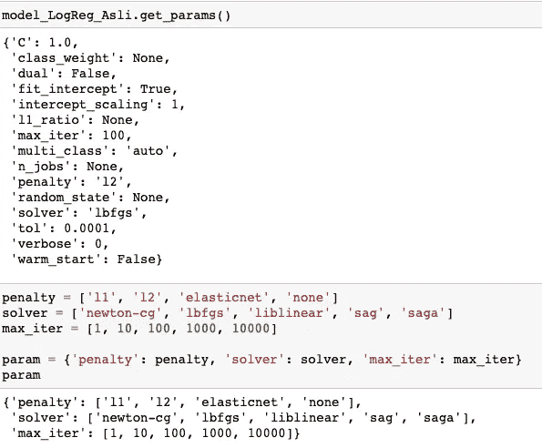

**带有随机搜索 CV 的逻辑回归**

model_LR_RS 是使用带有超参数调整(随机化)的逻辑回归的模型。

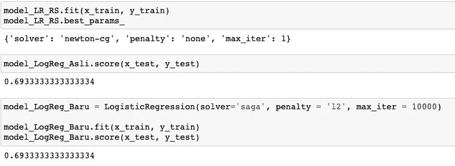

如上图所示，带有随机搜索 CV 的逻辑回归模型与没有随机搜索 CV 的逻辑回归模型具有完全相同的结果，即 69.3%。

**带网格搜索 CV 的逻辑回归**

model_LR2_GS 是使用带有超参数调整(网格搜索)的逻辑回归的模型。

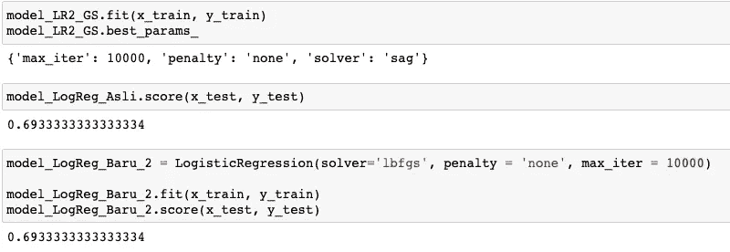

上图显示，具有网格搜索 CV 的逻辑回归模型具有完全相同的准确性，即 69.3%。

**评估模型**

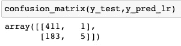

混淆矩阵

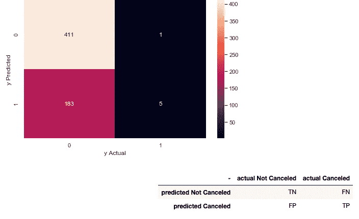

TN 为真阴性，FN 为假阴性，FP 为假阳性，TP 为真阳性，而 0 不取消，1 取消。下面是该型号的分类报告。

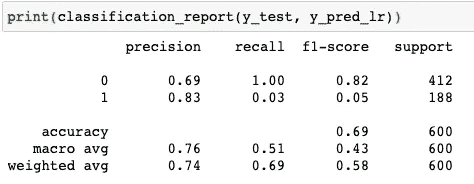

分类报告

在本文中，我再次使用逻辑回归进行测试，但是您可以使用其他类型的模型，如随机森林、决策树等等。在我的 Github 上，我也尝试了随机森林分类器，但是结果非常相似。

这就是本文的全部内容。谢谢你，祝你愉快。