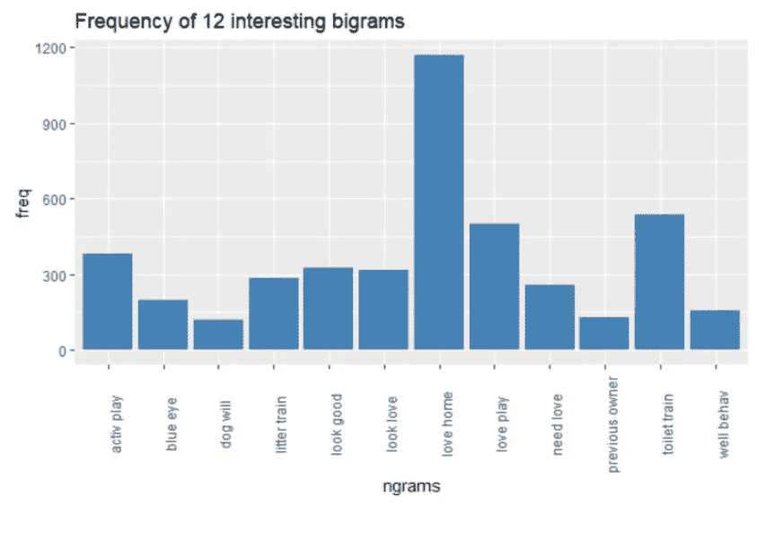
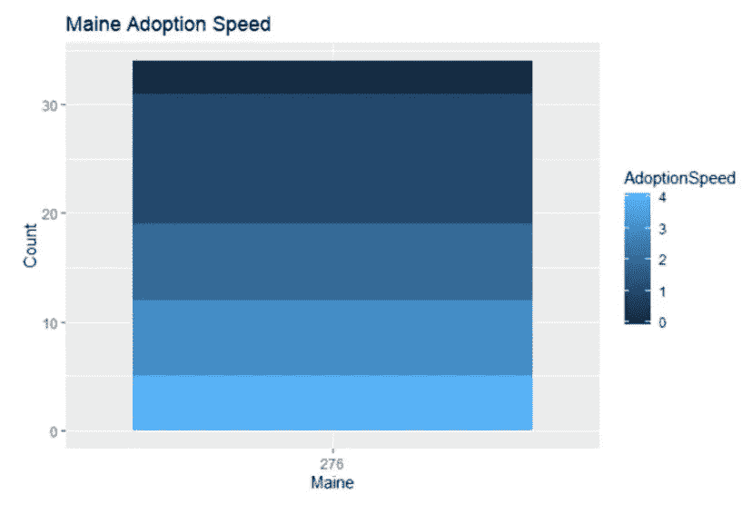
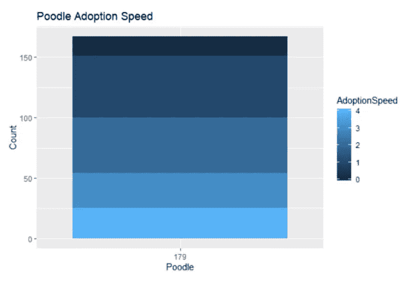
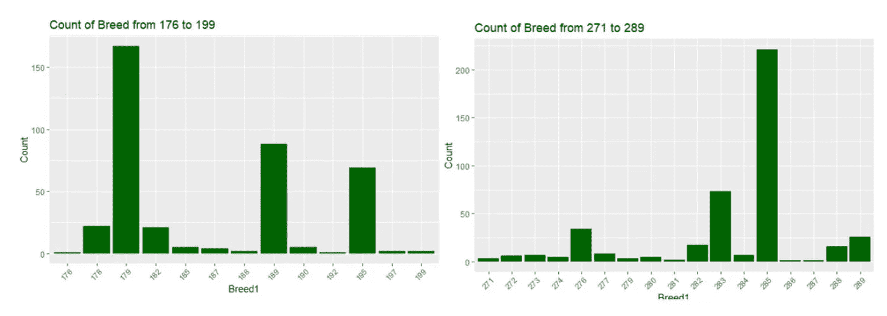
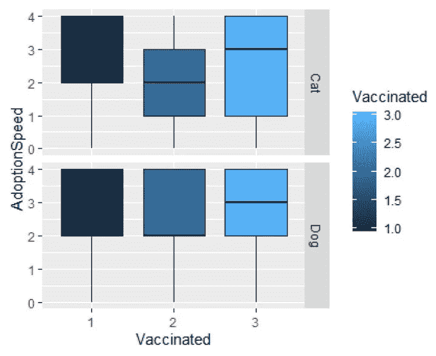
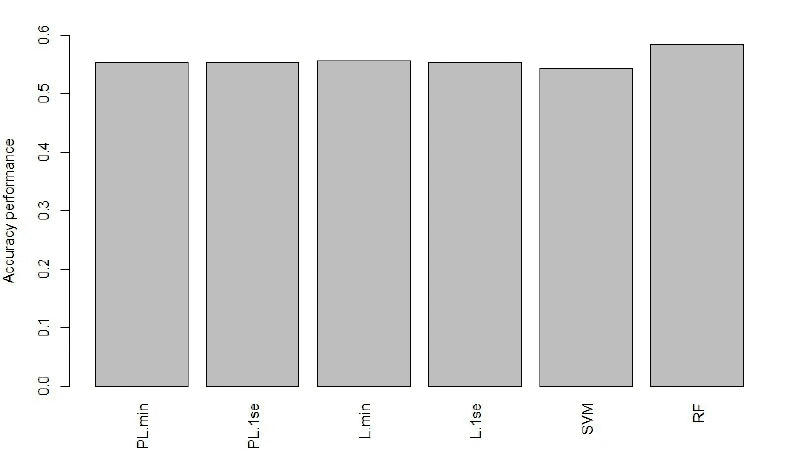

# 预测 PetFinder 的采用速度

> 原文：<https://towardsdatascience.com/predicting-adoption-speed-for-petfinder-bb4d5befb78c?source=collection_archive---------28----------------------->

我们的团队目前是一家咨询机构，代表 PetFinder 工作，pet finder 是一家非营利组织，包含一个动物数据库，旨在通过与相关方的合作来改善动物福利。这个项目的核心任务是预测一只宠物被收养需要多长时间。

# 商业理解

鸣谢:宠物发现者基金会

根据 pet finder 2018 年的财务报告，其获得的公共支持和获得的收入总额中约有 70%将用于其公共福利项目，包括这个动物收养项目。我们定义的业务问题是**“当新宠物进来时，新宠物被收养的估计时间是什么时候。”根据每只宠物的不同特征，我们可以根据我们创建的模型来估计宠物被收养需要多长时间。因此，通过采用我们的模型，该公司可以指导通过该渠道发布动物信息的收容所和救援人员估计新动物的采用速度。一旦很好地预测了宠物收养速度，就可以实施更有效的资源分配，以提高整体收养性能，并随后降低庇护和寄养的成本。最终 PetFinder 将获得更多的资金支持，为全球动物福利做出更大的贡献。**

# 数据准备

这个数据集最初由**14993 个观测值**和 **24 个变量**组成。所有数据都基于马来西亚地区，所以我们的分析是针对特定国家和文化的。我们删除了变量名，因为我们认为它与宠物的收养速度无关。出于同样的原因，除了 Name，我们还删除了 State、PetID 和 RescuerID。此外，一些列(如 Breed1 和 Type)被编码为数字，并提供了额外的参考电子表格。出于澄清的原因，我们将类型和性别转换为字符串:我们将“1”编码为“狗”，将“2”编码为“猫”；对于性别，我们将“1”编码为“男性”，“2”编码为“女性”，“3”编码为“混合型”。混合代表宠物的性别。我们还把分类变量变成了虚拟变量。此外，我们进行卡方检验来检验颜色 1、颜色 2 和颜色 3 之间的相关性，结果表明它们是相互依赖的。因此，我们计划保留颜色 1，删除其他两个。最后，考虑到只有 0.38%的记录具有 Breed2，为了简单起见，我们删除了 Breed2。

此外，考虑到数据集包含一个描述列，我们对该列应用了文本分析。根据分析，我们选择了 10 个最常出现的词，并根据这些热词创建了另外 10 个列。我们检查每只宠物的描述是否包含这 10 个单词。如果描述中有匹配的词，我们在该列下指定“1”。如果不匹配，我们指定“0”。这 10 个词是:爱，小猫，小狗，营救，健康，活跃，可爱，火车，母亲，善良。最后，我们都同意描述的长度可能也是一个重要的因素。由于描述越详细，领养者挑选宠物的时间就越少。从逻辑上讲，如果可用信息更丰富，采纳者往往会更快做出决定。因此，我们的最终数据集由**14993 条记录**和 **29 个变量**组成。

# 数据探索

# 文本分析

基于文本分析，我们首先创建了一个文本云来捕获描述列中最常见的单词。结果发现，“领养”出现的频率最高，其次是“小猫”、“小狗”和“可爱”等词。从单词 cloud 中，我们可以总结出数据集中这些宠物的主要特征。

接下来，我们创建二元模型来捕获文本中的更多模式。最常见的二元结构是“一个月前”，我们挑选了 10 个最有趣的词，并把它们绘制成柱状图。

从这两幅图中我们可以看出，救援人员和避难所在描述中倾向于使用很多描述性的词语，如积极、善良、可爱等。如上所述，为了测试这些词的有效性，我们挑选了 10 个热词，并将其转换为 10 个分类变量。我们没有选择二元模型的原因是二元模型是由词干组成的，所以软件可能很难在描述中检测到这些二元模型。

# 品种与采用速度

此外，从马来西亚最知名的宠物网站之一 [Perro Market 网站](https://perromart.com.my/blogs/perro-learning-center/popular-cat-breeds-in-malaysia)上，我们了解到了马来西亚最受欢迎的 10 个猫狗品种。出于数据探索的目的，我们选择缅因猫和波斯猫作为猫，狮子狗作为狗。

猫收养速度的平均值为 2.40，标准偏差为 1.21。相比之下，缅因州的平均采用速度为 1.97，波斯语的平均采用速度为 1.95。即使他们的平均值低于平均值，他们仍然在第一标准差范围内。基于这一事实，我们不能得出结论，流行的猫品种，如缅因州和波斯猫往往有较短的收养期比其他品种。

另一方面，狗的平均收养速度为 2.62，标准差为 1.14。值得注意的是，贵宾犬的平均认养速度为 1.97。同样，即使平均收养速度小于整个群体的平均速度，它仍然落在 1 个标准差范围内，所以我们不能得出结论，受欢迎的狗品种导致较短的收养期。

然而，从下面的图表中，我们发现热门品种的宠物数量远远高于其他品种。品种 179 是狮子狗，品种 285 是波斯狗，而品种 276 是缅因狗。

基于这一初步分析，我们的结论是，受欢迎的品种决定了该品种下的宠物数量，但不一定意味着较低的领养速度。

# 接种疫苗与收养速度

接种疫苗为“1”表示宠物接种疫苗，“2”表示宠物未接种疫苗，“3”表示不确定。与直觉相反，接种疫苗的宠物比没有接种疫苗的宠物显示出更高的时间跨度中值，而对于那些报告未知的宠物，它们有更高的时间跨度等待被收养。跨物种的领养速度和疫苗接种之间也没有明显的相关性(-0.06)。

# 建模

由于目标变量 AdoptionSpeed 是一个具有 4 个级别的分类变量，我们决定该项目的核心任务是分类:当一只新宠物进来时，模型将根据它被分类到哪个级别的采纳速度来确定它将被采纳多长时间。由于其多类的特点，我们选择了三种模型来实现目标，包括**随机森林**、 **SVM** 和**多项逻辑回归**。所有这三个模型都根据新动物提供的属性来预测新动物的采用速度，从而帮助解决我们的业务绩效问题。通过与公司分享我们的预测，公司可以对当前资源的分配有更好的计划，特别是将更多的资源分配给预测收养期较长的动物，以加快它们的收养速度。

# 随机森林

随机森林由大量单独的决策树组成，这些决策树作为一个整体运行。随机森林中的每棵树都给出一个类别预测，拥有最多票数的类别成为我们模型的预测。随机森林的一个优点是，在处理高度相关的变量时，它是去相关的。一个缺点是它限制了预测因子中可包含的分类变量的数量。在我们的项目中，我们排除了描述，因为在一个变量中有超过 14000 个级别，并且它已经分割成具有高频率和描述长度的单词。

# 支持向量机(SVM)

我们使用的另一个模型是支持向量机(SVM)模型，用于创建最佳超平面，以便在我们的测试数据集中对新记录进行分类。除了描述之外，我们包括来自清理过的训练数据集中的所有变量。通过将复杂数据转换为高维分析，SVM 很容易被用于解决多类分类问题，从而使类容易分离。该模型本身具有良好的计算特性，但它并不试图模拟概率。与随机森林相比，SVM 只能用于预测类别，而不能估计不同类别的概率。从这个角度来看，随机森林可以让我们更全面地了解测试数据集的类别预测。

# 套索和后套索多项式逻辑回归

我们也使用多项逻辑回归来预测我们的目标变量。然而，由于在多项逻辑回归中可以包含的变量数量的限制，我们使用 Lasso 来选择每一类采用速度的相关变量。基于最小λ和 1 个标准误差λ，我们建立了 4 个带有套索和后套索的多项式 logistic 回归模型。选择变量后，模型消除了过度拟合问题，并可能做出更好的预测。然而，Lasso 选择的变量在不同的自举模型中可能有所不同，它们很难被解释。

# 估价

为了评估每个模型的性能，我们进行了三重**交叉验证**，并选择了**混淆矩阵平衡准确度**作为我们的样本外准确度测量。根据上面的图表，我们所有的六种型号都具有相似的精度性能，范围从 0.5 到 0.6。随机森林达到了最高水平的 OOS 准确率为 59%。使用最小λ的套索多项式逻辑回归是第二高的，具有 56%的 OOS 准确度。考虑到 OOS 准确性是分类模型的一个重要指标，我们选择随机森林作为预测新宠物收养速度的最佳模型。为了研究特定的分类精度，我们进一步评估了随机森林和 SVM 的混淆矩阵，其中一个具有最高的 OOS 精度，另一个具有最低的精度。

从混淆矩阵中，我们可以得出结论，Random Forest 对宠物在 1 个月内实际被收养(AdoptionSpeed = 2)和上市 100 天后没有被收养(AdoptionSpeed = 4)的预测更准确。随机森林并没有显示出倾向于某一特定类别的趋势。相比之下，SVM 倾向于将宠物分为收养速度 2 级。

该模型的一个可能的限制是采用速度为 0 的数据点太少，因此很难评估其分类精度。另一方面，在随机森林的上述限制下，如果 PetFinder 增加了一个超过 100 个级别的新分类变量，则使用最小λ的多项 Lasso 逻辑回归而不是随机森林将是对新来宠物的采纳速度进行分类的更好选择。

当我们尝试将我们的模型应用到现实生活中的业务时，我们应该开发一个业务案例来确定预测是否准确，以及业务是否可以利用预测来优化其资源规划，从而提高采用性能。通过根据我们的预测模型分配资源，企业可以将以前的采用绩效与未来的采用绩效进行比较。收养绩效的提高可以通过同一时期内被收养动物数量的增加来证明。此外，企业应该分析预测收养时间长的动物是否可以在较短的时间内被收养，以查看资源分配的变化是否有效率。

# 部署

**通过评估每个模型的 OOS 精确度，我们得出结论，随机森林生成的 OOS 精确度最高，是 PetFinder 的最佳选择。**每当有新宠物进来，PetFinder 只需输入宠物的特征，就能预测它被收养需要多长时间。更准确地估计收养时间将使我们能够改善动物的状况，这对加快收养速度至关重要，并随后节省庇护成本。

为了更深入地了解哪些具体特征对需要更长时间才能被采用的宠物有重大影响，我们使用最小λ检验了通过多项逻辑回归和 Lasso 选择的变量。由于变量选择在数据的每个折叠中都不同，我们取 3 个折叠中变量选择的交集，发现在采用速度的四个级别中，**年龄、品种、上传的照片数量和上传的视频数量都很重要**。具体来说，对于领养速度较慢的宠物，人们更关注它们的健康状况:是否接种疫苗、驱虫、绝育。另外，描述的长度在收养速度较慢的宠物的简介中起着更重要的作用。如果宠物被归类为可能需要更长时间才能被收养，PetFinder 应该鼓励收容所优先考虑宠物的健康，并增加简介的描述长度。

一个重要的伦理考虑是，是否应该根据宠物的预测收养速度来区别对待它们。在没有预测模型的情况下，我们假设所有宠物都接受同等水平的治疗。然而，如果我们建议企业将更多资源分配给预测收养速度较低的动物，我们将导致资源分配不均。如果我们的预测不准确，一些宠物会受到负面影响，更不可能被收养。从这个角度来看，企业改善全球动物福利的目标可能无法完全实现。

**我们的模型的一个可能的风险是，我们目前对宠物的实际收养速度等级为 0 的预测不准确。**如果这些宠物被预测为 3 级或 4 级，企业将分配更多资源来推广它们，从而导致有限资源的浪费。为了降低风险，我们应该经常更新和改进我们的模型，因为我们有更多的记录，尤其是实际采用速度为 0 的记录。