# 预测里斯本 AirBnB 的价格:树木和随机森林

> 原文：<https://towardsdatascience.com/predicting-airbnb-prices-in-lisbon-trees-and-random-forests-336d19cdf5a2?source=collection_archive---------32----------------------->


安德烈亚斯·布吕克尔在 [Unsplash](https://unsplash.com/photos/8Nd3GY8z-iU?utm_source=unsplash&utm_medium=referral&utm_content=creditCopyText) 上的照片

在这篇小文章中，我们将快速启动一个预测模型，预测里斯本 AirBnB 的夜间价格。本指南希望通过使用真实数据和开发真实模型，为机器学习数据分析提供简单实用的介绍。

它还假设对 Python 和机器学习库 [scikit-learn](https://scikit-learn.org/stable/) 有基本的了解，并且是在运行 Python 3.6 和 sklearn 0.21 的 Jupyter 笔记本上编写的。数据集和笔记本都可以在我的 [Github 账户](https://github.com/josetapadas/airbnb-lisbon-model-trees)上获得，或者通过[谷歌的数据集搜索](https://datasetsearch.research.google.com/search?query=lisbon%20airbnb&docid=c6zMqHvIlOwEwlHEAAAAAA%3D%3D)获得。

# 1.数据探索和清理

作为第一步，我们从加载数据集开始。下载文件后，用 Pandas 打开并解析它是很简单的事情，并提供一个我们可以从中期待的快速列表:

```
Index(['room_id', 'survey_id', 'host_id', 'room_type', 'country', 'city', 'borough', 'neighborhood', 'reviews', 'overall_satisfaction', 'accommodates', 'bedrooms', 'bathrooms', 'price', 'minstay', 'name', 'last_modified', 'latitude', 'longitude', 'location'], dtype='object')
```

尽管我们可以确认数据集已被正确加载和解析，但对数据统计描述的快速分析可以让我们快速了解其本质:

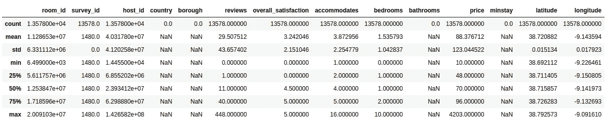

从这个表中，我们实际上可以推断出每个参数的基本统计观察值。因为我们的模型打算根据我们将提供给它的任何一组输入来预测价格，所以我们可以检查例如:

*   每晚价格的平均值约为 88 欧元
*   价格从最低 **10 欧元**到 **4203 欧元**不等
*   价格的标准偏差约为 **123 欧元**(!)

价格分布可以表示如下:

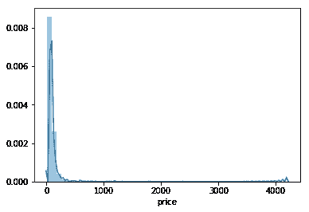

如我们所见，我们的价格分布集中在 **300 欧元**区间下，有一些条目对应 **4000 欧元**的值。绘制出大部分价格所在的位置:

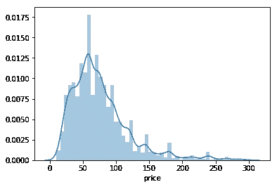

从上面的描述中我们可以清楚地看到，在里斯本住一晚的大部分价格在 0-150 欧元之间。

现在，让我们窥探一下实际数据集，以便了解我们将要处理的参数类型:

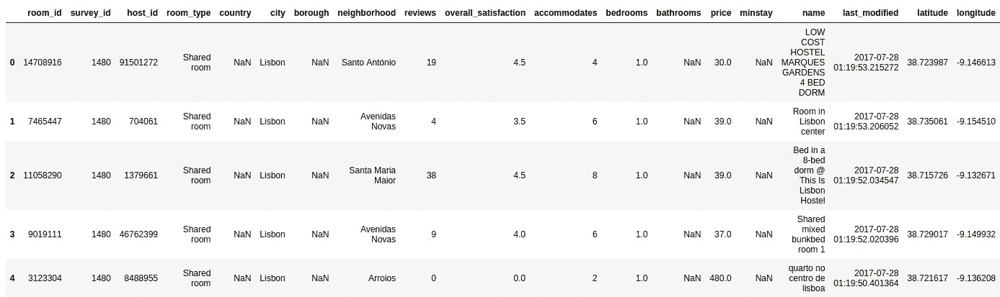

从上面的描述中，我们应该能够推断出一些关于数据性质的统计数据。除了分布参数集(我们现在不寻找)，我们清楚地确定了两组相关的见解:

*   有空列:`country`、`borough`、`bathrooms`、`minstay`
*   像`host_id`、`survey_id`、`room_id`、`name`、`city`、`last_modified`和`survey_id`这样的条目可能与我们的价格预测器不太相关
*   有一些分类数据，我们最初无法添加到价格回归中，例如`room_type`和`neighborhood`(但我们稍后会回到这两个数据)
*   `location`现在可能是多余的，因为我们既有`latitude`又有`longitude`，我们可能需要进一步推断该字段格式的性质

然后，让我们继续将数据集分为:

*   一个向量 **Y** 将包含数据集的所有真实价格
*   在矩阵 **X** 上，包含我们认为与我们的模型相关的所有特征

这可以通过下面的代码片段来实现:

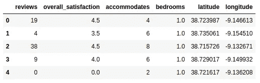

有了新的子集，我们现在可以尝试了解这些参数在最常见价格范围内的总体满意度方面的相关性:

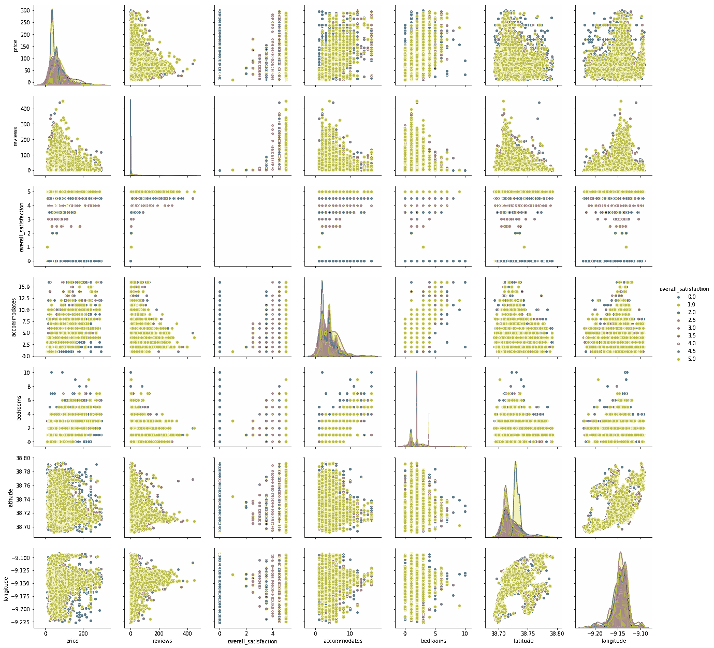

上述图表允许我们检查所有单个变量的分布，并试图推断它们之间的关系。我们可以根据我们选择的每个参数的审核值自由应用色调。上图中一些简单易懂的例子，来自可能表示正相关的关系:

*   对于住宿较少的房间，评论的数量更常见。这可能意味着大多数评论的客人都租了较小的房间。
*   大多数评论都是针对价格较低的房间的
*   考虑到黄色的视觉优势，大多数评论实际上是 5 分。要么这意味着大多数住宿实际上是非常令人满意的，或者最有可能的是，大量的人实际上审查，这样做是为了给 5 分的评级。

一个奇怪的观察是，位置严重影响价格和评级。绘制经度和纬度时，我们可以获得里斯本沿线评级的准地理/空间分布:

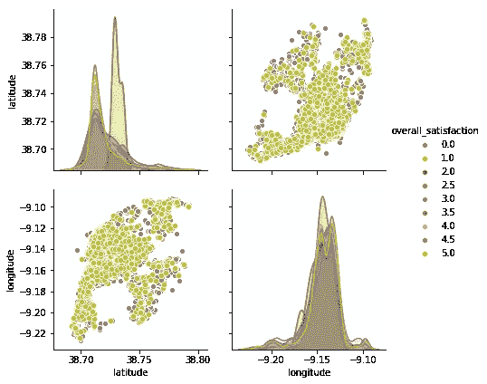

然后，我们可以将这些数据添加到里斯本的实际地图上，以检查分布情况:

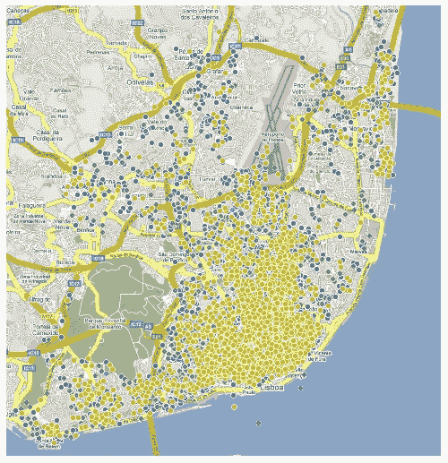

正如预期的那样，大多数评论都是关于市中心的，一些评论已经与最近的 Parque das Na es 相关。北部更多的次城区，尽管它有一些分散的地方，但评论没有中心那么高和普遍。

# 2.分割数据集

现在我们的数据集已被正确清除，我们将首先把它分成两部分:

*   将负责训练我们的模型的集合，因此称为**训练集合**
*   一个**验证集**，它将被用来验证我们的模型

这两个集合基本上都是 **X** 和 **Y** 的子集，包含租赁空间及其相应价格的子集。然后，在训练我们的模型之后，我们将使用验证集作为输入，然后推断我们的模型在归纳成除了用于训练的数据集之外的数据集方面有多好。当一个模型在训练集上表现很好，但不能很好地推广到其他数据时，我们说该模型对数据集**过度拟合**。

有关过度配合的更多信息，请参考[https://en.wikipedia.org/wiki/Overfitting](https://en.wikipedia.org/wiki/Overfitting)

为了避免我们的模型对测试数据的这种**过度拟合**，我们将使用 sklearn 的一个名为[https://sci kit-learn . org/stable/modules/generated/sk learn . model _ selection . train _ test _ split . html](https://scikit-learn.org/stable/modules/generated/sklearn.model_selection.train_test_split.html)的工具，该工具基本上将我们的数据分割成一系列随机的训练和测试子集:

```
Training set: Xt:(10183, 6) Yt:(10183,) 
Validation set: Xv:(3395, 6) Yv:(3395,) 
- 
Full dataset: X:(13578, 6) Y:(13578,)
```

现在我们已经有了数据集，我们现在可以继续创建一个简单的回归模型，根据我们选择的参数，尝试预测里斯本 AirBnb 的每夜费用。

# 3.种植决策树

作为最简单的监督 ML 模型之一，决策树通常用于通过从所有可用的特征数据中学习和推断决策规则来预测结果。通过获取我们的数据参数，这些树可以学习一系列有知识的“问题”,以便以某种方式划分我们的数据，我们可以使用得到的数据结构对分类数据进行分类，或者简单地为数值创建回归模型(就像我们对价格的情况一样)。

一个可视化的例子，取自维基百科，可以是围绕泰坦尼克号乘客生存预测的决策树:


基于这些数据，树建立在根上，并且将通过将每个节点分成两个子节点来(递归地)划分。这些生成的节点将根据我们向模型提供的统计数据推断出的决策进行拆分，直到我们达到数据拆分产生最大信息增益的点，这意味着我们可以根据我们迭代创建的类对所有样本进行正确分类。我们称之为“叶子”的末端顶点。

在上面的维基百科示例中，遵循决策过程是微不足道的，因为存活概率是这里的估计参数，所以我们可以很容易地获得当“他没有兄弟姐妹”时，“9.5 岁以上的男性”存活的概率。

(为了更深入地理解决策树是如何为回归构建的，我推荐由 [StatQuest 制作的名为决策树](https://statquest.org/2018/01/22/statquest-decision-trees/)的视频。

然后让我们通过利用 [sklearn 实现](https://scikit-learn.org/stable/modules/generated/sklearn.tree.DecisionTreeRegressor.html?highlight=decisiontreeregressor#sklearn.tree.DecisionTreeRegressor)来创建我们的决策树回归:

```
DecisionTreeRegressor(criterion='mse', max_depth=None, max_features=None, max_leaf_nodes=None, min_impurity_decrease=0.0, min_impurity_split=None, min_samples_leaf=1, min_samples_split=2, min_weight_fraction_leaf=0.0, presort=False, random_state=42, splitter='best')
```

为了便于说明，我们可以在下图中验证树是如何构建的:

请[在这里找到生成树的图形表示](https://github.com/josetapadas/airbnb-lisbon-model-trees/blob/master/output_24_0.png) @ Github。

我们还可以显示预测的片段，以及训练数据集样本的相应参数。所以对于以下住宿:

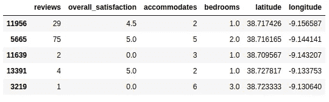

我们获得以下价格:

```
array([ 30., 81., 60., 30., 121.])
```

在将我们的模型拟合到训练数据之后，我们现在可以对验证集运行预测，并评估我们的模型的当前绝对误差，以评估当不针对它所测试的数据运行时它的概括程度。

为此，我们将使用**平均绝对误差** (MAE)度量。我们可以将这一指标视为预测集中的平均误差幅度。它可以这样表示:

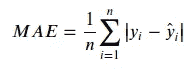

它基本上是我们的模型预测(y)和实际观测值( *y-hat* )之间差异的平均值，考虑到所有个体差异具有同等的权重。

然后，让我们使用 [Scikit Learn](https://scikit-learn.org/stable/modules/generated/sklearn.metrics.mean_absolute_error.html) 实现将这一指标应用于我们的模型:

```
42.91664212076583
```

这一结果基本上意味着，当暴露于测试数据时，我们的模型给出的绝对误差约为每间客房 **42.935 欧元**，而我们在初始数据探索期间收集的平均值为 **88.38 欧元**。

要么是因为我们的数据集太小，要么是因为我们的模型太天真，这个结果并不令人满意。

尽管这在这一点上看起来令人担忧，但总是建议尽快创建一个生成结果的模型，然后开始迭代优化。因此，现在让我们继续尝试改进我们模型的预测。

目前，我们确实为测试数据的过度拟合而痛苦。如果我们想象正在构建的决策树，由于我们没有为要分割的决策指定限制，因此我们将生成一个决策树，该决策树一直深入到测试特征，而不是在任何测试集上很好地概括。

由于 sklearn 的`DecisionTreeRegressor`允许我们指定叶节点的最大数量作为超参数，因此让我们快速尝试评估是否存在降低 MAE 的值:

```
(Size: 5, MAE: 42.6016036138866) 
(Size: 10, MAE: 40.951013502542885) 
(Size: 20, MAE: 40.00407688450048) 
(Size: 30, MAE: 39.6249335490541) 
(Size: 50, MAE: 39.038730827750555) 
(Size: 100, MAE: 37.72578309289501) 
(Size: 250, MAE: 36.82474862034445) 
(Size: 500, MAE: 37.58889602439078) 250
```

然后，让我们尝试生成我们的模型，但包括计算的最大树大小，然后用新的限制检查其预测:

```
36.82474862034445
```

因此，通过简单地调整我们的最大叶节点数超参数，我们就可以获得模型预测的显著增加。我们现在已经改进了我们模型的平均误差(`42.935 - 36.825` ) **~ 6.11 欧元**。

# 4.分类数据

如上所述，即使我们能够继续优化我们非常简单的模型，我们仍然放弃了两个可能的相关字段，它们可能(也可能不会)有助于我们模型的更好的泛化和参数化:`room_type`和`neighborhood`。

这些非数字数据字段通常被称为**分类数据**，通常我们可以通过三种方式接近它们:

**1)下降**

有时，处理分类数据最简单的方法是…将其从数据集中删除。我们这样做是为了快速建立我们的项目，但是我们必须一个案例一个案例地去推断这些字段的性质，以及它们是否有意义被删除。

这就是我们到目前为止分析过的场景，MAE 为:**36445**

**2)标签编码**

所以对于标签编码，我们假设每个值被分配给一个唯一的整数。我们还可以考虑任何可能与数据相关的顺序/数量级(例如，评级、浏览量等)来进行这种转换。让我们使用 sklearn 预处理器检查一个简单的示例:

```
array([3, 3, 1, 0, 2])
```

通过分配拟合数据的数组索引来评估`LabelEncoder`正在进行的转换是很简单的:

```
array(['double room', 'shared room', 'single room', 'suite'], dtype='<U11')
```

然后，让我们将这种预处理技术应用于分类数据，并验证这如何影响我们的模型预测。因此，我们的新数据集将是:

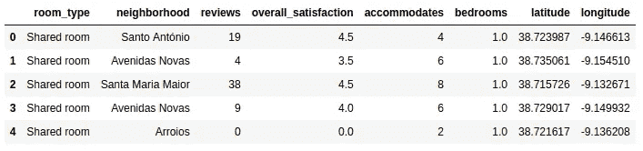

我们的分类数据在 panda 的数据帧上表示为一个`object`，可以通过以下方式提取:

```
['room_type', 'neighborhood']
```

现在我们有了列，接下来让我们在训练集和验证集上转换它们:

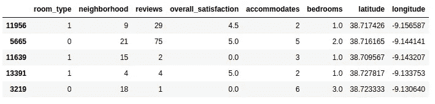

现在，让我们用转换后的数据来训练和拟合模型:

```
35.690195084932355
```

然后，我们改进了我们的预测器，对我们的分类数据进行编码，将我们的 MAE 降低到 **~ 35.69 欧元**。

**3)一键编码**

一次性编码不是枚举字段的可能值，而是创建新的列来指示编码值是否存在。让我们用一个小例子来展示这一点:

```
array([[0., 0., 0., 1., 0., 0., 1.], [0., 1., 0., 0., 0., 1., 0.]])
```

从上面的结果我们可以看到，二进制编码在每个特性数组实际启用的特性上提供了`1`，在不存在时提供了`0`。然后，让我们尝试在我们的模型上使用这种预处理:

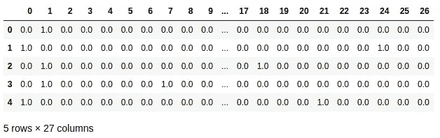

所以上面的结果乍一看可能很奇怪，但是对于 26 个可能的类别，我们现在有一个二进制编码来检查它的存在。我们现在将:

*   添加回转换过程中丢失的原始行索引
*   从原始集合`train_X`和`validation_X`中删除原始分类列
*   用包含所有 26 个可能类别的新数据框架替换删除的列

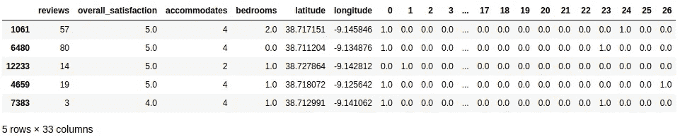

现在，我们可以继续在模型中使用新的编码集:

```
36.97010930367817
```

通过对我们的分类数据使用一个热编码，我们获得了 MAE to ~ **36.97EUR** 。

这个结果可以证明，当与标签编码相比较时，对于我们的分类参数以及同时对于这两个参数来说，一键编码不是最佳的。然而，这个结果仍然允许我们将分类参数包括在初始 MAE 的减少中。

# 5.随机森林

从上一节我们可以看到，使用决策树，我们总是在以下两者之间保持平衡:

*   一棵有很多叶子的深树，在我们的例子中，每片叶子上只有很少的 AirBnB 位置，对我们的测试集来说太多了(它们呈现了我们所说的**高方差**
*   一棵浅树，叶子很少，无法区分一个项目的各种特征

我们可以将“随机森林”想象为决策树的集合，为了试图减少上述差异，决策树以允许算法以减少误差的方式选择剩余树的方式生成树。如何创建随机森林的一些示例如下:

*   用不同的数据子集生成树。例如，根据上面分析的我们的参数集，将生成仅具有它们的随机集的树(例如，仅具有“评论”和“卧室”的决策树，另一个具有除“纬度”之外的所有参数
*   通过对不同的数据样本进行训练来生成其他树(不同的大小，训练和验证数据集之间的不同划分等等)

为了减少方差，增加的随机性使得生成的单个树的误差不太可能相关。然后，通过组合不同的决策树预测，从所有预测的平均值中提取预测，这具有甚至消除一些错误的有趣效果，从而降低整个预测的方差。

更深入地解释该算法的原始出版物可以在本文末尾的参考书目部分找到。

然后，让我们使用随机森林来实现我们的预测器:

```
33.9996500736377
```

我们可以看到，当使用随机森林时，我们的 MAE 显著降低。

# 6.摘要

尽管决策树是机器学习中非常简单(可能是最简单)的回归技术，我们可以在我们的模型中使用，但我们希望演示一个分析数据集以生成预测的样本过程。很明显，通过小的优化步骤(如清理数据、对分类数据进行编码)和将单棵树抽象为随机森林，我们可以显著降低模型预测的平均绝对误差。

我们希望这个例子作为机器学习的实践经验变得有用，如果我可以澄清或纠正上面演示的一些内容，请不要联系我。在未来的一些文章中，我们还计划使用其他方法和工具进一步优化我们对这个特定数据集的预测，敬请关注:)

# 7.进一步阅读

请在下面找到一些资源，它们对于理解一些公开的概念非常有用:

*   StatQuest，决策树:[https://statquest.org/2018/01/22/statquest-decision-trees/](https://statquest.org/2018/01/22/statquest-decision-trees/)
*   偏差-方差权衡:[https://en . Wikipedia . org/wiki/Bias % E2 % 80% 93 方差 _ 权衡](https://en.wikipedia.org/wiki/Bias%E2%80%93variance_tradeoff)
*   布雷曼，随机森林，机器学习，45(1)，5–32，2001:[https://www . stat . Berkeley . edu/users/布雷曼/randomforest2001.pdf](https://www.stat.berkeley.edu/users/breiman/randomforest2001.pdf)

*欢迎随时联系我@*[*https://Jose . tapadas . eu*](https://jose.tapadas.eu)