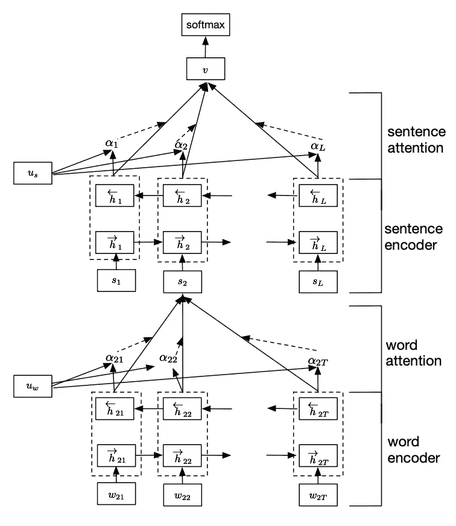
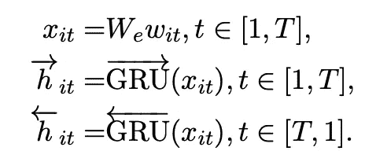
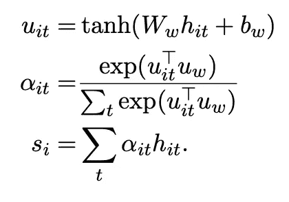
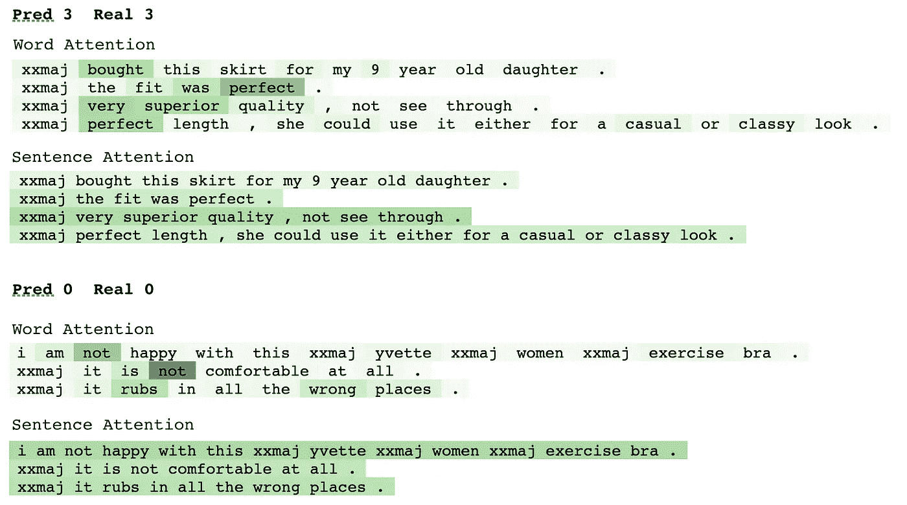
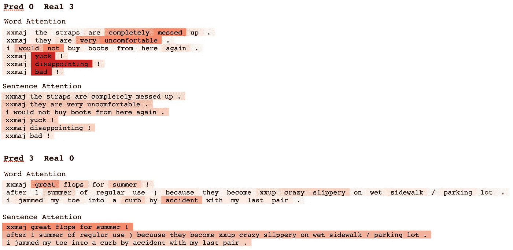

# 使用 PyTorch 和 Apache Mxnet 的分层注意力网络预测亚马逊评论分数

> 原文：<https://towardsdatascience.com/predicting-amazon-reviews-scores-using-hierarchical-attention-networks-with-pytorch-and-apache-5214edb3df20?source=collection_archive---------19----------------------->


这篇文章和这里的代码是一个更大的回购的一部分，我有(非常创造性地)称为[“NLP-stuff”](https://github.com/jrzaurin/nlp-stuff)。顾名思义，我在回购项目中包括我所做的项目和/或我的想法——只要有与这些想法相关的代码——都与 NLP 相关。在每个目录中，我都包含了一个 README 文件和一系列解释笔记本，我希望它们有助于解释代码。我打算在 2020 年继续添加项目，不一定是最新和/或最流行的版本，而只是我觉得有趣和有用的论文或算法。特别是这篇帖子相关的代码在目录[Amazon _ reviews _ class ification _ HAN](https://github.com/jrzaurin/nlp-stuff/tree/master/amazon_reviews_classification_HAN)。

首先，让我们从感谢那些努力工作的相关人员开始。本帖及配套回购基于论文“*用于文档分类的分层注意网络*”([杨子超等，2016](https://www.cs.cmu.edu/~./hovy/papers/16HLT-hierarchical-attention-networks.pdf) )。此外，在我的实现中，我还使用了“*正则化和优化 LSTM 语言模型*”中的结果和代码( [Stephen Merity，Nitish Shirish Keskar 和 Richard Socher，2017](https://arxiv.org/pdf/1708.02182.pdf) )。我在回购中用于此实验和其他实验的数据集是[亚马逊产品数据](http://jmcauley.ucsd.edu/data/amazon/) ( [J. McAuley 等人，2015](https://arxiv.org/pdf/1506.04757.pdf) 和 [R. He，J. McAuley 2016](https://cseweb.ucsd.edu/~jmcauley/pdfs/www16a.pdf) )，特别是服装、鞋子和珠宝数据集。我强烈建议看一看这些论文和其中的参考资料。

# 1.网络架构

完成后，让我们从描述我们将在此实施的网络体系结构开始。下图是`Figure 2`杨子超等人的论文。



图 1(他们论文中的图 2)。分层注意网络

我们考虑一个由 *L* 个句子*s*t5】ᵢ组成的文档，每个句子包含*t*t11】ᵢt13】个单词。 *w_it* 带 T∈【1，T】，代表第 *i 个*句中的词。如图所示，作者使用了一个单词编码器(一个双向 GRU， [Bahdanau 等人，2014](https://arxiv.org/abs/1409.0473) )，以及一个单词注意机制，将每个句子编码成一个向量表示。这些句子表示通过具有句子注意机制的句子编码器，产生文档向量表示。该最终表示被传递给具有相应激活函数的全连接层以进行预测。单词“*层次化*在这里指的是首先从单词编码句子，然后从句子编码文档的过程，自然遵循文档中的“*语义层次化*”。

**1.1 注意机制**

假设一个人熟悉 GRU 公式(如果不是看这里的)，所有理解注意力机制所需的数学都包括在下面。我在这里包括的数学表达式指的是注意机制这个词。句子注意机制*相同*，但在句子层面。因此，我相信解释下面的表达式，以及下面的代码片段，将足以理解整个过程。前三个表达式非常标准:



方程组 1(直接从论文中提取):GRU 输出

其中 *x_it* 是单词 *t* 在句子 *i.* 中的单词嵌入向量，向量***h****_ it*是来自双向 GRU 的前向和后向输出特征，它们在应用关注之前被连接。注意机制的公式如下:



方程组 2(直接从论文中摘录):**字注意。句子注意**与**相同**，但在句子级别**。**

首先， *h_it* 特征通过一个带有双曲正切函数的单层 MLP。这导致了一个隐藏的表示 *h_it，u_it。*然后，将每个单词的重要性度量为 *u_it* 与上下文向量 *u_w* 的点积，得到所谓的*归一化重要性权重* *α_it* 。之后，基于归一化的重要性权重，计算句子向量 s ***ᵢ*** 作为 *h_it* 特征的加权和。更多详情，请阅读论文第 2.2 节"*等级*注意*"如前所述，句子注意机制是相同的，但在句子层面。*

单词和句子的注意力可以编码为:

Pytorch:

片段 1。Pytorch 的单词和句子注意机制

Mxnet:

片段 2。Mxnet 的单词和句子注意机制。

其中`inp`指 *h_it* 和 *h_i* 分别为单词和句子注意。

可以看出，Mxnet 的实现与 Pytorch 中的几乎相同，尽管有一些细微的差别。这将是贯穿整个韩实施的情况。不过我想补充几行澄清一下:这是我第二次“*认真*”潜入 Mxnet 和胶子。我用得越多，我就越喜欢它，但是我很确定我可以写出更好、更有效的代码。记住这一点，如果你，读者，是一个 Mxnet 用户，并有建议和意见，我很乐意听到他们。

**1.1.1 字编码器+字注意**

一旦我们有了`AttentionWithContext`类，编码`WordAttnNet`(单词编码器+单词注意力)就简单了。下面的代码片段是[回购](https://github.com/jrzaurin/nlp-stuff/blob/master/amazon_reviews_classification_HAN/models/pytorch_models.py)的简化版本，但包含了主要组件。完整版请看回购中的代码。

Pytorch

代码片段 3:单词编码器+单词注意力模块(又名单词注意力网络)的 Pytorch 实现

Mxnet

代码片段 3:单词编码器+单词注意力模块(又名单词注意力网络)的 Mxnet 实现

您将注意到 3 个与信号丢失相关的参数:`embed_drop`、`weight_drop`和`locked_drop`。我将在第 2 节中详细描述它们。目前，让我们忽略它们，将注意力集中在模块的其余组件上。

简单地说，输入令牌(`X`)通过嵌入查找表(`word_embed`)。得到的令牌嵌入通过双向 GRU ( `rnn`)和 GRU 的输出到达`AttentionWithContext` ( `word_attn`)，后者将返回重要性权重(α)、句子表示( *s* )和隐藏状态 *h_n* 。

注意，返回隐藏状态是必要的，因为文档(这里是 amazon 评论)由一系列句子组成。因此，句子 *i+1* 的初始隐藏状态将是句子 *i* 的最后隐藏状态。我们可以说，我们将把文档本身视为“*有状态的*”。我将在稍后的文章中回到这个话题。

**1.1.2 句子编码器+句子注意**

假设我们不需要句子编码器的嵌入查找表，`SentAttnNet`(句子编码器+句子注意)简单来说就是:

Pytorch

代码片段 5:句子编码器+句子注意模块(又名句子注意网络)的 Pytorch 实现

Mxnet

代码片段 6:句子编码器+句子注意模块(又名句子注意网络)的 Mxnet 实现

这里，网络将接收`WordAttnNet` ( `X`)的输出，该输出然后将通过双向 GRU ( `rnn`)，然后通过`AttentionWithContext` ( `sent_attn`)。

至此，我们拥有了编码 HAN 的所有构件。

**1.1.3 分层注意网络(HANs)**

Pytorch

代码片段 7: Pytorch 实现的分层注意力网络(HAN)

Mxnet

代码片段 8:分层注意力网络(HAN)的 Mxnet 实现

我认为在这里用一些与张量在网络中导航时的维数相关的数字来说明网络中的数据流可能是有用的。让我们假设我们使用批量大小(`bsz`)为 32，令牌嵌入为 dim ( `embed_dim` ) 100，GRUs 为隐藏大小(`hidden_dim` ) 64。

在`X`之前的片段中对`HierAttnNet`的输入是 dim `(bzs, maxlen_doc, maxlen_sent)`的张量，其中`maxlen_doc`和`maxlen_sent`是每个文档的最大句子数和每个句子的最大字数。我们假设这些数字是 5 和 20。所以，`X`在这里是 dim `(32, 5, 20)`的张量。

我们做的第一件事是改变坐标轴，得到一个 dim `(5, 32, 20)`的张量。这是因为我们将以“*有状态*”的方式，一次处理一个句子，将一个句子的最后一个隐藏状态作为下一个句子的初始隐藏状态。这将发生在向前传球的循环中。

在这个循环中，我们将一次处理一个句子，也就是说，一个 dim `(32, 20)`的张量包含批处理中所有 32 个评论的第*个到第*个句子。然后将这个张量传递给`wordattnnet`，简单来说就是前面所说的单词编码器+单词注意力。在那里，它将首先通过嵌入层，产生一个 dim 张量`(32, 20, 100)`。然后通过双向 GRU，产生 dim 张量`(32, 20, 128)`，最后通过注意机制，产生 dim 张量`(32, 1, 128)`。这最后一个张量是杨子超等人论文中方程 7 中的*，对应于*第 I 个*句子的向量表示。*

*运行该循环后，我们将得到沿第二维连接的 dim `(32, 1, 128)`的`maxlen_doc`(即 5 个)张量，从而得到 dim `(32, 5, 128)` → `(bsz, maxlen_doc, hidden_dim*2)`的张量。这个张量再经过`sentattnnet`，就是前面说的简单的句子编码器+句子注意。在那里，它将首先通过双向 GRU，产生一个 dim 张量`(32, 5, 128)`，最后通过注意力机制，产生一个 dim 张量`(32, 128)`。这最后一个张量将是他们论文中方程 10 中的 ***v*** 。*

*最后*、*、**、 *v* 、**然后通过全连接层和 Softmax 函数进行预测。*

# ***2。嵌入、锁定和重量损失***

*当我开始运行实验时，我注意到模型在训练过程中过早地过度拟合。最佳验证损失和准确性发生在最初的几个时期内，或者甚至在第一个时期之后。出现过度拟合时，有多种选择:*

*   ***降低模型复杂性:**我通过运行一些具有少量嵌入和/或隐藏大小的模型来探索这一点。*
*   ***提前停止**:通常通过`early_stop`功能使用。*
*   ***附加正则化，**如剔除、标签平滑( [Christian Szegedy 等人，2015 年](https://arxiv.org/pdf/1512.00567.pdf))或数据增强。我写“附加”是因为我已经使用了重量衰减。*

*在本练习中，我没有探讨标签平滑或数据扩充。如果你想更深入地了解如何在 Pytorch 中实现标签平滑，看看这个 [repo](https://github.com/eladhoffer/utils.pytorch/blob/master/cross_entropy.py) 。在 Mxnet 的情况下，gluonnlp API 有自己的 [LabelSmoothing 类](https://gluon-nlp.mxnet.io/api/modules/loss.html)。*

*关于数据扩充，事实是我还没有尝试过，也许我应该尝试一下。不仅因为它通常会在模型泛化方面带来显著的改进，而且因为我已经从另一个[实验](https://github.com/jrzaurin/nlp-stuff/tree/master/amazon_reviews_classification_with_EDA)中获得了大部分代码，在那里我实现了 *EDA:用于提高文本分类任务性能的简单数据增强技术* ( [Jason Wei 和邹凯 2019](https://arxiv.org/pdf/1901.11196.pdf) )。然而，一个人必须在某个地方停下来，我决定专注于探索不同的辍学机制。*

*我在这里使用的 3 种不同形式的辍学是:嵌入辍学，锁定辍学和重量辍学。我使用的代码**直接取自**AWD-LTSM 协议( [Merity，hirish Keskar and Socher，2017](https://arxiv.org/pdf/1708.02182.pdf) )实施对应的 salesforce [回购](https://github.com/salesforce/awd-lstm-lm/tree/32fcb42562aeb5c7e6c9dec3f2a3baaaf68a5cb5)。在这一节中，我将重点讨论 Pytorch 的实现，但是我也将包括关于 Mxnet 实现的信息。请注意，这些退出机制最初是在语言模型的环境中考虑和实现的。然而，没有理由为什么它们不应该在这里工作(或者至少没有理由为什么我们不应该尝试它们)。*

***2.1 嵌入脱落***

*这将在第 4.3 节中详细讨论。基于 [Gal & Ghahramani (2016)](https://arxiv.org/abs/1512.05287) 的工作。没有人比作者自己更好地解释它了。用他们自己的话说:*“这相当于在单词级别上对嵌入矩阵执行丢弃，其中丢弃在所有单词向量的嵌入中传播。[……]"**

*代码*(以下代码是原* [*回购*](https://github.com/salesforce/awd-lstm-lm/blob/master/embed_regularize.py) *)中的简化版本*:*

*嵌入丢失的简化(即不完整)实现。来自 Merity，Shirish Keskar 和 Socher 2017: *规范和优化 LSTM 语言模型**

*基本上，我们沿着嵌入张量的第一维(“*单词*维)创建 0 和 1 的掩码，然后我们沿着第二维(“*嵌入*维)扩展该掩码，相应地缩放剩余的权重。正如作者所说，我们放弃文字。*

***2.2 锁定脱落***

*这也是基于[Gal&Ghahramani(2016)](https://arxiv.org/abs/1512.05287)的工作。再次用作者的话来说:“[…] *在第一次调用时只对二进制丢失掩码进行一次采样，然后对正向和反向传递*中的所有重复连接重复使用锁定的丢失掩码”。*

*在代码中:*

*锁定辍学的实现。来自 Merity，Shirish Keskar 和 Socher 2017: *规范和优化 LSTM 语言模型**

*简单地说，`LockedDropout`将接收一个三维张量，然后它将沿第二维生成一个掩码，并沿第一维扩展该掩码。例如，当应用于像`(batch_size, seq_length, embed_dim)`这样的张量时，它将创建一个模糊`(1, seq_length, embed_dim)`的遮罩，并将其应用于整批。Mxnet 的`nn.Dropout`模块有一个`axes`参数，直接实现这种类型的退出。*

*最后…*

***2.3。重量下降***

*这在他们论文的第二部分讨论。再一次，用他们自己的话说:*“我们建议在递归隐藏到隐藏权重矩阵上使用 DropConnect (* [*万等人，2013**)，这不需要对公式进行任何修改。”*](http://yann.lecun.com/exdb/publis/pdf/wan-icml-13.pdf)*

*代码*(以下代码是原* [*回购*](https://github.com/salesforce/awd-lstm-lm/blob/master/embed_regularize.py) *)中的简化版本*:*

*重量下降的简化(即不完整)实现。来自 Merity，Shirish Keskar 和 Socher 2017: *规范和优化 LSTM 语言模型**

*`WeightDrop`将首先复制并注册带有后缀`_raw` 的隐藏到隐藏的权重(或一般意义上的`List`权重中的权重)(第 14 行)。然后，它将应用 dropout 并将权重再次分配给`module` (如果`variational`为第 25 行，否则为第 27 行)。如代码片段所示，`variational`选项与之前讨论的嵌入丢失的情况相同，即沿张量的第一维生成一个掩码，并沿第二维扩展(或广播)。*

*这种实现有几个缺点。首先，给定一些输入权重，最终的模型将包含原始权重(称为`weight_name_raw`)和那些丢失的权重(称为`weight_name`)，这不是很高效。其次，它更改了参数的名称，在原来的名称上添加了'`module`'。*

*老实说，这些根本不是主要的缺点，但是我可以把它们作为一个借口来介绍另外两个可能更好一点的实现(当然是基于原来的实现)。一个是`[fastai](https://github.com/fastai/fastai)`库中伟大的`text` API 中的[实现](https://github.com/fastai/fastai/blob/master/fastai/text/models/awd_lstm.py#L75)。我想在这一点上每个人都知道这个库，但是如果你不让我在这里写几行。我发现这个库*非常优秀，*不仅因为它提供的高级 API，或者巧妙的默认设置，还因为在源代码中隐藏了很多**小宝石。如果你对图书馆不熟悉，试一试，没有回头路。***

*另一个不错的[实现](https://github.com/dmlc/gluon-nlp/blob/8869e795b683ff52073b556cd24e1d06cf9952ac/src/gluonnlp/model/utils.py#L34)是 Mxnet 的 gluonnlp API 中的函数`apply_weight_drop`，我在这里使用了它。事实上，在他们的`[AWDRNN](https://gluon-nlp.mxnet.io/_modules/gluonnlp/model/language_model.html#AWDRNN)`语言模型的实现中，这个函数被用于嵌入和隐藏到隐藏的权重丢失。可通过他们的`utils`模块获得:*

```
*from gluonnlp.model.utils import apply_weight_drop*
```

*就实现而言，就是这样。是时候做些实验了。*

# ***3。结果和可视化注意力***

***3.1。结果***

*我最终记录了 59 个实验(我又运行了几个)，其中 40 个使用 Pytorch 实现，19 个使用 Mxnet。在整个实验中，我使用了不同的批量大小、学习速率、嵌入维数、GRU 隐藏大小、辍学率、学习速率调度器、优化器等。都显示在笔记本[04 _ Review _ Score _ Prediction _ results . ipynb](https://github.com/jrzaurin/nlp-stuff/blob/master/amazon_reviews_classification_HAN/notebooks/04_Review_Score_Prediction_Results.ipynb)的表 1 和表 2 中。下表显示了每个实现的测试数据集上的最佳结果，以及我从使用 *tf-idf* 以及 LightGBM 和 Hyperopt 进行分类和超参数优化任务的[先前尝试](https://github.com/jrzaurin/nlp-stuff/blob/master/amazon_reviews_classification_with_EDA/notebooks/03_Review_Score_Prediction_Results.ipynb)中获得的最佳结果。*

*表 1。将 HANs 与 Pytorch 和 Mxnet 以及 tf-idf+LightGBM 配合使用可获得最佳结果。更多详情请参见[回购](https://github.com/jrzaurin/nlp-stuff)*

*首先，值得重申的是，我只对 Mxnet 实现进行了 19 次实验。部分原因是，正如我在本文前面提到的，我在 Pytorch 上的经验比 Mxnet 和 Gluon 多，这影响了相应的实验。因此，很有可能我错过了对 Mxnet 模型的一个小的调整，这个调整会导致比表中的结果更好的结果。*

*除此之外，我们可以看到 HAN-Pytorch 模型在所有准确度、F1 分数和精确度的测试数据集上比彻底调整的 *tf-idf* +LighGBM 模型表现得更好。因此，下一个最直接的问题是:*使用 HAN 而不是 tf-idf+LightGBM* (或者您最喜欢的分类器)值得吗？答案是，就像生活中的大多数事情一样，“这要看情况”。*

*确实汉族表现更好，但是涨幅比较小。一般来说，抛开亚马逊评论的特例不谈，如果在你的业务中，3%左右的 F1 分数很重要(即导致收入、节约或其他一些好处的大幅增加)，那么毫无疑问，人们会使用 DL 方法。最重要的是，注意力机制可能会给你一些额外的有用信息(比如文本中导致某种分类的表达)，而不仅仅是通过使用 *tf-idf* (或主题建模)等方法获得的关键词。*

*最后，我的 HANs 实现效率很低(见下一节)。即使在这种情况下，表中显示的结果也总是在不到 10 个时间段内获得，每个时间段在 Tesla K80 上运行约 3 分钟(或更短，取决于批次大小)。因此，这当然不是一个计算量很大的训练算法，而且性能很好。总的来说，我认为在执行文本分类时，HANs 是一个很好的算法。*

*3.2 观想注意力*

*现在让我们来看看注意力权重，特别是单词和句子的*重要性权重(α)* 。*

**

*图二。已被正确分类的评论的注意力图，包括正面(顶部)和负面(底部)评论。颜色强度对应于重要性权重的值(本文第 2 组等式中的αs 或他们论文中的等式 6 和 9)。*

*图 2 显示了两个被正确分类的评论的单词和句子的注意力权重。`xxmaj`记号是由 fastai [记号赋予器](https://docs.fast.ai/text.transform.html#Tokenizer)引入的特殊记号，表示下一个记号以大写字母开始。此外，值得一提的是，在原始数据集中，评论得分从 1-5 星不等。在预处理过程中，我将带有 1 和 2 starts 的评论合并到一个类中，并将这些类重新标记为从 0 开始(详见[这里的](https://github.com/jrzaurin/nlp-stuff/blob/master/amazon_reviews_classification_HAN/prepare_data.py))。因此，最终的类数为 4: {0，1，2，3}。*

*该图显示了在预测评论分数时，韩如何关注短语和结构，如“*fit is perfect*”、“ *very superior* ”或“*rub[…]error places*”,以及孤立的词，如“*buyed*”或“ *not* ”。此外，我们可以看到，在上面的图中，相对于其他 3 个句子，第 3 个句子受到了更多的关注。*

**

*图 3。除了分类错误之外，与图 2 相同。*

*图 3 显示了两个被错误分类的评论的单词和句子的注意力权重。最高评价被预测为 0，而真实分数为 3(原始数据集中的真实分数为 5)。有人发现这些靴子“*恶心*”、“*令人失望*”和“*糟糕*”，却给了他们 5 颗星的评分。底部的评论被预测为 3，而真实分数为 0(原始数据集中的真实分数为 1)。这就很容易理解为什么韩把这篇评论错误地归类为第一句话，而第一句话是最受重视的。*

*尽管如此，这些数字表明，注意力机制运作良好，捕捉评论中的相关片段，从而导致某种分类。笔记本[05 _ Visualizing _ attention . ipynb](https://github.com/jrzaurin/nlp-stuff/blob/master/amazon_reviews_classification_HAN/notebooks/05_Visualizing_Attention.ipynb)包含了我用来生成这些图的代码。*

# ***4。讨论***

*在这一阶段，有几条意见值得提出。首先，我手动运行了所有实验(使用一个 [bash 文件](https://github.com/jrzaurin/nlp-stuff/blob/master/amazon_reviews_classification_HAN/run_experiments.sh))，这不是优化模型超参数的最佳方式。理想情况下，人们希望将训练和验证过程封装在一个目标函数中，并使用 Hyperopt，正如我在 repo 中对所有其他侧重于文本分类的实验所做的那样。在不久的将来，我将包含一个`.py`脚本来完成这个任务。*

*另一方面，观察图 2 和 3，可以看到注意力通常集中在孤立的单词或结构和短语或 2 或 3 个单词上。因此，有人可能会认为使用非 DL 方法和 n-grams 可能会改善表中的结果。我实际上在这个[笔记本](https://github.com/jrzaurin/nlp-stuff/blob/master/amazon_reviews_classification_without_DL/notebooks/03_Review_Score_Prediction_Results.ipynb)中做了，使用或不使用 n 元模型(特别是通过`[gensim.models.phrases](https://radimrehurek.com/gensim/models/phrases.html)`的二元模型)之间的差异可以忽略不计。*

*其他值得讨论的问题与模型的泛化和效率有关。例如，我已经提到，可以使用标签平滑和数据扩充来增加正则化。事实上，即使增加了一些遗漏，最好的验证损失和度量仍然在训练的早期获得，而且在 Mxnet 实现的情况下。这不一定是不好的，可能只是反映了这样一个事实，即模型在几个时期后就达到了最佳性能。然而，还需要更多的探索。*

*另外，如果你看一下我的实现细节，你会发现输入张量有很多不必要的填充。从这种填充中不会学到任何东西，但仍然必须进行处理，即这对于 GPU 来说是低效的。为了补救这种情况，可以将相似长度的评论分组到桶中，并相应地填充，从而减少处理文档所需的计算。此外，可以根据文档长度调整学习速率和批量大小。所有这些方法都已经被用于构建语言模型(例如，参见这个[演示](https://www.youtube.com/watch?v=byAmvwmW8yM&list=PLHwCipGdTDlNcDxX4wYyicxRTnUsSXIvd&index=36))并且在 gluonnlp API 上很容易获得。在这一点上，我只是触及了这个 API 的皮毛，我期待着在不久的将来进行更多的实验。*

# *5.总结和结论*

*我已经使用 Pytorch 和 Mxnet 实现了“*用于文档分类的分层注意力网络*”([杨子超等人，2016](https://www.cs.cmu.edu/~./hovy/papers/16HLT-hierarchical-attention-networks.pdf) )来预测亚马逊评论得分，并将结果与之前不涉及深度学习的实现进行了比较。HANs 在所有评估指标上都表现得更好，相对容易实施，训练也更快。因此，我相信这是一个值得在文本分类任务中使用的算法。*

*除此之外，一如既往，我希望这篇文章对你有用。*

*任何意见，建议，请发邮件给我:jrzaurin@gmail.com 或更好地在回购问题。*

***参考文献***

*Dzmitry Bahdanau，KyungHyun Cho，Yoshua Bengio 2016。通过联合学习对齐和翻译的神经机器翻译。[*https://arxiv.org/abs/1409.0473*](https://arxiv.org/abs/1409.0473)*

*2015 年邹斌·格拉马尼·亚林加尔。递归神经网络中基于理论的丢包应用。[*https://arxiv.org/abs/1512.05287*](https://arxiv.org/abs/1512.05287)*。**

*毁了何，朱利安·麦考利 2016。起伏:用一类协同过滤模拟流行趋势的视觉演变。[*https://arxiv.org/abs/1602.01585*](https://arxiv.org/abs/1602.01585)*

*朱利安·麦考利、克里斯托弗·塔吉特、秦风、史和安东·范·登·亨格尔 2015。基于图像的风格和替代品建议。[*https://arxiv.org/abs/1506.04757*](https://arxiv.org/abs/1506.04757)*

**Stephen Merity，Nitish Shirish Keskar，Richard Socher 2017。规范和优化 LSTM 语言模型。【https://arxiv.org/abs/1708.02182】T5[T6](https://arxiv.org/abs/1708.02182)**

**克里斯蒂安·塞格迪、文森特·范霍克、谢尔盖·约菲、黄邦贤·施伦斯、兹比格涅夫·沃伊纳 2015。重新思考计算机视觉的初始架构。[*https://arxiv.org/abs/1512.00567*](https://arxiv.org/abs/1512.00567)**

**李万，马修泽勒，张思欣，杨乐村，罗布弗格斯 2013。使用 DropConnect 正则化神经网络。[*http://proceedings.mlr.press/v28/wan13.html*](http://proceedings.mlr.press/v28/wan13.html)**

**贾森·魏，邹凯 2019。EDA:用于提高文本分类任务性能的简单数据扩充技术。[*https://arxiv.org/abs/1901.11196*](https://arxiv.org/abs/1901.11196)**

**杨子超，杨迪一，，何晓东，亚历克斯·斯莫拉，爱德华·霍维 2016。用于文档分类的分层注意网络。[https://www.cs.cmu.edu/~.*/hovy/papers/16 hlt-hierarchical-attention-networks . pdf*](https://www.cs.cmu.edu/~./hovy/papers/16HLT-hierarchical-attention-networks.pdf)**