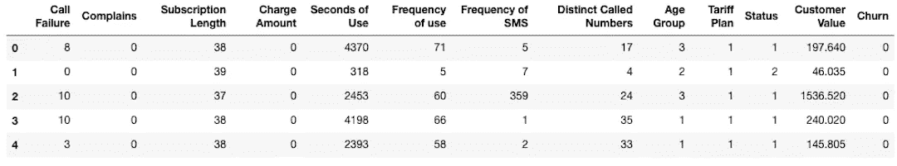
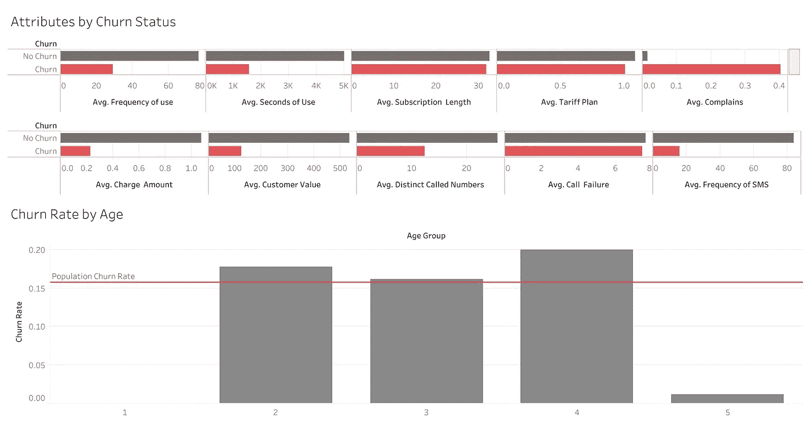
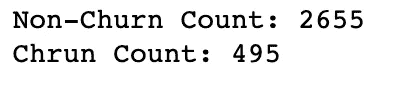
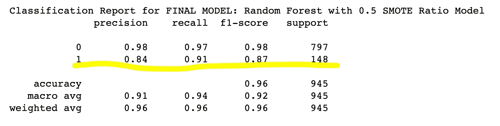
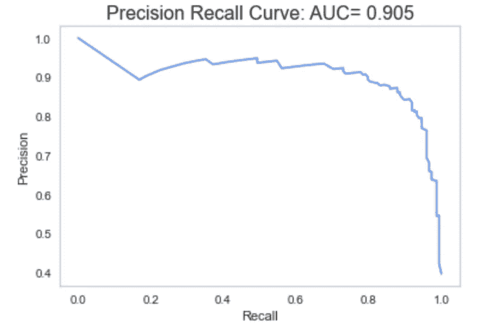
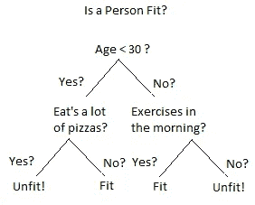
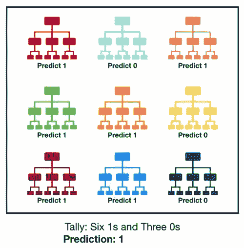
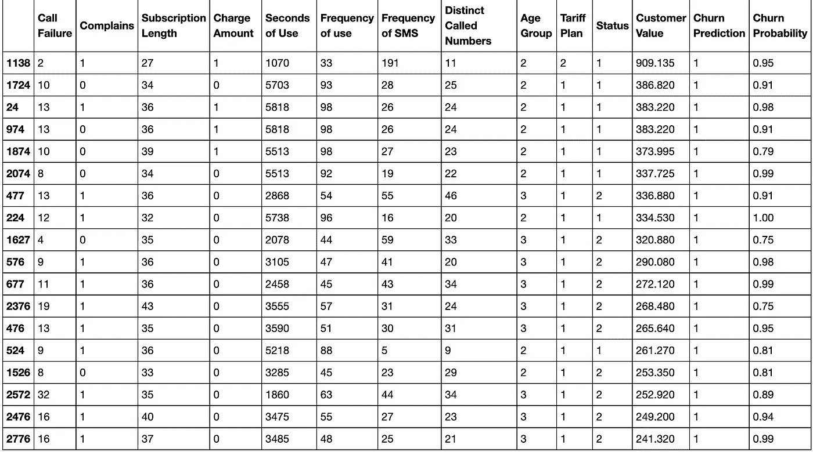
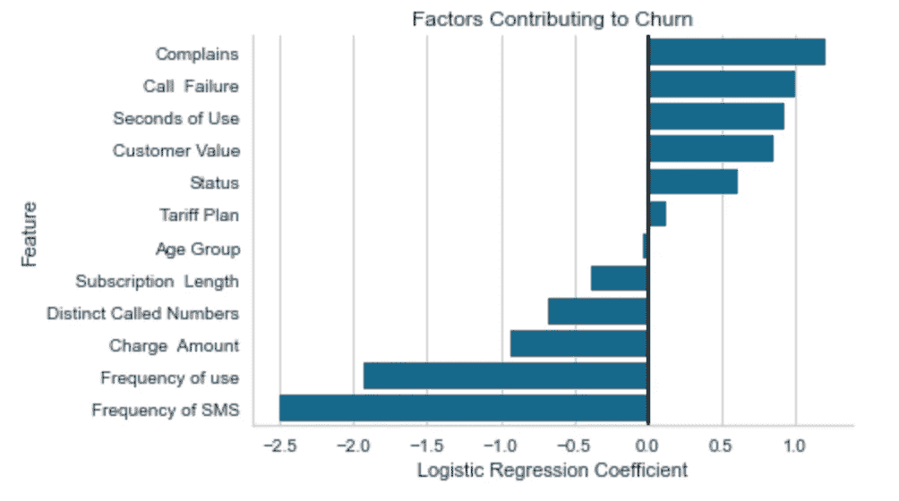
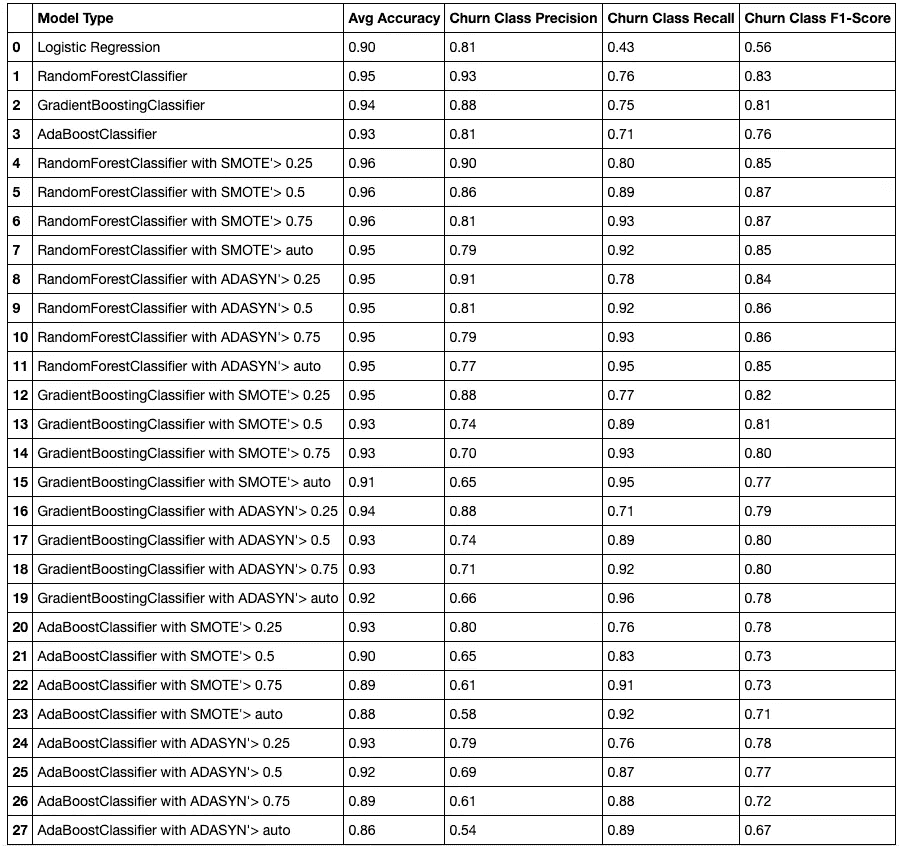

# 使用机器学习预测和防止高价值客户流失

> 原文：<https://towardsdatascience.com/predicting-and-preventing-the-churn-of-high-value-customers-using-machine-learning-adbb4a61095d?source=collection_archive---------22----------------------->

** *简短的代码片段和可视化将在这篇文章中分享，但该项目的所有代码都可以在这个*[*Github Repo*](https://github.com/jeremysilva1098/predicting_churn)*中找到。*

公司非常重视获取客户，这是理所当然的:公司需要客户。然而，客户获取成本通常相当高，公司有时过于关注获取，而对保留关注不够。一家公司可能有很高的收购率，但是，如果你也有很高的流失率，你基本上是在浪费这些收购成本。这个项目的目标是演示如何使用机器学习来识别可能在未来几个月流失的客户。如果可以及早识别出高流失风险的客户，就可以采取干预措施来留住该客户。

> 什么是流失？

如果一个客户取消了他们在你公司的服务，这被认为是一个客户流失案例。

信用:Unsplash.com

## 数据

对于这个项目，我选择使用来自移动电话运营商的数据集。该数据集包含 3，100 名随机选择的客户的信息。清理后，数据集如下所示…

移动运营商数据集快照(图片由作者提供)

每行代表一个客户，每个客户有 12 个相关联的属性以及第 13 个属性(“客户流失”)，该属性描述该客户是否取消了他们的服务。除了流失之外，每个属性都是 9 个月数据(第 1-9 个月)的聚合。客户流失记录了该客户在第 9 个月到第 12 个月期间是否取消了服务。

> 如果已经有一个客户流失列，为什么我们还需要预测客户流失？

我们只有一个客户流失列，因为这是过去的数据。我们将使用这些过去的数据来建立一个模型，然后可以在当前数据**上使用该模型来预测客户流失。**

## 可视化数据

属性与客户流失的关系(0 =非客户流失，1 =客户流失)。(图片由作者提供)

正如我们所看到的，流失组和非流失组之间的许多变量存在显著差异，因此该数据集可能包含大量有用的信息。

## 培训和测试数据

与所有机器学习模型一样，我们将数据集分成两部分:*训练*和*测试*。我们将使用*训练数据*建立模型，然后在*测试数据*上评估该模型的性能(该模型从未见过)。我们将在训练过程中为模型提供流失值，然后在测试过程中，我们将保留流失值并让模型预测它们。这就是我们如何模拟该模型在部署和使用当前数据预测客户流失时的表现。

## 不平衡的班级

我们试图解决的问题是一个分类问题:我们试图将每个客户分为非流失类(表示为 0)或流失类(表示为 1)。

每当我们遇到分类问题时，注意我们观察数据集中每个类的频率是很重要的。在我们的案例中，非客户流失案例明显多于客户流失案例，我们希望任何企业都是如此。

对于每个客户流失案例，我们看到大约 5.5 个非客户流失案例(图片由作者提供)

**记录类别不平衡对于评估建模准确性结果很重要**。

例如，如果我告诉你，我建立的模型对 84%的案例进行了正确分类，这可能看起来相当不错。但在这种情况下，非流失案例代表了 84%的数据，因此，理论上，该模型可以将所有内容分类为非流失，并获得 84%的准确率。

> 因此**，**当我们用不平衡数据集评估模型性能时，我们希望主要根据它在少数类上的表现来判断模型。

# **建模结果**

和往常一样，在进入建模过程之前，我将直接跳到最终模型的结果，这样那些对整个过程不太感兴趣的人可以了解最终的结果及其含义。

通过对训练数据使用合成少数过采样来对流失类进行过采样，我能够构建一个随机森林分类器，其总体准确率为 96%。这意味着在看不见的数据(*测试数据*)上，该模型以 96%的准确率准确预测了客户在未来 3 个月内是否会流失。

> **然而，正如我们刚刚讨论的，整体准确性并不能说明全部情况！**

因为我们有不平衡的类别(84%:16%)，我们希望更多地关注模型在客户流失案例(少数类别)中的表现。

下面的分类报告为我们提供了这些信息…

流失类性能下划线(图片由作者提供)

让我们稍微分析一下这些结果…

**召回**
0.91 的流失类别召回意味着模型能够捕获 91%的实际流失案例。这是我们真正关心的衡量标准，因为我们希望尽可能少地遗漏真正的客户流失案例。

**Precision**
流失类的 Precision 衡量模型捕获实际流失案例的频率，同时还考虑了将非流失案例错误分类为流失案例的频率。在这种情况下，0.84 的流失精度不是问题，因为当客户没有流失风险时，将客户识别为流失风险不会产生重大后果。

**F1 得分**
F1 得分是精确度和召回率的调和平均值。这有助于我们对模型在客户流失类上的表现有一个平衡的了解。在这种情况下，0.87 的客户流失等级 F1 分数相当不错。通常在精确度和召回率之间有一个折衷。我本来可以调整模型的概率阈值，使流失类别召回率达到 97%，但流失类别的精确度会下降，因为模型会将一堆实际的非流失案例归类为流失案例。F1 分数有助于我们保持诚实。

我们可以用流失类的精确召回曲线来形象化这种关系…

流失类的精确召回曲线(图片由作者提供)

曲线越向右弓出，模型越好，所以这个模型做的很好！

# 解释最终模型

> 对于那些对使用 SMOTE 的随机森林分类器有兴趣的人…

## 合成少数过采样

SMOTE 是一种处理阶级不平衡问题的方法。因为我们的数据中每 5.5 个客户流失案例中只有 1 个案例，所以模型没有发现足够多的客户流失案例，因此在对这些案例进行分类时表现不佳。

有了 SMOTE，我们可以综合少数类的例子，让类变得更加平衡。现在，需要注意的是，我们仅对定型数据执行此操作，以便模型可以看到少数民族类的更多示例。*我们不以任何方式操纵测试数据，这是我们用来评估模型性能的数据。*

> SMOTE 如何凭空创造新的数据点？

SMOTE 在 12 维空间中绘制了少数民族类的每个示例，因为每个客户有 12 个属性。它从 12D 空间中随机选取一个点，画一条线到该点最近的邻居，然后在该线的正中间绘制一个新点。它一遍又一遍地这样做，直到达到你一开始要求的等级比率。

在这种情况下，我对训练数据使用 SMOTE 来生成足够的流失类样本，这样每 2 个非流失案例中就有 1 个流失案例。这有助于大大提高性能。

## 随机森林分类器

这是用于分类的实际模型。随机森林是单个决策树的集合，它的工作方式非常酷！

我们大多数人都熟悉决策树的概念，即使我们并不知道自己是。决策树搜索可用的特征并挑选特征，通过基于该特征的值分割数据，将产生彼此尽可能不同的结果组。一张图会提供更清楚的解释…

简单的决策树示例(图片由作者提供)

随机森林是数百个不同决策树的集合。每个单独的决策树都会产生一个分类，哪个分类获得的“票数”最多，哪个就获胜。

投票过程的可视化(图片由作者提供)

如果每棵决策树都在最有效的特征上分裂，那么森林中的每棵决策树不应该是完全相同的吗？
随机森林以这种方式引入了随机性:每当一棵树决定分割哪个特征时，它必须从随机的特征子集而不是整个特征集中进行选择。因此，森林中的每一棵树都是独一无二的！

以下是如何用 SMOTE 实现和评估随机森林分类器的代码…

# 运行中的模型

精确度很高，但是这个模型如何用于现实生活呢？

使用随机森林模型，我们实际上可以为每一类预测生成概率。因此，我们基本上可以让模型为每个客户提供一个概率，即模型认为该客户在未来三个月内流失的可能性有多大。

例如，我们可以返回一个所有有超过 65%的翻盘机会的客户的列表。因为我们只关心高价值的客户，所以我们可以使列表只包含那些高于平均客户价值的客户。

通过这样做，我们能够生成一个对公司具有高价值并且具有高流失风险的客户列表。这些客户是公司希望以某种方式干预以留住他们的客户。

当在测试数据上运行时，这样的列表看起来像这样(索引是客户 ID)…

我们所有的高风险、高价值客户(图片由作者提供)

下面是像上面那样拟合模型后生成这样一个列表的代码…

# 了解每个特性如何导致客户流失

能够预测那些可能流失的客户是很好的，但是，如果这是我的公司，我也想知道每个功能是如何造成流失的。

就像我们在**可视化数据**部分所做的那样，通过可视化数据，我们可以看到每个单独的特征是如何与客户流失相关联的。不幸的是，仅仅基于可视化很难比较每个变量的影响。

我们实际上可以使用另一种机器学习技术，称为逻辑回归，来比较每个特征的影响。逻辑回归也是一种分类模型。在我们的例子中，它没有给我们提供像 Random Forest 一样好的预测性能，但它确实给了我们关于每个特征如何影响流失的好的、可解释的信息。

逻辑回归系数如下所示…

逻辑回归系数(图片由作者提供)

具有正系数的特征意味着该特征的增加导致该观察成为流失情况的机会增加。

具有负系数的特征意味着该特征的增加导致该观察成为流失情况的机会减少。

因此，记录的客户通话失败次数越多，该客户就越有可能成为客户流失案例。客户发送的短信越多(“短信频率”)，客户流失的可能性就越小。

以下是计算和绘制这些系数的代码…

# 建模迭代

和往常一样，在用 SMOTE 选择随机森林之前，我尝试了多种不同的模型和过采样技术。

尝试的模型:
-逻辑回归
-随机森林
-梯度推进分类器
-Ada 推进分类器

尝试过采样技术:
-无过采样(不平衡类)
-SMOTE w/ 0.25、0.5、0.75 和 1 作为类比率
-ADASYN w/ 0.25、0.5、0.75 和 1 类比率

为了比较这些模型，我尝试了每种模型和每种采样策略。我将所有结果添加到一个数据帧中，如下所示…

建模迭代的总结(图片由作者提供)

此数据框架与以下两个代码块放在一起(逻辑回归模型除外，因为需要调整 X 变量，所以必须单独计算)…

用每种采样技术生成集合模型

这就是你如何使用机器学习来预测和防止高价值客户流失的方法。概括地说，我们能够使用机器学习完成两件主要的事情，这是我们用基于“传统”可视化的分析无法完成的。我们能够:
1)生成一个模型，能够在客户流失案例发生之前识别 90%的案例
2)对每个因素对客户流失概率的影响进行排序。

# 感谢阅读！！