# 预测动画电影表现的数据管道

> 原文：<https://towardsdatascience.com/predicting-animated-film-performance-5d25748b7481?source=collection_archive---------40----------------------->

## 实施线性回归预测动画电影表现的技术演示。

这是 METIS 正在进行的五个数据科学项目中的第二个，涉及虚构的客户端。这篇文章基于第 1 部分:客户演示。

# 项目焦点

这个项目的目的是使用新获得的数据科学工具来解决一个虚构客户的问题领域。我选择看动画电影是因为我个人对媒体的兴趣，并将这个项目视为帮助动画电影制片人和电影制作人增加投资回报的一种方式。我试图梳理出让动画电影更有利可图的众所周知的特征，从而帮助整个行业。帖子中的技术解释可能过于详细，但我在一个数据科学项目的典型帖子中从未见过如此详细的内容，所以我认为这将是对万维网的一个很好的贡献。

# 技术工具

这是我使用技术工具的顺序，但是，项目的重点以粗体显示。

*   数据刮痧:美汤
*   数据清理和合并:熊猫
*   **探索性数据分析:Seaborn，Statsmodel**
*   **线性回归:SKlearn**
*   **正规化:拉索和山脊，拉斯**

# 数据抓取

利用美人汤，我从“the-numbers.com”上刮出了有史以来 423 部动画电影的排行榜。从主页上，我调出了每部电影的票房收入，包括国内、国际票房收入、上映年份以及每部电影的网址。下面是初始数据帧的头部，以及生成它的代码。

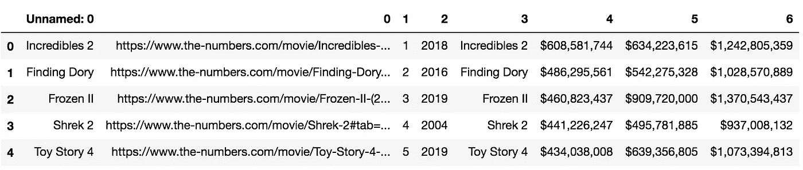

```
from bs4 import BeautifulSoup
import requests
import time#store url of page to be scraped
movies_html = “[https://www.the-numbers.com/box-office-records/domestic/all-movies/cumulative/all-time-animated](https://www.the-numbers.com/box-office-records/domestic/all-movies/cumulative/all-time-animated)"
movies_htmls = [movies_html, movies_html + “/101”, movies_html + “/201”, movies_html + “/301”, movies_html+ “401”]#iterate through url pages
movies = {}
for movies_html in movies_htmls:#retrieve page’s html
 response = requests.get(movies_html)
 response.status_code#store response
 page = response.text#parse page with “lxml” parser
 soup = BeautifulSoup(page, “lxml”)#gather movie data
 table = soup.find(‘table’)
 type(table)#find all rows: tr tag is for rows
 rows = [row for row in table.find_all(‘tr’)]#get movies info
 for row in rows[1:100]:
 items = row.find_all(‘td’)
 url_1 = “[https://www.the-numbers.com](https://www.the-numbers.com)”
 link = items[2].find(‘a’)
 title, url = link.text, url_1 + link[‘href’]
 movies[title] = [url] + [i.text for i in items]
 time.sleep(2)```
```

然后，我提取每部电影的数据和预处理信息，例如，在提取美元金额时，我删除了逗号和美元符号，以获得一个纯粹的数字。这个过程与上面的非常相似，但是我从 the-numbers.com 的 HTML 中提取的信息是基于关键字的，而不是来自表格。下面是单个电影页面抓取的结果数据帧。

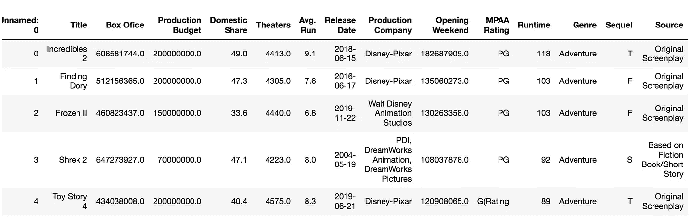

我想给这个项目一个更广阔的视角，所以我结合了 GDP 数据，以及从现有数据集中提取的 IMDB 元得分数据。与使用美国 GDP 数据一致，我决定使用国内票房表现，而不是国际。回想起来，我认为虚构的客户使用国际票房收入会更有用，因为钱就是钱，正如你在上面的前 5 部电影中看到的，国内份额不到 50%。此外，通过合并有限的现有数据集，其中没有太多的动画电影，我不得不将数据集削减到 166 部电影。如果时间允许的话，如果我没有削减数据集的话，可能会产生一个更好的模型。元分数在我的模型中很有影响力，但它可能是一个很好的实验，以检查是否有更多的数据来训练或有元分数会产生更好的模型。

我对数据集进行了一些清理，将其与其他数据集合并，并在数值数据类型中包含数值数据。

```
#convert datatypes to numeric / date
df["Avg. Run"] = pd.to_numeric(df["Avg. Run"], errors='coerce')
df["Runtime"] = pd.to_numeric(df["Runtime"], errors='coerce')
df["Release Date"] = pd.to_datetime(df["Release Date"], format = "%Y-%m-%d" )#make a column of lowercase + no punctuation titles
df["title_formatted"] = df["Title"].str.lower()
df["title_formatted"] = df["title_formatted"].str.replace('[^\w\s]','') 
df["title_formatted"] = df["title_formatted"].str.replace(' ','')
```

我对要合并的数据集做了类似的清理和重新格式化，然后合并。

```
mergedStuff = pd.merge(df, df_imdb, on=['title_formatted'], how='inner')
```

我还从我收集的信息中生成了一些数字数据，尽可能地为模型提供最有意义的数字数据。例如，当我把发行语言转换成语言的数量，把标题转换成标题的长度，把续集转换成 0 和 1。

```
#find how many languages the film is in
gdp_movie_df['Language'] = gdp_movie_df['Language'].str.split()
gdp_movie_df['# of Languages']  = [len(x) for x in gdp_movie_df['Language']]
```

我最终使用以下数据集来进行 EDA 和模型训练，它由 15 个数字特征和 7 个分类特征组成。

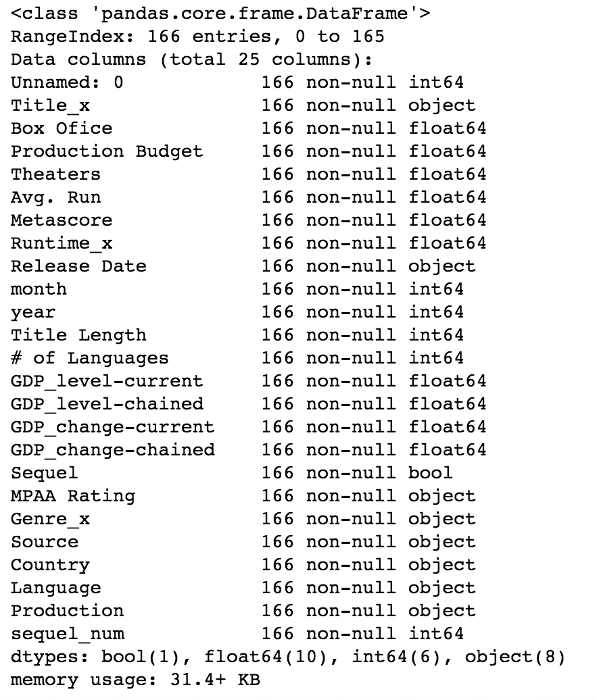

我做了一个快速总结，看看是否一切都像预期的那样，没有不太可能的异常值。

```
X_y_df.describe()
```

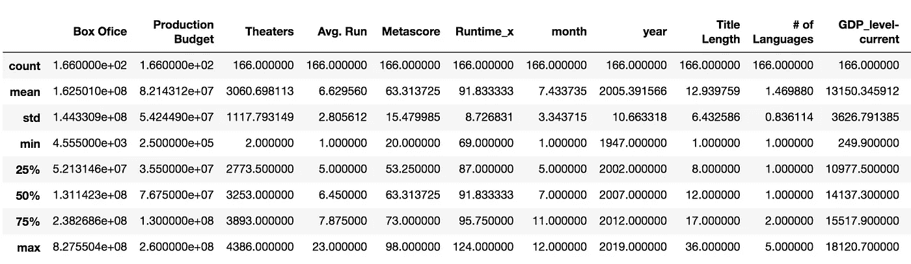

一切似乎都井井有条，我确实决定保留票房表现高端的异常值，以便更好地理解它们。回过头来看，去掉它们以产生一个更精确的模型可能是明智的。

# 探索性数据分析

在我收集了所有的数据之后，我分离出我的数字数据，并首先使用相关矩阵对其进行检查。代码和输出如下:

```
numeric_df = X_y_df.loc[:,["Box Ofice", 'Production Budget', 'Theaters', 'Avg. Run', 'Metascore', 'Runtime_x', "month", 'year', 'Title Length', '# of Languages', 'GDP_level-current','GDP_level-chained', 'GDP_change-current', 'GDP_change-chained', "sequel_num"]]# correlation matrix heatmap
plt.figure(figsize = (8,7))
sns.heatmap(numeric_df.corr(), cmap="RdYlBu", annot=True, vmin=-1, vmax=1);
plt.savefig("heatmap_blue_or.png", bbox_inches='tight')
```

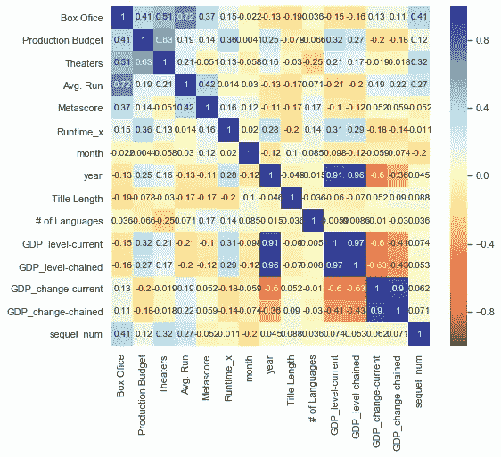

从热图中，我可以收集到与票房表现高度相关并且会严重影响我的模型的主要特征是:

1.  平均运行周数
2.  剧院数量
3.  生产预算
4.  续集/翻拍
5.  元得分
6.  标题长度(标题中的字母数)
7.  运行时间
8.  国内生产总值水平环比

有意思的是，随着年限的增长，收益反而下降。这也可能与不得不削减数据集以包含准确的元得分有关。为了探索这些特征和票房表现之间的数学关系，我进一步观察了一个配对图。代码和结果如下:

```
sns_plot = sns.pairplot(numeric_df, height=4, aspect=1);
sns_plot.savefig(“pairplot.pdf”)
```

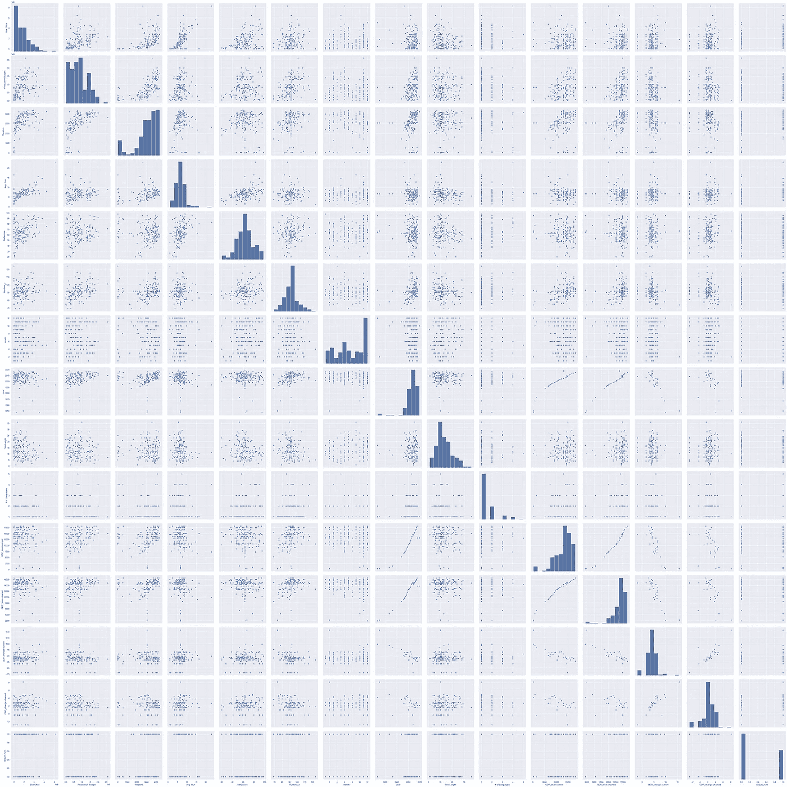

从配对图中(在 pdf 上放大很多倍后)，我可以进一步理解这些关系，并看到一些更有影响力的特征:

1.  平均运行周数

这个特征与票房有直接关系，斜率很小，截距大于零。

2.剧院数量

这一特征在达到最大值时似乎趋于平稳，表明与票房表现的关系更加复杂。

3.生产预算:

这个功能与票房有最直接的关系，截距为零。随着制作预算的增长，票房业绩成比例地增长。

4.续集/重拍

这一特征在异常值中是一致的，这些异常值是表现最好的电影。

5.元得分

这一特征确实与票房表现有直接关系，但许多元得分较高的电影在票房上表现不佳。

6.标题长度(标题中的字母数)

这条曲线与票房表现成反比。高回报的电影总是有较短的片名。

7.运行时间

该数据主要聚集在 90 分钟的直线周围，高回报电影更接近该长度。我觉得这个特点不太显著。

8.国内生产总值水平环比

这个特点也不是很显著。

9.月

这一特性非常重要，从图表中我们可以看出，初夏和年末的发布日期更为成功。但是，季节并不遵循线性关系，因此它可能无法在线性回归模型中很好地建模。

在这个 EDA 之后，我可以建立一个模型，测试我的功能之间的关系，以及目标变量，国内票房表现。

**线性回归**

我使用 SKlearn python 包来设置我的简单训练测试分割，并在变量的几次迭代中获得我的 R 平方、平均绝对误差和均方根误差，包括一些虚拟变量和超参数。我做了一个循环来测试下面的组合、代码和结果，我的第一次迭代只使用了开箱即用的数字数据，如下所示:

```
from sklearn.model_selection import train_test_split
from sklearn import metricsdef split_and_validate(X, y):
 ‘’’
 For a set of features and target X, y, perform a 80/20 train/val split, 
 fit and validate a linear regression model, and report results
 ‘’’

 # perform train/val split
 X_train, X_val, y_train, y_val = \
 train_test_split(X, y, test_size=0.2, random_state=42)

 # fit linear regression to training data
 lr_model = LinearRegression()
 lr_model.fit(X_train, y_train)

 # score fit model on validation data
 val_score = lr_model.score(X_val, y_val)
 lr_preds = lr_model.predict(X_val)
 rmse = np.sqrt(metrics.mean_squared_error(y_val,lr_preds))
 mae = metrics.mean_absolute_error(y_val,lr_preds)

 # report results
 print(‘\nValidation R² score was:’, val_score)
 print(‘Feature coefficient results: \n’)
 for feature, coef in zip(X.columns, lr_model.coef_):
 print(feature, ‘:’, f’{coef:.2f}’) 
 print (“RMSE score was:”, rmse)
 print (“MAE score was:”, mae)#vanilla training
split_and_validate(X, y)
```

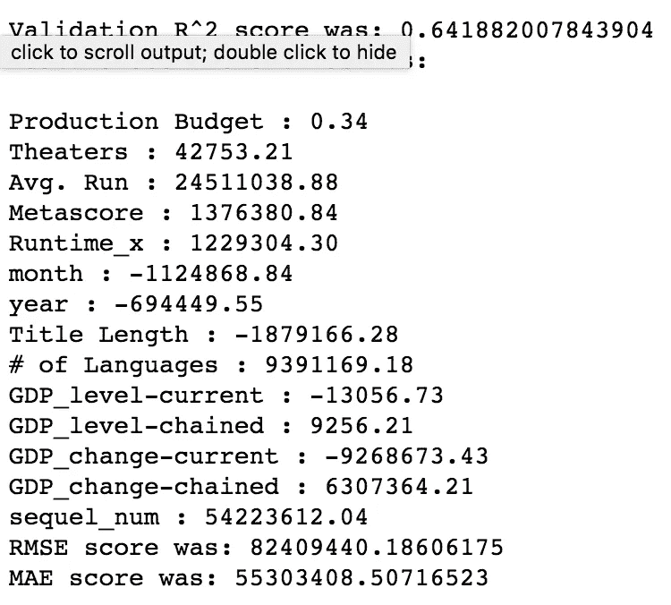

我打印了每次迭代的系数和分数。我从大约 0.64 R 平方开始，这并不可怕。我进行了几次迭代，得出了下面的模型。

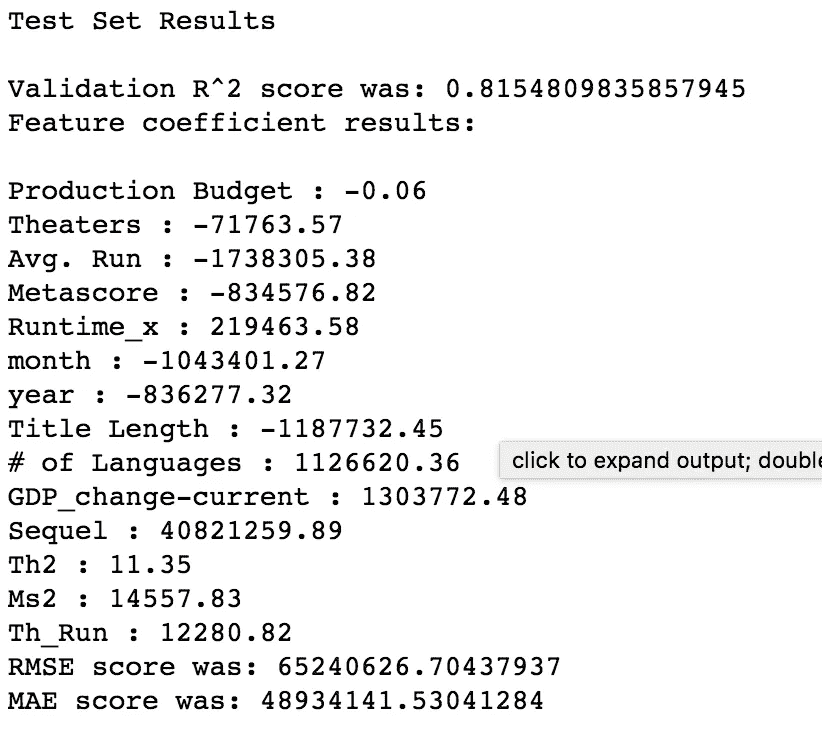

这些分数是我在我的数据集上能得到的最好的分数，R 平方达到 0.815，平均绝对误差达到 48，934，141 美元。如果时间允许的话，我会添加更多关于演员和导演的历史表现的数据，更多关于工作室的信息，以及公众对电影中启动力量的兴趣。

我还测试了 Ridge 和 Lasso，看看它们是否会产生更好的结果，但它们没有，因为过度拟合不是这个特定模型的问题。代码和输出如下:

```
#Standard Scaler for Lasso and Ridge
std = StandardScaler()
std.fit_transform(X_tr.values)
X_tr_std = std.transform(X_tr.values)
X_val_std = std.transform(X_va.values)#Ridge Linear Regression (code clip)
lr_model_ridge = Ridge(alpha = 100)
lr_model_ridge.fit(X_tr_std, y_tr)
```

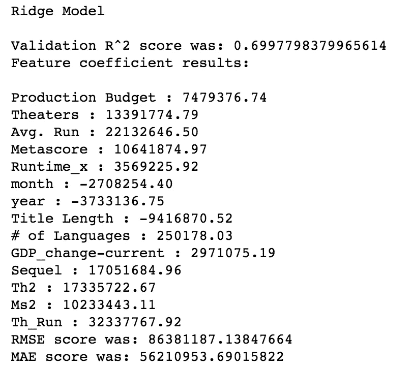

```
#Lasso Linear Regression (code clip)
lr_model_lasso = Lasso(alpha = .01)
lr_model_lasso.fit(X_tr_std, y_tr)
```

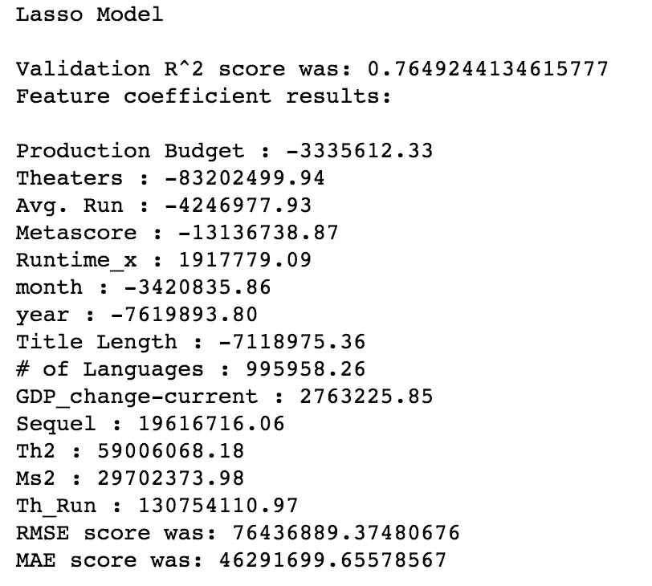

为了评估我的模型，我绘制了残差图，发现它们是随机分布的。

```
residual = (y_test - lr_preds)
```

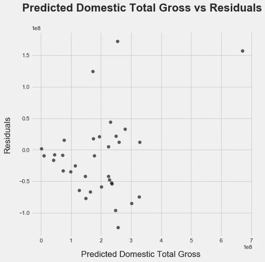

我还绘制了预期与预测的票房表现，如下所示。

```
plt.figure(figsize=(7,7))
plt.scatter(lr_preds, y_test, c = "k")
#plt.xlabel('Predicted Domestic Total Gross ', labelpad=15, color = "k")
#plt.ylabel("Actual Domestic Total Gross (in 100 millions)", labelpad=15)
#plt.title("Predicted Domestic Total Gross vs Actual", fontsize = 22, weight =  'bold', pad=40)
plt.savefig("Predicted vs Actual.svg", bbox_inches='tight')
```

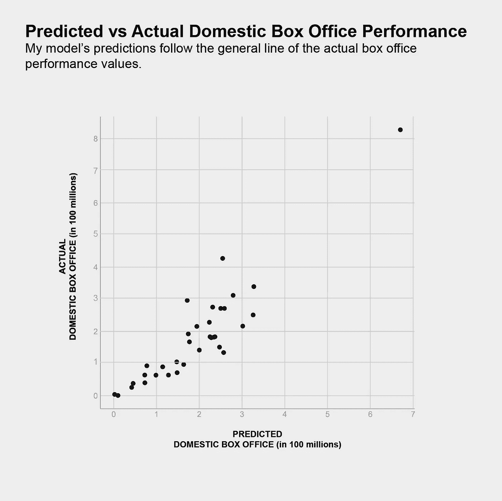

总的来说，端到端地运行这个过程非常令人满意。令人惊讶的是看到了过程中涉及的 EDA 和迭代的数量，但也令人欣慰的是知道人类对模型的输入和模型本身一样重要。我期待将线性回归应用于无数的问题。