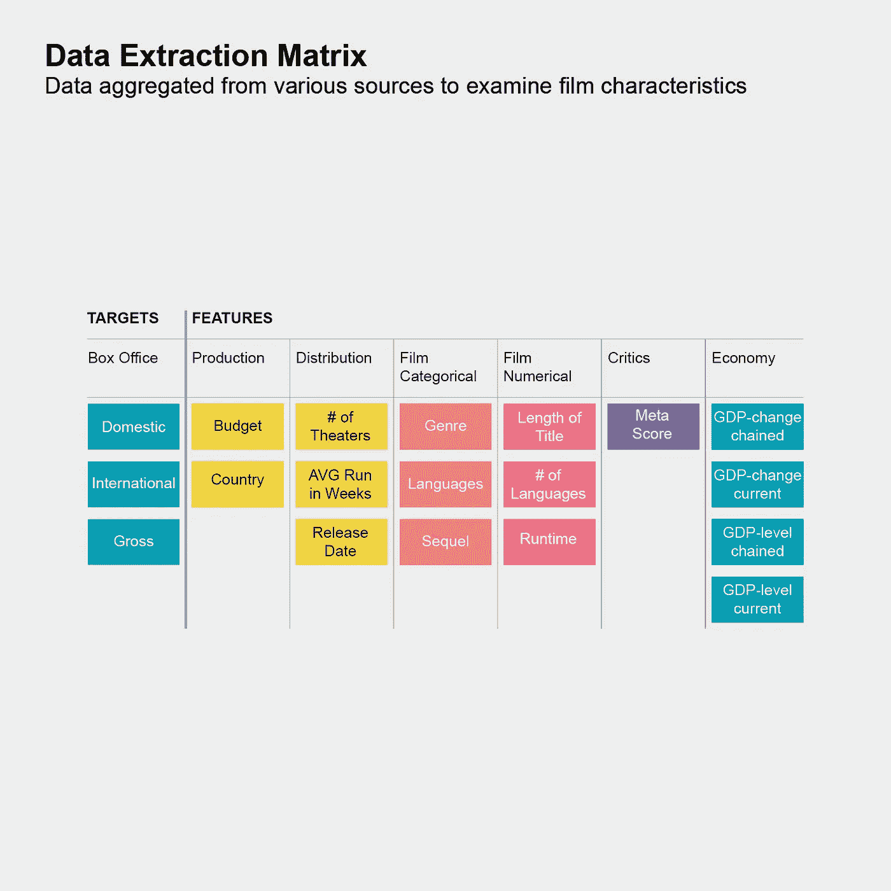
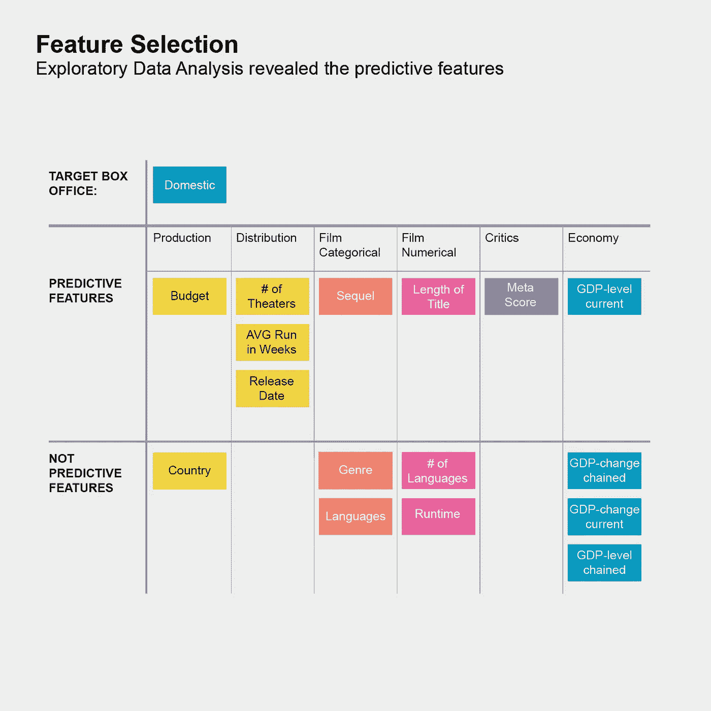
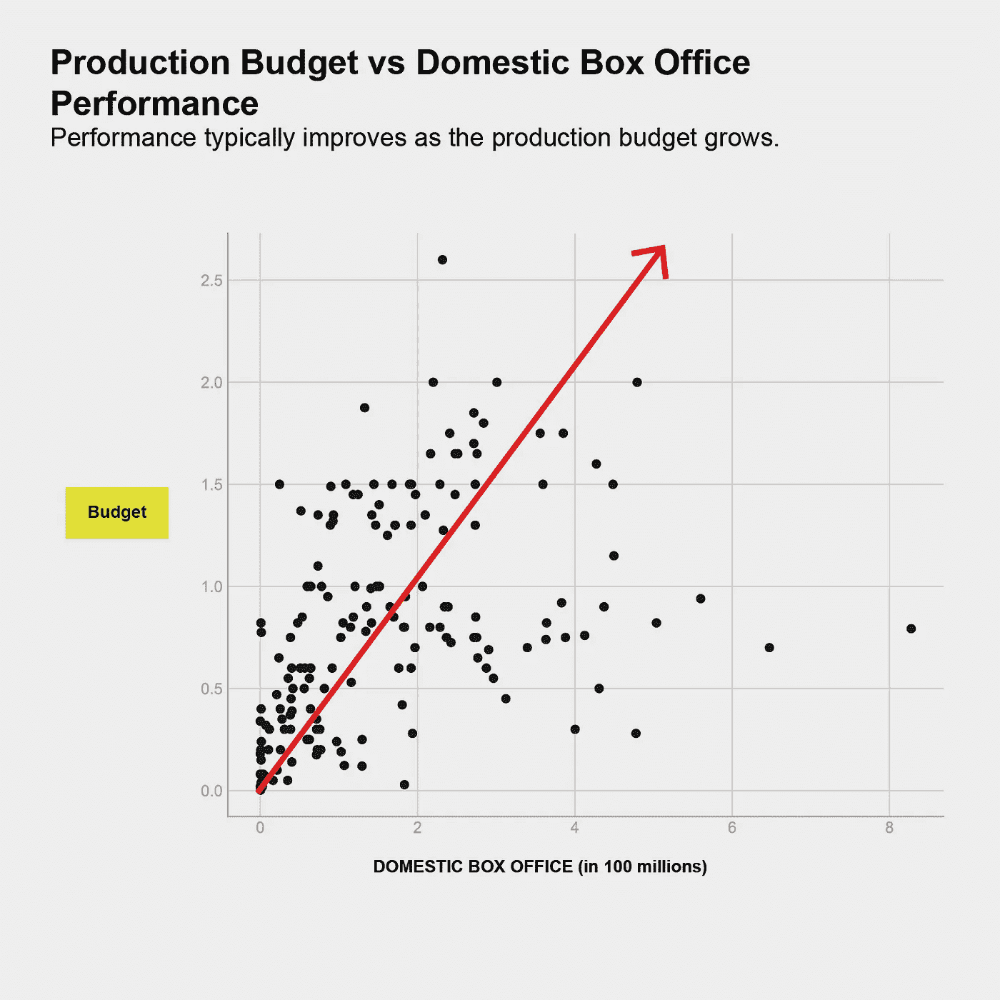
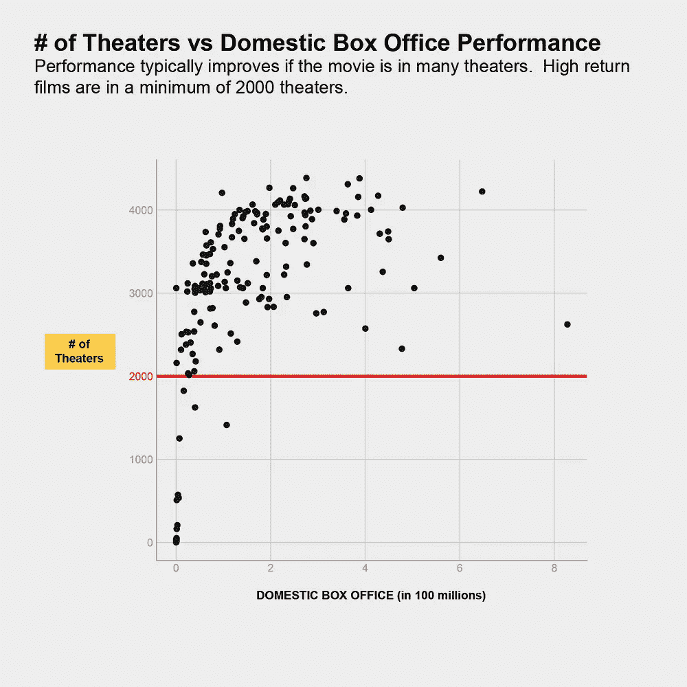
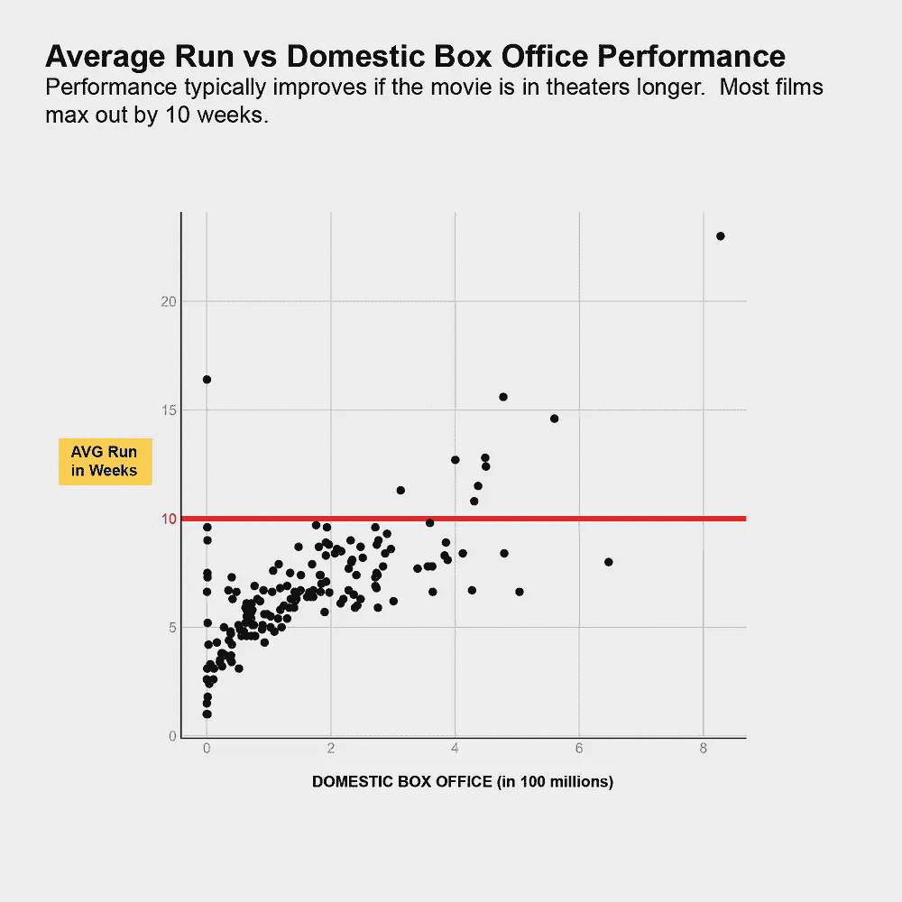
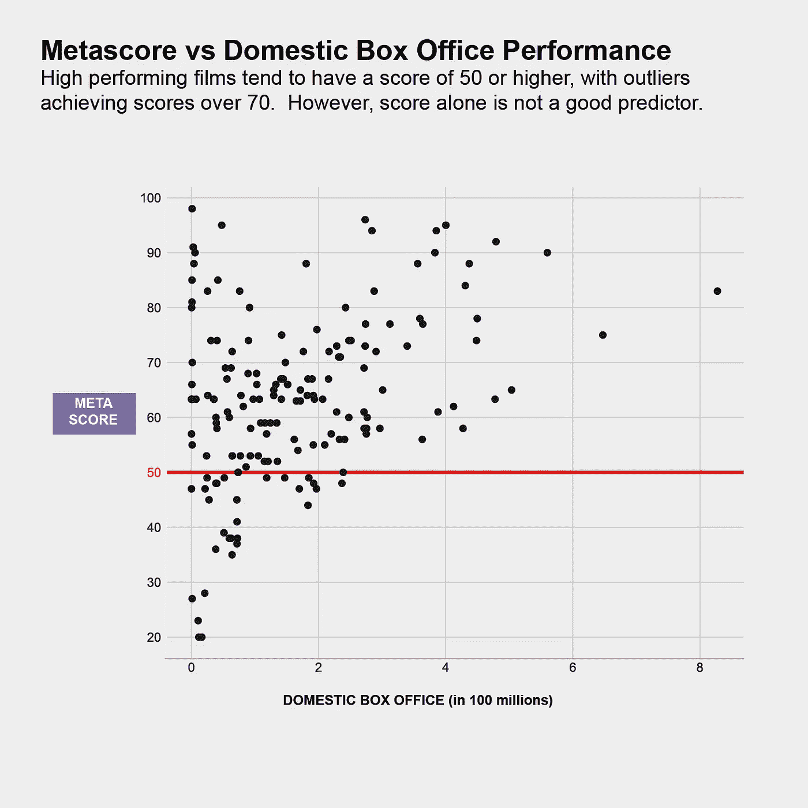
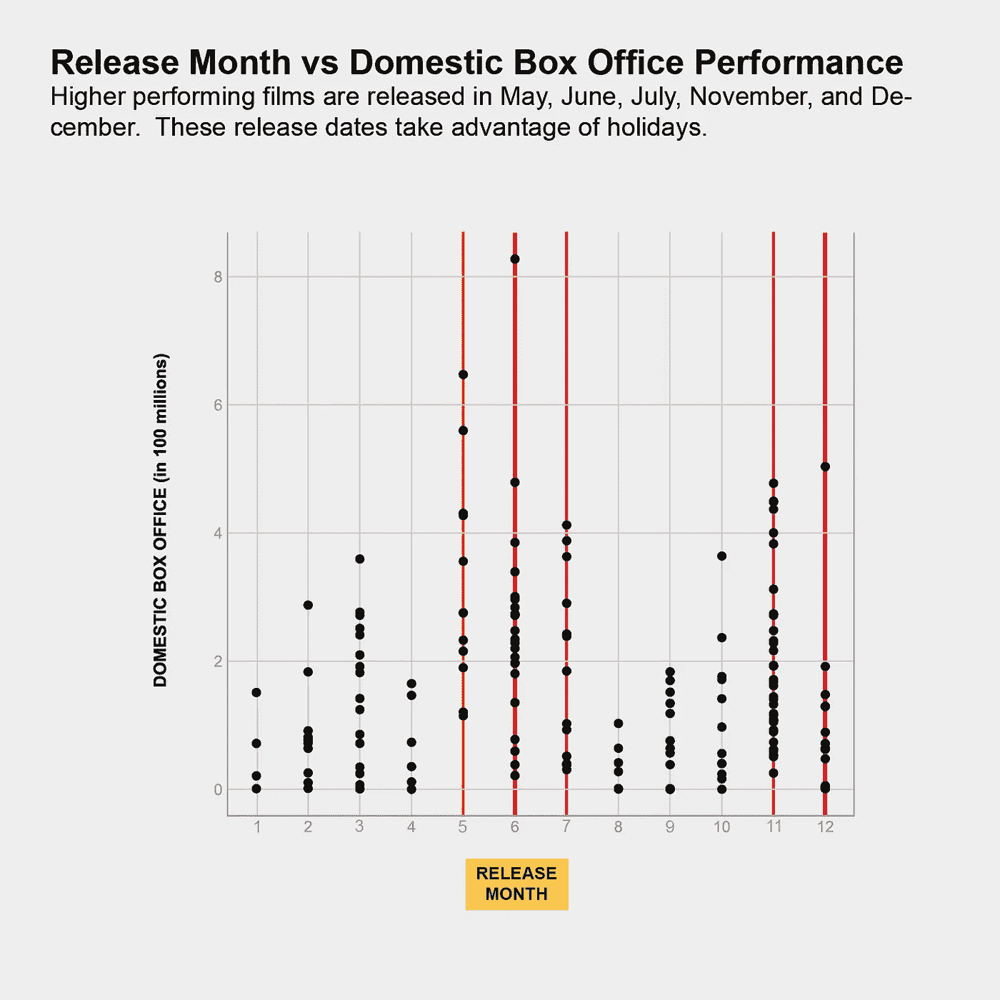
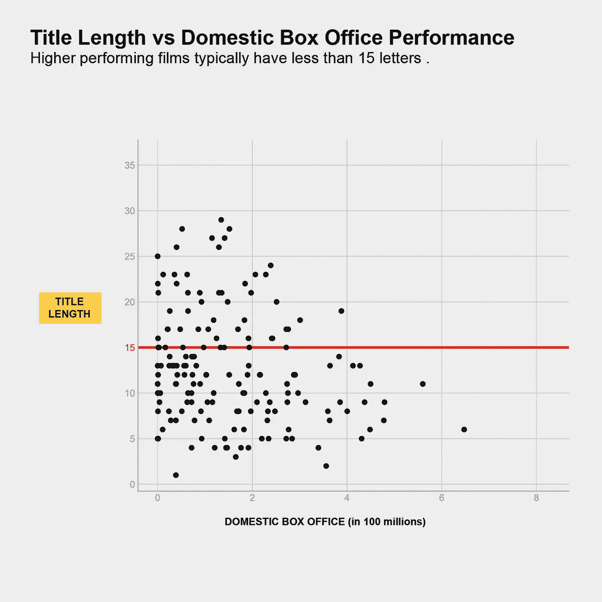

# 预测动画电影的表现

> 原文：<https://towardsdatascience.com/predicting-animated-film-performance-fc32e3611c71?source=collection_archive---------18----------------------->

这是 METIS 正在进行的五个数据科学项目中的第二个，旨在使用线性回归来预测动画电影的票房表现。

从 [Shutterstock](https://www.shutterstock.com/image-illustration/illustration-inspired-by-studio-ghibli-my-1630481971) 获得授权的吉卜力动画工作室角色

# 动机

我喜欢动画电影——大多是吉卜力工作室的，但有时，迪士尼/皮克斯制作的东西我不介意看无数遍。我希望看到更多伟大的作品，但我知道动画电影的制作成本近年来大幅增加。我想帮助制片人和电影制作人更早地了解投资回报:

*   动画电影制片人想知道投资哪部动画电影能获得最高回报。
*   动画电影制作人想知道电影中的简单变化是否能提高电影的回报。

# 目标

*   了解哪些因素会产生最高的国内票房回报
*   在电影上映前预测国内票房收入

# 数据

1.  分销战略、资金、绩效—“the-numbers . com”

有史以来排名前 423 位的动画电影及其主要特点都是从这个“the-numbers.com”中刮出来的。

2.关键接收—“IMDB . com”

IMDB 元评分是一个数字，它总结了电影公开发行前专业电影评论家的评论，并从现有的公共数据集中提取。

3.经济数据—“bea . gov”

一系列 GDP 指标从最初来自 https://www.bea.gov/data/gdp/gross-domestic-product#gd[的公共数据集中下载。](https://www.bea.gov/data/gdp/gross-domestic-product#gd)

Anupama Garla 的数据集组件

# 方法

型号:

线性回归，*拉索和山脊正则化测试(未使用)*

指标:

判断我的模型是否成功的标准是平均绝对误差，它告诉我们预测的性能与实际性能平均相差多远。还参考了预测与预期票房表现值的图表。

*在模型设计期间参考了 R 平方误差和均方根误差，并确定其用处不大。*

# 结果

**平均误差:48，934，141 美元|** RMSE: 65，240，627 | R : 0.815

虽然 R 值很高，表明模型很好地描述了数据内的方差，但均方根误差和平均绝对误差高于预期。

平均绝对误差衡量预测的平均误差。我对这个模型的平均绝对误差是 48，934，141 美元，是国内总平均误差 162，500，951 美元的 30%。这表明我的模型在预测票房表现方面还可以，但还有待改进。

Anupama Garla 的预测与实际

该图显示，预测的国内票房表现与实际的国内票房表现处于相似的轨迹上。计算平均误差时模型表现不佳的一些原因是:

*   数据集内的异常值未被排除
*   **有限的数据集** (432 个顶级动画电影数据集在与元评分数据集合并后减少到 166 个)
*   **有限的功能**(额外的功能，如导演的明星效应、表演声音和音乐人可能非常有预见性)
*   国内票房收入的右尾分布可以转换为正态分布，以便更好地与线性回归模型保持一致

# 洞察力

虽然该模型可以预测国内票房收入，但探索性数据分析结合预测模型得出了一些关于影响收入的数字特征的重要见解。

Anupama Garla 的特征选择

**影响国内票房表现的前 5 名预发行**

1.  **生产预算**:美元美元

2.**分布:**影院数量，周数

3.**关键审查:**预发布关键接收+

4.**上映日期:**夏季/12 月

5.**标题长度**名称:越短越好

6.续集:表现最好的电影是续集

*   有趣的是，流派、语言数量和制作国家对票房表现没有显著影响。

我深入研究了下面的具体数字、分布和临界值:

Anupama Garla 绘制的配对图

#1 预测因素:生产预算

投入电影的钱越多，电影产生的钱就越多。这可能部分是因为如今制作如此精美的动画所需的计算和人力。

Anupama Garla 的配对图

#2 预测因素:分销战略和广度

这些对票房收入有重大影响。接触到广泛的观众，并在关键的剧院首演中击败竞争对手是非常值得努力的。

Anupama Garla 绘制的配对图

第三大预测因素:Metascore

批评性评论可以从无用的东西中发现宝石，然而，它本身并不是票房收入的良好指标。

Anupama Garla 绘制的配对图

#4 最大的预测因素:发布月份

人们倾向于在假期和家人一起看更多的电影。高性能电影往往在五月、六月、七月、十一月和十二月上映。

Anupama Garla 绘制的配对图

第五大预测因素:电影名称中的字母数

虽然片名长度本身并不是一个预测因素，但大多数票房超过 4 亿美元的高性能电影都有 15 个字母以下的片名。

# 结论

线性回归模型能够充分预测票房表现。然而，该模型将受益于更多捕捉方差的特征——也许是量化明星效应或情节特征的特征。

虽然投入的资金直接反映了电影的表现，但发行和评论紧随其后。较短的标题更好，也许是因为它们更吸引人，续集往往会大获全胜！