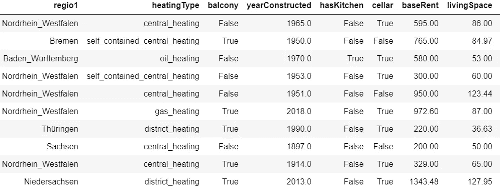
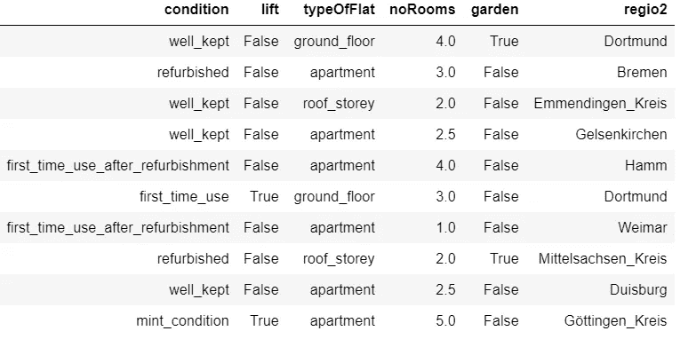
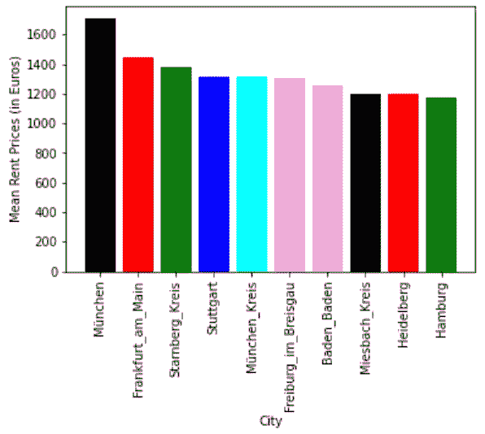
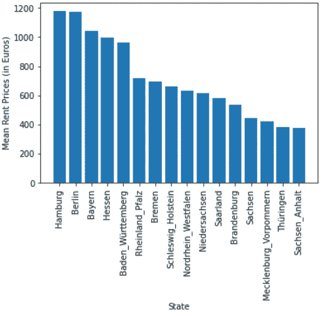
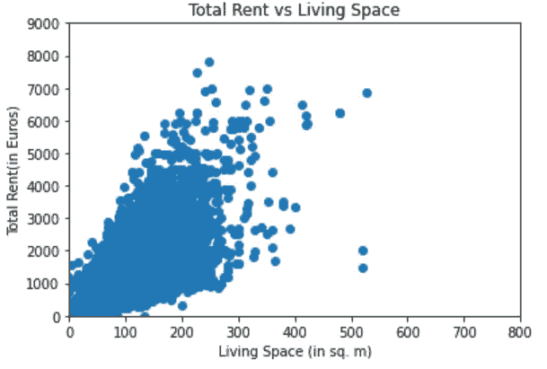
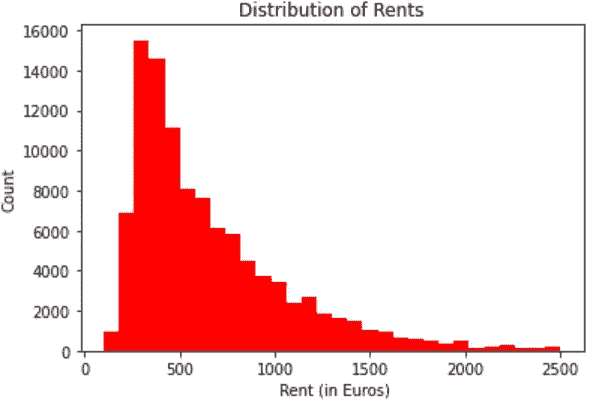
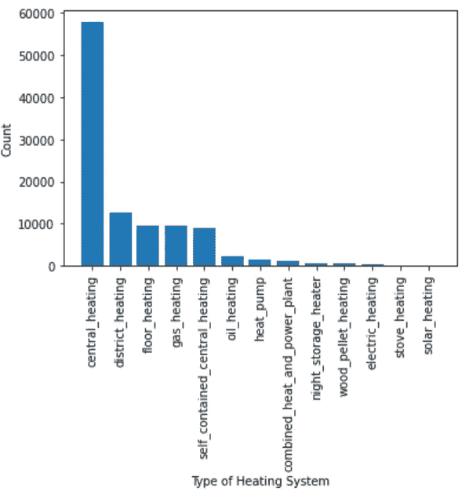
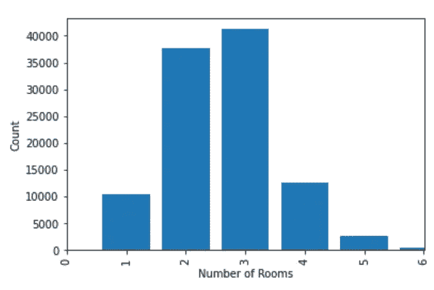
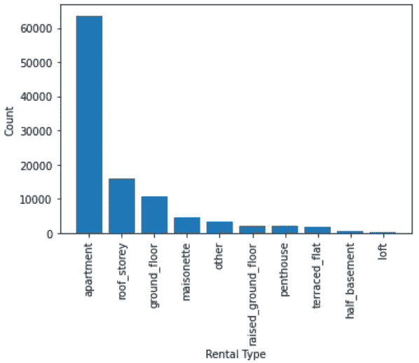
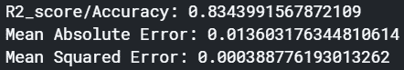

# 预测德国的公寓租金价格

> 原文：<https://towardsdatascience.com/predicting-apartment-rental-prices-in-germany-d5635197ab00?source=collection_archive---------31----------------------->

## 使用随机森林预测租赁价格

在 [Unsplash](https://unsplash.com?utm_source=medium&utm_medium=referral) 上由 [Wiktor Karkocha](https://unsplash.com/@rotkif?utm_source=medium&utm_medium=referral) 拍摄的照片

T 通过这篇文章，我试图使用包含德国租金价格的公寓租金数据集来预测租金价格。该数据集由从德国最大的房地产平台之一收集的数据组成。这里的主要目的是研究和理解数据，并利用这些知识构建一个基本预测模型来预测基础租赁价格(在德国通常称为“Kaltmiete”)。

原始数据集由 268850 个公寓(行)* 49 个要素(列)组成，但是缺失值和不平衡值的组合意味着在当前上下文中只有 14 个要素对我有用。这些列包含以下信息:

1.  公寓所在的联邦州。
2.  *供暖类型:*公寓使用的供暖系统类型。
3.  *阳台:*列表示公寓是否有阳台。
4.  *建造年份:* 公寓建造的年份。
5.  *hasKitchen:* 列表示公寓是否有厨房。
6.  *地窖:*表示公寓是否有地窖的栏。
7.  基本租金:不包括电费和取暖费的租金。
8.  *居住空间:*以平方米为单位的居住空间。
9.  *状况:*持平的状况。
10.  电梯:表示公寓是否有电梯的栏目。
11.  *typeOfFlat:* 户型。
12.  *noRooms:* 公寓房间总数。
13.  *花园:*一栏表示公寓是否有花园。
14.  *regio2:* 公寓所在城市。

数据框架一览(1/2)

数据框架一览(2/2)

## **探索性数据分析:**

由于该数据集是通过网络抓取创建的，因此它远非干净。因此，挑战之一是摆脱极端和空值。例如，有几排居住空间超过 60 平方米。在€10-€30 的范围内，这是明显的异常值。还有几个房间总数超过 100 间的公寓。清理后研究得出以下结论:

1.德国平均房租最高的城市是慕尼黑，这并不奇怪，因为这座城市以生活成本高而闻名。慕尼黑市内及周边地区(用 München_Kreis 表示)也位列前十。有趣的事实是，紧随法兰克福排名第三的施塔恩堡是德国最富有的城镇。我很惊讶没有在名单上找到杜塞尔多夫和波恩。

各城市的平均租金

2.)汉堡是平均租金最高的联邦州，其次是柏林和拜仁(巴伐利亚)。东北部的萨克森-安哈尔特州和图林根州的价格最低。

各州平均租金

3.)应该是，居住空间的大小和基础租金价格似乎或多或少是正相关的。看起来像离群值的价格高的小(尺寸)公寓是位于市中心(柏林市中心，法兰克福)的公寓，这解释了成本。

总租金与居住空间

4.)德国最常见的基本租金价格在€300-€400 之间。

德国的租金分配

5.中央供暖系统似乎是德国家庭中最常见的供暖系统，远远超过其他任何一种。

6.)大多数出售的公寓都有 3 个房间，属于“公寓”类型。

每套公寓的房间数

租赁类型

## **模型开发:**

在创建原型模型之前，转换数据集是很重要的。在将数据集输入模型之前，对数据集执行了以下预处理步骤。

1.  在*‘条件’*栏中的七个独特值(‘保持良好’，‘翻新’，‘第一次使用’，‘完全翻新’，‘全新状态’，
    ，‘第一次使用’，‘翻新后’，‘现代化’，‘可协商’，【T5’，‘需要翻新’，‘适合拆除’)，被分成三个等级‘新’，‘旧’和‘中’公寓。这样做是为了获得更清晰的界限。
2.  根据列值是真还是假，列【T6’‘阳台’，‘厨房’，‘地窖’，‘电梯’和【T8’‘花园’中的数据被编码为 1 或 0。
3.  使用 sklearn 的 MinMaxScaler()对连续值变量 *'baseRent '，' livingSpace'* 和' *noRooms* '进行标准化。虽然在处理基于树的算法时，这不是一个必要的步骤，但是它简化了可解释性，并且使得与其他模型的性能比较更加容易。
4.  分类变量使用一个热编码进行编码，通过熊猫的 get_dummies 变得容易。
5.  列*‘base rent’*被选为目标变量，其余为预测变量。
6.  在应用上述步骤后，使用 sklearn 的 train_test_split 将数据集分成训练集(70%的数据)和测试集(30%的数据)。

我选择随机森林来开发原型，因为它是一个强大的模型，可以很好地处理连续变量和分类变量。

使用 RandomForestRegressor()对训练集拟合模型。使用测试集来检查模型的性能，获得了以下结果。

模型结果

该模型约占模型中数据的 83.4%，或者说该模型的预测能力为 0.83(最好为 1.0)，考虑到该模型是使用默认参数运行的且未进行调整，这已经相当不错了。MSE 和 MAE 也较低。

## **结论:**

这种模式还能改进吗？是的，当然！。这个模型远远不是最好的模型。我的第一种方法是使用网格搜索技术进行超参数调整和交叉验证，以找到理想的参数。第二，原始数据集包含许多缺少数据的列，我选择从模型中排除这些数据，这意味着丢失了相当多的信息。使用领域知识的智能插补技术可以帮助解决这个问题。原始数据集还包含描述公寓设施和描述的列。通过使用 NLP 技术，可以从这些列中获得更多的信息。较重的特征工程也会有所帮助。不用说，我将使用这些步骤作为线索来提高模型的性能。

我很想听到你对此的反馈。如果您有任何问题或建议，可以联系 [me](http://www.linkedin.com/in/vineeth-antony) 。感谢您的阅读。