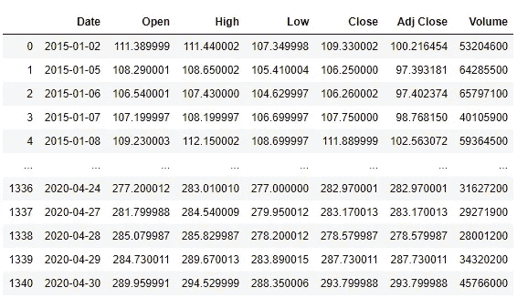
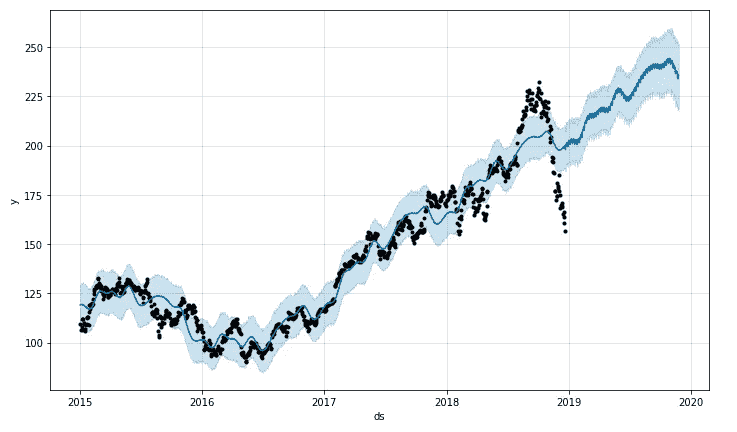
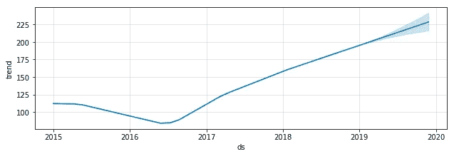
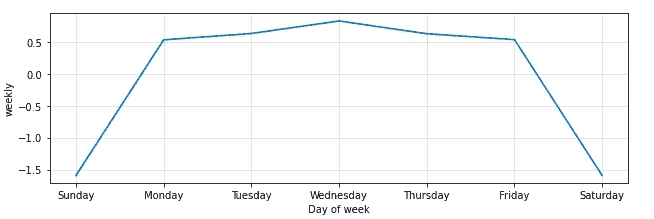
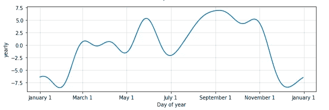
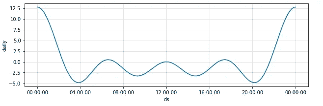
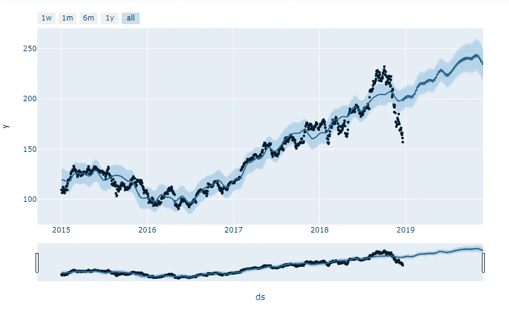

# 用脸书的预言家预测苹果公司的股价

> 原文：<https://towardsdatascience.com/predicting-apple-inc-stock-prices-using-facebooks-prophet-54ed6e91dbda?source=collection_archive---------43----------------------->

## 时间序列预测的最新方法


亚历克斯·哈尼在 [Unsplash](https://unsplash.com/?utm_source=medium&utm_medium=referral) 上的照片

时间序列预测是用于根据以前观察到的值预测未来值的模型。时间序列数据是在离散的时间尺度上记录的。

时间序列预测广泛应用于非平稳数据。统计属性(如均值和方差)不随时间变化的数据是非平稳数据。非平稳数据的最好例子是股票价格。

时间序列预测广泛用于预测销售和股票价格。已经有人尝试使用时间序列分析算法来预测股票价格，尽管它们仍然不能用于在真实市场中下注。

为了开发一种可以捕捉时间序列数据中季节性的模型，脸书开发了 Prophet，这是脸书数据科学团队发布的开源软件。

Prophet 试图捕捉每日、每周和每年的季节性以及假日效应，实现加法回归模型。

# 先知方程式

正如我前面引用的，Prophet 是一个加法回归模型。下面的等式代表了 Prophet 背后的数学。

> *y(t) = g(t) + s(t) + h(t) + e(t)*

g(t)代表趋势。Prophet 使用分段线性模型进行趋势预测。

s(t)代表周期性变化(每周、每月、每年)。

h(t)表示持续时间超过一天的假期的影响。假期影响商业。

e(t)涵盖了模型未涵盖的变更或错误。

Prophet 是一个易于使用的模型。它速度很快，不需要数据预处理。它处理带有几个异常值的缺失数据。

我们将尝试使用脸书的先知来预测苹果公司的股票价格。苹果公司的每日股票价格可以从雅虎财经网站下载。雅虎财经是股市数据的主要来源之一。我们将获得苹果公司自 2015 年以来的股价数据。


照片由[芙罗莉丝·安德烈亚](https://unsplash.com/@florisand?utm_source=medium&utm_medium=referral)在 [Unsplash](https://unsplash.com/?utm_source=medium&utm_medium=referral) 上拍摄

接下来，我们需要下载先知包。

```
conda install gccconda install -c conda-forge fbprophetconda install pystan #prophet dependency
```

现在，我们可以从模型的 Python 实现开始。

我们将从导入库和数据集开始。

```
#importing the libraries
import numpy as np
import pandas as pd
import matplotlib.pyplot as pltdata = pd.read_csv("F:\\AAPL.csv") 
data.head()
```



苹果股票价格数据集

我们需要数据集中的日期和收盘价，然后我们将把列“日期”和“收盘”分别重命名为“ds”和“y ”,因为这是 Prophet 的标准输入方式。这是 Prophet 要求的唯一预处理步骤。

```
data = data[['Date','Close']] #selecting the important features
data = data.rename(columns = {'Date':'ds','Close':'y'}) #renaming the columns of the dataset
```

接下来，我们将把数据分为训练和测试，因为我们不想在测试集上训练数据。如果我们隐藏测试数据，那么模型将会预测看不见的数据的值。我们希望机器只从以前的数据中学习，而不知道测试数据的趋势。

```
train = data.iloc[:1000,0:2] #training set(this will be the data to train the model)
test = data.iloc[1000:0:2] #we can use this data to compare the results of the predictions made by the model
```

接下来，我们将从 fbprophet 模块导入 prophet 类，然后创建 Prophet 类的一个对象。我们将把训练数据输入到模型中。

```
from fbprophet import Prophet
m = Prophet(daily_seasonality = True) #creating an object of the Prophet class
m.fit(train) #fitting the training data to the model
```

现在，对于最后一步，我们将要求模型预测未来值，然后尝试将预测可视化。

```
future = m.make_future_dataframe(periods=341) #we need to specify the number of days in future, for which we want to predict the prices
prediction = m.predict(future)
m.plot(prediction)
```



苹果股票价格

如果您想要查看预测组件、周组件、季组件、年组件和假日组件，那么您可以使用以下命令。

```
m.plot_components(prediction)
```



Prophet 还提供了一个交互式的预测图。这显示了过去一周、一个月、六个月和一年内的预测。为此，我们需要安装 Plotly，它不会随 fbprophet 一起安装，只需在命令提示符下键入'*pip install Plotly【T1]'即可。*

```
from fbprophet.plot import plot_plotly
import plotly.offline as py
py.init_notebook_mode()
fig = plot_plotly(m, prediction)
py.iplot(fig)
```



股票价格的交互式图表

尝试为不同的数据集实现该模型，看看它是否对您有益。

***来自《走向数据科学》编辑的提示:*** *虽然我们允许独立作者根据我们的* [*规则和指导方针*](/questions-96667b06af5) *发表文章，但我们不认可每个作者的贡献。你不应该在没有寻求专业建议的情况下依赖一个作者的作品。详见我们的* [*读者术语*](/readers-terms-b5d780a700a4) *。*