# 预测新冠肺炎时代的苹果股票

> 原文：<https://towardsdatascience.com/predicting-apple-stock-in-times-of-coronavirus-ca434bd2f788?source=collection_archive---------21----------------------->

## 简单是关键。

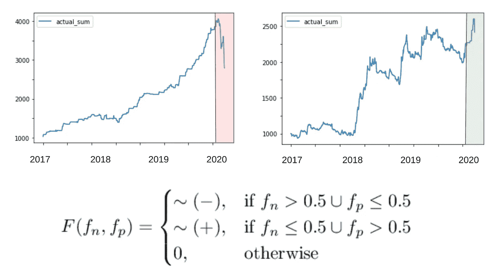

# 介绍

2 月 13 日，我发表了一篇关于“[使用连续 ML](/making-a-continual-ml-pipeline-to-predict-apple-stock-with-global-news-python-90e5d6610b21) 预测苹果股票的杰出成果”的文章。

有人建议**在**“不受欢迎”的场景**中尝试一下**，所以我重新运行了一个改进的练习**，包括最后几周**，看看它在这些**艰难时期**的表现。

# 我们要做什么

*   步骤 1:定义并理解 ML 的**目标**
*   步骤 2:设置技术**先决条件**
*   第三步:**获取数据**
*   步骤 4: **准备**我们的数据和**应用 ML** 运行模拟
*   步骤 5:测量和分析**结果**

# 第一步。定义和理解目标

****免责声明:*** *本次演习中有交易、做空佣金等费用未考虑在内。* ***作者不分担使用本文所带来的风险或利益*** *。*

苹果价格一直在上涨，但也在下跌，比如最近几周。

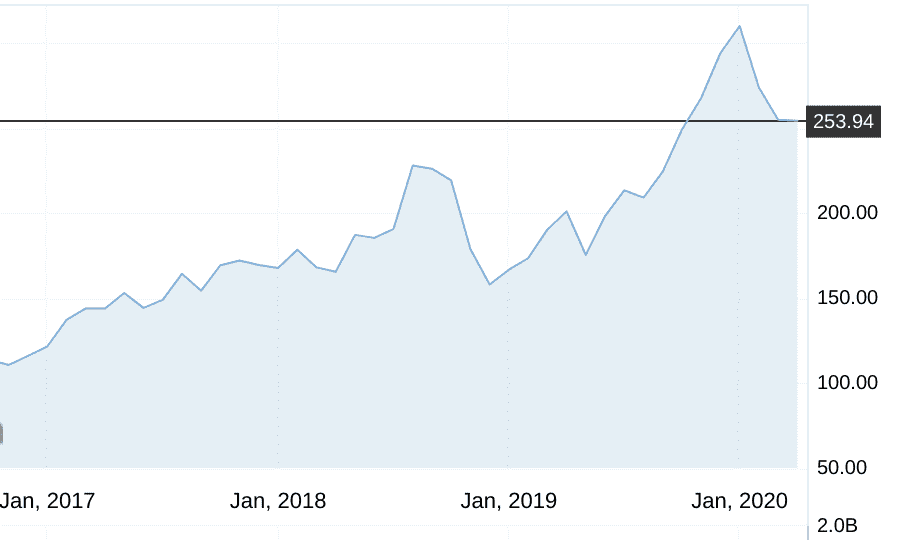

截图取自 Investing.com

我们想要的是检测第二天的*价格是否会**上涨**或**下跌**，这样我们就可以**在前一天**买入或做空。*

我们还希望变化率**高于 0.5%** ，这样交易就值得了。


随着时间而改变

上面是随着时间的变化，绿点是价格上涨超过 0.5%的天数，红点是相反的。

让我们**定义我们的目标变量**:

**阳性 POC:** “变化”增加超过 0.5%

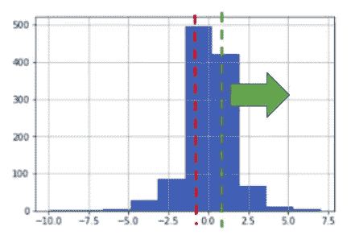

**阴性 POC:** “变化”下降超过 0.5%

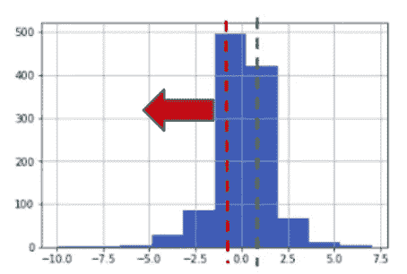

在最后一篇文章中，我们创建了一个 ML 模型，使用新闻来预测第二天的**起义**以及随后的**表现**:

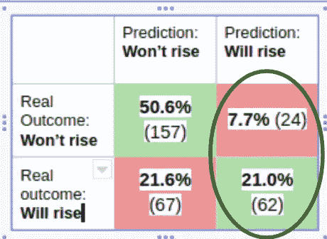

这意味着，从所有的观察来看，这个**模型预测**第二天价格将**上涨 0.5%** 或更多(82 倍)，这是**正确 72%** **倍** (62 倍)。

这个比率(也就是**精度:** TP / TP & FP)是**一个重要的指标**，因为对于这个实验，每次预测为“将上升”(或者预测为下降时为“短”】时，我们都会“**投资”，所以我们通常会优先考虑正确与否，即使我们会失去一些机会。**

现在让我们现在**制作一个模型来预测上涨和下跌**在“牛市”和“熊市”的时候。

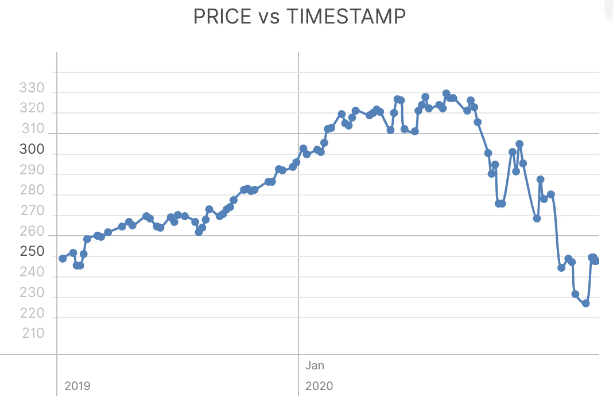

苹果价格过去几个月受到石油和新冠肺炎的影响

# 第二步。先决条件

*   安装 Python 2.6+或 3.1+版本
*   安装熊猫、sklearn 和 openblender(带 pip)

```
$ pip install pandas OpenBlender scikit-learn
```

# 第二步。获取数据

*注意:这一步重复了第一篇文章中所做的，所以如果你已经做了，你可以跳过它。*

让我们从每日[苹果股票数据集中提取](https://www.openblender.io/#/dataset/explore/5d4c39d09516290b01c8307b/or/38)


它在那一天有百分之**的变化**。

所以让我们**通过 OpenBlender API **拉数据**。**

在 Python 上运行以下代码:

```
# Import the librariesfrom sklearn.ensemble import RandomForestRegressor
from sklearn.metrics import accuracy_score
from sklearn.metrics import roc_auc_score
from sklearn import metrics
import pandas as pd
import OpenBlender
import json
%matplotlib inline*# Specify the action* action = 'API_getObservationsFromDataset'*# Specify your Token 
token =* '**YOUR_TOKEN_HERE**' *# Specify the 'Apple Inc. Price' id_dataset*parameters = { 
      'token' : token,
      'id_dataset':'**5d4c39d09516290b01c8307b**',
      'consumption_confirmation' : 'on',
      'date_filter':{"start_date":"2017-01-01T06:00:00.000Z",
                     "end_date":"2020-03-29T06:00:00.000Z"}
}*# Pull the data into a Pandas Dataframe* df = pd.read_json(json.dumps(OpenBlender.call(action, parameters)['sample']), convert_dates=False, convert_axes=False).sort_values('timestamp', ascending=False)
df.reset_index(drop=True, inplace=True)
```

**注意:**要获得令牌，你*需要*在 [openblender.io](https://www.openblender.io/#/dataset/explore/5d4c39d09516290b01c8307b/or/38) (免费)上创建一个帐户，你可以在你个人资料图标的“帐户”标签中找到它。

```
#Let's take a look
df.head()
```

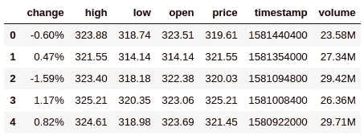

为了融合商业新闻，我们需要:

1.  与我们的目标相关的有用的新闻数据
2.  **将它**融合到我们的数据中，使**消息与第二天的价格**“变化”(这样模型就可以学习预测第二天的价格)
3.  将它转换成**数字特征**，这样它就可以遍历一个 ML 模型。

让我们来看看这个[华尔街日报新闻](https://www.openblender.io/#/dataset/explore/5e2ef74e9516294390e810a9/or/38)数据集:


以及[今日美国](https://www.openblender.io/#/dataset/explore/5e32fd289516291e346c1726/or/38)推特新闻。

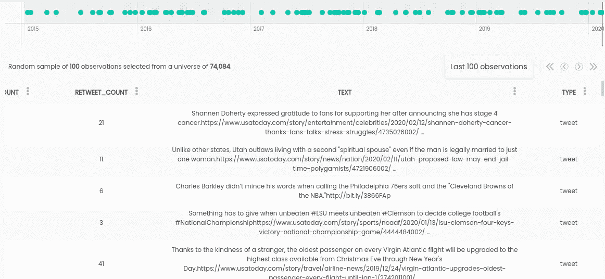

*   注意:我选择这些是因为它们有意义，但你可以搜索数百个其他的。

现在，让我们创建一个文本矢量器，这是 OpenBlender 上的一个模型，它能够**将令牌(矢量化文本)作为特征**，就像它是另一个数据集一样:

```
action = 'API_createTextVectorizerPlus'parameters = {
    'token' : token,
    'name' : 'Wall Street and USA Today Vectorizer',
    'sources':[
              {'id_dataset':"5e2ef74e9516294390e810a9", 
               'features' : ["text"]},
              {'id_dataset' : "5e32fd289516291e346c1726", 
               'features' : ["text"]}
    ],
    'ngram_range' : {'min' : 1, 'max' : 2},
    'language' : 'en',
    'remove_stop_words' : 'on',
    'min_count_limit' : 2
}response = OpenBlender.call(action, parameters)
response
```

根据上述内容，我们指定了以下内容:

*   **名称:**我们将其命名为“华尔街和今日美国矢量器”
*   **sources** :作为源包含的数据集的 id 和源列(在这种情况下，两者都只有一个名为“text”)
*   **ngram_range** :将被分词的单词集的最小和最大长度
*   **语言**:英语
*   **remove_stop_words** :这样就从源头上消除了停用词
*   **min_count_limit** :被认为是令牌的最小重复次数(出现一次很少有帮助)

现在，如果我们转到 OpenBlender 的仪表板，我们可以看到矢量器:

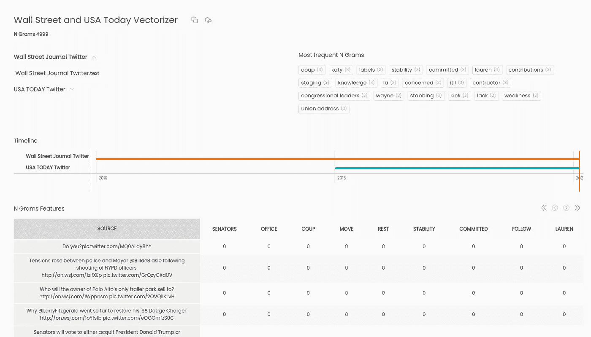

它生成了 4999 个 n-gram，这些 n-gram 是最多 2 个单词的令牌的**二进制特征**，如果提到了 **n-gram 则为“1”**否则为“0”。

# 第三步。准备数据

现在**我们希望矢量化数据**在 **24 小时时滞**内压缩，并与第二天的**苹果股票价格一致。**

你需要添加你的**矢量器的 id** (它是由 API 返回的，或者你可以在 OpenBlender 中得到它。

**注:要下载* ***所有的矢量化数据*** *你需要支付大约 6 美元升级到 OpenBlender 的“现收现付”。您仍然可以继续处理一小部分数据，从而缩短日期间隔。*

```
action = 'API_getObservationsFromDataset'interval = 60 * 60 * 24 # One dayparameters = { 
      'token' : token,
      'id_dataset':'5d4c39d09516290b01c8307b',
      'date_filter':{"start_date":"2017-01-01T06:00:00.000Z",
                     "end_date":"2020-03-29T06:00:00.000Z"},
      'aggregate_in_time_interval' : {
              'time_interval_size' : interval, 
              'output' : 'avg', 
              'empty_intervals' : 'impute'
      },
      'blends' :
       [{"id_blend" : "**5e46c8cf9516297ce1ada712**",
         "blend_class" : "closest_observation", 
         "restriction":"None",
         "blend_type":"text_ts",
         "specifications":{"time_interval_size" : interval}
       }],
       'lag_feature' : {'feature' : 'change', 'periods' : [-1]}
}df = pd.read_json(json.dumps(OpenBlender.call(action, parameters)['sample']), convert_dates=False, convert_axes=False).sort_values('timestamp', ascending=False)
df.reset_index(drop=True, inplace=True)
```

这是与之前相同的服务调用，但是有一些新的参数:

*   **aggregate _ in _ time _ interval**:以 24 小时为间隔平均汇总数据，如果有间隔没有观测值，则进行估算
*   **混合**:按时间加入聚合的新闻 24 小时数据
*   **lag_feature** :我们希望“变化”功能与过去 24 小时内发生的新闻保持一致

让我们来看看最上面的数据:

```
print(df.shape)
df.head()
```

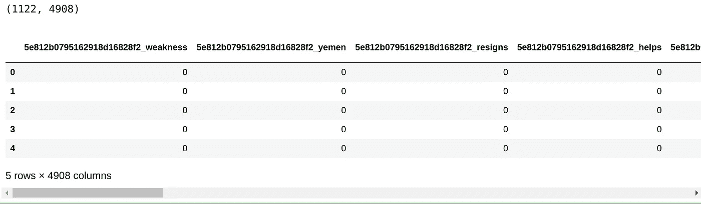

我们有 **1122** 观察和 **4908** 特征。其中大部分是来自矢量器的 **n-grams** ，我们也有我们原始的**苹果股票**数据集。

“ **lag-1_change** ”简单地说就是**将**“change”值与“**前一天的数据**对齐，这正是我们所需要的。最后一个观察是 NaN，因为那是“明天”将要发生的事情。

现在让**按照之前的定义创建我们的目标特征**:

```
# Where ‘change’ **decreased** more than 0.5%
df['negative_poc'] = [1 if val < 0.5 else 0 for val in df['lag-1_change']]# Where ‘change’ **increased** more than 0.5%
df['positive_poc'] = [1 if val > 0.5 else 0 for val in df['lag-1_change']]df[['lag-1_change', 'positive_poc', 'negative_poc']].head()
```

# 步骤 3.5 应用 ML 并运行模拟

我们想要 **2 个模型**，一个将预测价格是否会**上涨**(高于 0.5%)，一个将预测等量的下跌，然后**将两者结合到交易策略**。

此外，我们希望通过时间来训练和测试，以便模型学习相关信息。

最后，我们希望**模拟**，如果我们以**1000 美元开始，**我们会以结束。

```
# First we create separeate dataframes for positive and negativedf_positive = df.select_dtypes(['number']).iloc[::-1]
for rem in ['negative_poc']:
    df_positive = df_positive.loc[:, df_positive.columns != rem]df_negative = df.select_dtypes(['number']).iloc[::-1]
for rem in ['positive_poc']:
    df_negative = df_negative.loc[:, df_negative.columns != rem]
```

给定一个数据帧和一个目标，下一个函数将返回应用 ML 的**结果和一个带有预测与结果的数据帧。**

```
def getMetricsFromModel(target, df):
    # Create train/test sets
    X = df.loc[:, df.columns != target]
    X = X.loc[:, X.columns != 'lag-1_change'].values
    y = df.loc[:,[target]].values

    # Create X and y.
    div = int(round(len(X) * 0.89))

    real_values = df[div:].loc[:,['lag-1_change']].values

    X_train = X[:div]
    y_train = y[:div] X_test = X[div:]
    y_test = y[div:]

    # Perform ML
    rf = RandomForestRegressor(n_estimators = 1000, random_state = 1)
    rf.fit(X_train, y_train)
    y_pred = rf.predict(X_test)

    # Get Metrics
    print("AUC score:")
    auc = roc_auc_score(y_test, y_pred)
    print(auc)
    print('---') preds = [1 if val > 0.6 else 0 for val in y_pred]
    print('Confusion Matrix:')
    conf_matrix = metrics.confusion_matrix(y_test, preds)
    print(metrics.confusion_matrix(y_test, preds))
    print('---')

    print('Acurracy:')
    acc = accuracy_score(y_test, preds)
    print(acc)
    print('---')

    df_compare = pd.DataFrame({'real_values' : real_values.ravel(), 'y_test' : y_test.ravel(), 'preds' : y_pred})

    return auc, conf_matrix, acc, df_compare
```

我们希望通过 300 次观察和**预测在接下来的 50 个**跳跃日进行时间**迭代学习，因此我们**在每次跳跃**时进行再训练。**


当我们这样做时，我们希望**从我们的两个模型中收集建议**(负面/正面)。

```
df_compare_acc = None
for i in range(0, df_positive.shape[0] - 450, 50):
    print(i)
    print(i + 450)
    print('-')
    auc, conf_matrix, acc, df_compare_p = getMetricsFromModel('positive_poc', df_positive[i : i + 450])
    auc, conf_matrix, acc, df_compare_n = getMetricsFromModel('negative_poc', df_negative[i : i + 450])
    df_compare = df_compare_p[['y_test', 'real_values']]
    df_compare.rename(columns={'y_test':'price_rised_5'}, inplace=True)
    df_compare['F_p'] = df_compare_p['preds']
    df_compare['price_dropped_5'] = df_compare_n['y_test']
    df_compare['F_n'] = df_compare_n['preds']
    df_compare
    if df_compare_acc is None:
        df_compare_acc = df_compare
    else:
        df_compare_acc = pd.concat([df_compare_acc, df_compare], ignore_index=True)
```

让我们来看看结果。

```
df_compare_acc
```

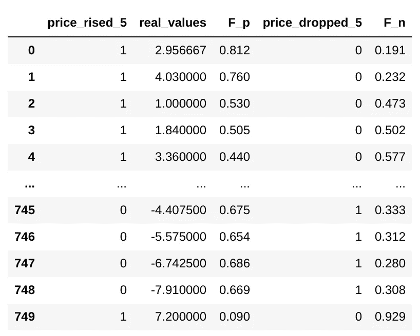

> **实际值** =价格的实际百分比变化
> 
> **price_rised_5** =如果变化> 0.5
> 
> F_p =上升区间(0，1)内的预测
> 
> **价格 _ 下降 _5** =如果变化> -0.5
> 
> **F_n** =下降范围(0，1)内的预测

我们的组合模型很简单，如果**一个模型推荐，另一个不反对**，我们买入/做空:

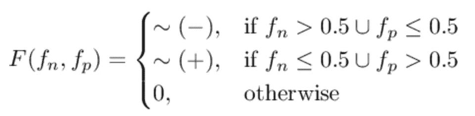

```
# This function will run a simulation on all the tested data 
# given an invested 'starting_sum' and will return its
# trayectory.def runSimulation(include_pos, includle_neg, starting_sum): 
    sum_lst = []
    actual_sum = starting_sum
    for index, row in df_compare_acc.iterrows(): if row['F_p'] > 0.5 and row['F_n'] < 0.5 and include_pos:
            actual_sum = actual_sum + (actual_sum * (row['real_values'] / 100)) if row['F_n'] > 0.5 and row['F_p'] < 0.5 and includle_neg:
            actual_sum = actual_sum - (actual_sum * (row['real_values'] / 100)) sum_lst.append(actual_sum)
    return sum_lst
```

让我们首先运行模型**，只有“积极的”预测**。

```
sum_lst = runSimulation(**True**, **False**, 1000)
df_compare_acc['actual_sum'] = sum_lst
print(sum_lst[len(sum_lst)-1])
df_compare_acc.plot(y = ['actual_sum'])
```

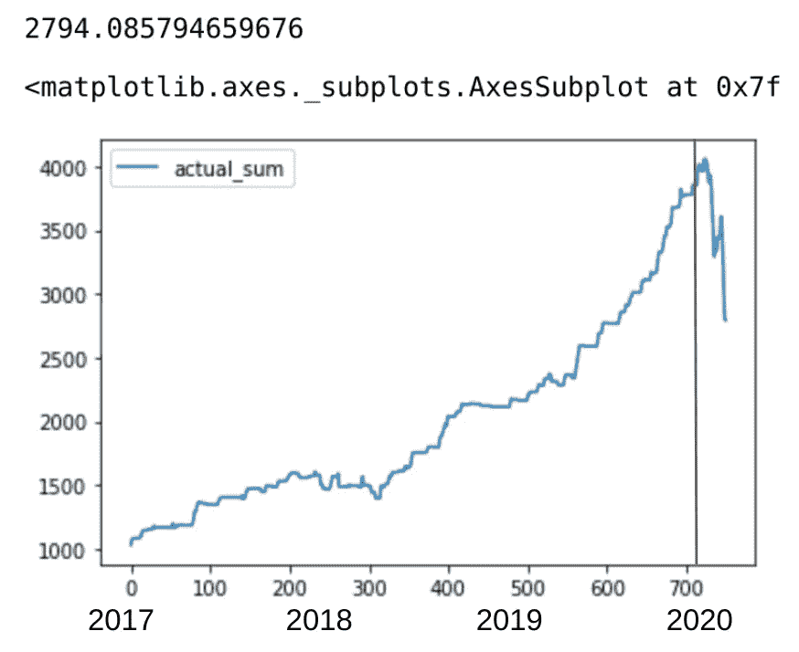

在当前的 COVID/oil/recession 形势下，它绝对暴跌，失去了近一半的收益。

现在让我们只使用**负面预测**来尝试一下。

```
sum_lst = runSimulation(**False**, **True**, 1000)
df_compare_acc['actual_sum'] = sum_lst
print(sum_lst[len(sum_lst)-1])
df_compare_acc.plot(y = ['actual_sum'])
```

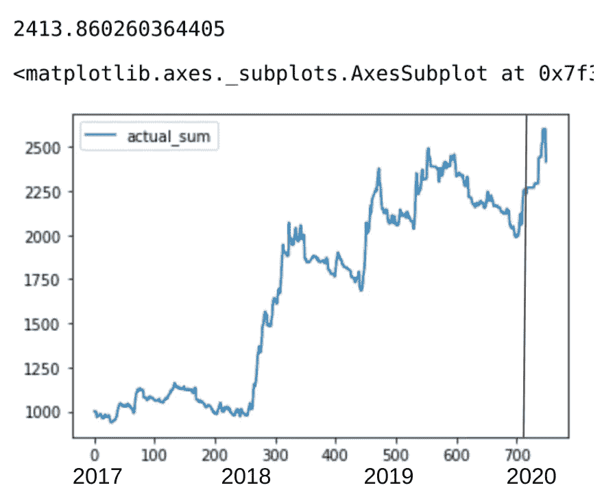

因此，它的整体表现不如正面，但它**现在真的表现很好**在 covid 时间。

现在，让我们一起运行。

```
sum_lst = runSimulation(**True**, **True**, 1000)
df_compare_acc['actual_sum'] = sum_lst
print(sum_lst[len(sum_lst)-1])
df_compare_acc.plot(y = ['actual_sum'])
```

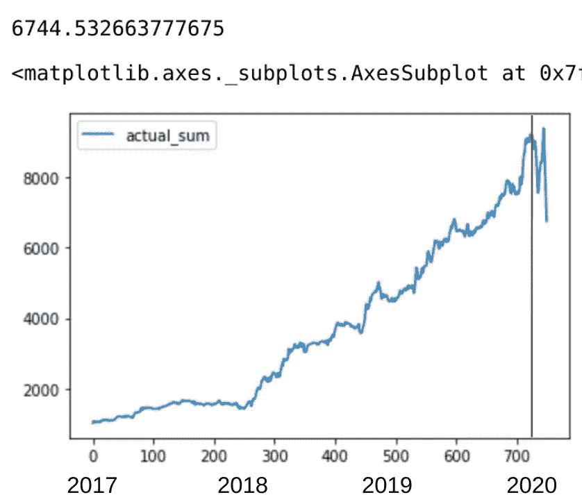

这是**迄今为止表现最好的模型**，以 574.4%的回报率结束了 3 年期，但**这些天仍然非常不稳定**。

至此，自 1 月 20 日结束以来，其**损失了近 25%** ，而苹果价格**仅暴跌 20%** 。

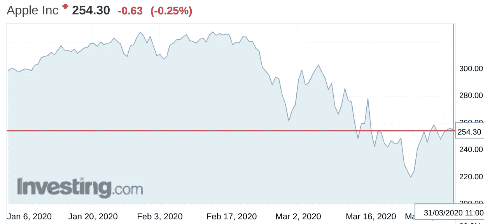

需要做的是**根据情况优先考虑**正面或负面建议**。**

几天后，我将发表一篇**后续文章**，介绍一个模型的结果，该模型的**根据**增加或减少**多长时间来最大化回报，在正/负**建议之间切换。