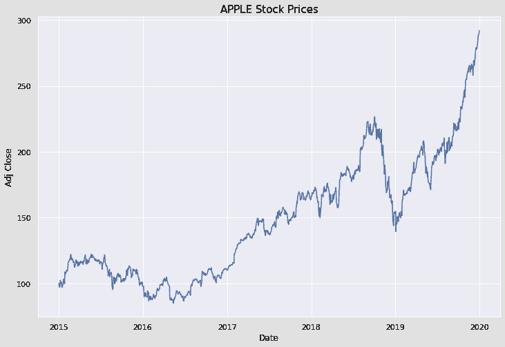
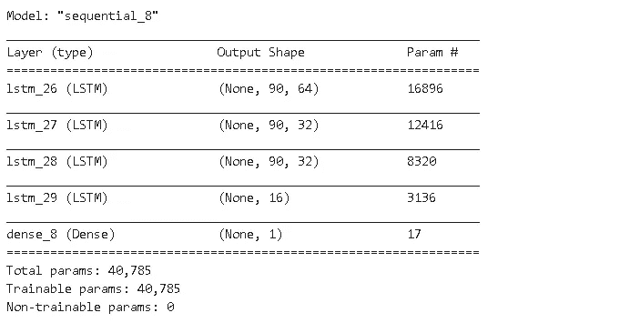
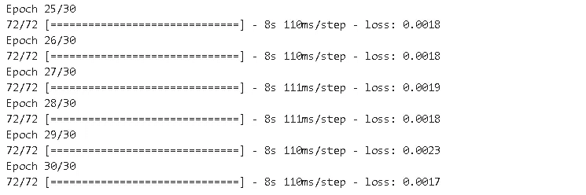
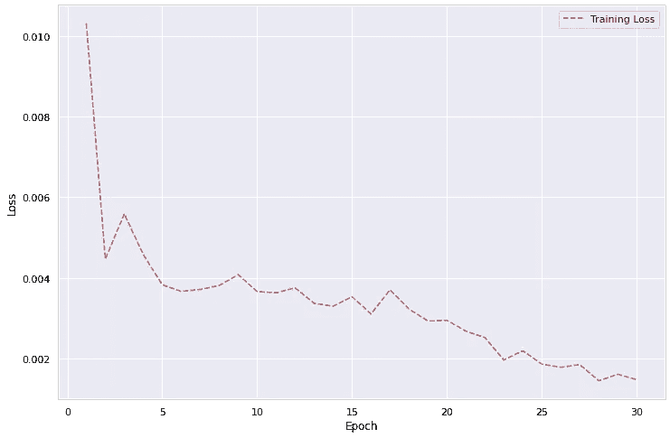
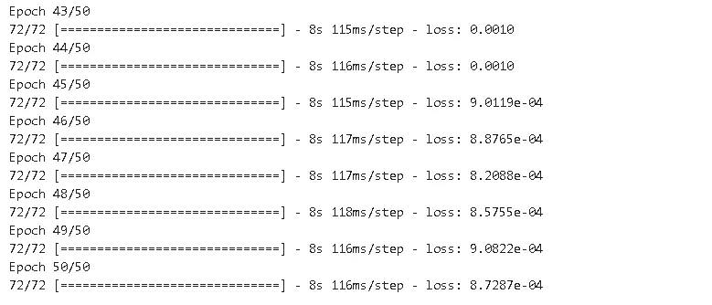
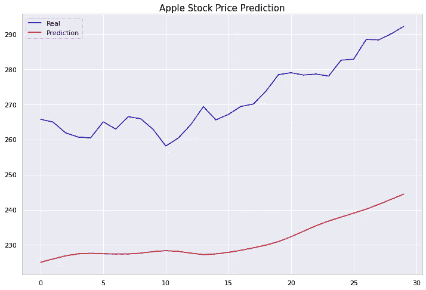

# 用神经网络预测苹果股票价格

> 原文：<https://towardsdatascience.com/predicting-apple-stock-prices-with-neural-networks-4aefdf10afd0?source=collection_archive---------26----------------------->

## 如何使用递归神经网络预测股票价格？


克里斯·利维拉尼在 [Unsplash](https://unsplash.com/s/photos/stock?utm_source=unsplash&utm_medium=referral&utm_content=creditCopyText) 上的照片

股票价格预测肯定不是一件容易的事情，因为有许多因素需要考虑。整体市场状况、竞争对手的表现、新产品发布、全球关系的缓和都是有可能提高或降低股价的一些关键因素。除此之外，还可能发生意想不到的事件，例如我们目前遇到的冠状病毒情况。

我们到目前为止列出的因素很难预测。因此，在这篇文章中，我们将把它们放在一边。可以用来预测股票价格的一个关键因素是历史价格。例如，如果一只股票已经稳定上涨了两年，我们可能会认为它还会继续上涨一个月。然而，股票通常不会遵循简单的连续上升或下降趋势。因此，我们需要更复杂的工具来进行难以捕捉的观察。

LSTM(长短期记忆)，这是一种 RNN(递归神经网络)，可用于预测股票价格使用历史数据。LSTM 适合对序列数据建模，因为它维护一个内部状态来跟踪它已经看到的数据。LSTMs 的常见应用包括时间序列分析和自然语言处理。

让我们首先使用 pandas **datareader** 模块获取数据。它使得用几行代码获取股票价格数据变得非常简单。

```
import numpy as np
import pandas as pd
from pandas_datareader import dataaapl = data.DataReader("AAPL", 
                        start='2015-1-1',
                        end='2019-12-31',
                        data_source='yahoo')
```

仅此而已！我们现在已经将 2015 年至 2020 年的苹果股价数据保存在熊猫数据框架中。


我们将使用调整后的收盘价格。我们来看看 2015 年到 2020 年的大趋势。

```
#import dataviz libraries
import matplotlib.pyplot as plt
import seaborn as sns
sns.set(style='darkgrid')
%matplotlib inline#Plot "Adj Close"
plt.figure(figsize=(12,8))
plt.title("APPLE Stock Prices", fontsize=15)
sns.lineplot(x=aapl.index, y='Adj Close', data=aapl)
```



2015 年似乎不是一个盈利的一年，随后是近 3 年的稳定上升趋势。我们观察到 2019 年底的急剧下降，随后是大约一年的稳定增长。

我们将尝试对 LSTM 层使用过去 90 天(即从 t-90 到 t-1)的历史价格来预测时间 t 的价格。请记住，我们将努力捕捉趋势，而不是确切的价格。

LSTM 要求输入是具有形状(batch_size，timesteps，input_dim)的 3D 张量。

由于我们使用 90 天(t-90 到 t-1)的历史数据在时间 t 进行预测，因此**时间步长**的数量为 90。我们仅使用“Adj Close”价格进行预测，因此 **input_dim** 为 1。Input_dim 可以通过添加附加功能来增加。例如，竞争对手股票价格的价值可能会影响苹果公司的股票价格。如果我们还使用第二个变量来进行预测，那么 input_dim 将是 2。 **batch_size** 是在更新权重之前馈入 LSTM 层的观测值的数量。

# **数据预处理**

我们需要格式化数据，使每个输入包含 90 天期间(t-90 到 t-1)的股票价格，目标是时间 t 的价格。我们可以使用基本的 for 循环，如下所示:

```
hist = []
target = []
length = 90adj_close = aapl['Adj Close']for i in range(len(adj_close) - length):
   x = adj_close[i:i+length]
   y = adj_close[i+length]
   hist.append(x)
   target.append(y)
```

“hist”的每个元素是 90 个项目的列表。既然我们加 1，那么“hist”的第二个元素的最后一项一定等于“target”的第一个元素。我们来确认一下:

```
hist[1][89] == target[0]
True
```

“历史”和“目标”是列表。我们需要将它们转换成 numpy 数组，并将目标变量整形为二维数组。

```
hist = np.array(hist)
target = np.array(target)
target = target.reshape(-1,1)print(hist.shape)
print(target.shape)(1168, 90) 
(1168, 1)
```

由于在神经网络中进行了过多的计算，因此最好将这些值标准化。标准化可以通过一些简单的数学运算来完成，或者可以使用库的预定义函数。我会用 scikit-learn 的 **MinMaxScaler** 。默认情况下，它将值规范化为范围[0，1]。

我们正在进行一项监督学习任务。我们将使用一些数据来训练该模型，并使用以前未见过的数据来测试其性能。因此，我们需要将数据分成训练集和测试集。为了获得准确的性能结果，模型不应该有任何关于测试集中数据的线索。在标准化数据时，我们也应该记住这一点。我们首先需要拆分数据。然后分别应用归一化。

```
#train/test splitX_train = hist[:1138]
X_test = hist[1138:]y_train = target[:1138]
y_test = target[1138:]
```

我们以这样一种方式分割数据，即用 1138 天的数据训练模型，并用随后 30 天的数据进行测试。

我们现在可以进行标准化了。我们将首先创建一个 MinMaxScaler 对象，并对训练集应用 **fit_transform** 方法。然后，我们将仅对测试集应用**转换**方法。进行这种分离是非常重要的。否则，我们将会从测试集中向模型泄露信息。

```
from sklearn.preprocessing import MinMaxScaler
sc = MinMaxScaler()#train set, fit_transform
X_train_scaled = sc.fit_transform(X_train)
y_train_scaled = sc.fit_transform(y_train)#test set, only transform
X_test_scaled = sc.transform(X_test)
y_test_scaled = sc.transform(y_test)
```

数据预处理的最后一步是将输入转换为三维数组，因为 LSTM 接受三维数组作为输入。

```
X_train_scaled = X_train_scaled.reshape((len(X_train_scaled), length, 1))X_test_scaled = X_test_scaled.reshape((len(X_test_scaled), length, 1))
```

# **型号**

我们将使用 Keras 的 LSTM 层实现神经网络，Keras 是 TensorFlow 的高级 API。

```
import tensorflow as tf
from tensorflow.keras import layers
```

我们将创建一个有 4 个 LSTM 层和一个密集层的序列模型。

```
model = tf.keras.Sequential()model.add(layers.LSTM(units=64, return_sequences=True, input_shape=(90,1), dropout=0.2))model.add(layers.LSTM(units=32, return_sequences=True, dropout=0.2))model.add(layers.LSTM(units=32, return_sequences=True, dropout=0.2))model.add(layers.LSTM(units=16, dropout=0.2))model.add(layers.Dense(units=1))model.summary()
```



有一些要点需要记住:

*   如果一个 LSTM 层后面是另一个 LSTM 层， **return_sequences** 参数必须设为真。
*   **输入 _ 形状**参数只需要为第一个 LSTM 层指定。对于其他层，模型根据前一层的输出计算出输入。
*   **Input_shape** 参数是一个包含**时间步长**和 **input_dim** 的元组。Batch_size 是在训练期间指定的。
*   **单位**参数是一层中使用的节点数。没有严格的规则来定义最佳节点数。
*   **剔除**用于防止模型过拟合。
*   密集图层的单位应为 1，因为它被用作输出图层。

我们现在可以通过指定优化器和损失函数来编译模型。

```
model.compile(optimizer='adam', loss='mean_squared_error')
```

然后，我们训练模型。

```
history = model.fit(X_train_scaled, y_train_scaled, 
                    epochs=30, batch_size=16)
```

我们已经讨论了 batch_size。Epochs 表示整个数据集输入神经网络的次数。



你在每个时期都会看到数字 72。它来自训练点数除以批量大小。X_train_scaled 有 1138 个数据点。批量大小为 16。1138/15=71.125，所以它在 72 个周期内完成。

该模型实现了 0.0017 的 MSE。让我们看看它是如何通过 30 个时代发生变化的。

```
loss = history.history['loss']
epoch_count = range(1, len(loss) + 1)plt.figure(figsize=(12,8))
plt.plot(epoch_count, loss, 'r--')
plt.legend(['Training Loss'])
plt.xlabel('Epoch')
plt.ylabel('Loss')
plt.show();
```



该损失呈下降趋势，在第 25 个纪元后低于 0.002。然而，该模型尚未收敛。如果我们做更多的纪元，损失似乎会继续减少。让我们试试 50 个纪元。



现在亏损在 0.001 以下。请注意，不断减少损失并不总是最佳做法。过了一段时间后，我们可能会有一个过度拟合的模型，它过于关注训练集，而不是很好地推广。

是时候做预测了。我们将尝试预测未来 30 天的股票价格趋势。请记住，我们的目标是预测趋势，而不是实际价格。

```
pred = model.predict(X_test_scaled)
pred_transformed = sc.inverse_transform(pred)y_test_transformed = sc.inverse_transform(y_test_scaled)plt.figure(figsize=(12,8))
plt.plot(y_test_transformed, color='blue', label='Real')
plt.plot(pred_transformed, color='red', label='Prediction')
plt.title('Apple Stock Price Prediction')
plt.legend()
plt.show()
```



尽管这些值不完全匹配，但我们能够预测 30 天内的总体趋势。该模型在几天后的第 7 天到第 10 天之间对下降做出反应。然后它赶上了上升趋势。

有许多方法可以尝试改进该模型的性能。您可以通过调整获得更好的结果:

*   层数
*   一层中的节点数
*   时间步数
*   辍学率
*   时代数
*   批量

感谢您的阅读。如果您有任何反馈，请告诉我。