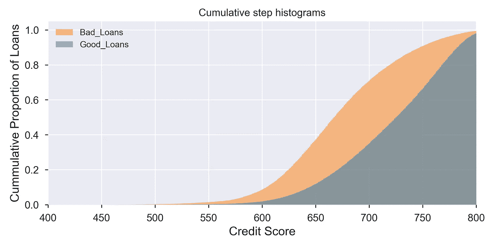
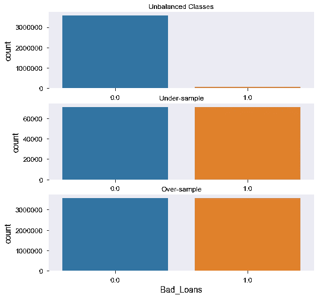
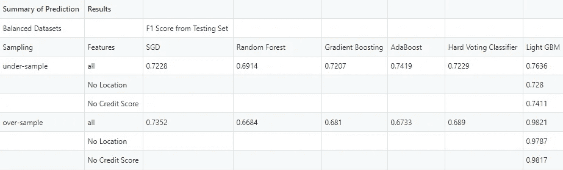
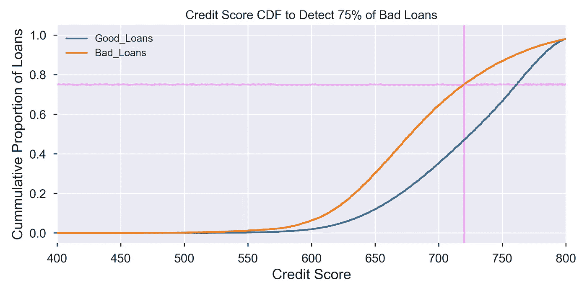
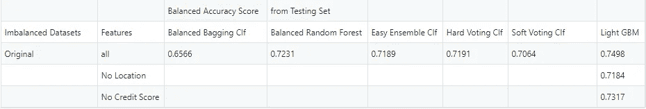
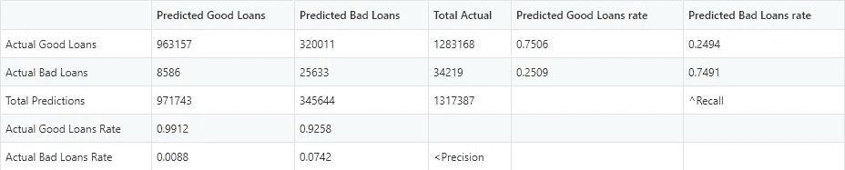
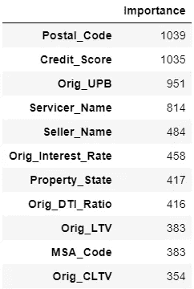

# 使用公共房地美数据预测不良住房贷款——使用不平衡数据的教程

> 原文：<https://towardsdatascience.com/predicting-bad-housing-loans-using-public-freddie-mac-data-a-tutorial-on-working-with-imbalanced-d2852c003996?source=collection_archive---------26----------------------->

## 机器学习能阻止下一次次贷危机吗？

房地美(Freddie Mac)是一家美国政府支持的企业，购买单户住房贷款，并将其打包作为抵押贷款支持证券出售。二级抵押贷款市场增加了新住房贷款的资金供应。然而，如果大量贷款违约，这将对经济产生连锁反应，就像我们在 2008 年金融危机中看到的那样。因此，迫切需要开发一种机器学习管道来预测贷款发放时贷款是否会违约。

在这个分析中，我使用了来自房地美单户贷款级别数据集的数据。数据集由两部分组成:(1)贷款发放数据，包含贷款开始时的所有信息；以及(2)贷款偿还数据，记录贷款的每次支付以及任何不利事件，如延迟支付甚至抛售。我主要使用还款数据来跟踪贷款的最终结果，使用原始数据来预测结果。原始数据包含以下几类字段:

1.  **唯一标识符**:贷款 _ 序列号
2.  **借款人财务信息:**信用评分、首次购房者标志、原始债务收入比(DTI)、借款人数、居住状况(主要住所、投资或第二套住房)
3.  **贷款信息:** First_Payment (date)，Maturity_Date，MI_pert (%抵押担保)，原始 LTV(贷款与价值)比率，原始组合 LTV 比率，原始利率，原始未付余额，PPM(提前还款罚金抵押)标志，贷款目的(购买与再贷款)，原始贷款期限，超符合标志
4.  **房产信息:**单元数量，房产类型(公寓，独栋住宅等。)
5.  **位置:** MSA_Code(大都市统计区)，属性 _ 州，邮政编码
6.  **卖家/服务商信息:**渠道(零售、经纪等。)、卖家名称、服务商名称

传统上，次级贷款被定义为信用分数为 600 或 650 的任意分界点。但这种方法是有问题的，即 600 的临界值仅占不良贷款的约 10 %, 650 仅占不良贷款的约 40%。我的希望是，原始数据的附加特征会比信用评分的硬性限制表现得更好。

按好贷款与坏贷款分组的信用评分累积直方图

> **因此，该模型的目标是根据贷款发放数据预测贷款是否为坏账。** *在这里，我定义“好”贷款是指已经全部还清的贷款，“坏”贷款是指因任何其他原因而终止的贷款。*为简单起见，我只检查 1999 年至 2003 年间产生的贷款，这些贷款已经终止，因此我们不必处理中间状态的持续贷款。其中，我将使用 1999-2002 年的贷款作为训练集和验证集；以 2003 年的数据作为测试集。

这个数据集的最大挑战是结果有多不平衡，因为不良贷款仅占所有终止贷款的大约 2%。在这里，我将展示解决这个问题的四种方法:

1.  **欠采样**
2.  **过采样**
3.  **把它变成一个异常检测问题**
4.  **使用不平衡集成分类器**

让我们开始吧:

过度/欠采样前后的不良贷款计数

**1。** **欠采样**

此处的方法是对多数类进行子采样，使其数量大致与少数类相匹配，从而使新数据集达到平衡。在测试的分类器(*)列表下，这种方法似乎在 70–75%的 F1 分数下工作正常。欠采样的优势在于，您现在处理的数据集更小，这使得训练速度更快。另一方面，由于我们只是从良好贷款中抽取了一部分数据，我们可能会遗漏一些可以定义良好贷款的特征。

(*)使用的分类器:SGD、随机森林、AdaBoost、梯度增强、来自上述所有分类器的硬投票分类器以及 LightGBM

**2。过采样**

与欠采样类似，过采样意味着对少数群体(在我们的例子中是不良贷款)进行重采样，以匹配多数群体的数量。这样做的好处是，您可以生成更多的数据，因此您可以训练模型，使其比原始数据集更适合。然而，缺点是由于较大的数据集而降低了训练速度，以及由于更同质的不良贷款类别的过度表现而导致的过度拟合。对于房地美数据集，许多分类器在训练集上显示出 85-99%的高 F1 分数，但在测试集上测试时崩溃到 70%以下。唯一的例外是 [LightGBM](https://lightgbm.readthedocs.io/en/latest/Parameters.html#objective-parameters) ，其在所有训练、验证和测试集上的 F1 分数都超过了 98%。

欠采样/过采样后分类器的性能

**欠采样/过采样**的问题在于，对于现实应用来说，这不是一个现实的策略。不可能在贷款开始时预测贷款是否是不良贷款。因此，我们不能使用上述两种方法。作为旁注，当用于评估不平衡数据时，准确性或 F1 分数会偏向多数类。因此，我们将不得不使用一种叫做[平衡准确度得分](https://scikit-learn.org/stable/modules/generated/sklearn.metrics.balanced_accuracy_score.html)的新指标来代替。虽然我们知道准确度分数是(TP+TN)/(TP+FP+TN+FN)，但是平衡的准确度分数对于类的真实身份是平衡的，使得(TP/(TP+FN)+TN/(TN+FP))/2。

**3。将其转化为异常检测问题**

在很多时候，不平衡数据集的分类实际上与异常检测问题没有什么不同。“阳性”案例非常罕见，因此在训练数据中没有得到很好的代表。如果我们可以使用无监督学习技术将它们作为离群值来捕捉，这可能会提供一种潜在的解决方法。对于房地美的数据集，我使用隔离森林来检测异常值，并查看它们与不良贷款的匹配程度。不幸的是，平衡准确度分数仅略高于 50%。也许这并不奇怪，因为数据集中的所有贷款都是批准的贷款。机器故障、停电或欺诈性信用卡交易等情况可能更适合这种方法。

**4。使用不平衡集成分类器**

所以这是银弹。因为我们无论如何都在使用集成分类器，所以我们实际上可以使用那些被设计来处理不平衡数据的分类器的版本。对于房地美的数据，我使用了平衡的 bagging 分类器、平衡的随机森林分类器和来自包[不平衡学习](https://pypi.org/project/imbalanced-learn/)的简单集成分类器；以及参数为 is_unbalanced = True 的 [LightGBM](https://lightgbm.readthedocs.io/en/latest/Parameters.html#objective-parameters) 分类器。在大约 70%的平衡准确度分数下，性能有所下降。有了 LightGBM 的最佳模型，我可以标记 75%的不良贷款，代价是将 25%的良好贷款标记为误报。如果我严格根据信用评分截止值标记不良贷款，为了实现 75%的召回率，我将截止值设置为 720，我们将有 47%的误报率。**因此，与严格的截止方法相比，我将假阳性率降低了将近一半。**尽管当前的假阳性率仍有改进的空间，测试数据集中有 130 万笔贷款(相当于一年的贷款)，贷款规模中值为 152，000 美元，但潜在的好处可能是巨大的，值得为此带来的不便。被标记为有希望的借款人将在金融知识和预算方面获得额外的支持，以改善他们的贷款结果。

无过采样/欠采样的不平衡分类器的性能

轻 GBM 对所有原始数据的混淆矩阵

包含所有要素的原始数据集上的轻型 GBM 模型的要素重要性表

我在开头问的另一个问题是，除了信用评分之外的特征对我们的模型有多大贡献？让我们关注用所有原始数据训练的不平衡光 GBM 模型的特征重要性。虽然信用评分仍然是最重要的特征之一，但它的相对重要性并不是压倒性的。当它从模型中删除时，它对模型的影响是最小的，性能下降 1-2 个百分点。地理信息是另一个最重要的特性。但考虑到我国中产阶级化的历史，我测试了如果我删除房产的地理空间信息，模型的性能是否会下降。我在这一点上相当激进，我不仅去掉了显而易见的内容，如邮政编码和财产状态；还包括与位置信息稍微相关的特征，例如服务者姓名。这导致了大约 3%点相当显著的性能下降。由于房地美本身并不决定贷款审批，我认为最好保留模型中的所有功能。

总之，我演示了四种不同的方法来处理不平衡的数据集。未来的几个方向包括优化一些分类器以提高性能，建立一个管道来训练和测试每年贷款数据的连续流，以及尝试不良贷款的不同定义，如超过 3 个月的逾期付款。如果你对这个作品的细节和我在媒体、*上的其他作品感兴趣，请在*、[和 *Github* 、](http://www.github.com/tsofoon/)、*上找到我的笔记本。也可以在*[*LinkedIn*](https://www.linkedin.com/in/matttso/)*上联系我。*