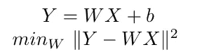
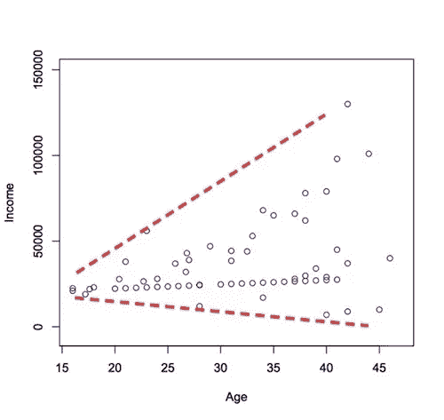
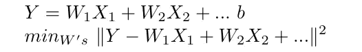
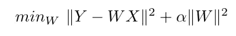
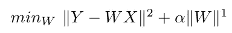
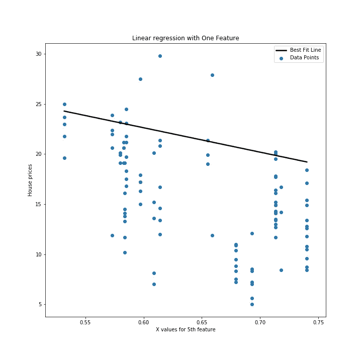

# 用线性回归预测波士顿房价

> 原文：<https://towardsdatascience.com/predicting-boston-house-prices-using-linear-regression-3c6107c662e5?source=collection_archive---------25----------------------->

## 线性、多元回归和正则化(LASSO、岭回归)

## 线性回归:理论与应用

来源: [Pixabay](https://www.pexels.com/@pixabay) 经【pexels.com】T2

# 介绍

什么是线性回归？它是一种预测性建模技术，可以发现自变量和因变量(连续变量)之间的关系。*自变量*(*iv)*s 可以是*分类的*(如美国，英国，0/1)或*连续的* (1729，3.141 等)，而*因变量(dv)* s 是连续的。底层函数映射 *iv* 和 *dv* 可以是线性、二次、多项式或其他非线性函数(如逻辑回归中的 sigmoid 函数)，但本文讨论的是线性技术。

> 回归技术在房地产价格预测、金融预测、交通到达时间(ETA)预测中被大量使用。

来源:[阿尤什·潘特](https://towardsdatascience.com/@NotAyushXD)经[TowardsDataScience.com](/introduction-to-linear-regression-and-polynomial-regression-f8adc96f31cb)

# 变量的类型

*分类*:取不同的值:垃圾邮件/非垃圾邮件、糖尿病+ve/-ve

*连续*:可以取无限个值，如金钱、时间、重量。

*依赖*:实验结果，本博客房屋价值

独立变量:与研究者的行为无关的变量。面积、位置、卧室数量等。

如需更多参考，请查看: [statistichowto](https://www.statisticshowto.com/probability-and-statistics/types-of-variables/) 。

# 线性回归技术

## 1.普通最小二乘法(OLS)

在 *OLS* 中，目标是通过数据点找到最佳拟合线。*最佳拟合线*通过最小化距离预测线的数据平方距离的总和获得。这是一个*无偏估计*(尽管方差没有最小化)，因为它最小化了该观察空间中数据集的偏差。

最小二乘法的目标

*关键假设*:

(一)OLS 假设 *dv* 和 *iv 成线性关系。*

(ii)假设*同质性*。因此，它患上了**。*简而言之，就是随着 *iv* 的值的增加，因变量相对于自变量的可变性。数据散点图中的圆锥形表示*异方差*。*

**

*异方差，来源: [statsmakemecry](http://www.statsmakemecry.com/smmctheblog/confusing-stats-terms-explained-heteroscedasticity-heteroske.html)*

*例如，仅通过查看房屋面积(1 个变量)、房屋面积和位置(2 个预测变量)来预测房价。*

## *2.多元案例*

*在多变量 *OLS* 中，目标函数与单变量 OLS 相似。*

**

*多元最小二乘法的目标*

*多元 OLS 的关键问题是 [*多重共线性*](https://www.jmp.com/en_us/statistics-knowledge-portal/what-is-multiple-regression/multicollinearity.html) 。这是两个或更多预测因子彼此高度相关的情况(1 表示 100%相关，0 表示不相关)。*

> *在具有*多重共线性的数据中，OLS* 不会产生一个好的估计值，因为方差项的误差很大，而 *OLS* 只会最小化*偏差误差*而不是方差导致的*误差。因此，我们采用正则化技术来最小化由于方差引起的误差，并改进我们的模型。**

## *3.里脊回归*

*如上所述，当数据遭受多重共线性时，像 OLS 这样的无偏估计量由于方差项而具有较高的误差。岭回归通过引入具有 *L2* 正则化项的参数α来解决这个问题，从而除了最小平方损失之外还缩小了权重 *W* 。*

**

*岭回归的目标*

*除了*同方差*之外，它与 *OLS* 有相似的假设。岭回归缩小了不高度相关的系数的值**(不完全为零)**。*

## *4.套索回归*

*类似于岭回归，它通过正则化来解决多重共线性问题。将具有 *L1 范数*的收缩参数引入权重 W 有助于减少 LASSO 回归中的方差误差。*

**

*套索回归的目标*

*拉索做了与 OLS 相似的假设，除了*的同质性。* LASSO 将非高度相关的系数值**缩小到零**。*

# *预测波士顿房价*

*让我们开始编写线性回归模型的代码。在本帖中，我们将使用波士顿房价数据集。它由 506 个样本组成，有 13 个特征，价格从 5.0 到 50.0 不等*

## *使用最小二乘法的单变量模型*

*具有一个特征(13 个特征中的第 5 个)的线性回归，MSE 为 54.926*

*让我们画出最佳拟合线*

**

*最小二乘法最佳拟合直线*

*你可以清楚地看到，我们有一个使用 sklearn 和几行代码的预测模型。对于一个特性来说还不错。不过，我们可以显著提高 54.926 的均方误差(MSE)。*

## *多元最小二乘法*

*类似于单变量方法，除了我们在 *X* 的所有特征上训练，而不是一个特征。所以只需复制前面的代码片段和注释行 3。我们需要检查 MSE 和回归系数来确定最佳拟合线，因为绘制 13 维变量还不是主流:/*

*显然，我们的模型将 MSE 指标从 54.926 提高到 37.894。由于有 13 个特征，很有可能出现*多重共线性*。为了验证这一点，我们将看到一个新的统计数据，叫做*方差膨胀因子(VIF)* 。*

**

*VIF 什么 via [GIPHY](https://giphy.com/gifs/emma-mila-stauffer-VeB9ieebylsaN5Jw8p)*

*[VIF](https://www.statisticshowto.com/variance-inflation-factor/) 估计由于多重共线性引起的回归系数的膨胀。Vif 的计算方法是采用一个预测值，并将其与模型中的所有其他预测值进行回归。VIF 的数值给出了每个系数的方差膨胀的百分比。根据经验，VIF 大于 5.0 表明变量高度相关。因此，对于一个好的预测模型，必须去除那些高度相关的变量。*

*计算 VIF 以检查多重共线性*

*除了 3 个特征外，所有特征的 VIF 都非常高(VIF 超过 5.0 被视为高)。因此，我们使用岭和套索回归的正则化模型应该比普通的最小二乘法更好地处理这些数据。*

## *里脊回归*

**两个要点* : *MSE* 减小，岭回归将 X 的系数挤压到接近零。*

## *套索回归*

*MSE 从普通最小二乘法中的 38.894 进一步提高到 21.669。那是相当大的胜利。很明显，LASSO 将几个特征的系数推到了零。*

# *结论*

*总而言之，我们看到了如何使用 sklearn 库在几行代码中实现线性回归。*

1.  *获得最佳拟合线的普通最小二乘法在许多情况下效果很好，而且非常直观。*
2.  *然而，当数据遭受多重共线性或异方差时，我们需要使用正则化技术来执行回归。*
3.  *VIF 是一种可用于检测预测变量中多重共线性的度量。*
4.  *山脊线和套索线在执行回归建模方面做得很好。*

*快乐学习:)*

## *附加源*

1.  *[https://etav.github.io/python/vif_factor_python.html](https://etav.github.io/python/vif_factor_python.html)*