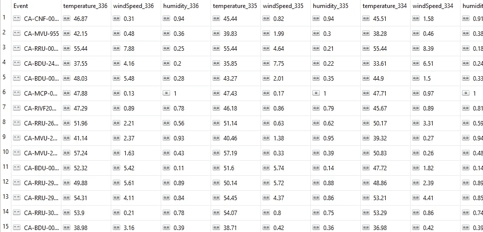

# 用神经网络预测加州野火的规模(上)

> 原文：<https://towardsdatascience.com/predicting-california-wildfire-size-with-neural-networks-building-a-machine-learning-project-from-db0e57dce4c9?source=collection_archive---------25----------------------->

## 从问题到解决方案构建机器学习项目

> "你可以环游世界，但没有什么比得上黄金海岸."—凯蒂·佩里

加利福尼亚是个美丽的地方。


湾区起伏的群山(来源:me)

鉴于其干燥、阳光充足的地中海气候，它允许一些最好的户外活动。

但是，由于这些自然因素和随之而来的人类活动的存在，该州也有超过 200 万个家庭处于高度或极端的野火损害风险中。仅在 2018 年，加利福尼亚州就有超过【2018 万英亩被野火烧毁。

当大火以这种规模燃烧时，它不仅会对着火地点的人构成直接威胁，还会对几英里外的人造成广泛的影响，就像我亲身经历的 2018 年营地大火一样:加州[最致命](https://www.iii.org/fact-statistic/facts-statistics-wildfires)，最具[破坏力](https://www.fire.ca.gov/incidents/2018/11/8/camp-fire/)的野火。

浓烟从该州东北部吹向海湾地区，关闭了学校，造成当地缺乏阻挡污染物的 N95 口罩。对于那些受影响的人来说，最好的情况是与户外隔离两周，就像我一样，但在最坏的情况下，这意味着悲惨的死亡，被迫无家可归，以及对不幸者来说整个社区的破坏。


旧金山市中心，尽管大火在东北方向约 200 英里处(来源:me)


呀！当时圣何塞的真实照片(来源:我)

获得可以提供早期风险指示的工具非常重要，因为它们可以让官员做出更加知情和主动的决定，帮助社区为这些潜在的灾难性事件做好准备。

因此，我想看看我们是否可以使用历史野火数据、统计数据和现代机器学习技术来构建一个模型，该模型可以预测野火事件中被烧毁的土地的大致面积，并希望生产这样一个系统来实时帮助官员。

在我继续之前，我想提一下，这个项目目前是我以前与我的前研究伙伴 Michael L .一起进行的本科生研究的唯一延续，Michael l .在我们构建基于决策树的风险分类模型和深度回归模型(就像本系列中将要探讨的那些模型)时，帮助我们制定问题、设计数据模式并指导模型分析。

# 数据源

仅使用与每个事件相关的时间和空间的气象(气候)数据是模型输入的合理起点，因为温度、风速和湿度等因素已通过[火灾指数](https://www.nwcg.gov/publications/pms437/cffdrs/fire-weather-index-system)在事件预测中使用多年。拥有一个基于这些输入的工具可以让消防专家感觉到一个新的火灾事件会有多深远*后点火*。我们将讨论模型开发中可能考虑的其他潜在有用的因素，并在稍后迭代不同的模型架构时尝试将它们纳入进来。

为了得到对训练有用的初步数据集，我们必须结合两种不同的数据源:野火数据和气候数据。

## Wildfire 数据源

通过一些搜索，我发现了一个由美国地质调查局(USGS)运行的 REST API，这是一个致力于研究美国自然灾害的组织。该 API 为用于追踪实时野火事件的 ArcGIS 地图系统提供支持，并显示关于这些事件的有用信息，包括每个火源的发现日期、纬度、经度和燃烧区域。该 API 在[公开](https://wildfire.cr.usgs.gov/arcgis/rest/services/geomac_dyn/MapServer)，涵盖了从 2002 年开始的事件，并在 2019 年积极更新。

## 气候数据源

假设 USGS API 获得的每个野火事件都包含一个相应的时空(时间和空间)坐标，我们应该能够通过一些气象服务将每个坐标映射到*追溯检查*与每个事件对应的点火现场的场景。

在搜索和使用不同访问限制的不同气候数据源后，我偶然发现了[黑暗天空的时间机器 API](https://darksky.net/dev/docs#time-machine-request) 。虽然不是完全自由的( [*也不是永恒的*](https://blog.darksky.net/dark-sky-has-a-new-home/) 😢)，这个 REST API 允许用户查询每个小时观察到的天气情况，包括由纬度、经度和历史日期描述的给定时空坐标的温度、风速和湿度。因此，我们可以通过查询 USGS API 来获得火灾事件的发现日期、纬度和经度，提出一个时间范围来表示火灾事件的上下文和持续时间，然后将该信息作为输入提供给向 Dark Sky API 发出的请求。

太好了！现在我们已经有了数据源，并且知道我们想要用它们完成什么，让我们看看我们需要什么工具来获得实际的数据。

# 数据技术栈

决定，决定。

## 网络自动化

由于我们需要发出的 API 请求的数量，并且考虑到每一个“黑暗天空”请求都会导致超出特定请求数量的实际金额，我决定使用我为 web 自动化选择的武器:Node.js。虽然像 Python 这样的语言也可以很好地工作，但是创建像 web 请求这样的异步任务链最好在节点环境中完成，我们将在稍后创建数据转换管道时看到这一点。

太好了，我们已经建立了获取所需数据的工具，但是我们将在哪里存储这些 API 请求的结果呢？我们需要一个数据库！

## 数据库ˌ资料库

由于每个 API 请求可能会生成一个 JSON 响应对象，该对象因字段名称而异，即具有不同的模式，自然选择是使用基于文档的 NoSQL 解决方案。此外，由于在发出请求之前，我们无法完全了解这些响应对象的结构，因此我们应该使用无模式的解决方案，这样我们就可以转储所有的响应对象，然后分析并清除任何意外的属性排列或退化的响应。(注意:这是一个方便的选择，先验地找到所有理论上的属性变化是非常耗时的，并且没有很大的回报，因为不使用某些数据的成本是最小的)由于其易用性、大量的社区支持以及与 Node 的强大集成，MongoDB 似乎是正确的选择。

数据来源✔Automation 工具✔数据库✔

让我们设置使用这些工具的环境。

# 环境

在进行这个[项目](https://github.com/RickyCordero/predicting-wildfire-risk)时，我碰巧在桌面环境中使用了[MongoDB Community Server 4.0](https://www.mongodb.com/download-center/community)、 [Node.js v8.11.3](https://nodejs.org/en/download/releases/) 和 Windows 10，所以你应该可以顺利地完成安装。一旦你安装了这些，我们将直接从命令行工作，并遵循[自述文件](https://github.com/RickyCordero/predicting-wildfire-risk/tree/master/scripts)。

首先，我们确保启动 MongoDB 服务器(这将占用一个终端窗口)。

```
> mongo
```

克隆项目后，在 scripts 文件夹内的新终端中，我们将使用 npm 安装项目依赖项。这可能需要一些时间。

```
> npm install
```

现在我们将设置一个环境文件，这样我们就可以从剩余的代码中抽象出一些常用的变量，这些变量将根据部署模式而变化。确保用本地服务器实例的 URL 替换您的 _MONGODB_URL，很可能是“mongodb://localhost:27017”。如果您选择部署到远程 MongoDB 服务器，请确保相应地更改这个 URL。另外，一定要用注册访问 Dark Sky API 后获得的 API 密钥替换 YOUR_DARKSKY_API_KEY。

```
> touch .env
> echo export PRIMARY_MONGODB_URL=YOUR_MONGODB_URL >> .env
> echo export DARKSKY_API_KEY=YOUR_DARKSKY_API_KEY >> .env
> source .env
```

数据来源✔Automation 工具✔数据库✔环境✔

好吧，让我们看看代码。

# 数据收集代码

我们将从 USGS REST API 收集历史野火事件开始。

## 野火数据

下面是我们将要查询的基本 URL:

[https://wild fire . Cr . USGS . gov/ArcGIS/rest/services/geomac _ dyn/MapServer/$ {*year id*}/query？其中=1%3D1 &外场= *&outSR = 4326&f = JSON](https://wildfire.cr.usgs.gov/ArcGIS/rest/services/geomac_dyn/MapServer/${yearId}/query?where=1%3D1&outFields=*&outSR=4326&f=json)

API 通过一个整数 id 来区分每年的历史 wildfire 事件数据集，该整数 id 标识保存该数据的 ArcGIS 图层，从 10 开始表示最近的一年，一直增加到最早的 2002 年。例如，在撰写本文时，id=10 的层保存 2019 年的火灾数据，id=11 的层保存 2018 年的火灾数据，…，id=27 的层保存 2002 年的火灾数据。我们可以将这些 Id 硬编码到一个数组中，遍历每个条目，用该 id 替换查询 URL 的＄{ year id }参数，然后对新的查询 URL 执行 API 请求，从而将每个 id 映射到一个响应对象，并获得每年的 fire 数据。

我们现在可以使用结果数组来填充我们的数据库。首先，我们使用之前设置的 PRIMARY_MONGODB_URL 字段连接到数据库，然后在成功连接后执行上面的代码。一旦 API 请求完成，响应对象的结果数组将在数组 mapRes 中。我们可以使用名为 saveToDBBuffer 的函数将该数组作为集合“原始”存储在数据库“arcgis”中。整个过程被包装在一个 Promise 对象中，并由 downloadRaw 函数返回。

使用 Promises，我们可以将异步操作(如处理网络请求)封装到直观的同步代码块中，然后我们可以对这些代码块进行排序，以构建可以有效记录和测试的数据转换管道。在成功处理时，我们*解决*承诺，在不成功处理时，我们*拒绝*承诺，传递失败的流水线步骤的错误状态。当向数据处理流水线添加额外的阶段时，建立这样的结构的价值将会显现。

我们在这里所做的是模块化的管道异步部分(例如，构造和导出 wildfireStages Promise ),允许任何阶段从另一个脚本导入到 pipeline.js 中的执行序列(导出数组)中。

代表我们管道的承诺数组可以通过 require()导入。/pipeline)并由我们的主脚本执行…

…现在，每当我们想要重现流水线时，例如当我们需要更多数据时，就可以自动运行。

太棒了。

正如你在 pipeline.js 中看到的，我们还有另外两个承诺:climateStages 和 combineStages。这些阶段将在处理 wildfireStages Promise 后利用我们的数据库的更新状态，因此在导出的数组中排序。它们分别下载每个事件的气候数据，并将生成的数据集加入到单个训练集中。

执行 wildfireStages 序列的结果是 arcgis 数据库中的一些新集合，这些集合包含在我们将原始数据集转换为更有用的工作集时有用的快照。最终的集合是“训练”集合。现在让我们来看看气候数据。

## 气候数据

与我们使用 USGS API 将年份映射到火灾事件响应对象类似，我们将使用 Dark Sky API 将 arcgis training 集合中的火灾事件对象的属性映射到气候数据响应对象，只是现在将结果响应对象直接流式传输到数据库，而不是下载到内存中的缓冲区。这样做是为了防止数据丢失，以防我们从 API 获得大量数据，而无法将它们全部存储在内存中。

通过为来自训练集合的火灾事件创建一个读取流，我们启动了流式传输过程，将每个火灾事件通过管道传输到一个转换流，该转换流为该事件执行一个黑暗天空 API 请求，然后将结果响应对象通过管道传输到一个转换流，该转换流将文档上传到气候数据库。getClimateDataEach 函数通过生成一个由 CLIMATE_CONFIG 对象定制的转换流对象来开始这个过程。在这个转换流对象中，我们执行 getHistoricalClimateDataEach 函数，生成结果气候响应对象“res”，然后*将它推送到管道中的下一个转换流对象。下一个转换流对象由数据库配置对象定制，并且是 saveToDBEach 的结果。在返回的流对象中有执行数据库上传的代码。*

在 getHistoricalClimateDataEach 函数中，使用 CLIMATE_CONFIG 对象中指定的每小时或每天的时间间隔，围绕 wildfire 事件的点火时间构建一个时间窗口。得到的开始和结束日期然后被传递给下载函数，该函数从开始时间开始为每个时间单位执行 API 请求，并向结束时间递归(基本情况),将结果聚集到结果对象中。

酷！现在，我们有了来自 arcgis training 集合的每个火灾事件的气候数据，这些数据保存在气候数据库的“training”集合中。我们只需要将我们创建的两个数据库中的两个训练数据集合并成一个主数据集，用于模型开发。

## 培训用数据

我们可以从 arcgis training 集合中加载每个火灾事件，加载由“事件”属性链接的每个相应的气候响应对象，然后连接所需的属性并格式化列以适应典型的关系模式。我们很快就会看到，拥有一个关系模式将使数据集易于解释并方便地导出到 Python 中。



主数据集的子集

对于每个火灾事件，列名标有气候属性和表示相对于该火灾事件点火时间的小时的索引字符串，例如，温度 _336、温度 0 和温度 336 分别表示火灾点火时间之前 336 小时、准确时间和之后 336 小时的点火地点的温度。点火时间前后 14 天的每小时测量给出了每个气候特性点火前后的 336 个数据点，以及代表点火时间的每个气候特性的附加数据点。

好了，我们拿到数据了。现在，在本系列的第 2 部分中，让我们看看如何使用这个数据集来构建一些回归模型。(即将推出！)