# 利用 K 近邻算法预测心血管疾病

> 原文：<https://towardsdatascience.com/predicting-cardiovascular-disease-using-k-nearest-neighbors-algorithm-614b0ecbf122?source=collection_archive---------22----------------------->

## 用机器学习的力量预测和预防疾病

图片来源:[https://unsplash.com/photos/4R6pg0Iq5IU](https://unsplash.com/photos/4R6pg0Iq5IU)

根据维基百科，心血管疾病是全球死亡的首要原因[1]。它是不同心脏和血管的组合，如心脏病、心脏病发作、中风、心力衰竭、心律失常、心脏瓣膜问题等。高血压、高胆固醇、糖尿病、缺乏运动是增加患这种疾病风险的一些主要原因。通过最大限度地减少行为风险因素，如吸烟、不健康饮食、饮酒和缺乏锻炼，这种疾病是可以预防的。

如果人们能够在这种疾病转变为更高风险水平之前提前意识到这种疾病，我们就可以在相当大的程度上最小化死亡和高风险水平患者的数量。借助机器学习和高计算能力的发展，推动了医学领域人工智能的指数级发展，人们可以使用这些技术，提出一个模型，进行预测，以确定人们在最早阶段患这种疾病的可能性。

在这篇文章中，提出并实现了一个机器学习模型，通过关注从在线数据集收集的事实信息、医疗检查结果和患者信息等因素来确定一个人是否患有这种疾病的可能性[2]。k 近邻算法是一种众所周知的和性能良好的分类算法，被用来实现这个模型。

# 算法选择

k 最近邻是一个简单的算法，但在实践中非常有效，它存储所有可用的案例，并基于相似性度量对新数据或案例进行分类。这表明，如果添加到样本中的新点与相邻点相似，则该点将属于相邻点的特定类别。一般来说，KNN 算法用于人们寻找相似物品的搜索应用。KNN 算法中的 k 表示需要预测的新点的最近邻居的数量。

KNN 算法也被称为懒惰学习器，因为它的学习能力非常快，所以模型的学习阶段较少。相反，它会记住训练数据集，所有工作都发生在请求预测的时候。

## 算法是如何工作的？

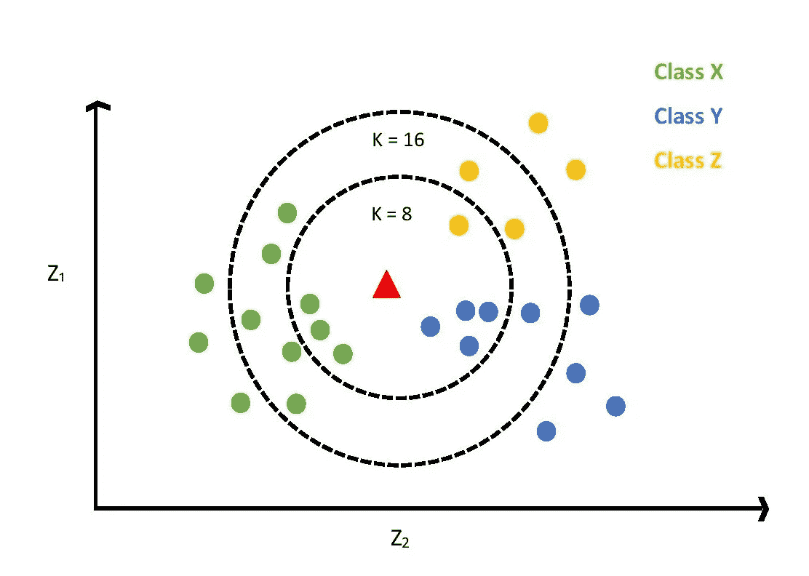

图 1:KNN 算法的简单解释。图片作者:Tharuka Sewwandi

当我们使用 KNN 算法向数据集添加新点时，我们可以预测该新点属于哪个类。为了开始预测，我们需要做的第一件事是选择 K 的值。根据图 1，绿色的点属于 X 类，蓝色的点属于 Y 类，黄色的点属于 z 类。当 K=8 时，我们需要选择 8 个相邻点，它们与三角形表示的新点的距离最小。如图 1 所示，当 K=8 时，新点接近一个黄色点、三个绿色点和四个蓝色点。因为我们有大多数蓝点，在这种情况下，我们可以说对于 K=8，新点属于 y 类。

继续向前，如果 K=16，我们必须寻找最接近新点的 16 个不同的点。在计算距离之后，发现当 K=16 时，新点更接近三个黄色点、五个蓝色点和八个绿色点。因此，我们可以说，当 K=16 时，新点属于 x 类。

为了找到最佳 K 值，我们可以使用交叉验证技术来测试 K 的几个值。我将在本文中向您展示如何使用交叉验证技术来找到最佳 K 值。为了找到相邻点之间的最小距离，我们可以使用欧几里德距离或曼哈顿距离。在欧几里得距离中，它将采用欧几里得空间中两点之间的直线距离，而曼哈顿距离将使用它们的绝对差之和来计算实向量之间的距离。

# 数据收集

为了预测一个人是否患有心血管疾病，数据集选自 Kaggale.com[2]。该数据集包括三种类型的数据，分别是事实信息、医学检查结果(检查特征)和患者给出的信息(主观特征)。此外，数据集中的数据可以分为分类数据和数值数据。原始数据集由 70000 个数据实例和 14 个特征组成，如表 1 所示。

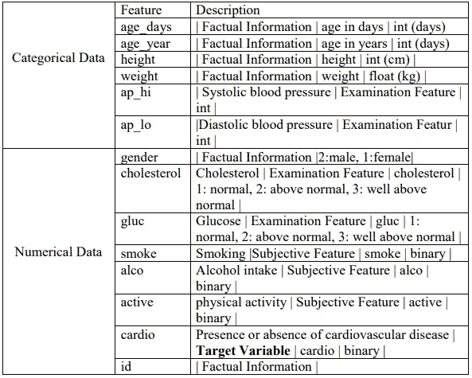

表 1:数据集描述

# 模型实现

## 导入库

作为第一步，高性能计算、数据可视化、数据模型分析所需的所有库都导入如下。

## 导入数据集

心血管疾病的在线数据集[2]作为 CSV 文件导入，以便进行如下分析。由于“id”特性的低重要性，它被从数据集中删除并导入剩余的数据集。

## 数据可视化

已经进行了图形表示来比较年龄范围和心血管疾病之间的关系。

这段代码将生成一个条形图，x 轴代表年龄，y 轴代表人数。如图 2 所示，红色代表患有心血管疾病的人，而绿色代表未患该疾病的人。

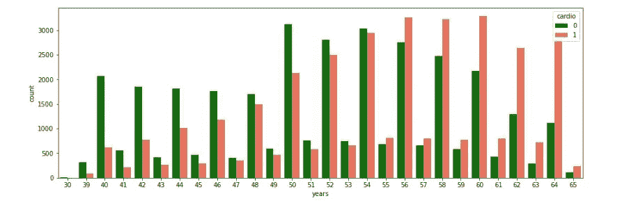

图 2:年龄范围和心血管疾病的比较。图片作者:Tharuka Sewwandi

根据图表可以清楚地看出，年龄在 56 岁到 60 岁之间的人更容易患这种疾病。

此外，从下面的代码片段中进行了分类数据分布的可视化分析。

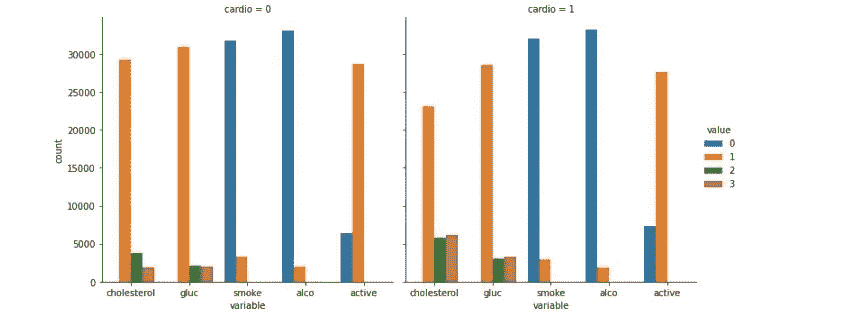

图 3:分类数据分布的可视化表示。图片作者:Tharuka Sewwandi

如图 3 所示，第一个柱状图代表患有心血管疾病的人群中的分类数据分布，而第二个柱状图代表未患有该疾病的人群中的分类数据分布。上述双变量分析表明，患有心血管疾病的人比其他人具有更高的胆固醇水平和葡萄糖水平。

## 数据预处理

**功能选择**

如前所述，由于“id”特征的重要性较低，因此将其从数据集中删除。然而，由于身体质量指数值对心血管疾病有相当大的影响，因此增加了一个称为“bmi”的新特征，作为两个现有特征“**身高**和“**体重**”的衍生特征。

在特征选择之后，最终确定的特征集如下图 4 所示。

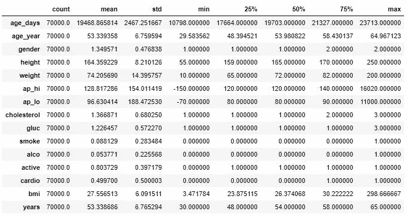

图 4:最终数据集的统计描述。图片作者:Tharuka Sewwandi

**检查空值**

使用 pandas 提供的 isnull()函数，可以检查整个数据帧以识别缺失值或 NAN 值。如图 5 所示，通过确认数据集中没有丢失的值，它给出了 false。

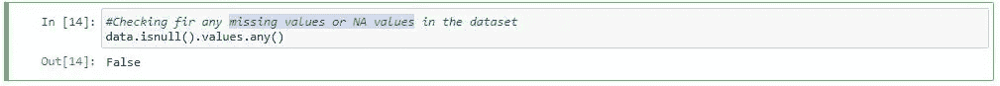

图 5:使用 isnull()函数查找空值

**数据清理**

为了得到准确的数据集，通过数据清理来检测损坏或不需要的记录并删除它们。如图 4 所示，最大身高为 250 厘米，最大体重为 200 公斤，从身高和体重得出的最大身体质量指数值为 298，这两个值在相互考虑和比较时是不相关的。因此，不相关的数据被删除，并通过删除异常值来概括数据集，如下所示。

此外，舒张压(ap_lo)不能超过收缩压(ap_hi ),因为收缩压是心脏跳动时施加的最大压力，而舒张压是动脉在两次跳动之间的压力量。此外，收缩压和舒张压之间的数字差异称为血压，它不能是负值。通过考虑这些事实，来自 ap_hi 和 ap_lo 的异常值已经被去除以消除不准确的血压数据。

在数据清理过程之后，我们可以看到一个更新的数据集，新的计数减少了，相当于 63866 个数据集，身高、体重、ap_hi 和 ap_lo 的最小值和最大值都发生了变化，如图 6 所示。

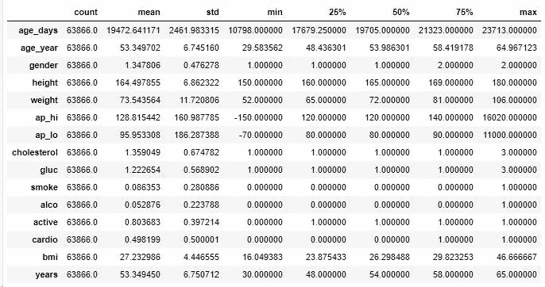

图 6:清理数据集的统计描述。图片作者:Tharuka Sewwandi

**数据标准化**

为了确保数据在内部保持一致，以便于相互比较，对数据集中的数字数据进行了数据标准化。

**分割数据集**

数据分割在两种主要方法下进行，

1.  将数据集分割为要素和标注

*   标签——最终选择或需要预测的结果
*   要素-用于预测标注的属性

2.将数据集分为训练数据集和测试数据集

*   训练数据集-用于拟合模型的数据样本
*   测试数据集—用于对最终模型进行评估的样本数据集

**构建 K 近邻分类器**

开始时，由于我们不知道模型的最佳 K 值，我们可以将“n_neighbors”的值设为 1。然后模型将由训练数据来拟合。

那么我们可以做如下预测。

为了更好地理解分类模型的性能，使用了混淆矩阵，如图 7 所示。

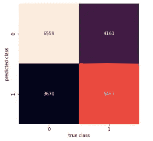

图 7:K = 1 时的混淆矩阵。图片作者:Tharuka Sewwandi

根据混淆矩阵，它将给出如图 8 所示的分类报告，准确度为 60.54。但是这个预测是对 K=1 做的。因此，我们需要选择最佳的 K 值。

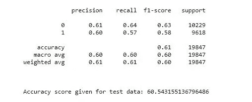

图 8:K = 1 的分类报告。图片作者:Tharuka Sewwandi

**选择最佳 K 值**

**肘方法**已被用于通过关注准确性和错误率来挑选好的 K 值。

1.  **根据准确率选择 K 值**

这里已经创建了一个存储准确率值的列表，为了考虑 K 值，将从 1 到 40 运行一个循环。在循环内部，它将计算从 1 到 40 的相关 K 的精度值，并将其存储在列表中。从生成的列表中，已经绘制了一个图表来识别最佳 K 值，这将使精度更加稳定。

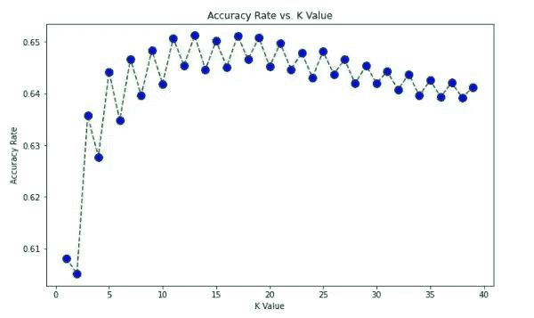

图 9:准确率与 K 值的关系。图片作者:Tharuka Sewwandi

**2。基于误差率选择 K 值**

与准确率相同，差错率也计算如下。

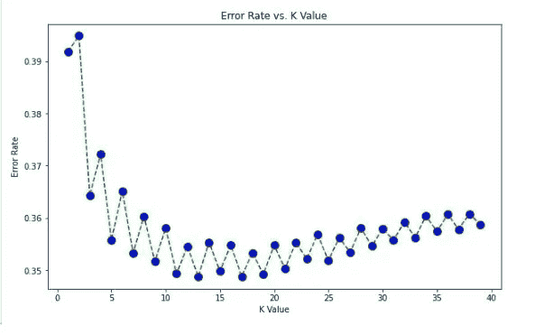

图 10:误码率与 K 值的关系。图片作者:Tharuka Sewwandi

根据图 9，可以清楚地看到，在 K>5 之后，准确率将增加，并且不会低于 K>5 的点。类似地，在 K>5 之后，图 10 中的错误率下降，并且从未超过 K>5 的特定点。

因此，在 K 值选择过程之后，我们可以假设 K=5 是一个非常好的值。在选择了最佳 K 值之后，我们可以用等于 5 的新 K 值再次运行该算法。

K=5 的分类报告如下图 11 所示，根据图 11，我们可以看到精度和召回值比 K=1 时有所增加，并且精度值也有所增加。

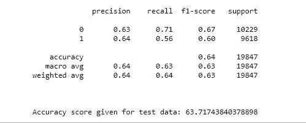

图 11:K = 5 的分类报告。图片作者:Tharuka Sewwandi

# 结论

一旦模型的实现完成，我所揭示的是在通过移除异常值来清理不相关的数据之前，模型的准确性是 55%。在清理了体重、身高、ap_hi 和 ap_lo 的数据之后，模型的准确性变成了 60%。但这是针对 K=1 的。在给出模型的最佳 K 值 K=5 后，精确度提高到 63%。这背后的主要思想是该模型为不同的 K 值给出不同的精度水平，并且可以使用模型的分析误差率或精度率来识别最佳 K 值。然而，数据集的大小和特征对模型产生很大的影响，以获得良好的准确率。

然而，KNN 算法不能很好地处理大型数据集，也不能很好地处理高维数据，因为很难计算每个数据点之间的距离，这是该算法的一个缺点。所以，未来我希望将同样的数据集应用到其他分类算法中，找到最合适的算法来提高模型的性能，并在我以后的文章中与大家分享。

最新代码可在 https://github.com/tharuka-amaraweera/Cardiovascular[获得](https://github.com/tharuka-amaraweera/Cardiovascular)

# 参考

[1] " **心血管疾病"**，世界卫生组织(世卫组织)，2017 年 5 月 17 日，[在线]:[https://www . who . int/news-room/fact-sheets/detail/cardio vascular-Diseases-(cvds)，](https://www.who.int/news-room/fact-sheets/detail/cardiovascular-diseases-(cvds),)[访问日期:2020 年 4 月 26 日]

[2] Onel Harrison，“使用 K-Nearest Neighbors 算法的机器学习基础知识”，2018 年 9 月 11 日，[在线]:[https://towardsdatascience . com/Machine-Learning-Basics-with-the-K-Neighbors-Algorithm-6a 6 e 71d 01761， 访问日期:2020 年 4 月 23 日