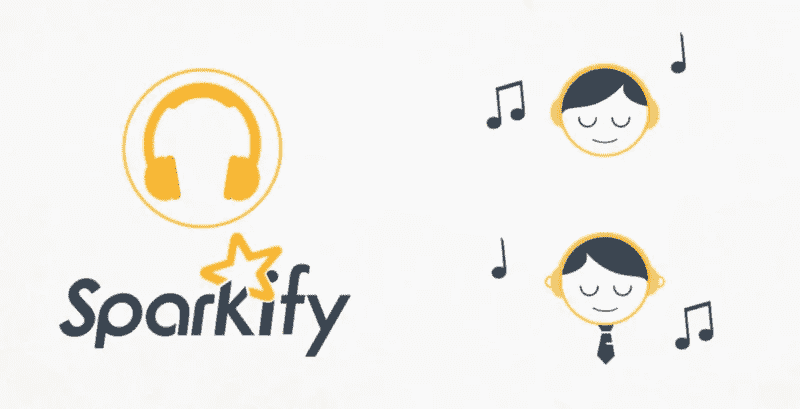
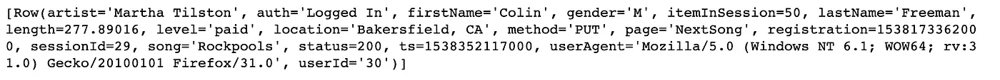
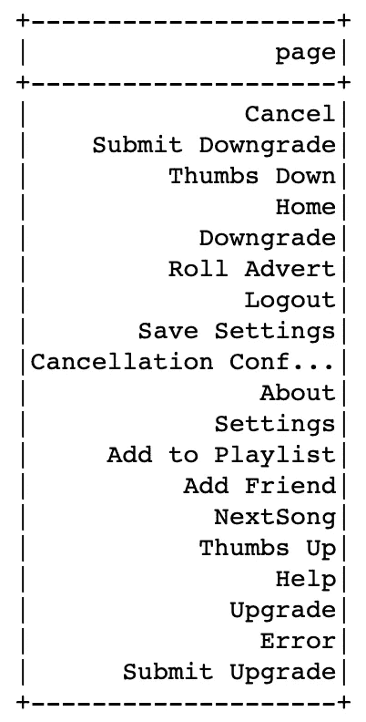
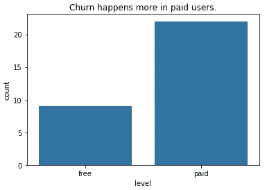
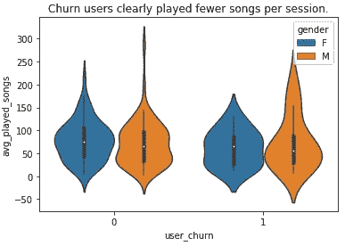
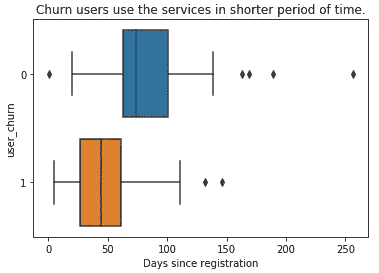
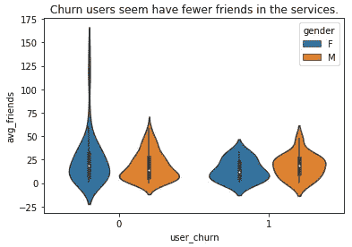
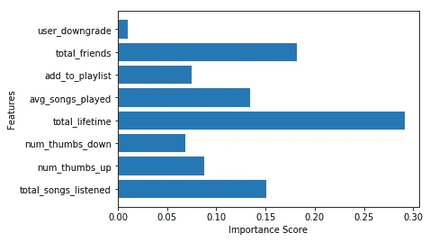

# 预测 Sparkify(一种数字音乐服务)的用户流失

> 原文：<https://towardsdatascience.com/predicting-churn-for-sparkify-a-music-streaming-service-59f2fd46b3a6?source=collection_archive---------62----------------------->

## 用 PySpark 构建客户流失预测模型。

Sparkify 是由 Udacity 创建的虚拟音乐流媒体服务

Sparkify 是一种虚构的数字音乐服务，由 Udacity 创建，旨在模拟 Spotify 或 Pandora 等现实世界的公司。在 Sparkify 上，用户可以播放免费计划或高级订阅计划的歌曲，这些计划提供了高级功能，并且没有广告。用户可以随时升级、降级或取消他们的服务。每当用户与服务交互时都会生成数据，包括播放歌曲、将歌曲添加到播放列表、用拇指向上或向下对歌曲进行评级、添加朋友、登录或注销、升级或降级等。根据经验，获得一个新客户比保留一个现有客户的成本更高，保持客户满意并识别那些有取消服务风险的用户是服务公司的高优先级任务。

因此，这个项目的目的是分析用户活动日志，并建立一个分类器来识别有可能流失的用户——取消了 Sparkify 音乐流媒体服务。此外，考虑到现实压倒性的流数据，我只使用完整 Sparkify 数据(12GB)的一小部分数据(98MB)进行数据探索和模型开发。最终的模型是使用 Spark 构建的，因此它可以扩展到在分布式集群环境中运行。

# 用户为什么会流失？

在假设中，用户有更多的互动与更少的摩擦应该是满意和积极的。因此，我们首先要考虑的是数据，churns 用户的行为是否与现有用户不同？

在开始回答业务问题之前，让我们探索一下日志中有哪些内容。

原始数据样本

在这里，我描述了我将用于切片和切块的主要功能:

*   ***userId*** :用户标识符
*   ***sessionId*** :日志所属的会话
*   ***歌曲*** :每个用户播放的歌曲
*   ***注册*** :用户注册时间戳
*   ***ts*** :给定事件的时间戳
*   ***页面*** :用户访问过的页面。
*   ***等级*** :免费或付费

页面字段显示用户可以在 Sparkify 上进行的活动

最后，我们需要定义**流失**并相应地标记流失用户。流失定义为点击了`**cancellation confirmation**` 页面的用户。

现在，我们将分而治之，看看搅动者用户的参与度是否低于现有用户。

下面我们深入探讨某些维度，看看流失群体和其他用户之间是否存在差异。

从上面的图表中，我们可以总结出:

1.  流失用户在 Sparkify 上的参与度较低。
2.  付费用户流失更多。这可能是因为付费服务不够好，或者高级功能让用户感到沮丧。
3.  流失用户的社交联系(朋友)较少，降低了他们对平台的忠诚度。

# 建立机器学习模型来检测客户流失

## 特征工程

我们根据洞察力准备特征。关于工程过程的细节，请查看我的 [Github 笔记本](https://github.com/andypwyu/churn_prediction_for_Sparkify/blob/master/Sparkify.ipynb)。

## 创建新功能

1.  收听的歌曲总数
2.  竖起大拇指的次数
3.  竖起大拇指的次数
4.  自注册以来的总时间(总寿命)
5.  每次会话播放的平均歌曲数
6.  添加到播放列表的歌曲数量
7.  朋友总数
8.  降级(分类变量)

## 设置目标变量

1.  搅拌

## 建模和评估

最后，我们将所有特征矢量化为一个向量，最重要的是，然后进行标准化，以避免一个较大规模的特征主导整个模型。

数据集分为 60%用于训练，40%用于测试。每个模型都将获得测试集的准确性和 F1 分数。然而，由于被搅动的用户是一个相当小的子集，我将只使用 F1 分数作为优化模型的指标。

在这里，我用下面的超参数调整信息来探索三个模型:

*   随机森林:numTrees[10，20]，maxDepth[10，20]
*   渐变增强树:maxIter[10，20]，maxDepth[10，20]
*   支持向量机:maxIter[10，20]

绩效结果排名:

1.随机森林:F1 分 0.746，准确率 0.781
2。梯度提升树:F1 得分 0.731，准确率 0.734
3。支持向量机:F-1 得分 0.685，准确率 0.781

我们基于 F1 进行优化，随机森林是最好的模型。

## 最佳模型的特征重要性

从图表中，我们可以看到总寿命实际上对检测搅动起着非常重要的作用。但这可能会引发一场争论，即自然搅拌的人使用服务的时间更短。然而，也可以解释为，只要用户在平台上保持活跃的时间较长，他们就不容易流失，因为他们已经习惯了流媒体服务。此外，朋友总数很重要，因为我们假设平台上社交联系越多的用户忠诚度越高。每次收听的总歌曲数和平均播放的歌曲数衡量了用户的参与度和活跃程度，也有助于表明用户是否会流失。降级并不能有效预测用户流失，这可能是因为用户仍然留在他们的免费帐户中，尽管他们对付费计划并不满意。

# 结论和今后的改进

在这个项目中，我实现了一个模型来预测 Sparkify 音乐流媒体服务的客户流失。我研究了数据集，以了解哪些特征可能有用，并为建模过程创建特征。在这里，我评估了 3 个模型:随机森林(RF)，梯度推进树(GBT)，和支持向量机(SVM)。调整后的 RF 模型能够实现大约 0.746 的 F1 得分，这仍然优于基线模型——预测每个人都不会流失，F1 得分为 0.685，尽管其性能实际上由于数据集的不平衡而被夸大了。根据 F1 得分，最终模型比基准模型提高了 9%。

由于在小数据集中只有 175 个唯一用户，因此数据量越大，模型性能越好，越可靠。因此，下一步将是在云上移动选定的模型，并建立 Spark 集群，如[亚马逊 EMR](https://aws.amazon.com/emr/) 或 [IBM Watson Studio](https://www.ibm.com/cloud/watson-studio) ，以利用分布式计算资源处理真实的完整数据集。

如果考虑更多的因素或添加更多的领域知识，这些特性还可以得到改进。它随着公司用户群的增长和从数据中挖掘更多洞察力而发展。

关于这个项目的更多细节，请查看我的 Github 可用[这里](https://github.com/andypwyu/churn_prediction_for_Sparkify)。