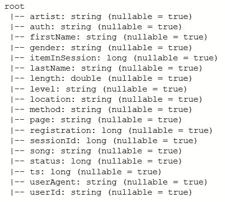
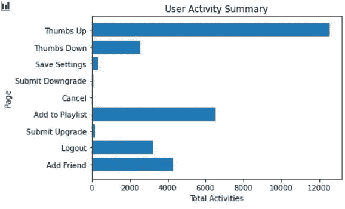
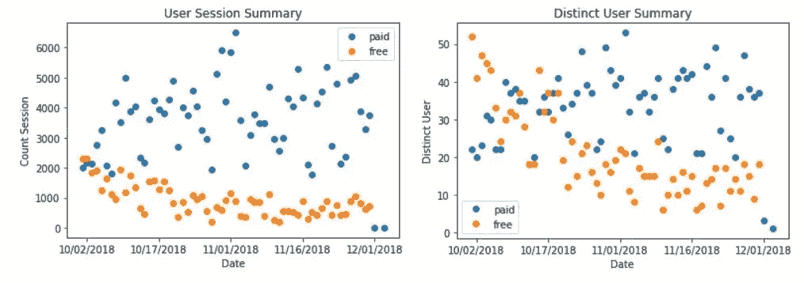
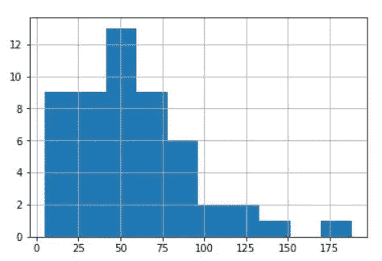
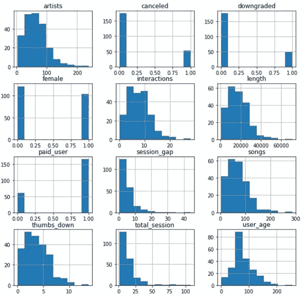
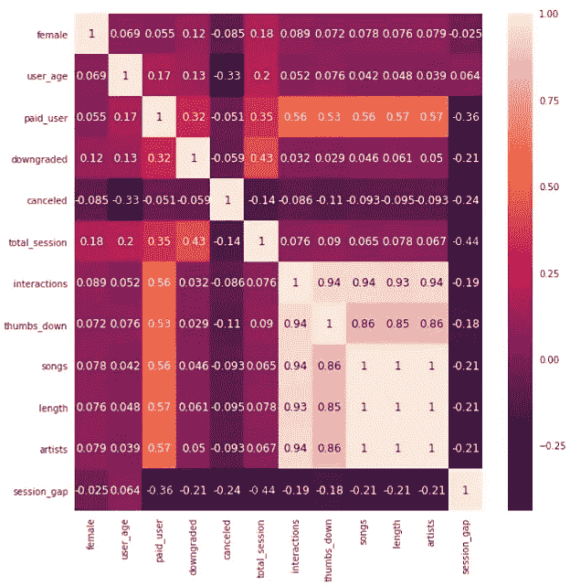
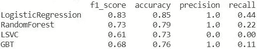
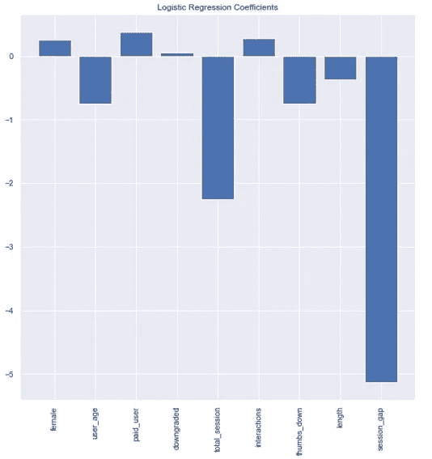
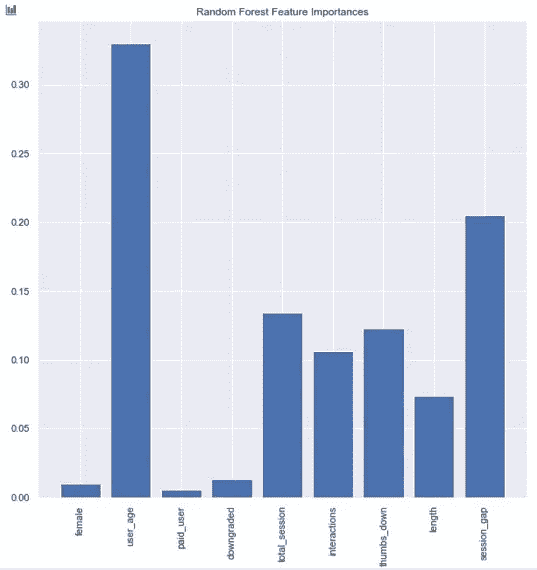

# 用 PySpark ML 预测客户流失

> 原文：<https://towardsdatascience.com/predicting-churn-with-pyspark-ml-d65012e9ab7c?source=collection_archive---------31----------------------->

## 使用 Sparkify 订阅数据解决分类问题


由[弗兰基·查马基](https://unsplash.com/@franki?utm_source=unsplash&utm_medium=referral&utm_content=creditCopyText)在 [Unsplash](https://unsplash.com/s/photos/machine-learning?utm_source=unsplash&utm_medium=referral&utm_content=creditCopyText) 上拍摄的照片

留住客户对繁荣的企业至关重要。当我们正在享受**一键订阅**的数字服务时，一些公司正在拔头发，因为有人只是点击**一下就退出了。如果我们能够确定哪些用户面临流失风险，那么企业就可以采取行动，并有可能留住他们。**

为了实现这一点，我们需要不仅准确，而且足够强大的机器学习解决方案来快速处理大量数据。 **Apache Spark** 是一个适合这种需求的大数据平台。部署在 Spark 上的数据科学管道可以利用像 **HDFS** 这样的分布式系统来增加模型的可扩展性。 **Spark ML** 支持逻辑回归、随机森林和其他线性扩展模型等算法。

# **激发客户流失预测**


资料来源:Udacity

Sparkify 是 Udacity 宇宙中的一项音乐流媒体服务。就像 Spotify 一样，用户可以选择带广告的免费订阅层或不带广告的付费订阅层。

在这个项目中，我们将根据 Sparkify 用户数据预测有流失风险的用户。我们将首先分析较小子集(128MB)上的数据，然后将管道部署到 AWS EMR 等云服务，以使用完整数据集(12GB)调优选定的模型。

# **探索性数据分析**

这个小数据集包含 286500 条记录和 18 个字段:

```
df.printSchema()
```



df 模式

由于我们只对现有的 Sparkify 用户感兴趣，我们将排除与用户 Id 无关的访客流量或活动，这样我们就有了 225 个不同的用户。

## **流失定义**

在这项研究中，我们将用户流失定义为用户**取消订阅**并离开 Sparkify。当用户提交取消时，记录将有`auth == 'Cancelled'`和`page == 'Cancellation Confirmation'`。取消立即生效。

在这个小数据集中，有 52 个用户产生了争议。流失概率 **23.11%** 。

## **用户活动**



用户 _ 活动

除了播放歌曲，用户还可以对歌曲进行评级，更改设置和添加朋友。Sparkify 上互动越多的用户对平台的粘性越大吗？用户会因为订阅了太多他们不喜欢的歌曲而离开吗？

为了回答这些问题，我们在特性中添加了`interactions, thumbs_down`。

## **活动日期**

数据集中的日期范围是从`2018-09-30`到`2018-12-02`。我们可以看到，付费层和免费层在开始时具有相似的用户会话数量和不同的用户，然后**随着时间的推移，付费层的两个指标都增加了**，而免费用户的指标则减少了。



一段时间内的用户活动

## **用户年龄(自注册后)**

用户在 Sparkify 上停留多长时间后就会流失？从用户流失时的年龄直方图中，我们可以看到大多数流失发生在注册后的 100 天内。



流失时的用户年龄

# 特征选择

探索数据集后，选择了 11 个要素进行进一步分析:

**用户信息:**性别，用户 _ 年龄，付费 _ 用户，降级

**活动测量:**艺术家、歌曲、长度、互动、拇指向下、总时段、时段间隙



壮举直方图

## **相关性矩阵**

*   除了`user_age`之外`cancelled`没有明显的强预测因子
*   `songs, interactions, thumbs_down, length, artists`根据直方图非常相似。尽管它们都显示出彼此之间的高度相关性，但这可能是由小数据集(225 个用户)造成的。如果我们有更多的数据，我们可能会看到更多的用户行为差异。因此，我们将只排除`songs`和`artists` ，因为它们总是与`length`相似。



特征相关性(皮尔逊)

# **造型**

要使用 PySpark 中的功能，需要将这些功能组合成矢量，然后使用 StandardScaler 进行归一化:

```
assembler = VectorAssembler(inputCols=['female','user_age','paid_user',\
                                       'downgraded','total_session','interactions',\
                                      'thumbs_down','length','session_gap'],\
                            outputCol='NumFeatures',handleInvalid = 'skip')standardscaler = StandardScaler(inputCol="NumFeatures", outputCol="features", withMean=True, withStd=True)
```

然后，数据被分成测试集和验证集:

```
test, validation = data.randomSplit([0.8, 0.2], seed=42)
```

## **型号选择**

因为我们预测用户是否有流失的风险(1/0)，所以预测是一个**分类问题**。4 种分类算法用于初始训练:

*   逻辑回归
*   随机森林
*   线性支持向量分类器
*   梯度增强树分类器

## **模型拟合**

```
def fit_model(model, paramGrid = None):
    # Model fitting with selected model and paramgric(optional)
    # Input: model, paramgrid
    # Output: fitted model, prediction on validation set
    pipeline = Pipeline(stages=[standardscaler, model])

    if paramGrid != None:
        crossval = CrossValidator(estimator=pipeline,
                          estimatorParamMaps=paramGrid,
                          evaluator=MulticlassClassificationEvaluator(),
                          numFolds=3)
        fitmodel = crossval.fit(test)
    else:
        fitmodel = pipeline.fit(test)

    results = fitmodel.transform(validation)

    return fitmodel, results
```

为了找到最佳的模型和参数，我们使用 **CrossValidator** 来评估模型性能并验证模型的健壮性。使用`numFolds = 3`，CrossValidator 生成 3 组训练/测试对，每组使用 2/3 的数据进行训练，1/3 的数据进行测试。为了评估特定的模型/参数选择，CrossValidator 计算适合 3 个训练/测试对的 3 个模型的平均评估指标。

## 模型评估

为了对模型进行评估，我们通过验证数据上的模型预测的 **f1_score、**准确度、精确度和召回率对算法进行了比较。



验证数据的模型性能

**f1-score:** 精度和召回率的调和平均值。

**准确度**:(真阳性+真阴性)/所有预测

**精度**:真阳性/(真阳性+假阳性)

**回忆:**真阳性/(真阳性+假阴性)

因为我们在一个小的数据集上工作，所以我们需要一个具有精确度和召回率的平衡模型。我们将使用 **f1 分数**来选择最佳型号。

**逻辑回归**表现最好，F 值= 0.83 。它预测验证集中的 **44%** 的流失和 **100%** 的流失预测是正确的。根据系数，对客户流失影响最大的前 5 个特征是:

*   会话间隔、总会话、拇指向下、用户年龄、长度



逻辑回归系数

**随机森林**也表现不错 **F 值= 0.73** 。由于 RF 在大型数据集中具有更强的预测能力，因此也值得用完整数据调整随机森林模型。根据随机森林功能的重要性，前 5 位功能是:

*   用户年龄、会话间隔、总会话、拇指向下、交互



随机森林要素重要性

LSVC 在这个数据集上表现不佳。**召回** **为 0** ，这意味着它无法识别任何流失。

**梯度提升树**的 F 值略高于 LSVC，但也存在召回率低的问题。

# **通过处理不平衡数据改进模型**

在我们的数据集中，客户流失的结果是不平衡的(23%)，这损害了模型的实际预测能力(参见 LSVC，盲目地将一切赋值为 0 仍将得到 0.6 的 f1 分)。

对于逻辑回归，有多种方法来处理不平衡数据。在这项研究中，我们将尝试两种解决方案:

*   设置类别权重
*   设置不同的阈值

## **py spark 中的类权重**

我们想给正面的东西分配更高的权重(`cancelled == 1`)。生成类权重:

```
balancingRatio = data.filter(col(‘label’) == 1).count() / data.count()calculateWeights = udf(lambda x: 1 * balancingRatio if x == 0 else (1 * (1.0 — balancingRatio)), DoubleType())weightedDataset = data.withColumn(“classWeightCol”, calculateWeights(‘label’))
```

用 classWeightCol 重新拟合逻辑回归模型:

```
lrweightedmodel, lrweightedresults = fit_model(lr.setWeightCol(‘classWeightCol’))print(“LogisticRegression with weight: f1 score,accuracy,precision,recall”, val_evaluation(lrweightedresults))
```


具有类别权重结果的逻辑回归

哇！使用类权重重新平衡数据集在小数据集中非常有效，这将 f1 分数增加到 **0.85** ，召回到 **0.67** 。

## 最佳阈值

另一种平衡数据的方法是设置不同的阈值来进行正面预测。

在当前逻辑回归模型中通过 f-score 找到最佳阈值:

```
fMeasure = trainingSummary.fMeasureByThreshold
maxFMeasure = fMeasure.groupBy().max('F-Measure').select('max(F-Measure)').head()
bestThreshold = fMeasure.where(fMeasure['F-Measure'] == maxFMeasure['max(F-Measure)']) \
    .select('threshold').head()['threshold']
```

当前模型的最佳阈值为 **0.27** 。这似乎有点过于严格，可能会导致大型数据集中的低精度。为了测试不同阈值的有效性，我们可以使用 paramGrid 来拟合阈值在[0.3，0.4，0.5]的模型。

# 结论

*   对于 Sparkify 订阅，样本数据集中的整体流失率为 **23%** 。大多数搅动发生在注册后的 100 天内。
*   除了用户年龄，**他们使用 Sparkify 服务`(session_gap, total_session`的频率**，以及**他们在使用平台`thumbs_down, interactions`时的活跃程度**也对他们是否会流失有很大影响。
*   **带类别权重的 Logistic 回归模型**对 f1-score = 0.85 的小数据集的预测能力最强。它能够以 75%的精度预测验证集中的 67%的搅动(75%的预测用户实际搅动)。

## 我们学到了什么

*   正确地清理和处理数据不仅可以提高模型性能，还可以提高管道的操作效率和可伸缩性。对于 Sparkify mini 数据，我们将 268k 个事件级记录聚合为 225 个用户级记录，其大小是原始数据的 0.1%。
*   理解您的数据是数据科学项目成功的关键。从 18 个原始字段中，我们只选择了与用户行为相关的指标，并创建了 11 个特性。然后，我们进一步根据相关性将数据精简为 9 个具有独特特征的特征，以训练模型。

## 挑战

*   **季节性**:我们使用的数据只包含两个月的数据，这意味着分析可能会因季节性而有偏差。
*   **小数据集**:在没有进行所有探索性分析的情况下，管道在我的本地机器上运行需要 2 个多小时。如果我们在两个月内收集了 12 GB 的用户数据，这意味着我们只在 0.6 天的数据量上训练我们的模型。假设业务随着时间的推移而增长，在本地运行管道是不可伸缩的。

# 下一步是什么？

## 超参数调谐

*   从这个小数据集，我们知道**逻辑回归**和**随机森林**模型对于预测我们数据的变动是很好的。我们可以通过使用网格搜索调整超参数来进一步改进模型。
*   目前的模型提供了良好的 f1 分数和准确性，但相对而言**召回率**较低，这意味着我们没有捕捉到所有有风险的用户。
*   我们想要如何评估模型取决于我们想要回答什么样的业务问题:例如，如果我们想要研究**什么类型的用户更有可能流失**，那么我们将需要好的 **f1-score** 。如果我们想**找到所有有风险的用户**并试图让他们留下来，那么**召回率**就变得更加重要。

## 使用完整数据集将管道部署到 AWS EMR

AWS EMR(Elastic MapReduce)为 Spark 提供了一个高性能环境。下一步，我们将部署我们的管道 AWS EMR。然后，我们将能够使用完整的数据训练模型，并使用超参数调整来改进模型。

*你最喜欢的客户流失预测解决方案是什么？你有什么建议可以让这个项目做得更好？请在下面留下你的想法吧！*

*所有脚本和结果都包含在* [*项目 git repo*](https://github.com/estella-zzz/sparkify_churn_prediction) *中。*

# 参考

*   [项目 git 回购](https://github.com/estella-zzz/sparkify_churn_prediction)
*   [PySpark ML 文档](https://spark.apache.org/docs/latest/api/python/pyspark.ml.html?highlight=stringindexer#pyspark.ml.classification.LogisticRegression)
*   [用 PySpark ML 分类重量](https://stackoverflow.com/questions/33372838/dealing-with-unbalanced-datasets-in-spark-mllib)
*   [亚马逊 EMR 上的 Apache Spark](https://aws.amazon.com/emr/features/spark/)