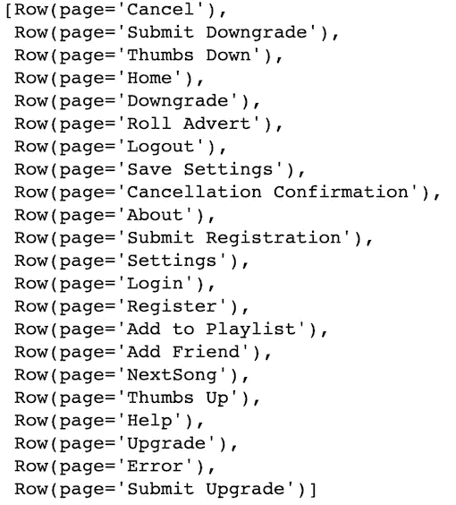
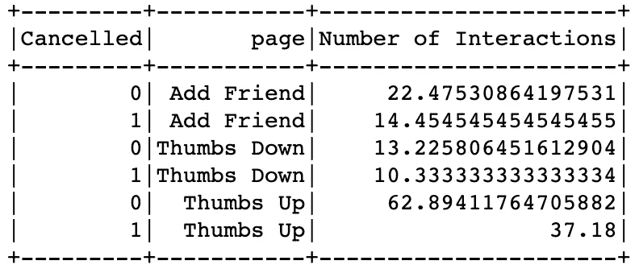
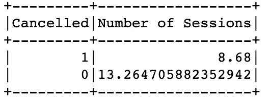
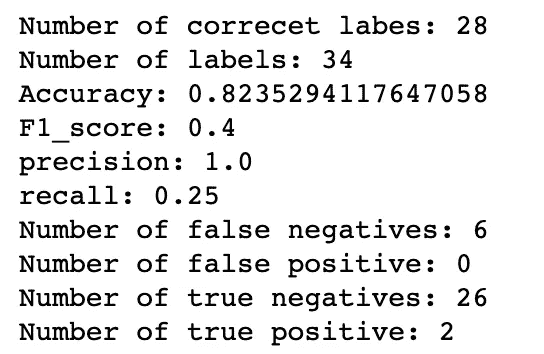
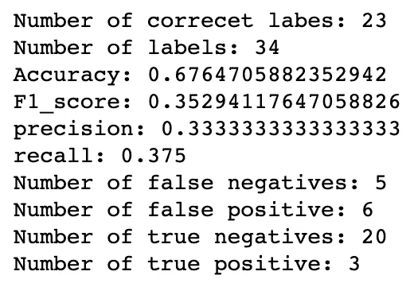

# 使用来自数字音乐流媒体应用的用户日志数据预测流失

> 原文：<https://towardsdatascience.com/predicting-churn-with-user-log-data-from-a-digital-music-streaming-app-7c30d7206daf?source=collection_archive---------43----------------------->

## 当你不知道如何开始时，你应该考虑什么


照片由 [@mantashesthaven](https://unsplash.com/@mantashesthaven) 在 [Unsplash](https://unsplash.com/) 上拍摄

预测客户流失是公司为了更好地了解客户和预测收入变化所能做的最有趣的事情之一。在这篇文章中，我将使用一个名为 Sparkfy 的数字音乐流媒体平台的数据来解释如何创建一个预测用户流失的机器学习模型。

在这篇文章中，我们将讨论这个数据集是如何组织的，以及我们可以做些什么来定义这个问题的流失。在对业务有所了解之后，我将通过各种方式来寻找能够帮助我们更好地识别不满意的用户的特性。此外，我将使用这些特性来构建一些基本模型，这些模型应该可以预测用户是否会流失。最后，我将使用一些评估指标来帮助我选择用于预测的最佳模型和参数。

在这些步骤的最后，我们将有一个机器学习模型，它接收关于用户活动的信息，并说谁更有可能离开平台。

首先，解释一下这家公司是如何运作的很重要。Sparkify 基本上类似于 Spotify，它有免费和付费账户。免费账户时不时会显示广告，而保费账户则不会。这里的主要目标是预测哪些用户将停止使用 Sparkfy 流媒体服务，而不考虑其帐户类型。

以下数据库是由 Udacity 为数据科学家提供的纳米级数据库，代表了用户在平台内的每次交互的日志。完整的数据集有 12GB 大小，这就是为什么这篇文章的代码是用 pyspark 编写的。这样，我可以用较小的数据子集(124MB)编写一个基本代码，然后扩展到一个集群。在这篇文章中，我将使用子集作为每个步骤的例子。

# 1.数据理解和清理

获取数据集的第一行为我们提供了在日志的每个字段中会发生什么的预览。像*艺人*、*名字*、*性别*这样的栏目很容易理解。它还有一些标识字段，如 *itemSession* 、sessionId 和 userId，我们在操作一些聚合函数时应该记住这些字段。对于这个 id，很重要的一点是，每个用户都有自己的 Id，每次登录时，用户都会启动一个会话，每次交互都是该会话中的一个项目，直到他注销。


其他重要的列是 *ts* ，它代表日志的时间戳，*注册*，它代表用户注册其帐户的时间戳，以及页面，它基本上是交互的内容。下面是平台中一些可能的页面。



理解了数据库中每个元素的含义后，现在可以开始查找一些错误或不需要的寄存器了。我开始检查没有 Id 的行，最终发现有一些来自 guests 用户的注册，这在 *auth* 列中有描述。这不符合我们的利益，因为我们无法预测非客户的流失。

```
user_log = user_log.filter(~user_log.auth.isin([‘Guest’,’Logged Out’]))
```

对未来的分析很有帮助的第二步是将 *ts* 和 *registration* 列转换成日期-时间格式，这样我们就可以读取日期和时间信息并执行一些日期操作。

```
get_date = udf(lambda x: dt.fromtimestamp(x / 1000.0).strftime(“%d/%m/%Y”) )user_log = user_log.withColumn(“date”, to_date(get_date(user_log.ts),’dd/mm/yyyy’))user_log = user_log.withColumn("RegistrationDate", to_date(get_date(user_log.registration),'dd/mm/yyyy'))
```

原木底座看起来并不太乱，不需要太多的清洁，因此，这两个步骤可能就足够了。通常，许多清洁步骤是在我们为下一步付出一些努力后出现的。

# 2.定义流失

定义什么是实验的流失是至关重要的。在本例中，客户流失将被定义为访问了页面*取消确认的用户。*当用户点击此取消选项并确认完成操作时，出现此页面。付费和免费账户都可以访问这个页面。

客户流失的定义可能符合你的预测目标。例如，您可能对保持付费帐户中的用户感兴趣，为此，您的流失定义可能是有权访问*提交降级*页面的用户。这个定义应该遵循一个明确的行为变化，你可以衡量，并希望避免。

# 3.探索性数据分析

在定义了客户流失之后，是时候对事件进行初步假设了。探索数据让您有机会发现和测试一些模式，以及发现一些新的未清理的数据部分。一个好的开始是显示关于基地的一些基本统计数据。

这个小的子集有 225 个唯一的用户 Id，其中 52 个是被取消的。就这些基本的统计数据，我们可以看到我们的数据是不平衡的，也就是说，它有相当多的一种类型的标签。在这种情况下，所有用户的 23%有搅动用户，77%没有。这种数据在建立模型时带来了一些问题，我们将进一步讨论这些问题。

稍微思考了一下这个问题，我提出了一些可能影响用户流失的假设:

*   被搅动的用户在会话中有较少的项目
*   被搅动的用户的歌曲种类较少
*   喝醉的用户听的歌更少了
*   喝醉的用户与朋友的互动更少
*   在使用的最后一个月中，被搅动的用户的会话更少

为了看看这是不是一个好的假设，我开始在每个标签周围做一些简单的聚合。


按已取消用户和活动用户进行聚合。取消= 1 表示搅动，0 表示活动

上表显示了每个时段的项目、听的不同歌曲和播放的歌曲总数的微小差异。这给出了关于前三个假设的方向，但是可以说活跃用户在平台上有更多的时间，因此有更多的时间来增加这些统计数据的所有数字。

探索用户互动，我们可以看到，被激怒的用户添加的好友更少，在他们的歌曲中竖起大拇指的也少得多。尽管*否定*没有显示出太多的差异，平均来说，用户的互动次数似乎在用户选择流失方面有很大的差异。



取消= 1 表示搅动，0 表示活动

最后，如前所述，人们可能会质疑用户在平台中停留的时间。因此，下表考虑了最近 30 天的会话数。很明显，和以前没有太大区别。



过去 30 天内的会话。取消= 1 表示搅动，0 表示活动

# 4.特征工程

在考虑了一些想法之后，你应该根据 EDA 选择你最有希望的想法。经过一番考虑，我总结出以下特点:

*   **AvgSongsPlayes** :每个用户平均播放的歌曲。预计注销帐户的用户在平台上的参与度较低，因此播放的歌曲较少
*   **LikedSongsProportion** :每个用户 id 不喜欢的歌曲占喜欢的歌曲的比例。如果用户不喜欢该平台的歌曲，预计他会离开
*   **FriendsAdded** :用户按下添加好友按钮的次数。与他人互动越多的用户在平台上停留的时间越长
*   **DaysInPremium** :用户使用 Premium 账户的天数。创建该功能是为了控制用户账户生活中的里程碑。可能用户根据他们在 premium 帐户中的时间长短表现出不同的方式。
*   **SessionsLast30days** :用户在过去 30 天内有多少个会话。预计用户在取消之前会减少会话的数量。
*   **性别**:用户的性别。
*   **Sparkfy 中的天数:**用户保留其帐户的天数。

对于某些特性来说，标准化这些值是很重要的。在这种情况下，我只将性别分类数据转换为二进制数值数据，以便可以在模型中使用。

# 5.分割培训/测试并定义评估指标

您理解了数据集，做出了一些假设，测试了假设，现在是时候将所有这些放入机器学习模型中了！在测试某些模型之前，让我们将数据集分成随机样本，其中 80%用于训练，20%用于测试模型。

```
features = [ "Avg_Songs_Played_Session",
             "genderIndexed",
             "ThumbsProportion",
             "Friends_Added",
             "Days_In_Premium",
             "SessionsLast30days",
             "DaysInSparkfy"]assembler = VectorAssembler(inputCols=features,outputCol="features")ModelData = assembler.transform(ModelData)train, test = ModelData.randomSplit([0.8, 0.2], seed=42)
```

在拟合任何模型之前，我们应该定义如何比较它们。出于这个原因，准确性总是一个很好的起点，毕竟，我们希望模型预测尽可能多的正确标签。然而，通常，我们更重视分类模型中的错误类型，因此，我们将考虑其他评估指标，如召回率和精确度。如果你想更好地理解每个指标是什么，我推荐下面的[帖子](/accuracy-precision-recall-or-f1-331fb37c5cb9)。

在这个具体的问题中，找到可能的用户的全部目的是与他们互动，以避免他们的帐户被取消。也许给他们折扣或提供新的特别设计的播放列表，让他们在平台上保持活跃。因此，最糟糕的情况是，如果我们预测用户会取消其账户，而他不会，Sparkfy 会让已经活跃的用户更多地参与到平台中。

然而，当模型预测用户不太可能流失，而实际上他是，这个分类错误正在花费 Sparkfy 客户端的成本，这意味着我们正在陷入分类问题的主要目标。因此，在我们的评估中，我们应该优先考虑回忆而不是精确。

# 6.构建模型

在这种二元分类的情况下，我们可以应用许多可能的模型。我将尝试 3 种不同的模型，它们是解决这类问题的主流模型，并比较它们的结果。最好的表演之一就是我们要调音的那场。第一次试验选择的模型是逻辑回归、梯度推进决策树和支持向量机分类器。

逻辑回归分类器是最简单的，因此将成为我们比较其余模型的基线。我创建了一个基本函数，它从我们的分类器中获取结果数据帧，并显示我们将要比较的指标。



逻辑回归 1

尽管精确度很高，但这个模型的精确度和召回率是可以接受的。如前所述，这是由于数据不平衡造成的。由于活跃用户比不活跃用户更占优势，该模型将大多数用户分类为活跃用户，并仍然获得良好的准确性，这是该模型试图改善的唯一指标。

出于这个原因，我将考虑对这个模型进行权重修正，以使它对类别的不平衡具有鲁棒性。这种技术更重视看起来不太明显的标签。我使用了下面来自 Dan Vatterott 的[帖子中的代码，在我的数据框中创建了一个创建理想平衡的列。](https://danvatterott.com/blog/2019/11/18/balancing-model-weights-in-pyspark/)

创建权重后，我们应该在拆分前将其放在一个列上:

通过类平衡，该模型极大地提高了它的精确度和召回率，同时在精确度上有一点损失。


逻辑回归 2 —权重的使用

对于梯度提升树分类器，我们不需要使用类权重。增强分类器通过许多交互作用来惩罚错误的预测。这使得它们成为应用于不平衡数据的良好统计模型，因为它们自然地对那些在上次交互中被错误分类的情况给予更多的权重。在这篇[文章](https://www.analyticsvidhya.com/blog/2017/03/imbalanced-data-classification/#:~:text=Dealing%20with%20imbalanced%20datasets%20entails,as%20it%20has%20wider%20application.)中，你可以更深入地探究这个主题。

```
gbt = GBTClassifier(labelCol=”Cancelled”, featuresCol=”features”)
gbtModel = gbt.fit(train)
results = gbtModel.transform(test)
ShowMetrics(results)
```



梯度增强决策树分类器

三个分类器中最好的基础模型是逻辑回归。它预测更多具有良好召回值的校正标签。此外，我们不需要为了获得好的召回率而放弃这个分类器的精度。下一步将是超调模型。

为了调整模型，您应该直观地了解每个可用参数对分类器的影响。对于逻辑回归，我选择了两个我认为可以改进模型的参数。第一个是 *regParam* ，它表示模型的正则化或模型的修改，帮助它[更好地推广到看不见的数据](https://www.kdnuggets.com/2016/06/regularization-logistic-regression.html)。第二个是迭代次数。默认值是 100，但我尝试了 150 和 50，这样我们可以检查分类器是否可以在更多的迭代中做得更好，或者它是否会因为太多的迭代而失去性能。

交叉验证的结果与默认的线性回归模型相同。但是，最佳模型的参数与默认模型的参数不同。迭代次数设置为 50，正则化率设置为 0.1。由于训练数据集只包含 191 个观察值，超调不会在结果中产生太大的差异。

在这篇文章中，我介绍了创建预测客户流失的机器学习模型的基本步骤:

1.  问题动机
2.  问题的定义和解决策略
3.  基本数据清理
4.  探索性数据分析
5.  特征的创建
6.  定义用于比较模型的指标
7.  处理阶级不平衡
8.  测试和选择模型
9.  调整最终模型

因此，我们有一个分类模型，可以定期预测哪些注册用户更有可能取消他们的帐户，准确率为 79%。通过这种方式，Sparkify 可以在失去客户之前采取行动。

到目前为止，这是一个很好的结果，但是要改进这个模型还有很多工作要做。例如，我们可以在更大的数据集上训练分类器。如前所述，这些结果仅考虑全部数据的一小部分，随着新寄存器的加入，结果可能会发生巨大变化。

另一个改进是不仅预测注销账户的用户的流失，还预测从付费账户降级到免费账户的用户的流失。通过这种方式，Sparkfy 可以对其最重要的用户进行操作，这些用户是保持现金收入的用户。

这篇文章的详细代码可以在这个 [git 仓库](https://github.com/Lucas-Correa/Churn-in-Sparkfy)中找到。希望你喜欢它！