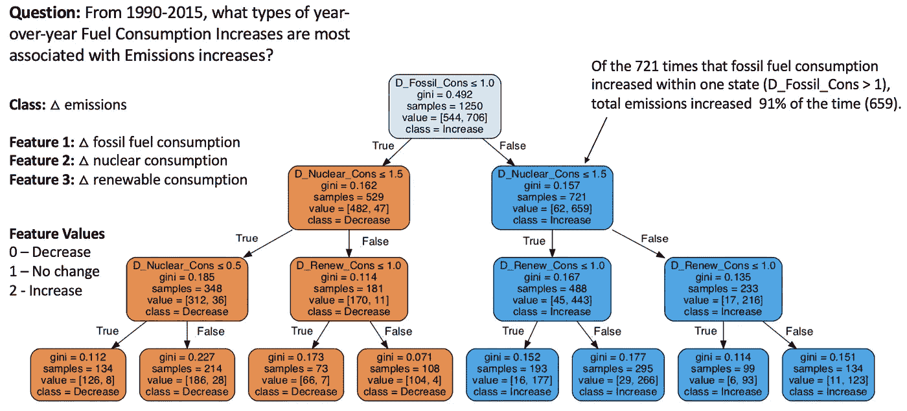
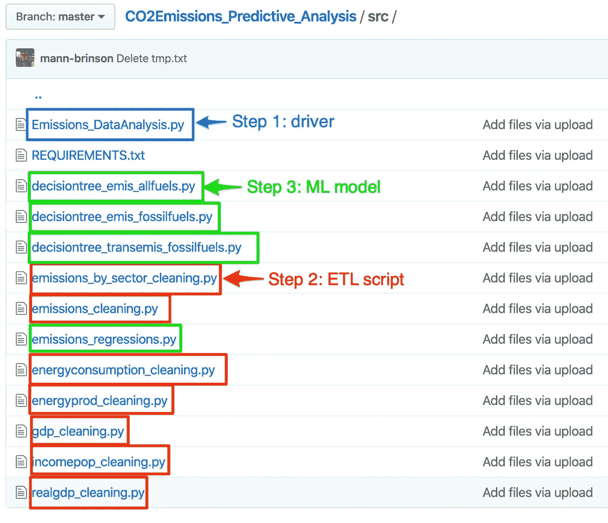
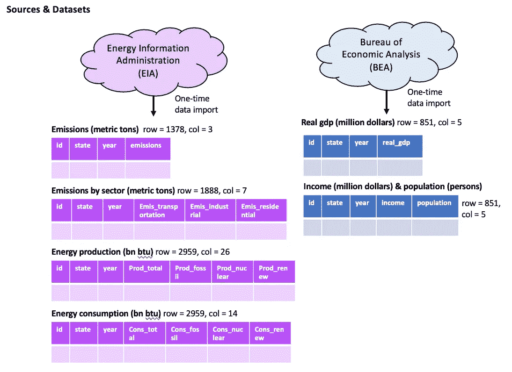
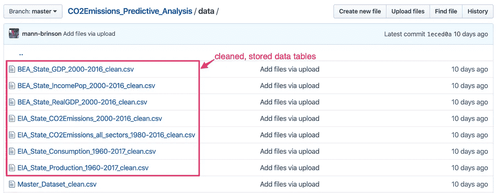
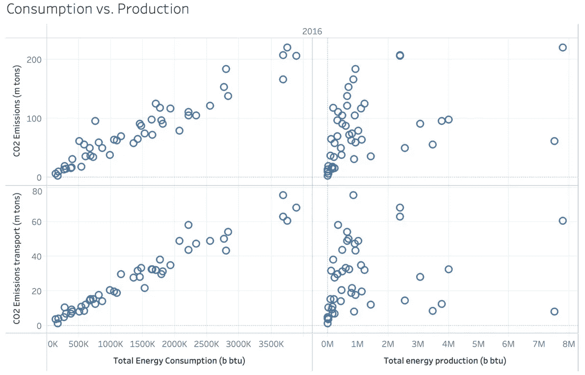
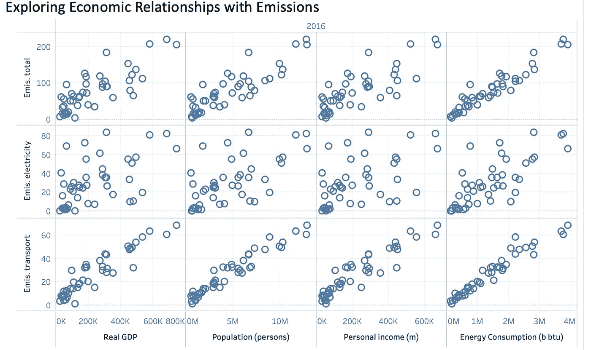
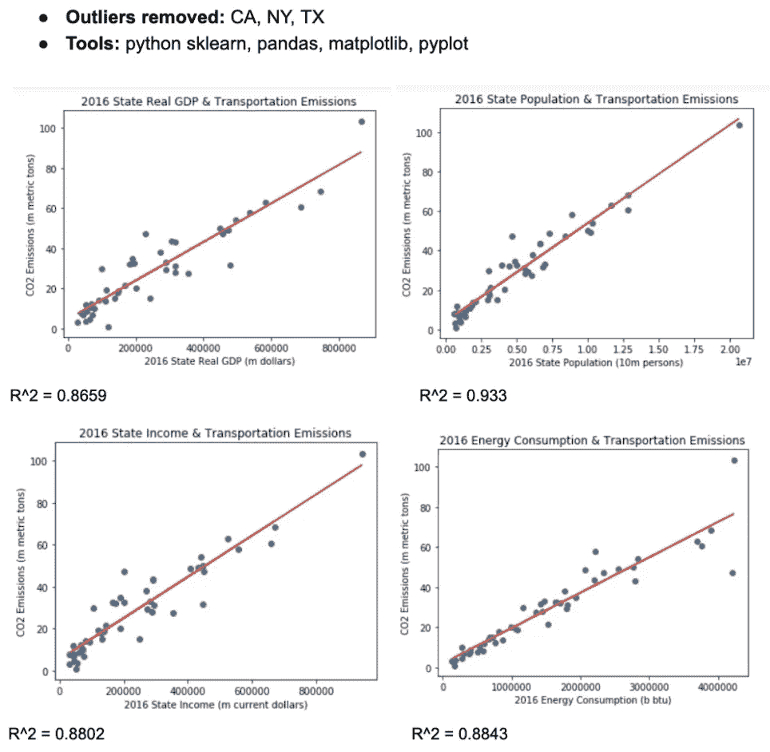
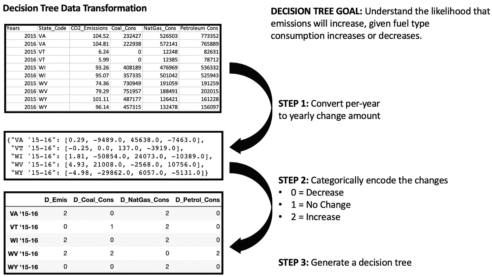
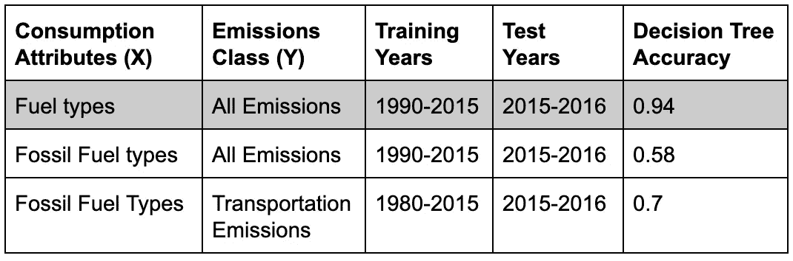

# 用决策树模型预测二氧化碳排放增长

> 原文：<https://towardsdatascience.com/predicting-co2-emissions-growth-with-decision-tree-modeling-d4f588a8d8a2?source=collection_archive---------16----------------------->

基于化石/核能/可再生能源消费增长的二氧化碳增长预测

## Python ETL 脚本、Tableau 探索性数据分析和 scikit-learn 决策树

二氧化碳排放量的增长是导致气候变化速度加快的一个主要因素。为了减少二氧化碳排放，各国必须发挥积极作用，遏制与排放增长最相关的能源消费活动。在当前的能源消费形势下，可再生能源(例如:风能、太阳能)的消费也越来越受到重视。为了优先考虑对减少二氧化碳排放影响最大的举措，各国必须配备高性能的**未来排放预测工具。**

# 拟议解决方案

在这个项目中，我们旨在提供这样一种工具，它使用决策树机器学习算法，根据一个州的能源消耗状况的理论变化来预测该州的排放量增长。

该工具使用 **Python 脚本**来提取、标准化和创建基于六个独立数据集的模型，这些数据集与州排放、经济和能源消耗概况相关。这里使用的主要 Python 库是:requests、pandas 和 scikit-learn。

该项目基于 2019 年秋季南加州大学维特比工程学院应用数据科学硕士项目 INF 550“大规模数据科学”课程的一项任务，由金善浩教授提供建议。我的搭档哈维尔布兰东也为这个项目做出了巨大贡献。

概念验证(POC)现已在我的 Github 页面-> [**此处**](https://github.com/mann-brinson/CO2Emissions_Predictive_Analysis) **上提供了用户友好的指南。**

# 假设问题

我们希望为本项目提供指导的两个主要假设问题是:

*   国家能源消耗或生产与排放有更高的关系吗？
*   给定一个州的能源消耗增长，我们能很有把握地预测排放量是否会增长吗？

我们将使用清理数据集上的 Tableau 散点图来回答第一个问题。我们将使用 Python scikit-learn 处理转换后的数据来回答第二个问题。

# ETL 和建模应用程序的结构

为了对 python 脚本和结果数据文件进行组织，我用两个子文件夹构建了存储库:

*   **src** —保存用于生成数据库的所有脚本，包括:驱动程序文件、python 模块需求、表格清理、线性回归和决策树脚本。这个驱动文件叫做**‘Emissions _ data analysis . py’。**应该从终端调用这个驱动程序，以运行所有的清理和建模脚本。
*   **数据** —保存已清洗的。csv 文件、线性回归和决策树可视化输出

src 文件夹的组织——驱动程序、清理和建模脚本位于此处

# 步骤 1:数据采集

该分析考虑了各州的历史排放、能源生产、能源消耗和经济数据。这些数据是从两个美国机构的网站上获得的——能源信息署 **(EIA)** 和经济分析局 **(BEA)** 。从这些 web 资源中，提取了六个表，并使用各自的 python 脚本对每个表进行了规范化。EIA 提供了涵盖 2000 年至 2016 年的国家排放、部门排放、能源生产和能源消费的数据集。这些数据发表在。该机构网站上的 csv 格式。

提取后，数据表被规范化并存储在本地。csv 文件

每个表都通过一个'-cleaning.py '脚本进行提取、转换和存储。x4 EIA 清理脚本指向。csv 文件，而 x2 BEA 脚本利用 BEA API 工具提取数据。

# 步骤 1:数据转换

为了实现排放、经济、能源生产和能源消耗表的连接，在写入之前，使用 **python pandas** 在内存中对数据进行了规范化。csv 文件到磁盘。这些数据集覆盖了不同的年份，并在不同的维度上扩展。一些数据集的属性是行，状态是列，而另一些则相反。每个脚本都必须适合数据源的原始格式，这样才能完成正确的转换。

标准化表格格式的过程是一个不可避免的障碍。然而，这一步是探索性数据分析(Tableau)和机器学习模型创建(Python)的基本**先决条件**。有了规范化的表格，现在可以将数据连接在一起，研究经济和环境指标之间的关系。

# 步骤 2:关系表的存储

清理完成后，每个数据集都作为存储库中的. csv 文件写入磁盘。我们使用的数据集相对较小，因此我们可以管理其中的存储。csv 文件在用户的机器上足够容易。

如果数据集非常大(千兆字节或兆兆字节)，我们将在远程机器上实现已清理数据的存储。我们还希望使用分布式方法实现 python 数据清理，将工作分配给几个工人。

在应用程序的“数据”文件夹中存储已清理的数据文件

# 步骤 3:数据探索过程

在连接这些表之后， **Tableau** 用于探索针对假设问题的连接数据集的可视化。与假设一致，目标是揭示经济活动、能源消耗和排放之间的可预测关系。

**双变量分析** —在此步骤中，探索了两个变量的许多组合，试图揭示预测关系。Tableau 用于快速构建二元可视化。在此步骤中，重点还在于回答与初始假设相关的两个问题:

每个观察代表 2016 年的一个州

**1。能源生产或消费与排放的相关性更大吗？** —为了探索这个问题，我们分析了 2016 年的数据，并构建了一个散点图矩阵，将生产和消费设为自变量，将源排放量(总&运输)设为因变量。这一形象化的分析清楚地表明了消费和排放之间存在着更强的联系。因为消费有很强的相关性，所以在分析的后面会对消费类型(化石燃料、核能、可再生能源)进行更深入的探讨。

“排放运输”关系中的噪音更少

**2。哪些经济因素可以用来预测排放量？—** 为了理解这个问题，我们选择了 2016 年的数据来创建另一个散点图矩阵，希望观察到线性关系。该散点图使用经济指标(实际国内生产总值、人口、个人收入、能源消耗)作为自变量，源排放量(总量、电力、交通)作为因变量。每个观察值反映了 2016 年的一个特定状态。为了保持这种关系，剔除了异常值，包括必须单独研究的较大状态。这些州异常值是加利福尼亚州、佛罗里达州、洛杉矶、纽约州和德克萨斯州。

从这个可视化结果来看，与**运输排放**的关联分数最为明显。由于强线性关系，这表明运输排放可能是使用线性回归线进行预测的强有力候选。

# 步骤 4:模型创建-线性回归

在观察到经济变量和运输排放之间的强线性关系后，正式定义了二元线性回归关系。这些回归使用了 2016 年的数据，并再次删除了必须单独研究的州异常值(加利福尼亚州、纽约州、德克萨斯州)。Python 脚本连接到了。csv 表并用于构建回归模型。Python 包 pandas、pyplot、matplotlib 和 scikit learn 用于模型和可视化。

每条回归线的 R 平方得分至少为 0.8659，这意味着这些线将解释因变量中至少 0.8659 的变异。如果没有行业标准的领域知识，很难相信这个度量的质量。然而，回归模型为预测运输排放提供了相对准确的工具。

从' [emissions_regressions.py](http://emissions_regressions.py) 创建的回归输出

# 步骤 5:模型创建—决策树

在确定了总排放量和能源消耗之间的关系后，工作重点转向进一步发展这种关系，寻找与排放量增加最相关的能源消耗类型(化石、核能、可再生能源)和化石燃料消耗类型(煤、天然气、石油)。Python pandas 用于数据转换，scikit-learn 用于算法和可视化。

决策树需要的数据转换，在'[decision tree _ emis _ foster fuels . py](http://decisiontree_emis_fossilfuels.py)

作为该分析的先决条件，必须转换数据以符合决策树分类输入要求。在此分析中，类别设置为排放量，属性设置为煤炭、天然气和石油消耗。然后，计算从 1990 年到 2016 年每个类别和属性的逐年增长。最后，每个增长指标被分类编码为 0 —减少，1 —无变化，2 —增加。对数据进行编码后，三个不同的决策树根据 1990 年至 2015 年的数据进行了训练(行数= 1250)，并将增长限制在三个节点，以避免过度拟合。然后用 2015-2016 年的数据(行= 50)测试每棵树，并分析结果。

每个决策树的测试结果

在 python scikit-learn 包中， **DecisionTreeClassifier** 对象用于增长树并使用基尼不纯指数对数据节点进行分区。基尼系数显示了随机选择的元素被错误标记的频率。类似于使用最高信息增益的节点分裂，最小的 gini 杂质用于分裂树。此外，对于进一步的节点，DecisionTreeClassifier 对象考虑同一属性的较小分区的 gini 杂质，以最大化分类的准确性。

我们有最高的测试精度(0.94%)，模型设置为预测“燃料类型”(化石、核能、可再生能源)的“所有排放”。在所述决策树(如下)中，第一个节点表明化石燃料消耗的增加对排放增加的影响最大。即使考虑到核能和可再生能源消费的增长(第二和第三节点)，排放量增长预测主要反映了化石燃料的增长状况。这一观察结果反映出**化石燃料的消耗与排放密切相关。然而，包括第二和第三节点(核能和可再生能源)增加了模型预测的准确性。**

最高性能决策树的输出，来自'[decision tree _ emis _ all fuels . py【T1]'](https://github.com/mann-brinson/CO2Emissions_Predictive_Analysis/blob/master/src/decisiontree_emis_allfuels.py)

# 结论

这项研究证明:1)可以使用人口、国内生产总值和消费**【线性回归】**来预测州交通排放；2)减少化石燃料比可再生能源消费**【决策树】**对排放的影响更大。

这些都是重要的见解，因为它们为特定的行动过程提供了数据驱动的基础。例如，希望减少总体排放量的国家可以考虑鼓励减少化石燃料的消耗，而不是太阳能电池板等可再生能源的消耗。这个话题开启了关于设计减少国家二氧化碳排放的最有效途径的对话。