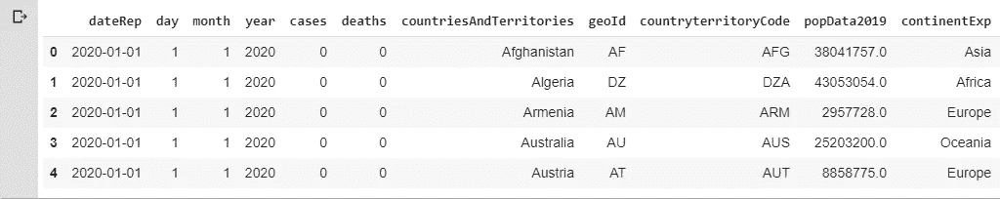
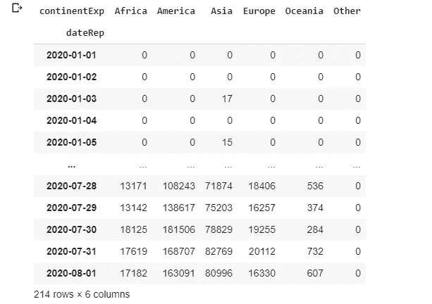
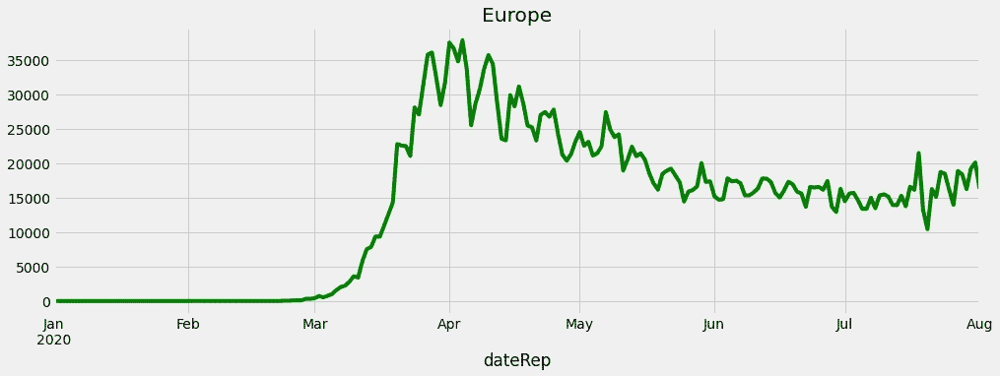
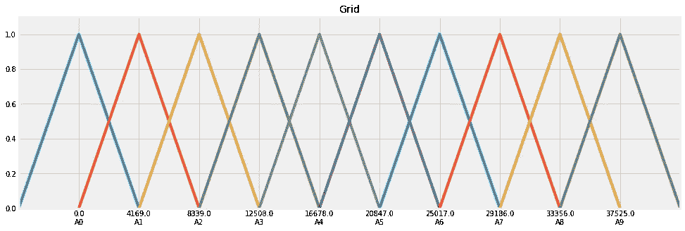
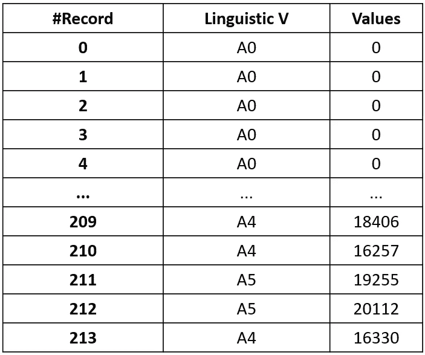
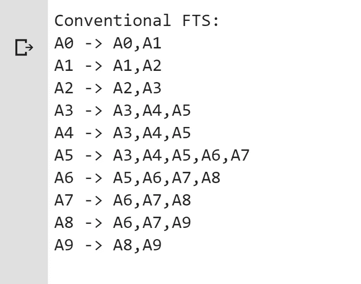
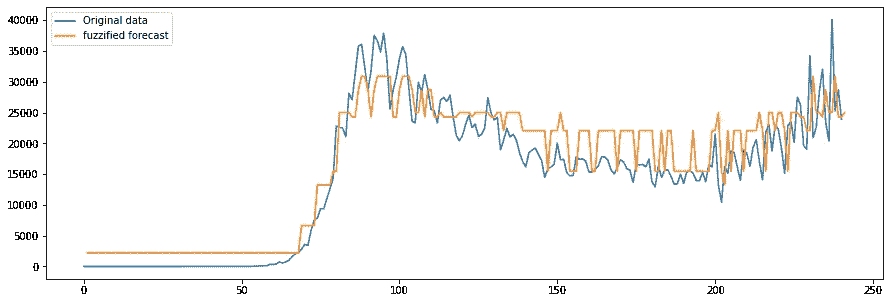

# 用模糊逻辑预测新冠肺炎感染

> 原文：<https://towardsdatascience.com/predicting-covid-19-infection-based-on-fuzzy-logic-e434910d8809?source=collection_archive---------28----------------------->

## 如何利用模糊时间序列预测冠状病毒感染病例


约翰·利博特在 [Unsplash](https://unsplash.com/?utm_source=unsplash&utm_medium=referral&utm_content=creditCopyText) 上的照片

# 介绍

使用时间序列预测方法是分析疫情感染率的常用方法。这将有助于我们创建更好的决策支持系统。我在这里所写的，是我在伊斯法罕科技大学 J-Asgari 教授的模糊系统课程中学到的一部分。所以我们先从时间序列的定义说起。


时间序列是在连续的、在大多数情况下是等距的时间周期/时间点对一个个体或集体现象的数量特征进行的一组有规律的时序观察[ [更确切地说是](https://stats.oecd.org/glossary/detail.asp?ID=2708#:~:text=A%20time%20series%20is%20a,%2C%20periods%20%2F%20points%20of%20time.) ]。时间序列数据有两种主要的预测方法:

1-统计工具:阿玛 SARIMA 萨里玛[ [更多](/forecasting-covid-19-tweeting-volume-using-prophet-and-sarima-model-25206ea5b23b) ]
2-基于神经网络的智能工具，如 RNN 和 LSTM [ [更多](https://adventuresinmachinelearning.com/recurrent-neural-networks-lstm-tutorial-tensorflow/)

# 数据探索

我们已经查看了从[这里](https://data.europa.eu/euodp/en/data/dataset/covid-19-coronavirus-data/resource/55e8f966-d5c8-438e-85bc-c7a5a26f4863)下载的欧洲数据。此外，所有数据文件、源代码和笔记本都已上传到这个 [Colab 笔记本](https://colab.research.google.com/drive/1moAz_6JgyL9M1SY7v-4ORr-p6n-RQis0?usp=sharing)上。让我们快速浏览一下数据集:

```
import pandas as pd
import warnings
import matplotlib.pylab as plt
%pylab inlinedf = pd.read_excel('COVID-19.xlsx')
df.head()
```



如上所示，我们必须按“continentExp”和“countriesAndTerritories”汇总数据:

```
#Aggregate by continentExp
continentExp = pd.pivot_table(df, values='cases', index=['dateRep'],columns=['continentExp'], aggfunc=np.sum, fill_value=0)#Aggregate by countriesAndTerritories
countriesAndTerritories = pd.pivot_table(df, values='cases', index=['dateRep'],columns=['countriesAndTerritories'], aggfunc=np.sum, fill_value=0)
```



按 continentExp 汇总

```
continentExp["Europe"].plot(figsize=(15,5), color=["green"], title='Europe')plt.show()
```



# 模糊时间序列预测

1965 年，扎德提出了模糊集的概念，作为检验未知隶属度的工具。许多模糊研究试图将这种方法作为理论框架，并广泛应用于自然科学和社会科学的研究领域，取得了良好的研究成果。模糊时间序列也是从模糊集概念中衍生出来的一种分析方法。由扎德提出的模糊集有许多表现形式，如模糊集、模糊决策分析和模糊时间序列。[【1](https://www.intechopen.com/books/time-series-analysis-data-methods-and-applications/fuzzy-forecast-based-on-fuzzy-time-series)。

## pyFTS 库是什么？

这个软件包是为学生，研究人员，数据科学家，或谁想要利用模糊时间序列方法。这些方法提供了简单，易于使用，计算成本低，人类可读的模型，适用于统计外行专家。 [Github](https://github.com/PYFTS/pyFTS) 。


```
#install pyFTS
!pip install pyFTSCollecting pyFTS   Downloading [https://files.pythonhosted.org/packages/41/3a/c5ef1879b33fdf07dc5678e8484d9ea637924afd6c66f14d65001cb1cddf/pyFTS-1.6-py3-none-any.whl](https://files.pythonhosted.org/packages/41/3a/c5ef1879b33fdf07dc5678e8484d9ea637924afd6c66f14d65001cb1cddf/pyFTS-1.6-py3-none-any.whl) (175kB)      |████████████████████████████████| 184kB 3.3MB/s  Installing collected packages: pyFTS Successfully installed pyFTS-1.6
```

## 定义语言变量

对于语言变量，我们指的是其值为自然或人工语言中的单词或句子的变量。例如，年龄是一个语言变量，如果它的值是语言的而不是数字的，即年轻、不年轻、非常年轻、非常年轻、老、不太老和不太年轻[ [2](https://www.sciencedirect.com/science/article/pii/0020025575900365#:~:text=By%20a%20linguistic%20variable%20we,a%20natural%20or%20artificial%20language.&text=It%20is%20shown%20that%20probabilities,very%20likely%2C%20unlikely%2C%20etc.) ]。

我们定义了 10 个变量“A0 — A9”，其中 A0 的感染度最低，A9 的感染度最高。然后进行模糊化，即通过最大化方法将每条记录集合成一个模糊集。

```
from pyFTS.partitioners import Griddata = data.valuesfs = Grid.GridPartitioner(data=data,npart=15)fig, ax = plt.subplots(nrows=1, ncols=1, figsize=[15,5])fs.plot(ax)
```



```
fuzzyfied = fs.fuzzyfy(data, method='maximum', mode='sets')pd.DataFrame(fuzzyfied).assign(values = list(data)).tail()
```



## 时间模式

这部分描述了考虑先例→结果逻辑已经生成的规则，例如，在 A0 先例之后，我们移动到 A0 和下一个时间步(t+1) A1。所以这里我们有:

```
from pyFTS.common import FLRpatterns = FLR.generate_non_recurrent_flrs(fuzzyfied)print([str(k) for k in patterns])output: 'A0 -> A0', 'A0 -> A1', 'A1 -> A1', 'A1 -> A2', 'A2 -> A2', 'A2 -> A3', 'A3 -> A3' ... ,'
```

## 规则生成

在生成模糊规则时，需要解决类之间的重叠。有两种解决重叠的方法:一种是在不考虑重叠的情况下生成模糊规则，然后通过调整模糊规则来解决重叠；另一种是在生成模糊规则的同时解决重叠。我们把前者的静态模糊规则生成和后者的动态模糊规则生成[ [更称为](https://link.springer.com/chapter/10.1007/978-1-4471-0285-4_5) ]。

根据我们上面讨论的模式，可以生成时间步长移动的规则。

```
from pyFTS.models import chenmodel = chen.ConventionalFTS(partitioner=fs)model.fit(data)print(model)
```



上述规则显示了每个语言变量的先例和后果，并生成规则。也就是说，在 A0 中发生的任何数据都有 A0 和 A1 的结果，这意味着在 A0 之后没有 A2 的数据。

## 模糊化和建模

模糊化就是将模糊域中的连续量分成几个层次，根据需要，每一个层次都可以看作一个模糊变量，并对应一个模糊子集或一个隶属函数[ [more](https://www.sciencedirect.com/topics/engineering/fuzzification) ]。

```
fuzzyfied = fs.fuzzyfy(18876, method='maximum', mode='sets')fig, ax = plt.subplots(nrows=1, ncols=1, figsize=[15,5])forecasts = model.predict(data)forecasts.insert(0,None)orig, = plot(data, label="Original data")pred, = plot(forecasts, label="fuzzified forecast")legend(handles=[orig, pred])
```



# 结论

[ARIMA 时间序列](/forecasting-covid-19-tweeting-volume-using-prophet-and-sarima-model-25206ea5b23b)预测中的方法可以预测平均误差。利用模糊时间序列中的公式，我们可以求出平均误差。模糊时间序列的误差值小于 ARIMA 时间序列的误差值。因此可以得出结论，模糊时间序列比其他时间序列模型有更好的结果。

# 参考

[经合组织](https://stats.oecd.org/glossary/detail.asp?ID=2708#:~:text=A%20time%20series%20is%20a,,%20periods%20/%20points%20of%20time.)

[静态模糊规则生成](https://link.springer.com/chapter/10.1007/978-1-4471-0285-4_5)

[使用 Prophet 和 SARIMA 模型预测新冠肺炎的推文量](/forecasting-covid-19-tweeting-volume-using-prophet-and-sarima-model-25206ea5b23b)

[科学指导](https://www.sciencedirect.com/topics/engineering/fuzzification)

[模糊时间序列的简短教程](/a-short-tutorial-on-fuzzy-time-series-dcc6d4eb1b15)