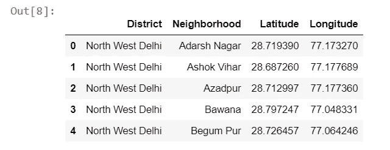
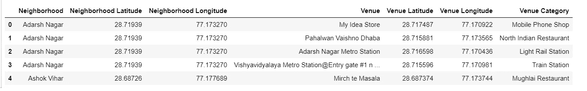
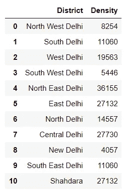
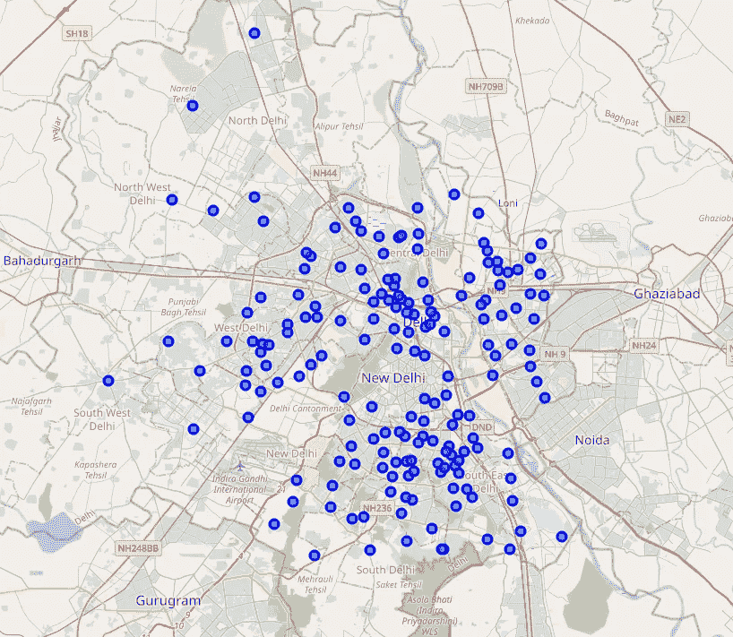
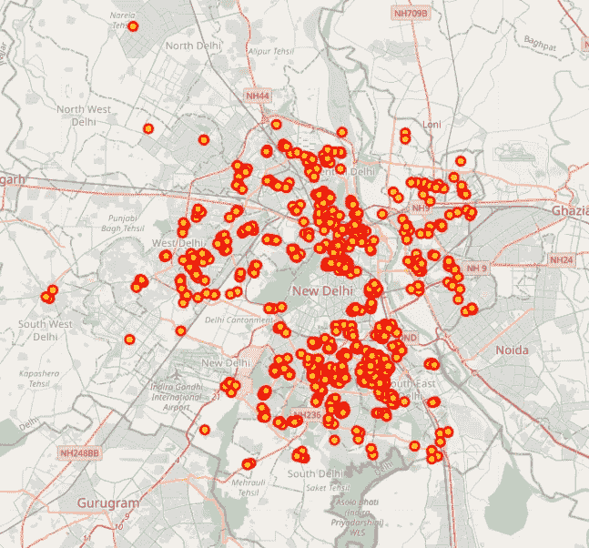
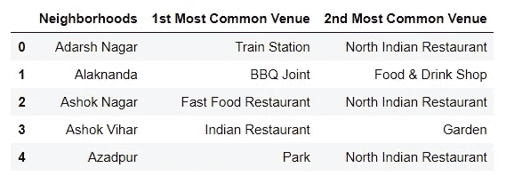
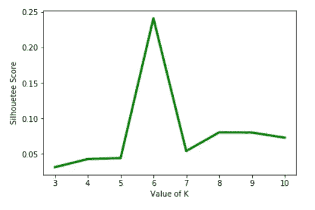
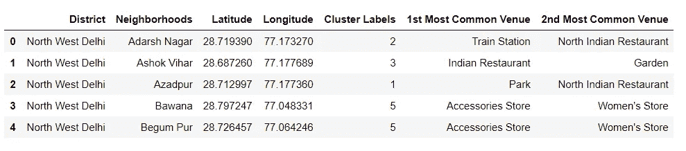
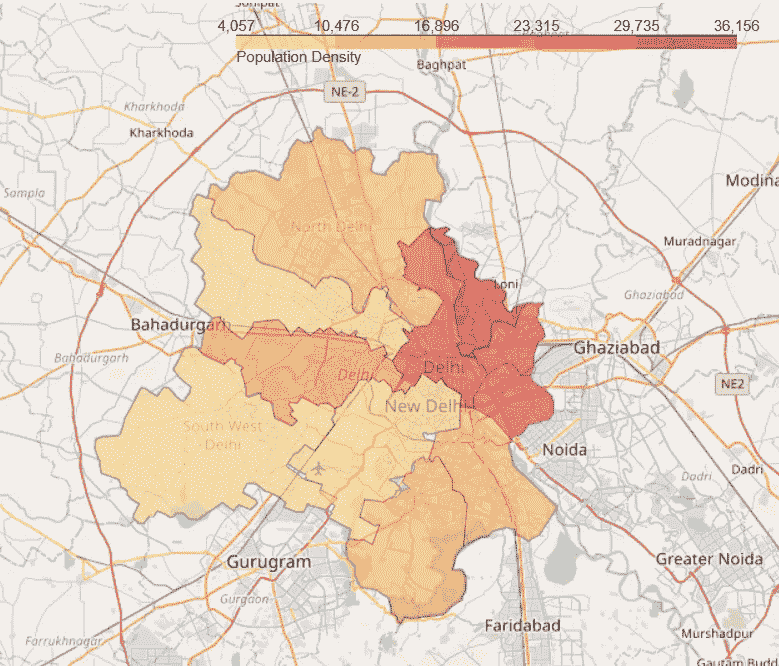
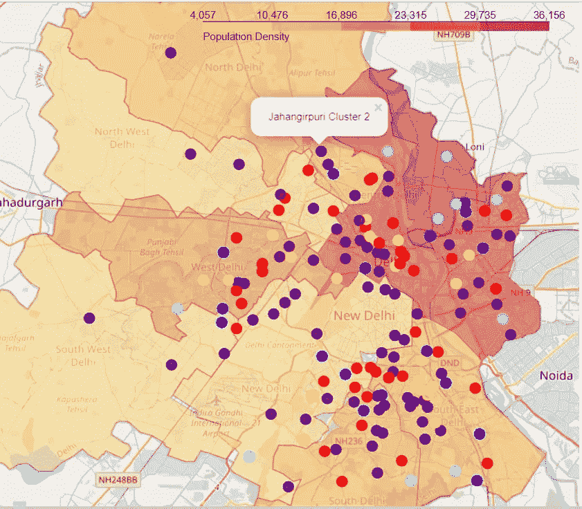

# 使用邻域聚类预测德里的新冠肺炎密集区

> 原文：<https://towardsdatascience.com/predicting-covid-19-intensive-zones-in-delhi-7e07f29a7231?source=collection_archive---------55----------------------->

## 对位置进行分析和分组，以制定最佳位置缓解策略

[https://news.un.org/en/story/2020/02/1056562](https://news.un.org/en/story/2020/02/1056562)

***编者注:*** [*走向数据科学*](http://towardsdatascience.com/) *是一份以研究数据科学和机器学习为主的中型刊物。我们不是健康专家或流行病学家，本文的观点不应被解释为专业建议。想了解更多关于疫情冠状病毒的信息，可以点击* [*这里*](https://www.who.int/emergencies/diseases/novel-coronavirus-2019/situation-reports) *。*

# 1.介绍

## 1.1 背景

新冠肺炎是一种传染性疾病，它扰乱了地球上每个平民的日常生活，给现代世界带来了巨大灾难。该病毒主要影响肺部，全球已有 4，543，390 人感染，303，711 人因此丧生(截至 2020 年 5 月 15 日)。疫情迫使世界各国领导人采取严厉措施，如全国范围的封锁，以遏制病毒的传播。但是封锁阻碍了平民的工作和谋生，其影响不仅困扰着穷人，也困扰着社会的每一个部分，甚至政府本身。在这种情况下，经济下滑，国家可能走向衰退，人们可能被迫离开，与病毒一起工作和生活。这给像印度这样人口密度巨大的国家带来了巨大的风险。

## 1.2 问题

为了预见解除封锁的影响，我的研究和这本笔记本将帮助人们了解哪些社区可能会出现新冠肺炎病例激增。我将使用人口密度数据和热门地点(如热门市场)的位置数据来估计在特定地点发生的交互。这些社区将被分组，这样就可以建立共同有效的策略来处理类似的地方。我将主要关注我所在城市(印度首都德里)的预测。

## 1.3 利息

借此，我希望读者能够更好地了解潜在的危险区域，当局可以采取措施，事先对这些区域进行限制，以减少病毒的传播，从而减少平民生活的痛苦。

我希望并祈祷读到这封信的人平安无事。

# 2.数据

为了解决上述问题，我利用了以下数据:

## 德里的邻近地区(及其分割的基础)

德里有 9 个区，居民区都集中在其中一个区。

链接—[https://en.wikipedia.org/wiki/Neighbourhoods_of_Delhi](https://en.wikipedia.org/wiki/Neighbourhoods_of_Delhi)

*请注意，这一数据是根据 2011 年人口普查得出的，根据目前的情况，人口普查公布了 9 个区，而不是 11 个区。因此，我将在南德里下增加东南德里的地方，在东德里下增加沙达拉的地方。*

当我在地图上绘制结果时，这些数据将用于定义邻域。我借助谷歌地图中的“搜索”选项，计算出每个街区的大致坐标，并创建了自己的数据集。

## 热门地点的位置数据——由 Foursquare API 提供

Foursquare API 提供了与特定地点不同地点出现频率相关的数据。我将使用位置数据来识别人流密集的场所(如市场)附近的集群。这些区域将被识别为热点区域。

*值得注意的是，Foursquare API 没有太多关于德里场馆的细节，因此这只是真实世界的一个大概图片。但我们可以肯定地说，这是一个很好的近似值，将满足我们的需要。*

## 各地区的人口密度——2011 年人口普查数据

由于生活条件高度接近，人口密度数据将用于标记具有潜在高社区传播风险的地区。

链接—[https://www . census 2011 . co . in/census/state/district list/Delhi . html](https://www.census2011.co.in/census/state/districtlist/delhi.html)

## 地区边界数据

我自己创建了一个数据集，里面有德里每个区的多边形坐标。我利用两个网站——[http://nominatim.openstreetmap.org/](http://nominatim.openstreetmap.org/)和[http://polygons.openstreetmap.fr/index.py](http://polygons.openstreetmap.fr/index.py)首先提取地图上一个地方的位置，然后分别提取其坐标。

# 3.方法学

为了预测德里的 COVID 密集区，我们将执行以下步骤:

1.  查找每个街区的热门场地类别
2.  使用 KMeans 聚类，根据流行的场所类别形成邻域的聚类。
3.  叠加一层每个地区人口密度的 choropleth 图，以正确预测可能情况的严重性

最初，我开始想象社区和每个社区的活动场所。

根据社区对场地进行分组，我们看到只有 161 个社区被返回。这意味着在 177 个社区中，有 16 个没有场地结果。

现在，我创建了一个表，其中包含了在每个社区中找到的前两个场所类别。

根据找到的顶级场所，我使用 KMeans 聚类对相似的社区进行分组。我利用剪影分数比较来寻找 K 的最佳值(即聚类数)。

K 的最佳值为 6，然后用 K 均值聚类法将邻域分成 6 类。然后将结果合并到一个数据框中。

# 4.结果

在使用地区人口密度数据创建一个 Choropleth 地图时，我得到了这个。

此后，我将邻近区域的聚类添加到该地图上，这样我们就可以根据该地点的聚类属性和人口密度来了解邻近区域的聚类以及对它们的关注程度。

**图例**:

*   最令人担忧的——红色、黄色
*   适度关注—紫色、蓝色
*   最不值得关注的——绿松石
*   无关—绿色

**邻域聚类属性有:**

1.  主要有“快餐店”和其他社交活动场所的社区。(最受关注)—黄色标记
2.  有住宅区和日常平民活动区的社区。(中度相关)—蓝色标记
3.  有许多日常生活相关场所的社区。(中度相关)—紫色标记
4.  以“印度餐馆”为主的街区。(最受关注)—红色标记
5.  只有基本需求场所的社区。(最不相关)—绿松石标记
6.  场馆很少的街区。(无关)—绿色标记

# 5.讨论

在最终地图的帮助下，我们可以看到哪些地区容易受到病毒传播的影响，以及每个地区的哪些社区需要特别注意。

如果不及时采取措施，红色和黄色标记的地方(最受关注区域)尤其是像东北德里、北德里和中央这样的地区会使情况恶化。德里西南部和德里北部是人口稀少的地区，应该是德里最不受关注的地区。

在今后的研究中，可以进行以下改进:

*   如前所述，Foursquare API 在用于收集关于德里的数据时并不提供非常详细的结果。在进一步的研究中，可以利用其他位置数据提供者来获得更高的准确性。
*   此外，如果能够利用邻域边界并提取边界内的所有地点，而不是使用邻域的坐标，将会产生近乎完美的结果。
*   该项目使用了 2011 年人口普查数据。今年是 2020 年，这意味着统计数据可能会发生很大变化。因此，根据最新的人口普查数据，当它发布时，可能会使结果更好。

# 6.结论

新冠肺炎在全球造成了严重破坏，现在地球上几乎一半的人都在抗击疫情。有了更好的战略和更有效的制度，我们应该能够以更好的方式解决这个问题，以便尽快解决这个问题，这不仅是为了全体人民的福利，也是为了保护经济。我希望我的这个项目有助于缓解战略的形成，以便我们都能赢得这场战斗，并尽早恢复正常生活。

我要感谢 Coursera、IBM 和所有参与数据科学专业证书课程的教师，他们向我介绍了数据科学，并使我具备了分析手头问题并得出结果所需的所有技能。最后但同样重要的是，我希望并祈祷我的读者们平安无事。

感谢您花费宝贵的时间阅读我的作品。

链接到我的笔记本—[https://nb viewer . jupyter . org/github/NAND pop/Coursera _ Capstone/blob/master/Predicting % 20 covid % 20 intensive % 20 zones % 20-% 20 Delhi % 20% 28 notebook % 29 . ipynb](https://nbviewer.jupyter.org/github/nandpop/Coursera_Capstone/blob/master/Predicting%20Covid%20Intensive%20Zones%20-%20Delhi%20%28Notebook%29.ipynb)