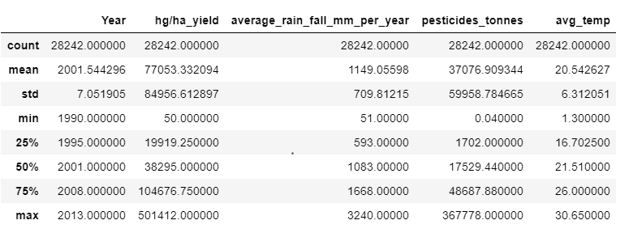
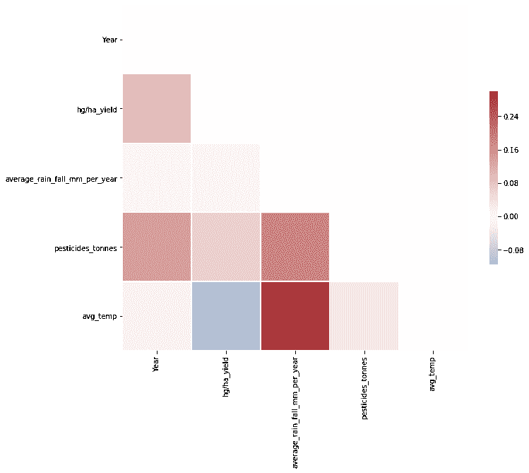
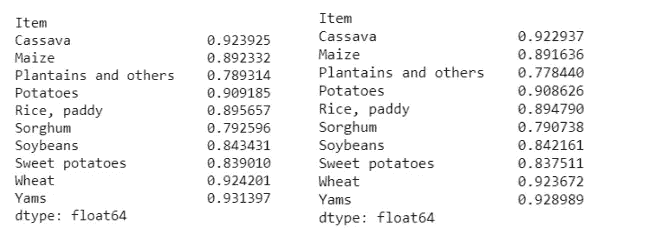
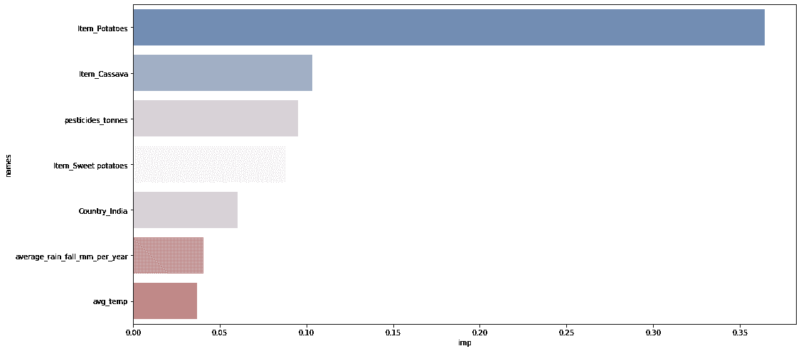
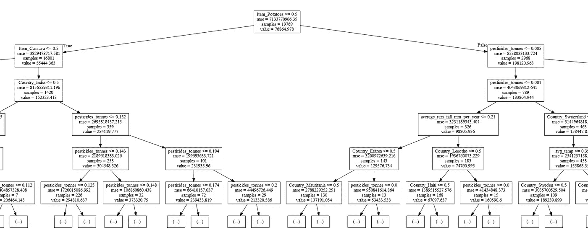

# 预测农作物产量:机器学习纳米级顶点项目

> 原文：<https://towardsdatascience.com/predicting-crops-yield-machine-learning-nanodegree-capstone-project-e6ec9349f69?source=collection_archive---------9----------------------->

印度田间的农民— [@nandhukumarndd](https://unsplash.com/@nandhukumarndd)

# 一.定义

## 简介、问题陈述和指标

训练机器来学习和产生未来预测模型的科学被广泛使用，这并不是没有意义的。农业在全球经济中发挥着至关重要的作用。随着人口的持续增长，了解世界范围内的作物产量对于应对粮食安全挑战和减少气候变化的影响至关重要。

作物产量预测是一个重要的农业问题。农业产量主要取决于天气条件(雨水、温度等)、杀虫剂。关于作物产量历史的准确信息对于做出与农业风险管理和未来预测相关的决策非常重要。

世界各地的烹饪有很大差异，但维持人类生存的基本成分非常相似。我们吃大量的玉米、小麦、大米和其他简单的农作物。在这个项目中，利用粮农组织和世界数据库的公开数据，机器学习方法被用于预测 10 种消费最多的作物。

**回归分析**是一种预测建模技术，调查**因变量**(目标)和**自变量**(预测值)之间的关系。用于本项目的回归模型:

*   梯度推进回归器
*   随机森林回归量
*   SVM
*   决策树回归器

***sk learn . metrics . R2 _ score***函数计算 **R(决定系数)；**它是可从自变量预测的因变量中方差的比例，它是一种介于 0 和 1 之间的统计度量，用于计算回归线与其拟合的数据的相似程度。如果是 1，模型 100%预测数据方差；如果它是 0，模型预测没有方差。

评估指标将是 **R** 分数，它将代表回归模型中项目(作物)方差的比例。默认的 SciKit-Learn 梯度推进回归器和随机森林回归器将用作基准。然后将探索几个模型来改进基准，包括决策树回归器和支持向量机(SVM)。

# **二。分析**

## 收集和清理数据

数据收集是收集和测量相关变量信息的过程。粮农统计数据库提供了 300 多万个与粮食和农业有关的时序和跨部门数据。粮农组织的数据可以在 csv 格式(**万岁！**)。粮农统计数据库的核心数据集中包含 200 个国家和 200 多种初级产品和投入的数据。它提供国家和国际的食品和农业统计数据。首先要得到的是每个国家的农作物产量。

现在数据看起来整洁有序，但是删除了一些列，如区号、域、商品代码等，这些对分析没有任何用处。此外，将**值**重命名为 **hg/ha_yield** ，以便更容易识别这是我们的作物产量产值。最终结果是一个四列的数据框架，包括:国家，项目，年份和作物产量。

使用 **describe()** 函数，很少能弄清楚数据框架，它从 1961 年开始，到 2016 年结束，这是粮农组织所有可用的最新数据。

气候因素包括湿度、阳光和涉及气候的因素。环境因素是指土壤条件。在这个模型中，选择了两个气候因素和一个环境因素，雨和温度。除了影响植物生长和发育的杀虫剂。

雨水对农业有着巨大的影响，除了每个国家的平均温度外，本项目的年降雨量信息也是从世界数据库中收集的。

平均降雨量的最终数据框架包括:国家、年份和年平均降雨量。数据框从 1985 年到 2017 年，另一方面，平均温度数据框包括国家、年份和平均记录温度。温度数据帧开始于 1743，结束于 2013。年份的变化会对收集的数据造成一定的影响，因为必须统一一个年份范围以不包含任何空值。

农药的数据是从粮农组织收集的，它从 1990 年开始，到 2016 年结束。将这些数据框架合并在一起，预计年份范围将从 1990 年开始，到 2013 年结束，这是 23 年的数据。

最终数据帧

上图描述了模型应用的最终数据框架和选定的特征。

正如预期的那样，数据框架从 1990 年开始，到 2013 年结束。确保没有空实体，我可以进入下一步。最后要注意的是，每一列的值的高方差，稍后我将说明这一点。

## 数据探索

按国家和项目分组，以便更好地理解数据集。数据框架中有 101 个国家，其中印度的农作物产量最高。此外，印度是木薯和土豆产量最高的国家。马铃薯似乎是数据集中的主要作物，在 4 个国家中最高。

现在，探索数据帧的列之间的关系，快速检查列之间的相关性的一个好方法是将相关性矩阵可视化为热图。从下面的热图可以明显看出，所有变量都是相互独立的，没有相关性。

数据帧中特征的相关热图

# 三。方法学

## 数据预处理

数据预处理是一种用于将原始数据转换成干净数据集的技术。换句话说，无论何时从不同来源收集数据，都是以原始格式收集的，这对于分析是不可行的。

在最终的数据帧中有两个分类列，分类数据是包含标签值而不是数值的变量。可能值的数量通常限于一个固定的集合，就像本例中的 items 和 countries 值。许多机器学习算法不能直接对标签数据进行操作，它们要求所有输入变量和输出变量都是数字。

这意味着分类数据必须转换成数字形式。**一个热编码**是一个过程，通过该过程，分类变量被转换成可以提供给 ML 算法的形式，以在预测中做得更好。为此，将使用一键编码将这两列转换为一键数字数组。

分类值表示数据集中条目的数值。这种编码将为每个类别创建一个二进制列，并返回一个包含结果的矩阵。

dataframe 的特征将类似于上面的 115 列。看一下上面的数据集，它包含的要素在量级、单位和范围上有很大差异。与低量值的要素相比，高量值的要素在距离计算中的权重要大得多。为了抑制这种效应，我们需要将所有的特征置于相同的量级。这可以通过用**最小最大缩放器**进行缩放来实现。

数据预处理的最后一步是训练和测试数据。数据集将被分成两个数据集，即训练数据集和测试数据集。数据通常倾向于拆分不等式，因为训练模型通常需要尽可能多的数据点。对于培训/测试，常见的拆分是 70/30 或 80/20。

训练数据集是用于训练 ML 算法以学习和产生正确预测的初始数据集。(70%的数据集是训练数据集)

## 型号比较和选择

在决定使用哪种算法之前，首先我们需要评估、比较并选择最适合这个特定数据集的算法。

通常，当使用给定的数据集处理机器学习问题时，我们会尝试不同的模型和技术来解决优化问题，并拟合最合适的模型，该模型既不会过拟合也不会欠拟合。

评估指标是基于 **R(决定系数)**回归得分函数设置的，它将代表回归模型中项目(作物)方差的比例。 **R** 分数显示了术语(数据点)与曲线或直线的拟合程度。

**四款车型的研发结果**

从上面的结果来看，**决策树回归器**的 R 值最高，为**的 96%** ，**GradientBoostingRegressor**次之，为**的 89%。**

我还将计算**调整后的 R** ，其中它也表示术语与曲线或直线的拟合程度，但会根据模型中的术语数量进行调整。如果你在一个模型中加入越来越多的无用变量，调整后的 r 平方将会减少。如果你增加更多有用的变量，调整后的 r 平方将会增加。调整后的 **R** 将始终小于或等于 **R** 。

R 和调整后的 R 结果。

# 四。结果

## 模型结果和结论

对 **R** 最常见的**解释**是回归模型与观测数据的拟合程度。对于**示例**，60%的 **R** 表明 60%的数据符合回归模型。通常，较高的 **R** 表示更适合该模型。从获得的结果来看，很明显，该模型与数据的吻合度达到了 96%。

**特征重要性**通过到达该节点的概率加权的节点杂质的减少来计算。节点概率可以通过到达节点的样本数除以样本总数来计算。该值越高，**越重要，**特性**越重要。获得模型的 7 大重要特性:**

特征重要性条形图

土豆这种作物在模型决策中具有最高的重要性，它是数据集中最高的作物。木薯也是如此，正如我们所料，我们看到了杀虫剂的影响，这是第三个最重要的特征，如果作物是红薯，我们会看到一些在数据集中特征重要性最高的作物。

如果作物生长在印度，这是有意义的，因为印度在数据集中有最大的作物总和。然后是降雨量和温度。**关于这些特征的第一个假设是正确的，它们都显著影响模型中的预期作物产量。**

下面的箱线图显示了每个项目的产量。土豆最高，木薯，红薯，山药。

# 动词 （verb 的缩写）结论和最终想法

上图包含了颠倒的决策树的图形，根在顶部，在这个例子中，根是条目 potatoes，因为它是顶部的特征。特征的重要性一目了然，关系也易于查看。

**决策树**算法已经成为 Kaggle 等竞赛以及商业环境中使用最多的机器学习算法之一。决策树既可以用于分类问题，也可以用于回归问题。

决策树通常从单个节点开始，分支成可能的结果。这些结果中的每一个都会导致额外的节点，这些节点又分支成其他的可能性。由正方形表示的决策节点显示要做出的决策，而结束节点显示决策路径的最终结果。一个节点代表一个输入变量(X)和该变量上的一个分割点，假设该变量是数值型的。树的叶节点(也称为终端节点)包含用于进行预测的输出变量(y)。

决策树通过对数据提出一系列问题来得出一个估计值，每个问题都会缩小我们的可能值，直到模型有足够的信心做出一个预测。问题的顺序及其内容由模型决定。另外，问的问题都是真/假的形式。决策树回归使用[均方误差](https://en.wikipedia.org/wiki/Mean_squared_error) (MSE)来决定将一个节点分割成两个或多个子节点。

根节点是 item potato，这是它在模型中最重要的特性。该模型会询问它是否是马铃薯，然后根据它的真假来跟踪分支。该算法首先选取一个值，并将数据分成两个子集。对于每个子集，它将分别计算 MSE。该树选择导致最小 MSE 值的值，直到它到达叶节点。

既然对分类项进行了编码，那么答案要么是 0，要么是 1，要么是，要么不是，那么深度为 1 的两个内部节点，如果遵循真分支，“*是项木薯*？< = 0.5”。另一个节点，会问“*农药 _ 公吨< = 0.005* ”，跟随决策树到更深一层等等。

上图显示了预测的拟合优度，显示为一条线。可以看出 **R** 成绩优秀。这意味着我们已经找到了一个很好的拟合模型来预测某个国家的作物产量值。增加更多功能，如气候数据；风和污染，特定国家的经济状况等等可能会增强模型的预测。

# 那么，纳米学位值得吗？

嗯，某些部分，肯定是！如果部署部分更侧重于使用 Flask 而不是 Amazon SageMaker，我会更喜欢。

我设法在三周内完成了纳米学位，通过每个项目后的自律和满足感绝对值得。此外，可爱的升级项目专家徽章也值得你额外努力去完成每一件事。#UdacityLevelUp

***(链接代码:*** [***机器学习-顶点-项目***](https://github.com/hajir-almahdi/Machine-Learning-Capstone-Project.git)***)***

# 参考

[sci kit-learn 和 Spark 中决策树、随机森林和特征重要性的数学运算](/the-mathematics-of-decision-trees-random-forest-and-feature-importance-in-scikit-learn-and-spark-f2861df67e3)

[决策树回归器深入讲解](https://gdcoder.com/decision-tree-regressor-explained-in-depth/)

联合国粮食及农业组织

[世界银行公开数据](https://data.worldbank.org/)

[决策树回归](https://chrisalbon.com/machine_learning/trees_and_forests/decision_tree_regression/)