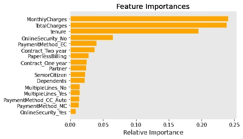

# 预测电信行业的客户流失

> 原文：<https://towardsdatascience.com/predicting-customer-churn-in-the-telecommunications-industry-99a369317e91?source=collection_archive---------21----------------------->

## 使用特征重要性通过降维来简化问题，并为不平衡分类移动阈值。

*授权 Leo Siu-Yin 通过 Shutterstock 获取图像*

**为什么要预测客户流失？**

获得新客户比留住现有客户要昂贵得多。一些研究表明，获得一个新客户的成本是保持一个现有客户的六到七倍。

据 *BeyondPhilosophy.com:*

忠诚的客户会降低与消费者教育和营销相关的成本，尤其是当他们成为你组织的净推广者时

因此，能够主动确定最有可能离开的客户并通过了解他们的需求和提供积极的客户体验来采取预防措施非常重要。

[Sharon McCutcheon](https://unsplash.com/@sharonmccutcheon?utm_source=unsplash&utm_medium=referral&utm_content=creditCopyText) 在 [Unsplash](https://unsplash.com/s/photos/family-in-pandemic?utm_source=unsplash&utm_medium=referral&utm_content=creditCopyText) 上拍摄的照片

**方法论**

该项目分为 3 个阶段:

1.  数据清理和探索性数据分析。
2.  模型选择和阈值调整。
3.  结果解释。

**数据清理和探索性数据分析**

数据来自 Kaggle，IBM 数据集。数据集有些不平衡，流失率为 26.5%。

首先检查数据的唯一客户 ID。空格被替换为 0，列在适用时被更改为数字类型。

进行 EDA 是为了理解数据。像性别这样的特征对流失影响不大，会被去掉。

使用热图绘制要素间的相关性，并丢弃彼此高度相关的要素(如下所示，相关性> 0.6)。

然后对分类特征进行一次热编码。并且通过使用算法的特征重要性属性的随机森林分类来选择前 11 个特征。

减少输入要素的数量将简化正在建模的问题并加快建模过程。

**模型选择和阈值调整**

使用四种模型对最终数据进行建模:逻辑回归、C-支持向量分类、K 近邻分类器和随机森林分类器。

GridSearchCV 用于调整超参数，并为每个模型找到最佳超参数。

基于阈值 0.5 的 1 类分类，发现逻辑回归模型具有最高的 ROC-AUC 得分、最低的对数损失、最高的 F1 得分和最高的回忆得分。因此，选择逻辑回归模型作为最终模型来进一步微调阈值，以提高我们数据的召回分数。

ROC-AUC 评分

原木损失

F1 分数

精确

回忆

**精度**是相关实例在检索到的实例中所占的比例，**召回**(也称为[敏感度](https://en.wikipedia.org/wiki/Sensitivity_and_specificity))是实际检索到的相关实例总数的比例。

在预测客户流失时，较高的召回率优于较高的精确度，因为能够预测哪些客户流失的风险较高是最理想的。然而，调整阈值以获得更高的召回率是以降低精确度为代价的。因此，需要实现平衡。在这个项目中，我选择使用 F1 分数作为衡量标准来选择我的阈值。

分类算法的工作原理是在概率被映射到类别标签之前预测概率。这是通过使用诸如 0.5 的阈值来实现的，其中等于或大于阈值的所有值被映射到一个类，而所有其他值被映射到另一个类。

由于数据具有类别不平衡，默认阈值会导致较差的分类。因此，调整用于将概率映射到分类标签的阈值非常重要。

在默认阈值为 0.5 时，逻辑回归模型给出的 F1 值为 0.58。基于 0.62 的最大 F1 分数，阈值结果是 0.36。这个新的阈值将回忆分数从 0.55 提高到 0.78。

**结果解读**

基于逻辑回归模型，电信公司可以专注于前两项功能，并通过以下方式减少客户流失:

1.  与客户签订长期合同。
2.  提高客户的在线安全性。

这里有一个[链接](https://github.com/syleo22/SiuYin_Projects/tree/master/Project03)到我的 GitHub，你可以在那里找到我的代码和演示幻灯片。也可以通过 [LinkedIn](https://www.linkedin.com/in/syleo/) 联系我。