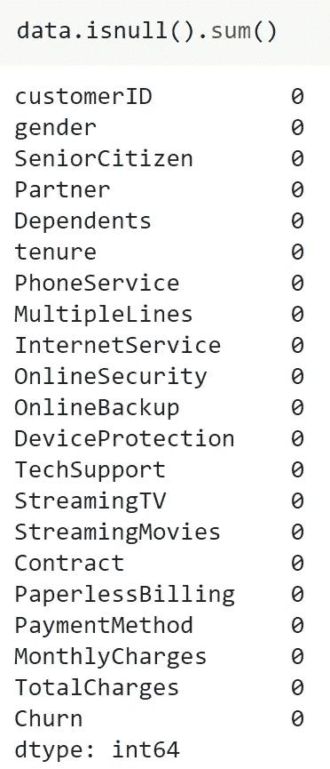
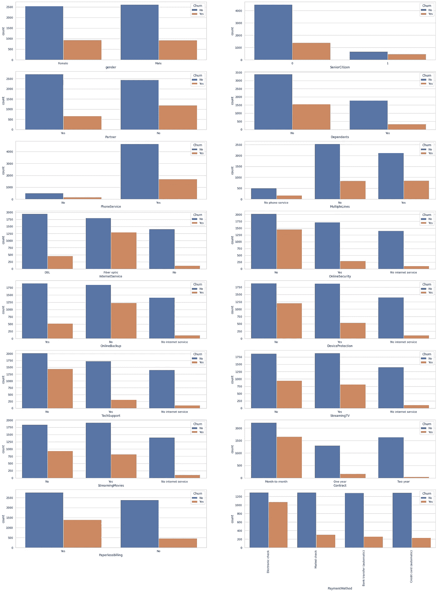

# 使用逻辑回归预测客户流失

> 原文：<https://towardsdatascience.com/predicting-customer-churn-using-logistic-regression-9543c60f6d47?source=collection_archive---------22----------------------->

## 我第一次接触逻辑回归算法

在 [Unsplash](https://unsplash.com?utm_source=medium&utm_medium=referral) 上由 [Austin Distel](https://unsplash.com/@austindistel?utm_source=medium&utm_medium=referral) 拍摄的照片

# **什么是客户流失？**

**流失率**，也称为**损耗率**或**客户流失率**，是客户停止与实体做生意的比率。它通常表示为在给定时间段内停止订购的服务用户的百分比。高客户流失率表明公司正在以惊人的速度流失客户。客户流失可归因于无数原因，公司需要通过客户数据中的模式和趋势来发现这些原因。

现代企业如今采用复杂的算法来预测最有可能流失的客户，即离开公司的客户。通过使用这种算法，公司可以提前知道最有可能放弃公司服务的客户，并因此提出客户保留策略来减轻公司可能面临的损失。

# 问题陈述

在前面的段落中描述客户流失的原因是因为我的下一个机器学习项目的目标是开发一种算法，可以准确预测最有可能流失的客户。

作为一个额外的挑战，我试图发现客户流失的趋势，并确定客户决定终止合同时的主要因素。在我所掌握的各种可视化库的帮助下，我能够找出控制客户流失决策的可能参数。这些因素将在本博客的后续章节中讨论。

# 工作流程

电信行业客户流失预测是一个机器学习问题。因此，为这个项目获取数据非常简单。我从 Kaggle 下载了数据集，并将其加载到我的 jupyter 笔记本上。此外，我还导入了完成这个项目所必需的库。现在需要的唯一任务是分析数据，清理数据，并使用清理后的数据集训练 ML 模型。

## 数据探索和数据工程

步骤 1:检查缺失值。

探索数据集时最重要的步骤之一是搜索缺失值。缺失值能够阻碍 ML 算法的训练过程，并影响训练模型的准确性。在数据集上使用 pandas 的 isnull()函数后，我发现数据集中没有缺失值。因此，我进入了数据探索步骤。

要素列表以及缺失值的计数。(图片由作者提供)

第二步:数据探索。

因为我现在确信我的数据集中没有丢失的值，所以我可以将注意力转向研究手头的数据。数据探索是至关重要的一步，因为它使我能够熟悉数据集中存在的不同特征以及每个特征列包含的值的类型。下面列出了我在数据探索阶段发现的数据要点。

*   总共有 17 个分类特征和 4 个连续特征。
*   除了“老年人”、“任期”和“每月费用”，所有其他特征都是数据类型*对象。*
*   最后，数据集包含 1，869 条有过交易的客户记录和 5，163 条没有交易的客户记录。

步骤 3:数据可视化

数据可视化是任何机器学习或数据科学项目的一个关键方面。可视化通常提供数据的鸟瞰图，允许数据科学家或 ML 工程师从手头的数据中辨别趋势和模式。我使用 seaborn library 的 countplot 函数来绘制分类特征，然后试图发现客户流失的趋势。上述可视化任务的输出可以在下图中看到。

(图片由作者提供)

从上面的图片中，我能够挑出一些有趣的点，这些点在流失的客户中很普遍。以下列出了相同的内容:

*   男性和女性的流失率几乎相当。
*   老年人的流失率很低。
*   拥有电话服务的客户流失率更高。
*   有合作伙伴和家属的客户的流失率低于没有合作伙伴和家属的客户。
*   与其他支付方式相比，使用电子支付方式的客户流失率更高。
*   没有互联网服务的客户流失率较低。
*   光纤互联网服务的流失率要高得多。

这种可视化通常有助于公司发现客户流失的可能原因。例如，以电子方式付款的客户更有可能流失，这可能是因为他们在进行电子付款时面临一些不便，公司可以对此进行调查，或者选择光纤互联网服务的客户对公司的流失率有很大影响，这可能暗示客户对公司提供的光纤互联网服务不满意，公司可以调查此事并尽早解决问题。数据可视化是重要的一步，因为它提供了可操作的见解，并帮助公司做出明智的决策。

步骤 4:数据工程

由于数据探索阶段现在已经完成，并且我对数据集有了很好的理解，所以我继续进行项目的数据工程部分。首先，我去掉了“*客户 Id”*列，因为它不会影响我们的 ML 模型的预测能力。接下来，我将所有分类特征转换成一次性编码特征。最后，数据集被分成训练和测试数据，以促进 ML 模型的训练。

**机器学习模型创建和评估**

第一步:训练一个机器学习模型。

随着数据探索和工程阶段的完成，我继续训练我的机器学习模型。客户流失预测是一个分类问题，因此，我使用逻辑回归算法来训练我的机器学习模型。在我看来，逻辑回归是一个相当容易实现、解释和训练非常有效的算法。此外，它在数字数据上工作得非常好。最后，可以通过逻辑回归实现的*【L1】*和*【L2】*正则化技术防止模型过度拟合。

我从 sklearn 库中导入了逻辑回归模型，并对训练数据使用了*“fit”*函数。拟合操作一完成，我就进入下一步，评估我的 ML 模型的性能。

步骤 2:评估模型性能。

这是我的机器学习项目的最后一步，就是测试我的 ML 模型的性能。这一步至关重要，因为我可以根据看不见的客户数据来衡量我的 ML 模型的准确性。为了确定我的 ML 模型的性能，我使用了测试数据，并计算了预测标签的准确度分数以及混淆矩阵。逻辑回归模型的准确度得分为 *81.5%。*共有 1148 个标签被准确预测，而 259 个标签被错误预测。

# 结论

这个关于客户流失预测的机器学习项目给我提供了一个新的学习体验。它允许我使用各种可视化库，并让我意识到数据可视化的重要性。这也让我有机会使用一种新的 ML 算法，即逻辑回归。这个项目是机器学习在现实世界中的一个主要例子，在这个项目中工作帮助了我，磨练了我在机器学习领域的技能。

我为这个项目遵循的工作流程可以在我的[***Github***个人资料中找到。我希望你喜欢看我的博客。](https://github.com/shaunak09vb/Telco-Customer-Churn-Predicition/blob/master/Customer_Churn_LogReg.ipynb)