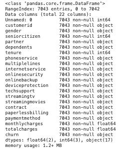
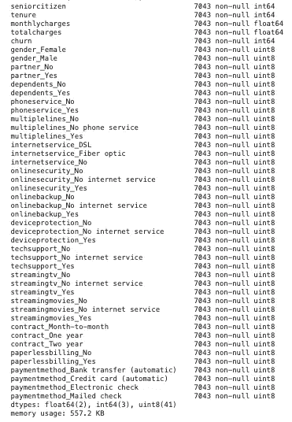
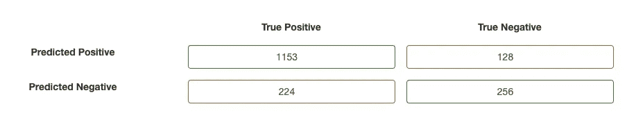
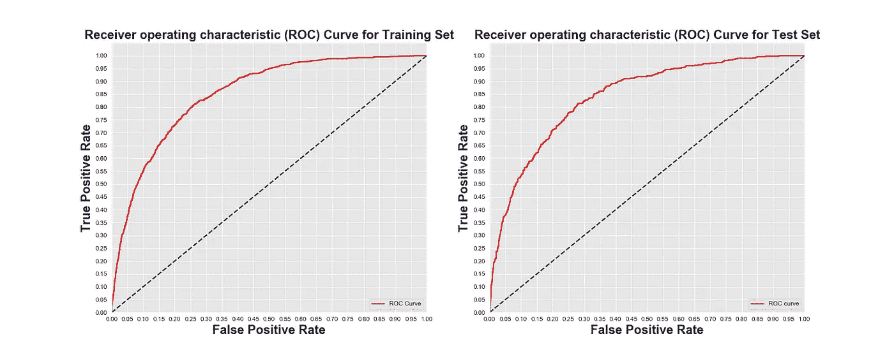

# 使用逻辑回归预测客户流失

> 原文：<https://towardsdatascience.com/predicting-customer-churn-using-logistic-regression-c6076f37eaca?source=collection_archive---------5----------------------->

## 第 2 部分:构建模型

在我之前的[帖子](https://medium.com/@andrewcole.817/customer-churn-analysis-eda-a688c8a166ed)中，我们完成了一个客户流失分析数据集的探索性数据分析过程。我们的数据来源于 Kaggle，以**客户流失率**为中心，商业客户将离开他们目前是电信公司 Telco 的(付费)客户的商业平台。现在 EDA 流程已经完成，我们对数据在处理前告诉我们的东西有了很好的认识，我们可以继续构建一个逻辑回归分类模型，它将允许我们预测客户是否有从电信平台流失的风险。

完整的 GitHub 知识库和笔记本以及数据浏览可以在[这里](https://github.com/andrewcole33/telco_churn_analysis)找到。


由 [Austin Distel](https://unsplash.com/@austindistel?utm_source=medium&utm_medium=referral) 在 [Unsplash](https://unsplash.com?utm_source=medium&utm_medium=referral) 上拍摄的照片

# 逻辑回归

当处理我们累积到二元分离的数据时，我们希望将我们的观察结果分类为客户“会流失”或“不会流失”平台。逻辑回归模型将试图猜测属于一个或另一个群体的概率。逻辑回归本质上是线性回归的扩展，只有预测的结果值在[0，1]之间。该模型将确定我们的目标特征、流失和我们的剩余特征之间的关系，以应用概率计算来确定客户应该属于哪个类别。我们将使用 Python 中的“ScikitLearn”包。

# 概括数据

提醒一下，在我们的数据集中，我们有 7043 行(每行代表一个唯一的客户)和 21 列:19 个特征，1 个目标特征(客户流失)。数据由数字和分类特征组成，因此我们需要分别处理每种数据类型。

**目标:**

*   客户流失—客户是否流失(是，否)

**数字特征:**

*   任期——客户在公司工作的月数
*   月度费用—每月向客户收取的费用
*   总费用——向客户收取的总费用

**分类特征:**

*   CustomerID
*   性别—男/女
*   老年人—客户是否是老年人(1，0)
*   合作伙伴—客户是否有合作伙伴(是，否)
*   受抚养人——客户是否有受抚养人(是，否)
*   电话服务—客户是否有电话服务(是，否)
*   多条线路—客户是否有多条线路(是，否，无电话服务)
*   互联网服务—客户的互联网服务类型(DSL、光纤、无)
*   在线安全—客户是否有在线安全插件(是、否、无互联网服务)
*   OnlineBackup —客户是否有在线备份插件(是、否、无互联网服务)
*   设备保护—客户是否有设备保护附件(是、否、无互联网服务)
*   技术支持—客户是否有技术支持附加服务(是、否、无互联网服务)
*   流媒体电视—客户是否有流媒体电视(是，否，无互联网服务)
*   流媒体电影—客户是否有流媒体电影(是，否，无互联网服务)
*   合同—客户合同的期限(每月、1 年、2 年)
*   无纸账单—客户是否有无纸账单(是，否)
*   支付方式—客户的支付方式(电子支票、邮寄支票、银行转账(自动)、信用卡(自动))

# **为建模预处理我们的数据**

在 EDA 过程中，我们移动了一些数据，但是预处理主要是为了便于使用和消化，而不是为了模型的功能。为了进行逻辑回归，我们必须以不同的方式对数据进行预处理，特别是为了适应数据中的分类特征。让我们再看一下我们的数据信息，了解一下我们正在做什么。



我们没有任何丢失的数据，我们的数据类型是有序的。请注意，我们的大部分数据是“对象”类型，即我们的分类数据。这将是我们在预处理步骤中关注的主要领域。在数据的顶部，我们看到两个不必要的列，“未命名:0”和“客户 id”。这两列与我们的数据无关，因为前者没有任何重要的值，而后者是客户的唯一标识符，这是我们不想要的。我们通过快速熊猫切片从数据帧中快速删除这些特征:

```
df2 = df.iloc[:,2:]
```

下一步是解决我们的目标变量，流失。目前，该特性的值为“是”和“否”。这是一个二元结果，这是我们想要的，但我们的模型将无法以其当前的字符串形式有意义地解释这一点。相反，我们希望用数字二进制值替换这些变量:

```
df2.churn.replace({"Yes":1, "No":0}, inplace = True)
```

接下来，我们必须处理剩余的分类变量。**虚拟变量**是将名义变量作为二进制值合并到回归中的一种方式。这些变量允许计算机将分类变量的值解释为高分(1)或低分(0)。因为变量现在是数字，模型可以评估变量的方向性和重要性，而不是试图找出“是”或“否”的意思。当添加虚拟变量时，将添加新的二进制特征，其值为[0，1]，我们的计算机现在可以解释。Pandas 有一个简单的函数来执行这一步。

```
dummy_df = pd.get_dummies(df2)
```

**注意:**当分类变量有多于二进制值时，注意“drop_first”参数是非常重要的。我们不能使用分类变量的所有值作为特征，因为这将引发多重共线性问题(计算机将对冗余信息赋予错误的意义)并破坏模型。我们必须留下一个类别作为参考类别。



我们新的数据框架特征如上，现在包括虚拟变量。

## 分割我们的数据

我们现在必须将数据分为目标特征和预测特征。

```
# Establish target feature, churn
y = dummy_df.churn.values# Drop the target feature from remaining features
X = dummy_df.drop('churn', axis = 1)# Save dataframe column titles to list, we will need them in next stepcols = X.columns
```

## 特征缩放

我们的数据几乎完全经过预处理，但还有一个更突出的问题需要解决，即缩放。我们的数据现在全是数值型数据，但是都是不同的单位。将“streamingtv_Yes”的二进制值 1 与“monthlycharges”的连续价格值进行比较不会给出任何相关信息，因为它们具有不同的单位。这些变量对模型的贡献是不一样的。为了解决这个问题，我们将通过重新调整原始变量来标准化我们的数据值，使其与其余变量具有相同的范围和方差。出于我们的目的，我们将使用**最小-最大缩放** [0，1]，因为标准化值将位于二进制范围内。

```
# Import the necessary sklearn method
from sklearn.preprocessing import MinMaxScaler# Instantiate a Min-Max scaling object
mm = MinMaxScaler()# Fit and transform our feature data into a pandas dataframe
X = pd.DataFrame(mm.fit_transform(X))
```

## 训练-测试-分离

我们现在进行标准的训练测试分割，将我们的数据分成训练集和测试集。

```
from sklearn.model_selection import train_test_splitX_train, X_test, y_train, y_test = train_test_split(X, y, test_size = .25, random_state = 33)
```

# 构建模型

现在可以相对快速地建立模型，我们选择一些参数:

```
from sklearn.linear_model import LogisticRegression# Instantiate a logistic regression model without an intercept, arbitrarily large C value will offset the lack of interceptlogreg = LogisticRegression(fit_intercept = False, C = 1e12, solver 
= 'liblinear')# Fit the model to our X and y training sets
logreg.fit(X_train, y_train)
```

既然我们的模型已经建立，我们必须预测我们的未来值。

```
y_hat_train = logreg.predict(X_train)
y_hat_test = logreg.predict(X_test)
```

此时，我们的模型实际上已经完全构建好了，尽管我们没有看到输出。让我们来看看评估我们的表现。

# 评估模型性能

**分类器在训练集上正确的次数是多少？**

因为我们试图预测一个客户是否会离开，有什么比看看它多长时间是正确的更好的方法来检查我们的模型性能！为此，我们将采用实际训练数据和预测训练数据之间的剩余距离，以及实际测试数据和预测测试数据之间的剩余距离。

```
# Find residual differences between train data and predicted train data
resiudals = np.abs(y_train, y_hat_train)# Print the number of times our model was correct ('0') and incorrect ('1')
print(pd.Series(residuals).value_counts()# Print normalized amount of times our model was correct (percentage)
print(pd.Series(residuals).value_counts(normalize = True)
```

**非标准化训练结果:**

*   正确:4270
*   不正确:1012

**归一化训练结果:**

*   正确:. 8084
*   不正确:1916

这挺好的！在我们的第一次测试中，80%的正确率是一个很大的数字。请记住，100%的准确性实际上会是一个问题，因为我们的模型会完全超出我们的数据。让我们检查我们的测试数据(执行与上面相同的代码块，使用 y_test 和 y_hat_test 作为剩余参数。

**非标准化测试结果:**

*   正确:1409
*   不正确:352

**归一化测试结果**

*   正确:. 8001
*   不正确:1999 年

再次，积极的结果！我们的测试集和训练集大小不同，因此归一化的结果在这里更有意义。事实上，我们的模型在我们的训练和测试集上表现得差不多，这是一个积极的迹象，表明我们的模型表现良好。

## 混淆矩阵

混淆矩阵是评估我们的分类器性能的一个非常强的方法。混淆矩阵是一种直观表示，它告诉我们四个重要分类指标的程度:

*   **真阳性(TP):** 模型预测客户会流失(1)并且他们确实会流失(1)的观察次数
*   **真否定(TN):** 模型预测客户不会流失(0)，而他们实际上没有流失(0)的观察次数。
*   **误报(FP):** 模型预测客户会流失的观察次数(1)，但在现实生活中他们不会流失(0)。
*   **假阴性(FN):** 模型预测客户不会流失的观察次数(0)，但在现实生活中他们会流失(1)。

混淆矩阵的一个轴将代表真实值，而另一个轴将代表预测值。在这一步，拥有业务领域知识是非常重要的。某些度量对我们的模型来说更普遍。例如，如果我们对一个病人是否患有疾病进行建模，那么大量的假阴性会比大量的假阳性更糟糕。如果有许多假阳性，那么这仅仅意味着一些患者需要进行一些不必要的测试，可能还需要一两次烦人的医生检查。但是，高假阴性意味着许多患者实际上已经患病并被诊断为健康，这可能会产生可怕的后果。为了达到客户流失的目的，当客户实际流失时，预测客户不会流失对我们来说更糟糕，这意味着我们的假阴性更值得关注。

```
from sklearn.metrics import confusion_matrix# Pass actual test and predicted target test outcomes to function
cnf_matrix = confusion_matrix(y_test, y_hat_test)
```

**混淆矩阵:**



我们在 1761 次观察中有 224 次是假阴性。这比我们想要的略大，但仍然是一个有希望的数字。为了从混淆矩阵中获得真正的意义，我们必须使用这四个指标来产生更具描述性的指标:

1.  **精确度**:预测的精确度

*   精度= TP/PP
*   “在模型预测客户会流失的所有次数中，客户实际流失了多少次”

**2。Recall:** 表示我们感兴趣的类实际上被模型捕获的百分比

*   召回= TP/(TP + FN)
*   “在我们看到的所有实际流失的客户中，我们的模型正确识别为‘将会流失’的客户占多少比例

**3。准确性:**度量模型获得正确预测的总数，包括真阳性和真阴性

*   准确度= (TP + TN)/(TP + FP + TN + FN)
*   "在所有的预测中，有百分之多少是正确的？"

**4。F1 得分:**精确度和召回率的调和平均值—精确度和召回率的一个强有力的指标(在没有强有力的模型支持的情况下，不可能有高的 F1 得分)

*   F1 = 2(精度*召回)/(精度+召回)
*   如果模型偏向于精确或召回，则严重惩罚模型
*   通常最常用的模型性能指标

这些指标可以通过更长的路径手工计算，但对我们来说幸运的是，Sklearn 有一些模块可以为我们计算这些指标。我们要做的就是传递我们的目标数据集和我们预测的目标数据集。

```
from sklearn.metrics import precision_sore, recall_score, accuracy_score, f1_scoreprecision_train = precision_score(y_train, y_hat_train)
precision_test = precisoin_score(y_test, y_hat_test)recall_train = recall_score(y_train, y_hat_train)
recall_test = recall_score(y_test, y_hat_test)accuracy_train = accuracy_score(y_train, y_hat_train)
accuracy_test = accuracy_score(y_test, y_hat_test)f1_train = f1_score(y_train, y_hat_train)
f1_test = f1_score(y_test, y_hat_test)
```

**精度:**

*   火车:0.6615
*   测试:0.6666

**回忆:**

*   火车:0.5558
*   测试:0.5333

**精度:**

*   火车:0.8084
*   测试:0.8001

**F1 得分:**

*   火车:0.6041
*   测试:0.5926

我们的结果令人鼓舞，但并不完全令人满意。我们的查全率和查准率分数比我们预期的要低一点，但是我们的查准率分数是最强的指标，也是一个非常好的标志，尤其是在第一次尝试的时候。请记住，构建模型是一个迭代过程，因此第一次的高分是令人鼓舞的！

# ROC 曲线和 AUC

另一种评估我们模型性能的综合方法和混淆矩阵的替代方法是 AUC 度量和 ROC 曲线图。

## ROC 曲线——受试者操作者特征曲线

这个直观的图表将说明我们的分类器的真阳性率(召回率— TPR)与假阳性率(FPR)。表现最好的模型将有一个 ROC 曲线，它紧挨着图表的左上角。这意味着我们对积极因素的正确分类要比错误分类多得多。下图中的蓝色虚线表示 1:1 的线性关系，代表一个**坏的**分类器，因为模型每猜对一个就猜错一个，这比扔硬币好不了多少！

**AUC —曲线下面积**

AUC 将为我们提供一个单一的数字指标进行比较，而不是直观的表示。AUC = 1 表示完美的分类器，AUC = 0.5 表示只有 50%精度的分类器。这一指标量化了我们的分类器模型的总体准确性。

获取指标的编码如下:

```
from sklearn.metrics import roc_curve, auc# Calculate probability score of each point in training set
y_train_score = model.decision_function(X_train)# Calculate false positive rate(fpr), true pos. rate (tpr), and thresholds for train set
train_fpr, train_tpr, train_thresholds = roc_curve(y_train, y_hat_train)# Calculate probability score of each point in test set
y_test_score = model.decision_function(X_test)# Calculate fpr, tpr, and thresholds for test set
test_fpr, test_tpr, test_thresholds = roc_curve(y_test, y_hat_test)
```

绘制 ROC 曲线的代码:

```
# Plot the training FPR and TPR
plt.plot(train_fpr, train_tpr, label = 'ROC Curve')# Plot positive sloped 1:1 line for reference
plt.plot([0,1],[0,1])
plt.xlim([0.0, 1.0])
plt.ylim([0.0, 1.05])
plt.xticks([i/20.0 for i in range(21)])
plt.yticks([i/20.0 for i in range(21)])
```

*   **训练 AUC** = 0.8517
*   **测试 AUC** = 0.8388



这些指标看起来很棒！请注意，我们的测试和训练曲线都紧挨着左上角，并且具有非常强的 AUC 值。有了这样强大的模型，我们现在可以将目光转向调整一些模型参数/超参数来慢慢提升我们的分数。

# 结论

我们为第一轮建造了一个非常坚固的模型。构建任何机器学习模型都是一个迭代的过程，分类建模本身就有几种类型的模型。在接下来的一些帖子中，我将探索这些其他方法，如随机森林、支持向量建模和 XGboost，看看我们是否可以改进这个客户流失模型！