# 用 PySpark 预测客户流失

> 原文：<https://towardsdatascience.com/predicting-customer-churn-with-pyspark-6a4526cdc0b7?source=collection_archive---------57----------------------->

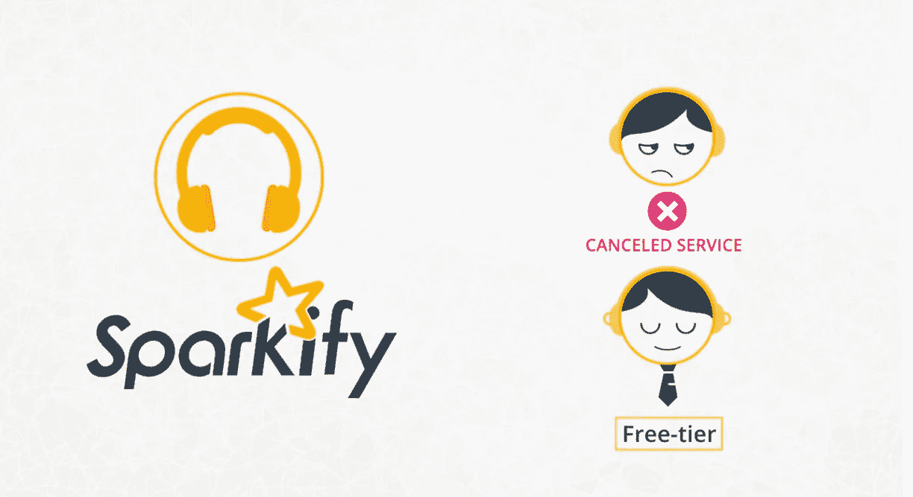

Sparkify 是一种虚构的流行数字音乐服务，类似于 Spotify 或 Pandora。使用 Sparkify，许多用户可以通过这项服务播放他们最喜欢的歌曲，并可以通过在歌曲之间放置广告的免费层或使用高级订阅模式来这样做。用户可以随时升级、降级或取消他们的服务，所以确保用户喜欢这项服务非常重要。

每当用户与该服务进行交互时，无论他们是在播放歌曲、注销、竖起大拇指喜欢一首歌、听广告还是降低服务等级，它都会生成数据。所有这些数据都包含了让用户满意和帮助企业发展的关键见解。

通过 Udacity 的 Nanodegree 项目提供的这个项目，我将利用这些数据来预测哪些用户有流失的风险，要么降低他们的服务级别，要么完全取消服务。通过能够在用户离开服务之前准确识别用户，Sparkify 可能会提供折扣和激励措施，并可能为企业节省数百万美元的收入。

下面是我在这个项目中采取的一些步骤，以探索数据集，并为预测客户流失的机器学习模型做准备。

# 正在加载火花数据

作为任何项目的第一步，我首先需要将我的项目加载到我的环境中。我将 128MB 的数据集读入一个 spark 数据帧，首先检查我的数据集包含多少行和列以及模式。

正如您在下图中看到的，我的数据集包含 286，500 行和 18 列。大多数列被表示为 string 类型，只有少数列被表示为 long 类型。

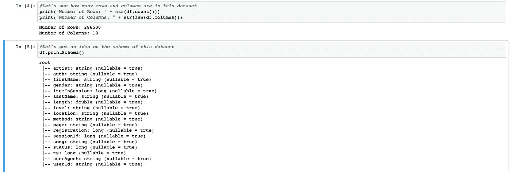

现在让我们看看实际数据是什么样的:

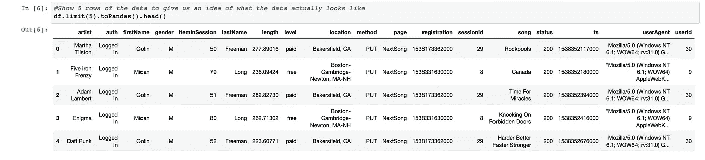

通过查看数据，我可以开始了解在我的探索性数据分析步骤中哪些列可能是相关的。

# 清理火花数据

当我开始探索我的数据时，我知道我需要清理我的数据，以便它可以准备好构建机器学习模型。

下面我提供了一个我为这个项目经历的清洁步骤的快速总结。

1.  检查缺少用户标识的记录
2.  检查 sessionId 为空的记录
3.  检查缺少性别输入的记录
4.  检查列的分布，以删除任何可能没有变化的列(单值列)
5.  将 ts 列转换为正确的时间戳格式
6.  将注册转换为正确的时间戳格式
7.  将“位置”列拆分为两个新列——用户城市和用户州
8.  删除用户代理、方法、位置列，因为它们似乎与我的分析无关

需要注意的一点是，我当然可以采取更多的步骤来进一步清理我的数据，但是这取决于每个数据科学家决定他们何时认为他们的数据足够干净。执行完这些步骤后，我得到了比原始数据集更清晰的数据集。

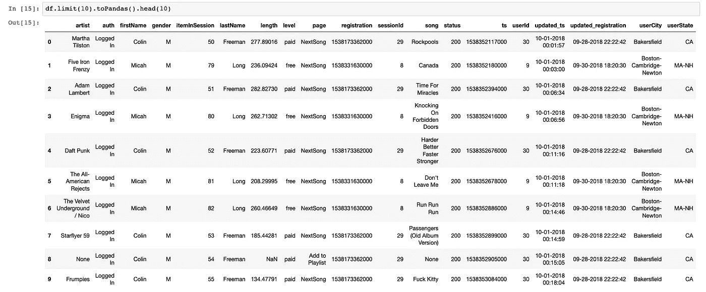

现在我的数据比以前干净了，我可以开始进一步研究我的数据了。

# 探索性数据分析

当我开始研究我的数据时，我知道我想要找出那些正在搅动的用户。我意识到目前的数据不能直接为我提供这个答案，所以我需要首先提取这个答案，这样我就可以进一步探索我的数据。

在上一步中，我查看了数据中的每一列，并打印出了列中每个值的计数。

对于页面列，我能够找到我正在寻找的确切细节，用户在那里进入取消确认页面，用户在那里点击以便实际取消他们的会员资格。在下面我可以找到所有用户所在的页面。

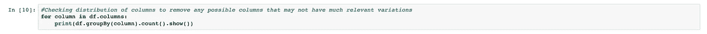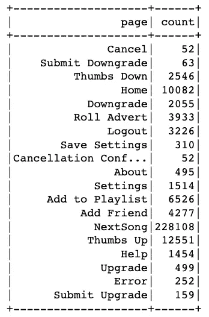

现在，我已经找到了我要寻找的细节，以找出哪些用户正在翻腾，我可以把它变成自己的列

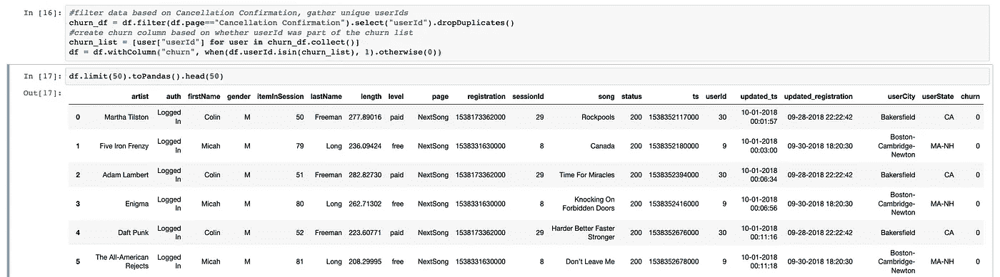

提取客户流失信息后，我可以进一步探索我的数据。

让我们根据播放的歌曲来探索 Sparkify 的整体活动。

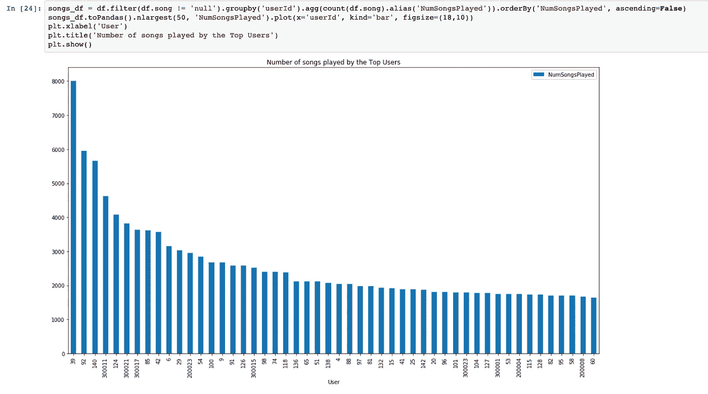

总的来说，许多用户与这项服务互动很多，听了很多歌曲！看起来 ID 为 39 的用户总共听了大约 8000 首歌！

我知道我的数据集有相同用户的各种数据点，所以我将确保现在只查看每个唯一用户的数据。我将从客户流失列开始，了解我的数据集中有多少用户流失了。

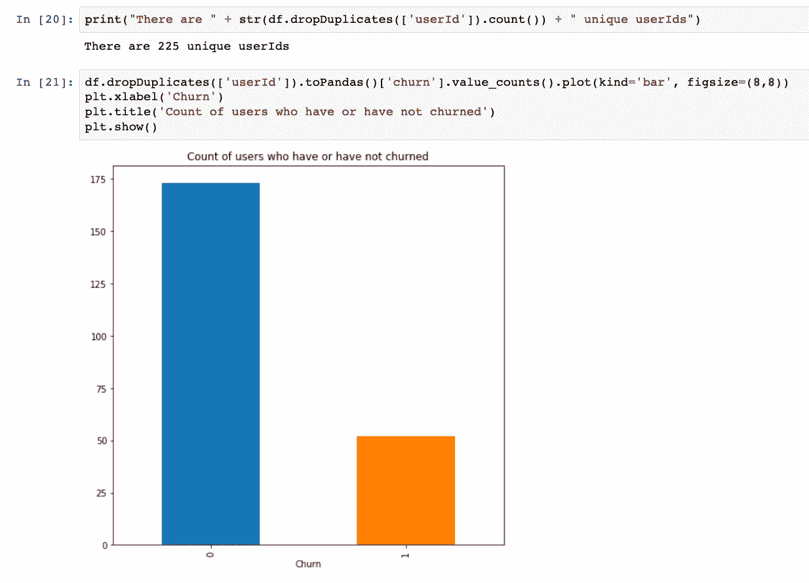

看起来在这个包含 225 个用户的数据集中，大约有 52 个用户受到了影响。

被搅动的用户如何因他们来自哪里而不同？总的来说，我不认为这是完全相关的，但它肯定可以用来理解国家在某一时期是如何参与的。(也许在冬季，来自美国北部各州的用户听更多的音乐，因为他们可能更经常在家，并且喜欢播放音乐来娱乐，等等)

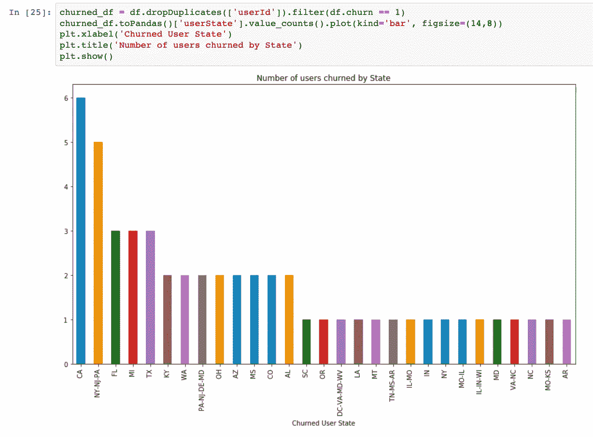

就目前而言，这并不太令人惊讶，因为加州、纽约州和佛罗里达州的人口往往更密集，我们通常可以预期更高的流失率和更高的整体参与度。由于我只有 Sparkify 数据的一个子集，我也许可以通过完整的数据集确定更多。

让我们来看看被搅动的用户在他们的订阅账户级别和性别方面是如何变化的。

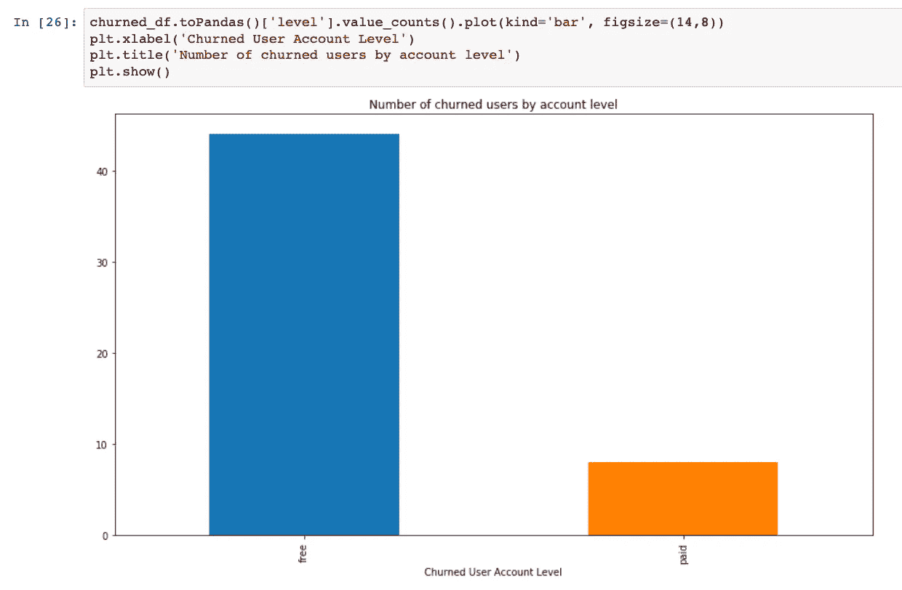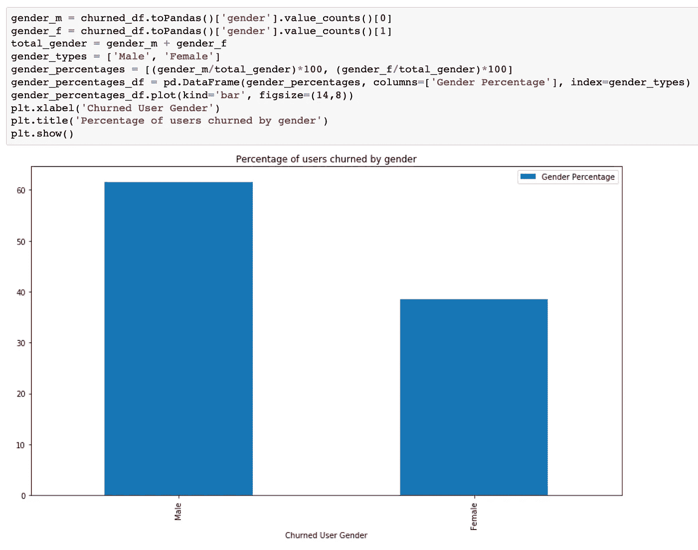

对于帐户级别，它肯定表明免费层用户可能比付费订阅用户更容易流失。此外，付费用户可以简单地将他们的帐户降级为免费，而不是完全取消他们的订阅。一些可以用完整数据集进一步探索的东西。

那么，当只看被搅动的用户时，与之前可视化中的总量相比，他们听了多少首歌？

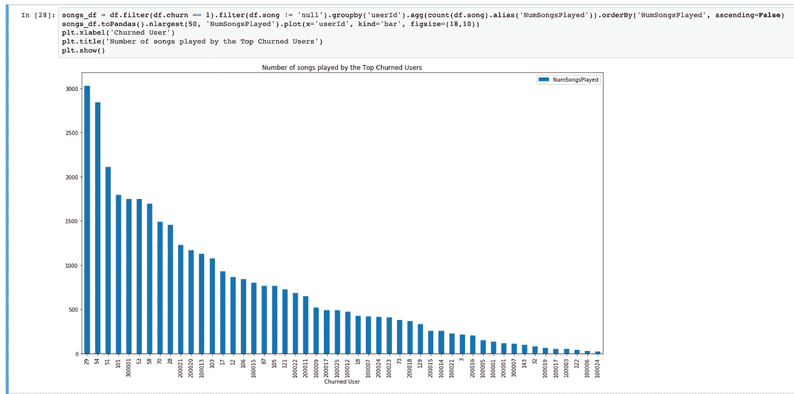

正如你所看到的，ID 为 29 的用户听了最多的歌曲，总共有 3028 首！

总的来说，数据集无疑告诉了我们很多关于通过免费或付费订阅选项订阅 Sparkify 的用户的信息。我们当然可以进一步探索数据，但对于这个项目，我已经有了下一步该做什么的想法。

# 数据建模

因此，我最终想用这个数据集建立各种模型来预测客户流失，但我不确定哪种预测模型最好。

对于这个项目，我将测试 2 个不同的模型。逻辑回归模型和梯度推进树分类器模型。对于建立的每个模型，我将基于准确性和 F1 分数对它们进行评估。

以下是每个型号的结果。

## 逻辑回归模型

[https://spark . Apache . org/docs/latest/API/python/pyspark . ml . html # pyspark . ml . classification . logisticregression](https://spark.apache.org/docs/latest/api/python/pyspark.ml.html#pyspark.ml.classification.LogisticRegression)

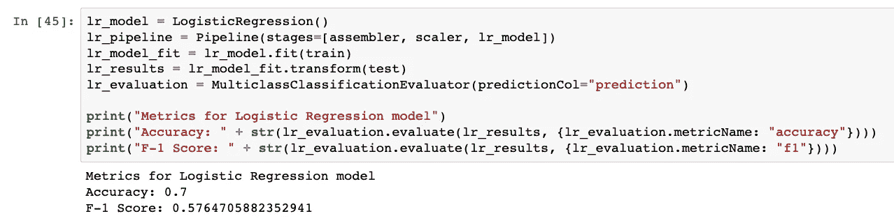

## 梯度增强树分类器模型

[https://spark . Apache . org/docs/latest/API/python/pyspark . ml . html # pyspark . ml . classification . gbt classifier](https://spark.apache.org/docs/latest/api/python/pyspark.ml.html#pyspark.ml.classification.GBTClassifier)

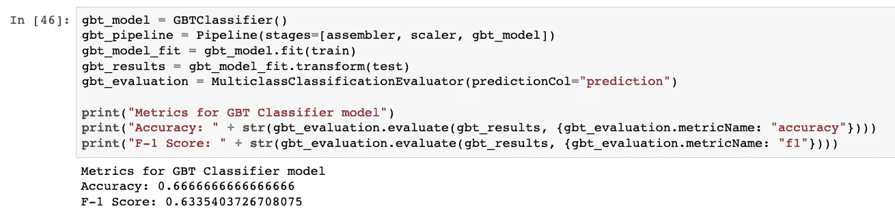

比较基本型号时，我得到以下结果:

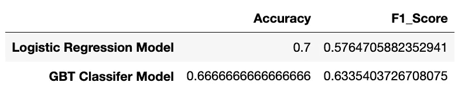

从上面训练的模型来看，看起来 GBT 分类器在准确性和 F1 分数之间有更多的平衡。此外，对于我的下一步调整，GBT 分类器有几个选项供我调整，并可能比逻辑回归模型更多地增加我的指标。

# 调整我的模型

我已经选择调整 GBT 分类器模型。这些是我将调整和评估的参数:

maxIter (10，20，30)
maxDepth (3，5，10，20)
minInfoGain(0)
minInstancesPerNode(1)

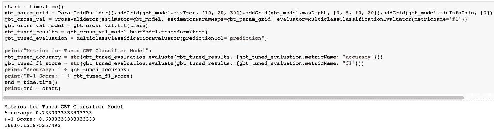

通过调整超参数，我能够改进 GBT 分类器模型！这花了几个小时，但我能够改进我的模型的指标，并实现了大约 0.73 的精确度和大约 0.68 的 F-1 分数。

这些是调优后最适合我的 GBT 分类器的参数。
maxIter(20)
max depth(3)
minInfoGain(0)
minInstancesPerNode(1)

现在我有了一个已经建立和调整的模型，可以用来评估未来的用户是否会在 Sparkify 服务上流失。

# 结论

在这个项目中，我能够实现一个 python 笔记本，它可以加载、探索和清理客户数据，然后用于构建一个可以预测客户流失的机器学习模型。在用于预测模型的数据集中，我有 9 个特征(不包括流失特征和用户 Id)。

我能够建立两个机器学习模型。逻辑回归模型和 2。GBT 分类器模型。在比较了每个模型的准确性和 F1 值后，我确定 GBT 分类器模型是预测客户流失的最佳平衡模型。

# 丰富

我认为这个实现肯定可以做一些改进。在这个特定的项目中，我只使用了数据的子集(12MB)。完整的数据集为 12GB，这肯定会产生巨大的差异，并使我能够更好地了解哪些功能值得认真研究，哪些功能在创建预测模型时可能更重要。虽然 12MB 的数据肯定足以满足这个初始模型，但可能会有一些可能被忽略的不准确之处。此外，在我创建的模型中，我只是使用了一些我认为与我的模型相关的特定特征，尽管我肯定可以在最终的数据集中使用更多或所有的特征，并可能获得更好的模型。我还可以对模型的超参数进行更多的调整，尽管这会花费更多的时间和计算能力。

# 反射

我喜欢完成这个项目，因为它反映了一个非常真实的例子。这肯定是所有类型的客户都会经历的事情，他们希望确保他们能够真正更好地了解他们的客户，并能够在客户离开时采取主动的方法，而不是被动的方法。正如在 Udacity Nanodegree 项目之前的课程中所解释的那样，该项目以及任何其他具有大量数据的项目最重要的方面是探索和预处理数据。为了真正拥有在现实世界示例中有用的模型，需要对如何预处理数据进行大量思考，以确保您可以创建一个可用于训练模型的数据集。如果预处理不好，创建的模型可能不会像您希望的那样有效。

# **Github 项目**

你可以在下面找到与这篇博文相关的 github 项目。

[https://github . com/lrod rig-IBM/uda city-Capstone-spark ify-Project](https://github.com/lrodrig-ibm/Udacity-Capstone-Sparkify-Project)

# **致谢**

感谢 Udacity 提供基于真实世界经验的相关数据集和数据科学纳米学位项目