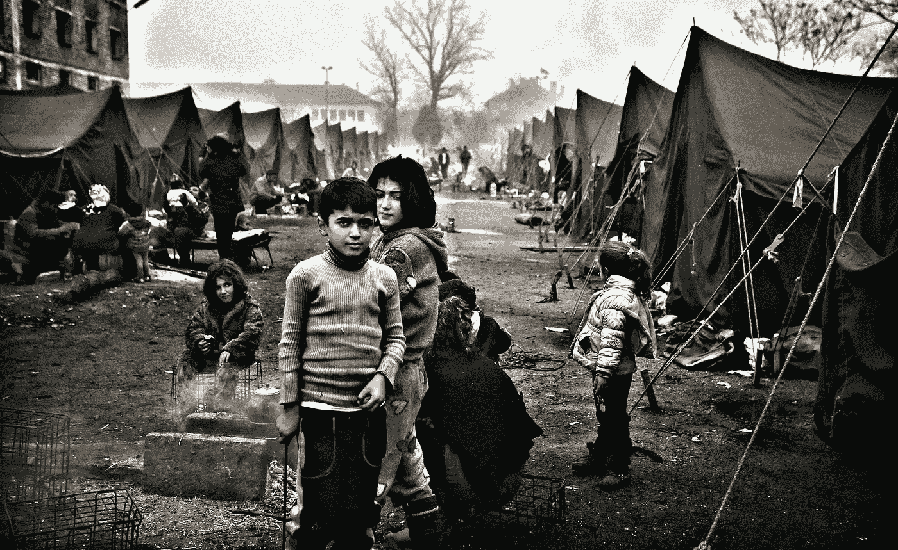
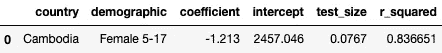
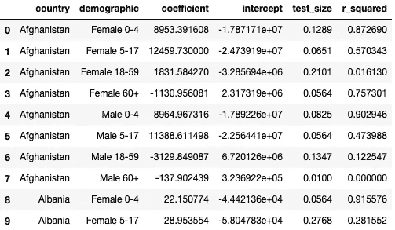
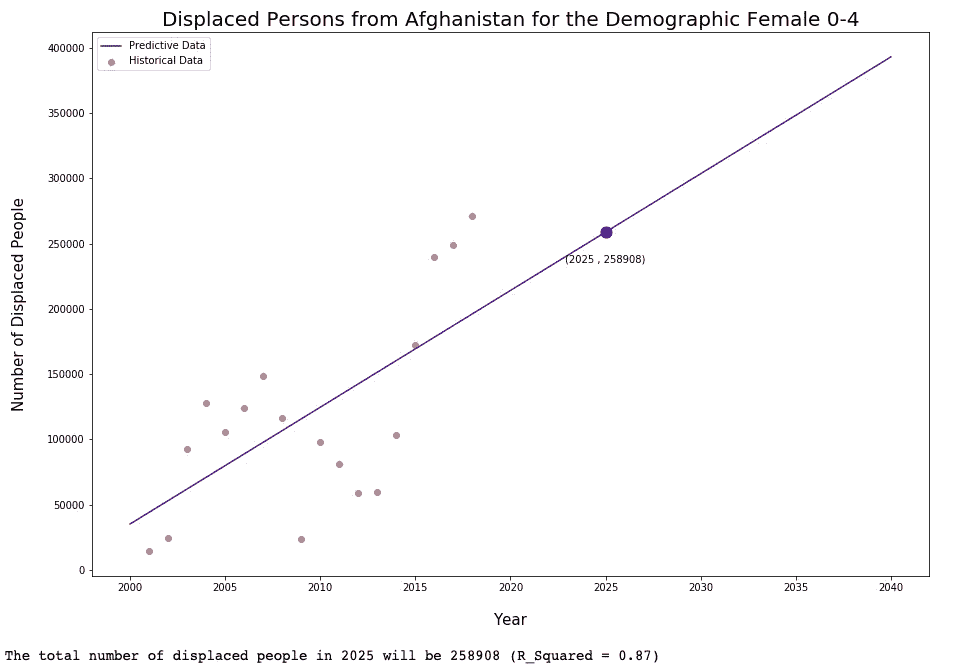
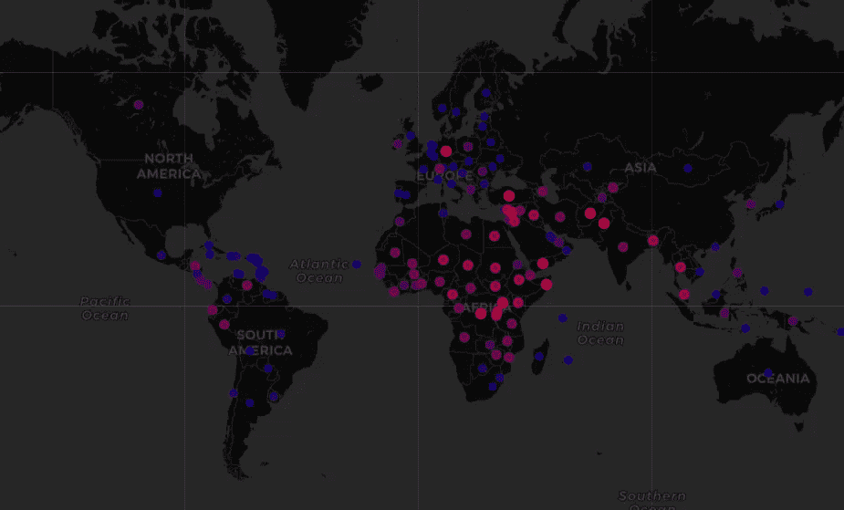

# 预测全球难民署关注人员的人口趋势

> 原文：<https://towardsdatascience.com/predicting-demographic-trends-for-global-unhcr-persons-of-concern-86dc4b8b920d?source=collection_archive---------37----------------------->

## 利用回归模型设计更好的社会支持系统

保加利亚的难民营|图片来源:论坛报达卡

## 介绍

在过去的十年里，难民和流离失所者的数量激增，使我们陷入了有史以来最大的难民危机。与此同时，像美国这样的国家正在接受数量少得可怜的 T2 难民，同时大力发展机构服务和支持网络。我们必须立即纠正这些侵犯人权的行为，并对我们已经看到的大规模移民进行更好的规划。

尽管数据科学和机器学习技术在历史上一直被用来对付边缘化群体，而不是增强他们的能力(只需看看凯西·奥尼尔的*数学毁灭武器*，如果使用正确，它们也可以用来帮助实现公平。在流离失所的背景下，我们可以开始实现预测人口迁移趋势的崇高目标。通过不仅从总人口规模的角度来看人们来自哪里，而且从人口本身的构成来看，政府和组织可以在搬迁过程中将自己置于支持流离失所者的最佳位置。显然，知道一个群体中有 70%是 4 岁以下的儿童，比不得不假设各年龄层之间的分布相等要好。

联合国难民署(UNHCR)在被归类为[关注人群](https://www.unhcr.org/ph/persons-concern-unhcr)的个人中收集[人口统计数据](http://popstats.unhcr.org/en/demographics)。这可以作为一个示例数据集来构建一个用于预测全球近期人口趋势的框架。具体来说，该工具将使用回归技术来预测八个人口统计桶中的总人数。请注意，使用这种方法可以而且应该用于更具体的人口统计数据集(按年龄、非二元性别身份等)。

## 方法学

*预处理:*就本项目而言，难民署的数据需要在国家一级进行标准化和汇总，因此可以采用一些简单的数据清理步骤，如去除星号、按国家分组、合并不总是被视为单独类别的人口统计数据，以及重命名国家，以便从中提取纬度和经度。我们也不能对只有一年数据的国家进行回归，所以这些值必须被删除。

*机器学习:*主模型利用简单线性回归进行预测。构建函数是为了在数据集中指定一个国家，并为特定的人口统计创建线性回归对象。然后在 test_train_split sklearn 功能中对多个测试规模应用回归，以通过 R 最大化线性回归。对于所有国家和人口统计数据，线性回归对象被转换为数据框架，以便在预测分析中轻松计算。

*可视化:* 用两种不同的可视化来检验预测的数据。第一幅图清楚地展示了特定年份的历史数据、回归拟合和预测值，而第二幅图则提供了以对数色标绘制的地理点地图。

## 支架开发

我不会在本文中讨论数据清理，但是如果你对细节感兴趣的话，可以看看我的 github。对于这个框架，我创建了三个函数，指定一个国家来获取数据，创建回归模型，并通过在 train/test/split 中迭代不同的测试规模来最大化基于 R 的回归。在这里，线性回归函数可以用其他回归模型来代替，如果它们能产生更好的拟合的话。

对柬埔寨人口统计“女性 5-17 岁”进行测试，我们得到:

现在，可以在清理后的数据集中对每个国家和人口进行迭代。显然，一些 R 值比其他值更好。稍后会详细介绍。

## 形象化

如上所述，该工具的可视化有两种形式——国家级和全球级。第一个是给定人口统计和国家的简单线性回归图，包括历史数据、相关回归线(R 最大化)和图表上显示所选年份预测值的特定点。第二个可视化显示了一个对数彩色比例的世界地理图，蓝色代表极少数流离失所者(0-10)，红色代表特定人口和年份的大量流离失所者(1，000，000-10，000，000)。有了这个图，你可以点击任何数值，得到那个国家的预测。

可视化开发如下所示。注意，第二个函数获取输入地址的纬度和经度。

可视化示例如下所示:

## 结果和讨论

建立这一模型是为了更好地预测总人口中流离失所者的具体人口数量，以便更好地准备必要的服务来支持受关注的人，但结果显然缺乏统计刚性。

这项研究最大的败笔是对大量公开数据的预测能力。每个国家最多有 18 个数据点，自 2001 年以来每年一个。有了这么少量的数据和流离失所的难以置信的不稳定性，这个工具的实际预测可行性非常低-如果有的话，它只能提供方向性的答案，即我们将在哪里看到特定人口的流离失所。每次回归运行时，R 会根据国家的不同而有很大的变化，尽管是最大化的。这在人口流离失所率低的国家尤其普遍。有了更长时间的数据收集和更具体的指标，算法支架会更成功。

该工具预测能力的一个改进领域是根据趋势不可变的特定因果数据进行映射。例如，利用围绕气候变化所做的大量预测工作是有意义的，气候变化已经迫使个人流离失所，而不是试图预测特定的战争是否会爆发。这并不是说后者更重要或更不重要，而是说如果模型除了完全基于总人口流动的历史趋势进行预测之外，还智能地引入因果因素，它将得到更好的装备。本质上，流离失所趋势是复杂的，因此获得有用的信息需要引入因果数据，并利用更先进的回归模型。然而，这可以为加载、清理和转换复杂的数据集提供一个支架，以构建和分析必要的学习算法。

尽管所使用的数据集存在统计学上的缺陷，但我们还是可以收集到一些推论。基于详细描述流离失所者预测人数的对数图，我们得到了基于历史趋势的预期结果。具体来说，预计最大的人口通常来自撒哈拉以南非洲、中东、中美洲和东南亚部分地区。

一些意想不到的国家出现了我们原本没有预料到的高数据，比如德国。然而，研究通常会指出这些数字存在的原因。例如，不仅有许多流离失所者前往德国，而且政府还驱逐了其中的许多人。由于靠近许多正在经历难民危机的地区，人数不幸变得相当多。

同样显而易见的是，即使在同一个国家，人口趋势也有很大差异——如果你自己摆弄数据，你会发现一些人口随着时间的推移在下降，而另一些人口则在上升(例如，阿富汗的老年男性与年轻男性)。

有关如何利用数据科学为难民创造更加公平的环境的更多信息，请参见 [Bansak、 *et al.*](https://science.sciencemag.org/content/359/6373/325) (2018)。

如有任何想法或问题，请随时联系我们，完整代码请参见 [my Github](https://github.com/shapiroj18/unhcr_displaced_demographics/blob/master/Refugee_Project.ipynb) 。非常感谢 Madeline Hardt 为这个项目提供咨询。