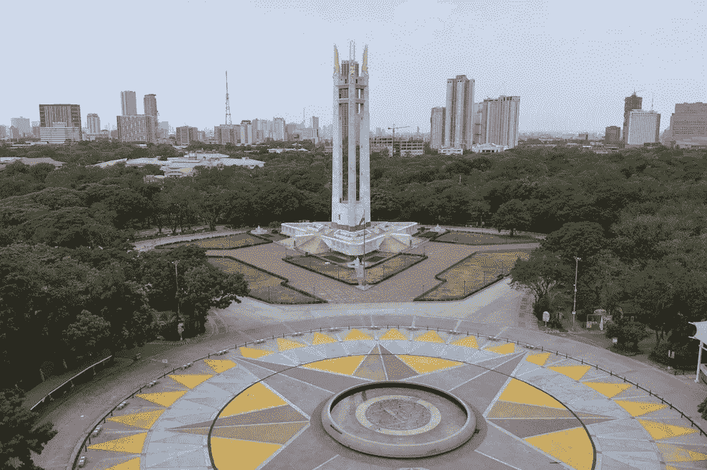
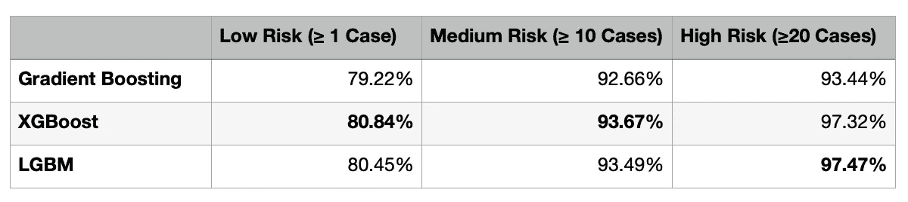
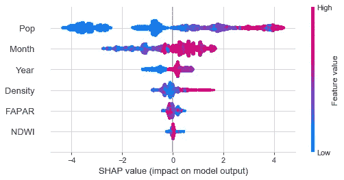

# 马尼拉奎松市 Barangay 预测登革热

> 原文：<https://towardsdatascience.com/predicting-dengue-by-barangay-in-quezon-city-manila-afef0a89c03d?source=collection_archive---------42----------------------->

菲律宾奎松市——图片来自[https://www . zocalopubicsquare . org/2020/05/07/letter-from-Quezon-City-Philippine-coronavirus-新冠肺炎/ideas/dispatches/](https://www.zocalopublicsquare.org/2020/05/07/letter-from-quezon-city-philippines-coronavirus-covid-19/ideas/dispatches/)

登革热是菲律宾的一个长期问题。由于热带气候和漫长的雨季，菲律宾成为携带病毒的蚊子的良好滋生地。不幸的是，登革热是无法治愈的，对于少数不幸被严重病毒感染的人来说，这可能是致命的。

预测病例数本身有助于为可能即将爆发的疫情做准备。然而，一个地方政府特别感兴趣的问题可能是:**哪里**我们确切地预计会有大量病例？通过定位登革热热点，官员们可以优先考虑进行蚊子存在测试和死水检查的地区，这将有助于降低爆发的可能性。

# 语境

一个**镇**是菲律宾最小的地理单位——大致相当于美国的一个县。初级卫生服务(据推测)是由每个镇的卫生站提供的，而镇很小，足以提供一个很好的图片，以准确地指导登革热干预措施。

换句话说，我回答了“我们在哪里预测登革热的爆发？”，通过回答“我们预测登革热在哪个镇爆发？”

# 方法

登革热数据来自 2016-2018 年 PhilHealth 从 Wilson Chua 先生和蚊子实时普查跟踪项目获得的记录(查看！).使用 Google API 对地址进行地理标记，然后映射到从 PhilGIS 获得的 barangay shapefiles。

**特性**

***【NDWI】***

水通常是蚊子的良好滋生地——这可能使它成为一个很好的预测器。这是使用 NDWI 量化的，它使用光吸收和反射的波长之间的差异来绘制高浓度和低浓度水的区域。使用谷歌地球引擎和 Sentinel-2 数据，对每个镇的 NDWI 值进行平均，并计算 2016 年至 2018 年期间每个月的 NDWI 值。

***被吸收的光合有效辐射的分数【FAPAR】***

像水一样，植被也是蚊子的良好滋生地——这可以使用 FAPAR 进行量化。它使用与 NDWI 相同的原理工作，但具有水反射和吸收的其他光谱带。还从谷歌地球引擎和 Sentinel-2 获得并处理了数据。

***人口和密度***

人口和人口密度值由 barangay 使用 PSA 的 2015 年数据获得。

***日期变量***

月份和年份用作模型的输入特征。

**目标变量**

利用菲律宾健康中心的数据，我们统计了每个镇每月的登革热病例数。生成了三个二元目标变量:

*   低风险:当月，镇上至少有 1 例登革热病例
*   中等风险:当月，镇上至少有 10 例登革热病例
*   **高风险:**当月，镇上至少有 20 例登革热病例

这些值**是任意的**，选择这些值是为了探索模型对不同目标的预测准确性。

**型号**

对数据的初步扫描显示，登革热的发生相对异常——在 4825 份记录中，25%至少有 1 例登革热病例，12%至少有 10 例，4.4%至少有 20 例。

考虑到这一点，使用 SMOTE 平衡数据集，SMOTE 通过取当前数据的中点来生成新数据。这产生了一个数据集，其中一半的行是登革热阳性，一半的行是阴性。通过平衡数据，我们训练的模型不会偏向于预测一种结果而不是另一种结果。

然后，我们实施了**梯度推进**——一种机器学习模型，它迭代地重新加权输入，以便调整模型来分类模型以前无法分类的行。这使得它可以集中于最初可能无法正确分类的异常数据，并对这些条目进行加权，从而将模型调整到能够正确分类先前错误分类的镇的程度。

我们研究了梯度增强的三种变体:正常梯度增强、XGBoost 和轻型 GBM。

# 结果

这些模型在预测出现登革热病例的高风险地区时表现最佳。在三个模型中，LGBM 在预测高风险区域(97.47%的准确率)方面表现最好，而 XGBoost 在预测中等(93.67%)和低风险(80.84%)区域方面表现更好。将这些结果与纯粹的随机猜测(50.00%)进行对比——表明模型的表现并不太差。

***为什么模型在高危情况下表现更好？***

没有登革热病例的镇和有 1 例登革热病例的镇之间的 NDWI 或人口密度可能没有明显差异，这使得模型更难将一个镇分类为低风险或无风险。然而，一个没有病例的乡镇和 20 个病例的乡镇之间可能存在更大的差异——这使得模型更容易预测高风险地区，所达到的更高准确性就是证明。

但是，值得注意的是，大量数据被估算(实际上是创建)以创建平衡的数据集，尤其是在中高风险区域。因为这些数据是生成的，所以它遵循现有数据的模式，并且不包含来自真实世界数据的噪声——这反过来可能会使模型更容易生成更好的预测。这对我们来说意味着，虽然高风险模型在我们生成的数据上表现良好，但我们不确定它在未来的真实世界数据上表现如何。

***哪些变量对将一个镇归类为有(或没有)登革热风险的影响最大？***

使用 SHAP 图，我们可以看到哪些变量对模型的决策过程贡献最大，从而将镇划分为有登革热风险的镇。SHAP 值表示某个变量将模型的预测转变为支持或反对将某个镇归类为登革热阳性的程度。

**读图:**变量的分布表明它对模型预测的影响范围。价差越大，一个变量的影响就越大。如果红点在右边，蓝色值在左边，这意味着该变量与更高的登革热发病率正相关。右边的蓝点和左边的红点表示该变量与登革热呈负相关。

由于我们使用了二元指标(0 表示没有登革热，1 表示有登革热)，一个镇的人口变量的 SHAP 值为 0.50，表明该镇的人口发生登革热的预测概率增加了 50%。

具有 XGBoost 的中等风险登革热模型的 SHAP 值

**结果:**人口对一个镇的登革热风险评分影响最大。正如所料，这是正相关的:人越多，患登革热的风险就越高。月份变量(从 1 到 12，每个月)也显示出正相关，这与雨季的趋势一致。一年中较早的月份相对干燥，因此“低”月份值(2 月至 5 月，标记为 2 至 5)与登革热的低风险相关，而潮湿和“高”月份值(7 月至 10 月，标记为 7 至 10)与登革热的高风险相关。

**评论:**结果相当令人惊讶——我预计 FAPAR、NDWI 和人口密度会产生最大的影响，因为它们直接量化了降雨量、植被和人口密度，而这些都与蚊子的繁殖和生长直接相关。然而，事实证明人口和月份的影响要大得多。这可能与 FAPAR、NDWI 或 density 的数据质量问题有关，或者它们可能不像我想象的那样具有预测性！

# 那又怎样？

在这个项目中，我们着眼于使用一个镇的信息来预测其发生至少 1 例登革热病例、10 例以上登革热病例和 20 例以上登革热病例的概率。然后我们发现人口多的镇在一年的后几个月最容易患登革热。对于奎松市来说，这意味着在选择实施登革热缓解计划的地方时，他们应该优先考虑人口最多的镇，并在雨季开始时这样做。

# 代码和谢谢

查看这里的代码:[https://github.com/ljyflores/Dengue-Prediction.git](https://github.com/ljyflores/Dengue-Prediction.git)

非常感谢 Wilson Chua 先生的指导和指引，以及耶鲁大学科学和社会科学信息中心的 Miriam Olivares 和 TC Chakraborty 对特征工程的帮助。