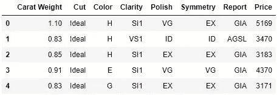
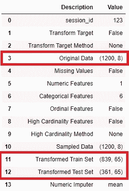
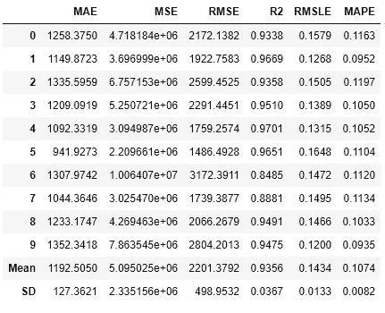
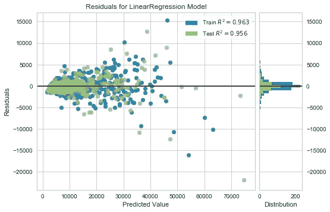
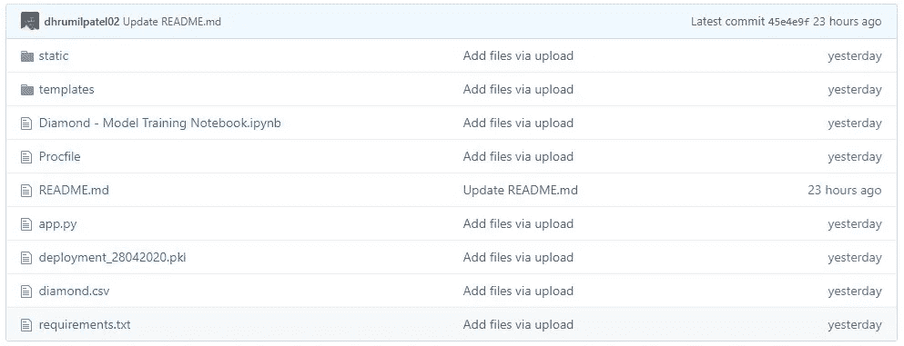
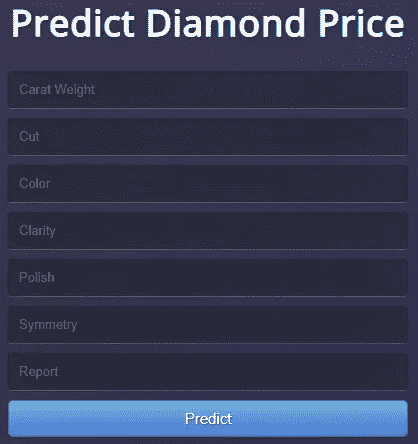

# 机器学习如何预测你想要购买的钻石的价格

> 原文：<https://towardsdatascience.com/predicting-diamond-prices-using-basic-measurement-metrics-bc8ba821c8f6?source=collection_archive---------48----------------------->

## 使用基本测量指标预测钻石价格。


由 [Unsplash](https://unsplash.com?utm_source=medium&utm_medium=referral) 上的 [chuttersnap](https://unsplash.com/@chuttersnap?utm_source=medium&utm_medium=referral) 拍摄

# 介绍

我想一有足够的钱就给我妈妈买一枚钻石戒指。前几天，我在谷歌上搜索了它的价格，但我不知道是什么指标推动了这些价格。因此，我决定应用一些机器学习技术来找出是什么推动了一枚完美无瑕的钻石戒指的价格！

# 目标

构建一个 web 应用程序，用户可以在其中查找他们想要的钻石的预测价格。

# 数据

对于这个项目，我使用了 GitHub 上 pycaret 的 dataset 文件夹中的一个[数据集](https://github.com/pycaret/pycaret/blob/master/datasets/diamond.csv)，执行了数据预处理转换，并建立了一个回归模型，以使用基本的钻石测量指标来预测钻石的价格(326 美元至 18，823 美元)。数据集中的每颗钻石都有一个价格。钻石的价格由 7 个输入变量决定:

1.  **克拉重量**:0.2 千克-5.01 千克
2.  切割:一般、良好、非常好、优质、理想
3.  **颜色**:从 J(最差)到 D(最好)
4.  **清晰度** : I1(最差)、SI2、SI1、VS2、VS1、VVS2、VVS1、IF(最好)
5.  **波兰** : ID(理想)、EX(优秀)、G(良好)、VG(非常好)
6.  **对称性** : ID(理想)，EX(优秀)，G(良好)，VG(非常好)
7.  **报告** : AGSL(美国宝石协会实验室)、GIA(美国宝石学院)



# 👉任务

1.  **模型训练和验证:**使用 Python ( [PyCaret](https://www.pycaret.org/) )训练、验证模型，并开发用于部署的机器学习管道。
2.  **前端 Web 应用:**构建一个基本的 HTML 前端，带有自变量(克拉重量、切工、颜色、净度、抛光度、对称性、报告)的输入表单。
3.  **后端 Web 应用:**使用[烧瓶](https://flask.palletsprojects.com/en/1.1.x/) 框架。
4.  **部署 web 应用程序:**使用 [Heroku](https://www.heroku.com/) ，一旦部署，它将公开可用，并且可以通过 Web URL 访问。

# 💻项目工作流程


机器学习工作流程(从培训到 PaaS 部署)

# 任务 1 —模型训练和验证

使用 PyCaret 在 Python (Jupyter 笔记本)中进行模型训练和验证，以开发机器学习管道并训练回归模型。我使用 PyCaret 中的默认预处理设置。

```
from **pycaret.regression import** *s2 = setup(data, target = 'Price', session_id = 123,
           normalize = **True**,
           polynomial_features = **True**, trigonometry_features = **True**, feature_interaction=**True**, 
           bin_numeric_features= ['Carat Weight']
```



数据集中转换的比较

这改变了数据集，减少到 65 个用于训练的特征，而原始数据集中只有 8 个特征。

PyCaret 中的模型训练和验证:

```
# Model Training and Validation 
lr = **create_model**('lr')
```



线性回归模型的 10 倍交叉验证

在这里，均方根误差( **RMSE** )和平均绝对百分比误差( **MAPE** )受到了显著影响。

```
# plot the trained modelplot_model(lr)
```



线性回归模型的残差图

构建模型后，我将它保存为一个文件，该文件可以传输到其他应用程序并供其使用:

```
# save transformation pipeline and model 
save_model(lr, 'deployment_28042020')
```

保存模型会根据在 **setup()** 函数中定义的配置创建整个转换管道，并且会考虑到相互依赖关系。整个机器学习管道和线性回归模型现在保存在 **save_model()** 函数中。

# 任务 2 — **前端 Web 应用**

**CSS 样式表** CSS(层叠样式表)描述了用 HTML 编写的文档的呈现方式。它保存诸如颜色、字体大小、边距等信息。它被保存为链接到 HTML 代码的. css 文件。

```
<head>
  <meta charset="UTF-8">
  <title>Predict Diamond Price</title>
  <link href='[https://fonts.googleapis.com/css?family=Pacifico'](https://fonts.googleapis.com/css?family=Pacifico') rel='stylesheet' type='text/css'>
<link href='[https://fonts.googleapis.com/css?family=Arimo'](https://fonts.googleapis.com/css?family=Arimo') rel='stylesheet' type='text/css'>
<link href='[https://fonts.googleapis.com/css?family=Hind:300'](https://fonts.googleapis.com/css?family=Hind:300') rel='stylesheet' type='text/css'>
<link href='[https://fonts.googleapis.com/css?family=Open+Sans+Condensed:300'](https://fonts.googleapis.com/css?family=Open+Sans+Condensed:300') rel='stylesheet' type='text/css'>
<link type="text/css" rel="stylesheet" href="{{ url_for('static', filename='./style.css') }}">

</head>
```

对于前端 web 应用程序，我使用了一个简单的 HTML 模板和一个 CSS 样式表来设计输入表单。下面是我们的 web 应用程序前端页面的 HTML 代码片段。

```
<body>
 <div class="login">
 <h1>Predict Diamond Price</h1><!-- Form to enter new data for predictions  -->
    <form action="{{ url_for('predict')}}"method="POST">
      <input type="text" name="Carat Weight" placeholder="Carat Weight" required="required" /><br>
     <input type="text" name="Cut" placeholder="Cut" required="required" /><br>
        <input type="text" name="Color" placeholder="Color" required="required" /><br>
        <input type="text" name="Clarity" placeholder="Clarity" required="required" /><br>
        <input type="text" name="Polish" placeholder="Polish" required="required" /><br>
        <input type="text" name="Symmetry" placeholder="Symmetry" required="required" /><br>
        <input type="text" name="Report" placeholder="Report" required="required" /><br>
        <button type="submit" class="btn btn-primary btn-block btn-large">Predict</button>
    </form><br>
   <br>
 </div>
 {{pred}}</body>
```

# 任务 3—后端 Web 应用程序

我使用 Flask 框架来构建后端 web 应用程序。下面是后端应用程序的 Flask 代码片段。

```
from flask import Flask,request, url_for, redirect, render_template, jsonify
from pycaret.regression import *
import pandas as pd
import pickle
import numpy as npapp = Flask(__name__)model = load_model('deployment_28042020')
cols = ['Carat Weight', 'Cut', 'Color', 'Clarity', 'Polish', 'Symmetry', 'Report'][@app](http://twitter.com/app).route('/')
def home():
    return render_template("home.html")[@app](http://twitter.com/app).route('/predict',methods=['POST'])
def predict():
    int_features = [x for x in request.form.values()]
    final = np.array(int_features)
    data_unseen = pd.DataFrame([final], columns = cols)
    prediction = predict_model(model, data=data_unseen, round = 0)
    prediction = int(prediction.Label[0])
    return render_template('home.html',pred='Price of the Diamond is ${}'.format(prediction))[@app](http://twitter.com/app).route('/predict_api',methods=['POST'])
def predict_api():
    data = request.get_json(force=True)
    data_unseen = pd.DataFrame([data])
    prediction = predict_model(model, data=data_unseen)
    output = prediction.Label[0]
    return jsonify(output)if __name__ == '__main__':
    app.run(debug=True)
```

# 任务 4— **部署网络应用**

在训练了模型，建立了机器学习管道之后，我在 Heroku 上部署了 web 应用程序。我链接了一个 GitHub 库到 Heroku。这个项目的代码可以在我的 GitHub 库[这里](http://github.com/dhrumilpatel02/diamond-price-prediction)找到。



[github.com/dhrumilpatel02/diamond-price-prediction](https://github.com/dhrumilpatel02/diamond-price-prediction)

接下来，我在 Heroku 上部署了 web 应用程序，该应用程序发布在 URL:



[https://diamond-price-prediction.herokuapp.com/](https://diamond-price-prediction.herokuapp.com/)

感谢 PyCaret 的创始人和主要作者， [Moez Ali](https://www.linkedin.com/in/profile-moez/) 。这个项目的过程灵感来自于他最近在[的帖子](/build-and-deploy-your-first-machine-learning-web-app-e020db344a99)。

# 感谢阅读！

您可以通过以下方式联系到我:

1.  在 **LinkedIn** [这里](https://www.linkedin.com/in/dhrumilpatel02/)关注/联系我。
2.  在 **GitHub** [这里](https://github.com/dhrumilpatel02)关注我。
3.  查看我的**网站** [这里](https://dhrumilpatel02.github.io/portfolio/)。