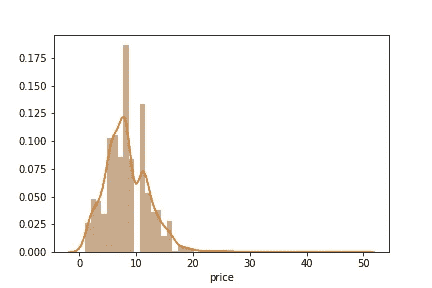
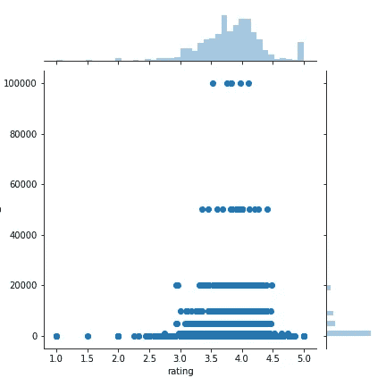
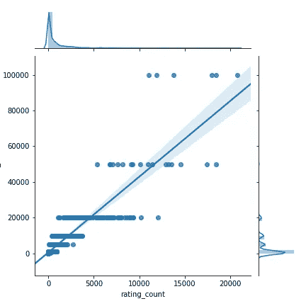
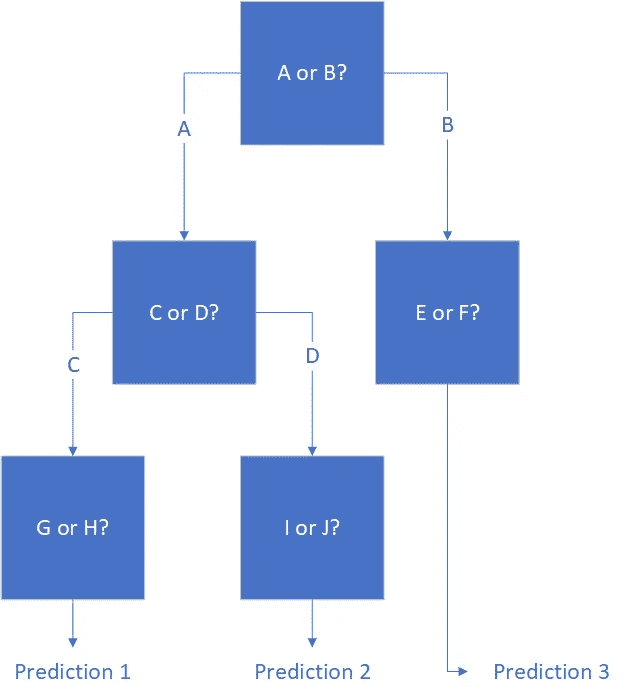
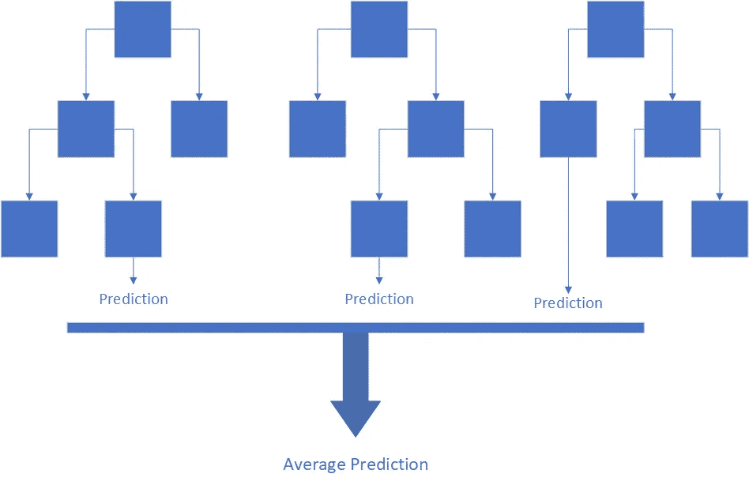

# 用随机森林回归预测电子商务销售额

> 原文：<https://towardsdatascience.com/predicting-e-commerce-sales-with-a-random-forest-regression-3f3c8783e49b?source=collection_archive---------25----------------------->

## 使用真实生活数据的基础教程


[rupixen.com](https://unsplash.com/@rupixen?utm_source=medium&utm_medium=referral)在 [Unsplash](https://unsplash.com?utm_source=medium&utm_medium=referral) 上拍照

# 数据集

为了演示随机森林回归，将使用流行的在线零售商 Wish 的电子商务销售数据集。这些数据来自 [Kaggle](https://www.kaggle.com/jmmvutu/summer-products-and-sales-in-ecommerce-wish) ，并且只展示了夏季服装的销售信息。这些属性包括产品描述、评级、是否使用了广告宣传、产品列表中是否添加了紧急文本以及售出的数量等。

为了显示随机森林回归的威力，将预测售出的单位数。不仅对于需要估计订购或生产多少产品的库存计划人员来说，而且对于需要了解产品在电子商务环境中如何移动的销售人员来说，做出良好、准确的预测都是非常宝贵的。

# 导入和清理数据

所有的数据导入和操作都将通过 python 以及 pandas 和 numpy 库来完成。

```
import pandas as pd
import numpy as np# import the data saved as a csv
df = pd.read_csv("Summer_Sales_08.2020.csv")
```

前两行只是导入 pandas 和 numpy 库。最后一行读取先前保存并重命名为“Summer_Sales_08.2020”的 CSV 文件，并创建一个数据框。

```
df["has_urgency_banner"] = df["has_urgency_banner"].fillna(0)df["discount"] = (df["retail_price"] - df["price"])/df["retail_price"]
```

查看数据时,“has_urgency_banner”列编码不正确，该列指示是否对产品列表应用了紧急横幅。当横幅没有被使用时，它只是留下空白，而不是使用 1 和 0。第一行代码用 0 填充这些空白。

第二行创建一个名为“discount”的新列，它计算产品相对于列出的零售价格的折扣。

```
df["rating_five_percent"] = df["rating_five_count"]/df["rating_count"]
df["rating_four_percent"] = df["rating_four_count"]/df["rating_count"]
df["rating_three_percent"] = df["rating_three_count"]/df["rating_count"]
df["rating_two_percent"] = df["rating_two_count"]/df["rating_count"]
df["rating_one_percent"] = df["rating_one_count"]/df["rating_count"]
```

原始数据集包括几个专用于产品评级的列。除了平均评级，它还包括评级总数以及五星、四星、三星、二星和一星评论的数量。因为已经考虑了评论的总数，所以最好将星级作为总评分的百分比来看，这样可以在产品之间进行直接比较。

上面几行简单地创建了五个新列，给出了数据集中每个产品的五星、四星、三星、二星和一星评论的百分比。

```
ratings = [
    "rating_five_percent",
    "rating_four_percent",
    "rating_three_percent",
    "rating_two_percent",
    "rating_one_percent"
]for rating in ratings:
    df[rating] = df[rating].apply(lambda x: x if x>= 0 and x<= 1 else 0)
```

虽然 pandas 在除以 0 时不会抛出错误，但在试图分析数据时会产生问题。在这种情况下，评分为 0 的产品在上一步计算时会产生问题。

上面的代码片段遍历所有新生成的列，并检查输入的值是否在 0 和 1 之间，包括 0 和 1。如果不是，它们会被替换为 0，这是一个合适的替代。

# 数据探索

```
import seaborn as sns# Distribution plot on price
sns.distplot(df['price'])
```



价格分布图。图由作者制作。

上面的代码生成了数据集中所有产品的价格分布图。最明显也是最有趣的发现是，没有任何产品花费€10 英镑。这可能是商家为了让他们的产品出现在“€10 岁及以下”名单上而故意做出的努力。

```
sns.jointplot(x = "rating", y = "units_sold", data = df, kind = "scatter")
```



收视率和销售量之间的散点图。图由作者制作。

上图显示，绝大多数销售都是在三星和四星半之间。它还显示，大多数产品的销量不到 2 万件，少数产品的销量分别为 6 万件和 10 万件。

作为一个旁白，散点图组织成线的趋势表明，销售单位更可能是一个估计，而不是硬数字。

```
sns.jointplot(x = "rating_count", y = "units_sold", data = df, kind = "reg")
```



收视率和销售量之间的散点图。图由作者制作。

这张图表展示了评级的另一面。评级的数量和产品销售的可能性之间有一种松散但积极的关系。这可能是因为消费者在考虑购买时会同时考虑总体评分和评分数量，或者是因为高销量的产品自然会产生更多的评分。

如果没有关于购买时间和评级发布时间的额外数据，如果没有额外的领域知识，很难辨别相关性的原因。

# 什么是随机森林回归？

简而言之，随机森林回归是一系列决策树的平均结果。决策树就像一个流程图，它提出一系列问题，并根据这些问题的答案做出预测。例如，试图预测网球运动员是否会去球场的决策树可能会问:正在下雨吗？如果是，球场在室内吗？如果没有，玩家能找到伴侣吗？



一个简单的决策树。图由作者制作。

决策树将在做出预测之前回答每一个问题。虽然容易理解，而且根据一些专家的说法，比其他机器学习技术更好地模拟实际的人类行为，但它们经常过度拟合数据，这意味着它们经常可以在类似的数据集上给出非常不同的结果。

为了解决这个问题，从相同的数据集中取出多个决策树，打包，并返回结果的平均值。这就是所谓的随机森林回归。



一个简单的随机森林。图由作者制作。

它的主要优势是对高度非线性的数据做出准确的预测。在愿望数据集中，在评级中可以看到非线性关系。没有一个很好的，容易看到的相关性，但低于三颗星和高于四颗半的截止点是显而易见的。随机森林回归可以识别这种模式，并将其纳入结果中。然而，在一个更传统的线性回归中，它只会混淆它的预测。

此外，随机森林分类器是高效的，可以处理许多输入变量，并且通常做出准确的预测。这是一个非常强大的工具，并且不需要太多代码来实现。

# 实现随机森林回归

```
from sklearn.model_selection import train_test_split
from sklearn.ensemble import RandomForestRegressor# Divide the data between units sold and influencing factors
X = df.filter([
    "price",
    "discount",
    "uses_ad_boosts",
    "rating",
    "rating_count",
    "rating_five_percent",
    "rating_four_percent",
    "rating_three_percent",
    "rating_two_percent",
    "rating_one_percent",
    "has_urgency_banner",
    "merchant_rating",
    "merchant_rating_count",
    "merchant_has_profile_picture"
])Y = df["units_sold"]# Split the data into training and testing sets
X_train, X_test, Y_train, Y_test = train_test_split(X, Y, test_size=0.33, random_state = 42)
```

在运行任何模型之前，前两行导入相关的库。下一组行创建两个变量 X 和 Y，然后将它们分成训练和测试数据。测试大小为 0.33，这确保了大约三分之二的数据将用于训练数据，三分之一将用于测试数据的准确性。

```
# Set up and run the model
RFRegressor = RandomForestRegressor(n_estimators = 20)
RFRegressor.fit(X_train, Y_train)
```

接下来，模型实际上被初始化并运行。注意，参数 n_estimators 表示要使用的决策树的数量。

```
predictions = RFRegressor.predict(X_test)
error = Y_test - predictions
```

最后，新拟合的随机森林回归被应用于测试数据，并且取差来产生误差阵列。这就是全部了！

# 结论

Wish 数据集提供了一个数字游戏场，可用于解决现实世界的问题。通过最少的数据操作，随机森林回归被证明是分析这些数据并提供实际结果的无价工具。