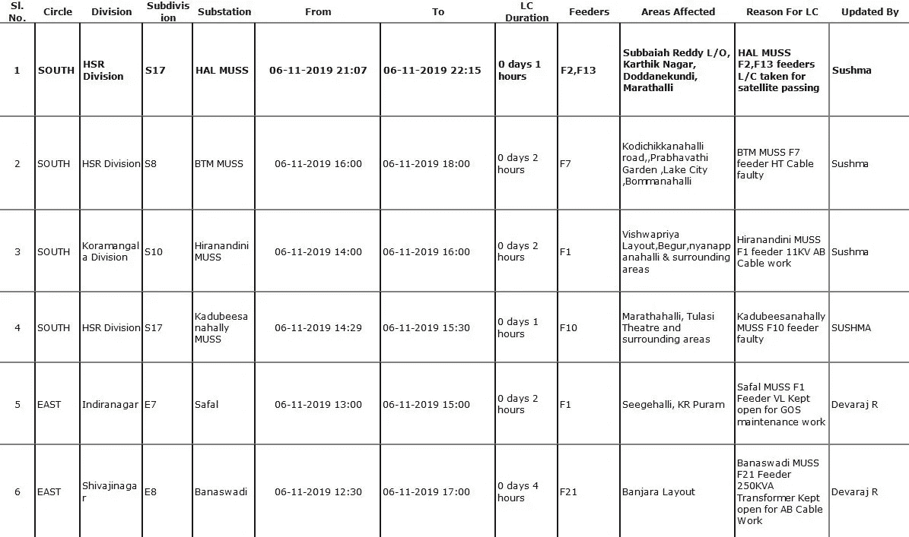
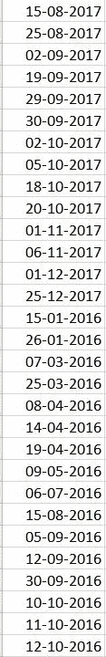
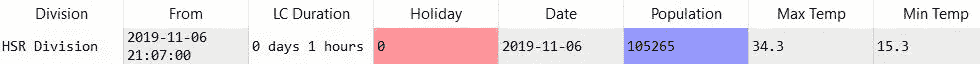
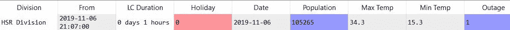
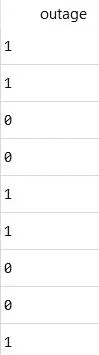
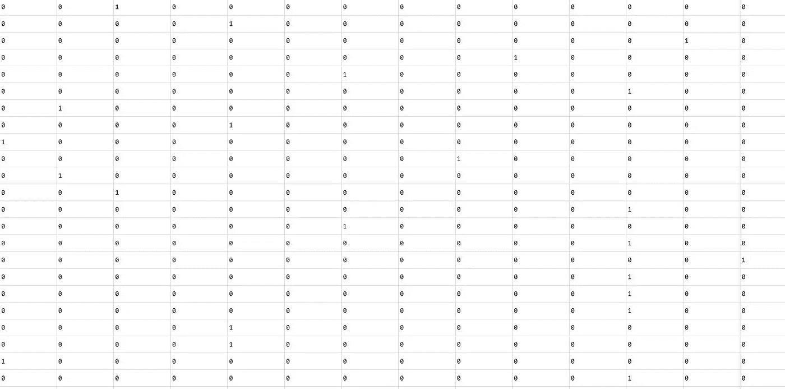
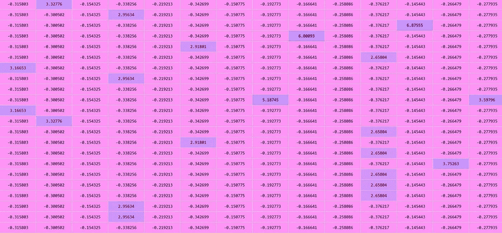

# 用 Keras 和 Python 预测停电

> 原文：<https://towardsdatascience.com/predicting-electricity-outage-with-keras-and-python-fbd1b299a24e?source=collection_archive---------34----------------------->

## 知道你所在的城市什么时候、什么地方会停电，会停电多长时间


在本文中，我们将探索我和我的团队开发一个 web 应用程序来预测班加罗尔停电的概率的过程。只要能收集到足够的数据，结果可以在任何城市重现。

# 第 1 部分:整合数据

我们从 BESCOM 的网站上找到了公开的非计划停电数据。虽然这不是一个优雅的解决方案，但由于网站一次加载所有 50，000+行，一个简单的 **Ctrl+A，Ctrl+C** 和 **Ctrl+V** 到一个 excel 表中，使我们免于编写复杂的废弃代码。



显示从 BESCOM 网站“复制”的数据的 Excel 表格

将它加载到我们的 python 代码中相当简单。我们的文件被保存为**BESCOM-electricity-data-orange . xlsx .**

```
 Sl. No.    ...     Updated By
0      1.0    ...         Sushma
1      2.0    ...         Sushma
2      3.0    ...         Sushma
3      4.0    ...         SUSHMA
4      5.0    ...      Devaraj R[5 rows x 12 columns]
```

为了查看所有单独的列，我们使用

```
array(['Sl. No.', 'Circle', 'Division', 'Subdivision', 'Substation',
       'From', 'To', 'LC Duration', 'Feeders', 'Areas Affected',
       'Reason For LC', 'Updated By'], dtype=object)
```

由于这些属性中的大多数并没有为我们的理解增加很多信息，为了使我们的任务更简单和更容易可视化，我们将只保留列 **Sl。号，分割，从**和 **LC 持续时间。**

```
 Division                From     LC Duration
0          HSR Division 2019-11-06 21:07:00  0 days 1 hours
1          HSR Division 2019-11-06 16:00:00  0 days 2 hours
2  Koramangala Division 2019-11-06 14:00:00  0 days 2 hours
3          HSR Division 2019-11-06 14:29:00  0 days 1 hours
4           Indiranagar 2019-11-06 13:00:00  0 days 2 hours
```

接下来，我们需要添加关于某一天是否是假日的数据。直觉告诉我们，节假日的用电量会增加，因此停电的可能性更大。为此，我们首先找到数据集中包含的最早和最早的日期。

```
Timestamp('2019-11-06 21:07:00')
Timestamp('2014-05-05 02:40:00')
```

现在，我们找到该范围内的所有公共假日，并将它们添加到单独的 excel 表 **holidayData.xlsx.**



所有假期的列表

下一步是将这些假期映射到我们现有的数据集中。为此，我们在数据集中创建另一个名为 **Holiday** 的列，并将所有行赋值为零。查看日期，我们将列更新为“1 ”,即出现在 holidayData.xlsx 中的日期。

```
Holiday  Division   From  LC Duration   Date                                   
    0.0     16136  16179        16179  16179
    1.0      1116   1117         1117   1117
```

接下来，我们将绘制各个**分区**的人口图，人口越多的分区理论上遭受停电的几率就越高。

首先，我们找到独特的**部门列表**

```
array(['HSR Division', 'Koramangala Division', 'Indiranagar',
       'Shivajinagar', 'Hebbal', 'Whitefield', 'Malleshwaram',
       'Rajaji Nagara Division', 'Jayanagar', 'Jalahalli',
       'Kengeri Division', 'R R NAGAR', 'Vidhanasoudha',
       'Peenya Division', nan], dtype=object)
```

我们现在找到了这些地区的估计人口。这项任务的准确性因数据是否公开而异。在我们的例子中，上一次人口普查是在 2011 年进行的，所以我们必须推断人口数来反映班加罗尔当前的总人口。由于只有 14 个区域，我们将在字典中输入这些值，而不是将这些数据添加到另一个 excel 文件中。然后，我们在数据集中创建另一个名为**人口**的列，并为其分配与**部门**相同的值。然后我们使用 python 中的**替换**函数，用 **div_pop_dict 中的*值*替换 Population 中的*键*。**

```
0    105265.0
1    105265.0
2     63987.0
3    105265.0
4     58830.0
Name: Population, dtype: float64
```

接下来，我们发现了之前提到的日期范围内的每日最低和最高温度。这些数据存储在 **weather_data_max_min.xlsx 中。**我们将加载数据集并将 *datetime* 值更改为*日期。*

```
 Date  Max Temp  Min Temp
0  2014-01-01      18.7      14.8
1  2014-01-02      27.3      15.4
2  2014-01-03      27.7      13.1
3  2014-01-04      29.5      12.0
4  2014-01-05      29.6      14.1
```

现在，我们遵循与人口数据集相同的流程，即创建一个包含日期和温度值的字典，并用最低/最高温度替换断电日期。

```
 Max Temp Min Temp
0     34.3     15.3
1     34.3     15.3
2     34.3     15.3
3     34.3     15.3
4     34.3     15.3
```

这些都是我们将在这个例子中使用的特性。

现在，我们需要为分类创建标签。现在我们已经详细了解了产生和**中断**的特征组合。然而，我们需要将关于哪些条件**不会导致断电**的数据输入到模型中，以便正确理解区别并相应地制定规则。

我们将如何处理这个特殊的问题是通过选择每一行，其中我们有断电发生的时间和地点的日期和时间，并将其标记为断电的日期和时间。对于所有其他持续时间，除了**时间**之外的完全相同的特征组合的标签被标记为**‘0’表示不停机。为了进一步说明这一点，我们举一个例子:**

假设选择了下面的行:



然后将断电标记为**‘1】，如下所示:**



请注意，这一特定停机发生的时间大致在**2100-2200 小时**之间。因此，我们可以得出结论，在**0000–2100 和 2200–0000 之间的持续时间内可能没有断电。**因此，我们可以复制具有这些持续时间的行，并将它们标记为**‘0’表示不中断。**获取:



作为训练前的最后一步，我们需要将**一键编码***的值。这意味着，划分(英迪拉那加，科拉曼加拉，HSR 布局……)对计算机来说毫无意义。因此，我们为这些划分中的每一个划分形成单独的列，每行可以有 0/1。例如，假设为 Indirangar 的*分部形成了一行，*行中的值 0 将意味着该特定行没有 Indiranagar 作为其分部，而值 1 将表明它是。这让计算机用自己的术语理解数据，并形成更好的模式。为了更深入地理解一键编码，你可以阅读这篇文章。*

*这给出了下面的列，我们可以注意到，在每一行中，只有一列的值为“1 ”,表示分部。*

**

*一个热编码分区*

# *第 2 部分:训练数据*

*在训练数据之前，我们需要*对其进行缩放。*这意味着不同的特征具有不同的取值范围，而[神经网络](http://BecomingHuman.ai)通常工作得最好的是作为其输入的值在 **-1 到+1 或 0 到 1 的范围内。**因此，我们在单个特征自身的尺度上对其进行缩放，以降低给定范围内的所有值，同时保持其内在差异。*

*这通过找到列的平均值和标准偏差，然后转换列，使缩放器适合数据。当另一个数据集需要被缩放以提供给[神经网络](http://BecomingHuman.ai)进行预测时，我们应该**不要再次拟合**缩放器，而只是将其转换并馈入神经网络。*

**

*缩放数据*

*接下来，我们需要**将数据集分割**成一个训练和测试集。训练集用于**训练**模型，测试集用于**评估模型**的准确性。*

*现在是我们定义神经网络模型的时候了。我们为我们的工作选择了一个具有 3 个隐藏层的序列模型。*

*定义模型后，我们的艰苦工作就完成了，现在是时候满意地观看我们的模型火车了:*

```
*Epoch 1/20
81987/81987 [==============================] - 3s 35us/step - loss: 0.4935 - accuracy: 0.7443
Epoch 2/20
81987/81987 [==============================] - 3s 33us/step - loss: 0.4333 - accuracy: 0.7874
Epoch 3/20
81987/81987 [==============================] - 3s 33us/step - loss: 0.4259 - accuracy: 0.7900
Epoch 4/20
81987/81987 [==============================] - 3s 31us/step - loss: 0.4186 - accuracy: 0.7923
Epoch 5/20
81987/81987 [==============================] - 3s 32us/step - loss: 0.4147 - accuracy: 0.7949
Epoch 6/20
81987/81987 [==============================] - 3s 31us/step - loss: 0.4121 - accuracy: 0.7977
Epoch 7/20
81987/81987 [==============================] - 3s 32us/step - loss: 0.4097 - accuracy: 0.7983
Epoch 8/20
81987/81987 [==============================] - 3s 31us/step - loss: 0.4080 - accuracy: 0.7988
Epoch 9/20
81987/81987 [==============================] - 3s 32us/step - loss: 0.4058 - accuracy: 0.8007
Epoch 10/20
81987/81987 [==============================] - 3s 31us/step - loss: 0.4041 - accuracy: 0.8015
Epoch 11/20
81987/81987 [==============================] - 3s 31us/step - loss: 0.4039 - accuracy: 0.8020
Epoch 12/20
81987/81987 [==============================] - 3s 32us/step - loss: 0.4020 - accuracy: 0.8024
Epoch 13/20
81987/81987 [==============================] - 3s 32us/step - loss: 0.4004 - accuracy: 0.8043
Epoch 14/20
81987/81987 [==============================] - 3s 31us/step - loss: 0.3989 - accuracy: 0.8046
Epoch 15/20
81987/81987 [==============================] - 3s 32us/step - loss: 0.3984 - accuracy: 0.8056
Epoch 16/20
81987/81987 [==============================] - 3s 31us/step - loss: 0.3974 - accuracy: 0.8057
Epoch 17/20
81987/81987 [==============================] - 3s 31us/step - loss: 0.3964 - accuracy: 0.8062
Epoch 18/20
81987/81987 [==============================] - 3s 31us/step - loss: 0.3952 - accuracy: 0.8067
Epoch 19/20
81987/81987 [==============================] - 3s 32us/step - loss: 0.3944 - accuracy: 0.8075
Epoch 20/20
81987/81987 [==============================] - 3s 31us/step - loss: 0.3934 - accuracy: 0.8080*
```

*测试训练好的模型:*

```
*20497/20497 [==============================] - 1s 34us/step
Out[80]: [0.38760558974482917, 0.7936800527572632]*
```

*我们已经实现了大约 80%的训练准确率和大约 79%的测试准确率。这可以通过调整[神经网络](http://BecomingHuman.ai)架构来改善。*

***这篇文章就到这里吧各位！感谢您的阅读，如果您觉得这对您有用，请发表评论。这也是我的第一篇中型文章，所以任何关于我无意中出错的事情的指点都是非常感谢的！***

*你可以在 [GitHub](https://github.com/sabm0hmayahai/Electro-Maps) 上找到完整的项目。在 [Linkedin](https://www.linkedin.com/in/kalpanmukherjee/) 上与我联系，或者查看我的[网站。](http://kalpan.codes)*

*[](https://kalpan.codes) [## 卡尔潘·慕克吉

### 我是一名 20 岁的信息科学与工程专业的学生，是一名有抱负的软件开发人员，住在班加罗尔…

卡尔潘.代码](https://kalpan.codes) 

# 别忘了给我你的👏！

*