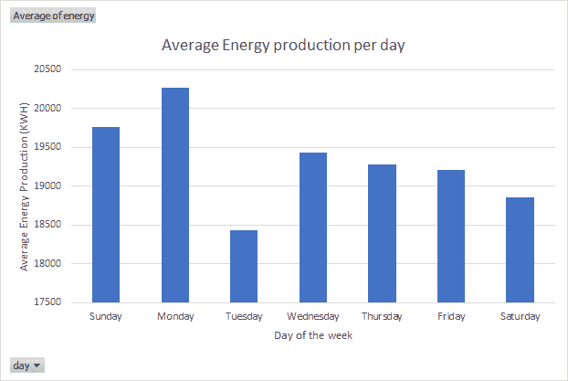

# 预测能源产量

> 原文：<https://towardsdatascience.com/predicting-energy-production-d18fabd60f4f?source=collection_archive---------58----------------------->

## 使用深度学习神经网络模型

作为为 [AI4IMPACT 的深度学习 Datathon 2020](https://ai4impact.org/dld.html?utm_source=Organization&utm_campaign=115423c0af-EMAIL_CAMPAIGN_2020_07_25_12_17_COPY_01&utm_medium=email&utm_term=0_74e63668fd-115423c0af-412311189) 创建的,**团队默认**创建了一个基于神经网络的深度学习模型，用于预测法国的能源生产需求。该模型是使用 Smojo 在 AI4IMPACT 创新的基于云的学习和模型部署系统上创建的。

我们的模型能够达到 0.131 的测试损失，这大大超过了 0.485 的持续性损失。

# 一些背景

随着全球能源市场变得越来越自由化，自由开放的市场已经看到了优化能源需求的上升和重要性。新的和现有的进入者转向数据和各种方法来预测能源消耗，希望能够获得利润。

这对于寻求转换和采用清洁/可再生能源发电以减少碳足迹、满足监管标准或干脆不投资碳捕获技术的国家尤其重要。因为太阳不会整天照耀，风也不会吹，所以预测能源需求比以往任何时候都更有助于防止短缺和停电。

> 随着人工智能(AI)和机器学习的出现，零售商和贸易商已经利用人工神经网络的潜力来优化能源需求，从而优化产量。

照片由 [Unsplash](https://unsplash.com?utm_source=medium&utm_medium=referral) 上的[khaméo Vilaysing](https://unsplash.com/@mahkeo?utm_source=medium&utm_medium=referral)拍摄

# 任务

> 我们项目的目标是**使用神经网络深度学习模型为我们的客户最大化利润**，该模型预测未来 18 小时的能源需求。

该模型将于 7 月 21 日至 7 月 29 日实时运行，在此期间，利润和排行榜排名将被实时跟踪。该模型将建立在 AI4IMPACT 开发的 AI 开发工具 Autocaffe 上。

> 我们的目标是获得 T+18 小时的能量预测，每小时**。目标是利用你的能源产量预测和给定的交易算法为你的客户实现利润最大化。**

**以下参数起作用:**

1.  **你的客户每向电网出售一千瓦时可获得 10 欧分。你只能向电网出售你对该日期的预测。**
2.  **如果实际发电量超过预测，超出部分将被电网吸收，但您的客户不会因此得到补偿。**
3.  **如果实际发电量低于预测，您必须从现货市场购买能源(每千瓦时 20 欧分)供应给电网。**

**前 18 个小时(称为“**热身**”)不进行任何交易。每小时预热后，您需要生成一个 T+18 小时的能源产量预测。这就是所谓的“交易期”。交易在周末和公共假日继续，24x7。交易在评估期结束时结束。**

**开始时你会得到 10，000，000 欧元**的现金。您需要在评估期结束时返还该金额。剩下的是你的客户的利润，这是你的工作最大化。****

# **数据**

**使用了 2 个数据集:风能产量和风速**

**风能生产的来源来自[法国能源传输管理局。](https://www.rte-france.com/)**

**近实时风能实际值来自 RTE 的在线数据库，我们将其平均并标准化为 1 小时的时基。**

*   **提供了从 2020 年 1 月 1 日到 2020 年 7 月 19 日每天和每小时的数据。**
*   **发电量值以千瓦时为单位。**
*   **数据集被标准化为 1 小时的值**

# **初步分析(季节性/趋势)**

## **总体趋势**

**以每日分辨率查看整个日期范围，我们可以拟合一条简单的递增多项式阶 2 线，并观察能量需求随时间的逐渐增加。**

****

**总体趋势**

## **月度趋势**

**按季度分析数据，我们发现不同的季度有不同的能源需求。趋势似乎是，它在第一季度(1 月、2 月和 3 月)达到最大值，并在其余月份持续下降，直到从第三季度开始增加到第二年的第一季度。**

****

**每月趋势**

## **每周趋势**

**以每周一次的分辨率检查数据，我们观察到了几周内能源需求的差异。通过计算一天的平均能量产出，我们注意到能量产出往往在周一最高，周二最低。**

**似乎趋势是能源需求在周二开始处于低位，周三增加，周六减少，然后在周日和周一增加。**

****

**每周趋势**

# **数据预处理**

**从下面的数据集可以看出，这些值具有季节性趋势，每年 11 月至 3 月期间产生的能量更多。此外，根据风电场信息，2017 年 8 月和 2019 年 7 月新增风电场。为了确保我们能够以最小的漂移获得足够大的数据集，我们决定从 2019 年 1 月 1 日到现在获取数据集。**

****

**随着时间推移产生的能量**

**我们只考虑从 2019 年 1 月 1 日开始的发电量数据的 3 位小数作为我们的第一列数据，并获取不同位置的风速值，计算风速的平均值作为我们的第二列数据。**

****

**smojo 配置**

**下图显示了从 2019 年 1 月 1 日开始的能源和风速图表。这两个变量之间有明显的密切相关性。可以作出的进一步推论是，在增加新的生产者之后，通常能量生产率更高。风向对发电量也没有太大的贡献，因此被忽略。**

****

**一段时间内的发电量和风速**

**使用 autocaffe，我们计算了所考虑的两个变量的统计数据。以下数据是用于两个变量标准化的值。我们还发现持续性值为 0.485，在开发我们的交易模型时，我们必须打破这个值。**

****

**数据集统计**

## **训练/测试分割**

**数据集的 70:30 训练/测试分割用于确保足够的训练。趋向于比率平衡的比率可能导致测试和进一步的新数据的欠拟合。**

## **利润基准**

**为了找出可获得的最大利润，我们采用了从 2019 年 1 月 1 日到现在产生的能量总和 x10 美分 x 0.3 来说明训练/测试分割。基准测试的原因将允许我们测试利润。我们在整个期间能够获得的最大利润将是 9.972E+08 美分。**

## **特征选择和模型构建流程**

**下面是团队为得出最终模型所经历的迭代过程的总结。下面详细介绍了各个迭代**

****

**模型迭代摘要**

## **#1 幼稚网络**

***击败比分:* 485 */击败利润:9.972E+08 欧分***

****

**型号#1 配置**

****

**模型#1 结果**

**首先，我们从一个简单的网络开始，用数据来测试我们的第一轮结果。该能量窗口包括从 T-24 到 T-0 小时平均值和标准偏差值的特征。风速窗口仅包括 T-0 到 T+18 小时的数据。我们的神经网络有 3 种不同的大小，分别是 32、64 和 128 个节点。我们选择的求解器类型是 Adam，在神经网络中有 3 个隐藏层。第一次运行将不包括超参数调整。**

**下面我们从第一次测试运行中获得的结果表明，我们的最佳测试损失是 0.388224。我们这次的利润总计为 3.354E8 欧分，这只是可获得的最大利润的 33.6%。我们的实际与测试预测图也非常分散，这很糟糕，因为这表明我们的模型不可靠且不准确。滞后峰值也在 18，这很糟糕。**

## **#2 更多功能**

***预期得分:0.38824 /预期利润:3.354E8 欧分***

****

**型号#2 配置**

****

**模型#2 结果**

**我们得出结论，可以向我们的模型中添加更多的特征，以确保更好的结果和准确性。因此，我们添加了更详细的特征，包括 T-24 至 T-0 小时的平均值和标准差、最小值和最大值、偏斜度、差异值以及更多来自能量的过去数据，如 T-168 至 T-0 小时和 T-336 至 T-0 小时的平均值、标准差和偏斜度值。**

**至于风速数据，我们包括了从 T+15 到 T+18 小时的未来值。到目前为止，网络还没有其他变化。记住之前最好的测试亏损 0.38824，盈利 3.354E8 欧分。运行新的模型，我们获得了更好的测试损失 0.137427，以及利润新高 6.514E8 美分，这是我们最大可能利润的 65.3%。至于我们的实际与测试预测图，我们可以看到 2 个值之间有更好的相关性，我们的滞后峰值为 0，这是一个好迹象，表明我们的模型正在改善。**

## **#3 超参数**

***预期得分:0.137427 /预期利润:6.514E8 欧分***

****

**型号#3 配置**

****

**模型#3 结果**

**基于上一个实验的知识，更多的隐藏层被添加到模型中。具体来说，添加了 0.01、0.001、0.0001 的辍学率，以减少训练数据集的过度拟合。类似地，添加 0.01、0.001 和 0.0001 的权重衰减值以减少过拟合。L2 正则化被包括以减少训练期间神经网络权重的量值。**

**获得的最佳测试损失为 0.135409，利润为 6.467E8，比之前的更差。我们注意到，实际数据和测试预测变得更加相关，滞后相关峰值略高。性能最好的设置是 NN-size = 256，dropout = 0.0001，decay = 0.001。**

## **#4 使用 2019 年 7 月的数据**

***预期得分:0.135409 /预期利润:6.514E8 欧分***

****

**模型#4 结果**

**接下来，我们重复了相同的神经网络配置，但仅使用 2019 年 7 月的**数据，结果如下图所示。运行该模型使我们获得了更好的测试损失，为 0.100719，超过了我们从 2019 年 1 月开始的数据集的测试损失。然而，我们从这款更新更近的车型中获得的利润仅为 2.439E8 欧分，仅为我们应实现的 8.016E8 欧分预期利润的 30.4%。****

## **#5 扩展**

***预期得分:0.100719 /预期利润:6.467E8 欧分***

****

**动量和力损失的预测结果**

**最后，我们测试了在模型上添加动量、力损失和自动编码器的概念。在附加动量和力损失的情况下，获得的最佳试验损失为 0.158881，利润为 6.157E8。我们观察到预测中的噪声增加，导致预测不太准确。**

****

**启用自动编码器的预测结果**

**在自动编码器下，最佳测试损失为 0.129414，利润为 6.647E8。这使得模型的训练时间明显延长，导致测试结果更加多样化。**

# **最终模型**

**我们的最终模型是一个简单的模型，它使用设置#3，重复 20 次，并采用最佳设置。**

**使用的特征包括 3 个时间框架的平均值、标准差、偏斜度和差异:T-24、T-168 和 T-336。此外，我们使用过去的数据来预测从 T-0 小时(T-0 到 T-18 小时)的未来 18 小时，并使用值对来表示从 T-(-24)到 T-0 的 18 个差异。这导致模型中总共有 14 个独立的特征。**

**该模型具有以下特点:**

****

**最终模型配置**

# **决赛成绩**

**最终模型的最终测试损失为 0.132 欧元，利润为 6.501 欧分。作为对比，持续性损失= 0.485，盈利基准= 9.972E+08。模型的训练和测试损失、实际和测试预测以及滞后相关图如下所示。**

****

**最终模型结果**

# **进一步的潜在改进**

1.  **利用额外特征，如风向**

**虽然我们试图保持输入的准确性并符合我们的直觉，但将风向作为额外输入的潜力可能会被证明是有用的。​**

**2.配置**

**测试了进一步的改进，并偏离了之前的配置；当观察到一个普遍趋势时，团队就去追求它，而不考虑另一个完全不同的设置。​**

**类似于神经元权重的“随机初始化”的想法，该团队可以“初始化”一个新的起点，这可以提供前所未有的洞察力。​**

**3.附加原始数据**

**如果对 2019 年之前最初被忽略的数据进行进一步清理和归一化，以符合 2019 年及以后的数据的相同归一化范围，则可以利用这些数据。有了更多的数据，模型会学得更好。​**

**​**

# **总结和回顾**

**该团队认为，复杂的模型不一定等同于更好的结果，因为它可能倾向于陷入次优解决方案。因此，我们的方法从一个直观的简单模型开始，并通过分析趋势和试错法建立在它的基础上。毕竟，一个我们可以理解的模型是可以客观而非盲目改进的。**

**凭借目前良好的结果，我们满怀信心地进入现场测试阶段。**

# **认识团队:)**

 **[## 许伟文-企业联络主任-南洋理工大学学生会

### 目前就读于南洋理工大学(NTU)，攻读机械工程学士学位，辅修…

www.linkedin.com](https://www.linkedin.com/in/koh-wei-wen-927044120/)**  **[## Anders Choo -新加坡南洋理工大学| LinkedIn

### 在全球最大的职业社区 LinkedIn 上查看安德斯·周的个人资料。安德斯的教育列在…

www.linkedin.com](https://www.linkedin.com/in/anders-choo/)** ** [## Gabriel Tan -新加坡国立大学学生大使| LinkedIn

### 查看 Gabriel Tan 在全球最大的职业社区 LinkedIn 上的个人资料。加布里埃尔有 4 份工作列在他们的…

linkedin.com](http://linkedin.com/in/gabriel-tan-223a631a0)  [## 韩德-大数据实习生-雷蛇公司| LinkedIn

### 在世界上最大的职业社区 LinkedIn 上查看韩德·c 的个人资料。韩德有一份工作列在他们的…

www.linkedin.com](https://www.linkedin.com/in/dehan-c-948045177/) 

# 这里还有一篇文章给你！

 [## 用 python 创建一个垃圾短信分类器

### 使用 scikit 的自然语言处理基础-学习

towardsdatascience.com](/create-a-sms-spam-classifier-in-python-b4b015f7404b)**