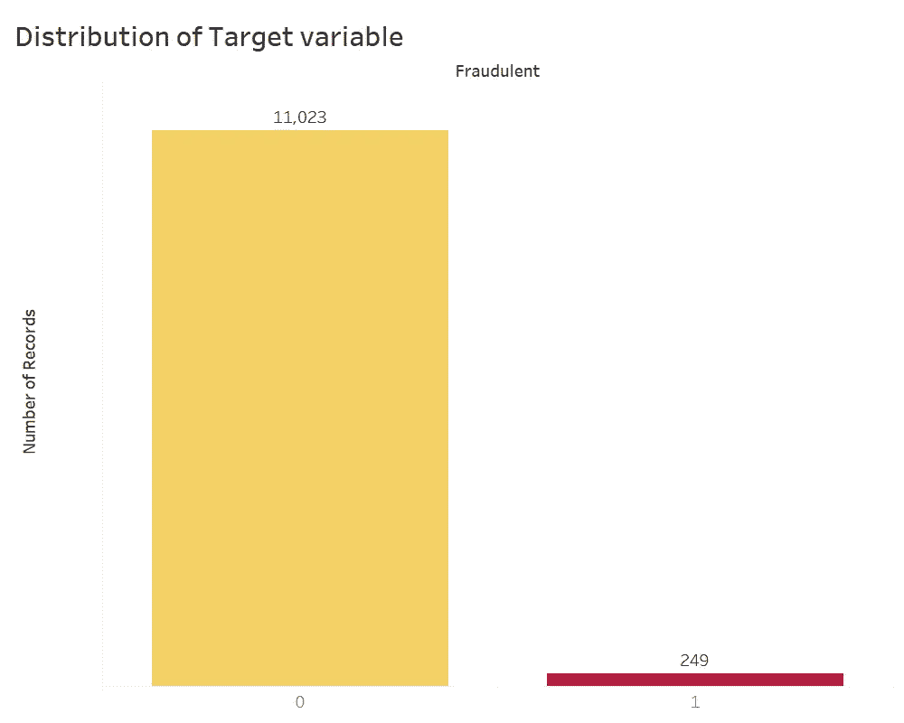
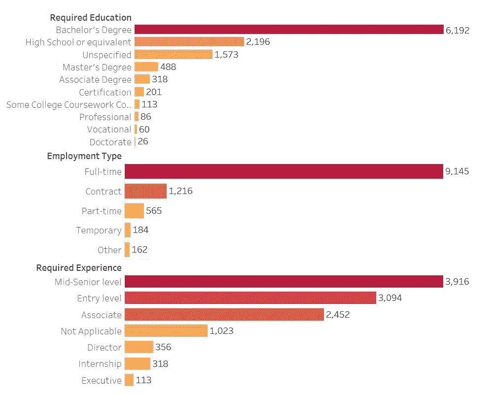
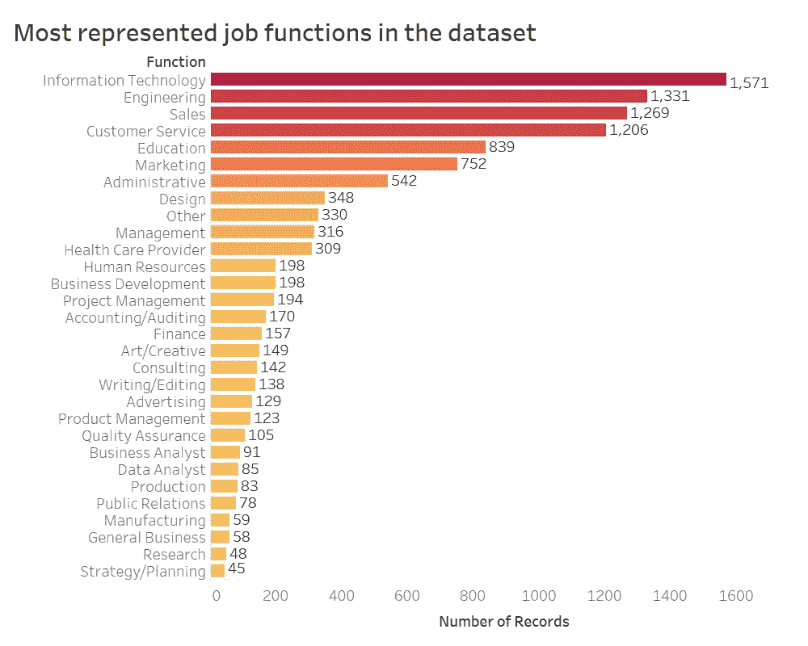
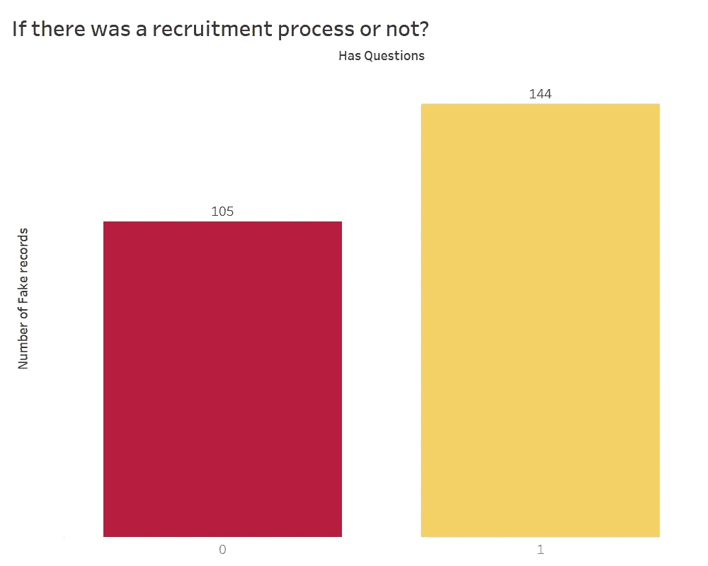

# 预测虚假招聘信息—第 1 部分(探索性分析)

> 原文：<https://towardsdatascience.com/predicting-fake-job-postings-part-1-data-cleaning-exploratory-analysis-1bccc0f58110?source=collection_archive---------28----------------------->

当心这种虚假的“现在招聘”标志

由于新冠肺炎·疫情对各大洲的经济造成损害，我们正生活在一个前所未有的时代。失业率每天都在增加，据美国报道，约有 2600 万人申请失业救济，这是其漫长历史上的最高记录，英国有数百万人被解雇，世界各地有数千人被解雇。以下是联合国副秘书长阿米娜·穆罕默德的一句话，用一句话概括了当前的形势。

> 正当世界全力应对疫情新冠肺炎冠状病毒前所未有的影响时，我们正面临一场前所未有的人道主义危机，我们的社会结构和凝聚力正面临压力。

在这个绝望的时代，成千上万的人在寻找工作，这为网络骗子利用他们的绝望情绪提供了一个绝佳的机会。我们看到这些虚假的招聘信息每天都在增加，这些信息看起来很合理，通常这些公司也会有一个网站，他们的招聘流程与业内其他公司相似。

如果一个人足够努力，他们可以发现这些假帖子和真帖子之间的差异。大多数情况下，这些帖子上没有公司的标志，公司的第一反应是来自一个非官方的电子邮件帐户，或者在面试中，他们可能会要求您提供个人机密信息，如您的信用卡信息，说他们需要这些信息进行人员验证。在正常的经济条件下，所有这些都是公司可疑之处的明显暗示，但这不是正常的经济条件。这是我们一生中见过的最糟糕的时期，在这个时候，绝望的人只需要一份工作，这样，这些人就直接落入了这些骗子的手中。以下是丹尼尔·林斯基的一段话，他是波士顿警察局的前局长

> 警察部门没有调查这些事件的资源，在联邦当局介入之前，这必须是一个数百万美元的诈骗，所以骗子们只能继续逍遥法外。

通过这两部分的系列媒体文章，我希望让求职者意识到这一问题的严重性，以及如何通过机器学习模型来预测一个职位发布是否具有欺诈性。在本系列的第 1 部分，我将探索这些数据，并深入了解哪些行业受到的影响更大，以及哪些关键的危险信号会泄露这些虚假帖子。在第二部分，我将应用机器学习模型来预测我们如何检测这些伪造的帖子。

我将在分析中使用的数据是由爱琴海大学信息与通信系统安全实验室([http://emscad.samos.aegean.gr/](http://emscad.samos.aegean.gr/))编制的 18000 份工作描述的数据集。这个数据集包含 800 个虚假的职位描述。

## 数据集具有以下变量:

1.  标题:招聘广告条目的标题。
2.  位置:招聘广告的地理位置。
3.  部门:法人部门。
4.  薪金 _ 范围:指示性薪金范围。
5.  Company_profile:简要的公司描述。
6.  描述:招聘广告的详细内容。
7.  要求:空缺职务的登记要求。
8.  福利:由雇主提供的福利。
9.  远程办公:适用于远程办公的职位。
10.  Has_company_logo:如果公司徽标存在，则为 True。
11.  Has_questions:如果存在筛选问题，则为 True。
12.  就业 _ 类型:全职、兼职、合同等。
13.  要求 _ 经验:高管、入门级、实习生等。
14.  要求 _ 学历:博士、硕士、学士等。
15.  行业:汽车、IT、医疗保健、房地产等。
16.  职能:咨询、工程、研究、销售等。
17.  欺诈性的(目标变量):如果是假的，则为 1，否则为 0。

# 数据清理

我在我的系统上导入了 Jupyter 笔记本上的数据，并在 Python 3 上工作。由于我希望这一部分更多的是关于洞察力而不是代码，所以我没有在这里附上任何代码要点，但是任何对查看数据清理代码感兴趣的人都可以随意查看我的 GitHub 库—【https://github.com/sharad18/Fake_Job_Posting 

最初的数据集包含 18，000 个帖子。清理后，新数据有大约 11，000 个帖子。在本系列的第 2 部分，我将研究机器学习模型来预测哪些帖子可能是假的。我将干净的数据导入到 Tableau 中进行探索性分析，这将在下一节中详细描述。

# 探索性分析

## 目标变量的分布

我们首先需要看的是数据的分布，这是非常不平衡的，只有 249 个虚假发布，涉及 11，023 个良好的职位发布，这是预计会出现这样的问题。欺诈性的广告张贴很普遍，但数量上超过了真正的广告。这些招聘广告已经发布在 LinkedIn、Glassdoor 和其他求职网站上，这些网站都有其欺诈检测团队。该数据集通过这些网站的高精度算法发现隐藏得很好的虚假网站。

非常不平衡的目标变量

## 数据集中其他变量的分布

在下图中，我们看到了要求的教育程度、就业类型和要求的经验等变量的分布。对于第一个变量，我们可以看到数据中的大多数代表是高中毕业生和大学毕业生，这在当前每个公司都在削减成本的情况下是可以理解的。最残忍的方法是解雇比大多数人挣得多的人，用级别较低的人取代他们。从这里，我们可以得到一个年龄组的估计，可能在 20 岁到 35 岁之间。此外，研究生级别的工作和博士级别的工作数量较少，这表明求职者受教育程度越高，他们对某个角色的要求就越复杂，因此与受教育程度较低的人相比，为他们创建工作岗位具有挑战性。

中高级职位在数据集中最常见。

第二幅图更符合一个共识，即在任何时候，对全职职位的需求总是比临时职位多，因为对公司来说，长期投资于个人仍是更好的投资。

在不止一个场景中，最后一个情节与第一个情节相矛盾。要求学历是大专学历，但要求经验是中高级水平。这表明，对于任何角色来说，过去在特定行业或企业界的技能都比教育更受重视。一个典型的刻板印象是，对于高级职能来说，研究生学位是必须的，但数据并不同意这一点。大多数高管都是通过网络招聘的，这一数据与此相符，因为这是发布招聘广告最不需要的经历。

## 工作职能和行业分布

接下来，我们将看看哪些工作职能和行业最容易受到骗子的攻击。在下图中，我们看到像信息技术和工程这样的技术功能位于顶部，随后是销售和客户服务。由于大部分招聘信息都围绕这些工作职能，他们最容易受到虚假招聘信息的影响。随着我们往下看，我们看到功能变得越来越具体，因此，欺骗这些人变得越来越困难，因为这些功能对他们的行业来说是如此的特殊。

信息技术和工程主宰了招聘信息。

在接下来的情节中，我们可以看到前面结果的延续。像 IT、计算机软件和互联网这样的技术行业在招聘信息中占主导地位。这两个数字清楚地表明，专业工作最容易受到这种虚假职位的影响，因为目前这些人的需求很大。即使有这么多的招聘信息，供应仍然少于市场，这就创造了一个完美的局面，骗子可以介入并剥削这些求职者。

排名前三的行业都是技术性的。

## 虚假招聘信息分析

在接下来的章节中，我们将深入分析这些虚假招聘广告的一些特殊特征，这些特征将它们与官方招聘广告区分开来。区分这两者的关键之一是招聘过程。

45%的招聘广告没有经过任何招聘程序

左图显示，45%的欺诈案例甚至没有面试。这是这些骗局中最大的漏洞，一份工作没有经过任何筛选就被提供了。在大多数情况下，工作邀请之后会询问银行或信用卡详细信息等机密信息，这是这些虚假招聘信息欺骗你的主要方式。

在下图中，查看在没有筛选过程的情况下，这些骗子瞄准的经验水平。这些骗子通常以入门级工作的求职者为目标。这些大多是应届大学毕业生，他们正在寻找自己在行业中的第一个角色，而当前的经济形势，最容易成为骗子的目标。随着我们级别的降低，资历级别增加，这表明随着个人获得更多的经验，他们可以区分假职位和真职位。

入门级的工作最容易被骗子盯上

## 虚假招聘广告的地理分布

在这里，我们可以看到这些假币是如何在世界各地传播的。我们知道美国的病例最多。这种情况是如此之多，以至于它让世界其他地方黯然失色，不得不创造一个独立的数字。在第二幅图中，我们可以看到英国、加拿大、印度和澳大利亚也有大量此类骗子。

美国的虚假招聘数量最多。

在上图中，我们看到美国是欺诈案件最多的国家，其次是英国。接下来，我们将在城市一级看到更全面的分析。即使在美国，东海岸比西海岸更频繁，这与我们早期的发现相矛盾。我们看到，最脆弱的行业是技术行业，它集中在美国西部，但大多数欺诈案件都发生在对面的海岸。英国和欧洲其他地区的主要金融和技术中心也有大量此类索赔。印度、东南亚和澳大利亚的主要中心遵循同样的模式。

美国城市占据了虚假招聘的主导地位。

## 词云可视化

在这里，创建了欺诈性职位发布和非欺诈性职位发布的两个词云。我们可以从这两个词云中看到的一个区别是，非欺诈词云对所做的工作有更具体的要求和描述。在欺诈类中，最常见的词是无处不在的词，这些词不能反映工作是关于什么的，需求是什么，只是围绕着一般的概念。这些广告大多很好地运用了文字游戏。LinkedIn 和 Glassdoor 等网站上的过滤器通常会搜索这些通用术语，而不是特定术语，因此这些帖子有时会通过这些网站的欺诈检测算法。这些发现让我们得出结论，也许仅仅是职位描述并不是一个很好的预测变量，我们需要更多的信息。

虚假招聘信息的 Word cloud。

因此，诸如招聘流程、公司标志、广告的在线位置等信息，以及围绕该招聘信息的许多此类外部因素变得至关重要，无法从职位描述中推断出来。在本系列的第 2 部分中，我将更仔细地研究这些变量，以及它们如何影响这个问题的预测性能。

真实招聘信息的 Word cloud。

在这一部分中，我们看到了一个深入的探索性分析，即假职位与真职位有何不同。在当前的经济形势下，我理解尽快找到工作的绝望，但我们需要对这种骗子的损失有所不同。这个问题是求职群体的道德责任，如果发现此类虚假招聘信息，他们应该互相帮助并向有关部门举报。

在当前的经济环境下，虚假招聘是一个严重的问题。随着情况的恶化，我们可以看到越来越多的这种欺诈性帖子到处涌现。我在这篇文章中提出了这个问题的一些趋势和分析，我希望这有助于你下次申请下一份工作时更加注意。

下一部分，我会开发一个机器学习算法，把职位描述作为输入，预测是不是假的。所以非常感谢你看完这一部分，敬请期待下一篇！

# 参考资料:

[https://www . the balances careers . com/list-of-fake-job-scam-examples-2062 168](https://www.thebalancecareers.com/list-of-fake-job-scam-examples-2062168)

[https://www . weforum . org/agenda/2020/04/新冠肺炎-行动-呼叫-8-apr/](https://www.weforum.org/agenda/2020/04/covid-19-action-call-8-apr/)

# 作者注:

你可以在 LinkedIn 上联系我—【https://www.linkedin.com/in/sharad-jain/ 